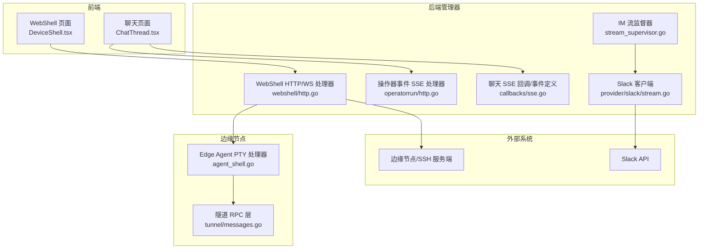
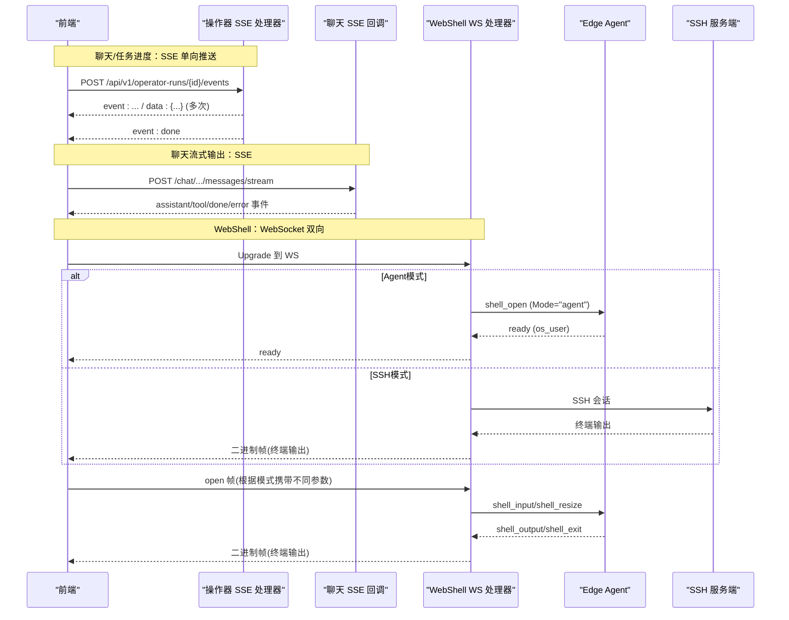
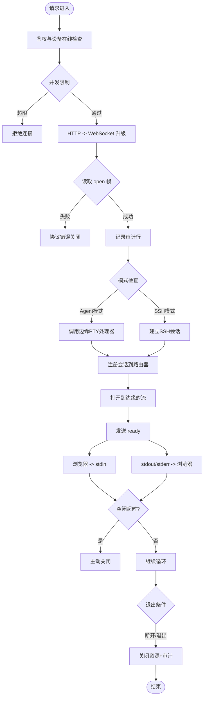
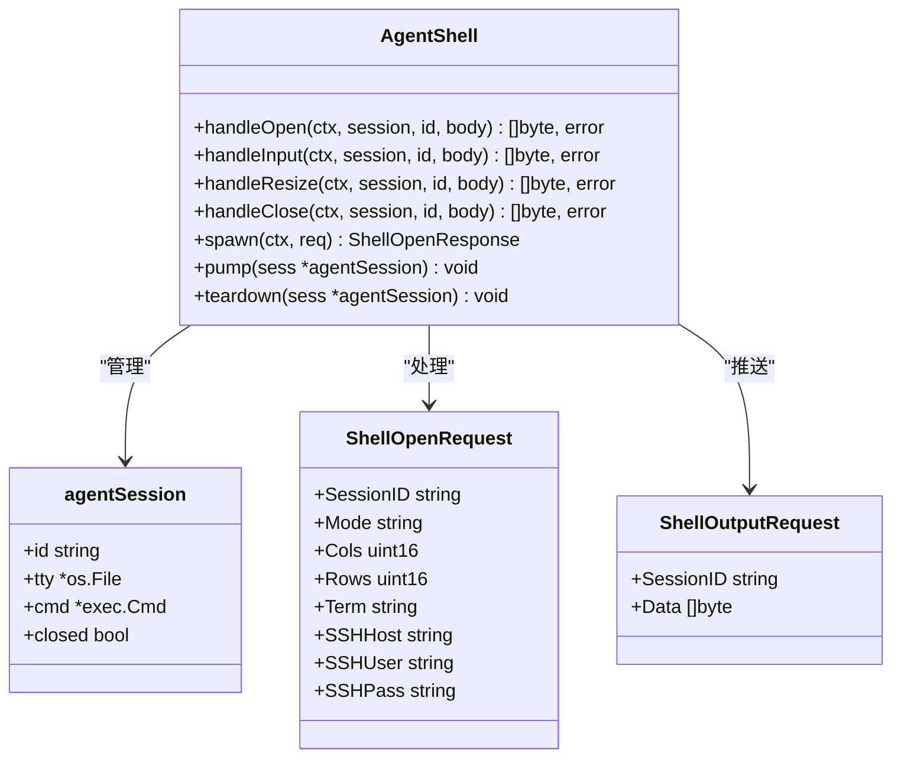
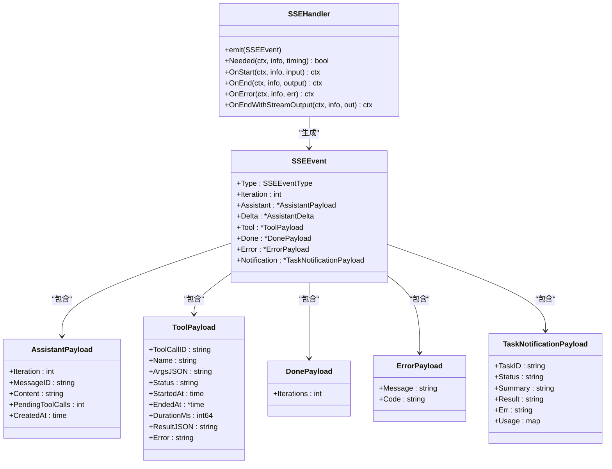
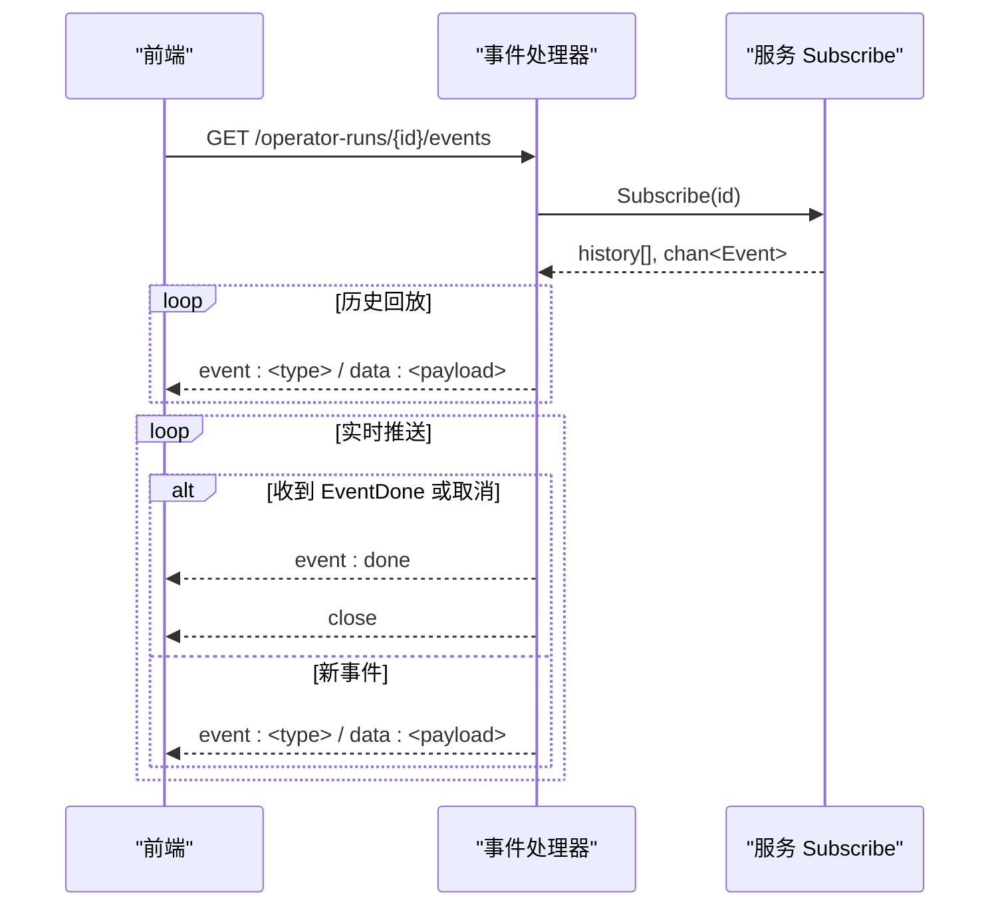
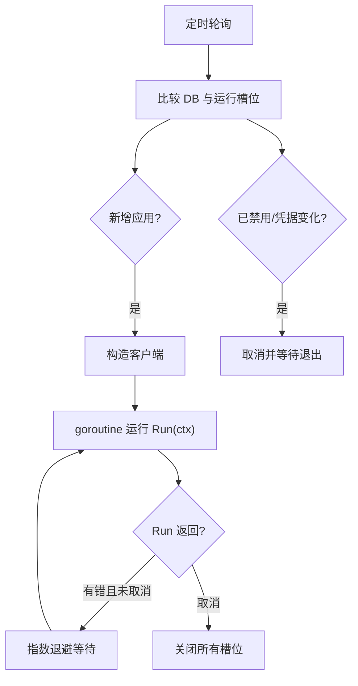
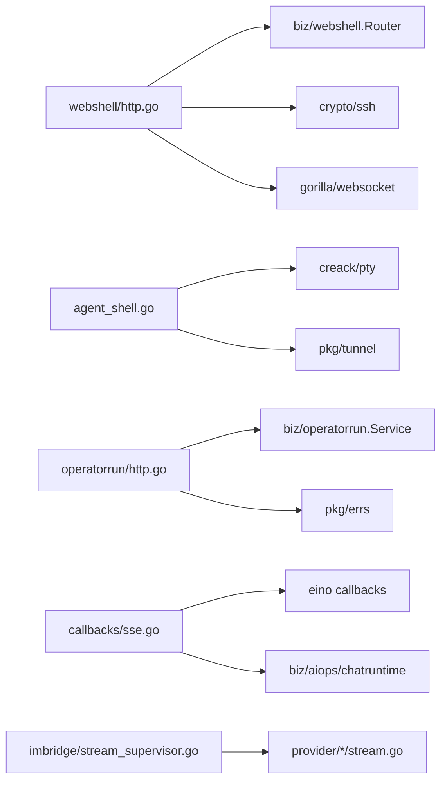

# 实时通信

<cite>
**本文引用的文件**
- [internal/manager/server/webshell/http.go](file://internal/manager/server/webshell/http.go)
- [web/src/pages/DeviceShell.tsx](file://web/src/pages/DeviceShell.tsx)
- [web/src/api/webshell.ts](file://web/src/api/webshell.ts)
- [internal/manager/server/operatorrun/http.go](file://internal/manager/server/operatorrun/http.go)
- [internal/manager/biz/aiops/graph/callbacks/sse.go](file://internal/manager/biz/aiops/graph/callbacks/sse.go)
- [internal/manager/biz/imbridge/stream_supervisor.go](file://internal/manager/biz/imbridge/stream_supervisor.go)
- [internal/manager/biz/imbridge/provider/slack/stream.go](file://internal/manager/biz/imbridge/provider/slack/stream.go)
- [web/src/api/chat.ts](file://web/src/api/chat.ts)
- [web/src/pages/ChatThread.tsx](file://web/src/pages/ChatThread.tsx)
- [internal/edgeagent/webshell/agent_shell.go](file://internal/edgeagent/webshell/agent_shell.go)
- [internal/pkg/tunnel/messages.go](file://internal/pkg/tunnel/messages.go)
- [docs/requirements/PRD-005-webssh-agent-mode.md](file://docs/requirements/PRD-005-webssh-agent-mode.md)
</cite>

## 更新摘要
**所做更改**
- 新增Edge Agent直连模式的详细技术说明
- 更新WebSSH连接架构，包含传统SSH模式和Agent模式
- 添加PTY会话管理和边缘端处理逻辑
- 扩展协议定义和RPC消息格式
- 更新前端UI组件以支持模式选择
- 增强安全模型和权限控制说明

## 目录
1. [简介](#简介)
2. [项目结构](#项目结构)
3. [核心组件](#核心组件)
4. [架构总览](#架构总览)
5. [详细组件分析](#详细组件分析)
6. [依赖关系分析](#依赖关系分析)
7. [性能考量](#性能考量)
8. [故障排查指南](#故障排查指南)
9. [结论](#结论)
10. [附录](#附录)

## 简介
本技术文档聚焦于项目的实时通信能力，涵盖 WebSocket 与 Server-Sent Events（SSE）的连接管理、消息收发、断线重连、事件类型与消息格式规范、数据处理流程、连接池与资源清理、错误处理与异常恢复策略，以及典型使用示例（实时聊天、任务进度跟踪、状态同步）和性能监控与调试方法。

**最新更新**：新增Edge Agent直连模式，为WebSSH提供无需OS级SSH凭据的直接终端访问能力，通过PTY会话管理和边缘端代理模式实现更灵活的终端接入方案。

## 项目结构
本项目在"管理器"侧提供两类实时通道：
- WebSocket：用于 WebSSH（设备终端）的交互式双向通信，支持两种连接模式
- SSE：用于聊天流式输出、操作器运行事件等单向推送场景

此外，内部 IM 桥接子系统通过长连接（WebSocket）接入第三方平台（如 Slack），并由统一的生命周期监督器管理。

**图表来源**
- [web/src/pages/DeviceShell.tsx:190-305](file://web/src/pages/DeviceShell.tsx#L190-L305)
- [internal/manager/server/webshell/http.go:154-363](file://internal/manager/server/webshell/http.go#L154-L363)
- [internal/edgeagent/webshell/agent_shell.go:1-325](file://internal/edgeagent/webshell/agent_shell.go#L1-L325)
- [internal/pkg/tunnel/messages.go:102-184](file://internal/pkg/tunnel/messages.go#L102-L184)

**章节来源**
- [web/src/pages/DeviceShell.tsx:190-305](file://web/src/pages/DeviceShell.tsx#L190-L305)
- [internal/manager/server/webshell/http.go:154-363](file://internal/manager/server/webshell/http.go#L154-L363)
- [internal/edgeagent/webshell/agent_shell.go:1-325](file://internal/edgeagent/webshell/agent_shell.go#L1-L325)
- [internal/pkg/tunnel/messages.go:102-184](file://internal/pkg/tunnel/messages.go#L102-L184)

## 核心组件
- **WebShell WebSocket 处理器**：负责浏览器到 SSH 的双向数据桥接、会话审计、并发限制、空闲超时与优雅关闭，支持传统SSH模式和Agent直连模式
- **Edge Agent PTY 处理器**：边缘端PTY会话管理，直接启动终端进程，无需OS级SSH凭据
- **操作器运行事件 SSE 处理器**：以 text/event-stream 推送任务执行事件，支持历史回放与完成终止
- **聊天 SSE 回调与事件模型**：定义 assistant/tool/done/error/task_notification 等事件类型及载荷，供上层 SSE 渲染
- **IM 流监督器**：统一管理各提供商的长连接生命周期，具备指数退避重连与凭据轮换重启能力
- **前端 SSE/WS 客户端**：聊天页面向后端发起 SSE 流并解析事件；WebShell 建立 WS 连接并发送首帧握手，支持模式选择

**章节来源**
- [internal/manager/server/webshell/http.go:154-363](file://internal/manager/server/webshell/http.go#L154-L363)
- [internal/edgeagent/webshell/agent_shell.go:69-86](file://internal/edgeagent/webshell/agent_shell.go#L69-L86)
- [internal/manager/server/operatorrun/http.go:107-151](file://internal/manager/server/operatorrun/http.go#L107-L151)
- [internal/manager/biz/aiops/graph/callbacks/sse.go:16-147](file://internal/manager/biz/aiops/graph/callbacks/sse.go#L16-L147)

## 架构总览
下图展示了从前端到后端的实时通信主路径：聊天通过 SSE 获取流式响应；WebShell 通过 WebSocket 进行双向交互，支持两种连接模式；IM 桥接通过长连接维持与第三方平台的通信。

**图表来源**
- [internal/manager/server/operatorrun/http.go:107-151](file://internal/manager/server/operatorrun/http.go#L107-L151)
- [internal/manager/server/webshell/http.go:389-465](file://internal/manager/server/webshell/http.go#L389-L465)
- [internal/edgeagent/webshell/agent_shell.go:93-135](file://internal/edgeagent/webshell/agent_shell.go#L93-L135)

## 详细组件分析

### WebShell WebSocket 连接管理
- **连接建立**：HTTP 升级至 WebSocket，校验租户上下文与设备在线状态，限制用户/设备并发会话数
- **握手协议**：客户端需在 10 秒内发送首个文本帧 open，支持两种模式：
  - **Agent模式**：mode="agent"，无需OS凭据，边缘端直接启动PTY
  - **SSH模式**：mode="ssh"或空，需要ssh_user/ssh_pass，通过SSH客户端连接
- **数据通道**：后续二进制帧作为 stdin 写入会话；stdout/stderr 以二进制帧回推；文本帧用于 resize/close 控制
- **资源清理**：会话注册到路由器，退出时记录审计信息（输入/输出字节、退出码、终止原因）；空闲超时自动关闭
- **错误处理**：认证失败、会话创建失败、SSH 错误均返回友好提示并正常关闭连接

**更新**：新增Agent模式支持，边缘端直接管理PTY会话，提供更灵活的终端接入方式

**图表来源**
- [internal/manager/server/webshell/http.go:154-363](file://internal/manager/server/webshell/http.go#L154-L363)
- [internal/manager/server/webshell/http.go:389-465](file://internal/manager/server/webshell/http.go#L389-L465)

**章节来源**
- [internal/manager/server/webshell/http.go:154-363](file://internal/manager/server/webshell/http.go#L154-L363)
- [internal/manager/server/webshell/http.go:389-465](file://internal/manager/server/webshell/http.go#L389-L465)
- [web/src/pages/DeviceShell.tsx:190-305](file://web/src/pages/DeviceShell.tsx#L190-L305)
- [web/src/api/webshell.ts:1-29](file://web/src/api/webshell.ts#L1-L29)

### Edge Agent PTY 会话管理
**新增功能**：Edge Agent直连模式的核心组件，提供无需OS级SSH凭据的终端访问能力

- **PTY会话生命周期**：管理PTY进程的创建、输入输出处理、窗口大小调整、进程终止和资源清理
- **会话限制**：每边缘节点最多5个并发PTY会话，防止资源耗尽攻击
- **主机策略控制**：通过环境变量 `ONGRID_EDGE_AGENT_SHELL_DISABLED` 动态控制Agent模式开关
- **安全模型**：PTY进程以边缘进程用户身份运行（通常为root），复用平台账号体系进行鉴权和审计
- **协议扩展**：实现shell_open、shell_input、shell_resize、shell_close四个RPC处理器

**图表来源**
- [internal/edgeagent/webshell/agent_shell.go:51-67](file://internal/edgeagent/webshell/agent_shell.go#L51-L67)
- [internal/pkg/tunnel/messages.go:114-135](file://internal/pkg/tunnel/messages.go#L114-L135)

**章节来源**
- [internal/edgeagent/webshell/agent_shell.go:1-325](file://internal/edgeagent/webshell/agent_shell.go#L1-L325)
- [internal/pkg/tunnel/messages.go:102-184](file://internal/pkg/tunnel/messages.go#L102-L184)

### 聊天 SSE 事件模型与推送流程
- **事件类型**：assistant_start、assistant_delta、assistant_end、tool_start、tool_end、done、error、task_notification
- **载荷结构**：assistant/tool/done/error/notification 各有明确字段，便于前端增量渲染与状态收敛
- **推送实现**：回调处理器将图执行事件转换为 SSEEvent，并通过发射器写入 SSE 响应；前端按 event/data 行解析并分发
- **兼容层**：运行时适配器将新事件名映射为旧事件名，保证前端无感知切换

**图表来源**
- [internal/manager/biz/aiops/graph/callbacks/sse.go:16-147](file://internal/manager/biz/aiops/graph/callbacks/sse.go#L16-L147)

**章节来源**
- [internal/manager/biz/aiops/graph/callbacks/sse.go:16-147](file://internal/manager/biz/aiops/graph/callbacks/sse.go#L16-L147)
- [web/src/api/chat.ts:247-361](file://web/src/api/chat.ts#L247-L361)
- [web/src/pages/ChatThread.tsx:105-179](file://web/src/pages/ChatThread.tsx#L105-L179)

### 操作器运行事件 SSE
- **端点**：GET /api/v1/operator-runs/{id}/events 返回 text/event-stream
- **行为**：先回放历史事件，再订阅实时事件；遇到 EventDone 或上下文取消则结束
- **编码**：event: 名称 + data: JSON 载荷，逐条 flush

**图表来源**
- [internal/manager/server/operatorrun/http.go:107-151](file://internal/manager/server/operatorrun/http.go#L107-L151)
- [internal/manager/server/operatorrun/http.go:210-224](file://internal/manager/server/operatorrun/http.go#L210-L224)

**章节来源**
- [internal/manager/server/operatorrun/http.go:107-151](file://internal/manager/server/operatorrun/http.go#L107-L151)
- [internal/manager/server/operatorrun/http.go:210-224](file://internal/manager/server/operatorrun/http.go#L210-L224)

### IM 长连接管理与重连
- **监督器**：周期性对比数据库中的启用应用列表与当前运行槽位，新增启动、禁用停止、凭据轮换重启
- **重连策略**：对每个 provider 的 Run 调用封装指数退避重试，最大退避上限保护
- **心跳保活**：部分 SDK（如 Slack）需要 ping 保活以避免空闲断开

**图表来源**
- [internal/manager/biz/imbridge/stream_supervisor.go:80-160](file://internal/manager/biz/imbridge/stream_supervisor.go#L80-L160)
- [internal/manager/biz/imbridge/stream_supervisor.go:162-201](file://internal/manager/biz/imbridge/stream_supervisor.go#L162-L201)
- [internal/manager/biz/imbridge/provider/slack/stream.go:90-120](file://internal/manager/biz/imbridge/provider/slack/stream.go#L90-L120)

**章节来源**
- [internal/manager/biz/imbridge/stream_supervisor.go:80-160](file://internal/manager/biz/imbridge/stream_supervisor.go#L80-L160)
- [internal/manager/biz/imbridge/stream_supervisor.go:162-201](file://internal/manager/biz/imbridge/stream_supervisor.go#L162-L201)
- [internal/manager/biz/imbridge/provider/slack/stream.go:90-120](file://internal/manager/biz/imbridge/provider/slack/stream.go#L90-L120)

### 前端实时通信实现要点
- **聊天 SSE**：POST 流式接口，设置 Accept: text/event-stream，逐块读取并按 \n\n 分割帧，解析 event/data 并分发到回调
- **WebShell WS**：附加 token 查询参数，指定子协议，建立连接后发送 open 帧，监听 beforeunload 做礼貌关闭
- **模式选择**：ConnectModal组件提供Agent模式和SSH模式选择，默认使用Agent模式
- **页面状态**：聊天页维护消息列表、工具卡片、审批卡片，并在 SSE 流中增量更新，避免滚动抖动

**更新**：新增Agent模式的前端支持，用户可以选择无需凭据的直接连接方式

**章节来源**
- [web/src/api/chat.ts:247-361](file://web/src/api/chat.ts#L247-L361)
- [web/src/pages/ChatThread.tsx:105-179](file://web/src/pages/ChatThread.tsx#L105-L179)
- [web/src/pages/DeviceShell.tsx:190-305](file://web/src/pages/DeviceShell.tsx#L190-L305)
- [web/src/api/webshell.ts:1-29](file://web/src/api/webshell.ts#L1-L29)

## 依赖关系分析
- **WebShell 依赖**：gorilla/websocket、golang.org/x/crypto/ssh、业务路由与审计模块
- **Edge Agent 依赖**：creack/pty库用于PTY管理，tunnel客户端用于RPC通信
- **操作器 SSE 依赖**：chi 路由、业务服务 Subscribe 接口、统一错误码转换
- **聊天 SSE 依赖**：eino 回调框架、持久化链、运行时适配层
- **IM 监督器 依赖**：各 Provider 的 StreamClient 实现、数据库仓库接口

**图表来源**
- [internal/manager/server/webshell/http.go:13-40](file://internal/manager/server/webshell/http.go#L13-L40)
- [internal/edgeagent/webshell/agent_shell.go:18-32](file://internal/edgeagent/webshell/agent_shell.go#L18-L32)
- [internal/manager/server/operatorrun/http.go:4-17](file://internal/manager/server/operatorrun/http.go#L4-L17)
- [internal/manager/biz/aiops/graph/callbacks/sse.go:3-14](file://internal/manager/biz/aiops/graph/callbacks/sse.go#L3-L14)

**章节来源**
- [internal/manager/server/webshell/http.go:13-40](file://internal/manager/server/webshell/http.go#L13-L40)
- [internal/edgeagent/webshell/agent_shell.go:18-32](file://internal/edgeagent/webshell/agent_shell.go#L18-L32)
- [internal/manager/server/operatorrun/http.go:4-17](file://internal/manager/server/operatorrun/http.go#L4-L17)
- [internal/manager/biz/aiops/graph/callbacks/sse.go:3-14](file://internal/manager/biz/aiops/graph/callbacks/sse.go#L3-L14)

## 性能考量
- **连接与并发限制**：WebShell 对用户和设备维度设置并发上限，防止资源耗尽
- **PTY会话限制**：Edge Agent每节点最多5个并发PTY会话，防止fork炸弹攻击
- **空闲超时**：长时间无输入的会话自动关闭，释放 SSH 会话与 WS 连接
- **SSE 流式输出**：按事件逐条 flush，降低首包延迟；前端分块解析，避免大缓冲
- **重连退避**：IM 长连接采用指数退避，避免雪崩；最大退避上限保护系统
- **资源清理**：会话退出时统一关闭 SSH/Stream/WS，审计写入完整统计信息

**更新**：新增PTY会话的资源管理和限制机制，确保边缘节点的稳定性

## 故障排查指南
- **网络异常**：
  - WS 升级失败：检查鉴权、跨域与子协议匹配；查看日志中的 upgrade 错误
  - SSE 连接中断：确认 Keep-Alive 与代理配置；前端需支持断线重连与幂等处理
- **服务端错误**：
  - 设备离线：WebShell 会返回不可用状态；检查设备在线状态与边缘可达性
  - SSH 认证失败：返回友好错误并关闭；核对凭据与目标主机密钥策略
  - **Agent模式错误**：检查边缘节点是否支持Agent模式，环境变量是否正确配置
  - **PTY会话失败**：查看边缘端PTY创建日志，检查系统资源和权限
  - 操作器事件：关注 EventDone 与 error 事件；根据 code 定位问题
- **客户端错误**：
  - 首帧缺失或格式错误：WS 会在超时后关闭；确保前端在连接后立即发送 open 帧
  - SSE 解析失败：忽略未知事件；检查 event/data 行是否符合规范
  - **模式选择错误**：确认选择的连接模式与目标环境匹配
- **调试建议**：
  - 开启详细日志：记录连接建立、事件类型、错误堆栈与耗时
  - 抓包与指标：结合网络抓包与服务器指标观察吞吐、延迟与错误率
  - **边缘端调试**：检查Agent模式的环境变量配置和PTY进程状态

**更新**：新增Agent模式相关的故障排查指导

**章节来源**
- [internal/manager/server/webshell/http.go:154-363](file://internal/manager/server/webshell/http.go#L154-L363)
- [internal/manager/server/operatorrun/http.go:210-260](file://internal/manager/server/operatorrun/http.go#L210-L260)
- [web/src/api/chat.ts:247-361](file://web/src/api/chat.ts#L247-L361)

## 结论
本项目通过 WebSocket 与 SSE 两种机制实现了高可用的实时通信：
- **WebSocket** 用于强交互场景（WebShell），具备严格的握手协议、并发控制与资源清理，现支持传统SSH模式和Agent直连模式两种连接方式
- **SSE** 用于单向推送（聊天、任务事件），具备稳定的事件模型与流式传输
- **IM 长连接** 由统一监督器管理，具备健壮的重连与生命周期治理能力
- **Edge Agent直连模式** 提供了无需OS级SSH凭据的灵活终端接入方案，通过PTY会话管理实现更安全的边界控制

整体方案兼顾了可靠性、可观测性与可扩展性，适用于实时聊天、任务进度跟踪与状态同步等典型场景。

## 附录

### 使用示例

#### 实时聊天（SSE）
- 前端发起 POST 流式请求，设置 Accept: text/event-stream
- 服务端按 assistant/tool/done/error 等事件推送，前端解析并渲染
- 支持中止流（AbortSignal）与服务端 stop 接口协同

**章节来源**
- [web/src/api/chat.ts:247-361](file://web/src/api/chat.ts#L247-L361)
- [web/src/pages/ChatThread.tsx:105-179](file://web/src/pages/ChatThread.tsx#L105-L179)

#### 任务进度跟踪（SSE）
- 前端订阅 /api/v1/operator-runs/{id}/events
- 服务端先回放历史事件，再推送实时事件，直到 done 或取消
- 事件包含状态、耗时、错误信息等，便于前端展示进度卡片

**章节来源**
- [internal/manager/server/operatorrun/http.go:107-151](file://internal/manager/server/operatorrun/http.go#L107-L151)
- [internal/manager/server/operatorrun/http.go:210-224](file://internal/manager/server/operatorrun/http.go#L210-L224)

#### 状态同步（WebSocket）
- **Agent模式**：前端建立 WS 连接，发送 open 帧携带 mode="agent"，边缘端直接启动PTY会话
- **SSH模式**：前端建立 WS 连接，发送 open 帧携带SSH凭据，通过SSH客户端连接目标主机
- 支持 resize、close 控制；空闲超时自动关闭；审计记录完整

**更新**：新增Agent模式的使用示例

**章节来源**
- [web/src/pages/DeviceShell.tsx:190-305](file://web/src/pages/DeviceShell.tsx#L190-L305)
- [internal/manager/server/webshell/http.go:154-363](file://internal/manager/server/webshell/http.go#L154-L363)

### 性能监控与调试工具
- **日志**：集中记录连接建立、事件类型、错误与耗时，便于定位瓶颈
- **指标**：暴露连接数、事件速率、错误率、平均延迟等关键指标
- **抓包**：使用网络抓包工具验证 SSE/WS 帧结构与顺序
- **压测**：模拟多会话与高吞吐事件，评估并发与内存占用
- **边缘端监控**：监控PTY会话数量、进程状态和资源使用情况

**更新**：新增边缘端PTY会话的监控指导

[本节为通用指导，不直接分析具体文件]

### Edge Agent直连模式详细说明

#### 背景与优势
Edge Agent直连模式解决了传统SSH模式在企业环境中的局限性：
- **堡垒机环境**：许多企业只允许通过堡垒机登录，不下发OS账号密码
- **权限分离**：Edge Agent以root权限常驻主机，可直接启动交互终端
- **安全审计**：复用平台账号体系进行鉴权和审计，安全性更高

#### 技术实现
- **PTY会话管理**：使用creack/pty库创建伪终端，启动bash/shell进程
- **RPC通信**：通过tunnel协议实现manager与edge之间的命令转发
- **会话限制**：每边缘节点最多5个并发PTY会话，防止资源滥用
- **主机策略**：支持通过环境变量动态控制Agent模式开关

#### 安全模型
- **鉴权**：复用casbin device:shell exec权限控制
- **审计**：会话记录ssh_user为"edge-agent"，真实OS用户仅用于横幅显示
- **权限边界**：PTY进程权限等于edge进程权限（通常为root）
- **主机控制**：管理员可通过环境变量随时禁用Agent模式

**章节来源**
- [docs/requirements/PRD-005-webssh-agent-mode.md:1-58](file://docs/requirements/PRD-005-webssh-agent-mode.md#L1-L58)
- [internal/edgeagent/webshell/agent_shell.go:1-325](file://internal/edgeagent/webshell/agent_shell.go#L1-L325)
- [web/src/pages/DeviceShell.tsx:515-705](file://web/src/pages/DeviceShell.tsx#L515-L705)