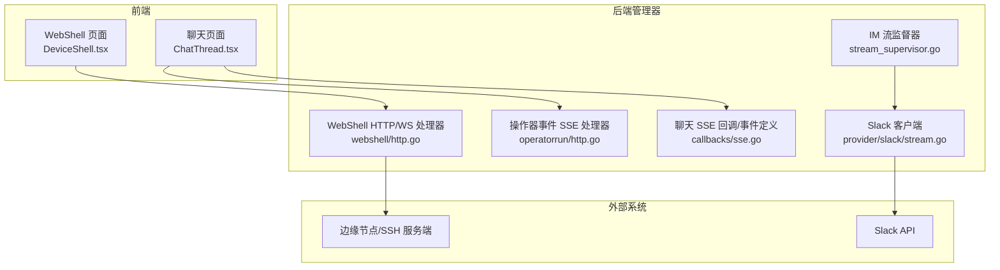
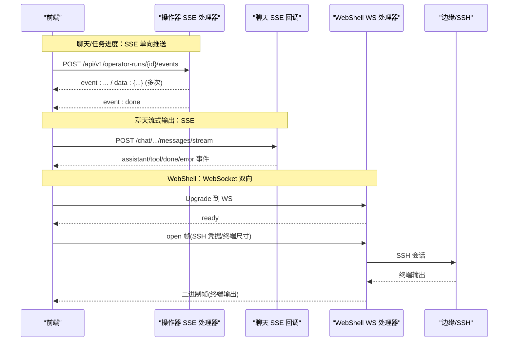
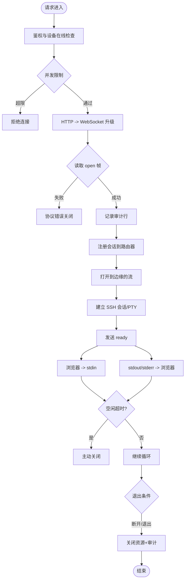
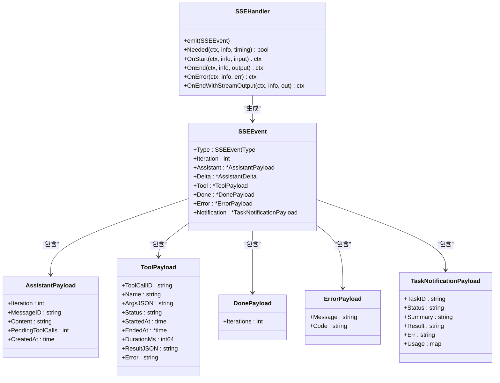
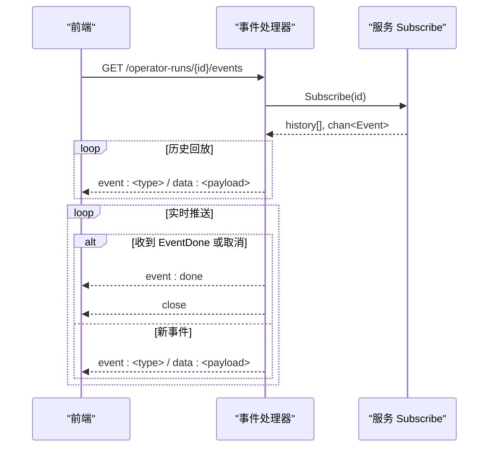
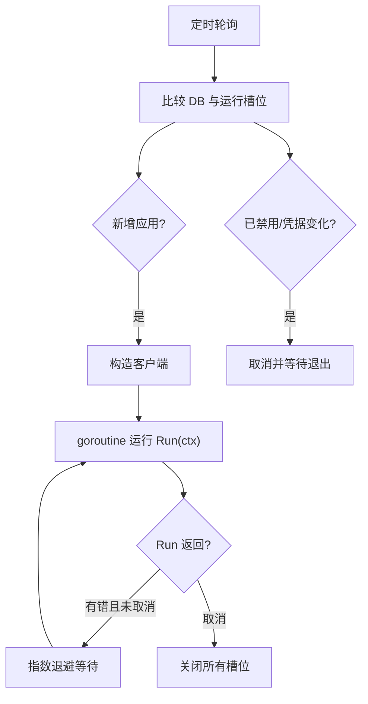
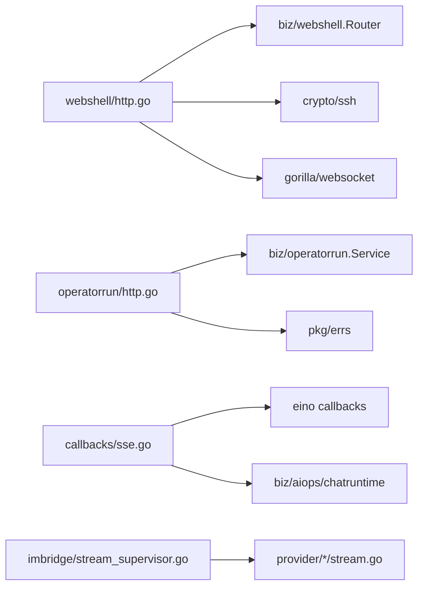

# 实时通信

<cite>
**本文引用的文件**
- [internal/manager/server/webshell/http.go](file://internal/manager/server/webshell/http.go)
- [web/src/pages/DeviceShell.tsx](file://web/src/pages/DeviceShell.tsx)
- [web/src/api/webshell.ts](file://web/src/api/webshell.ts)
- [internal/manager/server/operatorrun/http.go](file://internal/manager/server/operatorrun/http.go)
- [internal/manager/biz/aiops/graph/callbacks/sse.go](file://internal/manager/biz/aiops/graph/callbacks/sse.go)
- [internal/manager/biz/imbridge/stream_supervisor.go](file://internal/manager/biz/imbridge/stream_supervisor.go)
- [internal/manager/biz/imbridge/provider/slack/stream.go](file://internal/manager/biz/imbridge/provider/slack/stream.go)
- [web/src/api/chat.ts](file://web/src/api/chat.ts)
- [web/src/pages/ChatThread.tsx](file://web/src/pages/ChatThread.tsx)
</cite>

## 目录
1. [简介](#简介)
2. [项目结构](#项目结构)
3. [核心组件](#核心组件)
4. [架构总览](#架构总览)
5. [详细组件分析](#详细组件分析)
6. [依赖关系分析](#依赖关系分析)
7. [性能考量](#性能考量)
8. [故障排查指南](#故障排查指南)
9. [结论](#结论)
10. [附录](#附录)

## 简介
本技术文档聚焦于项目的实时通信能力，涵盖 WebSocket 与 Server-Sent Events（SSE）的连接管理、消息收发、断线重连、事件类型与消息格式规范、数据处理流程、连接池与资源清理、错误处理与异常恢复策略，以及典型使用示例（实时聊天、任务进度跟踪、状态同步）和性能监控与调试方法。

## 项目结构
本项目在“管理器”侧提供两类实时通道：
- WebSocket：用于 WebSSH（设备终端）的交互式双向通信。
- SSE：用于聊天流式输出、操作器运行事件等单向推送场景。

此外，内部 IM 桥接子系统通过长连接（WebSocket）接入第三方平台（如 Slack），并由统一的生命周期监督器管理。

**图表来源**
- [web/src/pages/DeviceShell.tsx:190-305](file://web/src/pages/DeviceShell.tsx#L190-L305)
- [internal/manager/server/webshell/http.go:154-363](file://internal/manager/server/webshell/http.go#L154-L363)
- [internal/manager/server/operatorrun/http.go:107-151](file://internal/manager/server/operatorrun/http.go#L107-L151)
- [internal/manager/biz/aiops/graph/callbacks/sse.go:16-50](file://internal/manager/biz/aiops/graph/callbacks/sse.go#L16-L50)
- [internal/manager/biz/imbridge/stream_supervisor.go:34-96](file://internal/manager/biz/imbridge/stream_supervisor.go#L34-L96)
- [internal/manager/biz/imbridge/provider/slack/stream.go:90-120](file://internal/manager/biz/imbridge/provider/slack/stream.go#L90-L120)

**章节来源**
- [web/src/pages/DeviceShell.tsx:190-305](file://web/src/pages/DeviceShell.tsx#L190-L305)
- [internal/manager/server/webshell/http.go:154-363](file://internal/manager/server/webshell/http.go#L154-L363)
- [internal/manager/server/operatorrun/http.go:107-151](file://internal/manager/server/operatorrun/http.go#L107-L151)
- [internal/manager/biz/aiops/graph/callbacks/sse.go:16-50](file://internal/manager/biz/aiops/graph/callbacks/sse.go#L16-L50)
- [internal/manager/biz/imbridge/stream_supervisor.go:34-96](file://internal/manager/biz/imbridge/stream_supervisor.go#L34-L96)
- [internal/manager/biz/imbridge/provider/slack/stream.go:90-120](file://internal/manager/biz/imbridge/provider/slack/stream.go#L90-L120)

## 核心组件
- WebShell WebSocket 处理器：负责浏览器到 SSH 的双向数据桥接、会话审计、并发限制、空闲超时与优雅关闭。
- 操作器运行事件 SSE 处理器：以 text/event-stream 推送任务执行事件，支持历史回放与完成终止。
- 聊天 SSE 回调与事件模型：定义 assistant/tool/done/error/task_notification 等事件类型及载荷，供上层 SSE 渲染。
- IM 流监督器：统一管理各提供商的长连接生命周期，具备指数退避重连与凭据轮换重启能力。
- 前端 SSE/WS 客户端：聊天页面向后端发起 SSE 流并解析事件；WebShell 建立 WS 连接并发送首帧握手。

**章节来源**
- [internal/manager/server/webshell/http.go:154-363](file://internal/manager/server/webshell/http.go#L154-L363)
- [internal/manager/server/operatorrun/http.go:107-151](file://internal/manager/server/operatorrun/http.go#L107-L151)
- [internal/manager/biz/aiops/graph/callbacks/sse.go:16-147](file://internal/manager/biz/aiops/graph/callbacks/sse.go#L16-L147)
- [internal/manager/biz/imbridge/stream_supervisor.go:34-201](file://internal/manager/biz/imbridge/stream_supervisor.go#L34-L201)
- [web/src/api/chat.ts:247-361](file://web/src/api/chat.ts#L247-L361)
- [web/src/pages/DeviceShell.tsx:190-305](file://web/src/pages/DeviceShell.tsx#L190-L305)

## 架构总览
下图展示了从前端到后端的实时通信主路径：聊天通过 SSE 获取流式响应；WebShell 通过 WebSocket 进行双向交互；IM 桥接通过长连接维持与第三方平台的通信。

**图表来源**
- [internal/manager/server/operatorrun/http.go:107-151](file://internal/manager/server/operatorrun/http.go#L107-L151)
- [internal/manager/biz/aiops/graph/callbacks/sse.go:16-50](file://internal/manager/biz/aiops/graph/callbacks/sse.go#L16-L50)
- [internal/manager/server/webshell/http.go:154-363](file://internal/manager/server/webshell/http.go#L154-L363)

## 详细组件分析

### WebShell WebSocket 连接管理
- 连接建立：HTTP 升级至 WebSocket，校验租户上下文与设备在线状态，限制用户/设备并发会话数。
- 握手协议：客户端需在 10 秒内发送首个文本帧 open，包含 SSH 用户名、密码、终端行列与类型。
- 数据通道：后续二进制帧作为 stdin 写入 SSH 会话；stdout/stderr 以二进制帧回推；文本帧用于 resize/close 控制。
- 资源清理：会话注册到路由器，退出时记录审计信息（输入/输出字节、退出码、终止原因）；空闲超时自动关闭。
- 错误处理：认证失败、会话创建失败、SSH 错误均返回友好提示并正常关闭连接。

**图表来源**
- [internal/manager/server/webshell/http.go:154-363](file://internal/manager/server/webshell/http.go#L154-L363)
- [internal/manager/server/webshell/http.go:399-432](file://internal/manager/server/webshell/http.go#L399-L432)

**章节来源**
- [internal/manager/server/webshell/http.go:154-363](file://internal/manager/server/webshell/http.go#L154-L363)
- [internal/manager/server/webshell/http.go:399-432](file://internal/manager/server/webshell/http.go#L399-L432)
- [web/src/pages/DeviceShell.tsx:190-305](file://web/src/pages/DeviceShell.tsx#L190-L305)
- [web/src/api/webshell.ts:1-29](file://web/src/api/webshell.ts#L1-L29)

### 聊天 SSE 事件模型与推送流程
- 事件类型：assistant_start、assistant_delta、assistant_end、tool_start、tool_end、done、error、task_notification。
- 载荷结构：assistant/tool/done/error/notification 各有明确字段，便于前端增量渲染与状态收敛。
- 推送实现：回调处理器将图执行事件转换为 SSEEvent，并通过发射器写入 SSE 响应；前端按 event/data 行解析并分发。
- 兼容层：运行时适配器将新事件名映射为旧事件名，保证前端无感知切换。

**图表来源**
- [internal/manager/biz/aiops/graph/callbacks/sse.go:16-147](file://internal/manager/biz/aiops/graph/callbacks/sse.go#L16-L147)

**章节来源**
- [internal/manager/biz/aiops/graph/callbacks/sse.go:16-147](file://internal/manager/biz/aiops/graph/callbacks/sse.go#L16-L147)
- [web/src/api/chat.ts:247-361](file://web/src/api/chat.ts#L247-L361)
- [web/src/pages/ChatThread.tsx:105-179](file://web/src/pages/ChatThread.tsx#L105-L179)

### 操作器运行事件 SSE
- 端点：GET /api/v1/operator-runs/{id}/events 返回 text/event-stream。
- 行为：先回放历史事件，再订阅实时事件；遇到 EventDone 或上下文取消则结束。
- 编码：event: 名称 + data: JSON 载荷，逐条 flush。

**图表来源**
- [internal/manager/server/operatorrun/http.go:107-151](file://internal/manager/server/operatorrun/http.go#L107-L151)
- [internal/manager/server/operatorrun/http.go:210-224](file://internal/manager/server/operatorrun/http.go#L210-L224)

**章节来源**
- [internal/manager/server/operatorrun/http.go:107-151](file://internal/manager/server/operatorrun/http.go#L107-L151)
- [internal/manager/server/operatorrun/http.go:210-224](file://internal/manager/server/operatorrun/http.go#L210-L224)

### IM 长连接管理与重连
- 监督器：周期性对比数据库中的启用应用列表与当前运行槽位，新增启动、禁用停止、凭据轮换重启。
- 重连策略：对每个 provider 的 Run 调用封装指数退避重试，最大退避上限保护。
- 心跳保活：部分 SDK（如 Slack）需要 ping 保活以避免空闲断开。

**图表来源**
- [internal/manager/biz/imbridge/stream_supervisor.go:80-160](file://internal/manager/biz/imbridge/stream_supervisor.go#L80-L160)
- [internal/manager/biz/imbridge/stream_supervisor.go:162-201](file://internal/manager/biz/imbridge/stream_supervisor.go#L162-L201)
- [internal/manager/biz/imbridge/provider/slack/stream.go:90-120](file://internal/manager/biz/imbridge/provider/slack/stream.go#L90-L120)

**章节来源**
- [internal/manager/biz/imbridge/stream_supervisor.go:80-160](file://internal/manager/biz/imbridge/stream_supervisor.go#L80-L160)
- [internal/manager/biz/imbridge/stream_supervisor.go:162-201](file://internal/manager/biz/imbridge/stream_supervisor.go#L162-L201)
- [internal/manager/biz/imbridge/provider/slack/stream.go:90-120](file://internal/manager/biz/imbridge/provider/slack/stream.go#L90-L120)

### 前端实时通信实现要点
- 聊天 SSE：POST 流式接口，设置 Accept: text/event-stream，逐块读取并按 \n\n 分割帧，解析 event/data 并分发到回调。
- WebShell WS：附加 token 查询参数，指定子协议，建立连接后发送 open 帧，监听 beforeunload 做礼貌关闭。
- 页面状态：聊天页维护消息列表、工具卡片、审批卡片，并在 SSE 流中增量更新，避免滚动抖动。

**章节来源**
- [web/src/api/chat.ts:247-361](file://web/src/api/chat.ts#L247-L361)
- [web/src/pages/ChatThread.tsx:105-179](file://web/src/pages/ChatThread.tsx#L105-L179)
- [web/src/pages/DeviceShell.tsx:190-305](file://web/src/pages/DeviceShell.tsx#L190-L305)
- [web/src/api/webshell.ts:1-29](file://web/src/api/webshell.ts#L1-L29)

## 依赖关系分析
- WebShell 依赖：gorilla/websocket、golang.org/x/crypto/ssh、业务路由与审计模块。
- 操作器 SSE 依赖：chi 路由、业务服务 Subscribe 接口、统一错误码转换。
- 聊天 SSE 依赖：eino 回调框架、持久化链、运行时适配层。
- IM 监督器依赖：各 Provider 的 StreamClient 实现、数据库仓库接口。

**图表来源**
- [internal/manager/server/webshell/http.go:13-40](file://internal/manager/server/webshell/http.go#L13-L40)
- [internal/manager/server/operatorrun/http.go:4-17](file://internal/manager/server/operatorrun/http.go#L4-L17)
- [internal/manager/biz/aiops/graph/callbacks/sse.go:3-14](file://internal/manager/biz/aiops/graph/callbacks/sse.go#L3-L14)
- [internal/manager/biz/imbridge/stream_supervisor.go:3-10](file://internal/manager/biz/imbridge/stream_supervisor.go#L3-L10)

**章节来源**
- [internal/manager/server/webshell/http.go:13-40](file://internal/manager/server/webshell/http.go#L13-L40)
- [internal/manager/server/operatorrun/http.go:4-17](file://internal/manager/server/operatorrun/http.go#L4-L17)
- [internal/manager/biz/aiops/graph/callbacks/sse.go:3-14](file://internal/manager/biz/aiops/graph/callbacks/sse.go#L3-L14)
- [internal/manager/biz/imbridge/stream_supervisor.go:3-10](file://internal/manager/biz/imbridge/stream_supervisor.go#L3-L10)

## 性能考量
- 连接与并发限制：WebShell 对用户和设备维度设置并发上限，防止资源耗尽。
- 空闲超时：长时间无输入的会话自动关闭，释放 SSH 会话与 WS 连接。
- SSE 流式输出：按事件逐条 flush，降低首包延迟；前端分块解析，避免大缓冲。
- 重连退避：IM 长连接采用指数退避，避免雪崩；最大退避上限保护系统。
- 资源清理：会话退出时统一关闭 SSH/Stream/WS，审计写入完整统计信息。

[本节为通用指导，不直接分析具体文件]

## 故障排查指南
- 网络异常：
  - WS 升级失败：检查鉴权、跨域与子协议匹配；查看日志中的 upgrade 错误。
  - SSE 连接中断：确认 Keep-Alive 与代理配置；前端需支持断线重连与幂等处理。
- 服务端错误：
  - 设备离线：WebShell 会返回不可用状态；检查设备在线状态与边缘可达性。
  - SSH 认证失败：返回友好错误并关闭；核对凭据与目标主机密钥策略。
  - 操作器事件：关注 EventDone 与 error 事件；根据 code 定位问题。
- 客户端错误：
  - 首帧缺失或格式错误：WS 会在超时后关闭；确保前端在连接后立即发送 open 帧。
  - SSE 解析失败：忽略未知事件；检查 event/data 行是否符合规范。
- 调试建议：
  - 开启详细日志：记录连接建立、事件类型、错误堆栈与耗时。
  - 抓包与指标：结合网络抓包与服务器指标观察吞吐、延迟与错误率。

**章节来源**
- [internal/manager/server/webshell/http.go:154-363](file://internal/manager/server/webshell/http.go#L154-L363)
- [internal/manager/server/operatorrun/http.go:210-260](file://internal/manager/server/operatorrun/http.go#L210-L260)
- [web/src/api/chat.ts:247-361](file://web/src/api/chat.ts#L247-L361)

## 结论
本项目通过 WebSocket 与 SSE 两种机制实现了高可用的实时通信：
- WebSocket 用于强交互场景（WebShell），具备严格的握手协议、并发控制与资源清理。
- SSE 用于单向推送（聊天、任务事件），具备稳定的事件模型与流式传输。
- IM 长连接由统一监督器管理，具备健壮的重连与生命周期治理能力。
整体方案兼顾了可靠性、可观测性与可扩展性，适用于实时聊天、任务进度跟踪与状态同步等典型场景。

[本节为总结，不直接分析具体文件]

## 附录

### 使用示例

#### 实时聊天（SSE）
- 前端发起 POST 流式请求，设置 Accept: text/event-stream。
- 服务端按 assistant/tool/done/error 等事件推送，前端解析并渲染。
- 支持中止流（AbortSignal）与服务端 stop 接口协同。

**章节来源**
- [web/src/api/chat.ts:247-361](file://web/src/api/chat.ts#L247-L361)
- [web/src/pages/ChatThread.tsx:105-179](file://web/src/pages/ChatThread.tsx#L105-L179)

#### 任务进度跟踪（SSE）
- 前端订阅 /api/v1/operator-runs/{id}/events。
- 服务端先回放历史事件，再推送实时事件，直到 done 或取消。
- 事件包含状态、耗时、错误信息等，便于前端展示进度卡片。

**章节来源**
- [internal/manager/server/operatorrun/http.go:107-151](file://internal/manager/server/operatorrun/http.go#L107-L151)
- [internal/manager/server/operatorrun/http.go:210-224](file://internal/manager/server/operatorrun/http.go#L210-L224)

#### 状态同步（WebSocket）
- 前端建立 WS 连接，发送 open 帧携带 SSH 凭据与终端尺寸。
- 服务端验证后建立 SSH 会话，双向转发终端 I/O。
- 支持 resize、close 控制；空闲超时自动关闭；审计记录完整。

**章节来源**
- [web/src/pages/DeviceShell.tsx:190-305](file://web/src/pages/DeviceShell.tsx#L190-L305)
- [internal/manager/server/webshell/http.go:154-363](file://internal/manager/server/webshell/http.go#L154-L363)

### 性能监控与调试工具
- 日志：集中记录连接建立、事件类型、错误与耗时，便于定位瓶颈。
- 指标：暴露连接数、事件速率、错误率、平均延迟等关键指标。
- 抓包：使用网络抓包工具验证 SSE/WS 帧结构与顺序。
- 压测：模拟多会话与高吞吐事件，评估并发与内存占用。

[本节为通用指导，不直接分析具体文件]