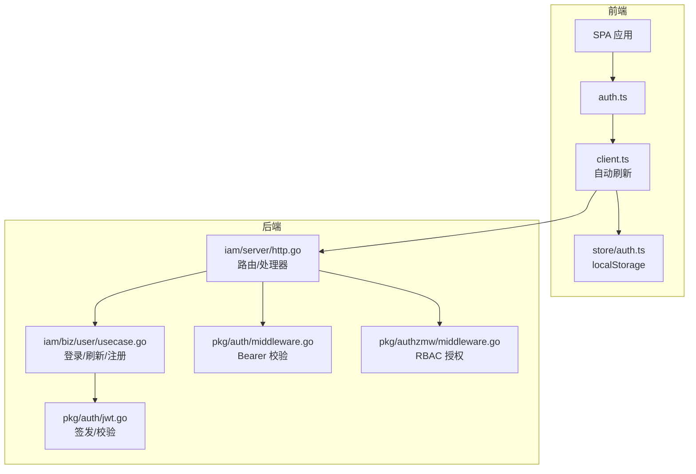
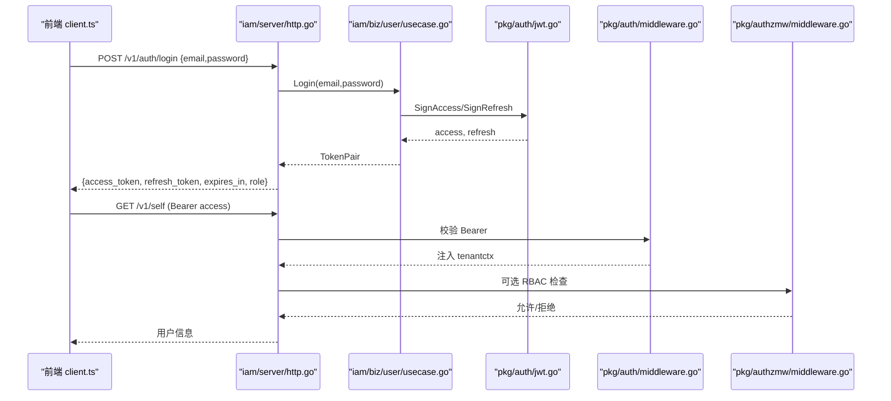
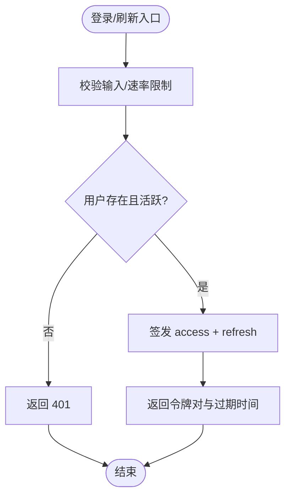
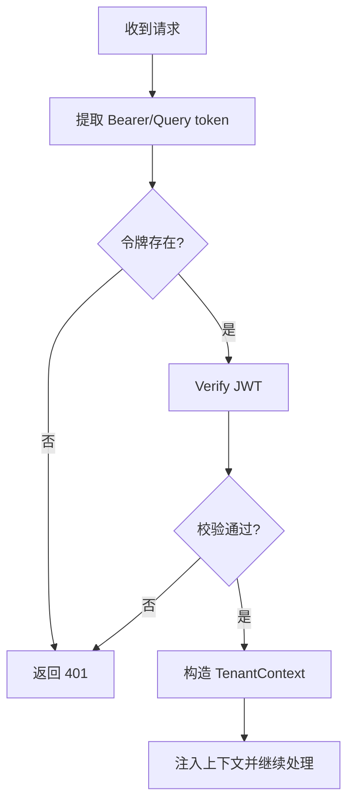
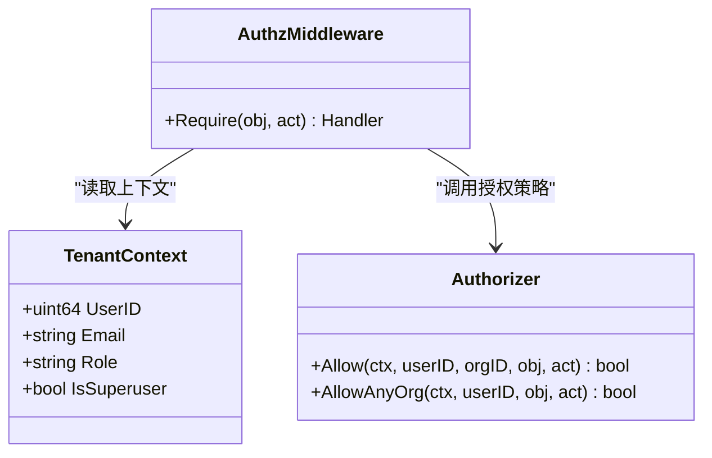
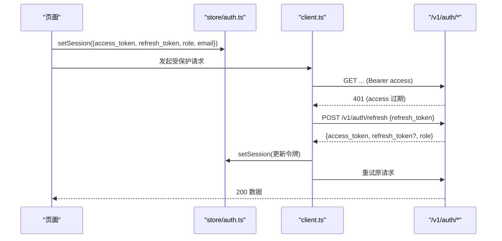
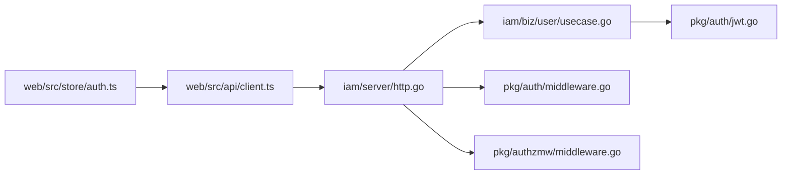

# 认证接口

<cite>
**本文引用的文件**
- [internal/pkg/auth/jwt.go](file://internal/pkg/auth/jwt.go)
- [internal/pkg/auth/middleware.go](file://internal/pkg/auth/middleware.go)
- [internal/iam/server/http.go](file://internal/iam/server/http.go)
- [internal/iam/biz/user/usecase.go](file://internal/iam/biz/user/usecase.go)
- [internal/pkg/authzmw/middleware.go](file://internal/pkg/authzmw/middleware.go)
- [web/src/api/auth.ts](file://web/src/api/auth.ts)
- [web/src/api/client.ts](file://web/src/api/client.ts)
- [web/src/store/auth.ts](file://web/src/store/auth.ts)
- [tests/e2e/auth_login_test.go](file://tests/e2e/auth_login_test.go)
- [tests/e2e/auth_refresh_test.go](file://tests/e2e/auth_refresh_test.go)
</cite>

## 目录
1. [简介](#简介)
2. [项目结构](#项目结构)
3. [核心组件](#核心组件)
4. [架构总览](#架构总览)
5. [详细组件分析](#详细组件分析)
6. [依赖关系分析](#依赖关系分析)
7. [性能与安全性考虑](#性能与安全性考虑)
8. [故障排查指南](#故障排查指南)
9. [结论](#结论)
10. [附录：API 参考与使用示例](#附录api-参考与使用示例)

## 简介
本技术文档聚焦于系统的认证相关 API 与机制，覆盖登录、登出（前端状态清理）、令牌刷新、JWT 访问令牌与刷新令牌的生成与校验、用户会话状态的维护（角色权限、用户信息、生命周期管理），以及认证中间件与权限验证的实现。同时提供前后端协作的使用示例、安全最佳实践和常见问题解决方案，帮助开发者正确集成并扩展认证能力。

## 项目结构
认证能力由后端 IAM 服务与通用鉴权包共同实现，前端通过 API 客户端进行交互与本地会话管理：
- 后端
  - JWT 签发与校验：internal/pkg/auth/jwt.go
  - 请求级认证中间件：internal/pkg/auth/middleware.go
  - 权限中间件（RBAC）：internal/pkg/authzmw/middleware.go
  - 认证业务逻辑（登录/注册/刷新等）：internal/iam/biz/user/usecase.go
  - HTTP 路由与处理器（登录/刷新/自我信息等）：internal/iam/server/http.go
- 前端
  - 认证 API 封装：web/src/api/auth.ts
  - 请求客户端与自动刷新：web/src/api/client.ts
  - 本地会话存储（localStorage 持久化）：web/src/store/auth.ts
- 端到端测试
  - 登录与自查询流程：tests/e2e/auth_login_test.go
  - 访问令牌过期后刷新流程：tests/e2e/auth_refresh_test.go

**图表来源**
- [internal/iam/server/http.go:151-183](file://internal/iam/server/http.go#L151-L183)
- [internal/iam/biz/user/usecase.go:80-123](file://internal/iam/biz/user/usecase.go#L80-L123)
- [internal/pkg/auth/jwt.go:56-99](file://internal/pkg/auth/jwt.go#L56-L99)
- [internal/pkg/auth/middleware.go:21-67](file://internal/pkg/auth/middleware.go#L21-L67)
- [internal/pkg/authzmw/middleware.go:57-97](file://internal/pkg/authzmw/middleware.go#L57-L97)
- [web/src/api/auth.ts:19-28](file://web/src/api/auth.ts#L19-L28)
- [web/src/api/client.ts:117-162](file://web/src/api/client.ts#L117-L162)
- [web/src/store/auth.ts:20-41](file://web/src/store/auth.ts#L20-L41)

**章节来源**
- [internal/iam/server/http.go:151-183](file://internal/iam/server/http.go#L151-L183)
- [internal/iam/biz/user/usecase.go:80-123](file://internal/iam/biz/user/usecase.go#L80-L123)
- [internal/pkg/auth/jwt.go:56-99](file://internal/pkg/auth/jwt.go#L56-L99)
- [internal/pkg/auth/middleware.go:21-67](file://internal/pkg/auth/middleware.go#L21-L67)
- [internal/pkg/authzmw/middleware.go:57-97](file://internal/pkg/authzmw/middleware.go#L57-L97)
- [web/src/api/auth.ts:19-28](file://web/src/api/auth.ts#L19-L28)
- [web/src/api/client.ts:117-162](file://web/src/api/client.ts#L117-L162)
- [web/src/store/auth.ts:20-41](file://web/src/store/auth.ts#L20-L41)

## 核心组件
- JWT 签发与校验
  - 支持访问令牌与刷新令牌两种 TTL；签名算法为 HS256；Claims 包含用户 ID、邮箱、角色、是否超级管理员及标准时间字段。
  - 校验仅做签名与有效期检查，不查库；身份在登录时写入令牌并信任至过期。
- 认证中间件
  - 从 Authorization: Bearer 或 ?token= 查询参数提取令牌；校验失败返回 401；成功时将租户上下文（用户 ID、邮箱、角色、是否超级管理员）注入请求上下文。
- 权限中间件（RBAC）
  - 基于对象与动作的授权策略；超级管理员可短路授权检查；未配置授权器时允许（兼容旧部署）。
- 认证业务逻辑
  - 登录：校验邮箱与密码，返回新的访问令牌与刷新令牌对，附带过期时间与角色。
  - 刷新：校验刷新令牌有效性，校验用户状态，签发新令牌对。
  - 注册/自我信息：受保护接口，需有效 JWT。
- 前端会话管理
  - 登录后将 access_token、refresh_token、role、email 持久化到 localStorage。
  - 请求前若 access 失效则自动调用刷新接口，成功后更新本地会话并重试原请求。

**章节来源**
- [internal/pkg/auth/jwt.go:16-99](file://internal/pkg/auth/jwt.go#L16-L99)
- [internal/pkg/auth/middleware.go:21-67](file://internal/pkg/auth/middleware.go#L21-L67)
- [internal/pkg/authzmw/middleware.go:57-97](file://internal/pkg/authzmw/middleware.go#L57-L97)
- [internal/iam/biz/user/usecase.go:80-123](file://internal/iam/biz/user/usecase.go#L80-L123)
- [internal/iam/server/http.go:221-288](file://internal/iam/server/http.go#L221-L288)
- [web/src/store/auth.ts:20-41](file://web/src/store/auth.ts#L20-L41)
- [web/src/api/client.ts:117-162](file://web/src/api/client.ts#L117-L162)

## 架构总览
下图展示了认证请求的完整链路：前端发起登录或受保护请求，后端中间件校验 JWT，业务层处理登录/刷新，权限中间件执行 RBAC，最终返回结果。

**图表来源**
- [internal/iam/server/http.go:221-288](file://internal/iam/server/http.go#L221-L288)
- [internal/iam/biz/user/usecase.go:80-123](file://internal/iam/biz/user/usecase.go#L80-L123)
- [internal/pkg/auth/jwt.go:56-99](file://internal/pkg/auth/jwt.go#L56-L99)
- [internal/pkg/auth/middleware.go:21-67](file://internal/pkg/auth/middleware.go#L21-L67)
- [internal/pkg/authzmw/middleware.go:57-97](file://internal/pkg/authzmw/middleware.go#L57-L97)

## 详细组件分析

### JWT 令牌管理机制
- 访问令牌（短生命周期）
  - 用于每次 API 调用的身份凭证；携带用户 ID、邮箱、角色、是否超级管理员。
  - 过期后由前端自动刷新。
- 刷新令牌（长生命周期）
  - 用于换取新的访问令牌对；服务端会校验用户状态。
- 签发与校验
  - 使用 HS256 签名；校验仅验证签名与有效期，不查库。
  - 支持自定义 TTL 的内部票据签发。

**图表来源**
- [internal/iam/server/http.go:221-288](file://internal/iam/server/http.go#L221-L288)
- [internal/iam/biz/user/usecase.go:80-123](file://internal/iam/biz/user/usecase.go#L80-L123)
- [internal/pkg/auth/jwt.go:56-99](file://internal/pkg/auth/jwt.go#L56-L99)

**章节来源**
- [internal/pkg/auth/jwt.go:16-99](file://internal/pkg/auth/jwt.go#L16-L99)
- [internal/iam/biz/user/usecase.go:80-123](file://internal/iam/biz/user/usecase.go#L80-L123)
- [internal/iam/server/http.go:221-288](file://internal/iam/server/http.go#L221-L288)

### 认证中间件实现
- 请求拦截
  - 从 Authorization: Bearer 或 ?token= 提取令牌。
  - 缺失或无效令牌直接返回 401。
- 会话注入
  - 成功校验后将用户 ID、邮箱、角色、是否超级管理员写入请求上下文，供后续处理器与权限中间件使用。
- 兼容性
  - 支持旧令牌中 Role=="admin" 作为超级管理员回退，确保升级后现有会话仍具系统管理员权限。

**图表来源**
- [internal/pkg/auth/middleware.go:21-67](file://internal/pkg/auth/middleware.go#L21-L67)

**章节来源**
- [internal/pkg/auth/middleware.go:21-67](file://internal/pkg/auth/middleware.go#L21-L67)

### 权限验证与会话状态
- 角色与超级管理员
  - 超级管理员可短路 RBAC 检查；普通用户需满足对象-动作策略。
  - 当未配置授权器时，默认放行（兼容旧部署）。
- 会话生命周期
  - 无服务端会话表；身份由 JWT Claims 承载；刷新时校验用户状态。
  - 前端通过 localStorage 持久化会话，并在需要时自动刷新。

**图表来源**
- [internal/pkg/authzmw/middleware.go:35-97](file://internal/pkg/authzmw/middleware.go#L35-L97)
- [internal/pkg/auth/middleware.go:34-50](file://internal/pkg/auth/middleware.go#L34-L50)

**章节来源**
- [internal/pkg/authzmw/middleware.go:57-97](file://internal/pkg/authzmw/middleware.go#L57-L97)
- [internal/pkg/auth/middleware.go:34-50](file://internal/pkg/auth/middleware.go#L34-L50)

### 前端认证与自动刷新
- 登录
  - 调用 /v1/auth/login，成功后将 access_token、refresh_token、role、email 持久化。
- 自动刷新
  - 请求前若 access 失效，调用 /v1/auth/refresh 获取新令牌并更新本地会话，然后重试原请求。
- 登出
  - 清除本地会话（token、refreshToken、email、role）。

**图表来源**
- [web/src/api/client.ts:117-162](file://web/src/api/client.ts#L117-L162)
- [web/src/store/auth.ts:20-41](file://web/src/store/auth.ts#L20-L41)
- [internal/iam/server/http.go:271-288](file://internal/iam/server/http.go#L271-L288)

**章节来源**
- [web/src/api/auth.ts:19-28](file://web/src/api/auth.ts#L19-L28)
- [web/src/api/client.ts:117-162](file://web/src/api/client.ts#L117-L162)
- [web/src/store/auth.ts:20-41](file://web/src/store/auth.ts#L20-L41)
- [internal/iam/server/http.go:271-288](file://internal/iam/server/http.go#L271-L288)

## 依赖关系分析
- 模块耦合
  - iam/server 依赖 biz/user 与 pkg/auth 中间件；biz/user 依赖 pkg/auth 的 Signer。
  - 权限中间件依赖租户上下文与授权器接口，保持松耦合。
- 外部依赖
  - JWT 库用于签发与校验；HTTP 框架用于路由与中间件链。
- 潜在循环依赖
  - 当前分层清晰，未见循环依赖迹象。

**图表来源**
- [internal/iam/server/http.go:151-183](file://internal/iam/server/http.go#L151-L183)
- [internal/iam/biz/user/usecase.go:80-123](file://internal/iam/biz/user/usecase.go#L80-L123)
- [internal/pkg/auth/jwt.go:56-99](file://internal/pkg/auth/jwt.go#L56-L99)
- [internal/pkg/auth/middleware.go:21-67](file://internal/pkg/auth/middleware.go#L21-L67)
- [internal/pkg/authzmw/middleware.go:57-97](file://internal/pkg/authzmw/middleware.go#L57-L97)
- [web/src/api/client.ts:117-162](file://web/src/api/client.ts#L117-L162)
- [web/src/store/auth.ts:20-41](file://web/src/store/auth.ts#L20-L41)

**章节来源**
- [internal/iam/server/http.go:151-183](file://internal/iam/server/http.go#L151-L183)
- [internal/iam/biz/user/usecase.go:80-123](file://internal/iam/biz/user/usecase.go#L80-L123)
- [internal/pkg/auth/jwt.go:56-99](file://internal/pkg/auth/jwt.go#L56-L99)
- [internal/pkg/auth/middleware.go:21-67](file://internal/pkg/auth/middleware.go#L21-L67)
- [internal/pkg/authzmw/middleware.go:57-97](file://internal/pkg/authzmw/middleware.go#L57-L97)
- [web/src/api/client.ts:117-162](file://web/src/api/client.ts#L117-L162)
- [web/src/store/auth.ts:20-41](file://web/src/store/auth.ts#L20-L41)

## 性能与安全性考虑
- 性能
  - JWT 校验轻量，无需数据库查询；刷新流程仅在必要时触发。
  - 登录限流按 IP 与邮箱双维度滑动窗口，防止暴力破解与密码喷洒。
- 安全
  - 使用 HS256 签名；建议在生产环境配置强密钥与合理 TTL。
  - 刷新令牌校验用户状态，避免禁用账户仍可刷新。
  - 超级管理员短路授权，但需严格保护该角色。
  - 前端令牌存储在 localStorage，注意 XSS 防护；生产建议结合 HttpOnly Cookie 与 CSRF 防护。
- 可用性
  - 旧令牌兼容 admin 角色回退，保证升级平滑。
  - 前端自动刷新减少用户中断体验。

[本节为通用指导，不直接分析具体文件]

## 故障排查指南
- 401 未授权
  - 检查 Authorization 头是否正确携带 Bearer 令牌；确认令牌未过期。
  - 刷新失败时检查 refresh_token 是否存在且有效。
- 403 禁止访问
  - 检查 RBAC 策略是否允许当前用户对目标资源执行操作；确认是否为超级管理员。
- 登录被限流
  - 短时间内多次失败会被限流；等待窗口过期或更换 IP/邮箱重试。
- 刷新后仍 401
  - 确认用户状态为活跃；检查刷新接口返回的新 access_token 是否已更新到本地会话。

**章节来源**
- [internal/iam/server/http.go:221-288](file://internal/iam/server/http.go#L221-L288)
- [internal/pkg/auth/middleware.go:21-67](file://internal/pkg/auth/middleware.go#L21-L67)
- [internal/pkg/authzmw/middleware.go:57-97](file://internal/pkg/authzmw/middleware.go#L57-L97)
- [tests/e2e/auth_login_test.go:15-43](file://tests/e2e/auth_login_test.go#L15-L43)
- [tests/e2e/auth_refresh_test.go:20-54](file://tests/e2e/auth_refresh_test.go#L20-L54)

## 结论
本系统采用无状态 JWT 认证，结合前端自动刷新与后端限流、RBAC 授权，实现了安全、可扩展的认证体系。通过清晰的中间件分层与业务解耦，既保证了开发效率，也便于后续扩展多租户与更细粒度的权限控制。建议在生产环境中强化密钥管理、启用 HTTPS、并结合审计日志完善安全监控。

[本节为总结性内容，不直接分析具体文件]

## 附录：API 参考与使用示例

### 认证相关 API
- 登录
  - 方法：POST
  - 路径：/v1/auth/login
  - 请求体：{ email, password }
  - 响应：{ access_token, refresh_token, expires_in, role }
- 刷新
  - 方法：POST
  - 路径：/v1/auth/refresh
  - 请求体：{ refresh_token }
  - 响应：{ access_token, refresh_token, expires_in, role }
- 自我信息
  - 方法：GET
  - 路径：/v1/self
  - 头部：Authorization: Bearer <access_token>
  - 响应：{ id, email, role }

**章节来源**
- [internal/iam/server/http.go:151-183](file://internal/iam/server/http.go#L151-L183)
- [internal/iam/server/http.go:221-288](file://internal/iam/server/http.go#L221-L288)
- [internal/iam/server/http.go:315-327](file://internal/iam/server/http.go#L315-L327)

### 前端使用示例
- 登录
  - 调用 login(email, password)，成功后调用 setSession 保存令牌与角色。
- 自动刷新
  - 请求受保护接口时，若 401，则调用 refresh(refresh_token) 获取新 access_token 并更新会话后重试。
- 登出
  - 调用 logout() 清空本地会话。

**章节来源**
- [web/src/api/auth.ts:19-28](file://web/src/api/auth.ts#L19-L28)
- [web/src/api/client.ts:117-162](file://web/src/api/client.ts#L117-L162)
- [web/src/store/auth.ts:20-41](file://web/src/store/auth.ts#L20-L41)

### 端到端测试参考
- 登录与自查询
  - 验证登录成功后可获取当前用户信息；错误令牌应返回 401。
- 访问令牌过期后刷新
  - 设置较短 access TTL，等待过期后调用刷新接口，再用新令牌访问受保护接口。

**章节来源**
- [tests/e2e/auth_login_test.go:15-43](file://tests/e2e/auth_login_test.go#L15-L43)
- [tests/e2e/auth_refresh_test.go:20-54](file://tests/e2e/auth_refresh_test.go#L20-L54)