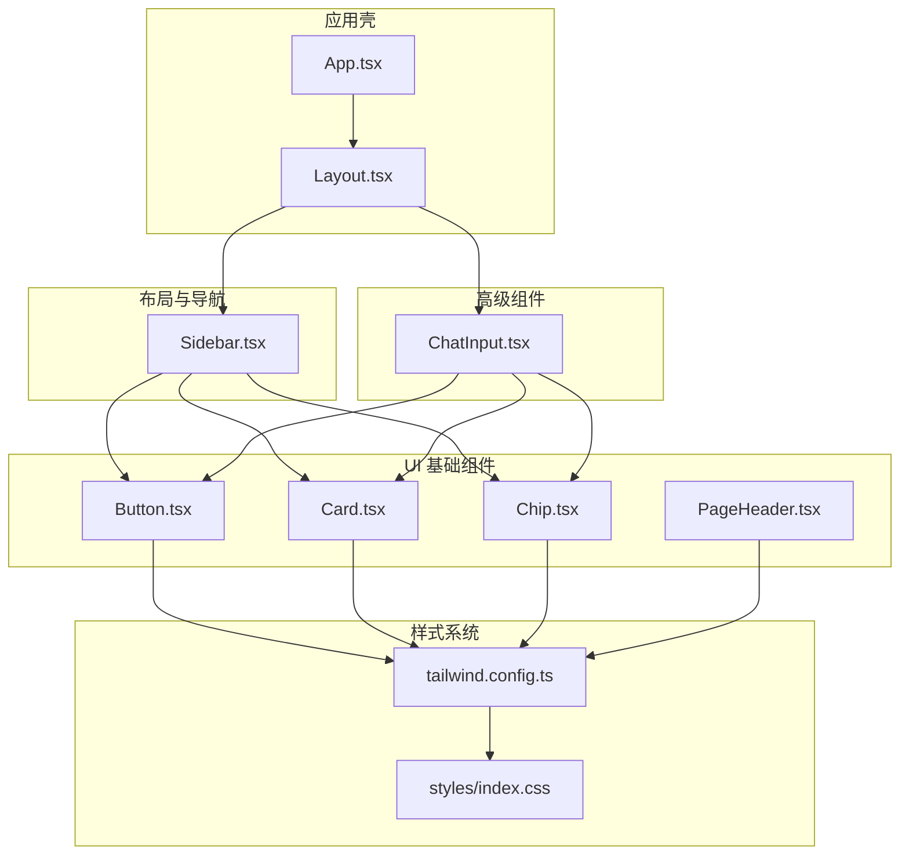
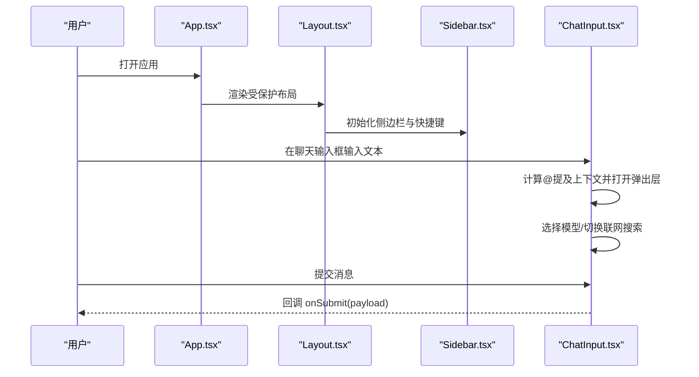
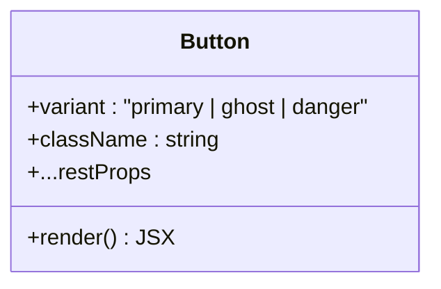
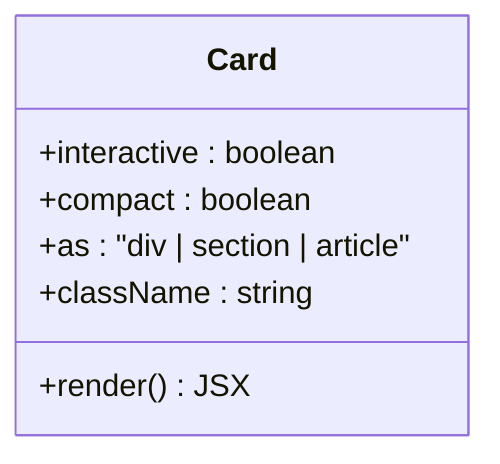
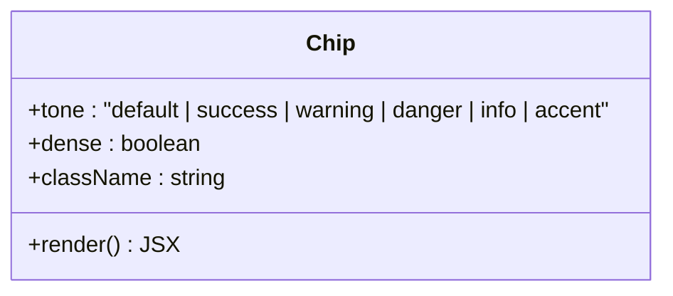
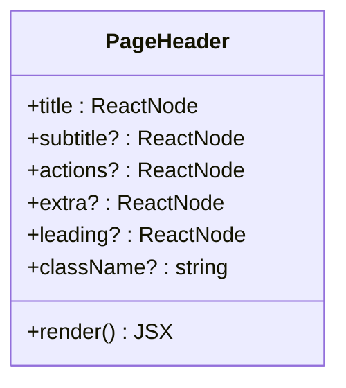
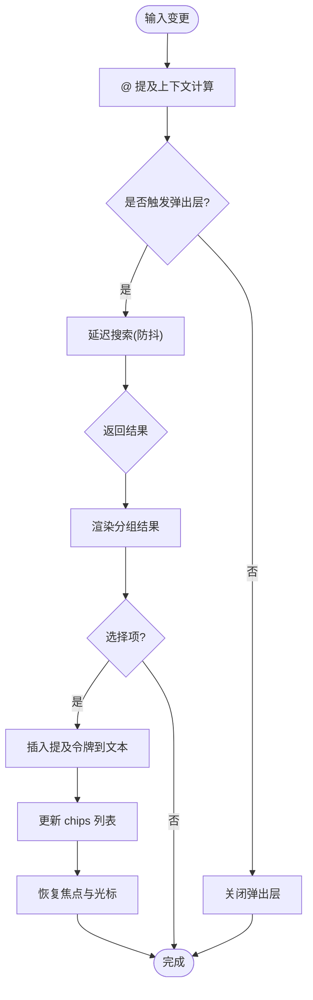
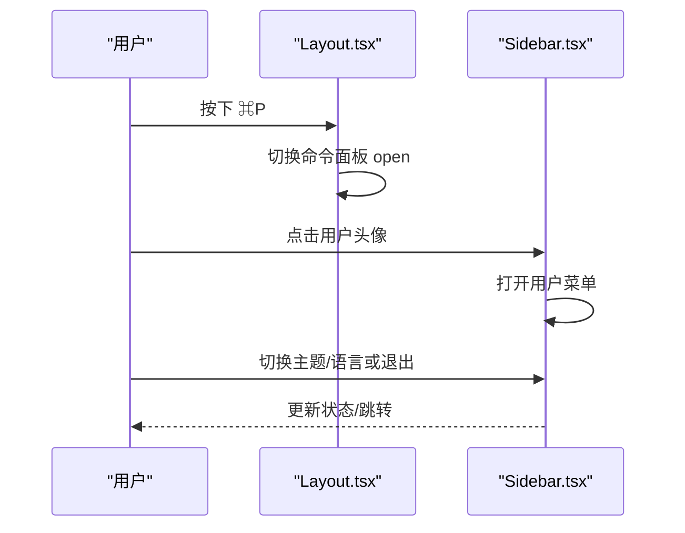
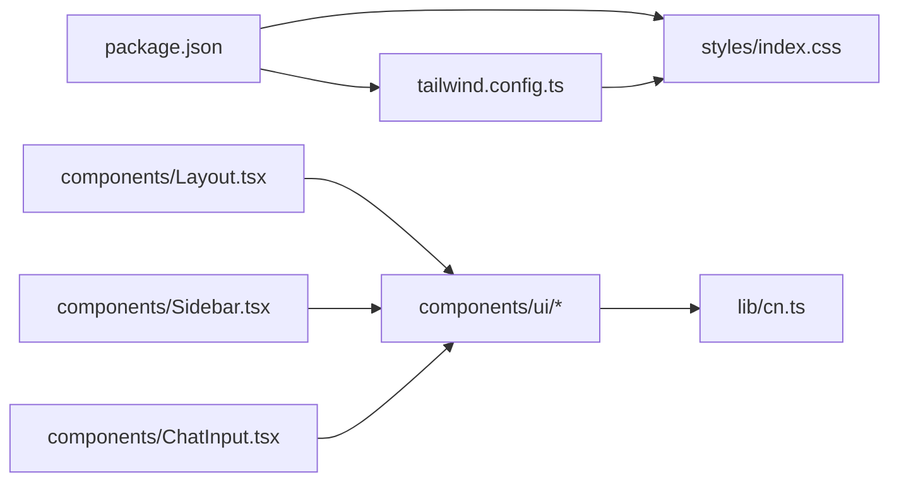

# UI 组件库

<cite>
**本文引用的文件**
- [web/package.json](file://web/package.json)
- [web/tailwind.config.ts](file://web/tailwind.config.ts)
- [web/src/styles/index.css](file://web/src/styles/index.css)
- [web/src/lib/cn.ts](file://web/src/lib/cn.ts)
- [web/src/components/ui/index.ts](file://web/src/components/ui/index.ts)
- [web/src/components/ui/Button.tsx](file://web/src/components/ui/Button.tsx)
- [web/src/components/ui/Card.tsx](file://web/src/components/ui/Card.tsx)
- [web/src/components/ui/Chip.tsx](file://web/src/components/ui/Chip.tsx)
- [web/src/components/ui/PageHeader.tsx](file://web/src/components/ui/PageHeader.tsx)
- [web/src/components/Layout.tsx](file://web/src/components/Layout.tsx)
- [web/src/components/Sidebar.tsx](file://web/src/components/Sidebar.tsx)
- [web/src/components/ChatInput.tsx](file://web/src/components/ChatInput.tsx)
- [web/src/App.tsx](file://web/src/App.tsx)
</cite>

## 目录
1. [简介](#简介)
2. [项目结构](#项目结构)
3. [核心组件](#核心组件)
4. [架构总览](#架构总览)
5. [详细组件分析](#详细组件分析)
6. [依赖关系分析](#依赖关系分析)
7. [性能考量](#性能考量)
8. [故障排查指南](#故障排查指南)
9. [结论](#结论)
10. [附录](#附录)

## 简介
本技术文档面向 Ongrid Web 前端的 UI 组件体系，系统性说明基础与高级组件的设计模式、实现原理、样式系统与主题定制、响应式策略、可复用性与扩展性（props 接口与插槽机制），并给出组合使用示例与测试、文档生成的最佳实践。该组件库基于 React + TypeScript，样式系统采用 Tailwind CSS，并通过 CSS 变量与主题类实现明暗主题切换与品牌化定制。

## 项目结构
- 构建与脚本：Vite + TypeScript + Vitest + Playwright；Tailwind CSS 作为样式框架。
- 样式系统：通过 tailwind.config.ts 扩展主题色与字体；在 styles/index.css 中定义语义化设计令牌（CSS 变量）与明/暗主题覆盖规则，并提供打印样式与滚动条美化。
- 组件组织：ui 子目录提供视觉统一的基础原语（Button、Card、Chip、PageHeader 等），由 index.ts 集中导出；Layout 与 Sidebar 提供应用级布局与导航；ChatInput 为复杂交互的高级组件。
- 路由与应用壳：App.tsx 负责页面路由与权限守卫；Layout.tsx 包裹侧边栏、主内容区与全局命令面板/助手面板。

**图表来源**
- [web/src/App.tsx:86-218](file://web/src/App.tsx#L86-L218)
- [web/src/components/Layout.tsx:10-57](file://web/src/components/Layout.tsx#L10-L57)
- [web/src/components/Sidebar.tsx:66-532](file://web/src/components/Sidebar.tsx#L66-L532)
- [web/src/components/ui/Button.tsx:24-39](file://web/src/components/ui/Button.tsx#L24-L39)
- [web/src/components/ui/Card.tsx:17-34](file://web/src/components/ui/Card.tsx#L17-L34)
- [web/src/components/ui/Chip.tsx:24-35](file://web/src/components/ui/Chip.tsx#L24-L35)
- [web/src/components/ui/PageHeader.tsx:21-39](file://web/src/components/ui/PageHeader.tsx#L21-L39)
- [web/src/components/ChatInput.tsx:77-450](file://web/src/components/ChatInput.tsx#L77-L450)
- [web/tailwind.config.ts:3-40](file://web/tailwind.config.ts#L3-L40)
- [web/src/styles/index.css:9-54](file://web/src/styles/index.css#L9-L54)

**章节来源**
- [web/package.json:1-56](file://web/package.json#L1-L56)
- [web/tailwind.config.ts:1-43](file://web/tailwind.config.ts#L1-L43)
- [web/src/styles/index.css:1-684](file://web/src/styles/index.css#L1-L684)
- [web/src/App.tsx:1-221](file://web/src/App.tsx#L1-L221)
- [web/src/components/Layout.tsx:1-72](file://web/src/components/Layout.tsx#L1-L72)

## 核心组件
- 按钮 Button：支持 primary/ghost/danger 三种变体，固定尺寸与过渡动画，兼容原生 button 属性，通过 className 合并进行扩展。
- 卡片 Card：统一圆角、边框与背景，支持 interactive 交互态与 compact 紧凑模式，可通过 as 指定渲染标签。
- 标记 Chip：用于内联元数据（标签、角色、计数），支持多种 tone 语义色与 dense 紧凑间距。
- 页面头部 PageHeader：统一的列表页头部，包含标题、副标题、右侧 actions 插槽与 extra 区域，便于跨页面一致体验。

这些组件通过统一的 cn 工具函数合并 class，确保样式组合简洁且可预测。

**章节来源**
- [web/src/components/ui/Button.tsx:1-41](file://web/src/components/ui/Button.tsx#L1-L41)
- [web/src/components/ui/Card.tsx:1-36](file://web/src/components/ui/Card.tsx#L1-L36)
- [web/src/components/ui/Chip.tsx:1-37](file://web/src/components/ui/Chip.tsx#L1-L37)
- [web/src/components/ui/PageHeader.tsx:1-41](file://web/src/components/ui/PageHeader.tsx#L1-L41)
- [web/src/lib/cn.ts:1-4](file://web/src/lib/cn.ts#L1-L4)

## 架构总览
- 应用壳与路由：App.tsx 使用 React Router 定义路由与鉴权守卫，将受保护页面置于 Layout 之下。
- 布局容器：Layout.tsx 管理侧边栏、主内容区、命令面板与助手面板，并绑定全局快捷键（⌘K/⌘P）。
- 导航与用户菜单：Sidebar.tsx 提供多级导航、会话列表、用户菜单（语言/主题/退出）、以及折叠/展开状态。
- 高级输入：ChatInput.tsx 提供智能 @ 提及、模型选择下拉、联网搜索开关、自动高度增长与键盘导航。

**图表来源**
- [web/src/App.tsx:86-218](file://web/src/App.tsx#L86-L218)
- [web/src/components/Layout.tsx:10-57](file://web/src/components/Layout.tsx#L10-L57)
- [web/src/components/Sidebar.tsx:66-532](file://web/src/components/Sidebar.tsx#L66-L532)
- [web/src/components/ChatInput.tsx:77-450](file://web/src/components/ChatInput.tsx#L77-L450)

## 详细组件分析

### 基础组件：Button
- 设计模式：以 props.variant 控制视觉变体，内部维护映射表，结合 cn 合并外部 className。
- 事件处理：透传原生 button 事件（onClick、onKeyDown 等），保持可访问性与可组合性。
- 可扩展性：通过 className 与 rest props 自由扩展样式与行为。

**图表来源**
- [web/src/components/ui/Button.tsx:11-39](file://web/src/components/ui/Button.tsx#L11-L39)

**章节来源**
- [web/src/components/ui/Button.tsx:1-41](file://web/src/components/ui/Button.tsx#L1-L41)

### 基础组件：Card
- 设计模式：统一卡片表面，interactive 开启 hover 态，compact 调整内边距，as 支持不同语义标签。
- 样式策略：使用 Tailwind 的 rounded、border、bg 等原子类，配合 cn 组合。

**图表来源**
- [web/src/components/ui/Card.tsx:9-34](file://web/src/components/ui/Card.tsx#L9-L34)

**章节来源**
- [web/src/components/ui/Card.tsx:1-36](file://web/src/components/ui/Card.tsx#L1-L36)

### 基础组件：Chip
- 设计模式：小尺寸内联标签，tone 控制语义色彩，dense 控制紧凑间距。
- 适用场景：状态、标签、计数等轻量信息展示。

**图表来源**
- [web/src/components/ui/Chip.tsx:7-35](file://web/src/components/ui/Chip.tsx#L7-L35)

**章节来源**
- [web/src/components/ui/Chip.tsx:1-37](file://web/src/components/ui/Chip.tsx#L1-L37)

### 基础组件：PageHeader
- 设计模式：结构化头部，title/subtitle/actions/extra/leading 插槽，便于页面快速搭建一致头部。
- 样式策略：sticky 玻璃效果与语义色，适配明暗主题。

**图表来源**
- [web/src/components/ui/PageHeader.tsx:9-39](file://web/src/components/ui/PageHeader.tsx#L9-L39)

**章节来源**
- [web/src/components/ui/PageHeader.tsx:1-41](file://web/src/components/ui/PageHeader.tsx#L1-L41)

### 高级组件：ChatInput
- 功能特性：
  - 智能 @ 提及：根据光标位置解析最近一个 @ 后的词，调用搜索接口返回设备/事件/规则/文件等结果，分组显示并支持键盘导航。
  - 模型选择：下拉选择当前模型，空状态引导至集成设置配置 LLM。
  - 联网搜索开关：切换后向 agent 暴露 web_search 能力。
  - 自动高度：textarea 随内容增长，限制最大行数。
  - 键盘交互：Enter 提交、Ctrl/Cmd+Enter 换行、Shift+Enter 换行、Esc 关闭弹出层。
- 数据结构：
  - SubmitPayload：{ text, mentions }，mentions 为结构化引用列表。
  - ModelSelection：{ provider, model }。
- 事件处理：onChange/onSubmit/onModelChange/onWebSearchToggle 等回调，父组件负责持久化与业务逻辑。

**图表来源**
- [web/src/components/ChatInput.tsx:163-206](file://web/src/components/ChatInput.tsx#L163-L206)
- [web/src/components/ChatInput.tsx:221-245](file://web/src/components/ChatInput.tsx#L221-L245)
- [web/src/components/ChatInput.tsx:470-575](file://web/src/components/ChatInput.tsx#L470-L575)

**章节来源**
- [web/src/components/ChatInput.tsx:1-778](file://web/src/components/ChatInput.tsx#L1-L778)

### 布局与导航：Layout 与 Sidebar
- Layout：
  - 挂载时启动未确认告警计数轮询。
  - 监听全局快捷键 ⌘K/⌘P 打开助手面板/命令面板。
  - 使用 Suspense 包裹 Outlet，提供加载占位。
- Sidebar：
  - 多级可折叠导航，存储展开状态于 localStorage。
  - 会话列表支持重命名、删除（含确认弹窗）。
  - 用户菜单支持语言切换、主题切换、退出登录。
  - 管理员可见的管理入口。

**图表来源**
- [web/src/components/Layout.tsx:10-57](file://web/src/components/Layout.tsx#L10-L57)
- [web/src/components/Sidebar.tsx:125-148](file://web/src/components/Sidebar.tsx#L125-L148)
- [web/src/components/Sidebar.tsx:150-225](file://web/src/components/Sidebar.tsx#L150-L225)
- [web/src/components/Sidebar.tsx:740-800](file://web/src/components/Sidebar.tsx#L740-L800)

**章节来源**
- [web/src/components/Layout.tsx:1-72](file://web/src/components/Layout.tsx#L1-L72)
- [web/src/components/Sidebar.tsx:1-1095](file://web/src/components/Sidebar.tsx#L1-L1095)

## 依赖关系分析
- 运行时依赖：React、React Router、Zustand（状态管理）、Lucide 图标、Recharts、Xterm 等。
- 开发依赖：Vite、TypeScript、Tailwind CSS、PostCSS、Autoprefixer、Vitest、Playwright、ESLint。
- 样式依赖：Tailwind 原子类 + 自定义 CSS 变量与主题覆盖，保证明暗主题一致性。

**图表来源**
- [web/package.json:17-54](file://web/package.json#L17-L54)
- [web/tailwind.config.ts:3-40](file://web/tailwind.config.ts#L3-L40)
- [web/src/styles/index.css:9-54](file://web/src/styles/index.css#L9-L54)
- [web/src/lib/cn.ts:1-4](file://web/src/lib/cn.ts#L1-L4)
- [web/src/components/ui/index.ts:1-11](file://web/src/components/ui/index.ts#L1-L11)

**章节来源**
- [web/package.json:1-56](file://web/package.json#L1-L56)
- [web/tailwind.config.ts:1-43](file://web/tailwind.config.ts#L1-L43)
- [web/src/styles/index.css:1-684](file://web/src/styles/index.css#L1-L684)
- [web/src/lib/cn.ts:1-4](file://web/src/lib/cn.ts#L1-L4)
- [web/src/components/ui/index.ts:1-11](file://web/src/components/ui/index.ts#L1-L11)

## 性能考量
- 懒加载路由：App.tsx 使用 lazy 加载页面，减少首屏体积。
- 防抖搜索：ChatInput 对 @ 提及搜索进行 150ms 防抖，降低请求频率。
- 局部状态：ChatInput 内部维护 textarea 值、chips、popover 状态，避免不必要的重渲染。
- 键盘与滚动优化：智能判断滚动条点击，避免误关闭弹出层；自动高度增长限制最大行数，防止过大 DOM。
- 主题切换：通过 CSS 变量与 html.light/dark 类切换，避免全量重绘。

[本节为通用指导，不直接分析具体文件]

## 故障排查指南
- 主题不一致：检查 html 根节点是否包含 light/dark 类；确认 styles/index.css 中的覆盖规则生效。
- 按钮/卡片样式异常：确认使用了 ui 目录下的组件并通过 cn 合并 className；避免直接写死 Tailwind 颜色导致明暗主题冲突。
- 聊天输入弹出层被意外关闭：检查是否在容器外点击；确认 isScrollbarMouseEvent 正确识别滚动条事件。
- 快捷键无效：确认 Layout 已挂载且 window keydown 监听正常；检查是否有其他组件阻止默认行为。

**章节来源**
- [web/src/styles/index.css:9-54](file://web/src/styles/index.css#L9-L54)
- [web/src/components/ChatInput.tsx:453-468](file://web/src/components/ChatInput.tsx#L453-L468)
- [web/src/components/Layout.tsx:26-44](file://web/src/components/Layout.tsx#L26-L44)

## 结论
本 UI 组件库以 React + TypeScript 为基础，借助 Tailwind CSS 与语义化 CSS 变量实现一致的明暗主题与品牌风格。基础组件提供稳定的视觉原语，高级组件（如 ChatInput）封装复杂交互与状态管理，布局组件（Layout、Sidebar）提供应用级结构与导航。通过清晰的 props 接口与插槽机制，组件具备良好的可复用性与扩展性。建议在新页面中优先使用 ui 原语与 Layout/Sidebar，以保持整体一致性与可维护性。

[本节为总结，不直接分析具体文件]

## 附录

### 样式系统与主题定制
- Tailwind 扩展：在 tailwind.config.ts 中扩展字体、颜色、动画与关键帧。
- 语义化令牌：styles/index.css 定义 --bg/--card/--border/--text 等变量，并在 :root.dark/:root.light 中赋值。
- 明暗主题覆盖：通过 html.light 高优先级选择器重写常见 zinc-* 类，确保浅色模式下可读性与对比度。
- 打印样式：针对报告导出提供 print 媒体查询，隐藏无关元素并强制亮色输出。

**章节来源**
- [web/tailwind.config.ts:3-40](file://web/tailwind.config.ts#L3-L40)
- [web/src/styles/index.css:9-54](file://web/src/styles/index.css#L9-L54)
- [web/src/styles/index.css:70-218](file://web/src/styles/index.css#L70-L218)
- [web/src/styles/index.css:617-683](file://web/src/styles/index.css#L617-L683)

### 组件可复用性与扩展性
- Props 接口：基础组件遵循 HTML 原生属性扩展（如 Button 继承 ButtonHTMLAttributes），高级组件通过明确类型（如 ChatInput 的 SubmitPayload、ModelSelection）约束输入。
- 插槽机制：PageHeader 支持 title/subtitle/actions/extra/leading 插槽；Sidebar 支持可折叠分组与动态菜单项。
- 组合模式：Layout 组合 Sidebar、CommandPalette、AgentSidePanel；页面通过路由懒加载组合业务组件。

**章节来源**
- [web/src/components/ui/Button.tsx:11-39](file://web/src/components/ui/Button.tsx#L11-L39)
- [web/src/components/ui/PageHeader.tsx:9-39](file://web/src/components/ui/PageHeader.tsx#L9-L39)
- [web/src/components/Sidebar.tsx:417-532](file://web/src/components/Sidebar.tsx#L417-L532)
- [web/src/components/Layout.tsx:46-57](file://web/src/components/Layout.tsx#L46-L57)

### 使用示例与最佳实践
- 组合使用：在页面中使用 PageHeader 展示标题与操作按钮，使用 Card 包裹内容区块，使用 Button 触发操作。
- 高级输入：在聊天页面引入 ChatInput，传入 providers 与 selectedModel，处理 onSubmit 回调发送消息。
- 主题切换：通过用户菜单切换主题，确保 html 根节点类名正确更新。

[本节为概念性示例，不直接分析具体文件]

### 测试与文档生成最佳实践
- 单元测试：使用 Vitest 对组件进行渲染与交互测试（如 ChatInput.test.tsx、MessageBubble.test.tsx）。
- E2E 测试：使用 Playwright 进行端到端流程验证（如 e2e/live-navigation.spec.ts）。
- 文档生成：建议在组件文件中保留 JSDoc 注释，并结合 Storybook 或自建文档站点展示用法与 API。

**章节来源**
- [web/package.json:10-15](file://web/package.json#L10-L15)
- [web/src/components/ChatInput.test.tsx](file://web/src/components/ChatInput.test.tsx)
- [web/src/components/MessageBubble.test.tsx](file://web/src/components/MessageBubble.test.tsx)
- [web/e2e/live-navigation.spec.ts](file://web/e2e/live-navigation.spec.ts)