# 基础组件

<cite>
**本文引用的文件**
- [Button.tsx](file://web/src/components/ui/Button.tsx)
- [Card.tsx](file://web/src/components/ui/Card.tsx)
- [Chip.tsx](file://web/src/components/ui/Chip.tsx)
- [EmptyState.tsx](file://web/src/components/ui/EmptyState.tsx)
- [PageHeader.tsx](file://web/src/components/ui/PageHeader.tsx)
- [PaginationFooter.tsx](file://web/src/components/ui/PaginationFooter.tsx)
- [RoleSelect.tsx](file://web/src/components/ui/RoleSelect.tsx)
- [Modal.tsx](file://web/src/components/Modal.tsx)
- [index.ts](file://web/src/components/ui/index.ts)
- [cn.ts](file://web/src/lib/cn.ts)
</cite>

## 目录
1. [简介](#简介)
2. [项目结构](#项目结构)
3. [核心组件](#核心组件)
4. [架构总览](#架构总览)
5. [详细组件分析](#详细组件分析)
6. [依赖关系分析](#依赖关系分析)
7. [性能考量](#性能考量)
8. [故障排查指南](#故障排查指南)
9. [结论](#结论)
10. [附录](#附录)

## 简介
本技术文档聚焦于前端基础 UI 组件：按钮、卡片、模态框、标签（Chip）等，系统性说明其设计模式、实现原理、Props 接口、事件处理机制、样式定制选项、可访问性支持与响应式设计策略。同时提供使用示例与最佳实践，帮助开发者在页面中一致地复用这些原子能力。

## 项目结构
基础组件集中在 web/src/components/ui 目录，并通过 barrel 导出；通用工具类位于 web/src/lib。模态框作为覆盖层组件独立放置于 web/src/components。

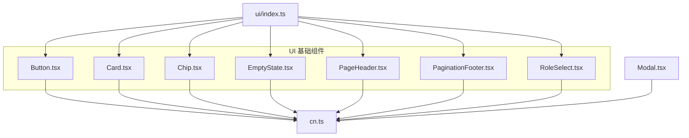

图表来源
- [Button.tsx:1-41](file://web/src/components/ui/Button.tsx#L1-L41)
- [Card.tsx:1-36](file://web/src/components/ui/Card.tsx#L1-L36)
- [Chip.tsx:1-37](file://web/src/components/ui/Chip.tsx#L1-L37)
- [EmptyState.tsx:1-33](file://web/src/components/ui/EmptyState.tsx#L1-L33)
- [PageHeader.tsx:1-41](file://web/src/components/ui/PageHeader.tsx#L1-L41)
- [PaginationFooter.tsx:1-69](file://web/src/components/ui/PaginationFooter.tsx#L1-L69)
- [RoleSelect.tsx:1-87](file://web/src/components/ui/RoleSelect.tsx#L1-L87)
- [Modal.tsx:1-133](file://web/src/components/Modal.tsx#L1-L133)
- [cn.ts:1-4](file://web/src/lib/cn.ts#L1-L4)
- [index.ts:1-11](file://web/src/components/ui/index.ts#L1-L11)

章节来源
- [index.ts:1-11](file://web/src/components/ui/index.ts#L1-L11)
- [cn.ts:1-4](file://web/src/lib/cn.ts#L1-L4)

## 核心组件
- Button：统一风格的按钮，支持 primary/ghost/danger 三种变体，固定尺寸，便于相邻按钮对齐。
- Card：统一的卡片容器，支持交互态与紧凑布局，适配不同密度场景。
- Chip：行内小标签，支持多种语义色 tone，可选密集模式。
- EmptyState：空状态占位，包含图标、标题、提示与可选操作。
- PageHeader：页面头部，包含标题、副标题、右侧动作区与扩展区域。
- PaginationFooter：分页控件，支持范围文案、上一页/下一页、加载禁用与粘性定位。
- RoleSelect：角色筛选下拉，支持 chip/block 两种形态，内置多语言与未知角色选项。
- Modal：对话框/面板，支持 ESC 关闭、遮罩点击关闭、可拖拽调宽、多尺寸、可访问性属性。

章节来源
- [Button.tsx:1-41](file://web/src/components/ui/Button.tsx#L1-L41)
- [Card.tsx:1-36](file://web/src/components/ui/Card.tsx#L1-L36)
- [Chip.tsx:1-37](file://web/src/components/ui/Chip.tsx#L1-L37)
- [EmptyState.tsx:1-33](file://web/src/components/ui/EmptyState.tsx#L1-L33)
- [PageHeader.tsx:1-41](file://web/src/components/ui/PageHeader.tsx#L1-L41)
- [PaginationFooter.tsx:1-69](file://web/src/components/ui/PaginationFooter.tsx#L1-L69)
- [RoleSelect.tsx:1-87](file://web/src/components/ui/RoleSelect.tsx#L1-L87)
- [Modal.tsx:1-133](file://web/src/components/Modal.tsx#L1-L133)

## 架构总览
所有基础组件通过 Tailwind 类名组合实现视觉一致性，借助 cn 工具合并 className，避免硬编码冲突。组件遵循“受控”或“半受控”模式：如 Modal 由 open 控制显隐，PaginationFooter 由 page/pageSize/shown 等外部状态驱动，RoleSelect 通过 value/onChange 暴露受控接口。

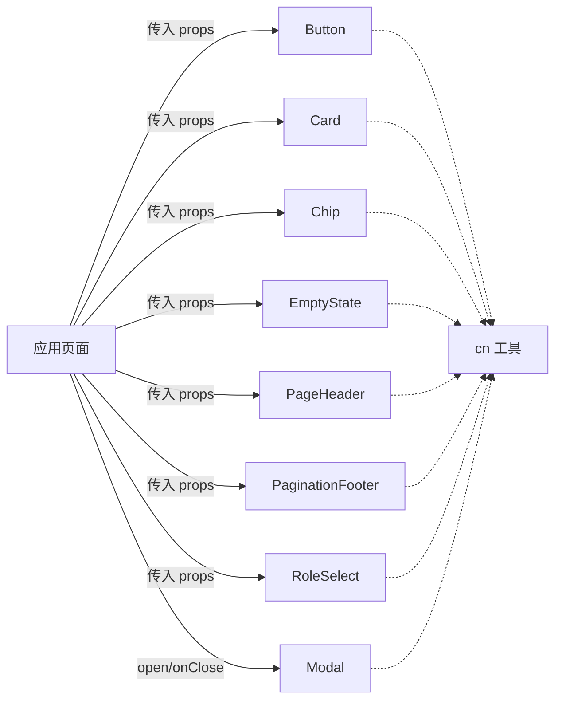

图表来源
- [Button.tsx:1-41](file://web/src/components/ui/Button.tsx#L1-L41)
- [Card.tsx:1-36](file://web/src/components/ui/Card.tsx#L1-L36)
- [Chip.tsx:1-37](file://web/src/components/ui/Chip.tsx#L1-L37)
- [EmptyState.tsx:1-33](file://web/src/components/ui/EmptyState.tsx#L1-L33)
- [PageHeader.tsx:1-41](file://web/src/components/ui/PageHeader.tsx#L1-L41)
- [PaginationFooter.tsx:1-69](file://web/src/components/ui/PaginationFooter.tsx#L1-L69)
- [RoleSelect.tsx:1-87](file://web/src/components/ui/RoleSelect.tsx#L1-L87)
- [Modal.tsx:1-133](file://web/src/components/Modal.tsx#L1-L133)
- [cn.ts:1-4](file://web/src/lib/cn.ts#L1-L4)

## 详细组件分析

### 按钮 Button
- 设计模式
  - 变体化样式：primary/ghost/danger 通过映射表注入类名，保证视觉规范一致。
  - 固定尺寸：统一字号与内边距，确保按钮组对齐稳定。
- Props 接口
  - variant：'primary' | 'ghost' | 'danger'，默认 'ghost'。
  - 透传 HTMLButtonElement 属性（type、onClick、disabled 等）。
- 事件处理
  - 完全透传原生事件，支持 disabled 禁用态。
- 样式定制
  - 通过 className 追加或覆盖；内部使用 cn 合并。
- 可访问性
  - 使用原生 button，天然具备键盘焦点与屏幕阅读器支持。
- 响应式
  - 基于 Tailwind 的文本与间距，在小屏下仍可保持可读性与点击热区。

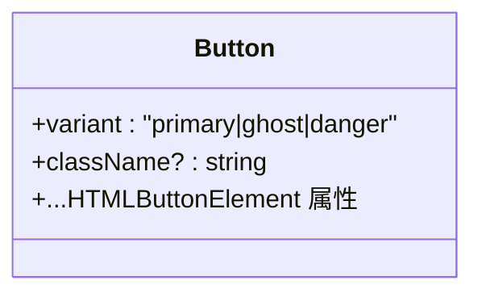

图表来源
- [Button.tsx:11-40](file://web/src/components/ui/Button.tsx#L11-L40)

章节来源
- [Button.tsx:1-41](file://web/src/components/ui/Button.tsx#L1-L41)

### 卡片 Card
- 设计模式
  - 容器抽象：统一圆角、边框、背景与交互态；支持 as 指定语义标签。
  - 紧凑模式：compact 切换内边距，适配高密度列表。
- Props 接口
  - interactive：是否启用 hover 交互态。
  - compact：是否紧凑布局。
  - as：'div' | 'section' | 'article'，默认 'section'。
- 事件处理
  - 透传 HTMLAttributes，可包裹交互元素或自身添加事件。
- 样式定制
  - 通过 className 叠加；hover 态仅在 interactive 时生效。
- 可访问性
  - 语义标签 by as；建议为可点击卡片外层增加 role/button 或包裹 Button。
- 响应式
  - 基于 Tailwind 间距与边框，适配不同密度与屏幕宽度。

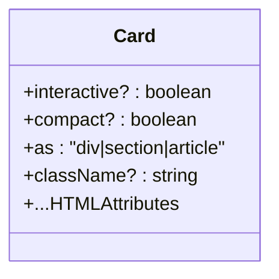

图表来源
- [Card.tsx:9-35](file://web/src/components/ui/Card.tsx#L9-L35)

章节来源
- [Card.tsx:1-36](file://web/src/components/ui/Card.tsx#L1-L36)

### 标签 Chip
- 设计模式
  - 行内元数据标签：tone 映射语义色，dense 控制密度。
- Props 接口
  - tone：'default' | 'success' | 'warning' | 'danger' | 'info' | 'accent'。
  - dense：是否更紧凑。
- 事件处理
  - 透传 HTMLAttributes，可作为可点击标签承载 onClick。
- 样式定制
  - 通过 className 叠加；tone 决定底色与文字色。
- 可访问性
  - 语义上为 span，若具交互意义应改为 button 并设置 aria-*。
- 响应式
  - 小字号与紧凑内边距，适合行内密集信息展示。

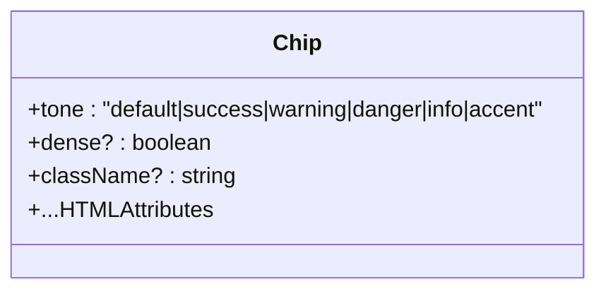

图表来源
- [Chip.tsx:9-36](file://web/src/components/ui/Chip.tsx#L9-L36)

章节来源
- [Chip.tsx:1-37](file://web/src/components/ui/Chip.tsx#L1-L37)

### 空状态 EmptyState
- 设计模式
  - 垂直居中布局：图标 + 标题 + 提示 + 可选操作。
- Props 接口
  - icon：图标类型。
  - title：必填标题。
  - hint：可选提示。
  - action：可选操作节点（通常为主按钮）。
  - className：自定义容器样式。
- 事件处理
  - 透传 ReactNode 中的事件（如 action 中的按钮）。
- 样式定制
  - 通过 className 覆盖默认高度与布局。
- 可访问性
  - 建议使用语义化容器与标题层级；action 需可聚焦。
- 响应式
  - 基于 flex 与相对单位，适配窄屏。

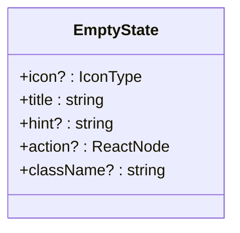

图表来源
- [EmptyState.tsx:7-32](file://web/src/components/ui/EmptyState.tsx#L7-L32)

章节来源
- [EmptyState.tsx:1-33](file://web/src/components/ui/EmptyState.tsx#L1-L33)

### 页面头 PageHeader
- 设计模式
  - 标准页头：标题、副标题、右侧动作区、额外内容区与前置导航。
- Props 接口
  - title、subtitle、actions、extra、leading、className。
- 事件处理
  - actions 插槽内按钮自行绑定事件。
- 样式定制
  - 通过 className 覆盖；内部使用固定排版规则。
- 可访问性
  - 使用 header 与 h1；actions 区域按钮需可聚焦。
- 响应式
  - 右侧动作区自动换行，适配窄屏。

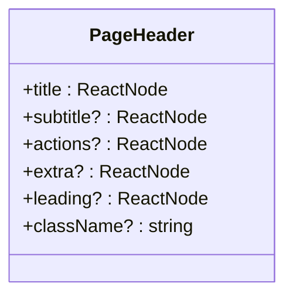

图表来源
- [PageHeader.tsx:9-39](file://web/src/components/ui/PageHeader.tsx#L9-L39)

章节来源
- [PageHeader.tsx:1-41](file://web/src/components/ui/PageHeader.tsx#L1-L41)

### 分页 PaginationFooter
- 设计模式
  - 受控分页：page/pageSize/shown/total 或 hasNext 驱动显示与行为。
  - 范围文案：根据 total 存在与否输出匹配文案。
- Props 接口
  - page、pageSize、shown、total、loading、hasNext、matchLabel、onPageChange。
- 事件处理
  - onPageChange 回调更新页码；loading 或边界时禁用按钮。
- 样式定制
  - 通过 className 覆盖；粘性底部与毛玻璃背景。
- 可访问性
  - 按钮具备 type="button" 与禁用态；文案支持 i18n。
- 响应式
  - 小字号与紧凑布局，移动端友好。

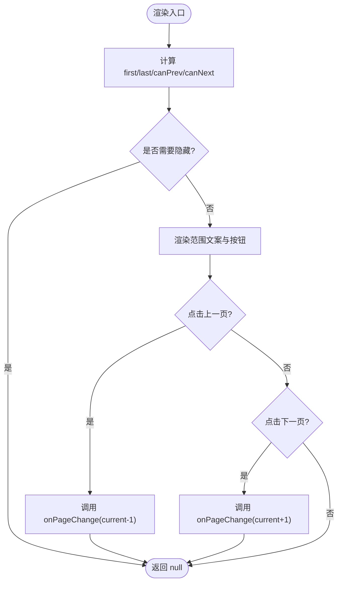

图表来源
- [PaginationFooter.tsx:17-68](file://web/src/components/ui/PaginationFooter.tsx#L17-L68)

章节来源
- [PaginationFooter.tsx:1-69](file://web/src/components/ui/PaginationFooter.tsx#L1-L69)

### 角色选择 RoleSelect
- 设计模式
  - 受控下拉：value/onChange 暴露接口；chip/block 两种形态。
  - 内置选项：所有角色、具体角色、未分类（可选隐藏）。
- Props 接口
  - value、onChange、className、showLabel、variant、omitUnknown。
- 事件处理
  - onChange(value) 传递选中的角色值。
- 样式定制
  - block 形态为全宽 select；chip 形态为行内胶囊。
- 可访问性
  - 使用 label/select；支持 i18n 文案。
- 响应式
  - 小字号与紧凑布局，适合工具栏与表单列。

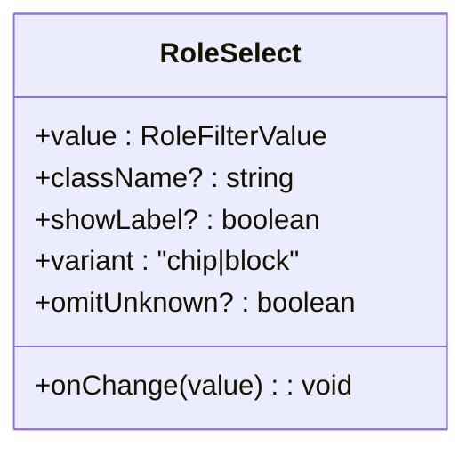

图表来源
- [RoleSelect.tsx:21-86](file://web/src/components/ui/RoleSelect.tsx#L21-L86)

章节来源
- [RoleSelect.tsx:1-87](file://web/src/components/ui/RoleSelect.tsx#L1-L87)

### 模态框 Modal
- 设计模式
  - 受控弹窗：open 控制显隐；ESC 与遮罩点击关闭。
  - 可调整宽度：resizable 开启左右边缘拖拽调宽，限制最小宽度与最大视口比例。
  - 多尺寸：sm/md/lg/xl 预设 max-w。
- Props 接口
  - open、onClose、title、children、footer、size、resizable。
- 事件处理
  - 监听 keydown Escape 触发 onClose；pointermove/up 处理拖拽。
  - 打开时锁定 body 滚动，关闭时恢复。
- 样式定制
  - 通过 size 与 className 控制；面板采用深色主题与阴影。
- 可访问性
  - 使用 role="dialog"、aria-modal="true"、aria-label；关闭按钮带 aria-label。
- 响应式
  - 最大高度限制与滚动区域，保证长内容可滚动且不溢出视口。

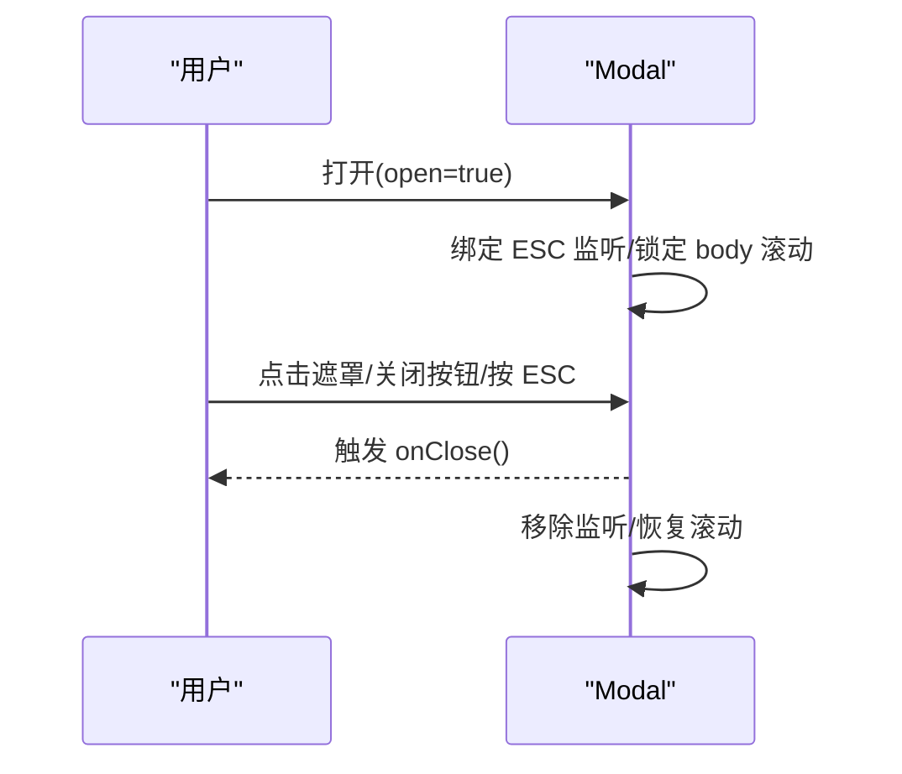

图表来源
- [Modal.tsx:27-132](file://web/src/components/Modal.tsx#L27-L132)

章节来源
- [Modal.tsx:1-133](file://web/src/components/Modal.tsx#L1-L133)

## 依赖关系分析
- 样式工具
  - cn 用于安全合并 className，避免重复与冲突。
- 国际化
  - 部分组件使用 i18n 钩子输出双语文案（如 Modal、PaginationFooter、RoleSelect）。
- 图标库
  - 使用 lucide-react 图标（如 Modal 关闭按钮、分页箭头）。
- 导出聚合
  - ui/index.ts 统一导出，便于页面按需引入并保持视觉一致性。

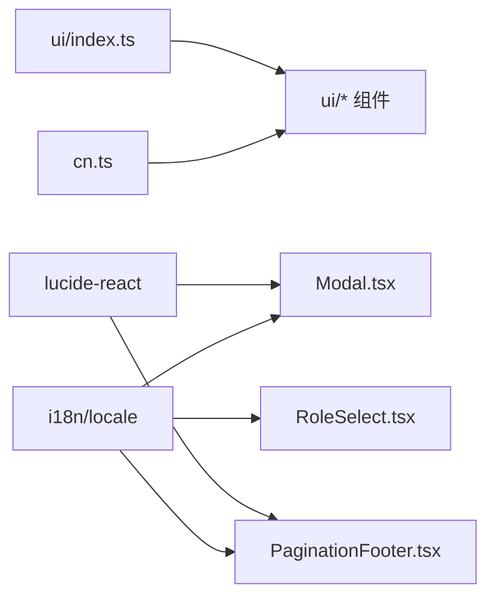

图表来源
- [cn.ts:1-4](file://web/src/lib/cn.ts#L1-L4)
- [Modal.tsx:1-133](file://web/src/components/Modal.tsx#L1-L133)
- [PaginationFooter.tsx:1-69](file://web/src/components/ui/PaginationFooter.tsx#L1-L69)
- [RoleSelect.tsx:1-87](file://web/src/components/ui/RoleSelect.tsx#L1-L87)
- [index.ts:1-11](file://web/src/components/ui/index.ts#L1-L11)

章节来源
- [index.ts:1-11](file://web/src/components/ui/index.ts#L1-L11)
- [cn.ts:1-4](file://web/src/lib/cn.ts#L1-L4)

## 性能考量
- 轻量无状态：多数组件为纯展示或简单受控组件，渲染开销低。
- 事件优化：Modal 仅在 open 时注册/注销事件监听，避免泄漏。
- 样式合并：cn 仅字符串拼接，无运行时重排。
- 滚动锁定：Modal 打开时锁定 body 滚动，减少不必要的布局抖动。
- 分页惰性：PaginationFooter 根据边界条件隐藏或禁用按钮，减少无效交互。

[本节为通用指导，不直接分析具体文件]

## 故障排查指南
- 模态框无法关闭
  - 检查 open 状态是否正确更新；确认 onClose 被正确调用。
  - 确认 ESC 监听已绑定且未被其他全局监听拦截。
- 分页按钮不可用
  - 检查 loading 是否为真；确认 canPrev/canNext 计算是否符合预期。
  - 核对 total 与 shown 的关系，避免误判边界。
- 角色选择值异常
  - 确认 value 类型为 '' | 'unknown' | 具体角色；onChange 返回值类型一致。
  - omitUnknown 为 true 时，'unknown' 选项将被隐藏。
- 样式覆盖失效
  - 确认 className 顺序与优先级；必要时使用 !important 或提升作用域。
  - 注意组件内部已使用 cn 合并，避免重复类名导致覆盖失败。

章节来源
- [Modal.tsx:33-44](file://web/src/components/Modal.tsx#L33-L44)
- [PaginationFooter.tsx:29-36](file://web/src/components/ui/PaginationFooter.tsx#L29-L36)
- [RoleSelect.tsx:40-45](file://web/src/components/ui/RoleSelect.tsx#L40-L45)

## 结论
本项目的基础组件以“小而精”的设计原则构建，通过一致的视觉规范、受控接口与可访问性支持，满足复杂业务页面的复用需求。建议在页面中优先从 ui/index.ts 统一引入，结合 cn 进行样式微调，并遵循各组件的 Props 契约以保证行为可预测。

[本节为总结性内容，不直接分析具体文件]

## 附录

### 使用示例与最佳实践
- 按钮
  - 主操作使用 primary，次要操作使用 ghost，危险操作使用 danger。
  - 将多个按钮放入同一容器以获得统一基线。
  - 参考路径：[Button.tsx:11-40](file://web/src/components/ui/Button.tsx#L11-L40)
- 卡片
  - 列表项使用 Card 包裹，interactive 开启 hover 反馈。
  - 高密度场景使用 compact。
  - 参考路径：[Card.tsx:17-34](file://web/src/components/ui/Card.tsx#L17-L34)
- 标签
  - 使用 tone 表达语义（成功/警告/危险/信息/强调）。
  - 行内密集处使用 dense。
  - 参考路径：[Chip.tsx:24-35](file://web/src/components/ui/Chip.tsx#L24-L35)
- 空状态
  - 为无数据列表提供 EmptyState，配合 action 引导用户下一步。
  - 参考路径：[EmptyState.tsx:18-31](file://web/src/components/ui/EmptyState.tsx#L18-L31)
- 页面头
  - 使用 PageHeader 组织标题、副标题与右侧动作区。
  - 参考路径：[PageHeader.tsx:21-39](file://web/src/components/ui/PageHeader.tsx#L21-L39)
- 分页
  - 维护 page/pageSize/shown/total 或 hasNext，并在 onPageChange 中刷新数据。
  - 参考路径：[PaginationFooter.tsx:17-68](file://web/src/components/ui/PaginationFooter.tsx#L17-L68)
- 角色选择
  - 在工具栏使用 chip 形态，在表单列使用 block 形态。
  - 参考路径：[RoleSelect.tsx:21-86](file://web/src/components/ui/RoleSelect.tsx#L21-L86)
- 模态框
  - 使用 open 控制显隐，ESC/遮罩/关闭按钮均可触发 onClose。
  - resizable 适用于长文阅读类面板。
  - 参考路径：[Modal.tsx:27-132](file://web/src/components/Modal.tsx#L27-L132)

### 测试策略建议
- 单元测试
  - 验证 Props 对渲染的影响（如 variant、tone、size、compact）。
  - 验证受控组件的状态流转（如 PaginationFooter 的 onPageChange、RoleSelect 的 onChange）。
  - 验证 Modal 的 open/onClose 行为与 ESC 监听。
- 交互测试
  - 使用 Playwright/Cypress 模拟键盘与指针事件（如 ESC、拖拽调宽）。
- 可访问性测试
  - 使用 axe-core 或类似工具检测 role/aria 属性与焦点管理。
- 快照测试
  - 对关键组件渲染结果做快照对比，防止样式回归。

[本节为通用指导，不直接分析具体文件]