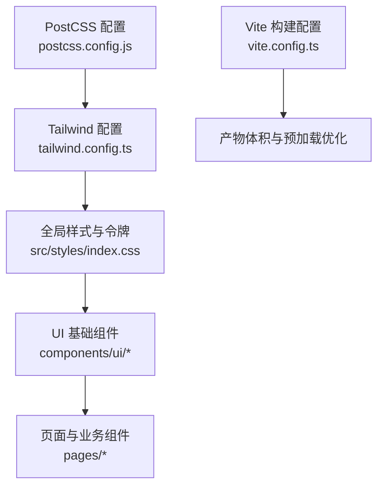
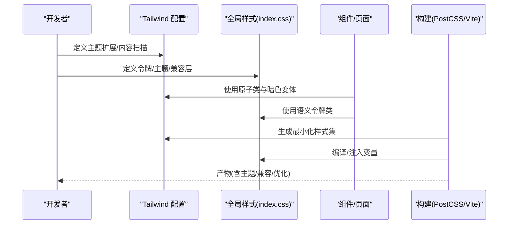
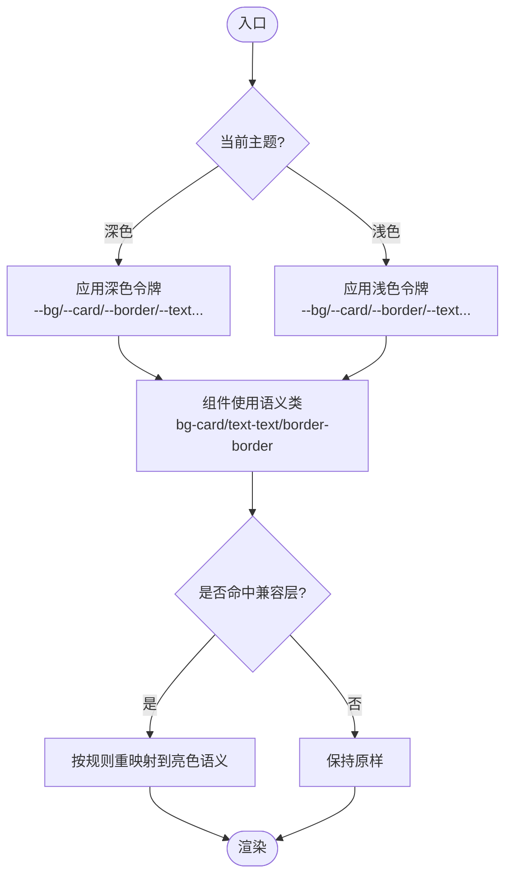
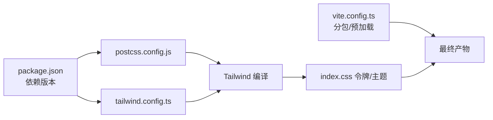

# 样式系统

<cite>
**本文引用的文件**
- [tailwind.config.ts](file://web/tailwind.config.ts)
- [postcss.config.js](file://web/postcss.config.js)
- [index.css](file://web/src/styles/index.css)
- [package.json](file://web/package.json)
- [vite.config.ts](file://web/vite.config.ts)
- [Button.tsx](file://web/src/components/ui/Button.tsx)
- [Card.tsx](file://web/src/components/ui/Card.tsx)
- [Chip.tsx](file://web/src/components/ui/Chip.tsx)
- [EmptyState.tsx](file://web/src/components/ui/EmptyState.tsx)
- [PageHeader.tsx](file://web/src/components/ui/PageHeader.tsx)
- [PaginationFooter.tsx](file://web/src/components/ui/PaginationFooter.tsx)
- [RoleSelect.tsx](file://web/src/components/ui/RoleSelect.tsx)
- [AdminLayout.tsx](file://web/src/pages/AdminLayout.tsx)
- [Dashboard.tsx](file://web/src/pages/Dashboard.tsx)
- [EdgeDetail.tsx](file://web/src/pages/EdgeDetail.tsx)
</cite>

## 目录
1. [简介](#简介)
2. [项目结构](#项目结构)
3. [核心组件](#核心组件)
4. [架构总览](#架构总览)
5. [详细组件分析](#详细组件分析)
6. [依赖关系分析](#依赖关系分析)
7. [性能考量](#性能考量)
8. [故障排查指南](#故障排查指南)
9. [结论](#结论)
10. [附录](#附录)

## 简介
本技术文档系统性梳理前端样式体系，围绕 Tailwind CSS 的配置与使用、主题定制（深色/浅色）、颜色系统与字体配置、设计令牌（Design Tokens）管理、响应式策略与断点、样式组织与命名约定、一致性视觉风格实践、以及样式性能优化与浏览器兼容性展开。目标是帮助开发者在不深入源码细节的前提下，快速理解并正确扩展该样式系统。

## 项目结构
样式相关的关键位置与职责：
- 构建与工具链
  - PostCSS 插件管线：启用 Tailwind CSS 与 Autoprefixer
  - Vite 构建目标与分包策略影响首屏资源体积
- 主题与令牌
  - Tailwind 配置：内容扫描范围、深色模式开关、字体族与动画扩展、语义化颜色映射
  - 全局样式：定义 CSS 变量（设计令牌），提供深色/浅色两套主题；通过 html.light/html.dark 切换
  - 亮色模式兼容层：将大量已存在的 zinc-* 实用类在亮色模式下重映射到语义令牌，保证渐进迁移
- 组件与页面
  - UI 基础组件统一从 barrel 导出，便于集中约束样式边界
  - 页面广泛使用 Tailwind 原子类与 dark: 变体实现响应式与主题适配

图表来源
- [postcss.config.js:1-7](file://web/postcss.config.js#L1-L7)
- [tailwind.config.ts:1-43](file://web/tailwind.config.ts#L1-L43)
- [index.css:1-684](file://web/src/styles/index.css#L1-L684)
- [vite.config.ts:1-64](file://web/vite.config.ts#L1-L64)

章节来源
- [postcss.config.js:1-7](file://web/postcss.config.js#L1-L7)
- [tailwind.config.ts:1-43](file://web/tailwind.config.ts#L1-L43)
- [index.css:1-684](file://web/src/styles/index.css#L1-L684)
- [vite.config.ts:1-64](file://web/vite.config.ts#L1-L64)

## 核心组件
- 设计令牌（Design Tokens）
  - 通过 CSS 变量集中定义背景、卡片、边框、文本、强调色、信息/警告/成功/危险等语义色，支持 alpha 通道组合
  - 深色主题默认生效，浅色主题通过 :root.light 覆盖
  - 使用 rgb(var(--token) / <alpha-value>) 形式在 Tailwind 中引用，确保可组合透明度
- 主题切换
  - 通过 html 元素上的 .dark 或 .light 类切换主题，同时设置 color-scheme
  - 全局背景与文本颜色绑定到 --bg 与 --text 令牌
- 亮色模式兼容层
  - 为已有大量 zinc-* 用法的代码库提供“重映射”规则，使亮色下保持可读性与层级
  - 对 hover/focus/divide/border/ring 等常用变体进行精细覆盖，避免亮色对比度不足
- 字体与动画
  - 自定义无衬线/等宽字体族
  - 定义轻量级关键帧与动画类，遵循 reduced-motion 偏好
- 第三方库主题适配
  - react-flow 的 Controls/MiniMap 在深色/浅色下的独立样式覆盖
- 打印输出
  - 针对报告 PDF 导出，强制白底黑字并保留强调色，控制分页与可见区域

章节来源
- [index.css:1-684](file://web/src/styles/index.css#L1-L684)

## 架构总览
样式系统的分层与数据流：
- 配置层：Tailwind 配置声明内容扫描、深色模式、主题扩展（字体/颜色/动画）
- 令牌层：CSS 变量定义语义化颜色与背景，html.light/html.dark 切换
- 应用层：组件与页面使用 Tailwind 原子类 + dark: 变体 + 语义令牌类（如 bg-accent）
- 兼容层：亮色模式重映射，确保历史代码平滑过渡
- 构建层：PostCSS 编译、Autoprefixer 补全前缀、Vite 分包与预加载优化

图表来源
- [tailwind.config.ts:1-43](file://web/tailwind.config.ts#L1-L43)
- [index.css:1-684](file://web/src/styles/index.css#L1-L684)
- [postcss.config.js:1-7](file://web/postcss.config.js#L1-L7)
- [vite.config.ts:1-64](file://web/vite.config.ts#L1-L64)

## 详细组件分析

### 主题与令牌（Design Tokens）
- 令牌定义
  - 背景/卡片/边框/文本/强调/状态色均通过 CSS 变量暴露
  - 使用 rgb(var(--token) / <alpha-value>) 以便在 Tailwind 中自由叠加透明度
- 主题切换
  - html.dark 与 html.light 分别定义令牌值，并通过 color-scheme 提示浏览器原生控件配色
  - 全局背景与文本直接绑定令牌，避免硬编码颜色
- 亮色模式兼容
  - 对常见 zinc-* 类进行重映射，确保亮色下对比度与层级一致
  - 对 hover/focus/divide/border/ring 等变体逐一覆盖，减少回归风险
- 字体与动画
  - 自定义 sans/mono 字体族
  - 轻量动画与 keyframes，尊重 prefers-reduced-motion

图表来源
- [index.css:1-684](file://web/src/styles/index.css#L1-L684)

章节来源
- [index.css:1-684](file://web/src/styles/index.css#L1-L684)

### 颜色系统与品牌色
- 语义色
  - accent/accent-fg/info/warn/ok/danger 等语义色通过令牌驱动，便于统一品牌与无障碍对比度
- 亮色模式下的可读性
  - 对浅色系文本与填充进行降级处理，确保 AA 级对比度
- 第三方组件
  - react-flow 的控制面板与小地图在深浅色下分别适配，避免被画布吞没

章节来源
- [index.css:1-684](file://web/src/styles/index.css#L1-L684)

### 字体配置
- 自定义字体族
  - 无衬线字体优先 Inter，回退至系统字体栈
  - 等宽字体优先 JetBrains Mono，回退至系统等宽字体
- 使用方式
  - 通过 Tailwind 的 theme('fontFamily.*') 引用，或在 CSS 中直接使用

章节来源
- [tailwind.config.ts:1-43](file://web/tailwind.config.ts#L1-L43)
- [index.css:1-684](file://web/src/styles/index.css#L1-L684)

### 响应式设计策略与断点
- 断点使用
  - 广泛采用 sm/md/lg/xl/2xl 等断点，结合 grid/flex 布局在不同屏幕尺寸下自适应
- 典型用法
  - 导航栏在小屏隐藏快捷键提示，在大屏显示
  - 仪表盘统计卡片在小屏单列，中大屏多列
  - 详情页信息分组在不同断点切换列数
- 建议
  - 以内容为中心选择断点，避免过度细分
  - 优先使用 Tailwind 内置断点，必要时在配置中扩展

章节来源
- [AdminLayout.tsx:73-140](file://web/src/pages/AdminLayout.tsx#L73-L140)
- [Dashboard.tsx:355-446](file://web/src/pages/Dashboard.tsx#L355-L446)
- [EdgeDetail.tsx:679-753](file://web/src/pages/EdgeDetail.tsx#L679-L753)

### 样式组织与命名约定
- 组织方式
  - 全局令牌与主题集中在 index.css
  - 基础 UI 组件集中在 components/ui，并通过 barrel 统一导出，避免散落 className
  - 页面组件使用 Tailwind 原子类 + dark: 变体，尽量不新增全局样式
- 命名约定
  - 语义类名优先（如 bg-card、text-text、border-border）
  - 组件内部局部样式使用 BEM 风格或模块级作用域，避免污染全局
  - 亮色兼容规则集中在 index.css 的注释区块内，便于维护

章节来源
- [index.ts:1-11](file://web/src/components/ui/index.ts#L1-L11)
- [index.css:1-684](file://web/src/styles/index.css#L1-L684)

### 使用示例：创建一致的视觉风格
- 按钮与卡片
  - 使用语义背景与边框令牌，配合圆角与阴影，形成统一的卡片风格
  - 主操作按钮在深色下使用高对比中性填充，浅色下自动翻转角色，保持一致的视觉层级
- 标签与状态
  - 使用 info/warn/ok/danger 语义色，搭配半透明背景与边框，形成“软填充”标签风格
- 表格与列表
  - 使用 divide-* 分割线，亮色模式下自动柔化，避免行分隔过于突兀
- 交互反馈
  - focus-visible 在输入框上仅通过边框变化表达焦点，其他控件保留 outline 环，兼顾可用性与美观

章节来源
- [Button.tsx](file://web/src/components/ui/Button.tsx)
- [Card.tsx](file://web/src/components/ui/Card.tsx)
- [Chip.tsx](file://web/src/components/ui/Chip.tsx)
- [EmptyState.tsx](file://web/src/components/ui/EmptyState.tsx)
- [PageHeader.tsx](file://web/src/components/ui/PageHeader.tsx)
- [PaginationFooter.tsx](file://web/src/components/ui/PaginationFooter.tsx)
- [RoleSelect.tsx](file://web/src/components/ui/RoleSelect.tsx)
- [index.css:1-684](file://web/src/styles/index.css#L1-L684)

## 依赖关系分析
- 构建依赖
  - PostCSS 插件：tailwindcss、autoprefixer
  - Tailwind 版本锁定于 package.json
  - Vite 构建目标 es2020，按需拆分 vendor-charts/vendor-xterm 以降低首屏体积
- 运行时依赖
  - 主题切换由 html 类驱动，无需额外运行时库
  - 第三方库（react-flow）样式通过全局覆盖适配

图表来源
- [package.json:1-56](file://web/package.json#L1-L56)
- [postcss.config.js:1-7](file://web/postcss.config.js#L1-L7)
- [tailwind.config.ts:1-43](file://web/tailwind.config.ts#L1-L43)
- [vite.config.ts:1-64](file://web/vite.config.ts#L1-L64)

章节来源
- [package.json:1-56](file://web/package.json#L1-L56)
- [postcss.config.js:1-7](file://web/postcss.config.js#L1-L7)
- [tailwind.config.ts:1-43](file://web/tailwind.config.ts#L1-L43)
- [vite.config.ts:1-64](file://web/vite.config.ts#L1-L64)

## 性能考量
- 样式体积
  - 通过 Tailwind 的内容扫描仅生成使用的类，减少冗余
  - 亮色兼容层虽长但仅在编译时存在，不影响运行时
- 首屏优化
  - Vite 将重依赖（recharts、xterm）拆分为独立 chunk，并从 modulePreload 列表中剔除，避免登录页携带无关资源
- 渲染性能
  - 使用 CSS 变量与原子类，减少复杂选择器与重排
  - 动画与关键帧轻量，且尊重 reduced-motion
- 可访问性
  - 亮色模式下调暗浅色系文本，确保 AA 对比度
  - 聚焦态在输入框上仅改变边框，避免多余 outline 干扰

[本节为通用指导，不直接分析具体文件]

## 故障排查指南
- 亮色模式下某些元素不可见或对比度不足
  - 检查是否命中亮色兼容层；若未命中，可在 index.css 中添加对应类的重映射规则
- 第三方组件（如 react-flow）主题异常
  - 确认全局覆盖规则是否生效；必要时提高选择器优先级或使用 !important（谨慎）
- 打印输出颜色不正确
  - 检查 @media print 中的覆盖规则，确保 report-print-area 内的元素可见且颜色正确
- 构建后样式缺失
  - 确认 tailwind.config.ts 的 content 路径包含所有模板与组件路径
  - 确认 PostCSS 插件顺序正确（tailwindcss 在前，autoprefixer 在后）

章节来源
- [index.css:1-684](file://web/src/styles/index.css#L1-L684)
- [postcss.config.js:1-7](file://web/postcss.config.js#L1-L7)
- [tailwind.config.ts:1-43](file://web/tailwind.config.ts#L1-L43)

## 结论
本项目采用“语义令牌 + Tailwind 原子类 + 亮色兼容层”的组合策略，既保证了品牌一致性与可维护性，又兼顾了历史代码的平滑迁移。通过 PostCSS 与 Vite 的配合，实现了高效的样式构建与体积优化。建议在后续迭代中逐步将更多硬编码颜色替换为语义令牌，进一步降低主题切换成本并提升可访问性。

## 附录
- 快速上手
  - 在组件中使用语义类：bg-card、text-text、border-border、bg-accent 等
  - 使用 dark: 变体实现暗色专属样式
  - 通过 html.light/html.dark 切换主题
- 扩展主题
  - 在 tailwind.config.ts 中扩展 colors/fontFamily/animations
  - 在 index.css 中新增 CSS 变量并在 Tailwind 中引用
- 最佳实践
  - 优先使用原子类与语义令牌，避免新增全局样式
  - 新增亮色兼容规则时，添加清晰注释说明用途与覆盖范围
  - 关注可访问性：对比度、聚焦态、动画偏好

[本节为通用指导，不直接分析具体文件]