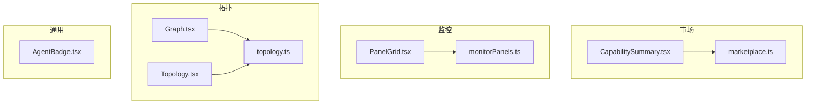
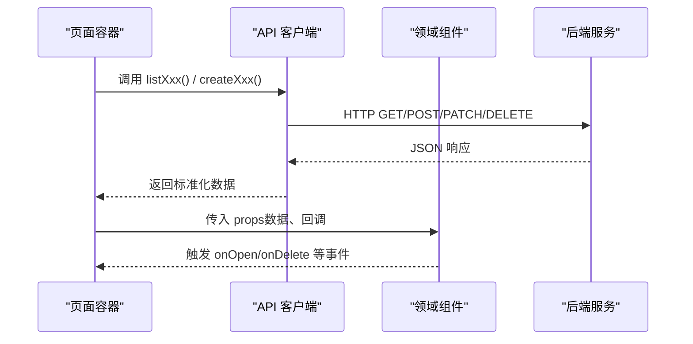
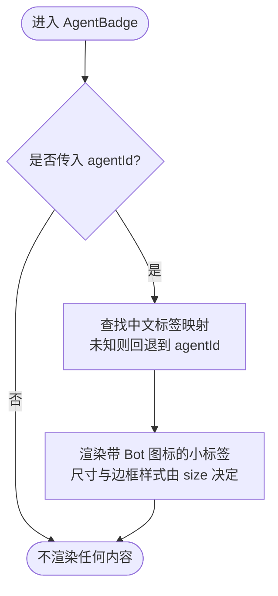
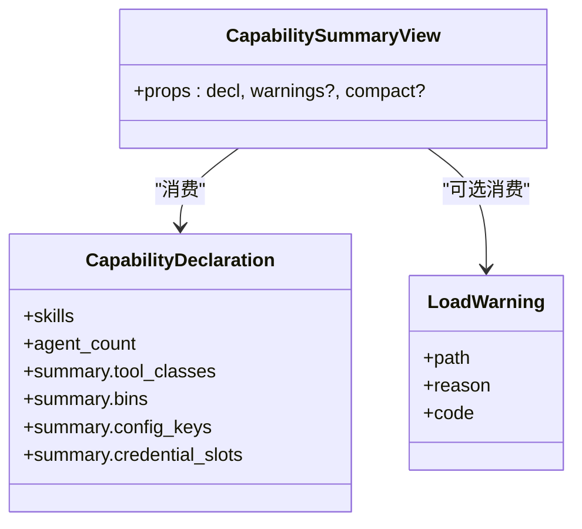
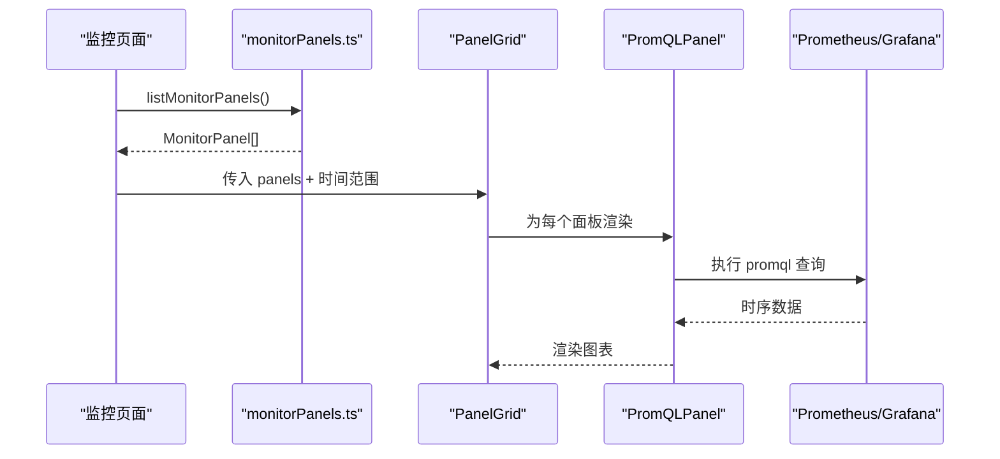
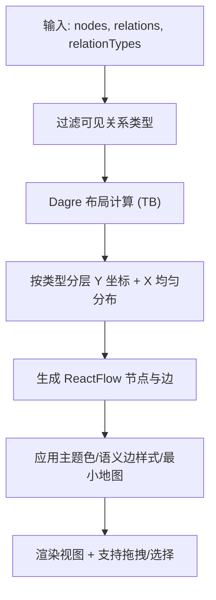
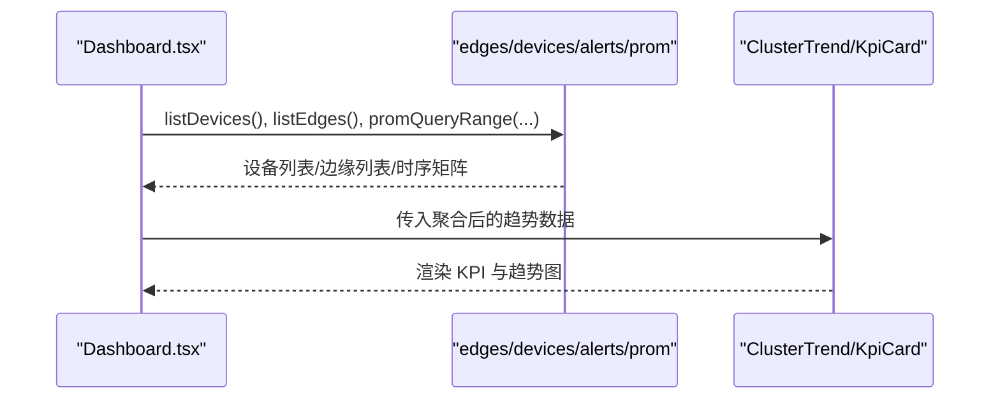
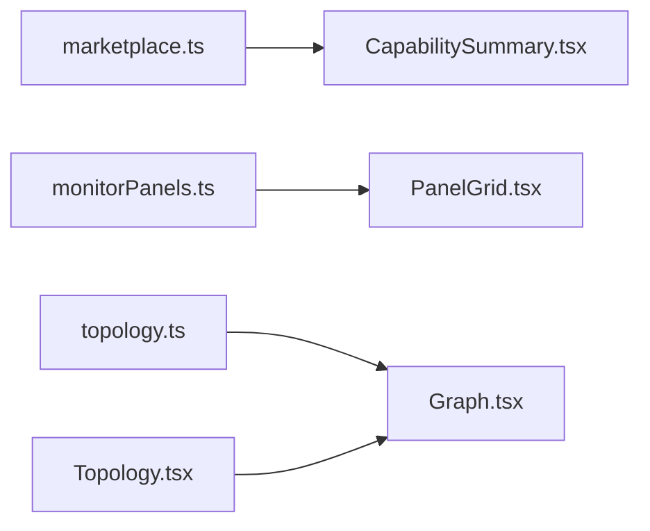

# 领域组件

<cite>
**本文引用的文件**
- [AgentBadge.tsx](file://web/src/components/AgentBadge.tsx)
- [CapabilitySummary.tsx](file://web/src/components/marketplace/CapabilitySummary.tsx)
- [marketplace.ts](file://web/src/api/marketplace.ts)
- [PanelGrid.tsx](file://web/src/components/monitor/PanelGrid.tsx)
- [monitorPanels.ts](file://web/src/api/monitorPanels.ts)
- [Graph.tsx](file://web/src/components/topology/Graph.tsx)
- [topology.ts](file://web/src/api/topology.ts)
- [Topology.tsx](file://web/src/pages/Topology.tsx)
- [Dashboard.tsx](file://web/src/pages/Dashboard.tsx)
</cite>

## 目录
1. [简介](#简介)
2. [项目结构](#项目结构)
3. [核心组件](#核心组件)
4. [架构总览](#架构总览)
5. [详细组件分析](#详细组件分析)
6. [依赖关系分析](#依赖关系分析)
7. [性能考虑](#性能考虑)
8. [故障排查指南](#故障排查指南)
9. [结论](#结论)
10. [附录：使用示例与配置项](#附录使用示例与配置项)

## 简介
本技术文档聚焦于业务领域的若干前端组件，包括市场能力摘要、监控面板网格、拓扑图、代理徽章等。文档从数据模型、状态管理、后端 API 交互、业务逻辑封装与可复用性设计等方面展开，并提供使用示例、配置选项、定制化能力以及性能优化建议，帮助读者在真实业务场景中高效集成与扩展这些组件。

## 项目结构
本项目的前端位于 web/src 目录，领域组件按功能域组织：
- 市场（Marketplace）：能力声明、安装结果、警告展示等
- 监控（Monitor）：PromQL 驱动的仪表盘网格布局与渲染
- 拓扑（Topology）：节点、关系、关系类型的数据建模与可视化
- 通用 UI：如代理徽章等跨页面复用的视觉标记

图表来源
- [CapabilitySummary.tsx:1-124](file://web/src/components/marketplace/CapabilitySummary.tsx#L1-L124)
- [marketplace.ts:1-304](file://web/src/api/marketplace.ts#L1-L304)
- [PanelGrid.tsx:1-78](file://web/src/components/monitor/PanelGrid.tsx#L1-L78)
- [monitorPanels.ts:1-60](file://web/src/api/monitorPanels.ts#L1-L60)
- [Graph.tsx:1-503](file://web/src/components/topology/Graph.tsx#L1-L503)
- [topology.ts:1-227](file://web/src/api/topology.ts#L1-L227)
- [Topology.tsx:1-800](file://web/src/pages/Topology.tsx#L1-L800)

章节来源
- [CapabilitySummary.tsx:1-124](file://web/src/components/marketplace/CapabilitySummary.tsx#L1-L124)
- [marketplace.ts:1-304](file://web/src/api/marketplace.ts#L1-L304)
- [PanelGrid.tsx:1-78](file://web/src/components/monitor/PanelGrid.tsx#L1-L78)
- [monitorPanels.ts:1-60](file://web/src/api/monitorPanels.ts#L1-L60)
- [Graph.tsx:1-503](file://web/src/components/topology/Graph.tsx#L1-L503)
- [topology.ts:1-227](file://web/src/api/topology.ts#L1-L227)
- [Topology.tsx:1-800](file://web/src/pages/Topology.tsx#L1-L800)

## 核心组件
- 代理徽章（AgentBadge）：用于会话或侧边栏中显示当前会话绑定的“代理”身份，提供尺寸与样式控制，支持多语言标签映射。
- 市场能力摘要（CapabilitySummaryView）：展示已安装包的能力声明（技能数、代理数、工具类、二进制依赖、配置键）、破坏性工具提示与加载警告。
- 监控面板网格（PanelGrid）：基于 Grafana 的 24 列网格布局，将 PromQL 面板以响应式方式排列，窄屏自动折叠为单列。
- 拓扑图（TopologyGraph）：基于 React Flow + Dagre 的层级化有向图，按节点类型分层、按关系语义着色与虚线样式，支持最小地图、缩放、拖拽与选择高亮。

章节来源
- [AgentBadge.tsx:1-71](file://web/src/components/AgentBadge.tsx#L1-L71)
- [CapabilitySummary.tsx:1-124](file://web/src/components/marketplace/CapabilitySummary.tsx#L1-L124)
- [PanelGrid.tsx:1-78](file://web/src/components/monitor/PanelGrid.tsx#L1-L78)
- [Graph.tsx:1-503](file://web/src/components/topology/Graph.tsx#L1-L503)

## 架构总览
各组件遵循“API 客户端 + 领域组件 + 页面容器”的分层模式：
- API 客户端负责与后端 REST 接口通信，定义 TS 类型并做必要的字段归一化
- 领域组件专注展示与交互，不直接处理网络请求
- 页面容器组合多个组件，编排数据获取、错误处理与用户操作

图表来源
- [marketplace.ts:207-270](file://web/src/api/marketplace.ts#L207-L270)
- [monitorPanels.ts:39-59](file://web/src/api/monitorPanels.ts#L39-L59)
- [topology.ts:23-154](file://web/src/api/topology.ts#L23-L154)
- [CapabilitySummary.tsx:16-84](file://web/src/components/marketplace/CapabilitySummary.tsx#L16-L84)
- [PanelGrid.tsx:15-77](file://web/src/components/monitor/PanelGrid.tsx#L15-L77)
- [Graph.tsx:208-309](file://web/src/components/topology/Graph.tsx#L208-L309)

## 详细组件分析

### 代理徽章（AgentBadge）
- 职责：统一渲染会话绑定的代理标识，避免多处重复样式；支持 xs/sm 两种尺寸；默认颜色固定，强调“会话绑定”而非“角色区分”。
- 数据模型：接收 agentId（字符串或空），通过内置映射表转换为本地化中文标签，未知 ID 回退到原始 agentId。
- 状态管理：无外部状态，纯展示组件；内部仅读取 i18n 翻译。
- 与后端交互：无直接 API 调用，通常由上层页面根据会话上下文传入 agentId。
- 可复用性：作为原子 UI 组件，可在聊天头、侧边栏、列表等多处复用。
- 配置选项：agentId、size（xs|sm）、className。
- 使用示例：在会话头部或侧边栏列表中，根据当前会话的 agentId 渲染徽章，提示该会话固定使用的代理身份。

图表来源
- [AgentBadge.tsx:41-69](file://web/src/components/AgentBadge.tsx#L41-L69)

章节来源
- [AgentBadge.tsx:1-71](file://web/src/components/AgentBadge.tsx#L1-L71)

### 市场能力摘要（CapabilitySummaryView）
- 职责：集中展示已安装包的能力声明，突出风险等级（destructive）与加载警告，辅助安装确认与详情展开。
- 数据模型：
  - CapabilityDeclaration：包含 skills、agent_count、summary（tool_classes、bins、config_keys、credential_slots）
  - LoadWarning：path、reason、code
- 状态管理：纯展示组件，props 驱动；warnings 可选，compact 模式减少间距。
- 与后端交互：由上层页面调用 marketplace API 获取 InstalledPack 与 CapabilityDeclaration，再传入组件。
- 可复用性：既用于安装确认弹窗，也用于已安装列表的详情展开。
- 配置选项：decl、warnings、compact。
- 使用示例：在安装流程中，展示即将安装的包会引入哪些工具类、二进制与配置键，若包含 destructive 则给出二次审核提示。

图表来源
- [marketplace.ts:41-91](file://web/src/api/marketplace.ts#L41-L91)
- [CapabilitySummary.tsx:16-84](file://web/src/components/marketplace/CapabilitySummary.tsx#L16-L84)

章节来源
- [CapabilitySummary.tsx:1-124](file://web/src/components/marketplace/CapabilitySummary.tsx#L1-L124)
- [marketplace.ts:1-304](file://web/src/api/marketplace.ts#L1-L304)

### 监控面板网格（PanelGrid）
- 职责：将 Grafana 风格的 PromQL 面板以 24 列网格布局渲染，窄屏自动折叠为单列，保证可读性。
- 数据模型：GrafanaPanel（含 gridPos.w/h、id、title、targets.promql 等），由上层通过 monitorPanels API 获取。
- 状态管理：监听窗口宽度变化以切换布局；每个面板通过 PromQLPanel 独立查询与刷新。
- 与后端交互：通过 monitorPanels.ts 提供的 CRUD 接口管理面板元数据；实际指标数据由 PromQLPanel 查询 Prometheus/Grafana。
- 可复用性：可作为通用网格容器嵌入任意监控页面。
- 配置选项：panels、range、fromMs、toMs、tick、grafanaBase、dashboardUid、orgId、onOpenPanel。
- 使用示例：在监控页面上列出所有用户自定义面板，按 ordinal 排序并以网格形式呈现，点击可跳转至 Grafana 查看。

图表来源
- [monitorPanels.ts:39-59](file://web/src/api/monitorPanels.ts#L39-L59)
- [PanelGrid.tsx:15-77](file://web/src/components/monitor/PanelGrid.tsx#L15-L77)

章节来源
- [PanelGrid.tsx:1-78](file://web/src/components/monitor/PanelGrid.tsx#L1-L78)
- [monitorPanels.ts:1-60](file://web/src/api/monitorPanels.ts#L1-L60)

### 拓扑图（TopologyGraph）
- 职责：可视化节点与关系，按节点类型分层（应用→服务→集群→网络设备→主机→机架），按关系语义着色与虚线样式，支持最小地图、缩放、拖拽与选择高亮。
- 数据模型：
  - TopologyNode：id、type、name、props
  - TopologyRelation：id、src_id、dst_id、type、props
  - RelationType：name、display_name、direction、semantics_tag、propagates_failure
- 状态管理：
  - 布局计算为纯函数（layoutGraph），输入 nodes/relations/relationTypes 输出 ReactFlow 节点与边
  - 拖拽位置保存在本地 state，避免每次重绘覆盖用户调整
  - 主题切换影响节点与边的颜色
- 与后端交互：通过 topology.ts 的 listNodes/listRelations/listRelationTypes 等接口获取数据；创建/更新/删除需管理员权限。
- 可复用性：作为可视化引擎，可被拓扑页面或其他需要图谱的场景复用。
- 配置选项：nodes、relations、relationTypes、selectedID、hideOrphans、visibleRelationTypes、onSelect。
- 使用示例：在拓扑页面中，展示业务系统与其依赖的服务、数据库、主机等关系，帮助定位故障传播路径。

图表来源
- [Graph.tsx:327-502](file://web/src/components/topology/Graph.tsx#L327-L502)
- [topology.ts:9-134](file://web/src/api/topology.ts#L9-L134)

章节来源
- [Graph.tsx:1-503](file://web/src/components/topology/Graph.tsx#L1-L503)
- [topology.ts:1-227](file://web/src/api/topology.ts#L1-L227)
- [Topology.tsx:1-800](file://web/src/pages/Topology.tsx#L1-L800)

### 仪表盘聚合（Dashboard）中的领域能力
- 职责：聚合设备在线数、CPU/MEM 趋势、LLM 用量、本周会话数、活跃告警等关键指标，提供钻取到 Prometheus 的能力。
- 数据模型：EdgeRow（edge + cpu/mem 历史）、Incident、UsageToday 等。
- 状态管理：使用 useState/useMemo 维护数据与派生指标；usePoll 定时刷新。
- 与后端交互：调用 edges/devices/alerts/prom 相关 API，进行批量查询与结果归并。
- 可复用性：KpiCard、ClusterTrend、ClusterPosture 等子组件可被其他页面复用。
- 使用示例：首页展示集群态势与资源趋势，点击 CPU 卡片可打开对应设备的指标钻取视图。

图表来源
- [Dashboard.tsx:75-231](file://web/src/pages/Dashboard.tsx#L75-L231)
- [Dashboard.tsx:502-632](file://web/src/pages/Dashboard.tsx#L502-L632)

章节来源
- [Dashboard.tsx:1-800](file://web/src/pages/Dashboard.tsx#L1-L800)

## 依赖关系分析
- 组件与 API 解耦：领域组件通过 props 消费数据，API 客户端负责网络与类型归一化，便于替换后端或测试模拟。
- 拓扑图的强内聚：Graph.tsx 内部完成布局、样式与交互，对外暴露简洁的 props 接口；topology.ts 提供完整的 CRUD 能力。
- 监控网格的弱耦合：PanelGrid 仅关注布局与时间范围，具体面板内容由 PromQLPanel 实现，利于扩展不同图表类型。
- 市场能力摘要的声明式消费：CapabilitySummaryView 只关心 CapabilityDeclaration 的结构，对数据来源透明。

图表来源
- [marketplace.ts:207-270](file://web/src/api/marketplace.ts#L207-L270)
- [monitorPanels.ts:39-59](file://web/src/api/monitorPanels.ts#L39-L59)
- [topology.ts:23-154](file://web/src/api/topology.ts#L23-L154)
- [CapabilitySummary.tsx:16-84](file://web/src/components/marketplace/CapabilitySummary.tsx#L16-L84)
- [PanelGrid.tsx:15-77](file://web/src/components/monitor/PanelGrid.tsx#L15-L77)
- [Graph.tsx:208-309](file://web/src/components/topology/Graph.tsx#L208-L309)
- [Topology.tsx:14-80](file://web/src/pages/Topology.tsx#L14-L80)

章节来源
- [marketplace.ts:1-304](file://web/src/api/marketplace.ts#L1-L304)
- [monitorPanels.ts:1-60](file://web/src/api/monitorPanels.ts#L1-L60)
- [topology.ts:1-227](file://web/src/api/topology.ts#L1-L227)
- [CapabilitySummary.tsx:1-124](file://web/src/components/marketplace/CapabilitySummary.tsx#L1-L124)
- [PanelGrid.tsx:1-78](file://web/src/components/monitor/PanelGrid.tsx#L1-L78)
- [Graph.tsx:1-503](file://web/src/components/topology/Graph.tsx#L1-L503)
- [Topology.tsx:1-800](file://web/src/pages/Topology.tsx#L1-L800)

## 性能考虑
- 批量查询与去重：Dashboard 中对 Prom 指标采用一次 range 查询并按 device_id 分组，避免 N 次往返；设备列表去重后仅选取前若干条以减少后续查询量。
- 布局计算纯函数化：TopologyGraph 的 layoutGraph 为纯函数，避免不必要的重算；拖拽位置本地缓存，防止重绘覆盖。
- 响应式网格：PanelGrid 在小屏下自动折叠为单列，减少横向滚动与重排成本。
- 最小地图与可视优化：拓扑图的最小地图与背景点阵提升导航体验；边标签去重避免重叠。
- 轮询与节流：Dashboard 使用 usePoll 定时刷新，合理设置 REFRESH_MS 平衡实时性与负载。

[本节为通用性能指导，不直接分析具体文件]

## 故障排查指南
- 市场安装错误分类：通过 classifyError 将 ApiError 的状态码映射为稳定错误类型（unauthorized/forbidden/conflict/invalid/not-found/network/internal），便于 UI 展示本地化提示。
- 拓扑权限校验：写操作（创建/更新/删除节点、关系、类型）在服务端限制为管理员；UI 隐藏按钮但仍可能收到 403，应捕获并提示。
- 监控面板同步错误：MonitorPanel 携带 last_sync_error/last_sync_at，可用于诊断面板同步失败原因。
- 拓扑邻接加载失败：节点详情抽屉在加载邻居时并行获取对端节点信息，任一失败不影响整体渲染，但需在 UI 中显示错误提示。

章节来源
- [marketplace.ts:281-304](file://web/src/api/marketplace.ts#L281-L304)
- [topology.ts:1-5](file://web/src/api/topology.ts#L1-L5)
- [monitorPanels.ts:12-24](file://web/src/api/monitorPanels.ts#L12-L24)
- [Topology.tsx:370-401](file://web/src/pages/Topology.tsx#L370-L401)

## 结论
上述领域组件通过清晰的职责划分与稳定的 API 契约，实现了高内聚、低耦合的可复用设计。代理徽章提供一致的会话身份表达；市场能力摘要让安装决策更透明；监控面板网格以响应式布局承载多样化指标；拓扑图则以层级化与语义化可视化支撑故障定位与影响面分析。结合合理的性能策略与完善的错误处理，这些组件能够在复杂业务场景中稳定运行并持续演进。

## 附录：使用示例与配置项
- 代理徽章
  - 配置：agentId、size（xs|sm）、className
  - 示例：在聊天会话头部传入当前会话的 agentId，即可显示对应的代理徽章；未设置时不渲染。
  - 参考路径
    - [AgentBadge.tsx:41-69](file://web/src/components/AgentBadge.tsx#L41-L69)

- 市场能力摘要
  - 配置：decl（CapabilityDeclaration）、warnings（LoadWarning[]）、compact（布尔）
  - 示例：在安装确认弹窗中传入 capability 声明与 warnings，若包含 destructive 工具类，将显示二次审核提示。
  - 参考路径
    - [CapabilitySummary.tsx:16-84](file://web/src/components/marketplace/CapabilitySummary.tsx#L16-L84)
    - [marketplace.ts:41-91](file://web/src/api/marketplace.ts#L41-L91)

- 监控面板网格
  - 配置：panels（GrafanaPanel[]）、range、fromMs、toMs、tick、grafanaBase、dashboardUid、orgId、onOpenPanel
  - 示例：在监控页面调用 listMonitorPanels 获取面板列表，传入 PanelGrid 渲染；点击面板可跳转到 Grafana。
  - 参考路径
    - [PanelGrid.tsx:15-77](file://web/src/components/monitor/PanelGrid.tsx#L15-L77)
    - [monitorPanels.ts:39-59](file://web/src/api/monitorPanels.ts#L39-L59)

- 拓扑图
  - 配置：nodes、relations、relationTypes、selectedID、hideOrphans、visibleRelationTypes、onSelect
  - 示例：在拓扑页面加载节点与关系，传入 Graph 渲染；通过 visibleRelationTypes 过滤噪声关系，聚焦故障传播路径。
  - 参考路径
    - [Graph.tsx:208-309](file://web/src/components/topology/Graph.tsx#L208-L309)
    - [topology.ts:23-154](file://web/src/api/topology.ts#L23-L154)
    - [Topology.tsx:41-83](file://web/src/pages/Topology.tsx#L41-L83)

- 仪表盘聚合
  - 配置：无直接组件配置，通过 Dashboard 页面编排数据源与子组件
  - 示例：首页展示在线设备、CPU/MEM 趋势、LLM 用量与本周会话数；点击 CPU 卡片可打开 Prometheus 钻取。
  - 参考路径
    - [Dashboard.tsx:75-231](file://web/src/pages/Dashboard.tsx#L75-L231)
    - [Dashboard.tsx:502-632](file://web/src/pages/Dashboard.tsx#L502-L632)