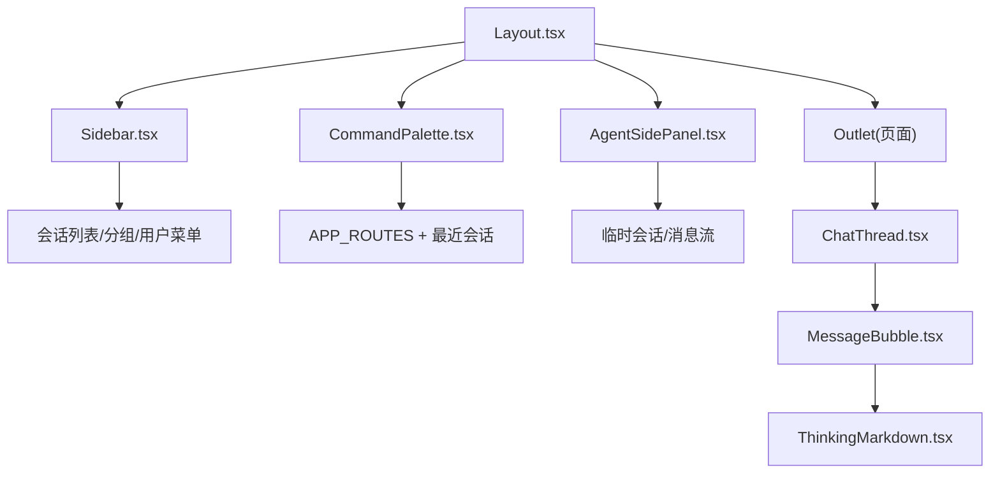
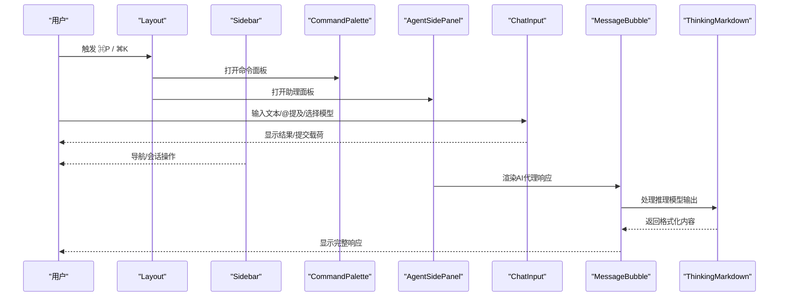
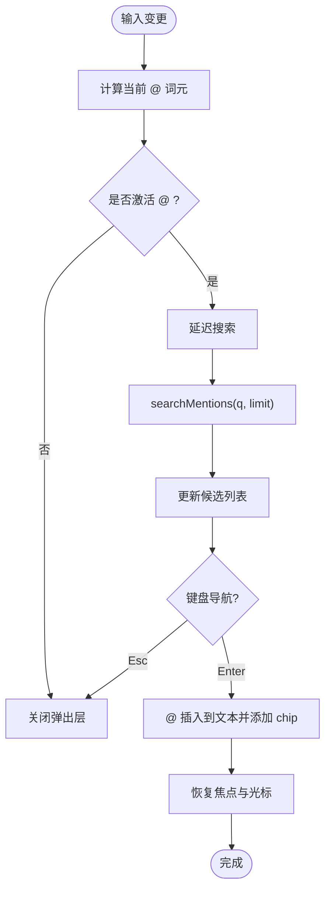
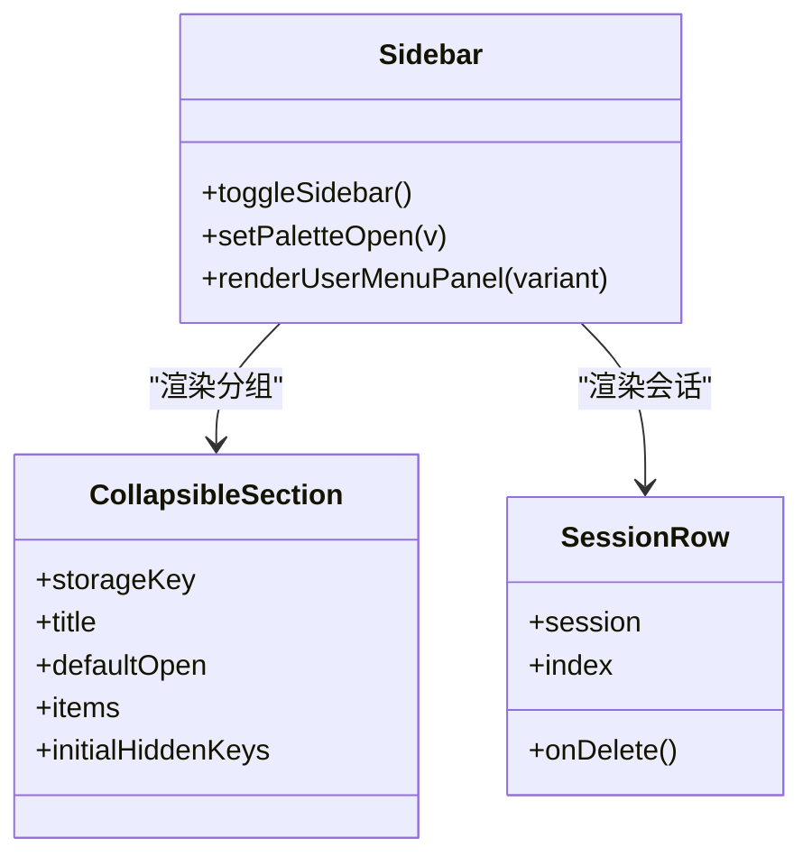
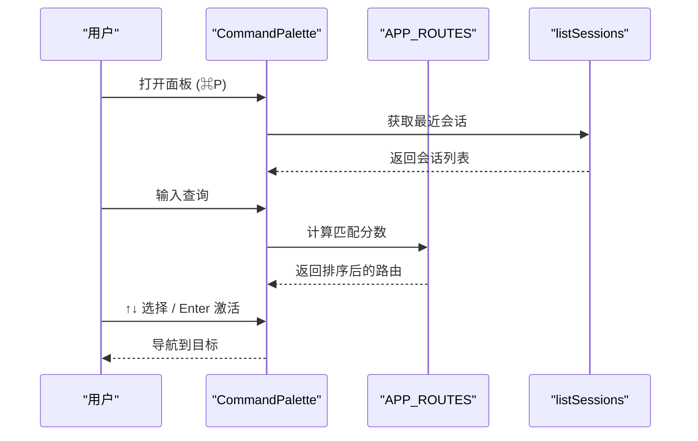
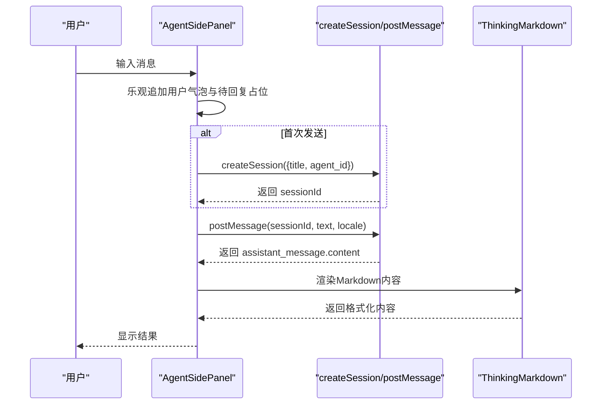
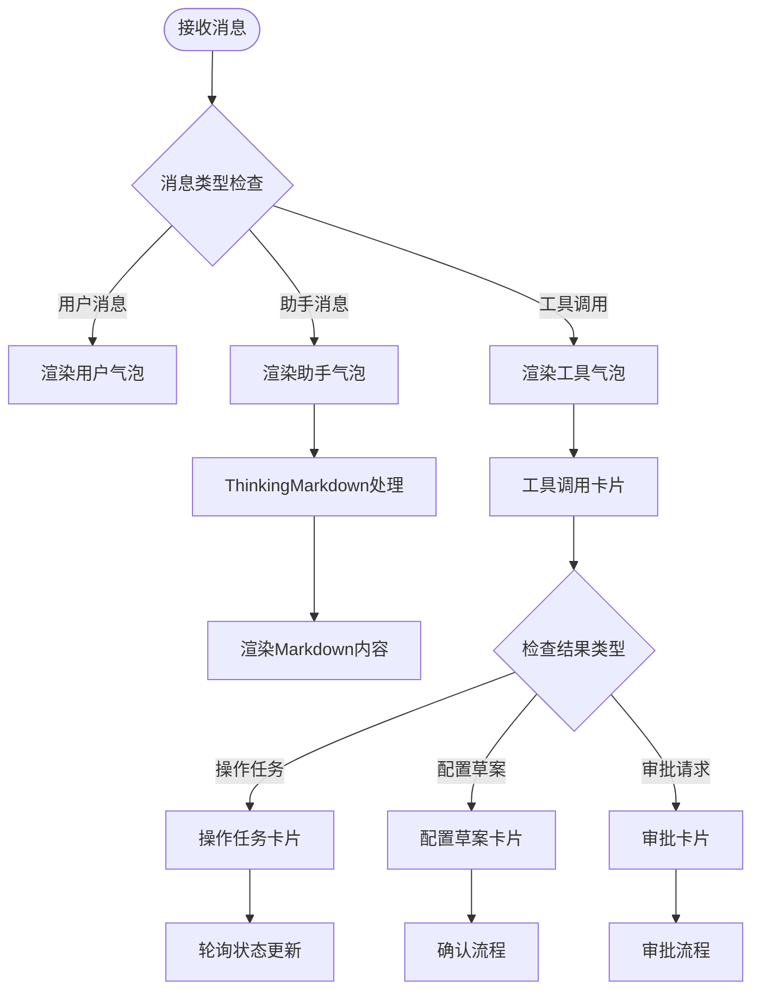
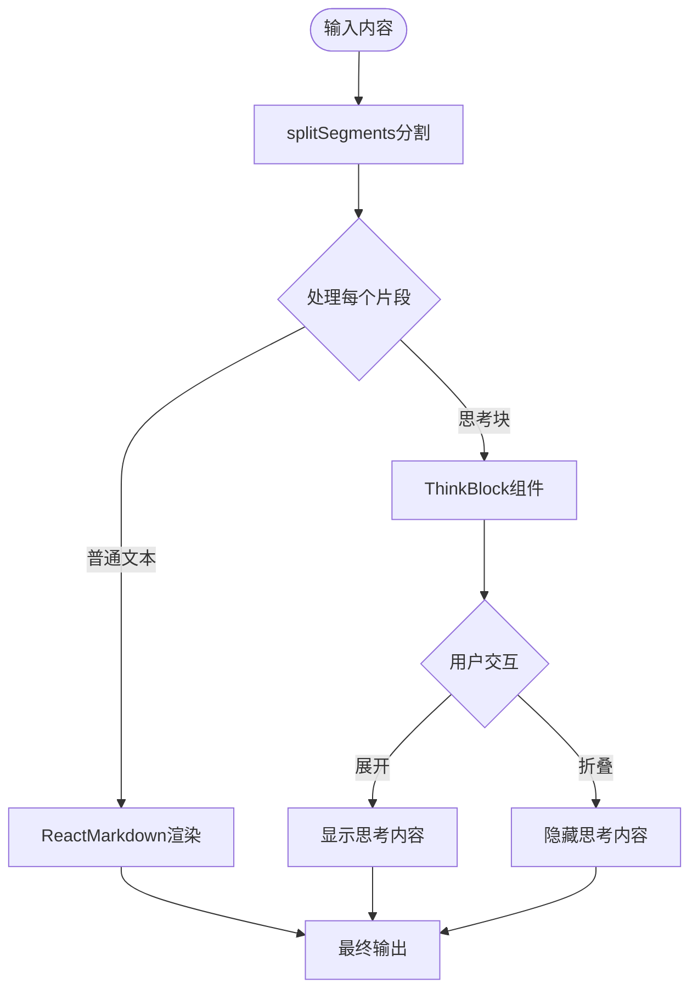
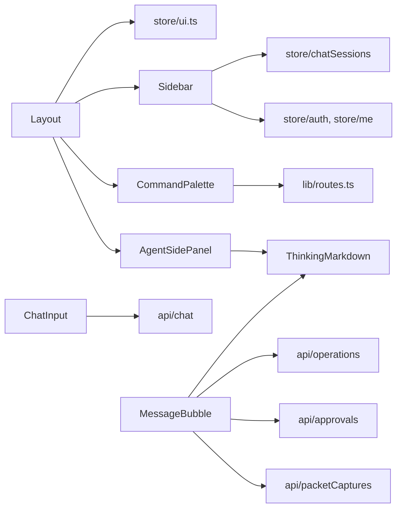

# 高级组件

<cite>
**本文引用的文件**
- [ChatInput.tsx](file://web/src/components/ChatInput.tsx)
- [Layout.tsx](file://web/src/components/Layout.tsx)
- [Sidebar.tsx](file://web/src/components/Sidebar.tsx)
- [CommandPalette.tsx](file://web/src/components/CommandPalette.tsx)
- [AgentSidePanel.tsx](file://web/src/components/AgentSidePanel.tsx)
- [MessageBubble.tsx](file://web/src/components/MessageBubble.tsx)
- [ThinkingMarkdown.tsx](file://web/src/components/ThinkingMarkdown.tsx)
- [ChatThread.tsx](file://web/src/pages/ChatThread.tsx)
- [ui.ts](file://web/src/store/ui.ts)
- [routes.ts](file://web/src/lib/routes.ts)
</cite>

## 更新摘要
**所做更改**
- 新增 MessageBubble 组件详细技术文档（1072行代码）
- 新增 ThinkingMarkdown 智能Markdown处理组件说明
- 更新 AgentSidePanel 集成新Markdown渲染系统的架构
- 增强聊天消息显示和AI代理响应展示功能
- 添加推理模型支持和思考过程可视化

## 目录
1. [简介](#简介)
2. [项目结构](#项目结构)
3. [核心组件](#核心组件)
4. [架构总览](#架构总览)
5. [详细组件分析](#详细组件分析)
6. [依赖关系分析](#依赖关系分析)
7. [性能与内存优化](#性能与内存优化)
8. [故障排查指南](#故障排查指南)
9. [结论](#结论)

## 简介
本技术文档聚焦于 Ongrid Web 前端的高级交互组件：聊天输入框、布局系统、侧边栏、命令面板、助理浮动面板以及全新的AI代理响应显示系统。文档从状态管理、事件处理、用户交互、组合模式与扩展机制（插槽/自定义渲染）、集成配置示例、性能优化与错误处理等维度进行深入解析，帮助开发者快速理解并高效集成这些组件。

**最新更新**：新增了强大的 MessageBubble 组件和 ThinkingMarkdown 智能Markdown处理组件，为AI代理响应提供了专业的显示能力，包括推理过程可视化、工具调用卡片、操作任务管理等高级功能。

## 项目结构
- 组件层
  - 聊天输入框：ChatInput.tsx
  - 布局容器：Layout.tsx
  - 侧边导航：Sidebar.tsx
  - 命令面板：CommandPalette.tsx
  - 助理浮动面板：AgentSidePanel.tsx
  - **新增** AI代理响应气泡：MessageBubble.tsx
  - **新增** 智能Markdown处理：ThinkingMarkdown.tsx
- 页面与业务
  - 聊天线程页面：ChatThread.tsx
- 状态与工具
  - UI 全局状态：store/ui.ts
  - 路由清单与模糊匹配：lib/routes.ts

**图表来源**
- [Layout.tsx:10-57](file://web/src/components/Layout.tsx#L10-L57)
- [AgentSidePanel.tsx:28-253](file://web/src/components/AgentSidePanel.tsx#L28-L253)
- [MessageBubble.tsx:64-80](file://web/src/components/MessageBubble.tsx#L64-L80)
- [ThinkingMarkdown.tsx:60-83](file://web/src/components/ThinkingMarkdown.tsx#L60-L83)
- [ChatThread.tsx:565-573](file://web/src/pages/ChatThread.tsx#L565-L573)

章节来源
- [Layout.tsx:10-57](file://web/src/components/Layout.tsx#L10-L57)
- [AgentSidePanel.tsx:28-253](file://web/src/components/AgentSidePanel.tsx#L28-L253)
- [MessageBubble.tsx:64-80](file://web/src/components/MessageBubble.tsx#L64-L80)
- [ThinkingMarkdown.tsx:60-83](file://web/src/components/ThinkingMarkdown.tsx#L60-L83)
- [ChatThread.tsx:565-573](file://web/src/pages/ChatThread.tsx#L565-L573)

## 核心组件
- 聊天输入框 ChatInput
  - 支持受控/非受控文本、自动高度增长、@提及搜索与插入、模型选择下拉、联网搜索开关、键盘快捷键（Enter/Ctrl+Enter/Shift+Enter）。
  - 提交载荷包含纯文本与结构化 mentions 列表，便于后端 Agent 注入上下文。
- 布局系统 Layout
  - 统一全屏布局，承载侧边栏、主内容区（Outlet）、命令面板与助理面板；注册全局快捷键（⌘K 打开助理面板，⌘P 打开命令面板）。
- 侧边栏 Sidebar
  - 可折叠/展开、分组导航、会话列表（重命名/删除）、用户菜单（语言/主题/登出）、告警未读角标。
- 命令面板 CommandPalette
  - 基于 APP_ROUTES 与最近会话的模糊匹配，键盘驱动的快速导航与跳转。
- 助理面板 AgentSidePanel
  - 轻量浮动聊天窗口，首条消息时懒创建会话，支持 Markdown 渲染与错误提示，关闭后重置状态。
- **新增** AI代理响应气泡 MessageBubble
  - 复杂的AI代理响应显示组件，支持多种消息类型（用户、助手、工具调用）、推理过程可视化、工具调用卡片、操作任务管理、配置草案确认等高级功能。
- **新增** 智能Markdown处理 ThinkingMarkdown
  - 智能Markdown渲染组件，专门处理AI代理的推理模型输出，将思考过程（<mm:think>标签）折叠为可展开的思考块，保持回答内容的清晰可读性。

章节来源
- [ChatInput.tsx:77-451](file://web/src/components/ChatInput.tsx#L77-L451)
- [Layout.tsx:10-57](file://web/src/components/Layout.tsx#L10-L57)
- [Sidebar.tsx:66-533](file://web/src/components/Sidebar.tsx#L66-L533)
- [CommandPalette.tsx:26-224](file://web/src/components/CommandPalette.tsx#L26-L224)
- [AgentSidePanel.tsx:28-253](file://web/src/components/AgentSidePanel.tsx#L28-L253)
- [MessageBubble.tsx:64-80](file://web/src/components/MessageBubble.tsx#L64-L80)
- [ThinkingMarkdown.tsx:60-83](file://web/src/components/ThinkingMarkdown.tsx#L60-L83)

## 架构总览
整体采用"布局容器 + 可插拔面板 + 智能消息渲染"的模式：
- Layout 作为根容器，负责全局快捷键与面板开关状态（来自 store/ui.ts），并通过 Suspense 包裹 Outlet 实现路由级懒加载。
- Sidebar 提供导航与会话管理，CommandPalette 提供跨模块快速跳转，AgentSidePanel 提供轻量即时对话入口。
- ChatInput 作为聊天场景的核心输入组件，向上暴露 SubmitPayload，向下对接 @ 提及搜索与模型选择。
- **新增** MessageBubble 作为AI代理响应的专业渲染器，通过 ThinkingMarkdown 处理推理模型的智能输出。

**图表来源**
- [Layout.tsx:21-44](file://web/src/components/Layout.tsx#L21-L44)
- [AgentSidePanel.tsx:81-128](file://web/src/components/AgentSidePanel.tsx#L81-L128)
- [MessageBubble.tsx:129-150](file://web/src/components/MessageBubble.tsx#L129-L150)
- [ThinkingMarkdown.tsx:60-83](file://web/src/components/ThinkingMarkdown.tsx#L60-L83)

## 详细组件分析

### 聊天输入框 ChatInput
- 状态管理
  - 受控/非受控 value：当 props.value 存在时使用外部控制，否则内部 useState 维护。
  - @ 提及 chips：独立维护 Mention[]，提交时作为结构化 payload 发送。
  - @ 弹出层：popoverOpen、popoverItems、popoverIndex、popoverLoading，基于输入光标位置计算当前 term，延迟 150ms 调用 searchMentions。
  - 模型选择：providers 与 selectedModel 决定下拉展示；无提供商时引导至设置页。
  - 联网搜索：webSearchEnabled 开关影响 Agent 能力暴露。
- 事件处理
  - 自动高度：根据行数上限与行高动态调整 textarea 高度。
  - 键盘交互：↑↓ 切换 @ 候选，Enter 选择或提交， Ctrl/Cmd+Enter 插入换行， Shift+Enter 原生换行。
  - 点击外部关闭：监听 document mousedown，排除浏览器滚动条点击误判。
- 用户交互逻辑
  - @ 提及插入：将 @type:id(label) 片段写入文本，并在上方以 chip 形式展示，支持移除。
  - 模型下拉：智能翻转（根据视口空间）与图标化品牌标识。
  - 提交：过滤空值与禁用态，返回 { text, mentions }。
- 组合与扩展
  - 通过 props 暴露 onChange/onSubmit/providers/selectedModel/onModelChange/webSearchEnabled/onWebSearchToggle，便于宿主页面集成。
  - 子组件 MentionPopover、ModelDropdown、WebSearchToggle 内聚交互细节，降低主组件复杂度。
- 性能与边界
  - 防抖搜索避免频繁请求；mentions 去重；最大行数限制防止过度渲染。
  - IME 输入法组合期间忽略按键，避免中断。
  - 滚动条点击检测避免误关弹出层。

**图表来源**
- [ChatInput.tsx:159-206](file://web/src/components/ChatInput.tsx#L159-L206)
- [ChatInput.tsx:221-245](file://web/src/components/ChatInput.tsx#L221-L245)
- [ChatInput.tsx:260-313](file://web/src/components/ChatInput.tsx#L260-L313)

章节来源
- [ChatInput.tsx:77-451](file://web/src/components/ChatInput.tsx#L77-L451)
- [ChatInput.tsx:470-576](file://web/src/components/ChatInput.tsx#L470-L576)
- [ChatInput.tsx:605-725](file://web/src/components/ChatInput.tsx#L605-L725)
- [ChatInput.tsx:727-758](file://web/src/components/ChatInput.tsx#L727-L758)

### 布局系统 Layout
- 职责
  - 初始化未确认告警计数轮询（useIncidentBadge.start/stop）。
  - 全局快捷键绑定：⌘K 切换助理面板，⌘P 切换命令面板。
  - 渲染侧边栏、主内容区（Suspense + Outlet）、命令面板与助理面板。
- 状态管理
  - 通过 useUi 读取/设置 paletteOpen 与 agentPanelOpen，保证多入口一致。
- 用户体验
  - 路由懒加载时的 Loading 文案使用轻量 trInline，避免 i18n 订阅闪烁。

章节来源
- [Layout.tsx:10-57](file://web/src/components/Layout.tsx#L10-L57)
- [Layout.tsx:60-71](file://web/src/components/Layout.tsx#L60-L71)
- [ui.ts:19-38](file://web/src/store/ui.ts#L19-L38)

### 侧边栏 Sidebar
- 结构与导航
  - 顶部品牌与用户信息区，支持折叠/展开。
  - 分组导航：Agent、知识库、基础设施、监控告警、日常等，支持本地存储记忆展开状态与隐藏项。
  - 会话列表：支持重命名（双击/编辑）、删除（二次确认）、按标题排序与分页展示。
- 用户菜单
  - 语言切换（zh-CN/en-US）、主题切换（跟随系统/深色/浅色）、退出登录。
- 权限与可见性
  - 管理员专属入口（用户管理、设置）仅对 isAdmin 可见。
- 交互细节
  - 用户菜单点击外部关闭、Esc 关闭。
  - 告警未读数驱动角标与折叠态小点。

**图表来源**
- [Sidebar.tsx:66-533](file://web/src/components/Sidebar.tsx#L66-L533)
- [Sidebar.tsx:740-800](file://web/src/components/Sidebar.tsx#L740-L800)
- [Sidebar.tsx:535-671](file://web/src/components/Sidebar.tsx#L535-L671)

章节来源
- [Sidebar.tsx:66-533](file://web/src/components/Sidebar.tsx#L66-L533)
- [Sidebar.tsx:535-671](file://web/src/components/Sidebar.tsx#L535-L671)
- [Sidebar.tsx:740-800](file://web/src/components/Sidebar.tsx#L740-L800)

### 命令面板 CommandPalette
- 功能
  - 模糊匹配 APP_ROUTES（标签、路径、关键词）与最近会话（最多 5 条）。
  - 键盘驱动：↑↓ 移动、Enter 激活、Esc 关闭；打开时锁定 body 滚动。
- 数据流
  - 每次打开重新拉取最近会话，确保跨标签页新建会话可见。
  - 结果扁平化（路由在前，会话在后），activeIndex 始终在范围内。
- 导航行为
  - 选择路由直接 navigate；选择会话跳转到 /chat/:id 并关闭面板。

**图表来源**
- [CommandPalette.tsx:26-116](file://web/src/components/CommandPalette.tsx#L26-L116)
- [routes.ts:63-112](file://web/src/lib/routes.ts#L63-L112)

章节来源
- [CommandPalette.tsx:26-224](file://web/src/components/CommandPalette.tsx#L26-L224)
- [routes.ts:1-112](file://web/src/lib/routes.ts#L1-L112)

### 助理面板 AgentSidePanel
- 特性
  - 轻量浮动聊天：仅用户/助手消息，无工具卡片与流式输出。
  - 懒创建会话：首次发送时创建会话，标题取自首条消息前 30 字符。
  - 错误处理：失败时在消息中显示错误提示，保持输入可用。
  - 关闭重置：关闭后延迟清空状态，避免动画期间闪烁。
- 交互
  - Esc 关闭；Enter 发送，Shift+Enter 换行；自动滚动到底部。
  - 支持在完整会话页继续对话（跳转 /chat/:id）。
- **更新** Markdown渲染集成
  - 集成 ThinkingMarkdown 组件，支持AI代理的推理模型输出。
  - 自动处理推理过程的折叠显示，保持回答内容的清晰度。

**图表来源**
- [AgentSidePanel.tsx:81-128](file://web/src/components/AgentSidePanel.tsx#L81-L128)
- [AgentSidePanel.tsx:130-143](file://web/src/components/AgentSidePanel.tsx#L130-L143)
- [AgentSidePanel.tsx:273-275](file://web/src/components/AgentSidePanel.tsx#L273-L275)

章节来源
- [AgentSidePanel.tsx:28-253](file://web/src/components/AgentSidePanel.tsx#L28-L253)

### **新增** AI代理响应气泡 MessageBubble
- 核心功能
  - 智能消息路由：根据消息类型（用户、助手、工具调用）自动选择合适的渲染组件。
  - 推理过程可视化：集成 ThinkingMarkdown 处理AI代理的推理模型输出。
  - 工具调用卡片：显示工具执行状态、参数、结果和错误信息。
  - 操作任务管理：支持长时间运行的操作任务，实时状态更新和操作控制。
  - 配置草案确认：支持安全敏感的配置变更，提供预览和确认流程。
  - 审批工作流：内置的审批机制，支持需要人工确认的操作。
- 消息类型处理
  - 用户消息：紧凑的右侧气泡样式，特殊确认消息的文本压缩。
  - 助手消息：文档风格的Markdown渲染，支持代码块、表格、列表等富文本。
  - 工具调用：可折叠的工具调用卡片，显示执行状态和详细信息。
  - 工具结果：智能解析JSON结果，显示操作任务或配置草案。
- 状态管理
  - 工具调用状态：pending、success、error、timeout等多种状态。
  - 操作任务状态：created、queued、running、succeeded、failed等生命周期。
  - 配置草案状态：idle、submitting、confirmed、cancelled等确认流程。
  - 审批状态：loading、idle、busy、done、rejected、error、stale等审批流程。
- 交互功能
  - 工具调用展开/折叠：查看详细的参数和结果信息。
  - 操作任务控制：停止、取消等操作按钮。
  - 配置草案确认：预览变更、警告信息、回滚策略。
  - 审批工作流：批准/拒绝操作，显示执行结果。
- 性能优化
  - 智能内容指纹：避免不必要的重新渲染。
  - 懒加载工具详情：按需加载工具调用的详细信息。
  - 防抖状态更新：批量处理状态变化，减少重渲染。
  - 内存管理：及时清理定时器和事件监听器。

**图表来源**
- [MessageBubble.tsx:64-80](file://web/src/components/MessageBubble.tsx#L64-L80)
- [MessageBubble.tsx:129-150](file://web/src/components/MessageBubble.tsx#L129-L150)
- [MessageBubble.tsx:170-280](file://web/src/components/MessageBubble.tsx#L170-L280)

章节来源
- [MessageBubble.tsx:64-80](file://web/src/components/MessageBubble.tsx#L64-L80)
- [MessageBubble.tsx:129-150](file://web/src/components/MessageBubble.tsx#L129-L150)
- [MessageBubble.tsx:170-280](file://web/src/components/MessageBubble.tsx#L170-L280)
- [MessageBubble.tsx:328-494](file://web/src/components/MessageBubble.tsx#L328-L494)
- [MessageBubble.tsx:660-746](file://web/src/components/MessageBubble.tsx#L660-L746)
- [MessageBubble.tsx:906-1058](file://web/src/components/MessageBubble.tsx#L906-L1058)

### **新增** 智能Markdown处理 ThinkingMarkdown
- 核心功能
  - 推理模型支持：专门处理AI代理的推理模型输出，识别并处理 <mm:think> 和 <think> 标签。
  - 思考过程折叠：将推理过程折叠为可展开的思考块，保持回答内容的清晰可读性。
  - 流式输出处理：正确处理未闭合的标签，支持流式输出的渐进式渲染。
  - 内容分段：将内容分割为思考块和普通文本块，分别处理。
- 技术实现
  - 正则表达式匹配：使用 THINK_RE 正则表达式匹配推理标签。
  - 分段算法：splitSegments 函数将内容分割为 Segment 数组。
  - 可折叠组件：ThinkBlock 组件提供思考过程的展开/折叠功能。
  - Markdown渲染：使用 react-markdown 和 remark-gfm 进行Markdown渲染。
- 用户体验
  - 视觉区分：思考块使用不同的背景色和边框样式。
  - 交互友好：点击头部展开/折叠思考内容。
  - 国际化支持：支持中英文的"思考过程"标签。
  - 性能优化：使用 useMemo 缓存分割结果，避免重复计算。

**图表来源**
- [ThinkingMarkdown.tsx:23-34](file://web/src/components/ThinkingMarkdown.tsx#L23-L34)
- [ThinkingMarkdown.tsx:36-58](file://web/src/components/ThinkingMarkdown.tsx#L36-L58)
- [ThinkingMarkdown.tsx:60-83](file://web/src/components/ThinkingMarkdown.tsx#L60-L83)

章节来源
- [ThinkingMarkdown.tsx:23-34](file://web/src/components/ThinkingMarkdown.tsx#L23-L34)
- [ThinkingMarkdown.tsx:36-58](file://web/src/components/ThinkingMarkdown.tsx#L36-L58)
- [ThinkingMarkdown.tsx:60-83](file://web/src/components/ThinkingMarkdown.tsx#L60-L83)

## 依赖关系分析
- 组件耦合
  - Layout 依赖 ui store 控制面板开关，并聚合 Sidebar、CommandPalette、AgentSidePanel。
  - Sidebar 依赖 chatSessions store 刷新会话列表，依赖 me/auth 进行用户信息与权限判断。
  - CommandPalette 依赖 routes 定义与 listSessions API。
  - ChatInput 依赖 chat API（searchMentions、postMessage）与 i18n。
  - **新增** MessageBubble 依赖 ThinkingMarkdown、operations API、approvals API、packetCaptures API。
  - **新增** AgentSidePanel 集成 ThinkingMarkdown 进行Markdown渲染。
- 外部依赖
  - React Router（NavLink、useNavigate、Outlet）
  - Zustand（持久化 UI 状态）
  - lucide-react（图标）
  - react-markdown（Markdown 渲染）
  - remark-gfm（GitHub Flavored Markdown）

**图表来源**
- [Layout.tsx:1-57](file://web/src/components/Layout.tsx#L1-L57)
- [MessageBubble.tsx:1-25](file://web/src/components/MessageBubble.tsx#L1-L25)
- [AgentSidePanel.tsx:1-10](file://web/src/components/AgentSidePanel.tsx#L1-L10)
- [ui.ts:1-39](file://web/src/store/ui.ts#L1-L39)
- [routes.ts:1-112](file://web/src/lib/routes.ts#L1-L112)

章节来源
- [Layout.tsx:1-57](file://web/src/components/Layout.tsx#L1-L57)
- [MessageBubble.tsx:1-25](file://web/src/components/MessageBubble.tsx#L1-L25)
- [AgentSidePanel.tsx:1-10](file://web/src/components/AgentSidePanel.tsx#L1-L10)
- [ui.ts:1-39](file://web/src/store/ui.ts#L1-L39)
- [routes.ts:1-112](file://web/src/lib/routes.ts#L1-L112)

## 性能与内存优化
- 聊天输入框
  - 防抖搜索（150ms）减少网络请求；mentions 去重避免重复；最大行数限制控制渲染成本。
  - 自动高度增长仅在 value 变化时执行，避免频繁重排。
  - 滚动条点击检测避免误触导致的弹出层关闭。
- 命令面板
  - 模糊匹配算法轻量实现，避免引入重型库；结果集有限（最多 5 条会话）。
  - 打开时锁定 body 滚动，减少不必要的布局抖动。
- 侧边栏
  - 分组展开状态与隐藏项持久化到 localStorage，减少重复交互成本。
  - 会话列表分页展示（默认 5 条，可展开更多），控制 DOM 节点数量。
- 助理面板
  - 关闭后延迟清空状态，避免动画期间闪烁；消息列表按需渲染。
- **新增** AI代理响应气泡
  - 智能内容指纹：避免不必要的重新渲染，提高大数据量下的性能。
  - 懒加载工具详情：按需加载工具调用的详细信息，减少初始渲染负担。
  - 防抖状态更新：批量处理状态变化，减少重渲染次数。
  - 内存管理：及时清理定时器和事件监听器，防止内存泄漏。
- **新增** 智能Markdown处理
  - 使用 useMemo 缓存分割结果，避免重复计算。
  - 流式输出处理：正确处理未闭合的标签，支持渐进式渲染。
  - 内容分段：只渲染必要的部分，减少DOM节点数量。
- 通用策略
  - 使用 useMemo/useEffect 合理缓存计算与副作用。
  - 懒加载路由（Suspense）减少首屏资源。
  - 最小化状态提升范围，避免不必要的全局更新。

## 故障排查指南
- 聊天输入框
  - @ 提及不出现：检查光标位置与 recomputeMentionContext 逻辑；确认 searchMentions 成功返回 items。
  - 提交无效：确认文本已 trim 且未处于 disabled 状态；检查 onSubmit 回调是否正确传递 payload。
  - 输入法问题：IME 组合期间忽略按键，避免中断输入。
- 命令面板
  - 无法匹配：确认 query 非空且 fuzzyMatchScore/scoreRoute 正确工作；检查 APP_ROUTES 的 label/path/keywords。
  - 会话不更新：打开面板会重新拉取最近会话，若仍不更新，检查 listSessions 接口与错误分支。
- 侧边栏
  - 分组状态丢失：检查 localStorage 读写与迁移标记（如 upgrade v0_10）。
  - 会话删除后仍在列表：确认 invalidateChatSessions 被调用，且路由不在被删会话页。
- 助理面板
  - 发送失败：捕获错误并显示提示；检查 postMessage 响应与错误分支。
  - 关闭后残留状态：确认 useEffect 清理逻辑与延迟清空。
- **新增** AI代理响应气泡
  - 推理内容不显示：检查 ThinkingMarkdown 的 THINK_RE 正则表达式是否正确匹配标签。
  - 工具调用卡片异常：确认工具调用数据结构完整，检查 API 响应格式。
  - 操作任务状态不同步：检查 getOperation 轮询逻辑和状态更新机制。
  - 配置草案确认失败：验证 onConfirmConfigDraft 回调实现和错误处理。
  - 审批工作流异常：检查 approval API 调用和状态同步逻辑。
- **新增** 智能Markdown处理
  - 思考过程不折叠：确认 THINK_RE 正则表达式正确匹配 <mm:think> 和 <think> 标签。
  - 流式输出显示异常：检查 splitSegments 函数对未闭合标签的处理逻辑。
  - Markdown渲染错误：验证 react-markdown 配置和 remark-gfm 插件加载。

章节来源
- [ChatInput.tsx:159-206](file://web/src/components/ChatInput.tsx#L159-L206)
- [ChatInput.tsx:251-313](file://web/src/components/ChatInput.tsx#L251-L313)
- [CommandPalette.tsx:36-54](file://web/src/components/CommandPalette.tsx#L36-L54)
- [CommandPalette.tsx:66-116](file://web/src/components/CommandPalette.tsx#L66-L116)
- [Sidebar.tsx:88-99](file://web/src/components/Sidebar.tsx#L88-L99)
- [Sidebar.tsx:103-118](file://web/src/components/Sidebar.tsx#L103-L118)
- [AgentSidePanel.tsx:47-59](file://web/src/components/AgentSidePanel.tsx#L47-L59)
- [AgentSidePanel.tsx:115-128](file://web/src/components/AgentSidePanel.tsx#L115-L128)
- [MessageBubble.tsx:23-34](file://web/src/components/MessageBubble.tsx#L23-L34)
- [ThinkingMarkdown.tsx:23-34](file://web/src/components/ThinkingMarkdown.tsx#L23-L34)

## 结论
Ongrid 的高级组件通过清晰的状态分层、合理的组合模式与完善的交互细节，提供了高效的聊天输入、导航与快捷操作体验。**最新的更新引入了强大的 MessageBubble 组件和 ThinkingMarkdown 智能Markdown处理组件，显著提升了AI代理响应的显示能力和用户体验**。

ChatInput 以结构化 payload 与智能 @ 提及提升了 Agent 上下文注入能力；Layout 统一管理全局快捷键与面板生命周期；Sidebar 提供可定制的导航与会话管理；CommandPalette 实现了轻量而强大的模糊匹配导航；AgentSidePanel 则以最小代价满足即时对话需求。

**新增的 MessageBubble 组件**为AI代理响应提供了专业的显示能力，支持推理过程可视化、工具调用卡片、操作任务管理、配置草案确认等高级功能，使AI代理的输出更加直观和易于理解。**ThinkingMarkdown 组件**则专门处理推理模型的输出，将思考过程折叠为可展开的块，保持回答内容的清晰可读性。

结合性能优化与错误处理策略，这些组件可在复杂业务场景中稳定运行并易于扩展，为AI驱动的运维平台提供了强大的前端交互基础。