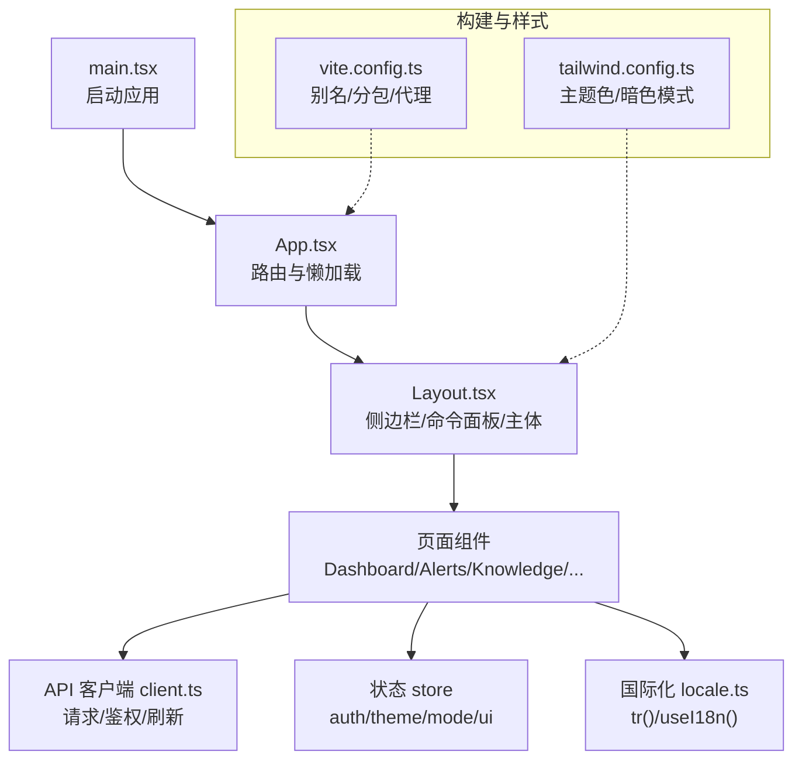
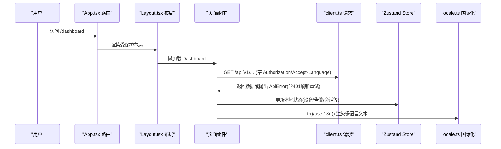
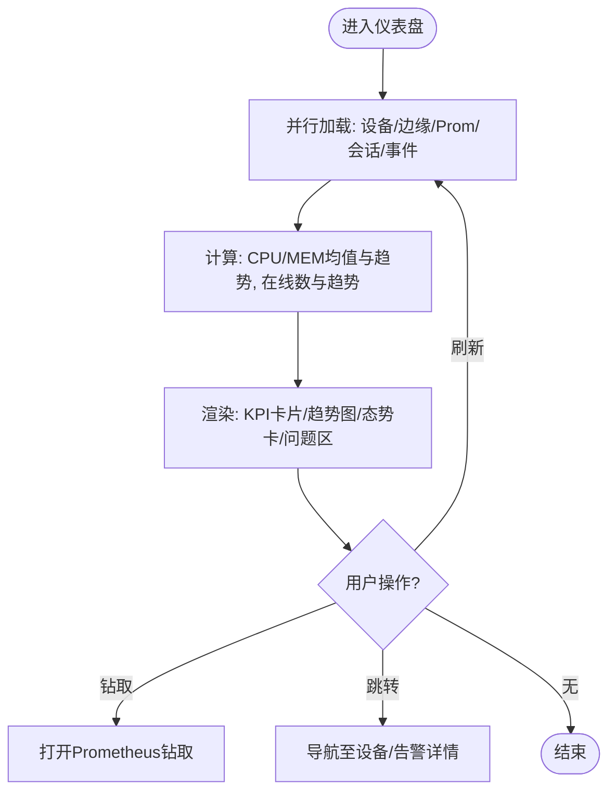
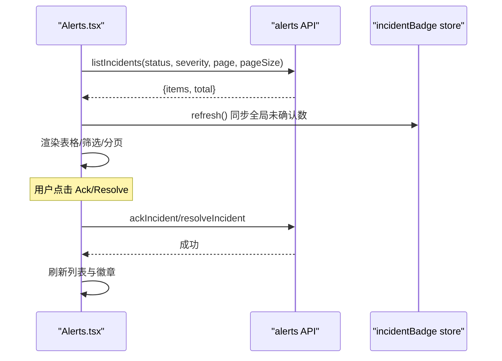
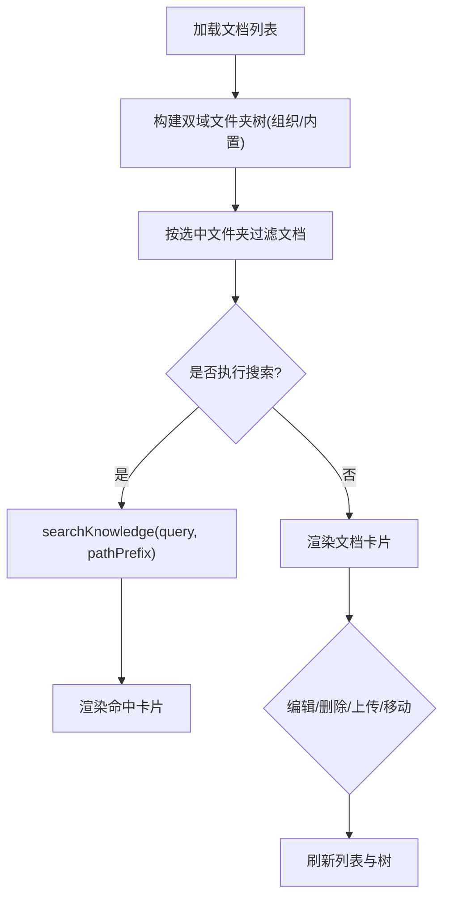
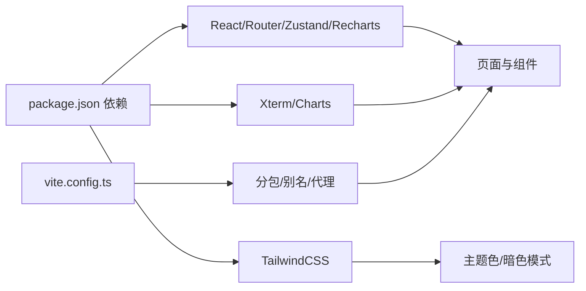

# 前端应用

<cite>
**本文引用的文件**
- [web/package.json](file://web/package.json)
- [vite.config.ts](file://web/vite.config.ts)
- [tailwind.config.ts](file://web/tailwind.config.ts)
- [main.tsx](file://web/src/main.tsx)
- [App.tsx](file://web/src/App.tsx)
- [Layout.tsx](file://web/src/components/Layout.tsx)
- [Dashboard.tsx](file://web/src/pages/Dashboard.tsx)
- [Alerts.tsx](file://web/src/pages/Alerts.tsx)
- [Knowledge.tsx](file://web/src/pages/Knowledge.tsx)
- [client.ts](file://web/src/api/client.ts)
- [locale.ts](file://web/src/i18n/locale.ts)
- [theme.ts](file://web/src/store/theme.ts)
- [mode.ts](file://web/src/store/mode.ts)
- [auth.ts](file://web/src/store/auth.ts)
- [usePoll.ts](file://web/src/lib/usePoll.ts)
</cite>

## 目录
1. [简介](#简介)
2. [项目结构](#项目结构)
3. [核心组件](#核心组件)
4. [架构总览](#架构总览)
5. [详细组件分析](#详细组件分析)
6. [依赖分析](#依赖分析)
7. [性能考虑](#性能考虑)
8. [故障排查指南](#故障排查指南)
9. [结论](#结论)
10. [附录](#附录)

## 简介
本技术文档面向使用 React + TypeScript 构建的前端工程，系统化说明整体架构、路由与布局、状态管理、UI 组件与样式体系、页面实现（仪表盘、告警中心、知识库、设置页等）、实时轮询机制、国际化与主题定制、扩展实践与性能优化。目标是帮助开发者快速理解并高效扩展功能，同时提供可操作的调试与排障指引。

## 项目结构
前端位于 web 目录，采用 Vite + React 18 + TypeScript 的工程化方案：
- 入口与路由：main.tsx 初始化根节点与全局主题/语言；App.tsx 集中声明路由与懒加载页面；components/Layout.tsx 提供侧边栏、命令面板、Agent 侧边栏与主内容区。
- 页面组织：pages 下按功能划分页面，如 Dashboard、Alerts、Knowledge 等。
- API 层：api/client.ts 统一封装请求、鉴权、刷新 token、错误处理。
- 状态管理：store 下使用 Zustand 管理认证、主题、模式、UI 状态等。
- 国际化：i18n/locale.ts 提供双语字符串与切换能力。
- 构建与样式：vite.config.ts 配置别名、分包与代理；tailwind.config.ts 定义主题色与暗色模式策略。

图表来源
- [main.tsx:1-26](file://web/src/main.tsx#L1-L26)
- [App.tsx:1-221](file://web/src/App.tsx#L1-L221)
- [Layout.tsx:1-72](file://web/src/components/Layout.tsx#L1-L72)
- [client.ts:1-163](file://web/src/api/client.ts#L1-L163)
- [vite.config.ts:1-64](file://web/vite.config.ts#L1-L64)
- [tailwind.config.ts:1-43](file://web/tailwind.config.ts#L1-L43)

章节来源
- [web/package.json:1-56](file://web/package.json#L1-L56)
- [vite.config.ts:1-64](file://web/vite.config.ts#L1-L64)
- [tailwind.config.ts:1-43](file://web/tailwind.config.ts#L1-L43)
- [main.tsx:1-26](file://web/src/main.tsx#L1-L26)
- [App.tsx:1-221](file://web/src/App.tsx#L1-L221)

## 核心组件
- 路由与权限
  - App.tsx 通过 react-router-dom 的 Routes/Routes 组合页面，使用 RequireAuth/PublicOnly 守卫控制登录态访问。
  - 大量页面通过 lazy(() => import(...)) 实现按需加载，减少首屏体积。
- 布局
  - Layout.tsx 提供侧边导航、命令面板（⌘P）和 Agent 侧边栏（⌘K），并在挂载时启动未确认告警计数轮询。
- 状态管理
  - auth.ts：Zustand 持久化存储 access_token/refresh_token/email/role，并提供 setSession/logout。
  - theme.ts：Accent 强调色选择器，写入 CSS 变量 --accent，支持预设与本地持久化。
  - mode.ts：主题模式（system/light/dark），通过 data-theme 与 class 切换，保持 Tailwind dark: 可用。
- 国际化
  - locale.ts：tr(zh, en) 与 useI18n() 钩子，基于 localStorage 与 window 事件驱动重渲染，自动检测时区/语言。
- API 客户端
  - client.ts：统一 request(method, path, body, opts)，自动附加 Authorization、Accept-Language，处理 401 刷新 token 并重试，抛出 ApiError。

章节来源
- [App.tsx:71-204](file://web/src/App.tsx#L71-L204)
- [Layout.tsx:10-58](file://web/src/components/Layout.tsx#L10-L58)
- [auth.ts:1-50](file://web/src/store/auth.ts#L1-L50)
- [theme.ts:1-98](file://web/src/store/theme.ts#L1-L98)
- [mode.ts:1-98](file://web/src/store/mode.ts#L1-L98)
- [locale.ts:1-102](file://web/src/i18n/locale.ts#L1-L102)
- [client.ts:1-163](file://web/src/api/client.ts#L1-L163)

## 架构总览
前端以“路由-布局-页面”分层组织，页面通过 API 客户端与后端交互，状态由 Zustand 管理，样式基于 Tailwind 与 CSS 变量，国际化通过内联双语字符串与事件驱动更新。

图表来源
- [App.tsx:86-204](file://web/src/App.tsx#L86-L204)
- [Layout.tsx:10-58](file://web/src/components/Layout.tsx#L10-L58)
- [client.ts:27-115](file://web/src/api/client.ts#L27-L115)
- [locale.ts:74-101](file://web/src/i18n/locale.ts#L74-L101)

## 详细组件分析

### 仪表盘（Dashboard）
- 数据聚合：并行拉取设备列表、边缘节点、Prometheus 指标范围查询、会话统计、活跃事件等，计算 CPU/MEM 均值与趋势、在线设备数与趋势。
- 可视化：自绘 SVG 折线图展示 24h 集群趋势；使用 Recharts 绘制在线数柱状图；Sparkline 展示迷你趋势。
- 交互：手动刷新、钻取到 Prometheus 图表、跳转到设备/告警详情。
- 错误处理：对每个数据源独立 try/catch，记录错误提示，保证局部失败不影响整体。

图表来源
- [Dashboard.tsx:75-236](file://web/src/pages/Dashboard.tsx#L75-L236)
- [Dashboard.tsx:293-309](file://web/src/pages/Dashboard.tsx#L293-L309)

章节来源
- [Dashboard.tsx:48-461](file://web/src/pages/Dashboard.tsx#L48-L461)

### 告警中心（Alerts）
- 列表与筛选：支持按状态（open/acknowledged/silenced/resolved）与级别（critical/warning/info）筛选，分页展示。
- 实时性：usePoll 定时静默刷新，同步全局未确认告警徽章。
- 操作：确认（Ack）与解决（Resolve）弹窗，提交后刷新列表与徽章。
- 目标解析：预取设备清单映射 device_id → name，避免名称错乱。

图表来源
- [Alerts.tsx:75-131](file://web/src/pages/Alerts.tsx#L75-L131)
- [Alerts.tsx:242-284](file://web/src/pages/Alerts.tsx#L242-L284)

章节来源
- [Alerts.tsx:42-287](file://web/src/pages/Alerts.tsx#L42-L287)

### 知识库（Knowledge）
- 双域视图：组织知识库（上传/手动编辑，可拖拽移动）与内置知识库（只读，支持从云端/离线基线同步）。
- 文件夹树：根据路径拆分构建嵌套树，支持展开/折叠与高亮当前路径。
- 搜索：调用 searchKnowledge 获取命中结果，支持按路径前缀限定。
- 文档 CRUD：新建/编辑/删除/上传，成功后刷新列表与树。

图表来源
- [Knowledge.tsx:66-94](file://web/src/pages/Knowledge.tsx#L66-L94)
- [Knowledge.tsx:130-168](file://web/src/pages/Knowledge.tsx#L130-L168)
- [Knowledge.tsx:248-265](file://web/src/pages/Knowledge.tsx#L248-L265)

章节来源
- [Knowledge.tsx:96-525](file://web/src/pages/Knowledge.tsx#L96-L525)

### 设置页（Settings）
- 路由组织：/settings/* 下包含健康检查、升级、LLM、通知渠道、IM 通道、集成、通用、偏好、代理、关于、密钥等子页面。
- 命名规范：通知为单向推送（Slack/Telegram/Lark/钉钉/企微/Webhook），通道为双向 IM Bot；旧 URL 统一重定向到新路径，确保书签兼容。
- 管理区：/admin/* 用于平台治理（用户、组织、审计日志），与设置分离，便于权限与导航组织。

章节来源
- [App.tsx:163-198](file://web/src/App.tsx#L163-L198)

## 依赖分析
- 运行时依赖
  - React 18、react-router-dom 6、recharts、zustand、lucide-react、react-markdown、xterm 系列等。
- 开发依赖
  - Vite 5、TypeScript 5、TailwindCSS 3、Vitest、Playwright、ESLint、PostCSS、MSW 等。
- 关键构建配置
  - vite.config.ts：别名 @→src，分包 vendor-charts/vendor-xterm 以延迟加载大依赖，关闭 modulePreload 中的重型依赖以减少登录页体积，开发服务器代理 /api 到后端。
  - tailwind.config.ts：darkMode: class，自定义字体与颜色变量，动画 keyframes。

图表来源
- [web/package.json:17-53](file://web/package.json#L17-L53)
- [vite.config.ts:8-52](file://web/vite.config.ts#L8-L52)
- [tailwind.config.ts:3-40](file://web/tailwind.config.ts#L3-L40)

章节来源
- [web/package.json:1-56](file://web/package.json#L1-L56)
- [vite.config.ts:1-64](file://web/vite.config.ts#L1-L64)
- [tailwind.config.ts:1-43](file://web/tailwind.config.ts#L1-L43)

## 性能考虑
- 首屏优化
  - 路由级懒加载：所有页面组件均通过 lazy 动态导入，减少初始包体。
  - 分包策略：将 recharts/d3/victory 归入 vendor-charts，xterm 归入 vendor-xterm，避免登录页携带重型库。
  - 禁用 modulePreload 对重型依赖的预加载，仅在真正使用时再下载。
- 运行时优化
  - 可见性感知轮询：usePoll 在标签页隐藏时暂停轮询，恢复时立即补一次，降低后台开销。
  - 批量数据请求：仪表盘使用 Promise.all 并发拉取多源数据，减少 RTT。
  - 计算缓存：大量使用 useMemo 计算聚合指标与趋势，避免重复计算。
- 网络与错误
  - 统一请求封装：自动附加语言头、鉴权头，401 自动刷新 token 并重试一次，失败抛出自定义 ApiError 供上层处理。
  - 错误降级：各数据源独立 try/catch，局部失败不影响整体渲染。

章节来源
- [vite.config.ts:13-52](file://web/vite.config.ts#L13-L52)
- [usePoll.ts:1-46](file://web/src/lib/usePoll.ts#L1-L46)
- [Dashboard.tsx:75-141](file://web/src/pages/Dashboard.tsx#L75-L141)
- [client.ts:82-115](file://web/src/api/client.ts#L82-L115)

## 故障排查指南
- 认证与令牌
  - 现象：接口返回 401。
  - 机制：client.ts 检测到 401 会尝试刷新 token，若刷新失败则登出并跳转登录。
  - 排查：检查 refreshToken 是否存在、后端刷新接口是否正常、网络代理是否正确。
- 轮询不触发
  - 现象：页面数据不更新。
  - 机制：usePoll 在不可见时跳过执行，回到可见时立即执行一次。
  - 排查：确认 enabled 与 intervalMs 参数、浏览器标签页状态、fn 引用稳定性（useCallback）。
- 主题/语言闪烁
  - 现象：首次加载出现主题/语言闪变。
  - 机制：main.tsx 在渲染前应用主题与语言，避免闪烁。
  - 排查：确认 applyThemeOnBoot/applyAccentOnBoot/getLocale 正常执行，localStorage 数据完整。
- 大依赖加载慢
  - 现象：进入监控/终端相关页面卡顿。
  - 机制：vendor-charts/vendor-xterm 被拆分为独立 chunk，按需加载。
  - 排查：检查分包是否生效、懒加载是否触发、代理与 CDN 配置。

章节来源
- [client.ts:97-115](file://web/src/api/client.ts#L97-L115)
- [usePoll.ts:20-45](file://web/src/lib/usePoll.ts#L20-L45)
- [main.tsx:10-14](file://web/src/main.tsx#L10-L14)
- [vite.config.ts:17-50](file://web/vite.config.ts#L17-L50)

## 结论
该前端工程采用清晰的模块化与分层设计：路由与布局解耦、页面按需加载、状态集中管理、样式与主题可配置、国际化开箱即用。通过统一的 API 客户端与健壮的错误处理，提升了可维护性与用户体验。结合分包与可见性感知轮询等优化手段，在保证功能完备的同时兼顾了性能。建议后续在扩展新功能时遵循现有模式：懒加载页面、usePoll 轮询、Zustand 管理状态、tr/useI18n 国际化、Tailwind 主题变量与暗色模式。

## 附录
- 开发示例
  - 新增页面：在 App.tsx 添加路由与懒加载，创建 pages 下的组件，使用 useI18n 与 usePoll 完成数据与交互。
  - 新增 API：在 api/client.ts 基础上封装方法，统一错误与鉴权。
  - 新增状态：在 store 中用 Zustand 定义状态与持久化，组件通过 hook 订阅。
  - 新增主题：在 tailwind.config.ts 扩展颜色变量或使用 theme.ts 的 accent 预设。
- 最佳实践
  - 使用 useCallback/useMemo 稳定函数与计算结果。
  - 使用 usePoll 替代 setInterval，避免后台持续请求。
  - 使用 tr('中文', 'English') 进行内联双语，便于维护与扫描。
  - 使用 Tailwind 的 dark: 与 CSS 变量实现主题切换，避免硬编码颜色。
- 调试技巧
  - 使用浏览器 Network 面板查看请求头 Accept-Language 与 Authorization。
  - 使用 Application 面板检查 localStorage 中的 ongrid.auth、ongrid.theme、ongrid-theme-preference、ongrid-locale。
  - 使用 Vite 开发服务器代理 /api 到后端，便于联调。