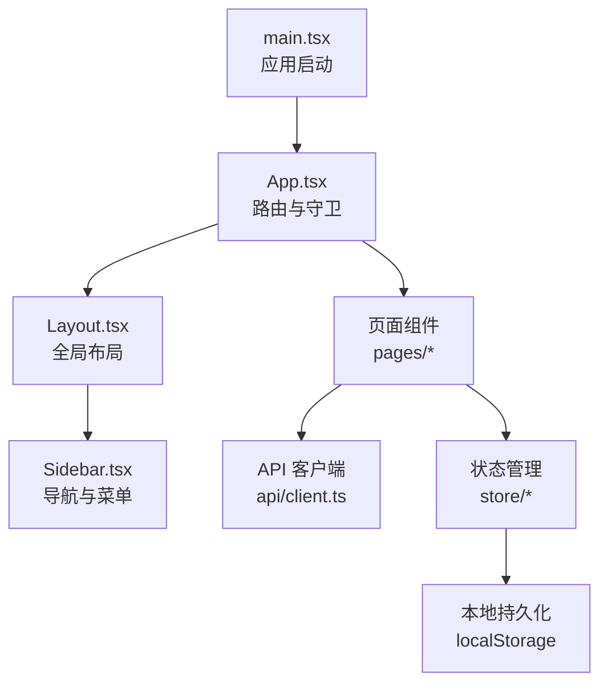
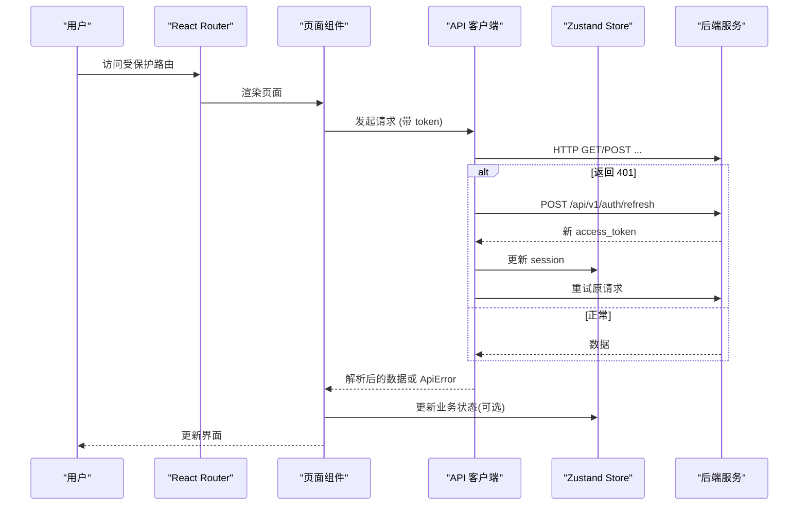
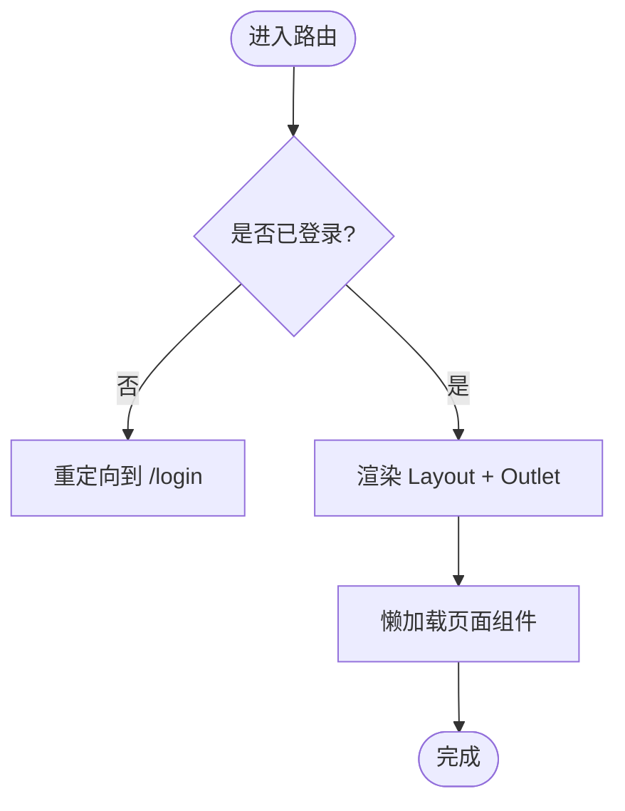
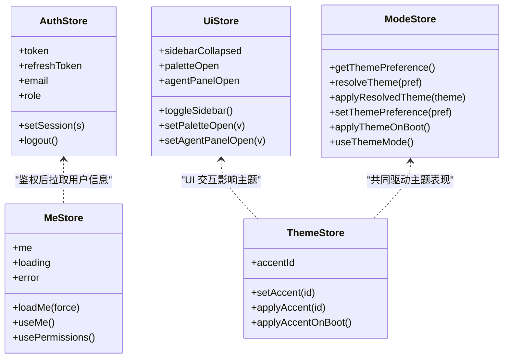
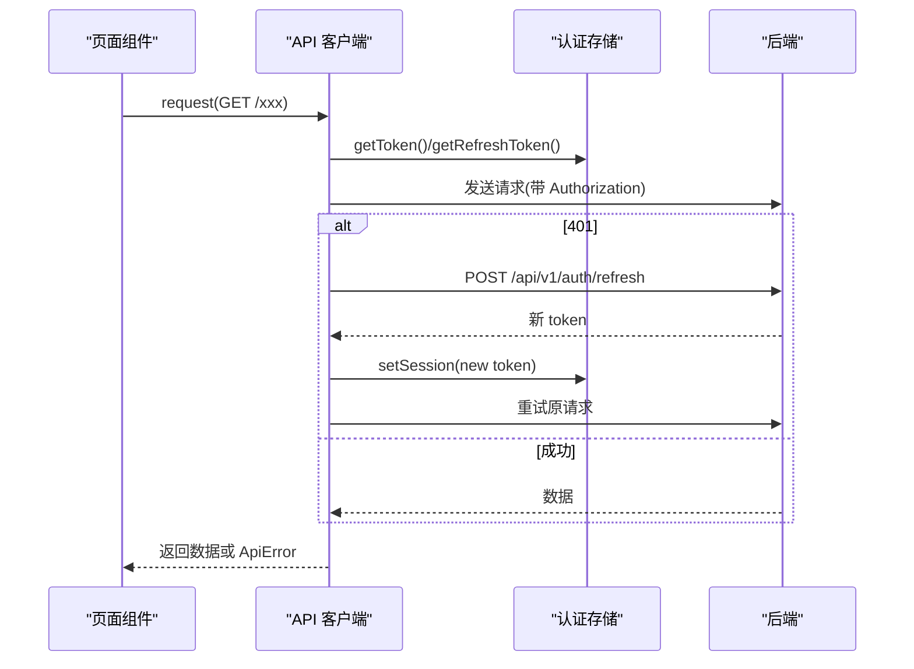
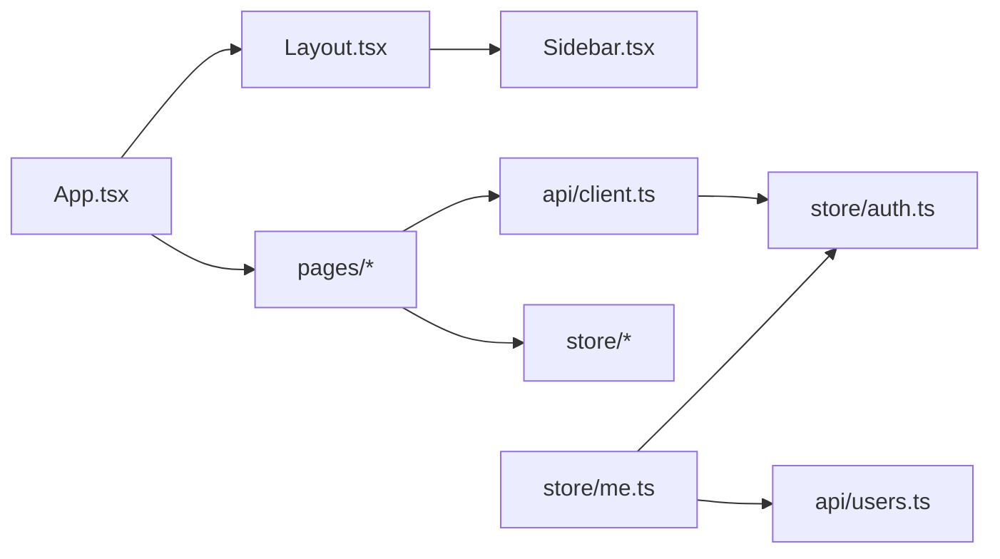

# 前端架构设计

<cite>
**本文引用的文件**
- [web/src/main.tsx](file://web/src/main.tsx)
- [web/src/App.tsx](file://web/src/App.tsx)
- [web/src/components/Layout.tsx](file://web/src/components/Layout.tsx)
- [web/src/components/Sidebar.tsx](file://web/src/components/Sidebar.tsx)
- [web/src/lib/routes.ts](file://web/src/lib/routes.ts)
- [web/src/api/client.ts](file://web/src/api/client.ts)
- [web/src/store/auth.ts](file://web/src/store/auth.ts)
- [web/src/store/me.ts](file://web/src/store/me.ts)
- [web/src/store/ui.ts](file://web/src/store/ui.ts)
- [web/src/store/theme.ts](file://web/src/store/theme.ts)
- [web/src/store/mode.ts](file://web/src/store/mode.ts)
- [web/package.json](file://web/package.json)
- [web/vite.config.ts](file://web/vite.config.ts)
</cite>

## 目录
1. [简介](#简介)
2. [项目结构](#项目结构)
3. [核心组件](#核心组件)
4. [架构总览](#架构总览)
5. [详细组件分析](#详细组件分析)
6. [依赖关系分析](#依赖关系分析)
7. [性能考量](#性能考量)
8. [故障排查指南](#故障排查指南)
9. [结论](#结论)
10. [附录](#附录)

## 简介
本技术文档面向 React + TypeScript 前端工程，系统性阐述整体架构与关键实现：组件层次、状态管理（Zustand）、路由与权限、前后端通信（请求封装、错误处理、刷新令牌）、以及构建与开发配置。文档同时提供扩展新模块与优化性能的实践建议，帮助开发者快速理解并高效迭代。

## 项目结构
前端位于 web 目录，采用 Vite 构建、React Router 路由、Zustand 状态管理、Tailwind CSS 样式体系。入口 main.tsx 初始化主题/语言并挂载应用；App.tsx 集中声明路由与鉴权守卫；Layout.tsx 提供全局布局、快捷键与侧边栏容器；Sidebar.tsx 承载导航与用户菜单；lib/routes.ts 维护命令面板的静态路由目录；api/client.ts 统一 HTTP 客户端与错误处理；store 下按领域拆分 Zustand store（auth、me、ui、theme、mode 等）。

图表来源
- [web/src/main.tsx:1-26](file://web/src/main.tsx#L1-L26)
- [web/src/App.tsx:1-221](file://web/src/App.tsx#L1-L221)
- [web/src/components/Layout.tsx:1-72](file://web/src/components/Layout.tsx#L1-L72)
- [web/src/components/Sidebar.tsx:1-800](file://web/src/components/Sidebar.tsx#L1-L800)
- [web/src/api/client.ts:1-163](file://web/src/api/client.ts#L1-L163)
- [web/src/store/auth.ts:1-50](file://web/src/store/auth.ts#L1-L50)

章节来源
- [web/src/main.tsx:1-26](file://web/src/main.tsx#L1-L26)
- [web/src/App.tsx:1-221](file://web/src/App.tsx#L1-L221)
- [web/src/components/Layout.tsx:1-72](file://web/src/components/Layout.tsx#L1-L72)
- [web/src/components/Sidebar.tsx:1-800](file://web/src/components/Sidebar.tsx#L1-L800)
- [web/src/lib/routes.ts:1-112](file://web/src/lib/routes.ts#L1-L112)
- [web/src/api/client.ts:1-163](file://web/src/api/client.ts#L1-L163)
- [web/src/store/auth.ts:1-50](file://web/src/store/auth.ts#L1-L50)
- [web/src/store/me.ts:1-114](file://web/src/store/me.ts#L1-L114)
- [web/src/store/ui.ts:1-39](file://web/src/store/ui.ts#L1-L39)
- [web/src/store/theme.ts:1-98](file://web/src/store/theme.ts#L1-L98)
- [web/src/store/mode.ts:1-98](file://web/src/store/mode.ts#L1-L98)
- [web/package.json:1-56](file://web/package.json#L1-L56)
- [web/vite.config.ts:1-64](file://web/vite.config.ts#L1-L64)

## 核心组件
- 应用入口与路由
  - main.tsx：在首次渲染前应用主题、强调色与语言，随后以 BrowserRouter 包裹 App。
  - App.tsx：集中定义所有路由，使用 RequireAuth/PublicOnly 守卫控制访问；大量页面通过 lazy() 实现按需加载；包含旧路径重定向以保持书签兼容。
  - Layout.tsx：提供侧边栏、内容区、命令面板与 Agent 侧边栏；注册全局快捷键（⌘K/⌘P）；在挂载时启动未确认告警计数轮询。
  - Sidebar.tsx：导航分组、会话列表、用户菜单（语言/主题切换、退出登录）；根据权限隐藏管理入口；支持折叠/展开与搜索跳转。

- 状态管理（Zustand）
  - auth.ts：认证态（token/refresh_token/email/role），使用 persist 中间件持久化到 localStorage；提供 setSession/logout 与便捷 getter。
  - me.ts：当前用户信息缓存与单飞请求；useMe/usePermissions 暴露角色派生权限标志。
  - ui.ts：UI 状态（侧边栏折叠、命令面板、Agent 面板），仅持久化结构性状态。
  - theme.ts / mode.ts：强调色与明暗主题，分别通过 CSS 变量与 data 属性/类名驱动 Tailwind dark 模式，并在启动时同步应用以避免闪烁。

- API 客户端
  - client.ts：统一 request 方法，自动附加 Authorization、Accept-Language；处理 JSON/FormData；对 401 触发 refreshAccessToken 并重试；失败抛出 ApiError（含 status/code/payload）。

章节来源
- [web/src/main.tsx:1-26](file://web/src/main.tsx#L1-L26)
- [web/src/App.tsx:1-221](file://web/src/App.tsx#L1-L221)
- [web/src/components/Layout.tsx:1-72](file://web/src/components/Layout.tsx#L1-L72)
- [web/src/components/Sidebar.tsx:1-800](file://web/src/components/Sidebar.tsx#L1-L800)
- [web/src/store/auth.ts:1-50](file://web/src/store/auth.ts#L1-L50)
- [web/src/store/me.ts:1-114](file://web/src/store/me.ts#L1-L114)
- [web/src/store/ui.ts:1-39](file://web/src/store/ui.ts#L1-L39)
- [web/src/store/theme.ts:1-98](file://web/src/store/theme.ts#L1-L98)
- [web/src/store/mode.ts:1-98](file://web/src/store/mode.ts#L1-L98)
- [web/src/api/client.ts:1-163](file://web/src/api/client.ts#L1-L163)

## 架构总览
下图展示从浏览器发起请求到后端响应、再到 UI 更新的完整链路，包括鉴权、刷新令牌、错误处理与状态更新。

图表来源
- [web/src/App.tsx:71-84](file://web/src/App.tsx#L71-L84)
- [web/src/api/client.ts:27-163](file://web/src/api/client.ts#L27-L163)
- [web/src/store/auth.ts:20-41](file://web/src/store/auth.ts#L20-L41)

## 详细组件分析

### 路由与权限控制
- 路由组织
  - 集中式路由表：App.tsx 内通过 Routes/Routes 嵌套，将公共路由（/login）与需要鉴权的 Layout 路由分离。
  - 动态路由：如 /chat/:sessionId、/devices/:edgeId、/kubernetes/:clusterId 等，用于详情页与上下文传递。
  - 懒加载：所有页面通过 lazy() 导入，减少首屏体积；部分复杂页面进一步子模块懒加载。
  - 兼容重定向：多处旧路径重定向到新路径，保证历史书签可用。
- 权限控制
  - 路由级守卫：RequireAuth 检查 token，无则跳转到 /login 并记录来源；PublicOnly 阻止已登录用户进入登录页。
  - 功能级权限：Sidebar 中“用户管理/设置”等入口仅在 isAdmin 为真时显示；usePermissions 基于 me.role 派生 canMutate 等标志。
  - 服务端兜底：UI 层隐藏入口仅为体验优化，实际权限校验由后端完成。

图表来源
- [web/src/App.tsx:71-84](file://web/src/App.tsx#L71-L84)
- [web/src/App.tsx:86-218](file://web/src/App.tsx#L86-L218)
- [web/src/components/Sidebar.tsx:516-520](file://web/src/components/Sidebar.tsx#L516-L520)
- [web/src/store/me.ts:94-114](file://web/src/store/me.ts#L94-L114)

章节来源
- [web/src/App.tsx:1-221](file://web/src/App.tsx#L1-L221)
- [web/src/components/Sidebar.tsx:1-800](file://web/src/components/Sidebar.tsx#L1-L800)
- [web/src/store/me.ts:1-114](file://web/src/store/me.ts#L1-L114)

### Zustand 状态管理
- 全局状态定义
  - 认证态：auth.ts 定义 Session/ AuthState，提供 setSession/logout，并通过 persist 持久化到 localStorage。
  - 用户信息：me.ts 提供 loadMe 单飞请求与 useMe/usePermissions hook，避免重复请求与闪烁。
  - UI 态：ui.ts 管理侧边栏折叠、命令面板与 Agent 面板开关，仅持久化必要字段。
  - 主题与强调色：mode.ts 与 theme.ts 分别处理明暗主题与强调色，启动时立即写入 DOM 避免闪烁。
- 状态更新机制
  - 通过 create 创建 store，使用 set/get 进行原子更新；结合 partialize 精确控制持久化范围。
  - 跨组件订阅：各组件通过 selector 订阅最小状态切片，降低重渲染成本。
- 状态持久化
  - 使用 zustand/middleware 的 persist 与 createJSONStorage，将 key 命名规范（如 ongrid.auth、ongrid.theme、ongrid.ui）。
  - 启动阶段直接读取 localStorage 并应用主题/强调色，确保首屏一致性。

图表来源
- [web/src/store/auth.ts:1-50](file://web/src/store/auth.ts#L1-L50)
- [web/src/store/me.ts:1-114](file://web/src/store/me.ts#L1-L114)
- [web/src/store/ui.ts:1-39](file://web/src/store/ui.ts#L1-L39)
- [web/src/store/theme.ts:1-98](file://web/src/store/theme.ts#L1-L98)
- [web/src/store/mode.ts:1-98](file://web/src/store/mode.ts#L1-L98)

章节来源
- [web/src/store/auth.ts:1-50](file://web/src/store/auth.ts#L1-L50)
- [web/src/store/me.ts:1-114](file://web/src/store/me.ts#L1-L114)
- [web/src/store/ui.ts:1-39](file://web/src/store/ui.ts#L1-L39)
- [web/src/store/theme.ts:1-98](file://web/src/store/theme.ts#L1-L98)
- [web/src/store/mode.ts:1-98](file://web/src/store/mode.ts#L1-L98)

### 前后端通信机制
- API 客户端封装
  - 统一 request(method, path, body, opts)：自动设置 Accept/Accept-Language/Content-Type；支持 FormData；拼接 BASE 路径。
  - 鉴权头：非 noAuth 请求自动附加 Authorization: Bearer <token>。
  - 错误处理：非 2xx 抛 ApiError，携带 status/code/payload；文本体也会截断展示以便定位问题。
  - 刷新令牌：遇到 401 且存在 refresh_token 时调用 /api/v1/auth/refresh，成功后更新 session 并重试一次；若仍失败则登出。
- 请求拦截与重试
  - 并发安全：refreshInFlight 保证同一时间仅一个刷新请求。
  - 幂等性：_retryingAfterRefresh 标记防止无限重试循环。
- 国际化与语言头
  - 每次请求附带 Accept-Language，使后端 AI/LLM 输出与 UI 语言一致。

图表来源
- [web/src/api/client.ts:27-163](file://web/src/api/client.ts#L27-L163)
- [web/src/store/auth.ts:20-41](file://web/src/store/auth.ts#L20-L41)

章节来源
- [web/src/api/client.ts:1-163](file://web/src/api/client.ts#L1-L163)
- [web/src/store/auth.ts:1-50](file://web/src/store/auth.ts#L1-L50)

### 构建与开发环境
- 开发与预览
  - npm scripts：dev/build/preview/test/e2e/typecheck 等脚本齐全。
  - Vite 开发服务器：端口 5173，代理 /api 到 http://localhost:8090。
- 构建优化
  - 目标 es2020，输出 dist。
  - modulePreload 排除大型库（charts/xterm）避免登录页预加载。
  - manualChunks 将 recharts/d3/victory 与 xterm 拆分为独立 chunk，减小主包体积。
- 别名与插件
  - @ 指向 src；启用 @vitejs/plugin-react。
- 依赖说明
  - 运行时：react、react-router-dom、zustand、recharts、xterm、lucide-react 等。
  - 开发：typescript、vitest、msw、tailwindcss、postcss、eslint 等。

章节来源
- [web/package.json:1-56](file://web/package.json#L1-L56)
- [web/vite.config.ts:1-64](file://web/vite.config.ts#L1-L64)

## 依赖关系分析
- 组件耦合
  - App.tsx 依赖 react-router-dom 与多个 pages 懒加载模块；Layout.tsx 组合 Sidebar、CommandPalette、AgentSidePanel。
  - Sidebar.tsx 依赖 store（auth、me、ui、incidentBadge）、i18n 与 API（聊天会话操作）。
- 状态依赖
  - api/client.ts 依赖 store/auth 获取 token/refresh_token；store/me.ts 依赖 api/users 与 store/auth。
- 外部依赖
  - 构建期：Vite、TypeScript、Tailwind、PostCSS。
  - 运行期：React、React Router、Zustand、图表与终端库。

图表来源
- [web/src/App.tsx:1-221](file://web/src/App.tsx#L1-L221)
- [web/src/components/Layout.tsx:1-72](file://web/src/components/Layout.tsx#L1-L72)
- [web/src/components/Sidebar.tsx:1-800](file://web/src/components/Sidebar.tsx#L1-L800)
- [web/src/api/client.ts:1-163](file://web/src/api/client.ts#L1-L163)
- [web/src/store/me.ts:1-114](file://web/src/store/me.ts#L1-L114)
- [web/src/store/auth.ts:1-50](file://web/src/store/auth.ts#L1-L50)

章节来源
- [web/src/App.tsx:1-221](file://web/src/App.tsx#L1-L221)
- [web/src/components/Layout.tsx:1-72](file://web/src/components/Layout.tsx#L1-L72)
- [web/src/components/Sidebar.tsx:1-800](file://web/src/components/Sidebar.tsx#L1-L800)
- [web/src/api/client.ts:1-163](file://web/src/api/client.ts#L1-L163)
- [web/src/store/me.ts:1-114](file://web/src/store/me.ts#L1-L114)
- [web/src/store/auth.ts:1-50](file://web/src/store/auth.ts#L1-L50)

## 性能考量
- 首屏优化
  - 路由级懒加载：所有页面通过 lazy() 延迟加载，显著降低初始包体。
  - 大型依赖分包：recharts/d3/victory 与 xterm 被拆分至 vendor-charts/vendor-xterm，避免登录页预加载。
  - 主题/语言预应用：main.tsx 在 React 渲染前写入 CSS 变量与 data 属性，避免闪烁。
- 运行时优化
  - 状态选择器：Zustand 组件仅订阅所需切片，减少不必要重渲染。
  - 单飞请求：me.ts 的 loadMe 避免并发重复请求。
  - 命令面板模糊匹配：轻量算法实现快速检索，无需引入重型库。
- 可观测性与调试
  - 构建关闭 sourcemap（生产），便于缩小产物；开发环境可通过浏览器调试。
  - 错误对象 ApiError 携带 status/code/payload，便于上层统一处理与上报。

[本节为通用性能指导，不直接分析具体代码文件]

## 故障排查指南
- 401 未授权
  - 现象：请求返回 401，客户端尝试刷新 token；若刷新失败则登出。
  - 排查：检查 localStorage 中的 ongrid.auth 是否有效；确认后端 /api/v1/auth/refresh 可达；查看网络面板刷新流程。
  - 参考实现：client.ts 的 401 分支与 refreshAccessToken。
- 主题/语言闪烁
  - 现象：首帧出现默认主题或语言。
  - 排查：确认 main.tsx 是否在 React 渲染前执行 applyThemeOnBoot/applyAccentOnBoot；检查 localStorage 键值格式。
  - 参考实现：main.tsx、theme.ts、mode.ts。
- 路由守卫异常
  - 现象：登录后仍跳转到登录页或无法进入受保护页面。
  - 排查：检查 useAuth().token 是否正确持久化；确认 RequireAuth 逻辑；查看路由嵌套与重定向链。
  - 参考实现：App.tsx 的 RequireAuth/PublicOnly 与路由定义。
- 命令面板无法打开
  - 现象：⌘P 无效。
  - 排查：检查 Layout 全局键盘事件绑定；确认 ui.store.paletteOpen 未被其他逻辑覆盖；验证 routes.ts 中的 APP_ROUTES 是否包含目标项。
  - 参考实现：Layout.tsx 键盘事件、ui.ts、routes.ts。

章节来源
- [web/src/api/client.ts:82-115](file://web/src/api/client.ts#L82-L115)
- [web/src/api/client.ts:117-163](file://web/src/api/client.ts#L117-L163)
- [web/src/main.tsx:10-14](file://web/src/main.tsx#L10-L14)
- [web/src/store/theme.ts:77-98](file://web/src/store/theme.ts#L77-L98)
- [web/src/store/mode.ts:54-69](file://web/src/store/mode.ts#L54-L69)
- [web/src/App.tsx:71-84](file://web/src/App.tsx#L71-L84)
- [web/src/components/Layout.tsx:26-44](file://web/src/components/Layout.tsx#L26-L44)
- [web/src/lib/routes.ts:1-112](file://web/src/lib/routes.ts#L1-L112)

## 结论
该前端工程以 React + TypeScript 为基础，采用集中式路由与懒加载提升可维护性与性能；通过 Zustand 实现清晰的状态分层与持久化；API 客户端统一封装了鉴权、错误处理与令牌刷新；构建配置针对大依赖进行了精细化分包。整体架构兼顾可扩展性与用户体验，适合持续演进与团队协作。

[本节为总结性内容，不直接分析具体代码文件]

## 附录
- 如何扩展新功能模块
  - 新增页面：在 pages 下创建组件，并在 App.tsx 中以 lazy() 方式注册路由；如需参数，使用动态路由段。
  - 新增状态：在 store 下新建模块，定义类型与 actions，使用 persist 持久化必要字段；组件通过 selector 订阅。
  - 新增 API：在 api 目录下新增模块，复用 client.request；如需特殊处理（如上传），传入 FormData。
  - 新增导航项：在 Sidebar.tsx 对应分组中添加条目；如需命令面板支持，在 lib/routes.ts 的 ROUTE_DEFS 中补充。
- 性能优化清单
  - 保持页面懒加载；避免在首屏 import 大依赖。
  - 使用 Zustand selector 精确订阅；合并频繁更新的小状态。
  - 合理拆分 chunk，避免破坏有副作用的库初始化顺序。
  - 利用 Vite 的 modulePreload 控制预加载策略。

[本节为通用指导，不直接分析具体代码文件]