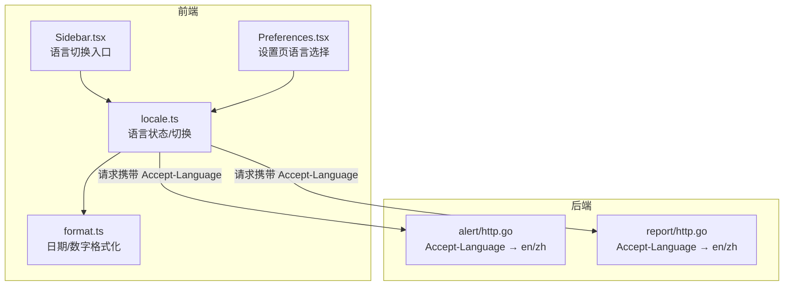
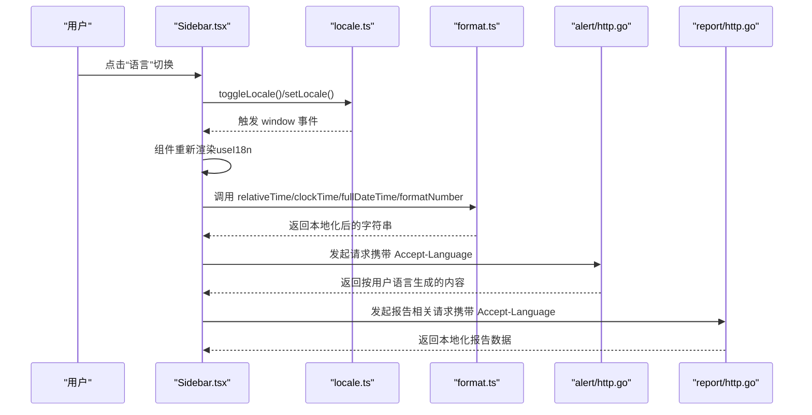
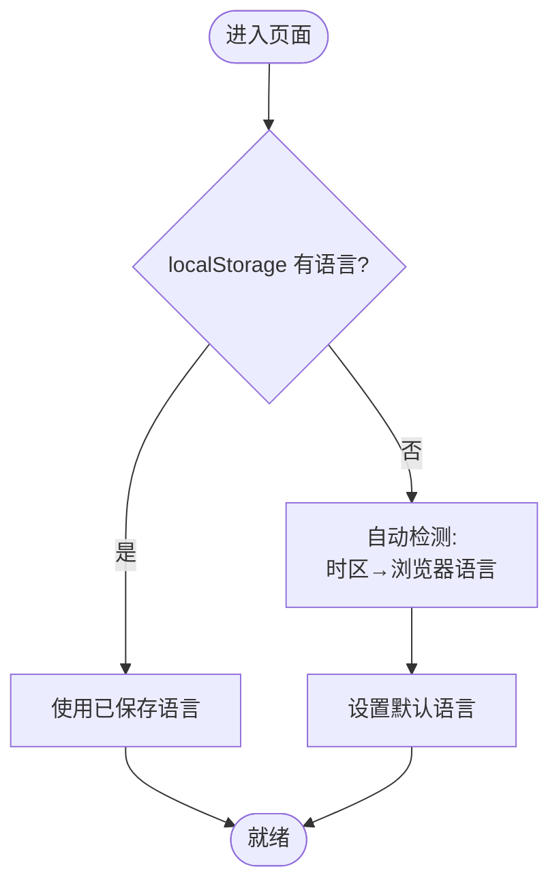
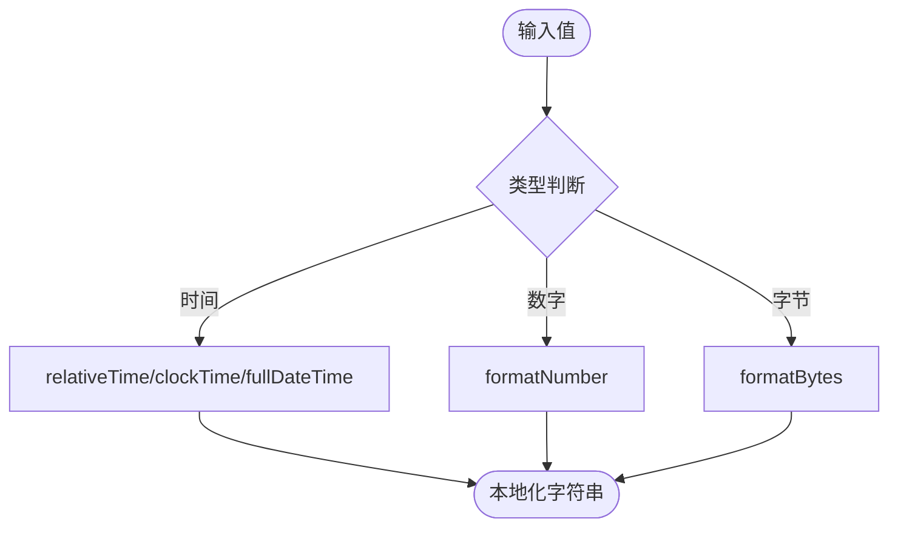
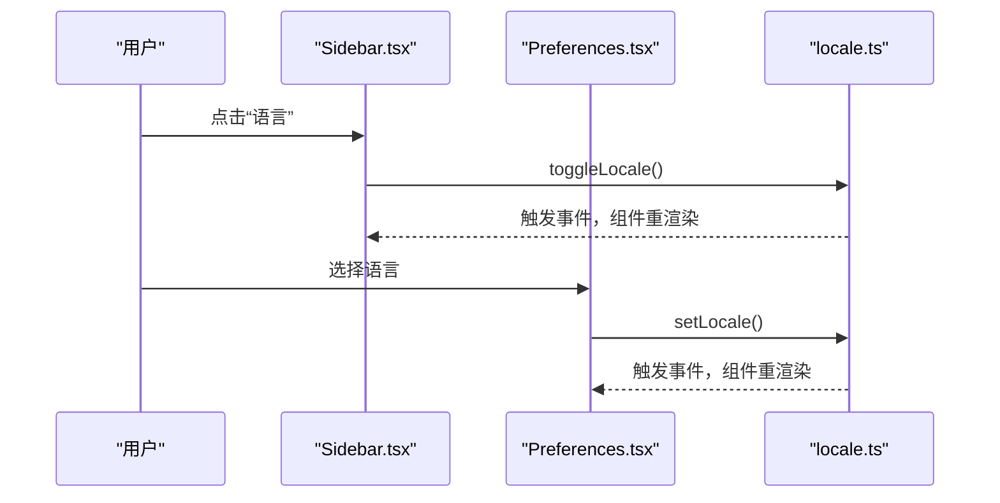
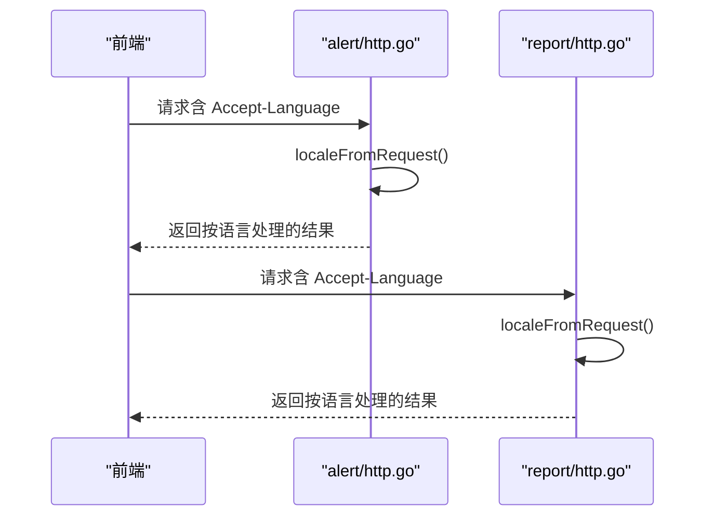
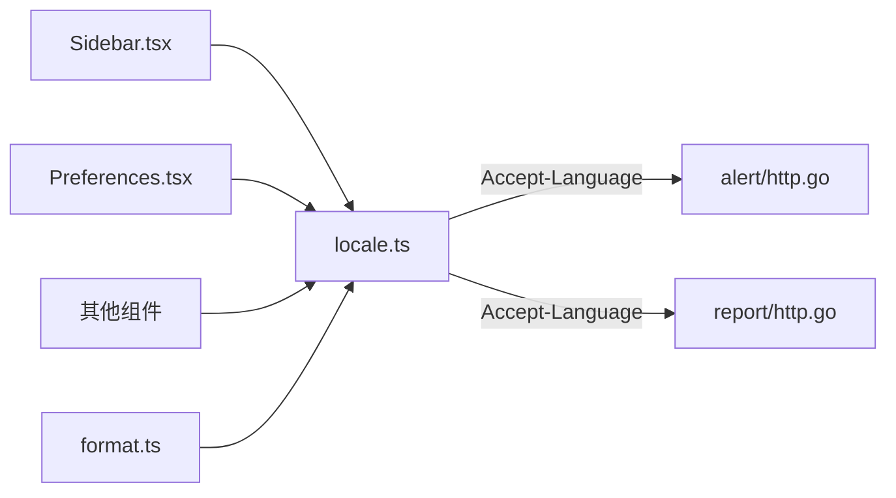

# 国际化支持

<cite>
**本文引用的文件**
- [web/src/i18n/locale.ts](file://web/src/i18n/locale.ts)
- [web/src/lib/format.ts](file://web/src/lib/format.ts)
- [web/src/components/Sidebar.tsx](file://web/src/components/Sidebar.tsx)
- [web/src/pages/settings/Preferences.tsx](file://web/src/pages/settings/Preferences.tsx)
- [internal/manager/server/alert/http.go](file://internal/manager/server/alert/http.go)
- [internal/manager/server/report/http.go](file://internal/manager/server/report/http.go)
</cite>

## 目录
1. [简介](#简介)
2. [项目结构](#项目结构)
3. [核心组件](#核心组件)
4. [架构总览](#架构总览)
5. [详细组件分析](#详细组件分析)
6. [依赖关系分析](#依赖关系分析)
7. [性能考虑](#性能考虑)
8. [故障排查指南](#故障排查指南)
9. [结论](#结论)
10. [附录：使用示例与最佳实践](#附录使用示例与最佳实践)

## 简介
本技术文档聚焦于 Ongrid 的国际化（i18n）实现，覆盖前端语言包管理、文本替换与格式化、日期时间与数字本地化、后端语言偏好透传、动态语言切换与用户偏好保存、翻译文件组织与管理策略，以及扩展新语言与性能优化建议。整体方案采用“内联双语字符串 + 运行时选择”的模式，结合浏览器 Intl API 完成日期/数字本地化，并通过 HTTP Accept-Language 将前端语言偏好传递到后端服务，保证端到端的一致体验。

## 项目结构
国际化相关代码主要分布在以下位置：
- 前端 i18n 核心：web/src/i18n/locale.ts
- 前端格式化：web/src/lib/format.ts
- 前端 UI 集成与切换入口：web/src/components/Sidebar.tsx、web/src/pages/settings/Preferences.tsx
- 后端语言偏好解析：internal/manager/server/alert/http.go、internal/manager/server/report/http.go

**图表来源**
- [web/src/i18n/locale.ts:1-101](file://web/src/i18n/locale.ts#L1-L101)
- [web/src/lib/format.ts:1-64](file://web/src/lib/format.ts#L1-L64)
- [web/src/components/Sidebar.tsx:65-200](file://web/src/components/Sidebar.tsx#L65-L200)
- [web/src/pages/settings/Preferences.tsx:35-52](file://web/src/pages/settings/Preferences.tsx#L35-L52)
- [internal/manager/server/alert/http.go:964-988](file://internal/manager/server/alert/http.go#L964-L988)
- [internal/manager/server/report/http.go:385-396](file://internal/manager/server/report/http.go#L385-L396)

**章节来源**
- [web/src/i18n/locale.ts:1-101](file://web/src/i18n/locale.ts#L1-L101)
- [web/src/lib/format.ts:1-64](file://web/src/lib/format.ts#L1-L64)
- [web/src/components/Sidebar.tsx:65-200](file://web/src/components/Sidebar.tsx#L65-L200)
- [web/src/pages/settings/Preferences.tsx:35-52](file://web/src/pages/settings/Preferences.tsx#L35-L52)
- [internal/manager/server/alert/http.go:964-988](file://internal/manager/server/alert/http.go#L964-L988)
- [internal/manager/server/report/http.go:385-396](file://internal/manager/server/report/http.go#L385-L396)

## 核心组件
- 语言状态与切换（locale.ts）
  - 提供 getLocale/setLocale/useI18n/tr/toggleLocale 等能力
  - 通过 localStorage 持久化用户语言偏好
  - 首次访问基于时区与浏览器语言自动检测默认语言
  - 通过自定义事件通知所有订阅者刷新界面
- 格式化（format.ts）
  - 统一映射应用语言到 Intl BCP-47 区域标签
  - 相对时间、时钟时间、完整日期时间、数字格式化
  - 字节单位换算（非货币）
- 前端集成（Sidebar.tsx、Preferences.tsx）
  - 侧边栏菜单提供语言切换按钮
  - 设置页提供显式语言选择
- 后端语言透传（alert/http.go、report/http.go）
  - 从请求头 Accept-Language 提取首选语言主标签（en/zh）
  - 用于 AI 生成内容、报告等需要本地化的后端流程

**章节来源**
- [web/src/i18n/locale.ts:1-101](file://web/src/i18n/locale.ts#L1-L101)
- [web/src/lib/format.ts:1-64](file://web/src/lib/format.ts#L1-L64)
- [web/src/components/Sidebar.tsx:65-200](file://web/src/components/Sidebar.tsx#L65-L200)
- [web/src/pages/settings/Preferences.tsx:35-52](file://web/src/pages/settings/Preferences.tsx#L35-L52)
- [internal/manager/server/alert/http.go:964-988](file://internal/manager/server/alert/http.go#L964-L988)
- [internal/manager/server/report/http.go:385-396](file://internal/manager/server/report/http.go#L385-L396)

## 架构总览
前端以 locale.ts 为单一事实源，负责：
- 读取/写入 localStorage 中的语言偏好
- 自动检测默认语言（时区优先，其次浏览器语言）
- 通过 window 事件驱动 React 组件重渲染
- 暴露 tr() 与 useI18n() 供各组件使用

后端通过解析 Accept-Language，将用户语言偏好注入业务逻辑（如 AI 输出、报告标题等），确保前后端一致。

**图表来源**
- [web/src/components/Sidebar.tsx:184-200](file://web/src/components/Sidebar.tsx#L184-L200)
- [web/src/i18n/locale.ts:67-101](file://web/src/i18n/locale.ts#L67-L101)
- [web/src/lib/format.ts:11-63](file://web/src/lib/format.ts#L11-L63)
- [internal/manager/server/alert/http.go:964-988](file://internal/manager/server/alert/http.go#L964-L988)
- [internal/manager/server/report/http.go:385-396](file://internal/manager/server/report/http.go#L385-L396)

## 详细组件分析

### 语言状态与切换（locale.ts）
- 语言类型与存储键
  - 支持 zh-CN 与 en-US
  - 使用 localStorage 键 ongird-locale 持久化
- 自动检测策略
  - 优先使用系统时区判断是否中文环境
  - 其次使用 navigator.language 作为补充信号
  - 非浏览器环境回退到 zh-CN
- 切换机制
  - setLocale 写入 localStorage 并派发自定义事件
  - 同步更新 document.documentElement.lang 提升可访问性
  - useI18n 钩子监听事件并更新 React 状态，触发重渲染
- 翻译函数
  - tr(zh, en) 根据当前语言返回对应文案
  - 组件内推荐使用 useI18n().tr 以获得响应式更新

**图表来源**
- [web/src/i18n/locale.ts:36-65](file://web/src/i18n/locale.ts#L36-L65)

**章节来源**
- [web/src/i18n/locale.ts:1-101](file://web/src/i18n/locale.ts#L1-L101)

### 格式化（format.ts）
- 统一语言映射
  - intlLocale() 将应用语言映射为 BCP-47 区域标签（en-US 或 zh-CN）
- 相对时间
  - 基于毫秒差计算，输出“刚刚/xx秒前/xx分钟前/...”，最后回退到 toLocaleDateString
- 时钟时间与完整日期时间
  - clockTime 使用 toLocaleTimeString
  - fullDateTime 使用 toLocaleString，避免浏览器默认格式在英文场景下的不一致
- 数字格式化
  - formatNumber 使用 Intl.NumberFormat，遵循区域分组习惯
- 字节单位换算
  - formatBytes 按 1024 进制换算并保留合适小数位

**图表来源**
- [web/src/lib/format.ts:11-63](file://web/src/lib/format.ts#L11-L63)

**章节来源**
- [web/src/lib/format.ts:1-64](file://web/src/lib/format.ts#L1-L64)

### 前端集成与切换入口
- Sidebar.tsx
  - 提供“语言”切换按钮，调用 toggleLocale()
  - 使用 useI18n().tr 显示多语言文案
- Preferences.tsx
  - 设置页提供显式语言选择，调用 setLocale()
  - 与 Sidebar 共享同一语言状态源

**图表来源**
- [web/src/components/Sidebar.tsx:184-200](file://web/src/components/Sidebar.tsx#L184-L200)
- [web/src/pages/settings/Preferences.tsx:35-52](file://web/src/pages/settings/Preferences.tsx#L35-L52)
- [web/src/i18n/locale.ts:67-101](file://web/src/i18n/locale.ts#L67-L101)

**章节来源**
- [web/src/components/Sidebar.tsx:65-200](file://web/src/components/Sidebar.tsx#L65-L200)
- [web/src/pages/settings/Preferences.tsx:35-52](file://web/src/pages/settings/Preferences.tsx#L35-L52)
- [web/src/i18n/locale.ts:67-101](file://web/src/i18n/locale.ts#L67-L101)

### 后端语言偏好透传（alert/http.go、report/http.go）
- 从请求头 Accept-Language 提取首选语言主标签（en/zh）
- 用于 AI 输出、报告标题等需要本地化的后端流程
- 当无请求上下文（定时任务）时使用配置默认语言

**图表来源**
- [internal/manager/server/alert/http.go:964-988](file://internal/manager/server/alert/http.go#L964-L988)
- [internal/manager/server/report/http.go:385-396](file://internal/manager/server/report/http.go#L385-L396)

**章节来源**
- [internal/manager/server/alert/http.go:964-988](file://internal/manager/server/alert/http.go#L964-L988)
- [internal/manager/server/report/http.go:385-396](file://internal/manager/server/report/http.go#L385-L396)

## 依赖关系分析
- 组件对 locale.ts 的依赖
  - Sidebar.tsx、Preferences.tsx 通过 useI18n() 获取语言状态与切换方法
  - 多处组件通过 tr() 进行文案选择
- 格式化模块对 locale.ts 的依赖
  - format.ts 通过 getLocale() 决定 Intl 区域标签
- 后端对前端语言偏好的依赖
  - alert/http.go、report/http.go 通过 Accept-Language 解析用户语言

**图表来源**
- [web/src/components/Sidebar.tsx:65-200](file://web/src/components/Sidebar.tsx#L65-L200)
- [web/src/pages/settings/Preferences.tsx:35-52](file://web/src/pages/settings/Preferences.tsx#L35-L52)
- [web/src/lib/format.ts:1-9](file://web/src/lib/format.ts#L1-L9)
- [internal/manager/server/alert/http.go:964-988](file://internal/manager/server/alert/http.go#L964-L988)
- [internal/manager/server/report/http.go:385-396](file://internal/manager/server/report/http.go#L385-L396)

**章节来源**
- [web/src/components/Sidebar.tsx:65-200](file://web/src/components/Sidebar.tsx#L65-L200)
- [web/src/pages/settings/Preferences.tsx:35-52](file://web/src/pages/settings/Preferences.tsx#L35-L52)
- [web/src/lib/format.ts:1-9](file://web/src/lib/format.ts#L1-L9)
- [internal/manager/server/alert/http.go:964-988](file://internal/manager/server/alert/http.go#L964-L988)
- [internal/manager/server/report/http.go:385-396](file://internal/manager/server/report/http.go#L385-L396)

## 性能考虑
- 避免重复创建 Intl 实例
  - 建议在高频路径缓存 Intl.DateTimeFormat / NumberFormat 实例，减少对象分配
- 减少不必要的重渲染
  - 使用 useI18n() 提供的 tr 与 locale，仅在语言变化时触发更新
- 延迟加载与按需渲染
  - 对大列表中的日期/数字格式化，可采用虚拟滚动与懒加载
- 后端语言解析开销
  - Accept-Language 解析简单且轻量，注意避免在热路径中做复杂字符串操作

[本节为通用指导，不直接分析具体文件]

## 故障排查指南
- 语言未生效
  - 检查 localStorage 是否被清除或存在非法值
  - 确认 setLocale 是否正确写入并派发事件
- 日期/数字格式异常
  - 确认 intlLocale() 映射正确
  - 检查传入时间是否为有效 Date 对象
- 后端未响应本地化
  - 确认前端请求是否携带 Accept-Language
  - 检查后端 localeFromRequest 是否能正确解析主标签

**章节来源**
- [web/src/i18n/locale.ts:56-72](file://web/src/i18n/locale.ts#L56-L72)
- [web/src/lib/format.ts:11-63](file://web/src/lib/format.ts#L11-L63)
- [internal/manager/server/alert/http.go:964-988](file://internal/manager/server/alert/http.go#L964-L988)
- [internal/manager/server/report/http.go:385-396](file://internal/manager/server/report/http.go#L385-L396)

## 结论
Ongrid 的国际化方案以“内联双语字符串 + 运行时选择”为核心，结合浏览器 Intl API 实现统一的日期与数字本地化；通过 localStorage 持久化用户偏好，并使用 window 事件驱动 React 组件实时刷新；后端通过 Accept-Language 透传用户语言，确保 AI 输出与报告等内容的本地化一致性。该设计简洁、可维护性强，便于扩展新语言与优化性能。

[本节为总结，不直接分析具体文件]

## 附录：使用示例与最佳实践

### 添加新语言（概念步骤）
- 在前端
  - 扩展 locale.ts 的语言类型与自动检测逻辑
  - 在 format.ts 的 intlLocale() 中映射新语言的 BCP-47 区域标签
  - 在 Sidebar.tsx 与 Preferences.tsx 中添加新语言选项
- 在后端
  - 在 alert/http.go 与 report/http.go 的 localeFromRequest 中新增对新语言主标签的支持
  - 在相关业务逻辑中使用解析出的语言参数

[本节为概念性步骤说明，不直接分析具体文件]

### 文本替换与格式化
- 组件内使用 useI18n().tr(zh, en) 进行文案选择
- 非 React 路径使用 tr(zh, en)
- 日期/时间/数字使用 format.ts 的相对时间、时钟时间、完整日期时间、数字格式化函数

**章节来源**
- [web/src/i18n/locale.ts:74-101](file://web/src/i18n/locale.ts#L74-L101)
- [web/src/lib/format.ts:11-63](file://web/src/lib/format.ts#L11-L63)

### 动态语言切换与偏好保存
- 调用 setLocale(locale) 写入 localStorage 并派发事件
- 使用 toggleLocale() 快速在 zh-CN 与 en-US 之间切换
- 使用 useI18n() 在组件内响应语言变化

**章节来源**
- [web/src/i18n/locale.ts:67-101](file://web/src/i18n/locale.ts#L67-L101)
- [web/src/components/Sidebar.tsx:184-200](file://web/src/components/Sidebar.tsx#L184-L200)
- [web/src/pages/settings/Preferences.tsx:35-52](file://web/src/pages/settings/Preferences.tsx#L35-L52)

### 翻译文件组织结构与管理策略
- 采用内联双语字符串，避免外部字典维护成本
- 通过 grep 工具统计缺失翻译（例如查找缺少英文的 tr 调用）
- 保持 tr 调用就近原则，便于定位与维护

**章节来源**
- [web/src/i18n/locale.ts:1-13](file://web/src/i18n/locale.ts#L1-L13)

### 本地化功能清单
- 日期时间格式化
  - relativeTime：相对时间
  - clockTime：时钟时间
  - fullDateTime：完整日期时间
- 数字格式化
  - formatNumber：按区域分组显示
- 货币显示
  - 当前未实现货币格式化；如需支持，可在 format.ts 中新增基于 Intl.NumberFormat 的货币格式化函数，并在 UI 中调用

**章节来源**
- [web/src/lib/format.ts:11-63](file://web/src/lib/format.ts#L11-L63)

### 后端语言透传与使用
- 从 Accept-Language 提取主标签（en/zh）
- 用于 AI 输出、报告标题等需要本地化的后端流程
- 无请求上下文时使用配置默认语言

**章节来源**
- [internal/manager/server/alert/http.go:964-988](file://internal/manager/server/alert/http.go#L964-L988)
- [internal/manager/server/report/http.go:385-396](file://internal/manager/server/report/http.go#L385-L396)