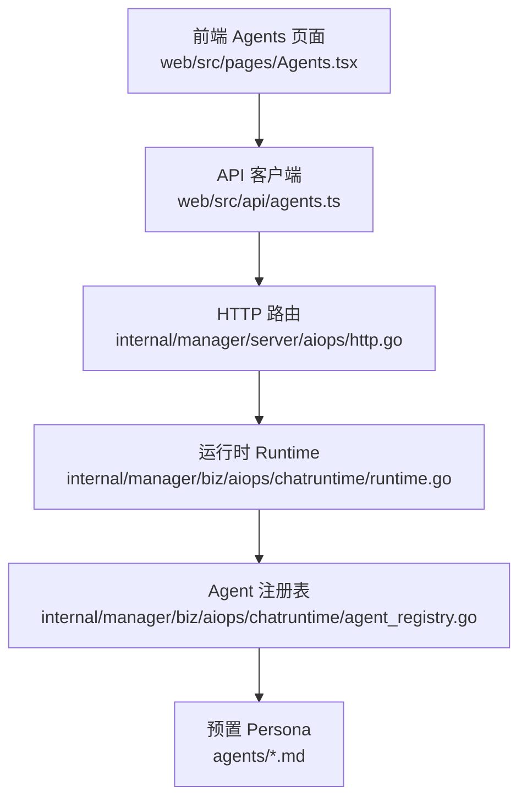
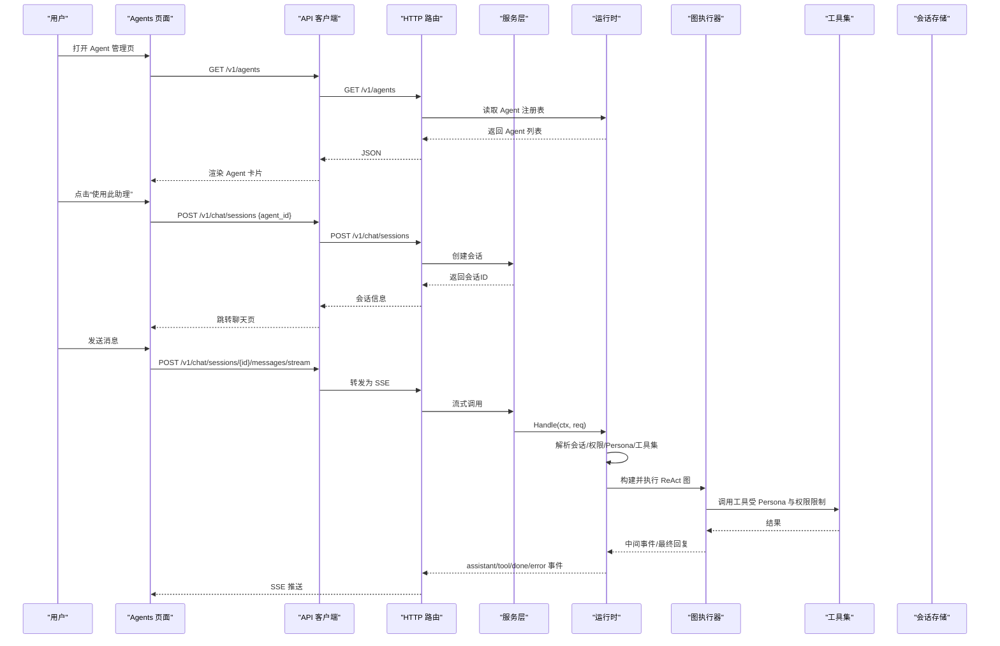
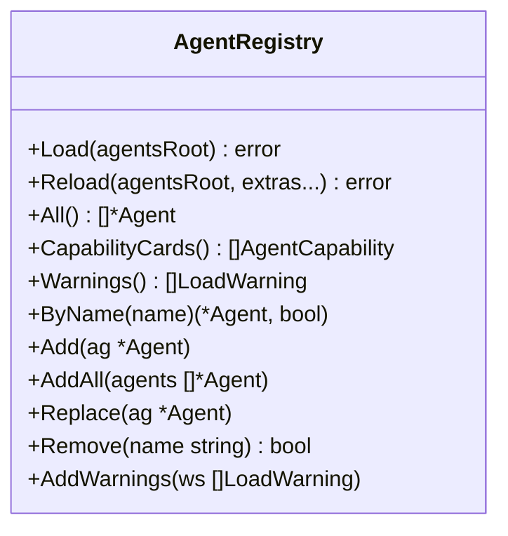
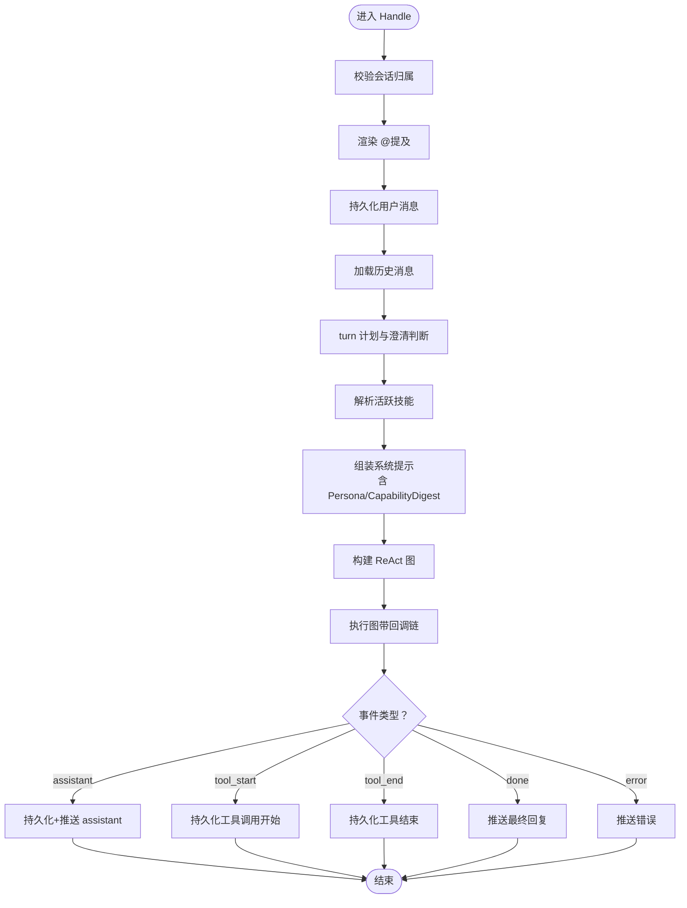
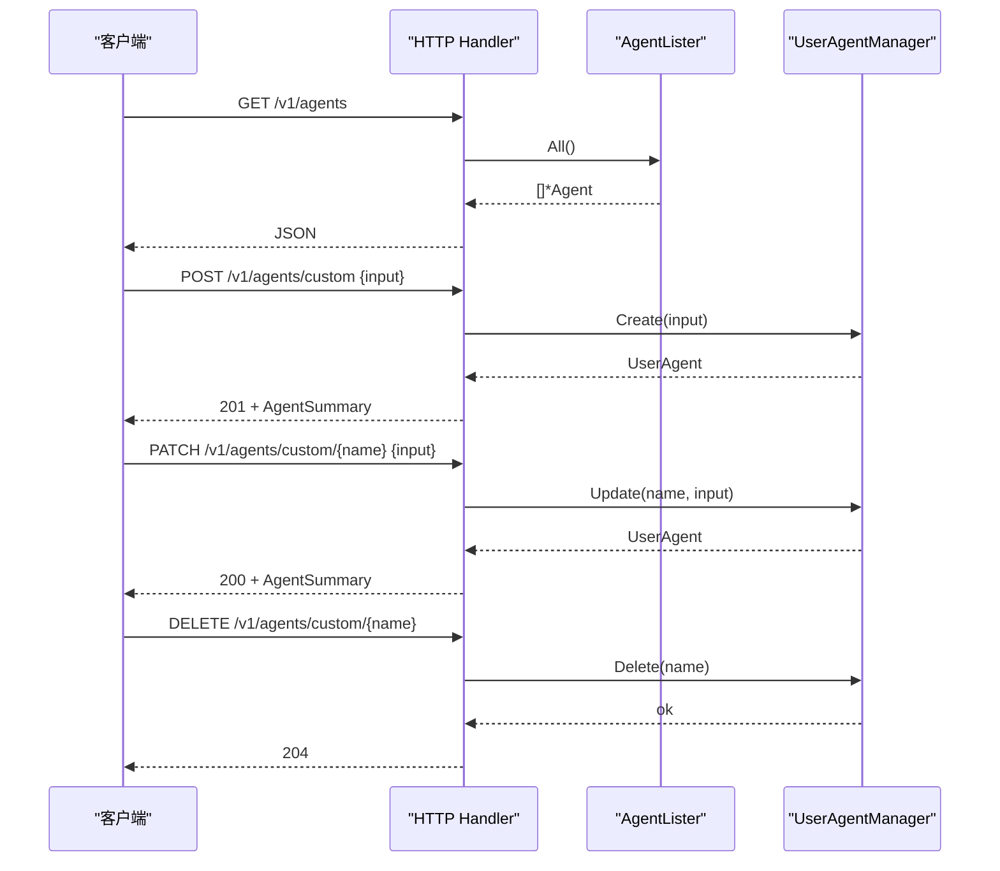
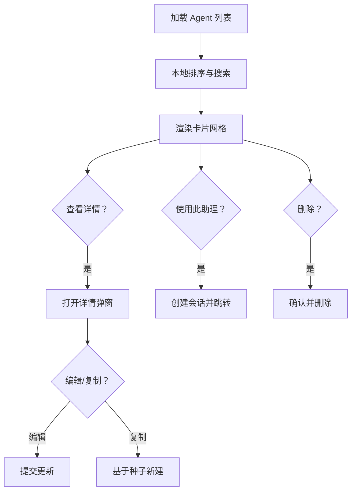
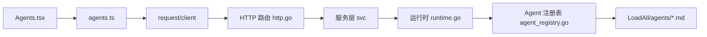

# Agent 管理页面

<cite>
**本文引用的文件**
- [Agents.tsx](file://web/src/pages/Agents.tsx)
- [agents.ts](file://web/src/api/agents.ts)
- [http.go](file://internal/manager/server/aiops/http.go)
- [agent_registry.go](file://internal/manager/biz/aiops/chatruntime/agent_registry.go)
- [runtime.go](file://internal/manager/biz/aiops/chatruntime/runtime.go)
- [incident-investigator.md](file://agents/incident-investigator.md)
- [reviewer.md](file://agents/reviewer.md)
- [specialist-ops.md](file://agents/specialist-ops.md)
</cite>

## 目录
1. [简介](#简介)
2. [项目结构](#项目结构)
3. [核心组件](#核心组件)
4. [架构总览](#架构总览)
5. [详细组件分析](#详细组件分析)
6. [依赖关系分析](#依赖关系分析)
7. [性能考量](#性能考量)
8. [故障排查指南](#故障排查指南)
9. [结论](#结论)
10. [附录：开发示例与最佳实践](#附录：开发示例与最佳实践)

## 简介
本技术文档围绕 Agent 管理页面及其后端支撑能力，系统性说明 Agent 注册管理、能力发现、会话管理与工具调用机制；解释 Agent 生命周期、状态监控与性能指标采集；阐述 Agent 与工具的绑定关系、权限控制与资源隔离；并提供扩展新 Agent 类型与能力的开发指引与优化、排障建议。

## 项目结构
Agent 管理页面由前端页面、API 客户端与后端 HTTP 路由、运行时编排、Agent 注册表与预置 Persona 共同构成：
- 前端页面：展示 Agent 清单、搜索过滤、新建/编辑/删除用户自定义 Agent，支持“使用此助理”创建会话并跳转聊天页。
- API 客户端：封装 /v1/agents 系列接口（列表、详情、用户自定义 CRUD）。
- 后端路由：暴露 /v1/agents 与 /v1/agents/custom 等端点，对接服务层与 Agent 注册表。
- 运行时：负责会话级系统提示组装、工具集裁剪、权限门控、图执行与事件流式输出。
- Agent 注册表：加载与管理 Agent Persona（内置、磁盘预置、用户自定义），提供按名查找、替换、删除等操作。
- 预置 Persona：通过 agents/*.md 定义，包含名称、描述、能力、允许/禁止工具、最大轮数、关键提醒等。

**图表来源**
- [Agents.tsx:1-210](file://web/src/pages/Agents.tsx#L1-L210)
- [agents.ts:1-140](file://web/src/api/agents.ts#L1-L140)
- [http.go:143-171](file://internal/manager/server/aiops/http.go#L143-L171)
- [runtime.go:516-800](file://internal/manager/biz/aiops/chatruntime/runtime.go#L516-L800)
- [agent_registry.go:1-202](file://internal/manager/biz/aiops/chatruntime/agent_registry.go#L1-L202)
- [incident-investigator.md:1-121](file://agents/incident-investigator.md#L1-L121)

**章节来源**
- [Agents.tsx:1-210](file://web/src/pages/Agents.tsx#L1-L210)
- [agents.ts:1-140](file://web/src/api/agents.ts#L1-L140)
- [http.go:143-171](file://internal/manager/server/aiops/http.go#L143-L171)
- [runtime.go:516-800](file://internal/manager/biz/aiops/chatruntime/runtime.go#L516-L800)
- [agent_registry.go:1-202](file://internal/manager/biz/aiops/chatruntime/agent_registry.go#L1-L202)
- [incident-investigator.md:1-121](file://agents/incident-investigator.md#L1-L121)

## 核心组件
- Agent 注册表（AgentRegistry）：维护已加载的 Agent Persona，支持 Load/Reload/ByName/Add/Replace/Remove 等并发安全操作，并提供能力卡片快照。
- 运行时（Runtime）：处理一次用户请求的全流程——所有权校验、@提及内联、历史加载、系统提示组装、工具集裁剪、权限门控、图执行、回调链（持久化、SSE、审计、预算）、回复翻译。
- HTTP 路由（Handler）：注册 /v1/agents 与 /v1/agents/custom 等端点，将前端请求映射到服务层与注册表。
- 前端 Agents 页面：拉取 Agent 列表、本地排序与过滤、新建/编辑/删除用户自定义 Agent、打开详情弹窗、“使用此助理”创建会话。
- 预置 Persona（agents/*.md）：以 Markdown frontmatter 声明 Agent 的行为契约（名称、描述、when_to_use、tools/disallowed_tools、permission_mode、max_turns、critical_reminder 等）。

**章节来源**
- [agent_registry.go:1-202](file://internal/manager/biz/aiops/chatruntime/agent_registry.go#L1-L202)
- [runtime.go:179-245](file://internal/manager/biz/aiops/chatruntime/runtime.go#L179-L245)
- [http.go:143-171](file://internal/manager/server/aiops/http.go#L143-L171)
- [Agents.tsx:52-210](file://web/src/pages/Agents.tsx#L52-L210)
- [incident-investigator.md:1-61](file://agents/incident-investigator.md#L1-L61)

## 架构总览
下图展示了从前端到后端的完整调用链路，包括 Agent 注册、能力发现、会话创建、工具调用与 SSE 事件流。

**图表来源**
- [Agents.tsx:292-304](file://web/src/pages/Agents.tsx#L292-L304)
- [agents.ts:110-139](file://web/src/api/agents.ts#L110-L139)
- [http.go:448-618](file://internal/manager/server/aiops/http.go#L448-L618)
- [runtime.go:516-800](file://internal/manager/biz/aiops/chatruntime/runtime.go#L516-L800)

## 详细组件分析

### Agent 注册表（AgentRegistry）
- 职责：加载、热重载、查询、增删改 Agent Persona；并发安全；暴露能力卡片快照。
- 关键点：
  - Load/Reload：递归扫描 agentsRoot，合并插件容器中的 Agent，原子替换内部切片。
  - ByName：精确匹配 name 字段，供协调器 spawn 子 Agent。
  - Replace/Remove：用于用户自定义 Agent 的在线编辑与删除，无需重启。
  - CapabilityCards：聚合各 Agent 声明的能力卡，辅助默认助理决策是否委派专家。

**图表来源**
- [agent_registry.go:1-202](file://internal/manager/biz/aiops/chatruntime/agent_registry.go#L1-L202)

**章节来源**
- [agent_registry.go:1-202](file://internal/manager/biz/aiops/chatruntime/agent_registry.go#L1-L202)

### 运行时（Runtime）
- 职责：单请求生命周期编排，涵盖权限门控、系统提示组装、工具集裁剪、图执行、回调链（持久化、SSE、审计、预算）、回复翻译。
- 关键点：
  - Handle：顺序执行所有权检查、@提及内联、用户消息持久化、历史加载、turn 计划、技能解析、系统提示组装、图构建与执行、动态提示注入、模型选项注入、工具调用持久化。
  - 权限门控：viewer 角色或全局写开关关闭时，强制只读工具集；Persona 进一步裁剪 allowed/disallowed tools。
  - 多 Agent 目录：当 session 未指定 agent_id 或为 default 时作为协调器；否则作为 worker 运行，且不可再 spawn 子 Agent。
  - 回调链：默认处理器链包含持久化、SSE、审计、指标、预算门控。

**图表来源**
- [runtime.go:516-800](file://internal/manager/biz/aiops/chatruntime/runtime.go#L516-L800)

**章节来源**
- [runtime.go:516-800](file://internal/manager/biz/aiops/chatruntime/runtime.go#L516-L800)

### HTTP 路由（/v1/agents 与 /v1/agents/custom）
- 暴露端点：
  - GET /v1/agents：列出所有已加载的 Agent（内置、磁盘预置、用户自定义）。
  - GET /v1/agents/{name}：获取单个 Agent 详情。
  - POST /v1/agents/custom：创建用户自定义 Agent。
  - PATCH /v1/agents/custom/{name}：更新用户自定义 Agent。
  - DELETE /v1/agents/custom/{name}：删除用户自定义 Agent。
  - DELETE /v1/agents/{name}：通用删除（对非内置/非 default 生效；磁盘源为会话级移除，用户源删除数据库行）。
- 行为：
  - 通过 SetAgentLister/SetUserAgentManager 注入依赖，未配置时优雅降级（空列表或 503）。
  - 会话相关端点支持阻塞与 SSE 两种模式，统一事件帧格式。

**图表来源**
- [http.go:143-171](file://internal/manager/server/aiops/http.go#L143-L171)
- [http.go:448-618](file://internal/manager/server/aiops/http.go#L448-L618)

**章节来源**
- [http.go:143-171](file://internal/manager/server/aiops/http.go#L143-L171)
- [http.go:448-618](file://internal/manager/server/aiops/http.go#L448-L618)

### 前端 Agents 页面
- 功能：
  - 拉取 Agent 列表，本地排序（内置优先顺序：default → incident-investigator → specialist-sre → specialist-ops → specialist-compute → specialist-network → specialist-disk → reviewer），支持搜索过滤。
  - 新建/编辑/删除用户自定义 Agent；内置/预置 Agent 仅支持查看与“复制为自定义助理”。
  - “使用此助理”创建新会话并跳转到聊天页。
  - 详情弹窗展示 description、when_to_use、system_prompt、tools、model、max_turns、critical_reminder 等。
- 数据模型：
  - AgentSummary：name、description、when_to_use、tools、disallowed_tools、permission_mode、model、max_turns、system_prompt、critical_reminder、source。
  - UserAgentInput：创建/更新表单输入。

**图表来源**
- [Agents.tsx:70-108](file://web/src/pages/Agents.tsx#L70-L108)
- [Agents.tsx:292-304](file://web/src/pages/Agents.tsx#L292-L304)
- [agents.ts:9-37](file://web/src/api/agents.ts#L9-L37)

**章节来源**
- [Agents.tsx:52-210](file://web/src/pages/Agents.tsx#L52-L210)
- [agents.ts:9-37](file://web/src/api/agents.ts#L9-L37)

### 预置 Persona 与能力声明
- 通过 agents/*.md 的 frontmatter 声明 Agent 的行为契约：
  - name、description、when_to_use、capabilities（id、description、tools、max_tool_calls）、tools、disallowed_tools、permission_mode、max_turns、critical_reminder、metadata（scope、min_ongrid_version）。
- 典型示例：
  - incident-investigator：根因诊断 worker，限定只读工具与最大轮数，强调因果回溯工作流。
  - reviewer：高危操作二审 worker，异步背景任务，严格审批门控。
  - specialist-ops：运维专家，聚焦单机服务/进程/容量问题，mutating 操作走 reviewer 二审。

**章节来源**
- [incident-investigator.md:1-61](file://agents/incident-investigator.md#L1-L61)
- [reviewer.md:1-41](file://agents/reviewer.md#L1-L41)
- [specialist-ops.md:1-36](file://agents/specialist-ops.md#L1-L36)

## 依赖关系分析
- 前端依赖：
  - Agents.tsx 依赖 agents.ts 提供的 listAgents/createSession/deleteAgent 等方法。
  - agents.ts 依赖 request 客户端与 i18n 工具。
- 后端依赖：
  - http.go 依赖 service 层与 AgentLister/UserAgentManager 接口，解耦具体实现。
  - runtime.go 依赖 SkillRegistry、AgentRegistry、ChatModel、ToolBag、CallbackDeps 等。
  - agent_registry.go 依赖 LoadAll 进行 Agent 解析与合并。

**图表来源**
- [Agents.tsx:20-49](file://web/src/pages/Agents.tsx#L20-L49)
- [agents.ts:1-37](file://web/src/api/agents.ts#L1-L37)
- [http.go:143-171](file://internal/manager/server/aiops/http.go#L143-L171)
- [runtime.go:179-245](file://internal/manager/biz/aiops/chatruntime/runtime.go#L179-L245)
- [agent_registry.go:26-49](file://internal/manager/biz/aiops/chatruntime/agent_registry.go#L26-L49)

**章节来源**
- [Agents.tsx:20-49](file://web/src/pages/Agents.tsx#L20-L49)
- [agents.ts:1-37](file://web/src/api/agents.ts#L1-L37)
- [http.go:143-171](file://internal/manager/server/aiops/http.go#L143-L171)
- [runtime.go:179-245](file://internal/manager/biz/aiops/chatruntime/runtime.go#L179-L245)
- [agent_registry.go:26-49](file://internal/manager/biz/aiops/chatruntime/agent_registry.go#L26-L49)

## 性能考量
- 图构建与执行：
  - 每次请求构建 eino 图，成本低但可考虑按 (toolBag 标识, 配置) 缓存以提升吞吐。
- 工具集裁剪：
  - 在 viewer 角色或全局写开关关闭时提前裁剪工具集，减少 LLM 可见工具数量，降低无效调用。
- 最大轮数控制：
  - 通过 Persona 的 max_turns 限制迭代次数，避免长链工具调用导致超时与成本飙升。
- SSE 流式：
  - 使用 flush 立即推送中间事件，提升用户体验；注意代理缓冲设置（如 nginx X-Accel-Buffering）。
- 注册表热重载：
  - Reload 原子替换内部切片，避免在读路径加锁竞争，保障高并发下的稳定性。

[本节为通用性能指导，不直接分析具体文件]

## 故障排查指南
- 常见问题定位：
  - 无法加载 Agent 列表：检查 AgentLister 是否注入；若未配置，/v1/agents 返回空列表。
  - 用户自定义 Agent 删除失败：确认是否为 user-source；磁盘源 Agent 删除为会话级移除，重启后恢复。
  - 工具调用被拒绝：检查 permission_mode 与 disallowed_tools；viewer 角色会强制只读。
  - 会话无响应：检查 SSE 是否被代理缓冲；确认服务端 flush 与浏览器事件监听。
- 日志与指标：
  - 运行时在 persona 不存在时会记录 info 日志；回调链包含审计与指标，便于追踪工具调用耗时与错误。
- 调试建议：
  - 使用“使用此助理”创建会话并观察 SSE 事件；逐步缩小问题范围至工具调用或 Persona 配置。

**章节来源**
- [http.go:129-137](file://internal/manager/server/aiops/http.go#L129-L137)
- [runtime.go:672-676](file://internal/manager/biz/aiops/chatruntime/runtime.go#L672-L676)
- [runtime.go:722-741](file://internal/manager/biz/aiops/chatruntime/runtime.go#L722-L741)

## 结论
Agent 管理页面通过清晰的前后端分层与模块化设计，实现了 Agent 的注册管理、能力发现、会话管理与工具调用闭环。运行时提供了严格的权限门控与灵活的 Persona 裁剪，结合预置 Persona 的行为契约，确保 Agent 在安全边界内高效协作。通过注册表热重载与 SSE 流式反馈，系统在可用性与可观测性方面具备良好基础。

[本节为总结性内容，不直接分析具体文件]

## 附录：开发示例与最佳实践

### 添加新的 Agent 类型（Persona）
- 步骤：
  1. 在 agents/ 目录下新增 *.md 文件，填写 frontmatter（name、description、when_to_use、capabilities、tools、disallowed_tools、permission_mode、max_turns、critical_reminder、metadata）。
  2. 如需在代码中注入内置 Agent，使用 AgentRegistry.Add/Replace。
  3. 通过 /v1/agents 验证加载；在前端 Agents 页面查看并测试“使用此助理”。
- 参考：
  - 预置 Persona 示例：incident-investigator、reviewer、specialist-ops。
  - 注册表方法：Add/Replace/Remove/ByName。

**章节来源**
- [incident-investigator.md:1-61](file://agents/incident-investigator.md#L1-L61)
- [reviewer.md:1-41](file://agents/reviewer.md#L1-L41)
- [specialist-ops.md:1-36](file://agents/specialist-ops.md#L1-L36)
- [agent_registry.go:136-189](file://internal/manager/biz/aiops/chatruntime/agent_registry.go#L136-L189)

### 扩展工具能力
- 步骤：
  1. 在 ToolBag 中注册 BaseTool，确保 Info().Name 唯一。
  2. 在 Persona 的 tools/disallowed_tools 中声明允许/禁止的工具集合。
  3. 通过运行时权限门控（viewer/全局写开关）进一步约束。
- 参考：
  - 运行时工具集装配与裁剪逻辑。
  - 路由层对 ToolBag 的访问与替换前缀能力。

**章节来源**
- [runtime.go:374-445](file://internal/manager/biz/aiops/chatruntime/runtime.go#L374-L445)
- [runtime.go:615-677](file://internal/manager/biz/aiops/chatruntime/runtime.go#L615-L677)

### 权限控制与资源隔离
- 角色门控：
  - viewer 角色强制只读工具集；全局写开关关闭时同样强制只读。
- Persona 裁剪：
  - 通过 allowed/disallowed tools 与 permission_mode 精细控制。
- 资源隔离：
  - 会话级上下文（SessionID、UserID）贯穿运行时，确保数据与操作隔离。

**章节来源**
- [runtime.go:615-677](file://internal/manager/biz/aiops/chatruntime/runtime.go#L615-L677)

### 性能优化建议
- 限制最大轮数：为每个 Persona 设置合理的 max_turns，避免无限循环。
- 工具集最小化：仅暴露必要工具，减少 LLM 决策空间。
- SSE 优化：确保代理不缓冲响应，及时 flush。
- 注册表热重载：利用原子替换避免读路径锁竞争。

[本节为通用优化建议，不直接分析具体文件]

### 故障排查最佳实践
- 使用 SSE 事件定位问题阶段（assistant/tool_start/tool_end/done/error）。
- 检查 Persona 配置是否正确加载（ByName 是否存在）。
- 验证工具调用参数与权限（disallowed_tools、permission_mode）。
- 关注运行时日志（persona 不存在时的 info 日志）。

**章节来源**
- [http.go:539-618](file://internal/manager/server/aiops/http.go#L539-L618)
- [runtime.go:672-676](file://internal/manager/biz/aiops/chatruntime/runtime.go#L672-L676)