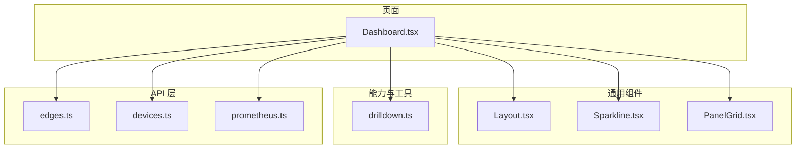
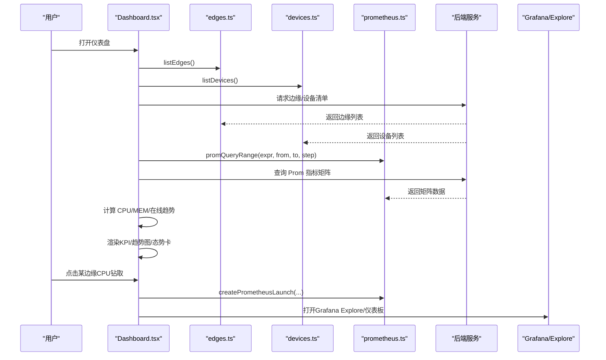
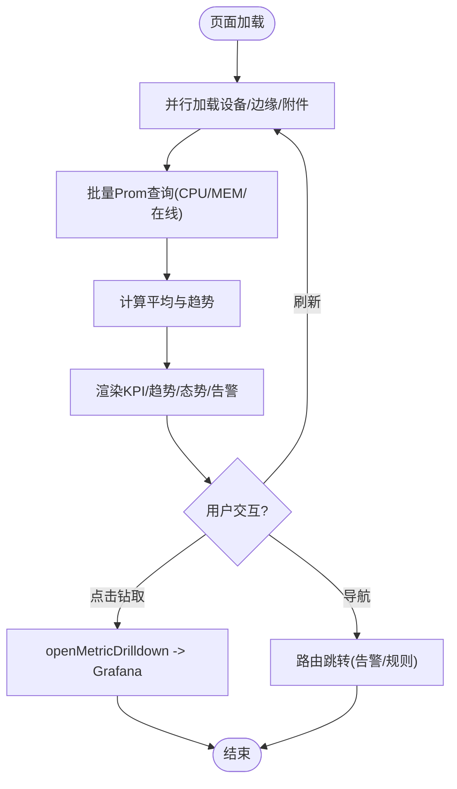
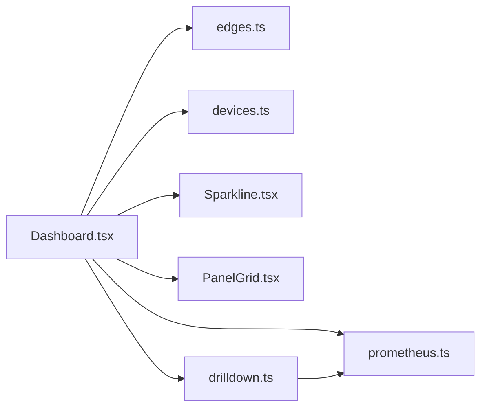

# 仪表盘页面

<cite>
**本文引用的文件**
- [Dashboard.tsx](file://web/src/pages/Dashboard.tsx)
- [Layout.tsx](file://web/src/components/Layout.tsx)
- [Sparkline.tsx](file://web/src/components/Sparkline.tsx)
- [PanelGrid.tsx](file://web/src/components/monitor/PanelGrid.tsx)
- [drilldown.ts](file://web/src/lib/drilldown.ts)
- [edges.ts](file://web/src/api/edges.ts)
- [devices.ts](file://web/src/api/devices.ts)
- [prometheus.ts](file://web/src/api/prometheus.ts)
</cite>

## 目录
1. [简介](#简介)
2. [项目结构](#项目结构)
3. [核心组件](#核心组件)
4. [架构总览](#架构总览)
5. [详细组件分析](#详细组件分析)
6. [依赖关系分析](#依赖关系分析)
7. [性能考虑](#性能考虑)
8. [故障排查指南](#故障排查指南)
9. [结论](#结论)
10. [附录：开发示例与最佳实践](#附录：开发示例与最佳实践)

## 简介
本技术文档聚焦于“仪表盘”页面的实现，覆盖系统概览数据展示、关键指标可视化、实时状态监控与性能指标展示。文档从组件结构、数据获取机制、图表渲染逻辑、用户交互处理入手，解释如何集成多种监控数据源（设备清单、边缘节点、Prometheus 指标、告警与会话统计），并说明动态更新与响应式布局的实现方式。同时提供添加新指标卡片与自定义图表组件的开发示例，以及性能优化与用户体验改进的最佳实践。

## 项目结构
仪表盘页面由一个主页面组件与若干子组件构成，采用 React + TypeScript 实现，使用 Tailwind CSS 进行样式编排，图表通过内联 SVG 与 Recharts 组合呈现。数据通过 API 层调用后端接口，包括设备列表、边缘节点列表、Prometheus 查询范围接口、会话与告警等。

**图示来源**
- [Dashboard.tsx:1-120](file://web/src/pages/Dashboard.tsx#L1-L120)
- [Layout.tsx:1-72](file://web/src/components/Layout.tsx#L1-L72)
- [Sparkline.tsx:1-118](file://web/src/components/Sparkline.tsx#L1-L118)
- [PanelGrid.tsx:1-78](file://web/src/components/monitor/PanelGrid.tsx#L1-L78)
- [drilldown.ts:1-234](file://web/src/lib/drilldown.ts#L1-L234)
- [edges.ts:350-469](file://web/src/api/edges.ts#L350-L469)
- [devices.ts:162-171](file://web/src/api/devices.ts#L162-L171)
- [prometheus.ts:1-13](file://web/src/api/prometheus.ts#L1-L13)

**章节来源**
- [Dashboard.tsx:1-120](file://web/src/pages/Dashboard.tsx#L1-L120)
- [Layout.tsx:1-72](file://web/src/components/Layout.tsx#L1-L72)

## 核心组件
- 仪表盘主页面：负责聚合多源数据、计算关键指标、渲染 KPI 条带、集群趋势图、集群态势卡、告警分级与噪声规则排行等。
- 迷你折线图 Sparkline：轻量级 SVG 折线，用于 KPI 卡片中的趋势预览。
- 面板网格 PanelGrid：将 Grafana 面板按 24 列网格布局，支持窄屏折叠为单列。
- 钻取工具 drilldown：封装打开 Prometheus/Grafana Explore 或仪表板的链接生成与鉴权流程。
- API 层 edges/devices/prometheus：统一封装后端接口，包括边缘节点、设备、PromQL 范围查询与 Launch 跳转。

**章节来源**
- [Dashboard.tsx:48-461](file://web/src/pages/Dashboard.tsx#L48-L461)
- [Sparkline.tsx:1-118](file://web/src/components/Sparkline.tsx#L1-L118)
- [PanelGrid.tsx:1-78](file://web/src/components/monitor/PanelGrid.tsx#L1-L78)
- [drilldown.ts:1-234](file://web/src/lib/drilldown.ts#L1-L234)
- [edges.ts:350-469](file://web/src/api/edges.ts#L350-L469)
- [devices.ts:162-171](file://web/src/api/devices.ts#L162-L171)
- [prometheus.ts:1-13](file://web/src/api/prometheus.ts#L1-L13)

## 架构总览
仪表盘的数据流遵循“页面 → API 层 → 后端服务/存储”的单向流，图表渲染在页面内完成，交互事件触发导航或钻取到外部可观测性平台。

**图示来源**
- [Dashboard.tsx:75-231](file://web/src/pages/Dashboard.tsx#L75-L231)
- [edges.ts:350-469](file://web/src/api/edges.ts#L350-L469)
- [devices.ts:162-171](file://web/src/api/devices.ts#L162-L171)
- [prometheus.ts:1-13](file://web/src/api/prometheus.ts#L1-L13)
- [drilldown.ts:170-183](file://web/src/lib/drilldown.ts#L170-L183)

## 详细组件分析

### 仪表盘主页面 Dashboard.tsx
- 数据加载与刷新
  - 初始化时并行拉取设备、边缘、K8s 附件，随后对可见边缘批量查询 Prom 指标矩阵（CPU、内存、在线计数），避免 N 次往返。
  - 定时轮询刷新（usePoll）与手动刷新按钮，显示上次刷新时间与刷新中状态。
- 指标计算
  - 基于 Prom 矩阵按设备维度归并，计算过去 24h 平均 CPU/MEM 与趋势；在线数基于设备在线状态与网络可达性综合判定。
- 图表渲染
  - 集群趋势：内联 SVG 绘制 CPU%、MEM%、在线数三条系列，共享 X 轴，在线数按自身峰值缩放。
  - 集群态势：在线数柱状图（24h 小时粒度）、角色分布标签。
  - 告警分级：环形图展示严重/警告/通知占比，支持点击跳转到对应过滤页。
  - 噪声规则 Top5：水平条形图，按 incident 数量排序，点击跳转到规则详情。
- 用户交互
  - 点击边缘 CPU 钻取到 Grafana 仪表板或 Explore，自动注入 device_id 模板变量与时间范围。
  - 告警与规则行点击跳转至相应筛选页面。

**图示来源**
- [Dashboard.tsx:75-231](file://web/src/pages/Dashboard.tsx#L75-L231)
- [Dashboard.tsx:243-286](file://web/src/pages/Dashboard.tsx#L243-L286)
- [Dashboard.tsx:293-309](file://web/src/pages/Dashboard.tsx#L293-L309)
- [drilldown.ts:170-183](file://web/src/lib/drilldown.ts#L170-L183)

**章节来源**
- [Dashboard.tsx:48-461](file://web/src/pages/Dashboard.tsx#L48-L461)
- [Dashboard.tsx:502-632](file://web/src/pages/Dashboard.tsx#L502-L632)
- [Dashboard.tsx:638-758](file://web/src/pages/Dashboard.tsx#L638-L758)
- [Dashboard.tsx:786-840](file://web/src/pages/Dashboard.tsx#L786-L840)
- [Dashboard.tsx:853-958](file://web/src/pages/Dashboard.tsx#L853-L958)
- [Dashboard.tsx:963-1052](file://web/src/pages/Dashboard.tsx#L963-L1052)

### 迷你折线图 Sparkline.tsx
- 功能：无坐标轴的轻量折线，用于 KPI 卡片内的趋势预览。
- 性能：纯 SVG 渲染，避免重库开销，适合大量实例同屏。
- 视觉：根据数值区间与趋势自动着色（如 CPU/MEM 百分比超阈值变红，上升趋势变琥珀色）。

**章节来源**
- [Sparkline.tsx:1-118](file://web/src/components/Sparkline.tsx#L1-L118)

### 面板网格 PanelGrid.tsx
- 功能：将 Grafana 面板按 24 列网格布局，窄屏自动折叠为单列，提升可读性。
- 适配：高度以 Grafana 网格单位换算，保证嵌入视图舒适。

**章节来源**
- [PanelGrid.tsx:1-78](file://web/src/components/monitor/PanelGrid.tsx#L1-L78)

### 钻取工具 drilldown.ts
- 功能：生成 Grafana 仪表板/Explore 链接，注入语言、组织、设备模板变量与时间范围；必要时先创建 Prometheus Launch 以签发票据，解决跨域/鉴权问题。
- 缓存：对 Grafana 根 URL 做短时缓存，减少设置接口调用。

**章节来源**
- [drilldown.ts:1-234](file://web/src/lib/drilldown.ts#L1-L234)

### API 层 edges.ts / devices.ts / prometheus.ts
- edges.ts
  - 提供边缘列表、PromQL 范围查询、进程列表、升级任务等接口。
  - 仪表盘使用 listEdges 与 promQueryRange 获取边缘与指标矩阵。
- devices.ts
  - 提供设备列表、详情、网络发现与轮询配置等接口。
  - 仪表盘使用 listDevices 获取设备清单与在线状态。
- prometheus.ts
  - 提供 createPrometheusLaunch，用于生成可访问的 Explore/仪表板链接。

**章节来源**
- [edges.ts:350-469](file://web/src/api/edges.ts#L350-L469)
- [devices.ts:162-171](file://web/src/api/devices.ts#L162-L171)
- [prometheus.ts:1-13](file://web/src/api/prometheus.ts#L1-L13)

## 依赖关系分析
- 页面依赖
  - Dashboard.tsx 依赖 API 层 edges.ts/devices.ts 获取基础数据，依赖 prometheus.ts 进行指标查询与跳转。
  - 图表渲染依赖 Sparkline.tsx 与 Recharts（部分区域），布局依赖 Layout.tsx。
- 外部集成
  - drilldown.ts 对接 Grafana/Explore，通过后端 Launch 接口获取票据后打开外部链接。

**图示来源**
- [Dashboard.tsx:1-120](file://web/src/pages/Dashboard.tsx#L1-L120)
- [edges.ts:350-469](file://web/src/api/edges.ts#L350-L469)
- [devices.ts:162-171](file://web/src/api/devices.ts#L162-L171)
- [prometheus.ts:1-13](file://web/src/api/prometheus.ts#L1-L13)
- [drilldown.ts:1-234](file://web/src/lib/drilldown.ts#L1-L234)

**章节来源**
- [Dashboard.tsx:1-120](file://web/src/pages/Dashboard.tsx#L1-L120)
- [drilldown.ts:1-234](file://web/src/lib/drilldown.ts#L1-L234)

## 性能考虑
- 批量查询与去重
  - 对 Prom 指标使用一次 range 查询并按设备维度解析矩阵，避免 N 次往返；对边缘列表进行去重与排序，仅保留可见样本。
- 渲染优化
  - 使用轻量 SVG 迷你折线替代重型图表库，降低重复渲染成本；关闭动画以减少重排。
- 轮询策略
  - 使用固定间隔轮询（默认 60s）与手动刷新结合，避免频繁请求造成抖动。
- 缓存
  - 对 Grafana 根 URL 做短时缓存，减少设置接口调用；钻取前预发 Launch 请求以签发票据，避免二次失败。
- 错误降级
  - 对不可用数据源（如 usage/today 404）进行友好降级，保持页面可用。

[本节为通用性能建议，不直接分析具体文件]

## 故障排查指南
- 无法加载设备/边缘
  - 检查 listDevices/listEdges 是否返回数据；查看 edgesError 状态与错误消息。
- Prom 查询失败
  - 检查 promQueryRange 表达式与时间范围；确认后端 /metrics/query_range 可达；查看 promErr 提示。
- 钻取被拦截
  - 确认浏览器未阻止弹窗；检查 createPrometheusLaunch 是否成功签发票据；若被拦截则回退到当前标签页跳转。
- 告警数据为空
  - 检查 listIncidents 参数与权限；确认 incidentsError 是否为空。

**章节来源**
- [Dashboard.tsx:75-231](file://web/src/pages/Dashboard.tsx#L75-L231)
- [Dashboard.tsx:293-309](file://web/src/pages/Dashboard.tsx#L293-L309)
- [drilldown.ts:35-49](file://web/src/lib/drilldown.ts#L35-L49)

## 结论
仪表盘通过聚合设备、边缘与 Prom 指标，提供直观的集群健康概览与关键趋势。其设计强调低开销渲染、批量数据获取与健壮的错误降级，并通过钻取能力无缝衔接 Grafana/Explore。按照本文档的扩展指引，可快速新增指标卡片与自定义图表，同时保持整体性能与体验。

[本节为总结性内容，不直接分析具体文件]

## 附录：开发示例与最佳实践

### 新增指标卡片（KpiCard）
- 步骤
  - 在 Dashboard.tsx 的 KPI 条带区域新增一个 KpiCard 实例，传入 label、value、format、spark 等属性。
  - 如需趋势，准备一组数值数组作为 spark 数据；若无趋势，传空数组即可。
  - 若数据来自后端，可在 loadAll 中并行请求并设置状态。
- 参考路径
  - [Dashboard.tsx:353-396](file://web/src/pages/Dashboard.tsx#L353-L396)
  - [Dashboard.tsx:786-840](file://web/src/pages/Dashboard.tsx#L786-L840)

### 自定义图表组件
- 轻量折线
  - 复用 Sparkline.tsx，传入 data、width、height、variant 等属性，适用于小尺寸趋势展示。
- 复杂图表
  - 使用 Recharts 的 BarChart/PieChart/ResponsiveContainer，注意关闭动画以提升性能，并为 Tooltip 定制主题。
- 参考路径
  - [Sparkline.tsx:1-118](file://web/src/components/Sparkline.tsx#L1-L118)
  - [Dashboard.tsx:853-958](file://web/src/pages/Dashboard.tsx#L853-L958)
  - [Dashboard.tsx:963-1052](file://web/src/pages/Dashboard.tsx#L963-L1052)

### 接入新的监控数据源
- 新增 API 方法
  - 在 edges.ts/devices.ts/prometheus.ts 中定义新的 request 封装函数，明确输入输出类型。
- 页面集成
  - 在 loadAll 中并行请求新数据，计算指标并更新状态；在 UI 中新增展示区域。
- 参考路径
  - [edges.ts:350-469](file://web/src/api/edges.ts#L350-L469)
  - [devices.ts:162-171](file://web/src/api/devices.ts#L162-L171)
  - [Dashboard.tsx:75-231](file://web/src/pages/Dashboard.tsx#L75-L231)

### 用户交互与导航
- 钻取到 Grafana/Explore
  - 使用 openMetricDrilldown，传入 expr、rangeInput、stepInput、title、deviceId 等参数。
- 页面内导航
  - 使用 useNavigate 跳转到告警/规则详情页，并携带筛选参数。
- 参考路径
  - [Dashboard.tsx:293-309](file://web/src/pages/Dashboard.tsx#L293-L309)
  - [drilldown.ts:170-183](file://web/src/lib/drilldown.ts#L170-L183)

### 性能优化与体验改进最佳实践
- 数据层
  - 优先批量查询与矩阵解析；对高频接口增加合理缓存与节流。
- 渲染层
  - 使用轻量图表与关闭动画；避免不必要的重渲染（useMemo/useCallback）。
- 交互层
  - 提供手动刷新与加载态反馈；对错误进行友好降级与提示。
- 可观测性
  - 通过钻取能力直达 Grafana/Explore，便于深入分析。

[本节为通用指导，不直接分析具体文件]