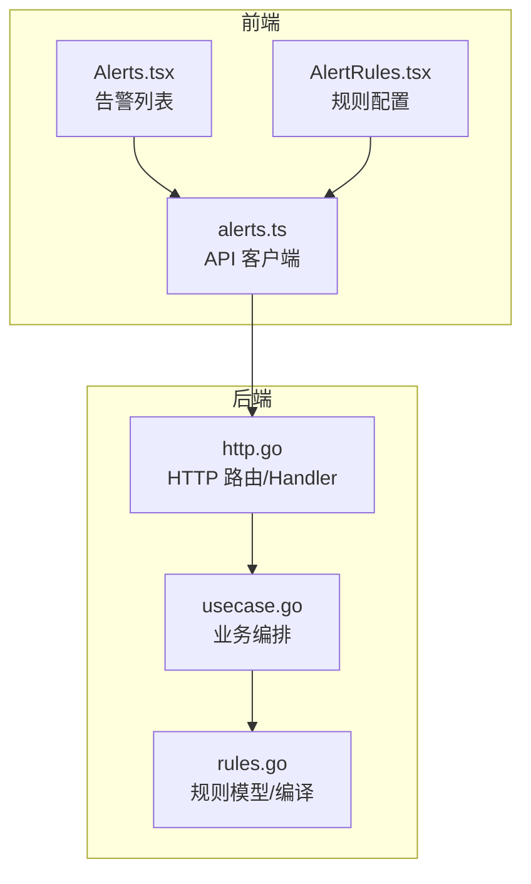
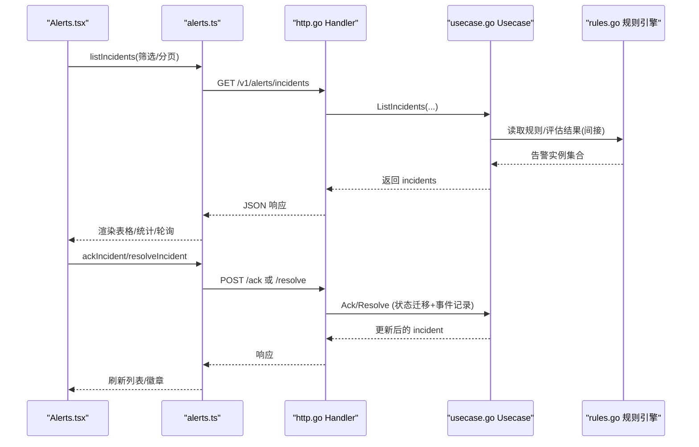
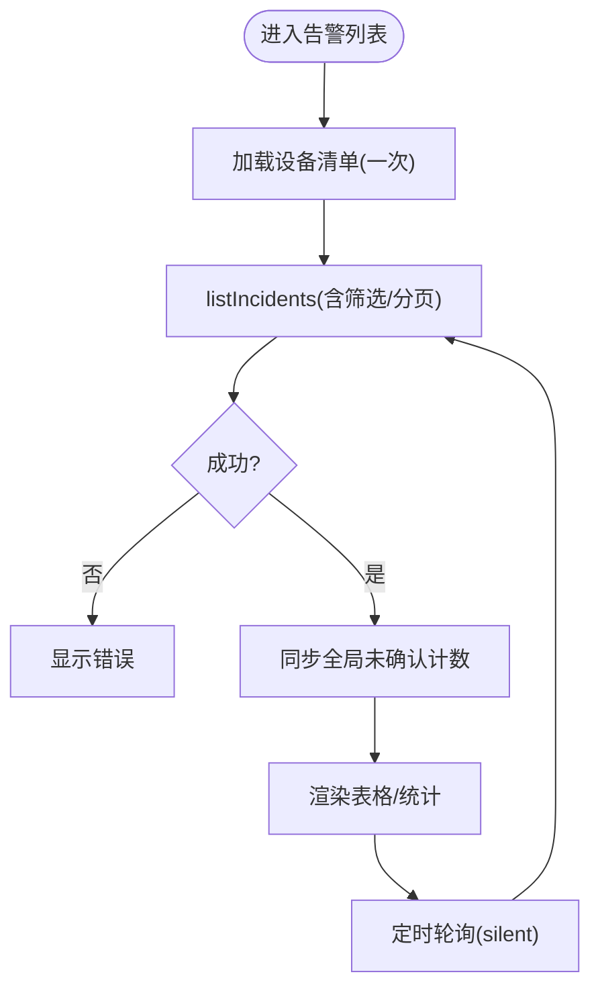
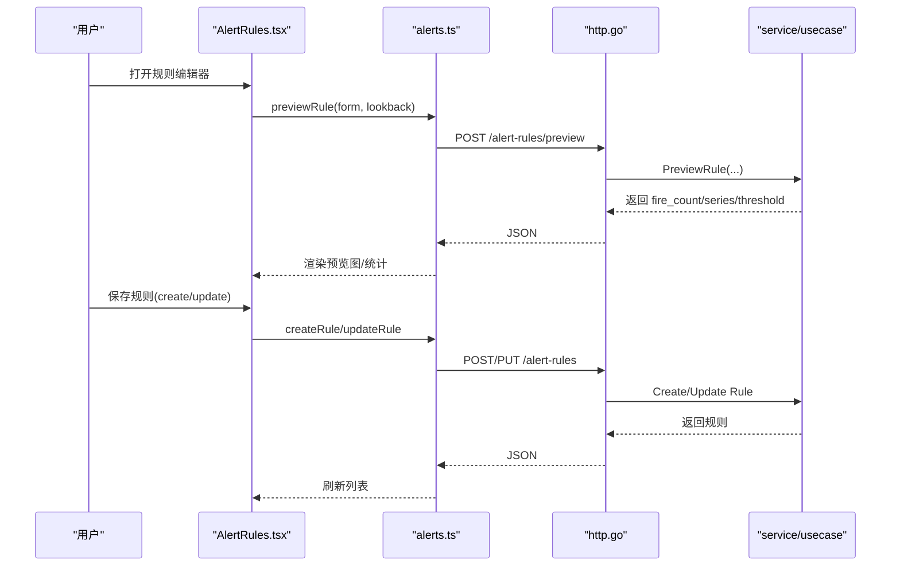
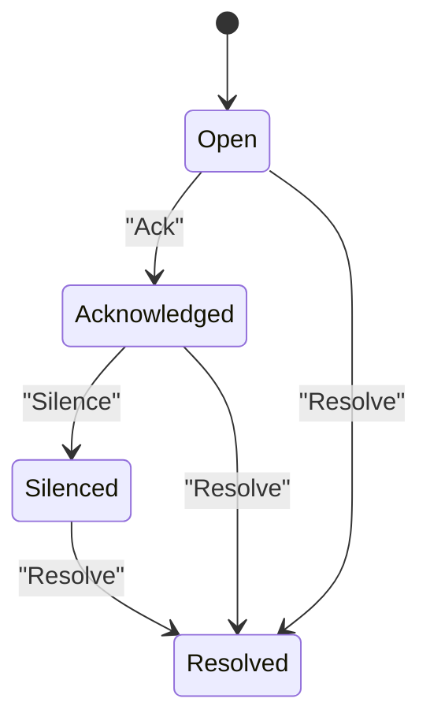
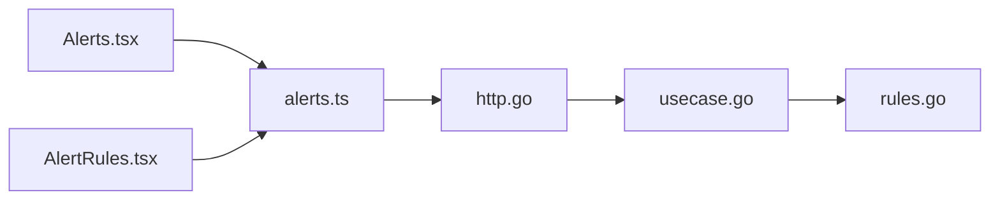

# 告警中心页面

<cite>
**本文引用的文件**
- [web/src/pages/Alerts.tsx](file://web/src/pages/Alerts.tsx)
- [web/src/pages/AlertRules.tsx](file://web/src/pages/AlertRules.tsx)
- [web/src/api/alerts.ts](file://web/src/api/alerts.ts)
- [api/manager/alert/v1/alert.proto](file://api/manager/alert/v1/alert.proto)
- [internal/manager/server/alert/http.go](file://internal/manager/server/alert/http.go)
- [internal/manager/biz/alert/usecase.go](file://internal/manager/biz/alert/usecase.go)
- [internal/manager/biz/alert/rules.go](file://internal/manager/biz/alert/rules.go)
- [web/src/lib/rule_presets.ts](file://web/src/lib/rule_presets.ts)
</cite>

## 目录
1. [简介](#简介)
2. [项目结构](#项目结构)
3. [核心组件](#核心组件)
4. [架构总览](#架构总览)
5. [详细组件分析](#详细组件分析)
6. [依赖关系分析](#依赖关系分析)
7. [性能考虑](#性能考虑)
8. [故障排查指南](#故障排查指南)
9. [结论](#结论)
10. [附录](#附录)

## 简介
本技术文档围绕“告警中心页面”展开，系统性说明告警列表展示、告警规则配置、告警状态管理、批量操作能力、实时数据获取、告警级别分类、去重机制、通知渠道集成、可视化编辑界面、条件表达式构建与测试验证等。同时提供扩展新告警类型与处理逻辑的开发示例，以及性能优化与用户体验改进的最佳实践。

## 项目结构
前端以 React 页面为核心：
- 告警列表页：负责分页、筛选、轮询刷新、确认/解决操作、全局未确认计数同步。
- 告警规则页：负责规则列表、新建/编辑/删除、启用/禁用、预览试算、从预设快速创建。
- API 层：封装 REST 接口调用，定义 Incident/Rule/Channel 等类型。

后端以 HTTP Handler + Biz Usecase 分层：
- HTTP Handler：路由注册、参数校验、服务编排。
- Biz Usecase：业务编排（事件记录、状态迁移、通知投递、抑制/静默、评估器对接）。
- 规则模型：指标/日志/链路等多类规则的编译形态与执行语义。

**图表来源**
- [web/src/pages/Alerts.tsx:1-120](file://web/src/pages/Alerts.tsx#L1-L120)
- [web/src/pages/AlertRules.tsx:186-320](file://web/src/pages/AlertRules.tsx#L186-L320)
- [web/src/api/alerts.ts:31-55](file://web/src/api/alerts.ts#L31-L55)
- [internal/manager/server/alert/http.go:154-180](file://internal/manager/server/alert/http.go#L154-L180)
- [internal/manager/biz/alert/usecase.go:141-174](file://internal/manager/biz/alert/usecase.go#L141-L174)
- [internal/manager/biz/alert/rules.go:29-185](file://internal/manager/biz/alert/rules.go#L29-L185)

**章节来源**
- [web/src/pages/Alerts.tsx:1-120](file://web/src/pages/Alerts.tsx#L1-L120)
- [web/src/pages/AlertRules.tsx:186-320](file://web/src/pages/AlertRules.tsx#L186-L320)
- [web/src/api/alerts.ts:31-55](file://web/src/api/alerts.ts#L31-L55)
- [internal/manager/server/alert/http.go:154-180](file://internal/manager/server/alert/http.go#L154-L180)

## 核心组件
- 告警列表页（Alerts.tsx）
  - 支持按状态/级别筛选、分页、轮询刷新、确认/解决、设备名称解析、全局未确认计数同步。
- 告警规则页（AlertRules.tsx）
  - 规则 CRUD、启用/禁用、预览试算、从预设创建、运行时信息展示。
- API 客户端（alerts.ts）
  - 统一类型定义与请求封装；包含 Incident/Rule/Channel/Preview 等。
- 后端 HTTP Handler（http.go）
  - 路由注册：Incident、Channel、Rule、Runtime Info、Investigation 等。
- 业务用例（usecase.go）
  - 告警事件记录、状态迁移、静默/抑制、通知投递、AI 调查触发、工作流分发。
- 规则模型（rules.go）
  - 多源多模式规则编译形态：指标阈值/异常/预测/燃烧率/原生 PromQL；日志搜索/匹配/总量；链路延迟/错误率。

**章节来源**
- [web/src/pages/Alerts.tsx:42-131](file://web/src/pages/Alerts.tsx#L42-L131)
- [web/src/pages/AlertRules.tsx:186-448](file://web/src/pages/AlertRules.tsx#L186-L448)
- [web/src/api/alerts.ts:6-55](file://web/src/api/alerts.ts#L6-L55)
- [internal/manager/server/alert/http.go:154-180](file://internal/manager/server/alert/http.go#L154-L180)
- [internal/manager/biz/alert/usecase.go:121-200](file://internal/manager/biz/alert/usecase.go#L121-L200)
- [internal/manager/biz/alert/rules.go:29-200](file://internal/manager/biz/alert/rules.go#L29-L200)

## 架构总览
前端通过 alerts.ts 调用后端 REST 接口，由 http.go 路由到对应 Handler，再委派给 service/usecase 完成业务逻辑，必要时访问存储或外部系统（Prom/Loki/Tempo/通知渠道）。

**图表来源**
- [web/src/pages/Alerts.tsx:75-104](file://web/src/pages/Alerts.tsx#L75-L104)
- [web/src/api/alerts.ts:31-55](file://web/src/api/alerts.ts#L31-L55)
- [internal/manager/server/alert/http.go:154-163](file://internal/manager/server/alert/http.go#L154-L163)
- [internal/manager/biz/alert/usecase.go:141-174](file://internal/manager/biz/alert/usecase.go#L141-L174)

## 详细组件分析

### 告警列表页（Alerts.tsx）
- 实时获取与轮询
  - 使用定时器周期性拉取最新数据，避免长连接开销；每次拉取后同步全局未确认计数，保证侧边栏红点与页面一致。
- 筛选与分页
  - 支持按状态（全部/未确认/已确认/静默中/已解决）和级别（Critical/Warning/Info）筛选；分页大小固定，切换筛选重置页码。
- 目标设备名称解析
  - 首次加载设备清单，按 device_id 建立映射，用于 Target 列显示友好名称；缺失时回退为“设备 <id>”。
- 状态管理与交互
  - 行级点击跳转详情；仅可写角色可执行 Ack/Resolve；Resolve 弹出对话框并携带可选备注。
- 错误与空态
  - 网络错误提示；无匹配时展示空态。

**图表来源**
- [web/src/pages/Alerts.tsx:75-131](file://web/src/pages/Alerts.tsx#L75-L131)
- [web/src/pages/Alerts.tsx:106-126](file://web/src/pages/Alerts.tsx#L106-L126)

**章节来源**
- [web/src/pages/Alerts.tsx:24-131](file://web/src/pages/Alerts.tsx#L24-L131)
- [web/src/pages/Alerts.tsx:290-392](file://web/src/pages/Alerts.tsx#L290-L392)
- [web/src/pages/Alerts.tsx:394-465](file://web/src/pages/Alerts.tsx#L394-L465)

### 告警规则页（AlertRules.tsx）
- 规则列表与统计
  - 展示内置/自定义规则数量、启用数、按 kind 分布；运行时信息（评估间隔/通知冷却）以芯片形式展示。
- 规则编辑器
  - 支持新建/编辑；kind 切换时自动调整 scope/conditions；保存前对 rule_key/name 做基础校验。
- 预览试算
  - 调用 preview 接口，在编辑器内展示过去一段时间内的命中次数、样本、时间序列与阈值线，便于验证表达式。
- 从预设创建
  - 提供预设规则集，一键填充 RuleInput 并生成建议 rule_key，降低上手成本。
- 权限控制
  - 仅管理员可修改规则；非管理员按钮禁用并给出提示。

**图表来源**
- [web/src/pages/AlertRules.tsx:667-767](file://web/src/pages/AlertRules.tsx#L667-L767)
- [web/src/api/alerts.ts:401-464](file://web/src/api/alerts.ts#L401-L464)
- [internal/manager/server/alert/http.go:172-179](file://internal/manager/server/alert/http.go#L172-L179)

**章节来源**
- [web/src/pages/AlertRules.tsx:186-448](file://web/src/pages/AlertRules.tsx#L186-L448)
- [web/src/pages/AlertRules.tsx:667-767](file://web/src/pages/AlertRules.tsx#L667-L767)
- [web/src/api/alerts.ts:401-464](file://web/src/api/alerts.ts#L401-L464)

### 告警状态管理与批量操作
- 状态机
  - open → acknowledged → silenced → resolved；每条状态变更均记录事件并更新计数器。
- 批量操作
  - 当前页面提供单条 Ack/Resolve；批量能力可通过后续扩展实现（如选择多条进行批量 Ack/Resolve），复用同一 API。
- 静默与抑制
  - 静默需指定截止时间与原因；抑制用于避免重复通知风暴。

**图表来源**
- [internal/manager/biz/alert/usecase.go:168-200](file://internal/manager/biz/alert/usecase.go#L168-L200)
- [api/manager/alert/v1/alert.proto:23-29](file://api/manager/alert/v1/alert.proto#L23-L29)

**章节来源**
- [internal/manager/biz/alert/usecase.go:168-200](file://internal/manager/biz/alert/usecase.go#L168-L200)
- [api/manager/alert/v1/alert.proto:23-29](file://api/manager/alert/v1/alert.proto#L23-L29)

### 告警数据实时获取与级别分类
- 实时获取
  - 前端每 30 秒轮询一次，silent 模式下不阻塞 UI；失败时保留上次数据并提示错误。
- 级别分类
  - info/warning/critical；列表与规则均支持按级别筛选与展示。

**章节来源**
- [web/src/pages/Alerts.tsx:24-37](file://web/src/pages/Alerts.tsx#L24-L37)
- [web/src/pages/Alerts.tsx:75-104](file://web/src/pages/Alerts.tsx#L75-L104)

### 告警去重机制
- 去重键
  - 每个 incident 具备 dedupe_key，用于合并同一规则在同一目标上的重复触发，避免告警风暴。
- 事件计数
  - event_count 累计同一 incident 的触发次数，便于观察趋势。

**章节来源**
- [web/src/api/alerts.ts:6-27](file://web/src/api/alerts.ts#L6-L27)

### 通知渠道集成
- 渠道列表与测试
  - 可在规则页查看可用渠道；支持对渠道进行测试发送，验证连通性。
- 规则级通知策略
  - notify_window_seconds 与 notify_min_fires 构成 dampening 策略，结合全局 cooldown 减少重复通知。

**章节来源**
- [web/src/pages/AlertRules.tsx:716-731](file://web/src/pages/AlertRules.tsx#L716-L731)
- [web/src/api/alerts.ts:466-512](file://web/src/api/alerts.ts#L466-L512)

### 可视化编辑界面、条件表达式构建与测试验证
- 可视化编辑
  - 基于 kind 的动态表单：指标阈值/异常/预测/燃烧率；日志结构化搜索；链路延迟/错误率。
- 表达式构建
  - metric_raw 允许直接编写 PromQL；其他 kind 在保存时编译为表达式。
- 测试验证
  - preview 接口支持历史窗口回溯，返回命中次数、样本、时间序列与阈值线，辅助调试。

**章节来源**
- [web/src/pages/AlertRules.tsx:667-767](file://web/src/pages/AlertRules.tsx#L667-L767)
- [web/src/api/alerts.ts:426-464](file://web/src/api/alerts.ts#L426-L464)
- [internal/manager/biz/alert/rules.go:29-200](file://internal/manager/biz/alert/rules.go#L29-L200)

### 开发示例：添加新的告警类型与处理逻辑
步骤概览：
1. 新增 RuleKind 元数据
   - 在 alerts.ts 的 RULE_KIND_DEFS 中添加新的 kind 及其 source/trigger/scopes/标签与提示。
2. 前端编辑器适配
   - 在 AlertRules.tsx 的编辑器中为新 kind 增加字段与校验逻辑；必要时增加预览支持。
3. 后端规则模型
   - 在 rules.go 中新增对应的编译结构体（如 NewXxxRule），并在评估器中实现查询与触发逻辑。
4. HTTP 路由与服务
   - 确保 http.go 路由覆盖预览/CRUD；service/usecase 暴露相应方法。
5. 测试与验证
   - 使用 preview 接口验证表达式；端到端测试覆盖创建/预览/触发/通知流程。

参考路径：
- 新增 kind 元数据：[web/src/api/alerts.ts:230-271](file://web/src/api/alerts.ts#L230-L271)
- 编辑器与预览：[web/src/pages/AlertRules.tsx:667-767](file://web/src/pages/AlertRules.tsx#L667-L767)
- 规则模型与评估：[internal/manager/biz/alert/rules.go:29-200](file://internal/manager/biz/alert/rules.go#L29-L200)
- 路由与服务：[internal/manager/server/alert/http.go:154-180](file://internal/manager/server/alert/http.go#L154-L180)

**章节来源**
- [web/src/api/alerts.ts:230-271](file://web/src/api/alerts.ts#L230-L271)
- [web/src/pages/AlertRules.tsx:667-767](file://web/src/pages/AlertRules.tsx#L667-L767)
- [internal/manager/biz/alert/rules.go:29-200](file://internal/manager/biz/alert/rules.go#L29-L200)
- [internal/manager/server/alert/http.go:154-180](file://internal/manager/server/alert/http.go#L154-L180)

## 依赖关系分析
- 前端依赖
  - Alerts.tsx 依赖 alerts.ts API、usePoll 轮询、i18n、权限 store。
  - AlertRules.tsx 依赖 alerts.ts API、rule_presets 预设、recharts 图表。
- 后端依赖
  - http.go 依赖 service/usecase 与 biz 模块；注入 evaluatorInterval/notifyCooldown。
  - usecase.go 依赖 repo、logquery、prom、notify、tunnel 等子系统。
  - rules.go 定义各规则类型的编译形态与评估语义。

**图表来源**
- [web/src/pages/Alerts.tsx:1-22](file://web/src/pages/Alerts.tsx#L1-L22)
- [web/src/pages/AlertRules.tsx:1-57](file://web/src/pages/AlertRules.tsx#L1-L57)
- [web/src/api/alerts.ts:1-55](file://web/src/api/alerts.ts#L1-L55)
- [internal/manager/server/alert/http.go:154-180](file://internal/manager/server/alert/http.go#L154-L180)
- [internal/manager/biz/alert/usecase.go:1-20](file://internal/manager/biz/alert/usecase.go#L1-L20)
- [internal/manager/biz/alert/rules.go:1-20](file://internal/manager/biz/alert/rules.go#L1-L20)

**章节来源**
- [web/src/pages/Alerts.tsx:1-22](file://web/src/pages/Alerts.tsx#L1-L22)
- [web/src/pages/AlertRules.tsx:1-57](file://web/src/pages/AlertRules.tsx#L1-L57)
- [web/src/api/alerts.ts:1-55](file://web/src/api/alerts.ts#L1-L55)
- [internal/manager/server/alert/http.go:154-180](file://internal/manager/server/alert/http.go#L154-L180)
- [internal/manager/biz/alert/usecase.go:1-20](file://internal/manager/biz/alert/usecase.go#L1-L20)
- [internal/manager/biz/alert/rules.go:1-20](file://internal/manager/biz/alert/rules.go#L1-L20)

## 性能考虑
- 前端
  - 轮询间隔合理（30s），silent 模式避免闪烁；分页限制单次数据量；设备清单一次性加载并缓存。
- 后端
  - 评估器周期与通知冷却可配置，避免频繁评估与通知风暴；事件写入成功后才递增指标，防止误报。
- 数据库与存储
  - 使用去重键合并重复触发；事件表与 incident 表分离，提升查询效率。

[本节为通用指导，无需特定文件引用]

## 故障排查指南
- 列表加载失败
  - 检查网络与权限；查看错误提示；确认筛选条件是否过严。
- 无法确认/解决
  - 确认当前账号是否有写权限；检查 incident 状态是否允许该操作。
- 规则预览失败
  - 检查表达式语法；确认数据源可达；查看 preview 返回的错误信息。
- 通知未送达
  - 检查渠道配置与测试；确认 dampening 与全局冷却策略；查看事件计数与投递失败指标。

**章节来源**
- [web/src/pages/Alerts.tsx:94-101](file://web/src/pages/Alerts.tsx#L94-L101)
- [web/src/pages/AlertRules.tsx:733-745](file://web/src/pages/AlertRules.tsx#L733-L745)
- [internal/manager/biz/alert/usecase.go:121-139](file://internal/manager/biz/alert/usecase.go#L121-L139)

## 结论
告警中心页面提供了完整的告警生命周期管理能力：从规则配置、可视化编辑与预览，到告警列表的实时展示与状态管理，再到通知渠道集成与性能优化。通过前后端协作与清晰的职责划分，系统在可扩展性、可维护性与用户体验方面达到良好平衡。未来可在此基础上增强批量操作、更丰富的规则类型与更智能的根因分析。

[本节为总结性内容，无需特定文件引用]

## 附录
- 相关 API 端点（来自 http.go 路由）
  - 告警实例：GET/POST /v1/alerts/incidents*
  - 通知渠道：GET/POST/PUT/DELETE /v1/notification-channels*
  - 告警规则：GET/POST/PUT/DELETE /v1/alert-rules*
  - 运行时信息：GET /v1/alerts/runtime-info

**章节来源**
- [internal/manager/server/alert/http.go:154-180](file://internal/manager/server/alert/http.go#L154-L180)