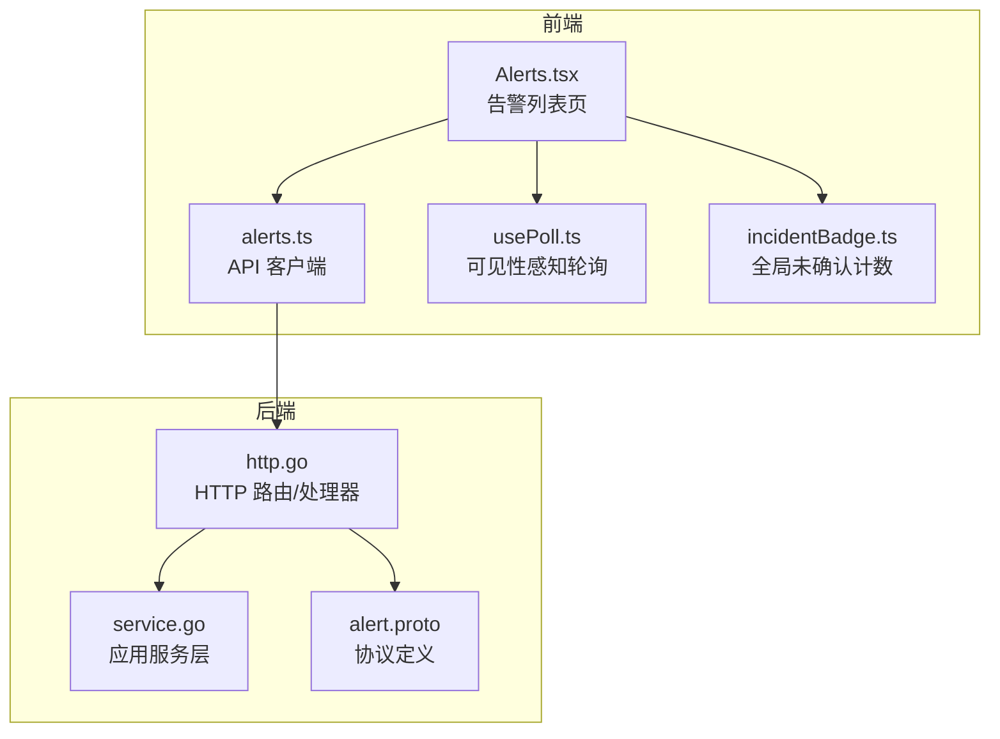
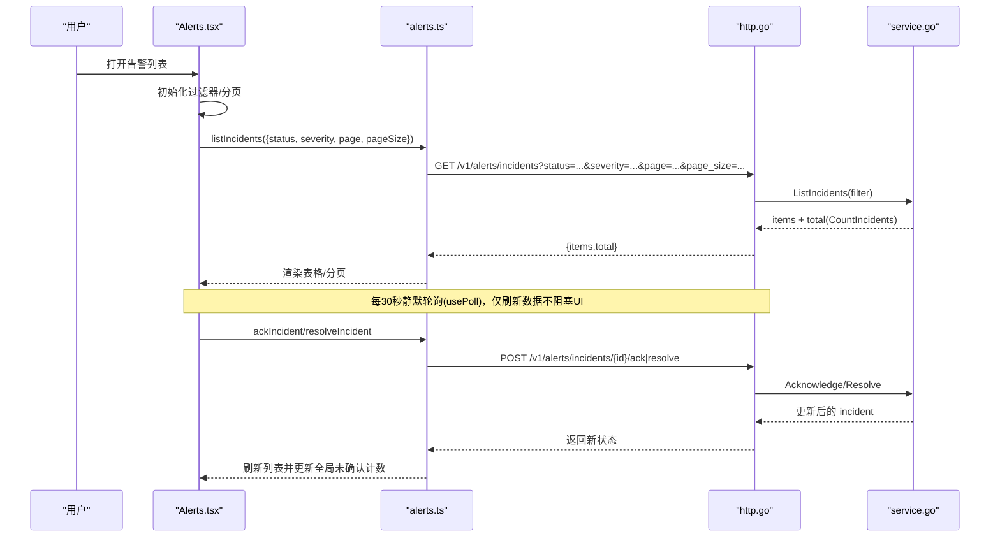
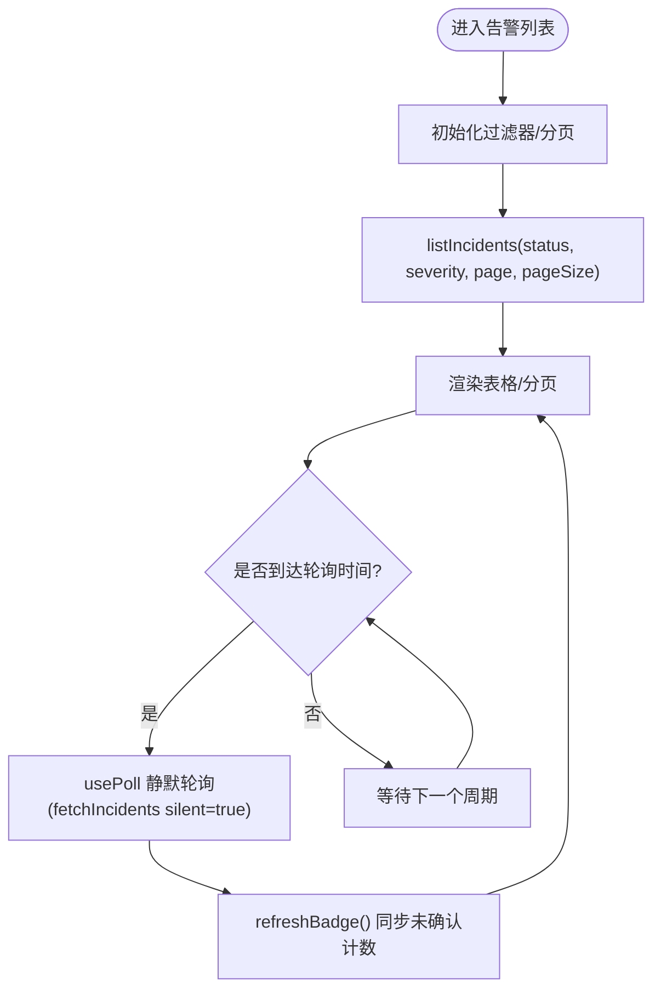
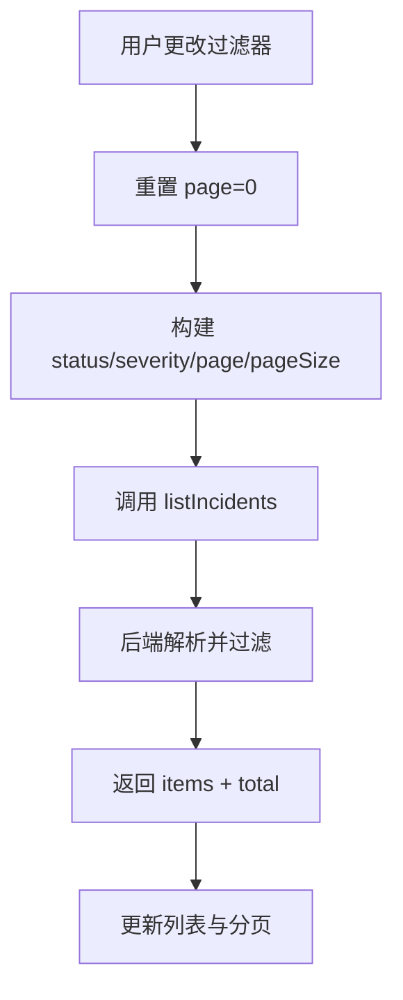
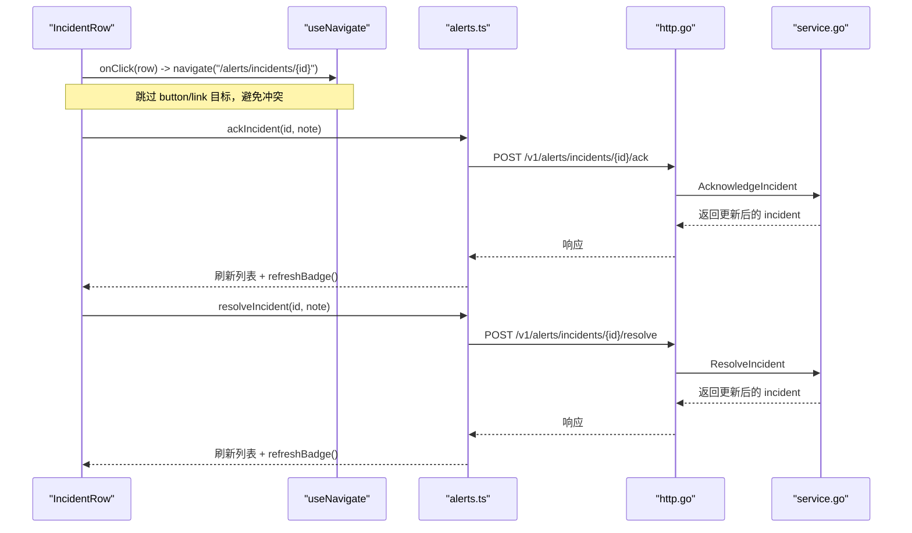
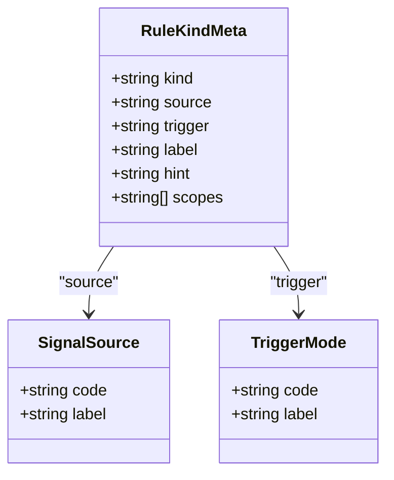
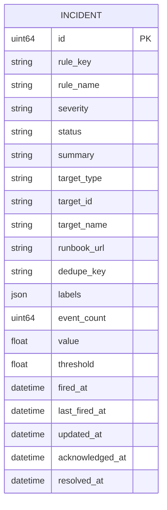
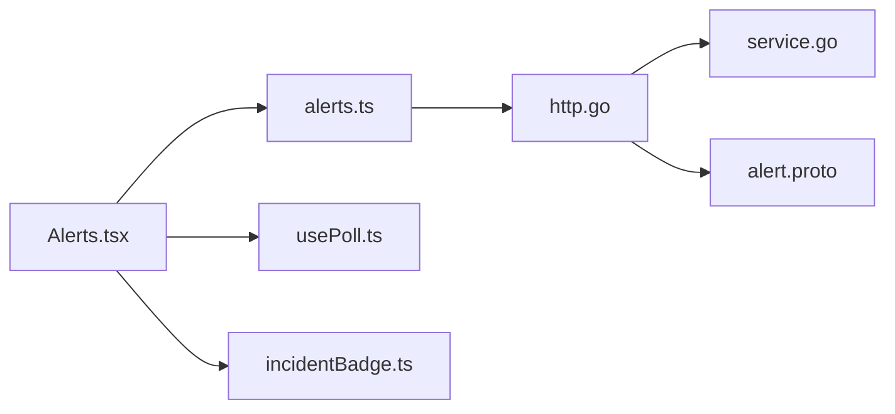

# 告警列表管理

<cite>
**本文引用的文件**
- [Alerts.tsx](file://web/src/pages/Alerts.tsx)
- [alerts.ts](file://web/src/api/alerts.ts)
- [usePoll.ts](file://web/src/lib/usePoll.ts)
- [incidentBadge.ts](file://web/src/store/incidentBadge.ts)
- [alert.proto](file://api/manager/alert/v1/alert.proto)
- [http.go](file://internal/manager/server/alert/http.go)
- [service.go](file://internal/manager/service/alert/service.go)
</cite>

## 目录
1. [简介](#简介)
2. [项目结构](#项目结构)
3. [核心组件](#核心组件)
4. [架构总览](#架构总览)
5. [详细组件分析](#详细组件分析)
6. [依赖关系分析](#依赖关系分析)
7. [性能考量](#性能考量)
8. [故障排查指南](#故障排查指南)
9. [结论](#结论)
10. [附录](#附录)

## 简介
本技术文档围绕“告警列表管理”功能，系统性阐述前端与后端的实现机制与交互流程，重点覆盖：
- 实时获取：轮询策略、分页加载、全局未确认计数同步
- 过滤能力：按状态（未确认、已确认、静默中、已解决）和级别（严重、警告、信息）筛选
- 行级交互：点击跳转详情、批量操作按钮、权限控制
- 扩展点：新增告警类型的显示与处理逻辑
- 性能优化：设备名称缓存、去重机制、内存管理与最佳实践

## 项目结构
该功能横跨前端页面、API 客户端、轮询与状态存储，以及后端 HTTP 服务与应用服务层。整体分层清晰：
- 前端页面：负责 UI、过滤、轮询、分页与交互
- API 客户端：封装 REST 接口调用与类型定义
- 轮询与徽章：轻量轮询 Hook 与全局未确认计数 Store
- 后端服务：HTTP Handler → Service → Usecase/Repo（业务与数据）

**图表来源**
- [Alerts.tsx:1-131](file://web/src/pages/Alerts.tsx#L1-L131)
- [alerts.ts:31-55](file://web/src/api/alerts.ts#L31-L55)
- [usePoll.ts:1-46](file://web/src/lib/usePoll.ts#L1-L46)
- [incidentBadge.ts:1-59](file://web/src/store/incidentBadge.ts#L1-L59)
- [http.go:154-181](file://internal/manager/server/alert/http.go#L154-L181)
- [service.go:240-273](file://internal/manager/service/alert/service.go#L240-L273)
- [alert.proto:9-61](file://api/manager/alert/v1/alert.proto#L9-L61)

**章节来源**
- [Alerts.tsx:1-131](file://web/src/pages/Alerts.tsx#L1-L131)
- [alerts.ts:31-55](file://web/src/api/alerts.ts#L31-L55)
- [usePoll.ts:1-46](file://web/src/lib/usePoll.ts#L1-L46)
- [incidentBadge.ts:1-59](file://web/src/store/incidentBadge.ts#L1-L59)
- [http.go:154-181](file://internal/manager/server/alert/http.go#L154-L181)
- [service.go:240-273](file://internal/manager/service/alert/service.go#L240-L273)
- [alert.proto:9-61](file://api/manager/alert/v1/alert.proto#L9-L61)

## 核心组件
- 告警列表页（Alerts.tsx）
  - 维护状态与级别过滤器、分页、加载与刷新状态
  - 使用 usePoll 每 30 秒静默轮询，避免后台标签页持续请求
  - 通过 listIncidents 拉取分页数据，并触发全局未确认计数刷新
  - 设备名称缓存：一次性拉取设备清单，按 device_id 建立映射，避免重复请求
  - 行级交互：点击行跳转详情；Ack/Resolve 按钮受权限控制（canMutate）
- API 客户端（alerts.ts）
  - 定义 Incident 类型、列表/详情/事件/规则/通道等接口
  - 提供 listIncidents、ackIncident、resolveIncident、silenceIncident 等方法
- 轮询 Hook（usePoll.ts）
  - 基于 document.visibilityState 的可见性感知轮询，切回前台立即补一次
  - 支持启用/禁用开关与间隔调整
- 全局未确认计数（incidentBadge.ts）
  - 独立 Store 每 30 秒查询 open 状态的总数，供侧边栏与页面头部共享
  - 无 token 时自动停止轮询，避免 401 风暴
- 后端 HTTP 服务（http.go）
  - 注册 /v1/alerts/incidents 等路由，解析分页与过滤参数
  - 对变更类接口记录审计日志
- 应用服务（service.go）
  - 将 HTTP DTO 转换为业务输入，调用 Usecase/Repo
  - 提供 ListIncidents、CountIncidents、Acknowledge/Resolve/Silence 等能力

**章节来源**
- [Alerts.tsx:24-131](file://web/src/pages/Alerts.tsx#L24-L131)
- [alerts.ts:6-55](file://web/src/api/alerts.ts#L6-L55)
- [usePoll.ts:1-46](file://web/src/lib/usePoll.ts#L1-L46)
- [incidentBadge.ts:1-59](file://web/src/store/incidentBadge.ts#L1-L59)
- [http.go:254-282](file://internal/manager/server/alert/http.go#L254-L282)
- [service.go:240-395](file://internal/manager/service/alert/service.go#L240-L395)

## 架构总览
以下序列图展示从前端到后端的完整调用链，包括轮询、分页与状态变更。

**图表来源**
- [Alerts.tsx:75-131](file://web/src/pages/Alerts.tsx#L75-L131)
- [alerts.ts:31-55](file://web/src/api/alerts.ts#L31-L55)
- [http.go:254-282](file://internal/manager/server/alert/http.go#L254-L282)
- [service.go:240-343](file://internal/manager/service/alert/service.go#L240-L343)

## 详细组件分析

### 实时获取机制：轮询、分页与状态同步
- 轮询策略
  - 使用 usePoll 每 30 秒执行一次 fetchIncidents({silent:true})，在标签页不可见时暂停，回到前台立即补一次，降低无效开销
  - 首次进入页面或切换过滤器/分页时进行全量刷新
- 分页加载
  - 前端 PAGE_SIZE=50，page 从 0 开始，向后端传递 page+1 与 page_size
  - 后端 http.go 解析 page/page_size，service.go 计算 offset/limit 并返回 items 与 total
- 状态同步
  - 每次 fetch 成功后同时调用 refreshBadge()，保证侧边栏红点与页面头部“未确认”计数一致
  - 全局未确认计数由 incidentBadge.ts 独立轮询 status=open 的 total，避免被当前过滤条件影响

**图表来源**
- [Alerts.tsx:75-131](file://web/src/pages/Alerts.tsx#L75-L131)
- [usePoll.ts:1-46](file://web/src/lib/usePoll.ts#L1-L46)
- [incidentBadge.ts:28-59](file://web/src/store/incidentBadge.ts#L28-L59)
- [http.go:254-282](file://internal/manager/server/alert/http.go#L254-L282)
- [service.go:240-273](file://internal/manager/service/alert/service.go#L240-L273)

**章节来源**
- [Alerts.tsx:75-131](file://web/src/pages/Alerts.tsx#L75-L131)
- [usePoll.ts:1-46](file://web/src/lib/usePoll.ts#L1-L46)
- [incidentBadge.ts:28-59](file://web/src/store/incidentBadge.ts#L28-L59)
- [http.go:254-282](file://internal/manager/server/alert/http.go#L254-L282)
- [service.go:240-273](file://internal/manager/service/alert/service.go#L240-L273)

### 过滤功能：按状态与级别筛选
- 状态过滤：全部、未确认、已确认、静默中、已解决
- 级别过滤：全部、严重、警告、信息
- 行为：切换过滤器会重置 page=0，并重新发起 listIncidents 请求
- 后端支持：http.go 读取 query 中的 status/severity 并透传到 service 层

**图表来源**
- [Alerts.tsx:188-207](file://web/src/pages/Alerts.tsx#L188-L207)
- [alerts.ts:31-39](file://web/src/api/alerts.ts#L31-L39)
- [http.go:254-267](file://internal/manager/server/alert/http.go#L254-L267)

**章节来源**
- [Alerts.tsx:188-207](file://web/src/pages/Alerts.tsx#L188-L207)
- [alerts.ts:31-39](file://web/src/api/alerts.ts#L31-L39)
- [http.go:254-267](file://internal/manager/server/alert/http.go#L254-L267)

### 告警行交互设计：跳转、批量操作与权限控制
- 点击行跳转详情：行内点击导航至 /alerts/incidents/{id}，排除按钮与链接区域
- 操作按钮：
  - Ack：将告警标记为已确认，需 canMutate 且状态为 open，且非忙态
  - Resolve：将告警标记为已解决，需 canMutate 且状态非 resolved
- 权限控制：通过 usePermissions().canMutate 控制可写操作；只读账号无法操作
- 批量操作：当前页面以单行操作为主，可通过扩展选择器实现批量 Ack/Resolve

**图表来源**
- [Alerts.tsx:314-391](file://web/src/pages/Alerts.tsx#L314-L391)
- [alerts.ts:45-55](file://web/src/api/alerts.ts#L45-L55)
- [http.go:458-468](file://internal/manager/server/alert/http.go#L458-L468)
- [service.go:305-343](file://internal/manager/service/alert/service.go#L305-L343)

**章节来源**
- [Alerts.tsx:314-391](file://web/src/pages/Alerts.tsx#L314-L391)
- [alerts.ts:45-55](file://web/src/api/alerts.ts#L45-L55)
- [http.go:458-468](file://internal/manager/server/alert/http.go#L458-L468)
- [service.go:305-343](file://internal/manager/service/alert/service.go#L305-L343)

### 扩展点：新增告警类型的显示与处理逻辑
- 新增 RuleKind（如 metric_threshold/metric_raw/log_search 等）已在 alerts.ts 中集中定义，便于 UI 渲染与表单生成
- localizedRuleName 可将内置 rule_key 映射为本地化名称，用户自定义规则则直接显示 name
- 若需新增一种告警类型：
  - 在 alerts.ts 的 RULE_KINDS/TRIGGER_MODES/SIGNAL_SOURCES 中添加对应元数据
  - 在 Alerts.tsx 的 SeverityBadge/StatusBadge 中确保样式兼容
  - 如需新的过滤维度，可在 AlertFilter 中增加字段并在后端 http.go/service.go 透传
  - 对于预览/试算，参考 previewRule 的调用方式与后端 PreviewRule 能力

**图表来源**
- [alerts.ts:174-266](file://web/src/api/alerts.ts#L174-L266)
- [alerts.ts:293-323](file://web/src/api/alerts.ts#L293-L323)
- [alerts.ts:325-353](file://web/src/api/alerts.ts#L325-L353)

**章节来源**
- [alerts.ts:174-353](file://web/src/api/alerts.ts#L174-L353)

### 数据模型与协议
- 前端 Incident 类型包含 id、rule_key、rule_name、severity、status、summary、target_*、labels、event_count、value、threshold、fired_at、last_fired_at、updated_at、acknowledged_at、resolved_at 等字段
- 后端 proto 定义了 AlertIncident、ListIncidentsRequest/Response、Acknowledge/Resolve 等消息
- 服务层 DTO 与模型之间进行转换，确保传输安全与可读性

**图表来源**
- [alerts.ts:6-27](file://web/src/api/alerts.ts#L6-L27)
- [alert.proto:31-61](file://api/manager/alert/v1/alert.proto#L31-L61)
- [service.go:35-56](file://internal/manager/service/alert/service.go#L35-L56)

**章节来源**
- [alerts.ts:6-27](file://web/src/api/alerts.ts#L6-L27)
- [alert.proto:31-61](file://api/manager/alert/v1/alert.proto#L31-L61)
- [service.go:35-56](file://internal/manager/service/alert/service.go#L35-L56)

## 依赖关系分析
- 前端依赖
  - Alerts.tsx 依赖 alerts.ts 的 API 方法、usePoll 的轮询能力、incidentBadge 的全局计数
  - 设备名称缓存依赖 edges API（listEdges），用于 Target 列的名称解析
- 后端依赖
  - http.go 依赖 service.go 提供的 IncidentService/ChannelService/RuleService
  - service.go 依赖 biz/alert 的 Usecase 与 Repo（业务与数据访问）
  - 协议层 alert.proto 定义前后端契约

**图表来源**
- [Alerts.tsx:1-131](file://web/src/pages/Alerts.tsx#L1-L131)
- [alerts.ts:31-55](file://web/src/api/alerts.ts#L31-L55)
- [http.go:154-181](file://internal/manager/server/alert/http.go#L154-L181)
- [service.go:240-273](file://internal/manager/service/alert/service.go#L240-L273)
- [alert.proto:9-61](file://api/manager/alert/v1/alert.proto#L9-L61)

**章节来源**
- [Alerts.tsx:1-131](file://web/src/pages/Alerts.tsx#L1-L131)
- [alerts.ts:31-55](file://web/src/api/alerts.ts#L31-L55)
- [http.go:154-181](file://internal/manager/server/alert/http.go#L154-L181)
- [service.go:240-273](file://internal/manager/service/alert/service.go#L240-L273)
- [alert.proto:9-61](file://api/manager/alert/v1/alert.proto#L9-L61)

## 性能考量
- 设备名称缓存
  - 页面初始化时一次性拉取设备清单，按 device_id 建立映射，避免每行单独请求
  - 注意键空间隔离：仅以 device_id 作为 key，防止 edge.id 与 device_id 混用导致交叉污染
- 去重机制
  - 后端通过 dedupe_key 与 incident 聚合减少重复告警噪音
  - 前端在渲染时避免重复 DOM 节点（key 使用 incident.id）
- 内存管理
  - 使用 useMemo 计算 counts（total/open/critical），避免重复计算
  - usePoll 在标签页不可见时暂停轮询，减少无效网络请求
  - 错误提示与 loading 状态及时清理，避免残留 UI 状态
- 分页与总量
  - 后端 CountIncidents 返回真实 total，即使 page_size=1 也能准确统计未确认数量
  - 前端 PAGE_SIZE=50，平衡了首屏加载与滚动体验

**章节来源**
- [Alerts.tsx:55-73](file://web/src/pages/Alerts.tsx#L55-L73)
- [Alerts.tsx:106-126](file://web/src/pages/Alerts.tsx#L106-L126)
- [Alerts.tsx:133-142](file://web/src/pages/Alerts.tsx#L133-L142)
- [usePoll.ts:1-46](file://web/src/lib/usePoll.ts#L1-L46)
- [incidentBadge.ts:28-59](file://web/src/store/incidentBadge.ts#L28-L59)
- [http.go:254-282](file://internal/manager/server/alert/http.go#L254-L282)

## 故障排查指南
- 加载失败
  - 前端捕获 ApiError 并展示错误信息；检查网络与鉴权状态
- 轮询不生效
  - 检查 usePoll 的 enabled 与 intervalMs；确认标签页可见性
- 未确认计数不同步
  - 确认 refreshBadge() 在 fetch 与 ack/resolve 后均被调用
  - 检查 incidentBadge 的 token 状态，无 token 时轮询会自动停止
- 设备名称显示异常
  - 检查 listEdges 是否成功；确认 deviceNames 映射以 device_id 为 key
- 后端接口报错
  - 查看 http.go 的错误处理与审计日志；确认 service 层参数校验

**章节来源**
- [Alerts.tsx:94-101](file://web/src/pages/Alerts.tsx#L94-L101)
- [Alerts.tsx:106-126](file://web/src/pages/Alerts.tsx#L106-L126)
- [incidentBadge.ts:33-42](file://web/src/store/incidentBadge.ts#L33-L42)
- [http.go:254-282](file://internal/manager/server/alert/http.go#L254-L282)

## 结论
告警列表管理通过清晰的前后端分层与职责划分，实现了高效的实时获取、灵活的过滤与安全的交互。借助设备名称缓存、去重机制与可见性感知的轮询策略，系统在用户体验与资源消耗之间取得良好平衡。未来可按需扩展 RuleKind 与过滤维度，并通过统一的服务层接口保持扩展性与一致性。

## 附录
- 关键 API 路径
  - GET /v1/alerts/incidents：列表与分页
  - GET /v1/alerts/incidents/{id}：详情
  - POST /v1/alerts/incidents/{id}/ack：确认
  - POST /v1/alerts/incidents/{id}/resolve：解决
  - POST /v1/alerts/incidents/{id}/silence：静默
  - GET /v1/alerts/runtime-info：运行时信息（评估间隔、通知冷却）

**章节来源**
- [http.go:154-181](file://internal/manager/server/alert/http.go#L154-L181)
- [alerts.ts:31-55](file://web/src/api/alerts.ts#L31-L55)
- [alerts.ts:514-524](file://web/src/api/alerts.ts#L514-L524)