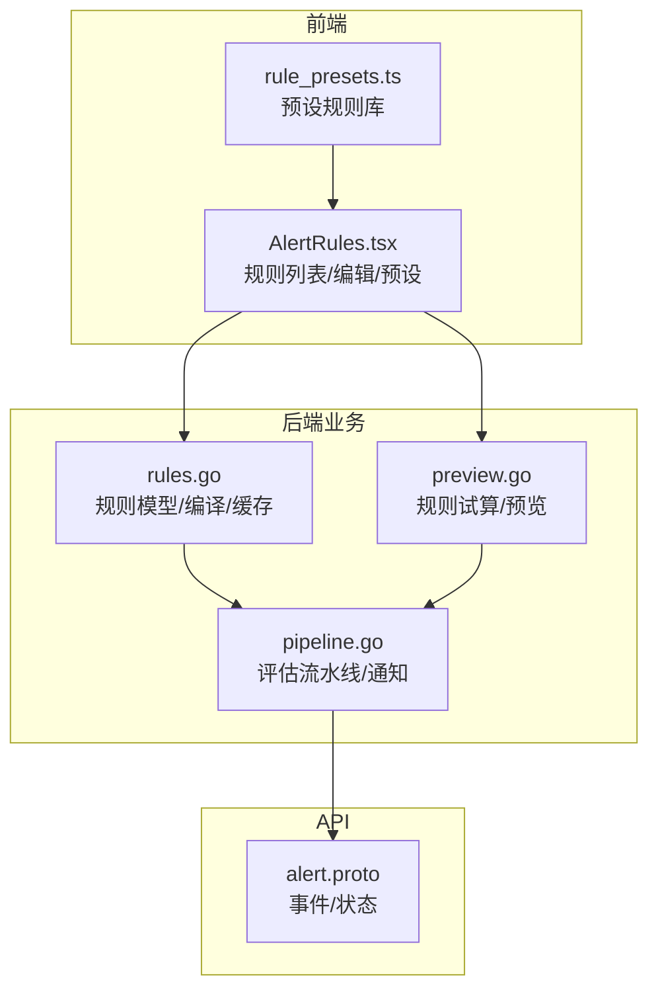
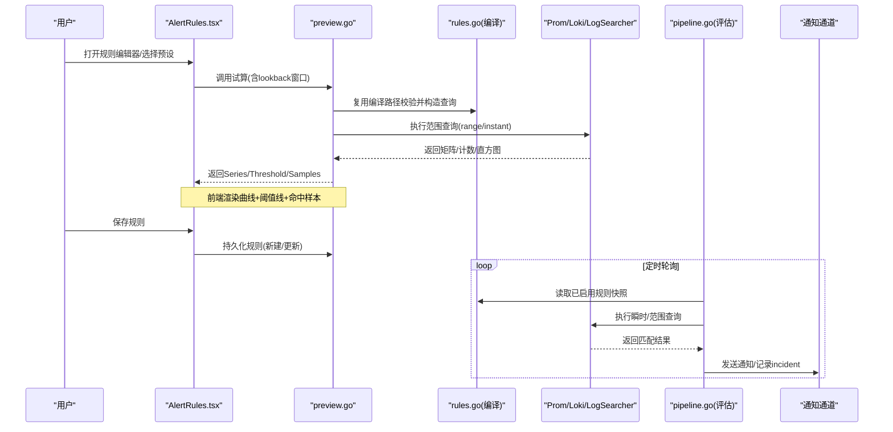
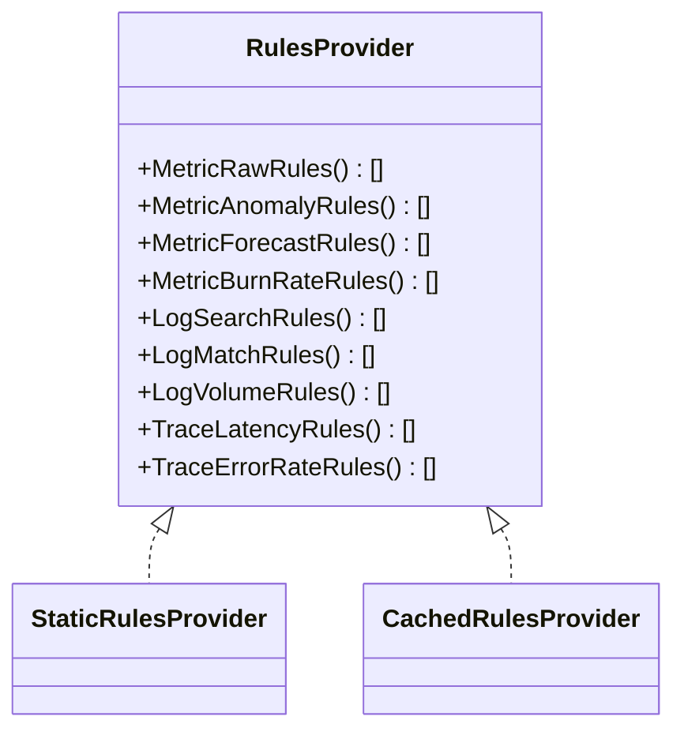
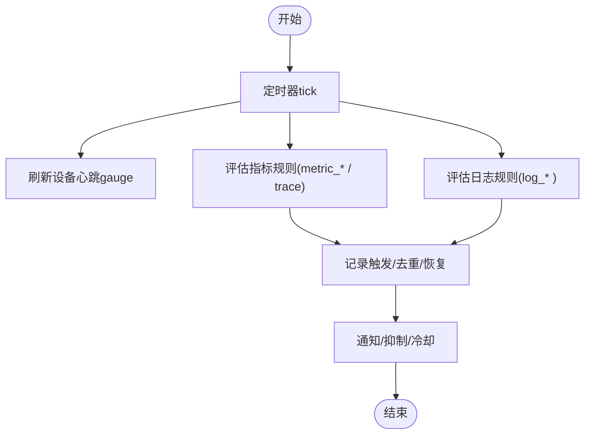
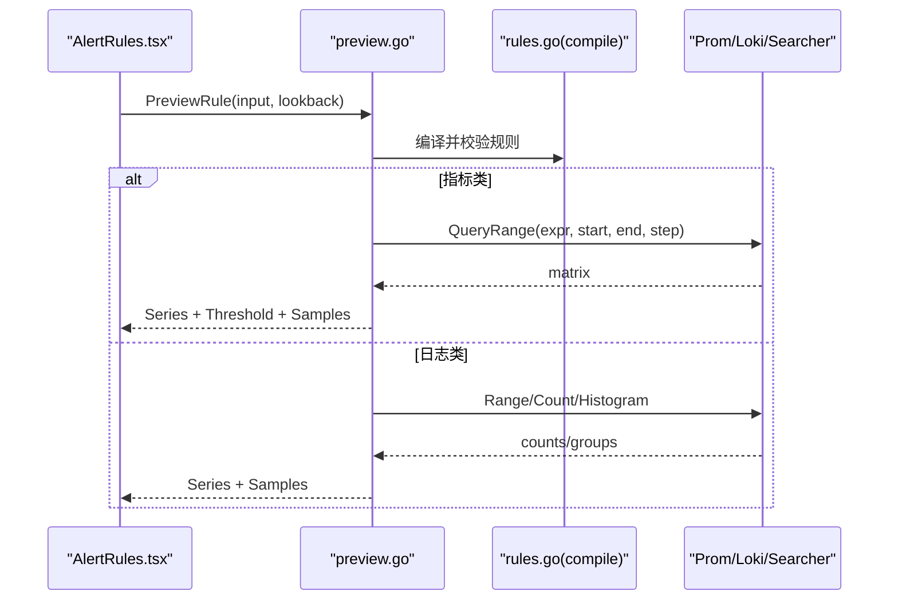
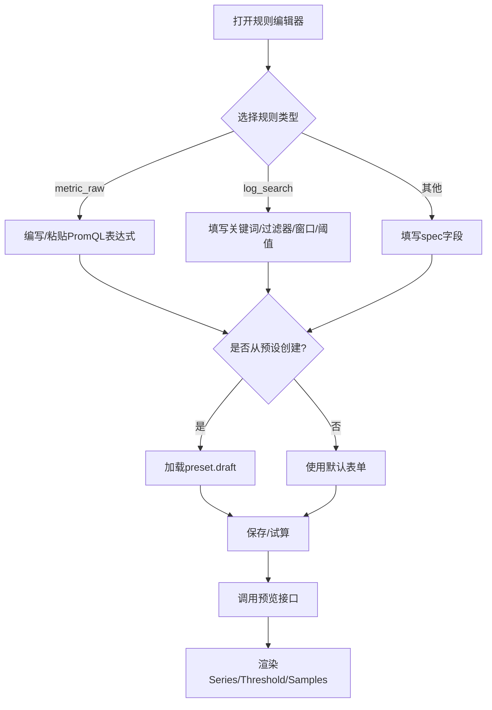
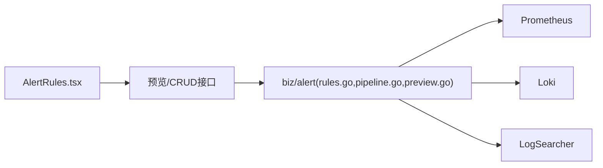

# 告警规则配置

<cite>
**本文引用的文件**
- [alert.proto](file://api/manager/alert/v1/alert.proto)
- [rules.go](file://internal/manager/biz/alert/rules.go)
- [pipeline.go](file://internal/manager/biz/alert/pipeline.go)
- [preview.go](file://internal/manager/biz/alert/preview.go)
- [AlertRules.tsx](file://web/src/pages/AlertRules.tsx)
- [rule_presets.ts](file://web/src/lib/rule_presets.ts)
</cite>

## 目录
1. [简介](#简介)
2. [项目结构](#项目结构)
3. [核心组件](#核心组件)
4. [架构总览](#架构总览)
5. [详细组件分析](#详细组件分析)
6. [依赖关系分析](#依赖关系分析)
7. [性能考量](#性能考量)
8. [故障排查指南](#故障排查指南)
9. [结论](#结论)
10. [附录](#附录)

## 简介
本技术文档围绕“告警规则配置”能力，系统阐述可视化规则编辑界面的实现原理与后端评估管线。重点覆盖：
- 条件表达式构建器（PromQL 表达式、结构化日志查询）
- PromQL 查询编辑器与时间范围选择器
- 规则模板系统（预设规则库、自定义模板创建、继承机制）
- 规则测试验证（模拟数据生成、查询结果预览、阈值测试）
- 新增规则类型与验证逻辑的开发示例
- 用户体验优化（语法高亮、错误提示、智能补全）

## 项目结构
本项目将告警规则能力拆分为前后端协同：
- 前端页面与交互：在 web 层提供规则列表、编辑弹窗、预设模板选择、试算预览等
- 后端规则编译与执行：biz 层负责规则模型、编译、缓存、评估流水线、预览接口
- API 契约：proto 定义事件与状态枚举，用于告警事件管理

图表来源
- [AlertRules.tsx:186-449](file://web/src/pages/AlertRules.tsx#L186-L449)
- [rule_presets.ts:55-416](file://web/src/lib/rule_presets.ts#L55-L416)
- [rules.go:213-518](file://internal/manager/biz/alert/rules.go#L213-L518)
- [pipeline.go:96-224](file://internal/manager/biz/alert/pipeline.go#L96-L224)
- [preview.go:96-155](file://internal/manager/biz/alert/preview.go#L96-L155)
- [alert.proto:9-29](file://api/manager/alert/v1/alert.proto#L9-L29)

章节来源
- [AlertRules.tsx:186-449](file://web/src/pages/AlertRules.tsx#L186-L449)
- [rule_presets.ts:55-416](file://web/src/lib/rule_presets.ts#L55-L416)
- [rules.go:213-518](file://internal/manager/biz/alert/rules.go#L213-L518)
- [pipeline.go:96-224](file://internal/manager/biz/alert/pipeline.go#L96-L224)
- [preview.go:96-155](file://internal/manager/biz/alert/preview.go#L96-L155)
- [alert.proto:9-29](file://api/manager/alert/v1/alert.proto#L9-L29)

## 核心组件
- 规则模型与编译：集中定义 metric/log/trace 等多类规则的运行时结构，并提供 per-kind 的 compile 函数，完成参数校验、默认值填充与规范化
- 规则提供者与缓存：提供静态快照与周期性刷新机制，保证评估期读取无锁且一致
- 评估流水线：按固定间隔对各类规则进行查询与判定，记录触发、去重、恢复、通知
- 预览与试算：复用编译路径，在不落库的前提下对历史窗口进行回放，返回系列曲线、阈值参考与命中样本
- 前端编辑器：提供规则表单、PromQL 表达式输入、时间窗口展示、预设模板快速创建、试算结果可视化

章节来源
- [rules.go:29-236](file://internal/manager/biz/alert/rules.go#L29-L236)
- [rules.go:238-518](file://internal/manager/biz/alert/rules.go#L238-L518)
- [pipeline.go:96-224](file://internal/manager/biz/alert/pipeline.go#L96-L224)
- [preview.go:18-155](file://internal/manager/biz/alert/preview.go#L18-L155)
- [AlertRules.tsx:186-449](file://web/src/pages/AlertRules.tsx#L186-L449)

## 架构总览
从用户操作到告警触发的端到端流程如下：

图表来源
- [AlertRules.tsx:733-767](file://web/src/pages/AlertRules.tsx#L733-L767)
- [preview.go:96-155](file://internal/manager/biz/alert/preview.go#L96-L155)
- [rules.go:384-518](file://internal/manager/biz/alert/rules.go#L384-L518)
- [pipeline.go:172-224](file://internal/manager/biz/alert/pipeline.go#L172-L224)

## 详细组件分析

### 规则模型与编译（多类型支持）
- 支持的规则种类包括：
  - 指标类：metric_raw、metric_anomaly、metric_forecast、metric_burn_rate
  - 日志类：log_search、log_match、log_volume
  - 链路类：trace_latency、trace_error_rate
- 每种规则都有对应的 spec 结构与 compile 函数，负责：
  - 必填字段校验（如 rule_key、metric/window/operator/threshold）
  - 默认值填充（baseline_window、baseline_step、deviation 等）
  - 规范化处理（SLI 表达式归一、SLO 百分比归一、host operator 白名单）
- 规则提供者：
  - StaticRulesProvider：测试或嵌入式部署使用
  - CachedRulesProvider：周期刷新数据库中的启用规则，原子替换快照，避免并发读脏数据

图表来源
- [rules.go:213-331](file://internal/manager/biz/alert/rules.go#L213-L331)
- [rules.go:333-518](file://internal/manager/biz/alert/rules.go#L333-L518)

章节来源
- [rules.go:29-236](file://internal/manager/biz/alert/rules.go#L29-L236)
- [rules.go:238-518](file://internal/manager/biz/alert/rules.go#L238-L518)

### 评估流水线（PipelineEvaluator）
- 定时 tick 驱动，依次评估 metric/log/trace 各类型规则
- metric_raw：直接执行 PromQL 瞬时查询，返回向量即谓词满足；通过上一 tick 快照对比实现自动恢复
- metric_anomaly/forecast/burn_rate：基于 range 查询计算基线/预测/燃烧率，判定是否越界
- log_match/log_volume：基于 Loki 的 count_over_time 统计窗口内命中数
- log_search：基于后端无关的 Searcher 进行结构化日志计数/分组
- 设备离线信号：通过刷新 device_last_seen_seconds_ago gauge，使 metric_raw 可表达“主机离线”场景

图表来源
- [pipeline.go:172-224](file://internal/manager/biz/alert/pipeline.go#L172-L224)
- [pipeline.go:226-280](file://internal/manager/biz/alert/pipeline.go#L226-L280)
- [pipeline.go:282-408](file://internal/manager/biz/alert/pipeline.go#L282-L408)

章节来源
- [pipeline.go:96-224](file://internal/manager/biz/alert/pipeline.go#L96-L224)
- [pipeline.go:226-408](file://internal/manager/biz/alert/pipeline.go#L226-L408)

### 预览与试算（PreviewRule）
- 入口统一：PreviewRule 接收 RuleInput 与 lookback 秒数，复用 buildRuleRow 与 per-kind 编译路径
- 不持久化：仅做只读回放，返回 Series（时间序列）、Threshold（阈值参考）、Samples（最近命中样本）
- 多后端适配：
  - Prom：walkPromMatrix 遍历矩阵，选择代表性 series 绘制曲线
  - Loki：walkLokiMatrix 统计窗口计数
  - LogSearch：Histogram/CountGrouped 聚合结构化日志
- 异常与跳过：当客户端未配置或数据缺失时返回 skipped_reason，便于前端提示

图表来源
- [preview.go:96-155](file://internal/manager/biz/alert/preview.go#L96-L155)
- [preview.go:261-437](file://internal/manager/biz/alert/preview.go#L261-L437)
- [preview.go:463-791](file://internal/manager/biz/alert/preview.go#L463-L791)

章节来源
- [preview.go:18-155](file://internal/manager/biz/alert/preview.go#L18-L155)
- [preview.go:261-437](file://internal/manager/biz/alert/preview.go#L261-L437)
- [preview.go:463-791](file://internal/manager/biz/alert/preview.go#L463-L791)

### 前端编辑器与模板系统
- 规则列表与编辑：
  - 列表展示来源、类型、规则键/名称、范围、级别、条件摘要、状态
  - 编辑弹窗支持 kind 切换、scope/severity/条件/spec 配置、运行手册链接、通知通道
- 预设规则库：
  - 按“平台健康/主机/网络/应用/日志”分组，提供建议 rule_key、表达式预览、说明文案
  - 一键创建：将 preset.draft 合并为初始表单，用户微调后保存
- 时间范围与窗口：
  - metric_raw 的窗口以 PromQL 表达式内的 [Xm] 形式存在，前端解析并以 chip 展示
  - 试算支持 1 小时至 7 天回看，内部限制点数与下采样

图表来源
- [AlertRules.tsx:186-449](file://web/src/pages/AlertRules.tsx#L186-L449)
- [AlertRules.tsx:733-767](file://web/src/pages/AlertRules.tsx#L733-L767)
- [rule_presets.ts:55-416](file://web/src/lib/rule_presets.ts#L55-L416)

章节来源
- [AlertRules.tsx:186-449](file://web/src/pages/AlertRules.tsx#L186-L449)
- [rule_presets.ts:55-416](file://web/src/lib/rule_presets.ts#L55-L416)

### 开发示例：新增规则类型与验证逻辑
- 后端新增步骤（以新增 kind=example_rule 为例）：
  1. 在 rules.go 中定义 ExampleRule 结构与 exampleSpec
  2. 实现 compileExampleRule(r *model.Rule) 完成校验与默认值填充
  3. 在 CachedRulesProvider.Refresh 的 switch 分支中添加新 kind 的编译与追加
  4. 在 PipelineEvaluator.evaluate 中增加 evaluateExampleRule(ctx, now) 调用
  5. 在 preview.go 中实现 previewExampleRule，复用 walkPromMatrix/walkLokiMatrix 或 Searcher
  6. 在前端 AlertRules.tsx 中扩展 RULE_KINDS/RULE_PRESETS，并在 summarizeRule 中补充摘要
- 验证逻辑要点：
  - 编译阶段严格校验必填字段与取值范围
  - 评估阶段对空结果/错误进行安全降级，不影响整体循环
  - 预览阶段在未配置客户端时返回 skipped_reason，引导用户补齐环境

章节来源
- [rules.go:384-518](file://internal/manager/biz/alert/rules.go#L384-L518)
- [pipeline.go:172-224](file://internal/manager/biz/alert/pipeline.go#L172-L224)
- [preview.go:96-155](file://internal/manager/biz/alert/preview.go#L96-L155)
- [AlertRules.tsx:579-655](file://web/src/pages/AlertRules.tsx#L579-L655)

### 用户体验优化方案
- 语法高亮与错误提示：
  - PromQL 编辑器建议使用具备语法高亮的代码编辑器组件，结合 promql 校验库进行实时检查
  - 预览失败时显示 skipped_reason，定位缺失的后端客户端或缺失的数据源
- 智能补全：
  - 指标名/标签补全：通过查询 Prometheus 元数据接口，动态注入 suggest
  - 日志字段补全：基于当前后端索引字段或样例日志提取字段集合
- 时间范围选择器：
  - metric_raw 表达式内嵌窗口，前端解析并展示为 chip，降低理解成本
  - 试算窗口提供快捷选项（如 1h/6h/24h/7d），并限制最大点数与下采样策略

章节来源
- [AlertRules.tsx:81-132](file://web/src/pages/AlertRules.tsx#L81-L132)
- [preview.go:65-73](file://internal/manager/biz/alert/preview.go#L65-L73)
- [preview.go:248-259](file://internal/manager/biz/alert/preview.go#L248-L259)

## 依赖关系分析
- 模块耦合：
  - 前端依赖 API 与预览接口，不感知具体查询语言
  - 后端 biz 层解耦数据源（Prom/Loki/Searcher），通过接口抽象
  - 规则编译与评估分离，预览复用编译路径，保证一致性
- 外部依赖：
  - Prometheus：指标查询（instant/matrix）
  - Loki：日志范围查询与计数
  - 日志搜索后端：结构化日志的 histogram/grouped count
- 潜在循环依赖：
  - 通过接口隔离（PromQuerier/LogQuerier/Searcher）避免循环引用

图表来源
- [pipeline.go:35-94](file://internal/manager/biz/alert/pipeline.go#L35-L94)
- [preview.go:75-94](file://internal/manager/biz/alert/preview.go#L75-L94)

章节来源
- [pipeline.go:35-94](file://internal/manager/biz/alert/pipeline.go#L35-L94)
- [preview.go:75-94](file://internal/manager/biz/alert/preview.go#L75-L94)

## 性能考量
- 评估间隔与冷却：
  - 评估间隔默认 5 分钟，通知冷却默认 10 分钟，可通过环境变量覆盖
- 数据量控制：
  - 预览返回最多 1500 个点，超出则均匀下采样，保留末尾点
- 查询策略：
  - metric_raw 使用瞬时查询，减少带宽与内存占用
  - log_match/log_volume 使用紧窗口（如 5s）近似瞬时计数
- 恢复检测：
  - 通过上一 tick 的 firingSnapshot 对比，自动 resolve 已恢复的 incident

章节来源
- [pipeline.go:139-170](file://internal/manager/biz/alert/pipeline.go#L139-L170)
- [preview.go:65-73](file://internal/manager/biz/alert/preview.go#L65-L73)
- [preview.go:420-437](file://internal/manager/biz/alert/preview.go#L420-L437)
- [pipeline.go:383-408](file://internal/manager/biz/alert/pipeline.go#L383-L408)

## 故障排查指南
- 预览被跳过：
  - 检查 skipped_reason，常见原因：Prom/Loki/LogSearcher 未配置、数据缺失、kind 不支持预览
- 规则不触发：
  - 确认表达式/过滤条件是否正确；查看预览 Series 与 Threshold 是否匹配
  - 检查 scope_type 与 labels 是否符合预期（如 host 规则需携带 device_id）
- 误报/漏报：
  - 调整 baseline_window、deviation、predict_seconds、window、threshold 等参数
  - 对于 burn_rate，核对 SLI 表达式与 SLO 百分比、burn windows 与 multiplier
- 通知问题：
  - 检查通知通道配置、severity/scope 过滤、冷却时间

章节来源
- [preview.go:157-246](file://internal/manager/biz/alert/preview.go#L157-L246)
- [preview.go:545-588](file://internal/manager/biz/alert/preview.go#L545-L588)
- [pipeline.go:410-461](file://internal/manager/biz/alert/pipeline.go#L410-L461)

## 结论
本方案通过“规则编译—缓存—评估—预览”的分层设计，实现了多源多类型的告警规则配置与执行。前端提供直观的可视化编辑与模板化创建，后端确保稳定高效的评估与通知。通过预览与下采样、冷却与恢复机制，兼顾了易用性与性能。新增规则类型遵循统一的编译与评估范式，易于扩展与维护。

## 附录
- API 契约：事件与状态枚举定义见 alert.proto
- 内置规则：部分内置规则由迁移脚本重写为 metric_raw，保持行为一致

章节来源
- [alert.proto:16-29](file://api/manager/alert/v1/alert.proto#L16-L29)