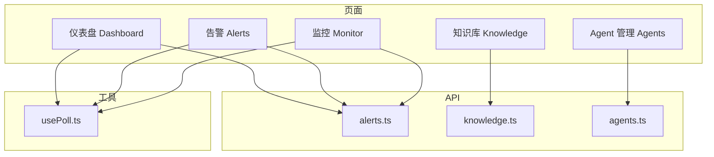
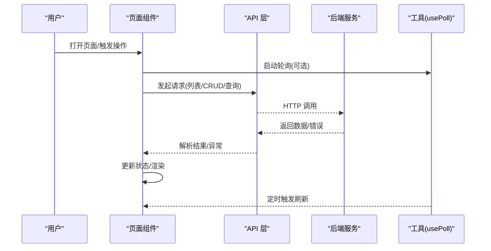
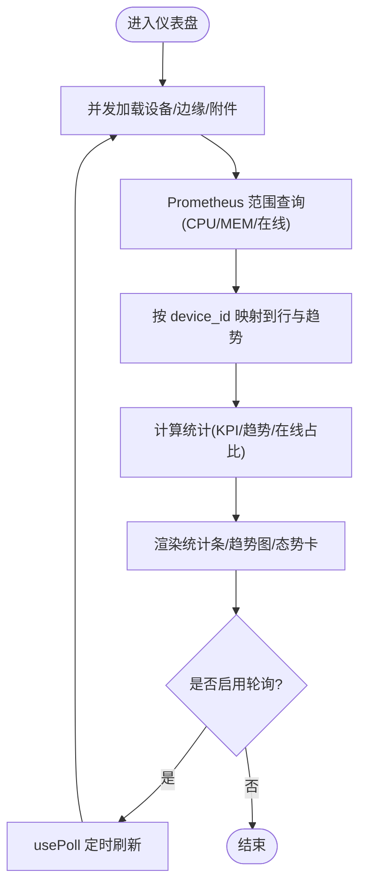
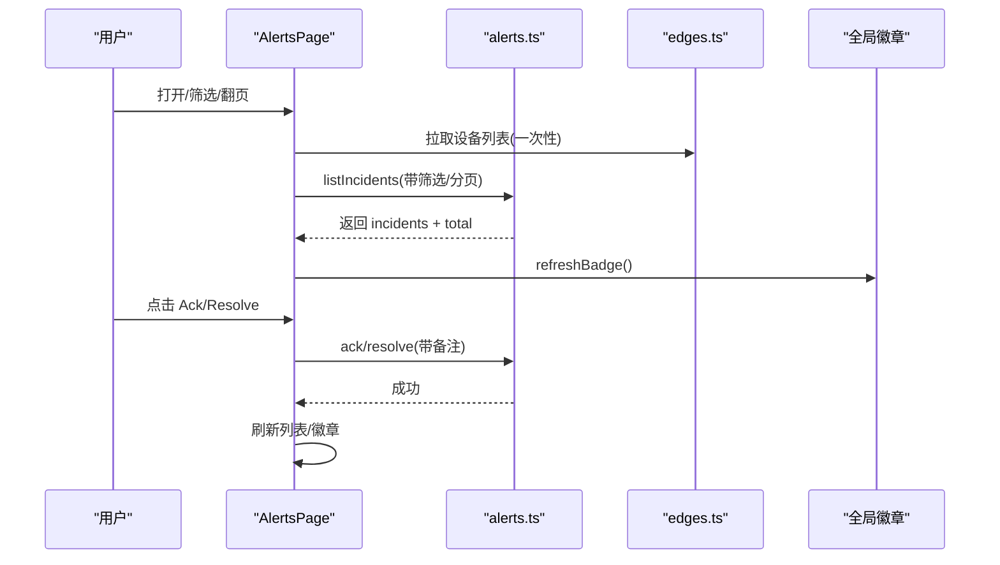
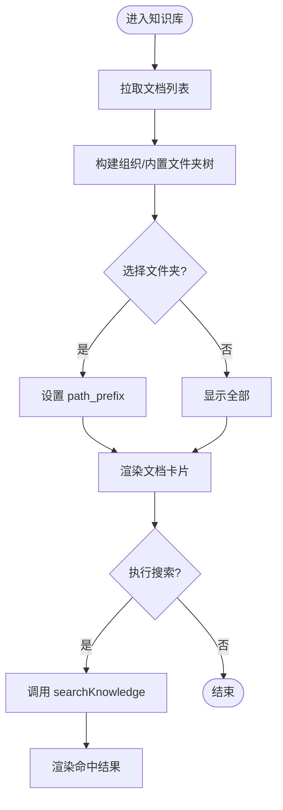
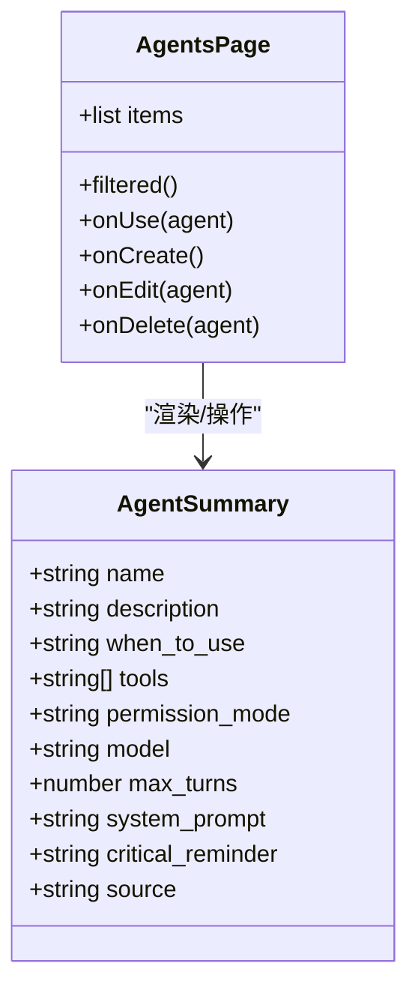
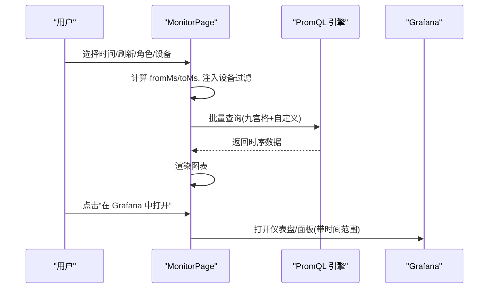
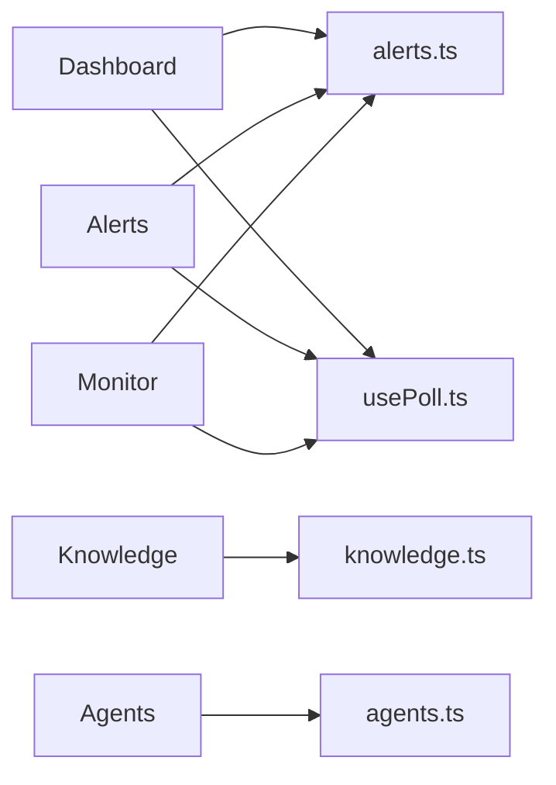

# 核心页面功能

<cite>
**本文引用的文件**
- [Dashboard.tsx](file://web/src/pages/Dashboard.tsx)
- [Alerts.tsx](file://web/src/pages/Alerts.tsx)
- [Knowledge.tsx](file://web/src/pages/Knowledge.tsx)
- [Agents.tsx](file://web/src/pages/Agents.tsx)
- [Monitor.tsx](file://web/src/pages/Monitor.tsx)
- [alerts.ts](file://web/src/api/alerts.ts)
- [knowledge.ts](file://web/src/api/knowledge.ts)
- [agents.ts](file://web/src/api/agents.ts)
- [usePoll.ts](file://web/src/lib/usePoll.ts)
</cite>

## 目录
1. [简介](#简介)
2. [项目结构](#项目结构)
3. [核心组件](#核心组件)
4. [架构总览](#架构总览)
5. [详细组件分析](#详细组件分析)
6. [依赖关系分析](#依赖关系分析)
7. [性能考量](#性能考量)
8. [故障排查指南](#故障排查指南)
9. [结论](#结论)
10. [附录](#附录)

## 简介
本技术文档聚焦于前端核心页面的业务逻辑与界面实现，覆盖仪表盘、告警中心、知识库、Agent 管理界面与集群监控五大模块。文档从组件结构、数据流、用户交互、复杂场景（实时刷新、批量操作、状态同步）到扩展实践与性能优化进行系统化说明，帮助开发者快速理解并安全地扩展现有功能或新增页面。

## 项目结构
- 页面层：位于 web/src/pages，按功能划分独立 React 页面组件。
- API 层：位于 web/src/api，封装后端接口调用与类型定义。
- 通用能力：位于 web/src/lib，提供轮询、路由、PromQL 注入等工具。
- 组件层：位于 web/src/components，提供可复用 UI 与业务组件。

图表来源
- [Dashboard.tsx:1-120](file://web/src/pages/Dashboard.tsx#L1-L120)
- [Alerts.tsx:1-120](file://web/src/pages/Alerts.tsx#L1-L120)
- [Knowledge.tsx:1-120](file://web/src/pages/Knowledge.tsx#L1-L120)
- [Agents.tsx:1-120](file://web/src/pages/Agents.tsx#L1-L120)
- [Monitor.tsx:1-120](file://web/src/pages/Monitor.tsx#L1-L120)
- [alerts.ts:1-120](file://web/src/api/alerts.ts#L1-L120)
- [knowledge.ts:1-120](file://web/src/api/knowledge.ts#L1-L120)
- [agents.ts:1-120](file://web/src/api/agents.ts#L1-L120)
- [usePoll.ts:1-46](file://web/src/lib/usePoll.ts#L1-L46)

章节来源
- [Dashboard.tsx:1-120](file://web/src/pages/Dashboard.tsx#L1-L120)
- [Alerts.tsx:1-120](file://web/src/pages/Alerts.tsx#L1-L120)
- [Knowledge.tsx:1-120](file://web/src/pages/Knowledge.tsx#L1-L120)
- [Agents.tsx:1-120](file://web/src/pages/Agents.tsx#L1-L120)
- [Monitor.tsx:1-120](file://web/src/pages/Monitor.tsx#L1-L120)
- [usePoll.ts:1-46](file://web/src/lib/usePoll.ts#L1-L46)

## 核心组件
- 仪表盘：聚合设备在线数、CPU/MEM 趋势、LLM 用量、会话统计与活跃告警；通过 Prometheus 查询范围数据绘制趋势图，支持钻取到具体设备的指标详情。
- 告警中心：分页展示事件列表，支持状态/级别筛选、确认与解决操作，维护全局未确认计数并与侧边栏红点同源。
- 知识库：组织与内置双树视图，支持搜索、上传、新建、移动、删除文档；内置库可从云端或离线源同步。
- Agent 管理：列出系统内置、预置与自定义助理，支持查看、编辑、复制为自定义、删除与一键开启新会话。
- 监控：内置九宫格核心面板（CPU/内存/磁盘/网络/进程/负载/IO/conntrack/TCP），支持时间范围、自动刷新、角色/设备过滤，并可添加自定义 PromQL 面板。

章节来源
- [Dashboard.tsx:48-461](file://web/src/pages/Dashboard.tsx#L48-L461)
- [Alerts.tsx:42-287](file://web/src/pages/Alerts.tsx#L42-L287)
- [Knowledge.tsx:96-525](file://web/src/pages/Knowledge.tsx#L96-L525)
- [Agents.tsx:52-211](file://web/src/pages/Agents.tsx#L52-L211)
- [Monitor.tsx:276-651](file://web/src/pages/Monitor.tsx#L276-L651)

## 架构总览
各页面遵循统一的数据流模式：页面组件负责状态与交互，API 层封装请求与类型，工具层提供轮询与公共能力。关键流程如下：

图表来源
- [Dashboard.tsx:75-236](file://web/src/pages/Dashboard.tsx#L75-L236)
- [Alerts.tsx:75-131](file://web/src/pages/Alerts.tsx#L75-L131)
- [Monitor.tsx:396-418](file://web/src/pages/Monitor.tsx#L396-L418)
- [usePoll.ts:20-45](file://web/src/lib/usePoll.ts#L20-L45)

## 详细组件分析

### 仪表盘（Dashboard）
- 组件结构
  - 顶部统计条：在线设备、过去24h平均CPU/MEM、今日LLM token、本周会话数。
  - 主趋势区：24小时集群趋势（CPU/MEM/在线数）与集群态势卡片（在线比例、角色分布）。
  - 问题区：告警严重度分布与高频规则提示。
- 数据流
  - 并发拉取设备列表、边缘节点、K8s 附件，计算可见设备子集。
  - 使用 Prometheus 范围查询获取 CPU/MEM/在线数历史，按 device_id 分组后映射到表格行与趋势图。
  - 会话与告警列表分别拉取，用于统计与“最近会话”“活跃告警”展示。
  - 使用 usePoll 周期性刷新，保持数据新鲜。
- 交互逻辑
  - 点击某行 CPU 指标可钻取到该设备的 Prometheus 图表。
  - 手动刷新按钮与自动轮询并存，显示上次刷新时间与刷新中状态。
- 复杂场景
  - 多源数据合并：设备、Prometheus、会话、告警、用量等多接口并行请求与错误隔离。
  - 趋势聚合：将多设备时序数据按时间桶聚合，计算平均值与峰值。
- 性能要点
  - 一次 PromQL 范围查询按 metric 维度拉取矩阵，避免 N 次单设备请求。
  - 仅对可见设备计算趋势，减少无用计算。

图表来源
- [Dashboard.tsx:75-236](file://web/src/pages/Dashboard.tsx#L75-L236)
- [Dashboard.tsx:243-286](file://web/src/pages/Dashboard.tsx#L243-L286)
- [Dashboard.tsx:293-309](file://web/src/pages/Dashboard.tsx#L293-L309)
- [usePoll.ts:20-45](file://web/src/lib/usePoll.ts#L20-L45)

章节来源
- [Dashboard.tsx:48-461](file://web/src/pages/Dashboard.tsx#L48-L461)

### 告警中心（Alerts）
- 组件结构
  - 头部：标题、全局未确认计数、规则配置入口、刷新按钮。
  - 筛选区：状态与级别筛选。
  - 列表：级别、规则、摘要、目标、状态、触发时间、次数、操作（确认/解决）。
  - 分页：支持翻页与加载态。
- 数据流
  - 列表页拉取 incidents，携带状态/级别/分页参数。
  - 同时拉取 edges 以解析 target 的设备名称。
  - 每次 fetch 会刷新全局未确认计数，保证侧边栏红点一致。
- 交互逻辑
  - 行点击跳转详情页；操作按钮受权限控制（只读账号不可操作）。
  - 解决弹窗支持备注输入，提交后刷新列表与徽章。
- 复杂场景
  - 状态/级别筛选与分页联动，重置页码。
  - 批量刷新时静默模式避免闪烁。
- 性能要点
  - 使用 usePoll 定期静默刷新，降低重复请求成本。
  - 设备名缓存避免重复请求。

图表来源
- [Alerts.tsx:75-131](file://web/src/pages/Alerts.tsx#L75-L131)
- [Alerts.tsx:242-284](file://web/src/pages/Alerts.tsx#L242-L284)
- [alerts.ts:31-55](file://web/src/api/alerts.ts#L31-L55)

章节来源
- [Alerts.tsx:42-287](file://web/src/pages/Alerts.tsx#L42-L287)
- [alerts.ts:31-55](file://web/src/api/alerts.ts#L31-L55)

### 知识库（Knowledge）
- 组件结构
  - 顶部：标题、统计、刷新、搜索框与命中结果。
  - 左侧：组织与内置双树（文件夹），支持展开/折叠、拖拽移动。
  - 右侧：文档卡片列表，支持新建、编辑、删除、上传。
- 数据流
  - 拉取文档列表，构建两棵文件夹树（组织/内置）。
  - 搜索调用 /knowledge/search，支持路径前缀与标签过滤。
  - 内置库可通过 /knowledge/vault/sync 从云端或离线源同步。
- 交互逻辑
  - 选择文件夹即设置 path_prefix 过滤。
  - 拖拽文档到文件夹完成移动（组织树）。
  - 上传文件后切换到组织视图并刷新。
- 复杂场景
  - 双源树：内置只读、组织可写；树节点计数与子树计数维护。
  - 国际化：路径段与标题本地化映射。
- 性能要点
  - 树构建在客户端完成，避免多次层级请求。
  - 搜索命中结果限制数量，避免大结果集渲染。

图表来源
- [Knowledge.tsx:130-146](file://web/src/pages/Knowledge.tsx#L130-L146)
- [Knowledge.tsx:221-231](file://web/src/pages/Knowledge.tsx#L221-L231)
- [Knowledge.tsx:248-265](file://web/src/pages/Knowledge.tsx#L248-L265)
- [knowledge.ts:62-128](file://web/src/api/knowledge.ts#L62-L128)

章节来源
- [Knowledge.tsx:96-525](file://web/src/pages/Knowledge.tsx#L96-L525)
- [knowledge.ts:62-157](file://web/src/api/knowledge.ts#L62-L157)

### Agent 管理（Agents）
- 组件结构
  - 顶部：标题、统计、刷新、新建助理。
  - 搜索：按名称/描述/使用场景过滤。
  - 卡片网格：显示助理基本信息、工具数、权限模式，支持查看详情、编辑、删除、使用。
- 数据流
  - 拉取 agents 列表并进行本地化（内置助理描述/使用场景翻译）。
  - 新建/编辑/删除通过 /agents/custom 系列接口。
  - “使用此助理”创建聊天会话并跳转到会话页。
- 交互逻辑
  - 内置/预置助理不可直接编辑，提供“复制为自定义助理”。
  - 用户自定义助理可编辑与删除。
- 复杂场景
  - 排序：内置顺序固定（default → specialists → reviewer），其余按名称排序。
  - 工具选项：动态加载技能与 MCP 工具，供多选配置。
- 性能要点
  - 本地过滤与排序，避免频繁后端请求。
  - 工具选项懒加载，仅在编辑器打开时拉取。

图表来源
- [Agents.tsx:52-211](file://web/src/pages/Agents.tsx#L52-L211)
- [agents.ts:9-21](file://web/src/api/agents.ts#L9-L21)

章节来源
- [Agents.tsx:52-211](file://web/src/pages/Agents.tsx#L52-L211)
- [agents.ts:99-139](file://web/src/api/agents.ts#L99-L139)

### 监控（Monitor）
- 组件结构
  - 顶部：标题、描述、添加面板、在 Grafana 中打开、刷新。
  - 工具栏：时间范围、自动刷新间隔、角色/设备过滤。
  - 面板区：九宫格核心面板 + 进程 Top 面板（单设备）+ 自定义面板。
- 数据流
  - 内置面板由 buildMonitorPanels 定义，PromQL 表达式通过 injectDeviceIDFilter 注入设备过滤。
  - 用户面板通过 /v1/monitor/panels 增删改查，并异步同步到 Grafana ongrid-monitor 仪表盘。
  - 自动刷新通过 tick 驱动所有面板重查。
- 交互逻辑
  - 选择角色/设备后，PromQL 表达式动态注入 device_id 匹配器。
  - 单设备模式下显示进程 Top 面板。
  - 支持在 Grafana 中打开完整仪表盘或特定面板。
- 复杂场景
  - 多面板并发刷新：tick 变化触发所有面板重新查询。
  - 角色/设备互斥：选择设备会清空角色过滤。
- 性能要点
  - 内置面板硬编码，无需依赖 Grafana JSON，首屏快。
  - 后台隐藏时暂停轮询，避免无谓请求。

图表来源
- [Monitor.tsx:95-266](file://web/src/pages/Monitor.tsx#L95-L266)
- [Monitor.tsx:341-369](file://web/src/pages/Monitor.tsx#L341-L369)
- [Monitor.tsx:396-418](file://web/src/pages/Monitor.tsx#L396-L418)
- [Monitor.tsx:424-431](file://web/src/pages/Monitor.tsx#L424-L431)

章节来源
- [Monitor.tsx:276-651](file://web/src/pages/Monitor.tsx#L276-L651)

## 依赖关系分析
- 页面与 API
  - Dashboard 依赖 alerts.ts（活跃告警）、edges/devices/prom 查询。
  - Alerts 依赖 alerts.ts（incident CRUD）、edges.ts（目标名称解析）。
  - Knowledge 依赖 knowledge.ts（文档 CRUD、搜索、同步）。
  - Agents 依赖 agents.ts（助理 CRUD）、skills/mcp（工具列表）。
  - Monitor 依赖 monitorPanels.ts（自定义面板）、grafana/drilldown（深度链接）。
- 工具依赖
  - usePoll 被多个页面用于轮询，确保后台标签页不持续请求。
- 耦合与内聚
  - 页面内聚各自业务状态，API 层解耦后端细节，工具层提供通用能力，整体低耦合高内聚。

图表来源
- [Dashboard.tsx:21-31](file://web/src/pages/Dashboard.tsx#L21-L31)
- [Alerts.tsx:8-21](file://web/src/pages/Alerts.tsx#L8-L21)
- [Knowledge.tsx:35-52](file://web/src/pages/Knowledge.tsx#L35-L52)
- [Agents.tsx:36-50](file://web/src/pages/Agents.tsx#L36-L50)
- [Monitor.tsx:1-25](file://web/src/pages/Monitor.tsx#L1-L25)
- [usePoll.ts:1-46](file://web/src/lib/usePoll.ts#L1-L46)

章节来源
- [Dashboard.tsx:21-31](file://web/src/pages/Dashboard.tsx#L21-L31)
- [Alerts.tsx:8-21](file://web/src/pages/Alerts.tsx#L8-L21)
- [Knowledge.tsx:35-52](file://web/src/pages/Knowledge.tsx#L35-L52)
- [Agents.tsx:36-50](file://web/src/pages/Agents.tsx#L36-L50)
- [Monitor.tsx:1-25](file://web/src/pages/Monitor.tsx#L1-L25)
- [usePoll.ts:1-46](file://web/src/lib/usePoll.ts#L1-L46)

## 性能考量
- 轮询策略
  - 使用 usePoll 在标签页可见时轮询，隐藏时暂停，避免后台持续请求。
  - 合理设置轮询间隔（如告警 30s、监控 60s），平衡实时性与负载。
- 数据聚合
  - 仪表盘使用一次 PromQL 范围查询按 metric 维度拉取矩阵，再按 device_id 分组，显著减少往返。
  - 监控页通过 injectDeviceIDFilter 注入设备过滤，避免额外请求。
- 渲染优化
  - 仅对可见设备计算趋势，减少无用计算。
  - 搜索结果限制条目数，避免大结果集渲染。
- 资源利用
  - 监控页在后台标签页暂停轮询，减少无效查询。
  - 工具选项懒加载，仅在编辑器打开时拉取。

[本节为通用指导，不直接分析具体文件]

## 故障排查指南
- 仪表盘
  - 若趋势为空：检查 Prometheus 查询是否返回数据；确认设备 ID 与指标标签匹配。
  - 钻取失败：确认设备 ID 与 edge.id 的映射关系，必要时回退到 edge.id。
- 告警中心
  - 列表为空：检查筛选条件与分页参数；确认后端 incident 状态。
  - 徽章不同步：确认 refreshBadge 在每次 fetch 后被调用。
- 知识库
  - 内置库为空：尝试同步内置库，确认云端可达性；查看同步错误提示。
  - 搜索无命中：检查 path_prefix 与标签过滤；确认索引已更新。
- Agent 管理
  - 工具列表为空：确认 skills 与 mcp 服务可用；检查工具缓存解析。
  - 无法创建/编辑：校验必填字段（名称、描述、系统提示）。
- 监控
  - 面板无数据：检查 PromQL 表达式与设备过滤；确认时间范围与指标存在。
  - 自定义面板未生效：确认保存成功并等待 Grafana 同步；检查 dashboard uid。

章节来源
- [Dashboard.tsx:293-309](file://web/src/pages/Dashboard.tsx#L293-L309)
- [Alerts.tsx:75-131](file://web/src/pages/Alerts.tsx#L75-L131)
- [Knowledge.tsx:152-168](file://web/src/pages/Knowledge.tsx#L152-L168)
- [Agents.tsx:617-643](file://web/src/pages/Agents.tsx#L617-L643)
- [Monitor.tsx:341-369](file://web/src/pages/Monitor.tsx#L341-L369)

## 结论
本项目的核心页面采用清晰的页面/API/工具分层，结合统一的轮询机制与丰富的交互能力，实现了仪表盘、告警中心、知识库、Agent 管理与集群监控的高效可视化与管理。通过合理的聚合策略、懒加载与后台暂停轮询等手段，保障了良好的性能与用户体验。开发者可基于现有模式快速扩展新功能或新增页面。

[本节为总结，不直接分析具体文件]

## 附录
- 新增页面最佳实践
  - 在 pages 下创建页面组件，拆分小组件提升内聚。
  - 在 api 下新增对应接口封装与类型定义。
  - 如需轮询，使用 usePoll，并在标签页隐藏时暂停。
  - 复杂数据聚合尽量在客户端完成，减少后端压力。
  - 提供错误提示与空状态，提升用户体验。
- 扩展现有功能示例
  - 仪表盘新增指标：在 PromQL 范围查询中添加新表达式，并在趋势图中渲染。
  - 告警中心新增筛选：在筛选区增加选项，并在 fetchIncidents 中传递参数。
  - 知识库新增字段：在 API 类型中扩展字段，并在卡片/编辑器中展示。
  - Agent 管理新增工具：在编辑器中加载新的工具来源，并允许勾选。
  - 监控新增面板：在 buildMonitorPanels 中添加新面板，或在自定义面板中编写 PromQL。

[本节为通用指导，不直接分析具体文件]