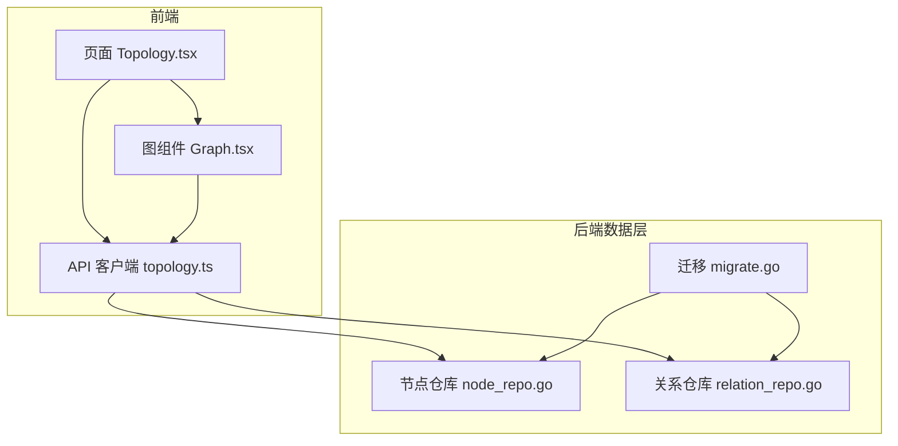
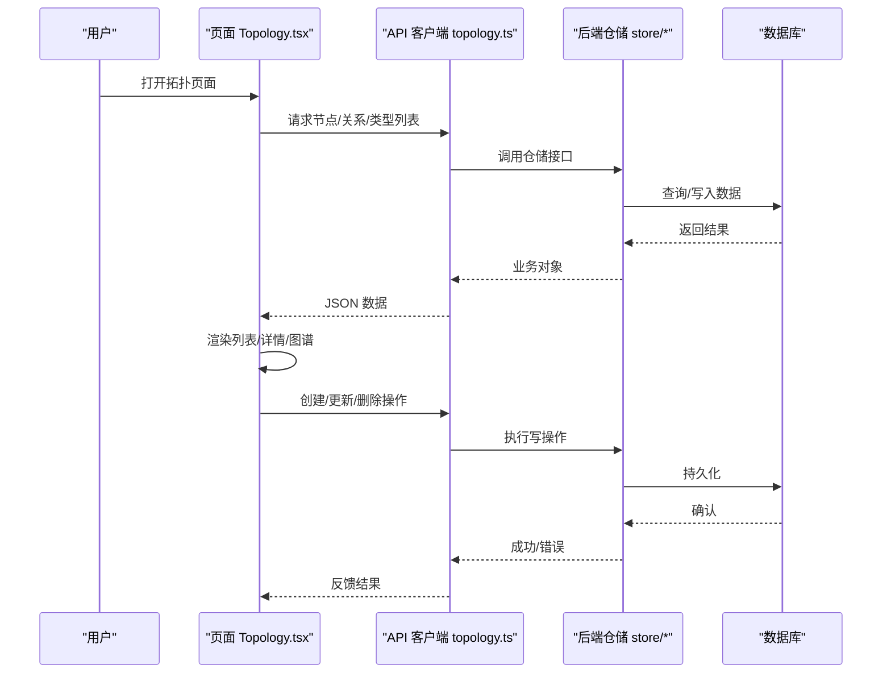
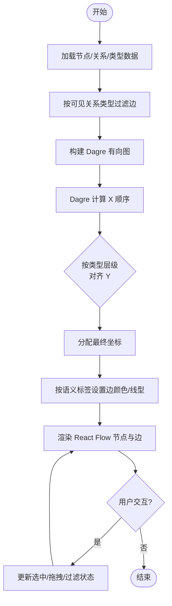
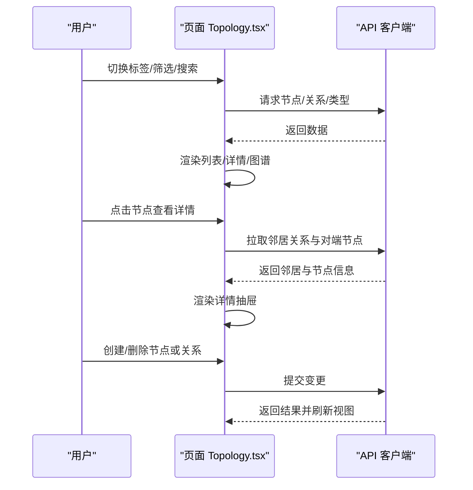
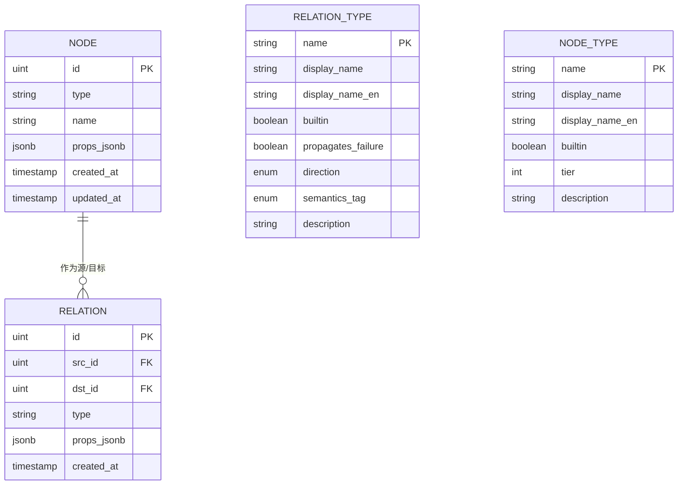
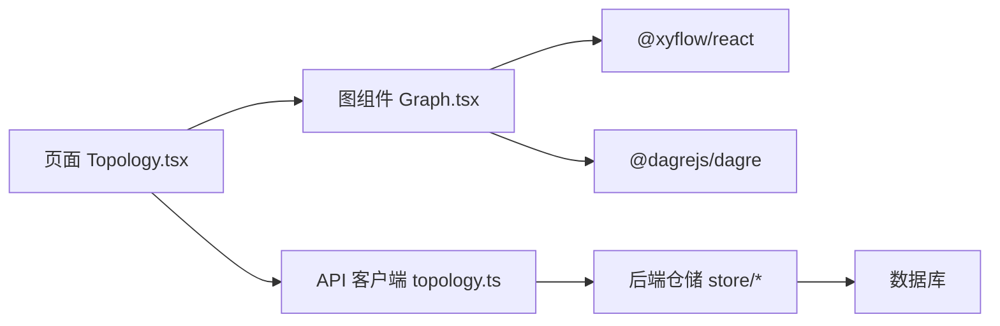

# 拓扑可视化

<cite>
**本文引用的文件**
- [web/src/pages/Topology.tsx](file://web/src/pages/Topology.tsx)
- [web/src/components/topology/Graph.tsx](file://web/src/components/topology/Graph.tsx)
- [web/src/api/topology.ts](file://web/src/api/topology.ts)
- [internal/manager/data/topology/store/migrate.go](file://internal/manager/data/topology/store/migrate.go)
- [internal/manager/data/topology/store/node_repo.go](file://internal/manager/data/topology/store/node_repo.go)
- [internal/manager/data/topology/store/relation_repo.go](file://internal/manager/data/topology/store/relation_repo.go)
</cite>

## 目录
1. [简介](#简介)
2. [项目结构](#项目结构)
3. [核心组件](#核心组件)
4. [架构总览](#架构总览)
5. [详细组件分析](#详细组件分析)
6. [依赖关系分析](#依赖关系分析)
7. [性能考量](#性能考量)
8. [故障排查指南](#故障排查指南)
9. [结论](#结论)
10. [附录：扩展示例](#附录：扩展示例)

## 简介
本技术文档聚焦于网络拓扑可视化功能，覆盖从数据建模、采集与处理到前端渲染与交互的全链路实现。重点解释：
- 拓扑图的构建算法（分层布局、边样式映射、节点类型识别）
- 节点关系映射与动态渲染机制（React Flow + Dagre）
- 拓扑数据的采集、处理与展示流程（前端 API 调用、后端存储迁移与种子数据）
- 节点类型识别、连接关系绘制与交互式操作（筛选、搜索、详情抽屉、类型管理）
- 性能优化策略（大数据量、响应式、最小化重绘）
- 扩展方法（新增网络元素类型、自定义关系语义）

## 项目结构
拓扑可视化由前后端协同实现：
- 前端页面与组件：
  - 页面入口与交互：web/src/pages/Topology.tsx
  - 图可视化组件：web/src/components/topology/Graph.tsx
  - API 客户端封装：web/src/api/topology.ts
- 后端数据层（GORM 存储与迁移）：
  - 迁移与内置类型种子：internal/manager/data/topology/store/migrate.go
  - 节点仓储：internal/manager/data/topology/store/node_repo.go
  - 关系仓储：internal/manager/data/topology/store/relation_repo.go

**图表来源**
- [web/src/pages/Topology.tsx:1-800](file://web/src/pages/Topology.tsx#L1-L800)
- [web/src/components/topology/Graph.tsx:1-503](file://web/src/components/topology/Graph.tsx#L1-L503)
- [web/src/api/topology.ts:1-227](file://web/src/api/topology.ts#L1-L227)
- [internal/manager/data/topology/store/migrate.go:1-49](file://internal/manager/data/topology/store/migrate.go#L1-L49)
- [internal/manager/data/topology/store/node_repo.go:1-51](file://internal/manager/data/topology/store/node_repo.go#L1-L51)
- [internal/manager/data/topology/store/relation_repo.go:1-21](file://internal/manager/data/topology/store/relation_repo.go#L1-L21)

**章节来源**
- [web/src/pages/Topology.tsx:1-800](file://web/src/pages/Topology.tsx#L1-L800)
- [web/src/components/topology/Graph.tsx:1-503](file://web/src/components/topology/Graph.tsx#L1-L503)
- [web/src/api/topology.ts:1-227](file://web/src/api/topology.ts#L1-L227)
- [internal/manager/data/topology/store/migrate.go:1-49](file://internal/manager/data/topology/store/migrate.go#L1-L49)
- [internal/manager/data/topology/store/node_repo.go:1-51](file://internal/manager/data/topology/store/node_repo.go#L1-L51)
- [internal/manager/data/topology/store/relation_repo.go:1-21](file://internal/manager/data/topology/store/relation_repo.go#L1-L21)

## 核心组件
- 页面组件（Topology.tsx）
  - 提供“图谱 / 节点+关系 / 类型管理”三标签页
  - 负责节点列表、筛选、搜索、详情抽屉、创建节点/关系、类型注册等交互
  - 通过 API 客户端获取节点、关系、类型数据并驱动 UI
- 图组件（Graph.tsx）
  - 基于 React Flow 与 Dagre 的层级布局
  - 按节点类型着色、按关系语义标记边颜色与线型
  - 支持隐藏孤立节点、过滤可见关系类型、拖拽位置记忆、小地图与背景网格
- API 客户端（topology.ts）
  - 封装节点、关系、关系类型、节点类型的 CRUD 接口
  - 定义数据类型、方向与语义标签枚举，供前端统一使用
- 数据层（store/*）
  - 迁移脚本初始化表结构与内置类型种子
  - 仓储实现节点与关系的增删改查

**章节来源**
- [web/src/pages/Topology.tsx:1-800](file://web/src/pages/Topology.tsx#L1-L800)
- [web/src/components/topology/Graph.tsx:1-503](file://web/src/components/topology/Graph.tsx#L1-L503)
- [web/src/api/topology.ts:1-227](file://web/src/api/topology.ts#L1-L227)
- [internal/manager/data/topology/store/migrate.go:1-49](file://internal/manager/data/topology/store/migrate.go#L1-L49)
- [internal/manager/data/topology/store/node_repo.go:1-51](file://internal/manager/data/topology/store/node_repo.go#L1-L51)
- [internal/manager/data/topology/store/relation_repo.go:1-21](file://internal/manager/data/topology/store/relation_repo.go#L1-L21)

## 架构总览
前端以页面为入口，聚合数据并通过图组件进行可视化；后端通过仓储层持久化拓扑实体，并在启动时完成数据库迁移与内置类型种子填充。

**图表来源**
- [web/src/pages/Topology.tsx:1-800](file://web/src/pages/Topology.tsx#L1-L800)
- [web/src/api/topology.ts:1-227](file://web/src/api/topology.ts#L1-L227)
- [internal/manager/data/topology/store/node_repo.go:1-51](file://internal/manager/data/topology/store/node_repo.go#L1-L51)
- [internal/manager/data/topology/store/relation_repo.go:1-21](file://internal/manager/data/topology/store/relation_repo.go#L1-L21)

## 详细组件分析

### 拓扑图构建算法与渲染机制（Graph.tsx）
- 节点类型识别与视觉映射
  - 将内置节点类型映射为不同背景/边框/前景色，未知类型回退中性色
  - 网络设备通过 props.device_kind 识别为 network_device 以区分显示
- 层级布局（Dagre + 自定义 Y 对齐）
  - 使用 Dagre 计算 X 顺序，再将节点按类型层级固定到水平带（app→service→cluster→network_device→device→rack）
  - 每行高度与间距可调，避免重叠；跨行居中以保证整体宽度一致
- 边样式与语义映射
  - 边的颜色与虚线样式由关系类型的语义标签决定（如 hard_dep、traffic、observation 等）
  - 根据源/目标层级选择上下手柄，使箭头方向符合层级逻辑
  - 同对多边的标签去重，仅首条显示文本，其余保留线型差异
- 交互与状态
  - 支持隐藏孤立节点、按关系类型过滤可见边
  - 拖拽节点后记住位置，避免每次渲染被重置
  - 选中节点高亮，相关边加粗或淡化未关联边
  - 小地图与点阵背景增强导航体验

**图表来源**
- [web/src/components/topology/Graph.tsx:1-503](file://web/src/components/topology/Graph.tsx#L1-L503)

**章节来源**
- [web/src/components/topology/Graph.tsx:1-503](file://web/src/components/topology/Graph.tsx#L1-L503)

### 页面交互与数据流（Topology.tsx）
- 三标签页：图谱视图、节点+关系列表、类型管理
- 节点列表：支持按类型筛选、名称搜索、分页/限制、刷新
- 节点详情抽屉：展示属性、邻居关系（入/出），支持添加/删除关系、删除节点
- 类型管理：查看/新建节点类型与关系类型，支持本地化显示名与层级
- 数据获取：通过 API 客户端调用 listNodes/listRelations/listNodeTypes/listRelationTypes 等接口

**图表来源**
- [web/src/pages/Topology.tsx:1-800](file://web/src/pages/Topology.tsx#L1-L800)
- [web/src/api/topology.ts:1-227](file://web/src/api/topology.ts#L1-L227)

**章节来源**
- [web/src/pages/Topology.tsx:1-800](file://web/src/pages/Topology.tsx#L1-L800)
- [web/src/api/topology.ts:1-227](file://web/src/api/topology.ts#L1-L227)

### 数据模型与关系映射
- 节点（TopologyNode）
  - 字段：id、type、name、props、created_at、updated_at
  - type 支持内置与自定义，props 承载扩展属性（如 device_kind）
- 关系（TopologyRelation）
  - 字段：id、src_id、dst_id、type、props、created_at
  - type 对应关系类型，用于语义与可视化
- 关系类型（RelationType）
  - 字段：name、display_name、display_name_en、builtin、propagates_failure、direction、semantics_tag、description
  - semantics_tag 决定边颜色与线型；direction 影响故障传播方向
- 节点类型（NodeType）
  - 字段：name、display_name、display_name_en、builtin、tier、description
  - tier 控制层级布局；display_name/display_name_en 提供本地化标签

**图表来源**
- [web/src/api/topology.ts:1-227](file://web/src/api/topology.ts#L1-L227)
- [internal/manager/data/topology/store/migrate.go:1-49](file://internal/manager/data/topology/store/migrate.go#L1-L49)
- [internal/manager/data/topology/store/node_repo.go:1-51](file://internal/manager/data/topology/store/node_repo.go#L1-L51)
- [internal/manager/data/topology/store/relation_repo.go:1-21](file://internal/manager/data/topology/store/relation_repo.go#L1-L21)

**章节来源**
- [web/src/api/topology.ts:1-227](file://web/src/api/topology.ts#L1-L227)
- [internal/manager/data/topology/store/migrate.go:1-49](file://internal/manager/data/topology/store/migrate.go#L1-L49)
- [internal/manager/data/topology/store/node_repo.go:1-51](file://internal/manager/data/topology/store/node_repo.go#L1-L51)
- [internal/manager/data/topology/store/relation_repo.go:1-21](file://internal/manager/data/topology/store/relation_repo.go#L1-L21)

### 数据采集、处理与可视化流程
- 采集
  - 前端通过 API 客户端拉取节点、关系、类型数据
  - 后端仓储通过 GORM 访问数据库，支持 MySQL/SQLite
- 处理
  - 前端对数据进行过滤（类型筛选、关系类型可见性）、排序与分页
  - 图组件执行布局算法（Dagre + 层级对齐）与样式映射（颜色/线型）
- 可视化
  - React Flow 渲染节点与边，支持拖拽、缩放、小地图、背景网格
  - 详情抽屉展示节点属性与邻居关系，支持管理员操作（添加/删除）

**章节来源**
- [web/src/pages/Topology.tsx:1-800](file://web/src/pages/Topology.tsx#L1-L800)
- [web/src/components/topology/Graph.tsx:1-503](file://web/src/components/topology/Graph.tsx#L1-L503)
- [web/src/api/topology.ts:1-227](file://web/src/api/topology.ts#L1-L227)
- [internal/manager/data/topology/store/migrate.go:1-49](file://internal/manager/data/topology/store/migrate.go#L1-L49)

## 依赖关系分析
- 前端依赖
  - 页面依赖 API 客户端与图组件
  - 图组件依赖 React Flow、Dagre、主题模式
- 后端依赖
  - 仓储依赖 GORM 与数据库方言
  - 迁移脚本确保表结构与内置类型种子存在
- 耦合与内聚
  - 前端通过类型化接口解耦 UI 与数据
  - 后端仓储将领域模型与持久化细节隔离

**图表来源**
- [web/src/pages/Topology.tsx:1-800](file://web/src/pages/Topology.tsx#L1-L800)
- [web/src/components/topology/Graph.tsx:1-503](file://web/src/components/topology/Graph.tsx#L1-L503)
- [web/src/api/topology.ts:1-227](file://web/src/api/topology.ts#L1-L227)
- [internal/manager/data/topology/store/migrate.go:1-49](file://internal/manager/data/topology/store/migrate.go#L1-L49)

**章节来源**
- [web/src/pages/Topology.tsx:1-800](file://web/src/pages/Topology.tsx#L1-L800)
- [web/src/components/topology/Graph.tsx:1-503](file://web/src/components/topology/Graph.tsx#L1-L503)
- [web/src/api/topology.ts:1-227](file://web/src/api/topology.ts#L1-L227)
- [internal/manager/data/topology/store/migrate.go:1-49](file://internal/manager/data/topology/store/migrate.go#L1-L49)

## 性能考量
- 大数据量处理
  - 列表分页与限制：前端通过 limit/offset 控制单次加载量
  - 邻居关系并行拉取：详情抽屉中对多个对端节点并发 GET，减少 RTT
  - 图渲染优化：隐藏孤立节点、按关系类型过滤边、标签去重，降低绘制压力
- 响应式设计
  - 容器尺寸自适应：首次渲染后触发 resize 事件，确保画布尺寸正确
  - 主题适配：明暗主题下节点与边颜色自动切换，保证可读性
- 交互性能
  - 拖拽位置缓存：避免每次渲染重置节点位置
  - 小地图与背景网格：提升导航效率，减少大范围拖拽成本

[本节为通用指导，不直接分析具体文件]

## 故障排查指南
- 常见错误与定位
  - 权限不足：写操作返回 403，检查当前角色是否为管理员
  - 数据缺失：节点或关系不存在，检查 ID 与关联是否完整
  - 解析失败：节点属性需为 JSON 对象，前端会提示并阻止提交
- 日志与调试
  - 前端错误捕获：API 错误消息在界面中展示，便于快速定位
  - 后端仓储错误：仓储层将 gorm.ErrRecordNotFound 转换为统一错误码
- 恢复步骤
  - 刷新数据：重新拉取节点/关系/类型列表
  - 清理无效关系：先删除引用再删除节点，避免外键约束冲突

**章节来源**
- [web/src/pages/Topology.tsx:1-800](file://web/src/pages/Topology.tsx#L1-L800)
- [internal/manager/data/topology/store/node_repo.go:1-51](file://internal/manager/data/topology/store/node_repo.go#L1-L51)

## 结论
该拓扑可视化方案以前端 React Flow + Dagre 为核心，结合后端 GORM 仓储与迁移脚本，实现了可扩展、可维护的网络拓扑管理与可视化。通过类型与语义驱动的视觉映射、层级布局与交互设计，既满足日常运维需求，也为 AIOps 推理提供了结构化基础。未来可在大数据量场景进一步优化批量接口与增量更新，同时扩展更多网络元素类型与关系语义。

[本节为总结，不直接分析具体文件]

## 附录：扩展示例
- 新增节点类型
  - 在前端“类型管理”中注册新节点类型，设置 display_name、display_name_en、tier 与描述
  - 在图组件中为该类型补充颜色映射（NODE_COLORS_*），以获得一致的视觉表现
  - 参考路径：[web/src/components/topology/Graph.tsx:39-72](file://web/src/components/topology/Graph.tsx#L39-L72)
- 新增关系类型与语义
  - 在前端“类型管理”中注册新关系类型，指定 direction 与 semantics_tag
  - 在图组件中为语义标签配置边颜色与线型（EDGE_COLORS、EDGE_DASH）
  - 参考路径：[web/src/components/topology/Graph.tsx:74-100](file://web/src/components/topology/Graph.tsx#L74-L100)
- 扩展属性与设备识别
  - 在节点 props 中添加 device_kind 等字段，以便图组件识别网络设备
  - 参考路径：[web/src/components/topology/Graph.tsx:122-128](file://web/src/components/topology/Graph.tsx#L122-L128)
- 后端数据层扩展
  - 如需新增字段或索引，请在迁移脚本中增加相应变更，并确保幂等
  - 参考路径：[internal/manager/data/topology/store/migrate.go:16-39](file://internal/manager/data/topology/store/migrate.go#L16-L39)

**章节来源**
- [web/src/components/topology/Graph.tsx:39-100](file://web/src/components/topology/Graph.tsx#L39-L100)
- [web/src/components/topology/Graph.tsx:122-128](file://web/src/components/topology/Graph.tsx#L122-L128)
- [internal/manager/data/topology/store/migrate.go:16-39](file://internal/manager/data/topology/store/migrate.go#L16-L39)