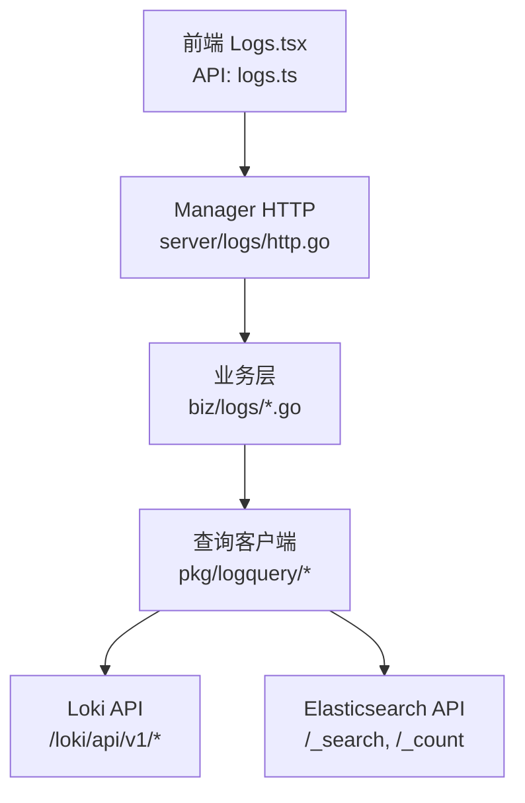
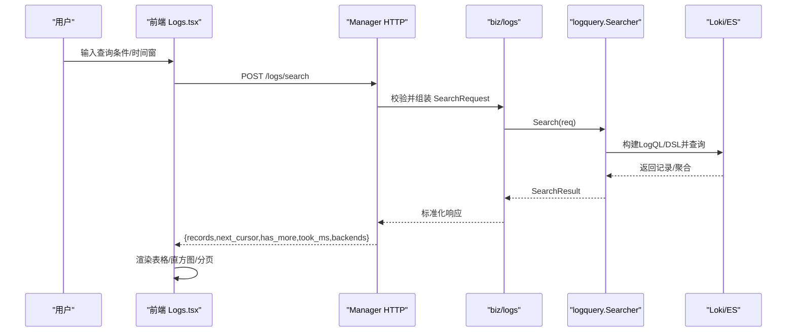
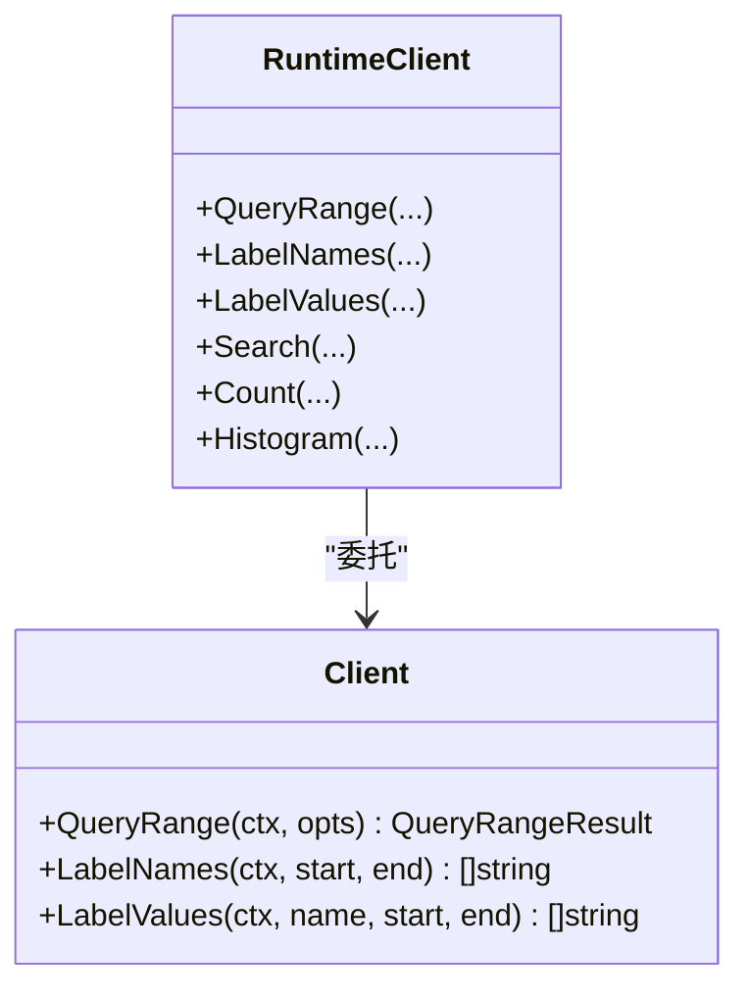
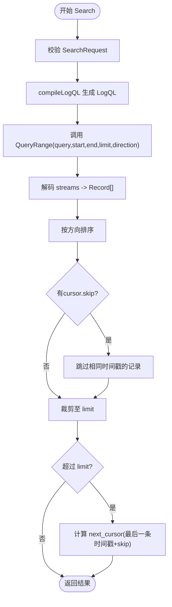
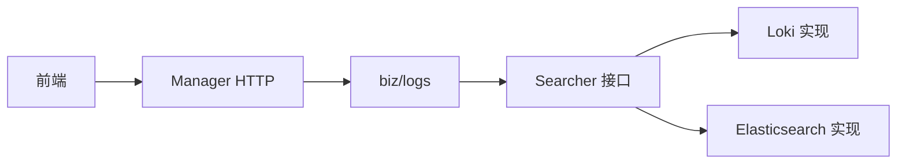

# 日志查询

<cite>
**本文引用的文件**
- [client.go](file://internal/pkg/logquery/client.go)
- [loki_search.go](file://internal/pkg/logquery/loki_search.go)
- [search.go](file://internal/pkg/logquery/search.go)
- [runtime_client.go](file://internal/pkg/logquery/runtime_client.go)
- [level.go](file://internal/pkg/logquery/level.go)
- [elasticsearch.go](file://internal/pkg/logquery/elasticsearch.go)
- [http.go](file://internal/manager/server/logs/http.go)
- [service.go](file://internal/manager/biz/logs/service.go)
- [search.go](file://internal/manager/biz/logs/search.go)
- [query_logql.go](file://internal/manager/biz/logs/query_logql.go)
- [logs.ts](file://web/src/api/logs.ts)
- [Logs.tsx](file://web/src/pages/Logs.tsx)
</cite>

## 目录
1. [简介](#简介)
2. [项目结构](#项目结构)
3. [核心组件](#核心组件)
4. [架构总览](#架构总览)
5. [详细组件分析](#详细组件分析)
6. [依赖关系分析](#依赖关系分析)
7. [性能考虑](#性能考虑)
8. [故障排查指南](#故障排查指南)
9. [结论](#结论)
10. [附录：扩展示例](#附录：扩展示例)

## 简介
本技术文档围绕“日志查询”功能，系统性阐述基于 Loki 的集成实现与后端无关的搜索抽象。内容涵盖 LogQL 查询语法支持、实时日志流处理、日志过滤与搜索、日志级别过滤、时间范围选择、设备筛选、结果分页机制、日志聚合、格式化显示与导出能力；并给出查询性能优化、错误处理与用户体验改进方案，以及可扩展的开发示例。

## 项目结构
日志查询由三层组成：
- 前端 UI：React 页面提供查询界面、直方图交互、分页加载、字段面板、导出等。
- Manager HTTP 服务：暴露 /logs/* 接口，负责鉴权、参数校验、调用业务层。
- 查询客户端（后端无关）：封装对 Loki/Elasticsearch 的访问，统一 Searcher 接口，屏蔽后端差异。

图表来源
- [Logs.tsx:284-800](file://web/src/pages/Logs.tsx#L284-L800)
- [http.go](file://internal/manager/server/logs/http.go)
- [service.go](file://internal/manager/biz/logs/service.go)
- [search.go](file://internal/manager/biz/logs/search.go)
- [client.go:120-171](file://internal/pkg/logquery/client.go#L120-L171)
- [elasticsearch.go:88-175](file://internal/pkg/logquery/elasticsearch.go#L88-L175)

章节来源
- [Logs.tsx:284-800](file://web/src/pages/Logs.tsx#L284-L800)
- [http.go](file://internal/manager/server/logs/http.go)
- [service.go](file://internal/manager/biz/logs/service.go)
- [search.go](file://internal/manager/biz/logs/search.go)
- [client.go:120-171](file://internal/pkg/logquery/client.go#L120-L171)
- [elasticsearch.go:88-175](file://internal/pkg/logquery/elasticsearch.go#L88-L175)

## 核心组件
- 查询客户端（pkg/logquery）
  - Client：Loki 原生查询封装，提供 QueryRange、LabelNames、LabelValues。
  - RuntimeClient：运行时可切换 Loki 端点、Basic Auth、TLS 配置，复用 HTTP 连接。
  - loki_search：将产品级 SearchRequest 编译为 LogQL，执行搜索、计数、分组计数、直方图、字段值扫描。
  - search：定义后端无关的 Searcher 接口、SearchRequest/Record/SearchResult、字段白名单、游标序列化等。
  - level：日志级别归一化与推断。
  - elasticsearch：Elasticsearch 后端实现，保持与 Loki 一致的接口。
- Manager 业务层（biz/logs）
  - service.go：编排查询、聚合、直方图等。
  - search.go：将 HTTP 请求转换为 SearchRequest，调用 Searcher。
  - query_logql.go：直接透传 LogQL 到 Loki（供高级场景）。
- Manager HTTP 层（server/logs）
  - http.go：路由 /logs/search、/logs/histogram、/logs/field-values、/logs/query_range 等。
- 前端（web）
  - Logs.tsx：查询表单、时间窗、直方图拖拽、分页加载、字段面板、导出 JSONL。
  - logs.ts：API 类型与请求封装。

章节来源
- [client.go:1-280](file://internal/pkg/logquery/client.go#L1-L280)
- [loki_search.go:31-118](file://internal/pkg/logquery/loki_search.go#L31-L118)
- [search.go:78-152](file://internal/pkg/logquery/search.go#L78-L152)
- [runtime_client.go:16-201](file://internal/pkg/logquery/runtime_client.go#L16-L201)
- [level.go:1-87](file://internal/pkg/logquery/level.go#L1-L87)
- [elasticsearch.go:88-175](file://internal/pkg/logquery/elasticsearch.go#L88-L175)
- [http.go](file://internal/manager/server/logs/http.go)
- [service.go](file://internal/manager/biz/logs/service.go)
- [search.go](file://internal/manager/biz/logs/search.go)
- [query_logql.go](file://internal/manager/biz/logs/query_logql.go)
- [Logs.tsx:284-800](file://web/src/pages/Logs.tsx#L284-L800)
- [logs.ts:82-110](file://web/src/api/logs.ts#L82-L110)

## 架构总览
系统采用“后端无关”的 Searcher 抽象，上层仅依赖统一接口，底层可切换 Loki 或 Elasticsearch。Manager 通过 HTTP 暴露标准 REST 接口，前端以 React 组件驱动查询、展示与交互。

图表来源
- [Logs.tsx:441-501](file://web/src/pages/Logs.tsx#L441-L501)
- [http.go](file://internal/manager/server/logs/http.go)
- [search.go](file://internal/manager/biz/logs/search.go)
- [loki_search.go:31-118](file://internal/pkg/logquery/loki_search.go#L31-L118)
- [elasticsearch.go:88-175](file://internal/pkg/logquery/elasticsearch.go#L88-L175)

## 详细组件分析

### Loki 查询客户端与运行时管理
- Client：封装 /loki/api/v1/query_range、/labels、/label/{name}/values，设置 X-Scope-OrgID 用于单租户隔离，限制响应体大小防止 OOM。
- RuntimeClient：每次调用前解析当前 Loki 端点（URL、BasicAuth、TLS），缓存 HTTP 客户端并在端点变化时重建，保证热更新配置生效。

图表来源
- [client.go:120-230](file://internal/pkg/logquery/client.go#L120-L230)
- [runtime_client.go:53-116](file://internal/pkg/logquery/runtime_client.go#L53-L116)

章节来源
- [client.go:120-230](file://internal/pkg/logquery/client.go#L120-L230)
- [runtime_client.go:53-116](file://internal/pkg/logquery/runtime_client.go#L53-L116)

### 后端无关搜索与 LogQL 编译
- SearchRequest：包含时间窗、Scope（设备/集群/命名空间/工作负载/Pod/容器/节点/服务名/来源/级别/文件/单元）、关键词（包含/排除/匹配模式）、字段过滤器、分页游标、方向。
- compileLogQL：将 Scope、Filters、Keywords 编译为 LogQL 匹配器与行过滤器；对索引标签使用 label matcher，非索引字段使用行过滤；默认强制 device_id 非空以避免空查询。
- 分页：使用 cursor（时间戳+skip+方向）避免重复与遗漏，向后翻页在 Loki 的 exclusive end 边界做纳秒级重叠补偿。

图表来源
- [loki_search.go:31-118](file://internal/pkg/logquery/loki_search.go#L31-L118)
- [search.go:257-338](file://internal/pkg/logquery/search.go#L257-L338)

章节来源
- [loki_search.go:390-526](file://internal/pkg/logquery/loki_search.go#L390-L526)
- [search.go:78-152](file://internal/pkg/logquery/search.go#L78-L152)

### 日志级别过滤与推断
- 级别归一化：统一 info/warn/error/critical/fatal 等变体。
- 自动推断：当未显式提供级别时，从消息中检测 klog/text/json 中的级别关键字。
- 映射：severity_text/severity_number 被规范化后写入 Record，便于前端高亮与筛选。

章节来源
- [level.go:14-87](file://internal/pkg/logquery/level.go#L14-L87)
- [loki_search.go:625-640](file://internal/pkg/logquery/loki_search.go#L625-L640)

### 时间范围、设备筛选与结果分页
- 时间范围：Start/End 必须有效且 End > Start，最大窗口受 MaxSearchWindow 限制。
- 设备筛选：device_ids 去重、校验大于零，并作为索引标签匹配。
- 分页：向后默认；向前需调整 Start/End 边界；next_cursor 携带时间戳与 skip，确保稳定翻页。

章节来源
- [search.go:257-338](file://internal/pkg/logquery/search.go#L257-L338)
- [loki_search.go:31-118](file://internal/pkg/logquery/loki_search.go#L31-L118)

### 日志聚合、直方图与导出
- 计数与分组计数：Count 使用 count_over_time 瞬时查询；CountGrouped 支持按设备/集群/命名空间/服务名等维度分组，限制桶数量。
- 直方图：按区间统计事件数，对齐 epoch 步长并处理偏移，支持部分区间补全。
- 导出：前端将已加载记录导出为 JSONL，限制最大行数，避免大文件卡顿。

章节来源
- [loki_search.go:130-230](file://internal/pkg/logquery/loki_search.go#L130-L230)
- [loki_search.go:318-388](file://internal/pkg/logquery/loki_search.go#L318-L388)
- [Logs.tsx:641-650](file://web/src/pages/Logs.tsx#L641-L650)

### 实时日志流处理
- 前端支持“实时”模式，定时轮询最新数据；直方图支持拖拽选择时间窗，快速聚焦问题时段。
- 后端通过 Searcher.Histogram 与 Search 组合，提供时序分布与明细。

章节来源
- [Logs.tsx:566-570](file://web/src/pages/Logs.tsx#L566-L570)
- [Logs.tsx:686-769](file://web/src/pages/Logs.tsx#L686-L769)
- [loki_search.go:318-388](file://internal/pkg/logquery/loki_search.go#L318-L388)

### 字段值发现与过滤
- 字段目录：AllowedFields 暴露可搜索/可聚合字段集合。
- 字段值：优先走 Loki LabelValues（索引字段），否则扫描记录集合并去重，限制扫描条数。
- 过滤器：支持 eq/neq/in/exists/prefix，message 字段特殊处理正则匹配。

章节来源
- [search.go:368-420](file://internal/pkg/logquery/search.go#L368-L420)
- [loki_search.go:236-289](file://internal/pkg/logquery/loki_search.go#L236-L289)
- [loki_search.go:442-498](file://internal/pkg/logquery/loki_search.go#L442-L498)

### Manager HTTP 与业务编排
- HTTP 层：接收 /logs/search、/logs/histogram、/logs/field-values、/logs/query_range 等请求，进行鉴权与参数校验。
- 业务层：将 HTTP 请求转为 SearchRequest，调用 Searcher，并将结果标准化返回。
- LogQL 直通：提供 query_logql 能力，允许高级用户直接下发 LogQL 到 Loki。

章节来源
- [http.go](file://internal/manager/server/logs/http.go)
- [service.go](file://internal/manager/biz/logs/service.go)
- [search.go](file://internal/manager/biz/logs/search.go)
- [query_logql.go](file://internal/manager/biz/logs/query_logql.go)

### 前端 API 与交互
- API 封装：searchLogs、getLogHistogram、listLogFieldValues、listLogFields、closeLogCursor 等。
- 交互：时间窗预设、自定义起止、关键词匹配模式、角色/设备筛选、字段面板、分页加载、错误提示、导出 JSONL。

章节来源
- [logs.ts:82-110](file://web/src/api/logs.ts#L82-L110)
- [Logs.tsx:284-800](file://web/src/pages/Logs.tsx#L284-L800)

## 依赖关系分析
- 前端依赖 Manager HTTP 接口，不感知后端实现。
- Manager 业务层依赖 logquery.Searcher 接口，解耦 Loki/Elasticsearch。
- logquery.Client 依赖 HTTP 客户端与 BaseURLResolver/RuntimeClient，支持运行时配置变更。
- Loki 与 Elasticsearch 通过各自适配器实现统一接口，便于替换与扩展。

图表来源
- [search.go:138-159](file://internal/pkg/logquery/search.go#L138-L159)
- [loki_search.go:31-118](file://internal/pkg/logquery/loki_search.go#L31-L118)
- [elasticsearch.go:88-175](file://internal/pkg/logquery/elasticsearch.go#L88-L175)

章节来源
- [search.go:138-159](file://internal/pkg/logquery/search.go#L138-L159)
- [loki_search.go:31-118](file://internal/pkg/logquery/loki_search.go#L31-L118)
- [elasticsearch.go:88-175](file://internal/pkg/logquery/elasticsearch.go#L88-L175)

## 性能考虑
- 查询限制与超时：单次查询默认 30s 超时，响应体限制 8MB，避免内存溢出。
- 分页与游标：使用 next_cursor 与 skip 减少重复读取，向后翻页在 exclusive 边界做纳秒补偿。
- 直方图对齐：Loki 的 step 对齐 epoch，必要时 offset 修正，保证桶边界正确。
- 字段值扫描：限制最大扫描记录数，避免全表扫描。
- 连接复用：RuntimeClient 缓存 HTTP 客户端，端点变化时重建，减少握手开销。
- 前端优化：并发获取字段与值（FACET_VALUE_CONCURRENCY），AbortController 取消旧请求，避免竞态。

章节来源
- [client.go:61-65](file://internal/pkg/logquery/client.go#L61-L65)
- [client.go:257-270](file://internal/pkg/logquery/client.go#L257-L270)
- [loki_search.go:31-118](file://internal/pkg/logquery/loki_search.go#L31-L118)
- [loki_search.go:318-388](file://internal/pkg/logquery/loki_search.go#L318-L388)
- [loki_search.go:236-289](file://internal/pkg/logquery/loki_search.go#L236-L289)
- [runtime_client.go:53-83](file://internal/pkg/logquery/runtime_client.go#L53-L83)
- [Logs.tsx:595-639](file://web/src/pages/Logs.tsx#L595-L639)

## 故障排查指南
- 常见错误
  - 时间窗无效：Start/End 为空或 End <= Start，或超出最大窗口。
  - 设备 ID 非法：device_id 必须大于零。
  - 游标无效：next_cursor 过期或格式错误，需重新发起初始查询。
  - 后端不可用：Loki/ES 端点错误或认证失败，检查 URL、BasicAuth/TLS、API Key。
- 定位方法
  - 查看 Manager 日志中的非 200 状态码与路径。
  - 检查前端 AbortError 是否因新请求覆盖旧请求。
  - 确认直方图与搜索结果是否一致，必要时缩小时间窗或增加 limit。
- 恢复策略
  - 清理游标：前端 closeLogCursor 释放后端资源（ES PIT）。
  - 重试：捕获错误后重置状态并重试。
  - 降级：直方图失败不影响主查询，继续展示明细。

章节来源
- [search.go:257-338](file://internal/pkg/logquery/search.go#L257-L338)
- [client.go:257-270](file://internal/pkg/logquery/client.go#L257-L270)
- [elasticsearch.go:177-188](file://internal/pkg/logquery/elasticsearch.go#L177-L188)
- [Logs.tsx:527-539](file://web/src/pages/Logs.tsx#L527-L539)

## 结论
该日志查询系统通过后端无关的 Searcher 抽象，统一了 Loki 与 Elasticsearch 的查询语义，提供了强大的过滤、聚合、直方图与分页能力。前端具备丰富的交互体验，包括时间窗选择、字段面板、实时刷新与导出。系统在性能与稳定性方面做了充分考量，适合大规模日志检索与分析场景。

## 附录：扩展示例
以下示例展示如何扩展日志查询功能，均基于现有接口与实现：

- 新增字段支持
  - 在 AllowedFields 中添加新字段映射，指定 LokiName/LokiIndexed 与 ElasticsearchPath。
  - 在 compileLogQL 中为新字段添加匹配逻辑（索引标签或行过滤）。
  - 前端在字段面板中展示并可用作筛选。

 章节来源
  - [search.go:368-420](file://internal/pkg/logquery/search.go#L368-L420)
  - [loki_search.go:390-526](file://internal/pkg/logquery/loki_search.go#L390-L526)
  - [Logs.tsx:102-128](file://web/src/pages/Logs.tsx#L102-L128)

- 扩展关键词匹配模式
  - 在 MatchMode 中新增模式（如 fuzzy），在 compileLogQL 中生成对应 LogQL 表达式。
  - 前端增加对应选项与输入解析。

 章节来源
  - [search.go:24-30](file://internal/pkg/logquery/search.go#L24-L30)
  - [loki_search.go:507-525](file://internal/pkg/logquery/loki_search.go#L507-L525)
  - [Logs.tsx:142-148](file://web/src/pages/Logs.tsx#L142-L148)

- 自定义直方图粒度
  - 根据时间窗动态选择 interval，前端 histogramInterval 已内置多档粒度。
  - 后端 Histogram 使用 count_over_time/date_histogram 实现，支持 offset 修正。

 章节来源
  - [Logs.tsx:173-187](file://web/src/pages/Logs.tsx#L173-L187)
  - [loki_search.go:318-388](file://internal/pkg/logquery/loki_search.go#L318-L388)
  - [elasticsearch.go:362-424](file://internal/pkg/logquery/elasticsearch.go#L362-L424)

- 接入新的日志后端
  - 实现 Searcher 接口（Search/Count/CountGrouped/Fields/FieldValues/Histogram）。
  - 在 Manager 业务层注册新后端，HTTP 层无需改动。

 章节来源
  - [search.go:138-159](file://internal/pkg/logquery/search.go#L138-L159)
  - [elasticsearch.go:88-175](file://internal/pkg/logquery/elasticsearch.go#L88-L175)