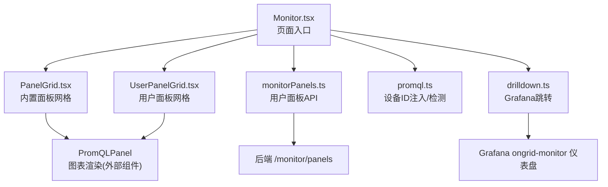
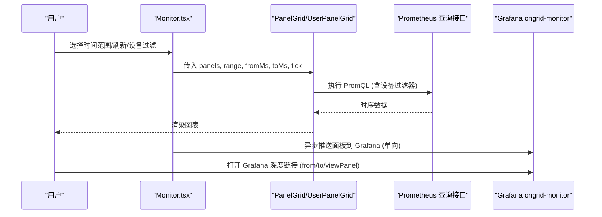
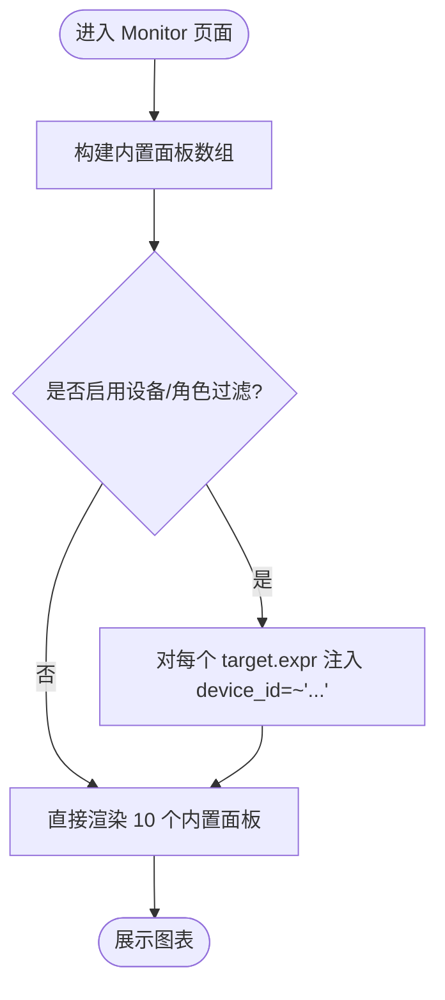
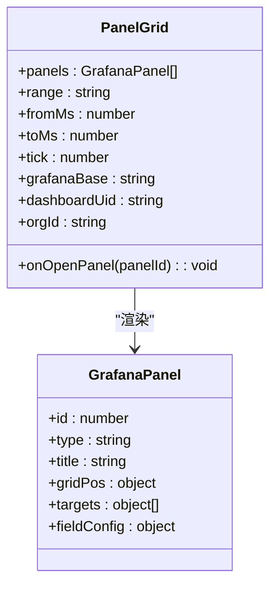
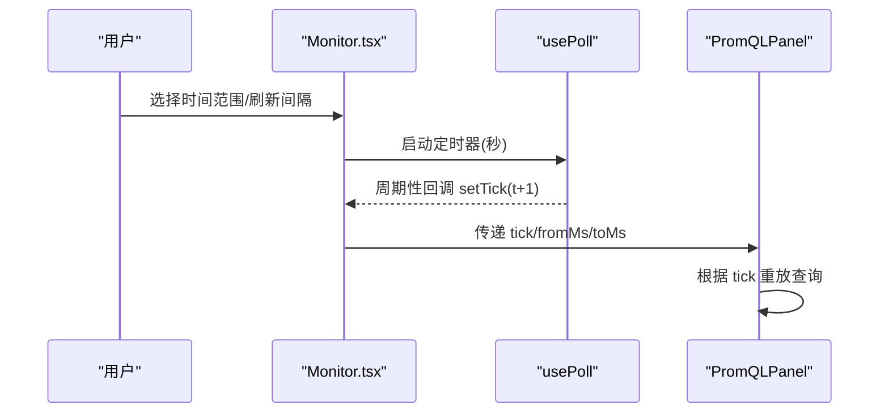
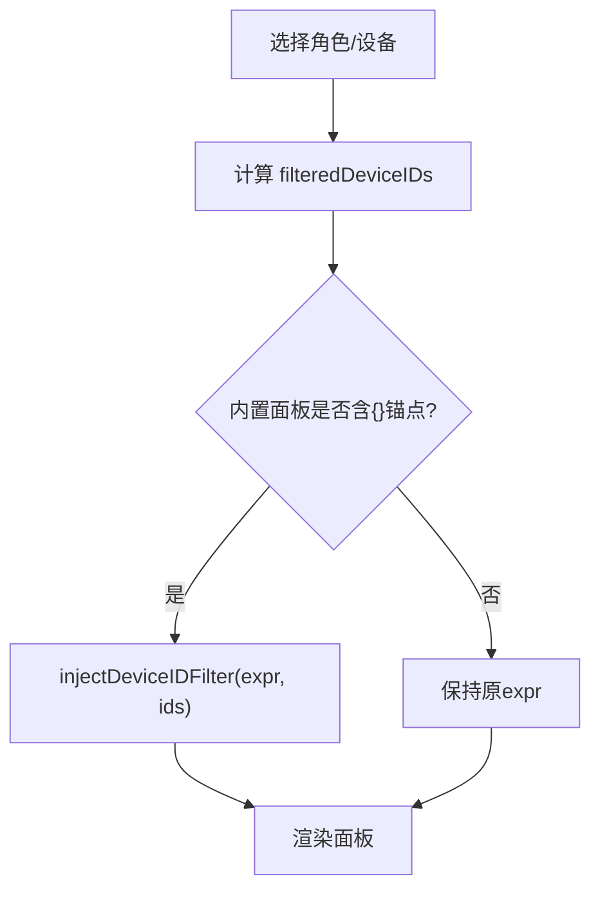
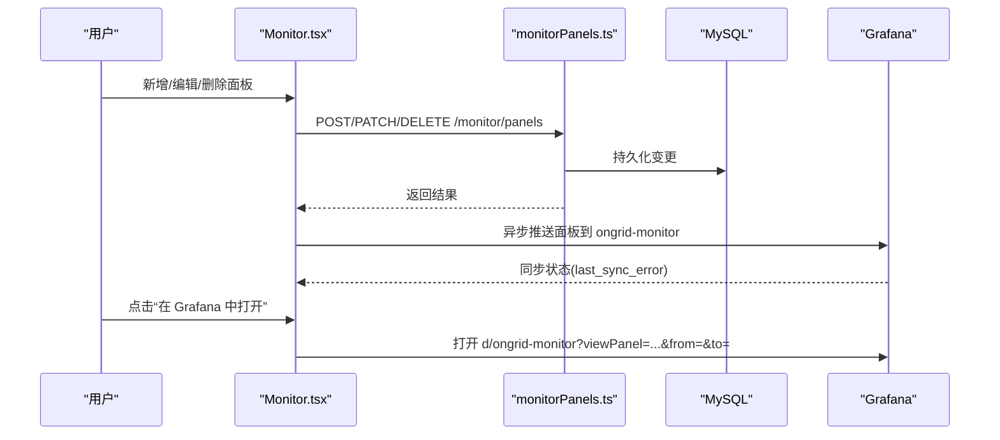
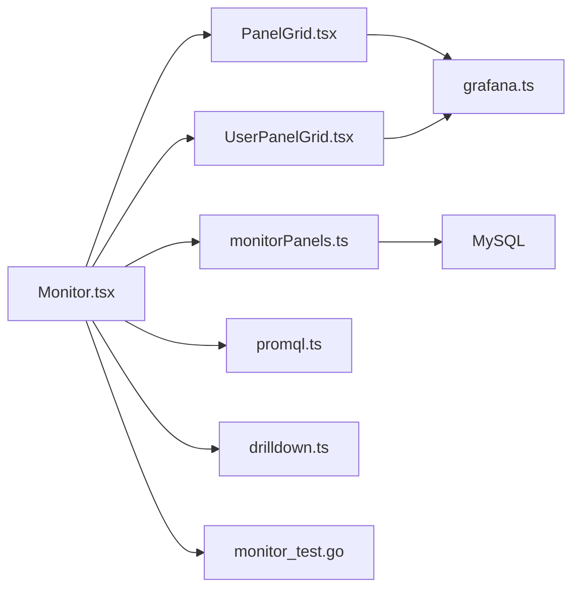

# 监控仪表盘

<cite>
**本文引用的文件**
- [Monitor.tsx](file://web/src/pages/Monitor.tsx)
- [monitorPanels.ts](file://web/src/api/monitorPanels.ts)
- [PanelGrid.tsx](file://web/src/components/monitor/PanelGrid.tsx)
- [UserPanelGrid.tsx](file://web/src/components/monitor/UserPanelGrid.tsx)
- [MonitorPanelModal.tsx](file://web/src/components/MonitorPanelModal.tsx)
- [promql.ts](file://web/src/lib/promql.ts)
- [drilldown.ts](file://web/src/lib/drilldown.ts)
- [grafana.ts](file://web/src/api/grafana.ts)
- [monitor_test.go](file://internal/manager/biz/grafana/monitor_test.go)
</cite>

## 目录
1. [简介](#简介)
2. [项目结构](#项目结构)
3. [核心组件](#核心组件)
4. [架构总览](#架构总览)
5. [详细组件分析](#详细组件分析)
6. [依赖关系分析](#依赖关系分析)
7. [性能考虑](#性能考虑)
8. [故障排查指南](#故障排查指南)
9. [结论](#结论)
10. [附录](#附录)

## 简介
本技术文档围绕“监控仪表盘”实现，系统性说明内置面板（CPU、内存、磁盘使用率、网络吞吐等）的 PromQL 查询逻辑、面板布局系统、时间范围选择器、自动刷新机制与设备过滤功能；并阐述如何添加自定义面板、与 Grafana 集成以及面板数据同步机制。同时给出性能优化策略、错误处理与用户体验设计最佳实践。

## 项目结构
监控仪表盘由前端页面、面板渲染网格、用户面板管理、PromQL 工具函数与 Grafana 集成模块组成：
- 页面层：Monitor.tsx 负责整体布局、时间范围、自动刷新、设备/角色过滤、内置面板定义与用户面板加载。
- 渲染层：PanelGrid.tsx 将 Grafana 风格的 gridPos 映射到 CSS Grid；UserPanelGrid.tsx 渲染用户自定义面板并叠加编辑/删除操作与筛选状态提示。
- 数据层：monitorPanels.ts 提供用户面板的 CRUD API 封装；promql.ts 提供设备 ID 注入与引用检测；drilldown.ts 提供 Grafana 根地址解析与跳转；grafana.ts 提供 Grafana 面板类型定义。
- 后端集成：monitor_test.go 验证 Grafana 仪表盘 JSON 构建与布局映射（uid、gridPos、type、datasource uid）。

**图示来源**
- [Monitor.tsx:95-266](file://web/src/pages/Monitor.tsx#L95-L266)
- [PanelGrid.tsx:15-77](file://web/src/components/monitor/PanelGrid.tsx#L15-L77)
- [UserPanelGrid.tsx:21-40](file://web/src/components/monitor/UserPanelGrid.tsx#L21-L40)
- [monitorPanels.ts:39-59](file://web/src/api/monitorPanels.ts#L39-L59)
- [monitor_test.go:14-68](file://internal/manager/biz/grafana/monitor_test.go#L14-L68)

**章节来源**
- [Monitor.tsx:27-50](file://web/src/pages/Monitor.tsx#L27-L50)
- [PanelGrid.tsx:1-11](file://web/src/components/monitor/PanelGrid.tsx#L1-L11)
- [UserPanelGrid.tsx:1-20](file://web/src/components/monitor/UserPanelGrid.tsx#L1-L20)
- [monitorPanels.ts:3-9](file://web/src/api/monitorPanels.ts#L3-L9)
- [monitor_test.go:9-13](file://internal/manager/biz/grafana/monitor_test.go#L9-L13)

## 核心组件
- Monitor 页面：集中维护时间范围、自动刷新、设备/角色过滤、内置面板集合、用户面板列表与 Grafana 深度链接。
- PanelGrid：基于 Grafana 24 列栅格，将 gridPos.w/h 映射为 CSS Grid 跨度，窄屏自动单列。
- UserPanelGrid：将用户面板转换为 GrafanaPanel 形状，按是否引用 device_id 决定是否注入设备过滤器，并提供编辑/删除与同步状态提示。
- monitorPanels API：封装获取、创建、更新、删除用户面板的请求。
- promql 工具：injectDeviceIDFilter 将设备 ID 列表注入到包含 {} 锚点的 PromQL；referencesDeviceID 判断查询是否引用 device_id。
- drilldown：解析 Grafana 根地址并构造带 from/to/orgId/viewPanel 参数的跳转 URL。
- Grafana 集成测试：验证 dashboard uid、panel 布局（2 宽×多行）、类型映射与 datasource uid。

**章节来源**
- [Monitor.tsx:276-418](file://web/src/pages/Monitor.tsx#L276-L418)
- [PanelGrid.tsx:15-77](file://web/src/components/monitor/PanelGrid.tsx#L15-L77)
- [UserPanelGrid.tsx:21-40](file://web/src/components/monitor/UserPanelGrid.tsx#L21-L40)
- [monitorPanels.ts:39-59](file://web/src/api/monitorPanels.ts#L39-L59)
- [monitor_test.go:14-68](file://internal/manager/biz/grafana/monitor_test.go#L14-L68)

## 架构总览
监控仪表盘采用“前端直接查询 Prometheus 风格接口 + 可选 Grafana 仪表盘同步”的双路径架构：
- 本地渲染：内置面板以硬编码 PromQL 通过 manager 的 Prometheus 查询接口拉取数据，使用 recharts 绘制，首屏快、不依赖 Grafana。
- Grafana 同步：用户面板与内置面板会异步推送到 Grafana 的 ongrid-monitor 仪表盘（单向），用于深度分析与共享。

**图示来源**
- [Monitor.tsx:359-418](file://web/src/pages/Monitor.tsx#L359-L418)
- [PanelGrid.tsx:53-73](file://web/src/components/monitor/PanelGrid.tsx#L53-L73)
- [UserPanelGrid.tsx:21-40](file://web/src/components/monitor/UserPanelGrid.tsx#L21-L40)
- [monitor_test.go:14-68](file://internal/manager/biz/grafana/monitor_test.go#L14-L68)

## 详细组件分析

### 内置面板与 PromQL 查询逻辑（10个）
以下内置面板在 Monitor.tsx 中定义，均针对集群维度聚合，支持通过设备/角色过滤注入 device_id 匹配器：
- CPU 使用率：基于 idle 速率计算百分比，按 device_id 分组。
- 内存使用率：可用内存与总内存比值，按 device_id 聚合。
- 磁盘使用率（物理设备）：仅统计 ext4/xfs/btrfs/zfs/ext3/ext2/f2fs 等文件系统，排除虚拟挂载点，按 device_id 与设备名聚合。
- 网络吞吐（RX+TX）：排除 lo/veth/docker 等虚拟网卡，按 device_id 聚合。
- Top 8 进程·CPU：按进程组 CPU 秒率 topk(8)，跨设备平均。
- Top 8 进程·内存：按进程组驻留内存 topk(8)。
- 负载饱和度（load1 ÷ 核数）：用 count(mode="idle") 估算每设备核数，归一化 load1。
- 磁盘 I/O 吞吐（读+写）：按 device_id 聚合读写速率。
- conntrack 利用率：当前条目与上限比值。
- TCP 连接数：当前 Established 连接数按 device_id 聚合。

**图示来源**
- [Monitor.tsx:95-266](file://web/src/pages/Monitor.tsx#L95-L266)
- [promql.ts](file://web/src/lib/promql.ts)

**章节来源**
- [Monitor.tsx:95-266](file://web/src/pages/Monitor.tsx#L95-L266)

### 面板布局系统
- 栅格模型：遵循 Grafana 24 列栅格，gridPos.w/h 决定跨度与高度。
- 响应式：宽度小于约 1200px 时切换为单列，保证可读性。
- 高度缩放：Grafana 单位约 30px，此处放大至约 36px，适配 SPA 紧凑界面。

**图示来源**
- [PanelGrid.tsx:15-77](file://web/src/components/monitor/PanelGrid.tsx#L15-L77)
- [grafana.ts](file://web/src/api/grafana.ts)

**章节来源**
- [PanelGrid.tsx:1-77](file://web/src/components/monitor/PanelGrid.tsx#L1-L77)

### 时间范围选择器与自动刷新
- 时间范围：支持 15m/1h/3h/6h/24h/3d/7d，解析为毫秒窗口 fromMs/toMs，随 tick 滑动实现“自动刷新”效果。
- 自动刷新：usePoll 定时递增 tick，触发各面板重新拉取；标签页隐藏时暂停，避免后台持续请求。
- 手动刷新：按钮立即触发一次 tick。

**图示来源**
- [Monitor.tsx:52-72](file://web/src/pages/Monitor.tsx#L52-L72)
- [Monitor.tsx:396-418](file://web/src/pages/Monitor.tsx#L396-L418)

**章节来源**
- [Monitor.tsx:52-72](file://web/src/pages/Monitor.tsx#L52-L72)
- [Monitor.tsx:396-418](file://web/src/pages/Monitor.tsx#L396-L418)

### 设备过滤与角色过滤
- 角色过滤：从 edges 列表按 roles 匹配，生成 device_id 列表，注入到所有内置面板的 PromQL 中。
- 设备过滤：精确指定单个 device_id，优先级高于角色过滤。
- 注入规则：仅当 PromQL 包含 {} 锚点或明确引用 device_id 时才注入，避免改变无锚点查询语义。

**图示来源**
- [Monitor.tsx:323-369](file://web/src/pages/Monitor.tsx#L323-L369)
- [promql.ts](file://web/src/lib/promql.ts)

**章节来源**
- [Monitor.tsx:323-369](file://web/src/pages/Monitor.tsx#L323-L369)

### 用户面板管理与同步机制
- 用户面板：通过 /monitor/panels 进行增删改查，存储于 MySQL，并在前端以 MonitorPanel 类型呈现。
- 渲染转换：UserPanelGrid 将 MonitorPanel 转为 GrafanaPanel，若 PromQL 引用 device_id 且启用了设备/角色过滤，则注入匹配器。
- Grafana 同步：保存后异步推送到 Grafana 的 ongrid-monitor 仪表盘（单向），失败不影响本地渲染；删除也会从 Grafana 移除。
- 深度链接：支持跳转到 Grafana 指定面板 viewPanel，并携带 from/to/orgId。

**图示来源**
- [monitorPanels.ts:39-59](file://web/src/api/monitorPanels.ts#L39-L59)
- [UserPanelGrid.tsx:21-40](file://web/src/components/monitor/UserPanelGrid.tsx#L21-L40)
- [Monitor.tsx:433-487](file://web/src/pages/Monitor.tsx#L433-L487)
- [monitor_test.go:14-68](file://internal/manager/biz/grafana/monitor_test.go#L14-L68)

**章节来源**
- [monitorPanels.ts:39-59](file://web/src/api/monitorPanels.ts#L39-L59)
- [UserPanelGrid.tsx:21-40](file://web/src/components/monitor/UserPanelGrid.tsx#L21-L40)
- [Monitor.tsx:433-487](file://web/src/pages/Monitor.tsx#L433-L487)
- [monitor_test.go:14-68](file://internal/manager/biz/grafana/monitor_test.go#L14-L68)

### 与 Grafana 集成
- 仪表盘 UID：固定为 ongrid-monitor，确保深度链接稳定。
- 数据源 UID：由后端渲染时设置，测试用例校验其存在。
- 布局：默认 2 列宽、高 8 单位，顺序按 panel id 排列。
- 跳转：通过 drilldown 解析 Grafana 根地址，拼接 viewPanel/from/to/orgId 参数。

**章节来源**
- [monitor_test.go:14-68](file://internal/manager/biz/grafana/monitor_test.go#L14-L68)
- [Monitor.tsx:309-331](file://web/src/pages/Monitor.tsx#L309-L331)
- [drilldown.ts](file://web/src/lib/drilldown.ts)

## 依赖关系分析
- Monitor.tsx 依赖：
  - 面板渲染：PanelGrid.tsx、UserPanelGrid.tsx
  - 数据接口：monitorPanels.ts
  - 工具函数：promql.ts（设备过滤注入）、drilldown.ts（Grafana 跳转）
  - 类型定义：grafana.ts（GrafanaPanel）
- 后端集成：monitor_test.go 验证 Grafana 仪表盘 JSON 构建与布局。

**图示来源**
- [Monitor.tsx:1-25](file://web/src/pages/Monitor.tsx#L1-L25)
- [PanelGrid.tsx:1-14](file://web/src/components/monitor/PanelGrid.tsx#L1-L14)
- [UserPanelGrid.tsx:1-12](file://web/src/components/monitor/UserPanelGrid.tsx#L1-L12)
- [monitorPanels.ts:1-9](file://web/src/api/monitorPanels.ts#L1-L9)
- [monitor_test.go:1-13](file://internal/manager/biz/grafana/monitor_test.go#L1-L13)

**章节来源**
- [Monitor.tsx:1-25](file://web/src/pages/Monitor.tsx#L1-L25)
- [PanelGrid.tsx:1-14](file://web/src/components/monitor/PanelGrid.tsx#L1-L14)
- [UserPanelGrid.tsx:1-12](file://web/src/components/monitor/UserPanelGrid.tsx#L1-L12)
- [monitorPanels.ts:1-9](file://web/src/api/monitorPanels.ts#L1-L9)
- [monitor_test.go:1-13](file://internal/manager/biz/grafana/monitor_test.go#L1-L13)

## 性能考虑
- 首屏性能：内置面板硬编码 PromQL，无需等待 Grafana 仪表盘 JSON，首屏 <200ms。
- 请求节流：自动刷新基于 usePoll 控制频率，标签页隐藏时暂停，减少无效请求。
- 查询优化：
  - 使用 $__rate_interval 动态区间，避免长时窗口的重复采样。
  - 通过 by(device_id) 聚合降低图例噪音。
  - 仅对含 {} 锚点或引用 device_id 的查询注入过滤器，避免不必要重写。
- 渲染优化：PanelGrid 响应式栅格，窄屏单列，减少重排；最小高度限制避免塌陷。
- 缓存建议：Prometheus 侧可配置合理保留期与预聚合指标；前端可考虑短时缓存热点查询结果（按需扩展）。

[本节为通用指导，不直接分析具体文件]

## 故障排查指南
- 面板未受设备过滤影响：
  - 检查 PromQL 是否包含 {} 锚点或显式引用 device_id；若无，不会注入过滤器。
  - 参考：[Monitor.tsx:118-135](file://web/src/pages/Monitor.tsx#L118-L135)、[UserPanelGrid.tsx:21-25](file://web/src/components/monitor/UserPanelGrid.tsx#L21-L25)
- Grafana 同步失败：
  - 查看用户面板的 last_sync_error 提示；本地仍可正常渲染。
  - 参考：[UserPanelGrid.tsx:142-149](file://web/src/components/monitor/UserPanelGrid.tsx#L142-L149)
- 无法打开 Grafana 深度链接：
  - 确认已解析到 grafanaBase；否则按钮禁用。
  - 参考：[Monitor.tsx:398-404](file://web/src/pages/Monitor.tsx#L398-L404)、[Monitor.tsx:424-431](file://web/src/pages/Monitor.tsx#L424-L431)
- 自动刷新不生效：
  - 检查 refresh 设置为 0（关闭）或浏览器标签页是否可见。
  - 参考：[Monitor.tsx:66-72](file://web/src/pages/Monitor.tsx#L66-L72)、[Monitor.tsx:406-410](file://web/src/pages/Monitor.tsx#L406-L410)
- 仪表盘布局异常：
  - 确认 gridPos.w/h 合法；测试用例覆盖 2 宽×8 高的布局。
  - 参考：[monitor_test.go:31-42](file://internal/manager/biz/grafana/monitor_test.go#L31-L42)

**章节来源**
- [Monitor.tsx:118-135](file://web/src/pages/Monitor.tsx#L118-L135)
- [UserPanelGrid.tsx:21-25](file://web/src/components/monitor/UserPanelGrid.tsx#L21-L25)
- [UserPanelGrid.tsx:142-149](file://web/src/components/monitor/UserPanelGrid.tsx#L142-L149)
- [Monitor.tsx:398-410](file://web/src/pages/Monitor.tsx#L398-L410)
- [monitor_test.go:31-42](file://internal/manager/biz/grafana/monitor_test.go#L31-L42)

## 结论
监控仪表盘通过硬编码内置面板与灵活的用户面板体系，实现了快速、可靠、可扩展的集群级观测能力。PromQL 查询经过精心设计与过滤注入，兼顾准确性与性能；与 Grafana 的单向同步满足深度分析与协作需求。结合响应式布局、自动刷新与设备/角色过滤，提供了良好的用户体验。建议在 Prometheus 侧配合合理的指标保留与预聚合策略，以获得更优的查询性能与稳定性。

[本节为总结，不直接分析具体文件]

## 附录
- 关键术语
  - 设备过滤：通过 device_id 限定查询范围。
  - 角色过滤：基于设备 roles 推导 device_id 列表。
  - 注入：向 PromQL 插入设备匹配器。
  - 深度链接：带 from/to/viewPanel/orgId 的 Grafana 跳转 URL。
- 相关实现位置
  - 内置面板定义：[Monitor.tsx:95-266](file://web/src/pages/Monitor.tsx#L95-L266)
  - 设备/角色过滤注入：[Monitor.tsx:323-369](file://web/src/pages/Monitor.tsx#L323-L369)、[promql.ts](file://web/src/lib/promql.ts)
  - 用户面板 CRUD：[monitorPanels.ts:39-59](file://web/src/api/monitorPanels.ts#L39-L59)
  - Grafana 集成与布局验证：[monitor_test.go:14-68](file://internal/manager/biz/grafana/monitor_test.go#L14-L68)

**章节来源**
- [Monitor.tsx:95-266](file://web/src/pages/Monitor.tsx#L95-L266)
- [Monitor.tsx:323-369](file://web/src/pages/Monitor.tsx#L323-L369)
- [monitorPanels.ts:39-59](file://web/src/api/monitorPanels.ts#L39-L59)
- [monitor_test.go:14-68](file://internal/manager/biz/grafana/monitor_test.go#L14-L68)