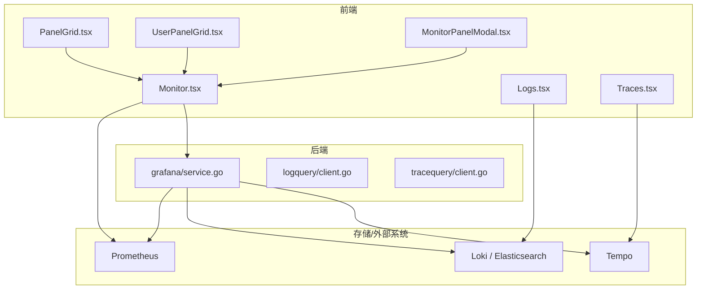
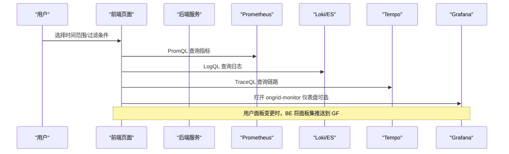
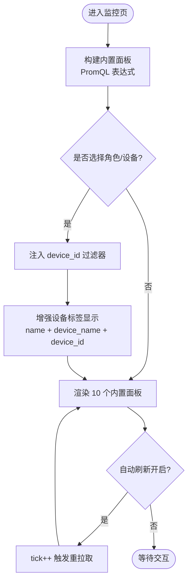
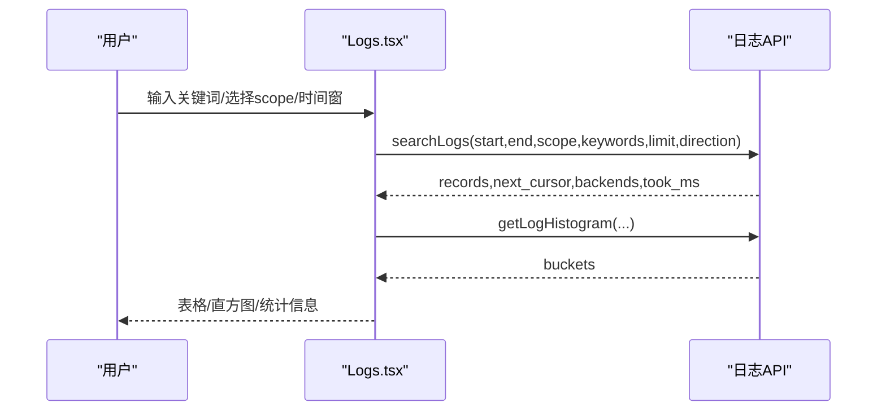
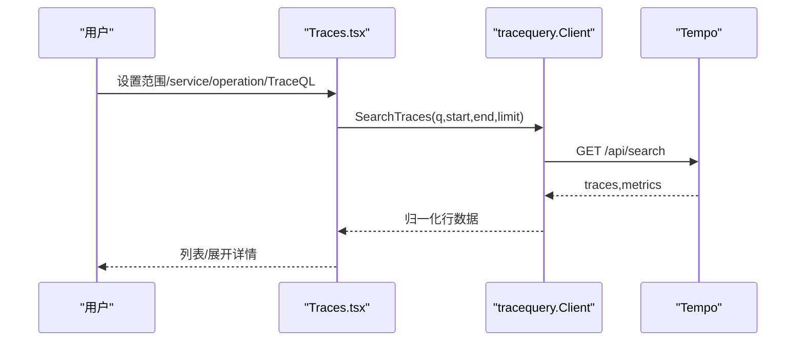
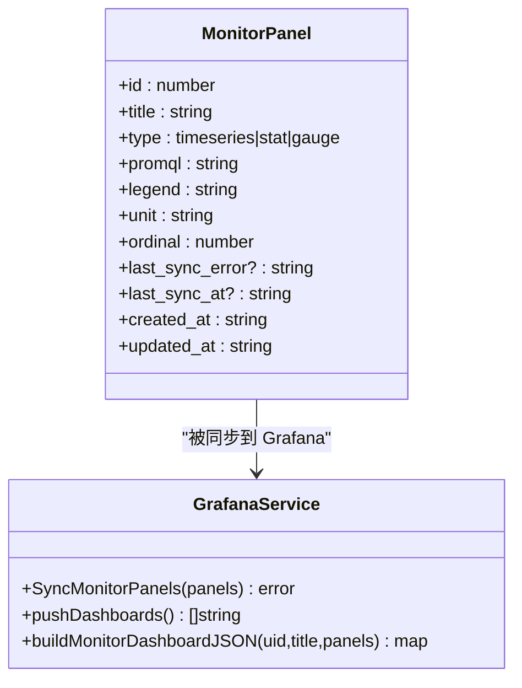
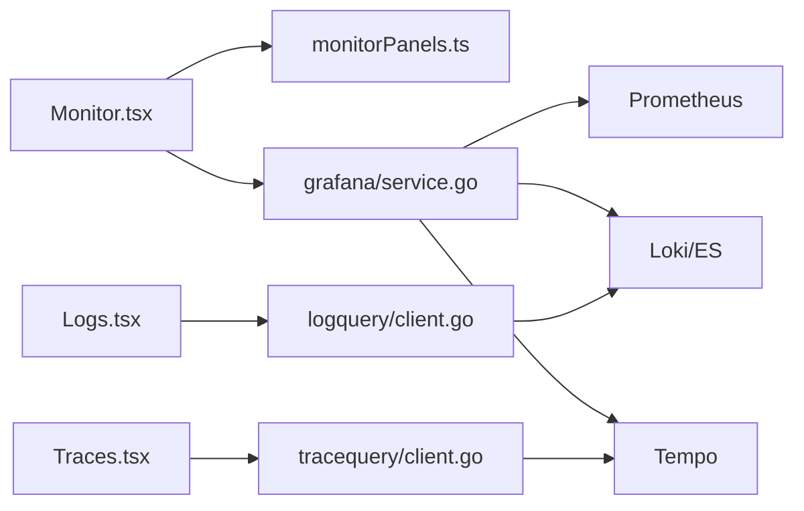

# 监控页面

<cite>
**本文引用的文件**
- [Monitor.tsx](file://web/src/pages/Monitor.tsx)
- [monitorPanels.ts](file://web/src/api/monitorPanels.ts)
- [PanelGrid.tsx](file://web/src/components/monitor/PanelGrid.tsx)
- [UserPanelGrid.tsx](file://web/src/components/monitor/UserPanelGrid.tsx)
- [MonitorPanelModal.tsx](file://web/src/components/MonitorPanelModal.tsx)
- [service.go](file://internal/manager/biz/grafana/service.go)
- [Logs.tsx](file://web/src/pages/Logs.tsx)
- [Traces.tsx](file://web/src/pages/Traces.tsx)
- [client.go (logquery)](file://internal/pkg/logquery/client.go)
- [client.go (tracequery)](file://internal/pkg/tracequery/client.go)
- [metric.proto](file://api/manager/metric/v1/metric.proto)
- [edges.ts](file://web/src/api/edges.ts)
</cite>

## 更新摘要
**变更内容**
- 增强了设备标签显示功能，当设备名称与主机名不同时，会同时显示两者以提高多主机场景下的设备识别能力
- 更新了设备选择器的显示逻辑，支持更清晰的设备标识
- 改进了多主机环境下的用户体验和设备区分度

## 目录
1. [简介](#简介)
2. [项目结构](#项目结构)
3. [核心组件](#核心组件)
4. [架构总览](#架构总览)
5. [详细组件分析](#详细组件分析)
6. [依赖关系分析](#依赖关系分析)
7. [性能考虑](#性能考虑)
8. [故障排查指南](#故障排查指南)
9. [结论](#结论)
10. [附录](#附录)

## 简介
本技术文档聚焦于监控系统相关页面的设计与实现，覆盖指标监控、日志查询、分布式追踪与网络拓扑可视化等能力。重点说明：
- 监控数据如何采集、存储与展示（Prometheus 时序、Loki/Elasticsearch 日志、Tempo 链路）
- 查询语言与过滤条件（PromQL、LogQL、TraceQL）及时间范围选择
- 如何在平台内新增自定义监控面板并同步到 Grafana
- 性能优化与用户体验改进的最佳实践

**最新更新**：设备标签显示功能已增强，在多主机场景下提供更好的设备识别能力。

## 项目结构
监控相关的前端页面位于 web/src/pages，核心包括：
- 监控（Monitor.tsx）：内置 10 个集群级指标面板 + 用户自定义面板，直接通过 PromQL 渲染，无需 Grafana JSON
- 日志（Logs.tsx）：基于 LogQL 的日志检索、直方图时间窗选择、字段筛选与导出
- 链路（Traces.tsx）：基于 TraceQL 的链路搜索与详情展开，支持服务/操作维度筛选
- 组件与 API：PanelGrid、MonitorPanelModal、monitorPanels.ts 等提供布局与面板管理

后端侧：
- Grafana 集成服务（service.go）：自动创建/更新 Prometheus/Loki/Elasticsearch 数据源，推送 ongrid-monitor 仪表盘，镜像前端面板
- 日志客户端（logquery/client.go）：封装 Loki query_range、label/values 接口
- 链路客户端（tracequery/client.go）：封装 Tempo search/tag values/get trace
- 主机指标协议（metric.proto）：定义 QueryHostMetrics 接口与点格式

**图表来源**
- [Monitor.tsx:95-266](file://web/src/pages/Monitor.tsx#L95-L266)
- [service.go:530-605](file://internal/manager/biz/grafana/service.go#L530-L605)
- [Logs.tsx:284-421](file://web/src/pages/Logs.tsx#L284-L421)
- [Traces.tsx:146-218](file://web/src/pages/Traces.tsx#L146-L218)

章节来源
- [Monitor.tsx:95-266](file://web/src/pages/Monitor.tsx#L95-L266)
- [service.go:530-605](file://internal/manager/biz/grafana/service.go#L530-L605)
- [Logs.tsx:284-421](file://web/src/pages/Logs.tsx#L284-L421)
- [Traces.tsx:146-218](file://web/src/pages/Traces.tsx#L146-L218)

## 核心组件
- 监控页面（Monitor.tsx）
  - 内置 10 个集群级指标面板（CPU/内存/磁盘/网络/Top 进程/负载饱和度/磁盘 IO/conntrack/TCP 连接数），使用 PromQL 直接查询
  - 支持角色/设备过滤，将 device_id 注入 PromQL 表达式
  - **新增功能**：增强的设备标签显示，当设备名称与主机名不同时，会同时显示两者以提高多主机场景下的设备识别能力
  - 支持时间范围与自动刷新；一键打开 Grafana 对应仪表盘
  - 用户自定义面板通过 /monitor/panels 增删改查，并异步同步至 Grafana ongrid-monitor 仪表盘
- 日志页面（Logs.tsx）
  - 支持关键词包含/排除、匹配模式、设备/角色/集群/工作负载/容器等多维筛选
  - 直方图拖拽选择时间窗，分页加载与导出 JSONL
  - 动态发现字段与值，辅助构建查询
- 链路页面（Traces.tsx）
  - 支持 TraceQL 与 service/operation 双通道筛选，快捷模板一键查询
  - 列表按开始时间倒序，支持 trace_id 直达查看
  - 一键跳转 Grafana Tempo Explore 进行深度分析
- Grafana 集成（service.go）
  - 自动创建/更新 Prometheus/Loki/Elasticsearch 数据源
  - 将前端面板集与用户面板合并为单一仪表盘（uid: ongrid-monitor），单向同步（ongrid → Grafana）
- 日志客户端（logquery/client.go）
  - 封装 Loki query_range、label names/values，统一超时与错误处理
- 链路客户端（tracequery/client.go）
  - 封装 Tempo search、tag values、get trace，统一超时与错误处理
- 主机指标协议（metric.proto）
  - 定义 QueryHostMetrics 请求/响应，含分辨率策略（RAW/M5/H1）

章节来源
- [Monitor.tsx:95-266](file://web/src/pages/Monitor.tsx#L95-L266)
- [monitorPanels.ts:1-60](file://web/src/api/monitorPanels.ts#L1-L60)
- [Logs.tsx:284-421](file://web/src/pages/Logs.tsx#L284-L421)
- [Traces.tsx:146-218](file://web/src/pages/Traces.tsx#L146-L218)
- [service.go:530-605](file://internal/manager/biz/grafana/service.go#L530-L605)
- [client.go (logquery):102-171](file://internal/pkg/logquery/client.go#L102-L171)
- [client.go (tracequery):89-157](file://internal/pkg/tracequery/client.go#L89-L157)
- [metric.proto:9-55](file://api/manager/metric/v1/metric.proto#L9-L55)

## 架构总览
监控体系由"前端页面 + 后端服务 + 外部可观测性后端"构成：
- 指标：前端通过 PromQL 调用后端代理或直接访问 Prometheus；Grafana 作为高级分析与持久化视图
- 日志：前端通过 LogQL 查询 Loki/Elasticsearch；后端 logquery 客户端负责转发与限流
- 链路：前端通过 TraceQL 查询 Tempo；后端 tracequery 客户端负责转发与解析
- 面板同步：用户自定义面板在 ongrid 中维护，后端将其映射为 Grafana 仪表盘并单向同步

**图表来源**
- [Monitor.tsx:95-266](file://web/src/pages/Monitor.tsx#L95-L266)
- [Logs.tsx:284-421](file://web/src/pages/Logs.tsx#L284-L421)
- [Traces.tsx:146-218](file://web/src/pages/Traces.tsx#L146-L218)
- [service.go:530-605](file://internal/manager/biz/grafana/service.go#L530-L605)

## 详细组件分析

### 指标监控（Monitor.tsx）
- 内置面板：10 个常用集群级指标，PromQL 表达式固定，避免依赖 Grafana JSON，首屏快
- 过滤机制：角色/设备过滤通过 injectDeviceIDFilter 将 device_id=~"..." 注入到每个目标表达式
- **设备标签显示增强**：在设备选择器中，当设备的 device_name 与 name 不同时，会同时显示两者，格式为 `设备名 (主机名) (#device_id)`，提高多主机场景下的设备识别能力
- 时间范围与刷新：支持 15m/1h/3h/6h/24h/3d/7d 预设；自动刷新以 tick 驱动各面板重拉取
- 自定义面板：通过 MonitorPanelModal 创建/编辑/删除，保存后异步同步到 Grafana ongrid-monitor 仪表盘
- 与 Grafana 联动：提供"在 Grafana 中打开"，跳转到统一仪表盘 uid=ongrid-monitor

**图表来源**
- [Monitor.tsx:95-266](file://web/src/pages/Monitor.tsx#L95-L266)
- [Monitor.tsx:276-418](file://web/src/pages/Monitor.tsx#L276-L418)

章节来源
- [Monitor.tsx:95-266](file://web/src/pages/Monitor.tsx#L95-L266)
- [Monitor.tsx:276-418](file://web/src/pages/Monitor.tsx#L276-L418)
- [monitorPanels.ts:1-60](file://web/src/api/monitorPanels.ts#L1-L60)
- [service.go:530-605](file://internal/manager/biz/grafana/service.go#L530-L605)

### 日志查询（Logs.tsx）
- 查询构造：支持 include/exclude 关键词、匹配模式（any/phrase）、设备/角色/集群/工作负载/容器/节点/文件/unit 等 scope 筛选
- 时间窗：支持预设范围与自定义起止时间；直方图拖拽选择时间窗并刷新
- 结果与导出：分页加载、显示耗时、后端标识；支持导出 JSONL（限制行数）
- 字段发现：动态获取字段名与值，辅助构建筛选条件

**图表来源**
- [Logs.tsx:284-421](file://web/src/pages/Logs.tsx#L284-L421)
- [client.go (logquery):102-171](file://internal/pkg/logquery/client.go#L102-L171)

章节来源
- [Logs.tsx:284-421](file://web/src/pages/Logs.tsx#L284-L421)
- [client.go (logquery):102-171](file://internal/pkg/logquery/client.go#L102-L171)

### 分布式追踪（Traces.tsx）
- 查询方式：TraceQL 优先；否则回退到 service/operation 维度筛选
- 快捷模板：常见场景一键填充并提交（如错误 trace、慢 trace）
- 结果展示：列表按开始时间倒序，支持 trace_id 直达查看；展开后可见 span 明细表
- 深度分析：一键跳转 Grafana Tempo Explore，携带当前查询上下文

**图表来源**
- [Traces.tsx:146-218](file://web/src/pages/Traces.tsx#L146-L218)
- [client.go (tracequery):89-157](file://internal/pkg/tracequery/client.go#L89-L157)

章节来源
- [Traces.tsx:146-218](file://web/src/pages/Traces.tsx#L146-L218)
- [client.go (tracequery):89-157](file://internal/pkg/tracequery/client.go#L89-L157)

### 自定义面板与 Grafana 同步
- 前端：MonitorPanelModal 收集标题、类型、PromQL、图例、单位；提交后调用 /monitor/panels
- 后端：grafana/service.go 将内置面板与用户面板合并，生成 ongrid-monitor 仪表盘 JSON 并推送至 Grafana
- 同步策略：单向（ongrid → Grafana），重复推送覆盖；失败记录 last_sync_error，不影响前端渲染

**图表来源**
- [monitorPanels.ts:1-60](file://web/src/api/monitorPanels.ts#L1-L60)
- [service.go:530-605](file://internal/manager/biz/grafana/service.go#L530-L605)

章节来源
- [monitorPanels.ts:1-60](file://web/src/api/monitorPanels.ts#L1-L60)
- [service.go:530-605](file://internal/manager/biz/grafana/service.go#L530-L605)

### 网络拓扑可视化
- 日志与链路页面均支持从 cluster/node/pod/container 等维度筛选，便于结合拓扑定位问题
- 可通过"在 Grafana 中打开"跳转到相应 Explore/Dashboard，利用已有拓扑能力进行关联分析

[本节为概念性说明，不直接分析具体文件]

## 依赖关系分析
- 前端页面依赖：
  - Monitor.tsx 依赖 PanelGrid、MonitorPanelModal、monitorPanels API
  - Logs.tsx 依赖日志 API（searchLogs、getLogHistogram、listLogFields、listLogFieldValues）
  - Traces.tsx 依赖链路 API（searchTraces、listTraceTagValues、getTrace）
- 后端服务依赖：
  - grafana/service.go 依赖 Prometheus/Loki/Elasticsearch 数据源配置与 Grafana 客户端
  - logquery/client.go 依赖 Loki 或兼容后端
  - tracequery/client.go 依赖 Tempo
- 外部系统：
  - Prometheus：指标时序存储与查询
  - Loki/Elasticsearch：日志存储与查询
  - Tempo：链路数据存储与查询
  - Grafana：仪表盘与 Explore 能力

**图表来源**
- [Monitor.tsx:95-266](file://web/src/pages/Monitor.tsx#L95-L266)
- [monitorPanels.ts:1-60](file://web/src/api/monitorPanels.ts#L1-L60)
- [service.go:530-605](file://internal/manager/biz/grafana/service.go#L530-L605)
- [client.go (logquery):102-171](file://internal/pkg/logquery/client.go#L102-L171)
- [client.go (tracequery):89-157](file://internal/pkg/tracequery/client.go#L89-L157)

章节来源
- [Monitor.tsx:95-266](file://web/src/pages/Monitor.tsx#L95-L266)
- [monitorPanels.ts:1-60](file://web/src/api/monitorPanels.ts#L1-L60)
- [service.go:530-605](file://internal/manager/biz/grafana/service.go#L530-L605)
- [client.go (logquery):102-171](file://internal/pkg/logquery/client.go#L102-L171)
- [client.go (tracequery):89-157](file://internal/pkg/tracequery/client.go#L89-L157)

## 性能考虑
- 指标面板
  - 使用 $__rate_interval 与聚合函数减少数据量；对多设备场景采用 avg/sum by(device_id) 降低噪声
  - 自动刷新间隔可调；隐藏标签页时暂停轮询，避免后台持续查询
- 日志查询
  - 直方图区间自适应窗口大小；分页加载限制单次返回行数；导出上限控制
  - 字段值发现并发限制，避免过多并行请求
- 链路查询
  - 默认不主动查询，避免昂贵的全量扫描；提供快捷模板快速缩小范围
  - 列表限制条数，必要时引导用户加 TraceQL 或缩小时间窗
- Grafana 同步
  - 单向同步，失败不影响前端渲染；重复推送覆盖同一仪表盘，避免碎片化
- **设备标签显示优化**
  - 设备名称比较仅在渲染时进行，避免不必要的计算开销
  - 条件显示逻辑确保只在设备名称与主机名不同时才显示主机名，减少UI复杂度

[本节提供通用指导，不直接分析具体文件]

## 故障排查指南
- 无法打开 Grafana 仪表盘
  - 检查 Grafana root_url 与认证（sa_token/api_key）是否正确配置
  - 确认 ongrid-monitor 仪表盘已同步成功
- 自定义面板未生效
  - 查看 last_sync_error 与 last_sync_at，确认同步失败原因
  - 确保 PromQL 表达式有效且数据源可用
- 日志查询无结果
  - 检查时间窗与关键词/筛选条件；尝试扩大时间范围或简化查询
  - 确认日志后端已启用且可达
- 链路查询缓慢或为空
  - 使用 TraceQL 精确过滤；缩小时间窗或服务/操作维度
  - 若仅知 trace_id，直接使用 trace_id 直达查看
- **设备显示问题**
  - 检查 Edge 对象的 name 和 device_name 字段是否正确填充
  - 确认设备数据源正常，device_id 字段存在
  - 验证设备选择器选项是否正确生成

章节来源
- [service.go:530-605](file://internal/manager/biz/grafana/service.go#L530-L605)
- [Logs.tsx:284-421](file://web/src/pages/Logs.tsx#L284-L421)
- [Traces.tsx:146-218](file://web/src/pages/Traces.tsx#L146-L218)
- [Monitor.tsx:550-570](file://web/src/pages/Monitor.tsx#L550-L570)

## 结论
本监控系统通过"前端原生渲染 + 后端 Grafana 同步"的方式，实现了指标、日志、链路的统一可观测体验。内置面板满足日常巡检需求，用户自定义面板扩展了灵活性；日志与链路页面提供了强大的查询与探索能力。通过合理的查询语言、过滤条件与时间范围选择，以及性能优化与用户体验改进，系统在易用性与可扩展性之间取得了良好平衡。

**最新改进**：设备标签显示功能的增强显著提升了多主机场景下的设备识别能力，通过同时显示设备名称和主机名，帮助用户更准确地识别和选择目标设备。

[本节总结性内容，不直接分析具体文件]

## 附录
- 添加新监控视图的步骤建议
  - 在 Monitor.tsx 的内置面板集合中添加新的 PromQL 表达式，并确保与现有过滤逻辑兼容
  - 如需持久化，可在 MonitorPanelModal 中创建用户面板，并通过 /monitor/panels 管理
  - 验证 Grafana ongrid-monitor 仪表盘是否同步成功
- 自定义面板最佳实践
  - 使用聚合函数与$__rate_interval 控制数据量
  - 合理设置单位与图例，提升可读性
  - 关注 last_sync_error，及时处理同步失败
- 日志与链路查询优化
  - 优先使用精确筛选（设备/服务/操作/关键词）
  - 合理使用时间窗与分页，避免大窗口全量扫描
  - 借助直方图与快捷模板快速定位问题
- **设备显示优化建议**
  - 确保设备名称具有描述性，便于用户识别
  - 在设备管理中保持 name 和 device_name 的一致性
  - 利用增强的设备标签显示功能，在多主机环境中提供更清晰的信息

[本节为概念性指导，不直接分析具体文件]