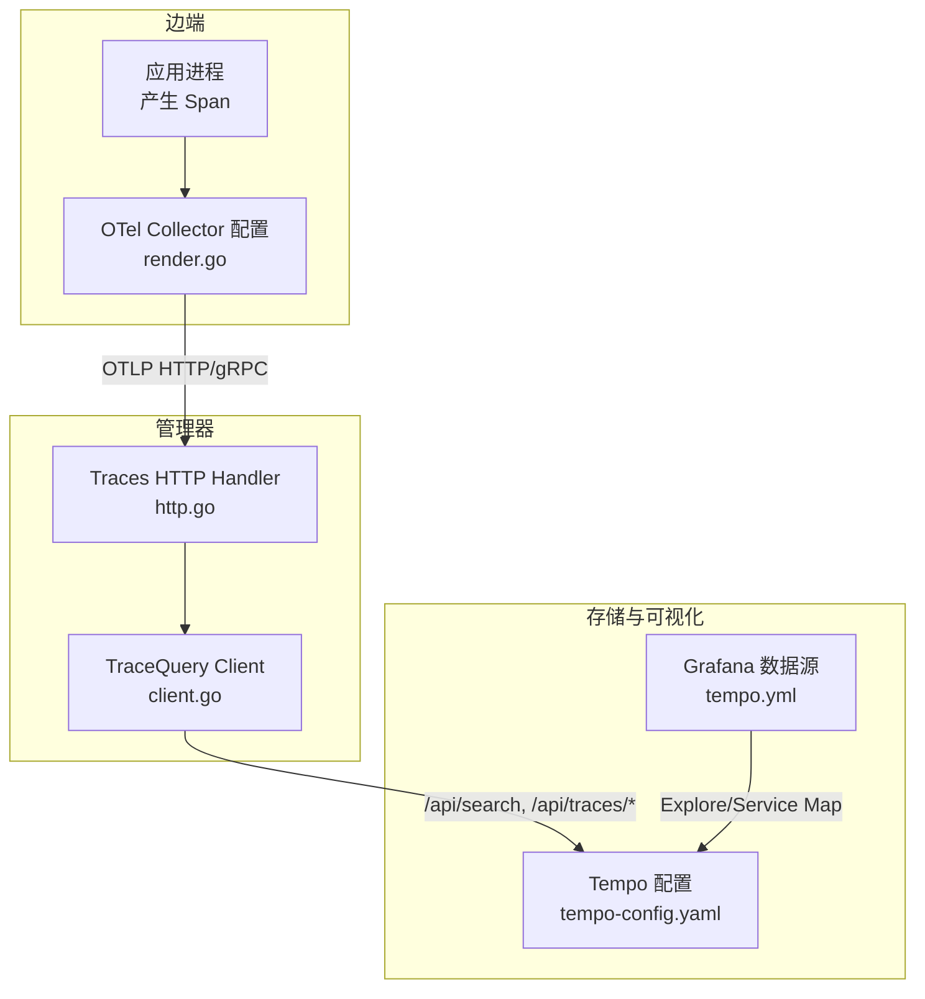
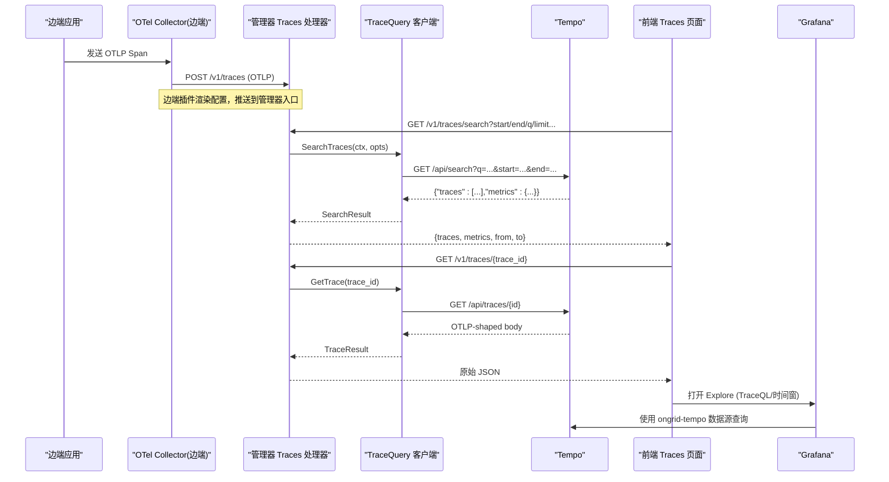
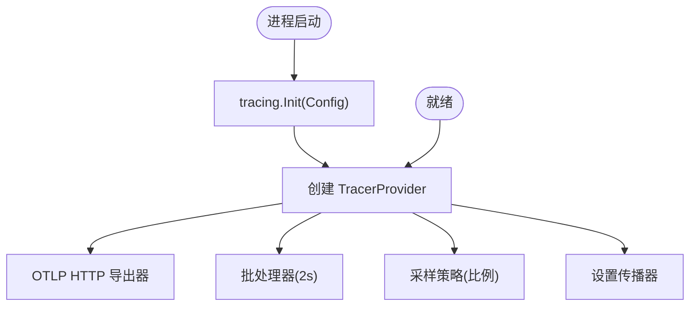
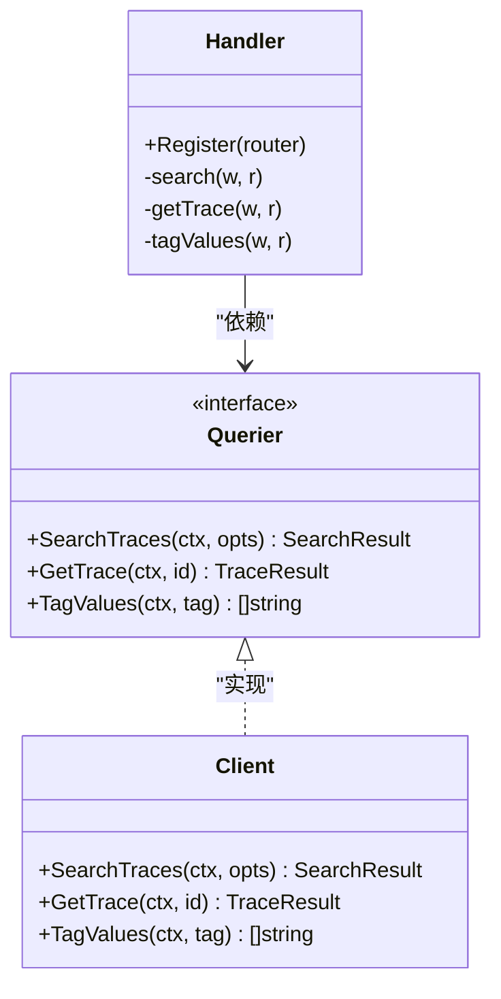
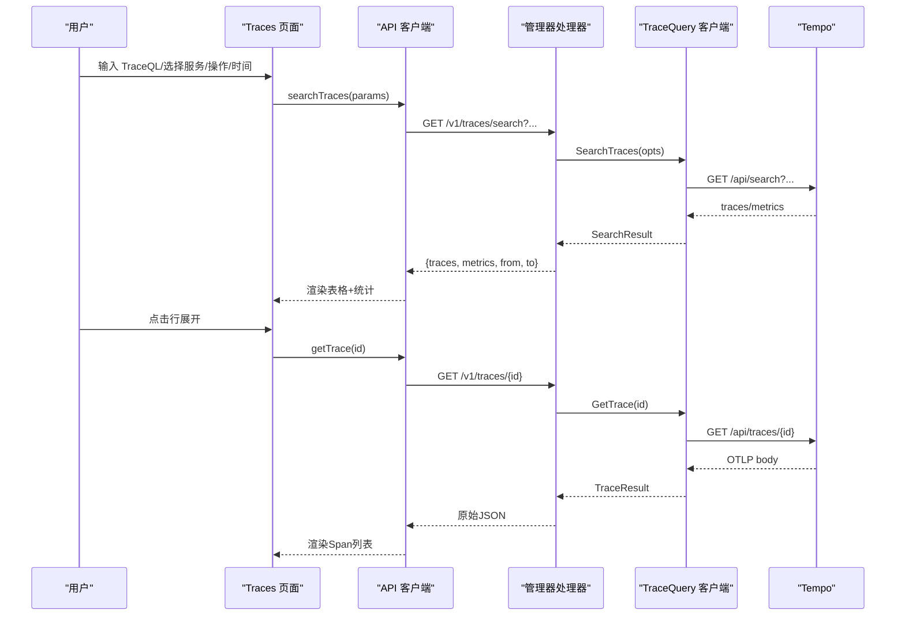
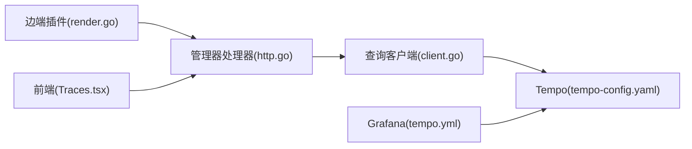

# 链路追踪

<cite>
**本文引用的文件**
- [internal/pkg/tracing/tracing.go](file://internal/pkg/tracing/tracing.go)
- [internal/pkg/tracequery/client.go](file://internal/pkg/tracequery/client.go)
- [internal/manager/server/traces/http.go](file://internal/manager/server/traces/http.go)
- [web/src/pages/Traces.tsx](file://web/src/pages/Traces.tsx)
- [web/src/api/traces.ts](file://web/src/api/traces.ts)
- [deploy/grafana/provisioning/datasources/tempo.yml](file://deploy/grafana/provisioning/datasources/tempo.yml)
- [deploy/install/tempo-config.yaml](file://deploy/install/tempo-config.yaml)
- [internal/edgeagent/plugins/traces/render.go](file://internal/edgeagent/plugins/traces/render.go)
- [internal/manager/biz/knowledge/builtin_vault/systems/observability-stack/tempo.md](file://internal/manager/biz/knowledge/builtin_vault/systems/observability-stack/tempo.md)
</cite>

## 目录
1. [简介](#简介)
2. [项目结构](#项目结构)
3. [核心组件](#核心组件)
4. [架构总览](#架构总览)
5. [详细组件分析](#详细组件分析)
6. [依赖关系分析](#依赖关系分析)
7. [性能与大数据处理](#性能与大数据处理)
8. [故障定位与排障指南](#故障定位与排障指南)
9. [结论](#结论)
10. [附录：开发示例与扩展指引](#附录开发示例与扩展指引)

## 简介
本技术文档围绕 ongrid 的链路追踪能力，系统性说明如何基于 Tempo 实现分布式追踪数据的采集、存储、查询与可视化。内容覆盖 Trace ID 搜索、Span 列表展示、性能指标分析与故障定位；并解释过滤、排序、钻取等交互逻辑，以及采样策略、查询优化和大数据量处理方案。最后提供在现有代码基础上添加新追踪视图与分析工具的实践示例。

## 项目结构
链路追踪涉及“边端采集 → 管理器代理 → 后端存储（Tempo）→ 前端展示/Grafana 联动”的完整链路。关键目录与职责如下：
- 边端采集与转发：edgeagent 插件负责生成 OTel Collector 配置，将本地应用产生的 Span 通过 OTLP HTTP/gRPC 推送到管理器的 /v1/traces 入口。
- 管理器代理：manager server 暴露 /v1/traces/* 接口，对前端请求进行鉴权与参数校验后，调用 tracequery 客户端访问 Tempo。
- 查询客户端：tracequery 封装 Tempo 的 /api/search、/api/traces/<id>、/api/search/tag/*/values 等 API，返回原始 JSON，便于跨版本兼容。
- 前端页面：Traces.tsx 提供 TraceQL、服务/操作筛选、时间范围、Trace ID 直达、实时轮询、Grafana 跳转等功能。
- Grafana 集成：provisioning 中配置 ongrid-tempo 数据源，启用 tracesToLogs、tracesToMetrics、serviceMap 等能力。
- Tempo 配置：单二进制部署，开启 OTLP 接收器、spanmetrics 与 service-graph 生成器，持久化到本地磁盘，保留期默认 7 天。

图表来源
- [internal/edgeagent/plugins/traces/render.go:34-260](file://internal/edgeagent/plugins/traces/render.go#L34-L260)
- [internal/manager/server/traces/http.go:49-57](file://internal/manager/server/traces/http.go#L49-L57)
- [internal/pkg/tracequery/client.go:111-200](file://internal/pkg/tracequery/client.go#L111-L200)
- [deploy/install/tempo-config.yaml:6-50](file://deploy/install/tempo-config.yaml#L6-L50)
- [deploy/grafana/provisioning/datasources/tempo.yml:1-50](file://deploy/grafana/provisioning/datasources/tempo.yml#L1-L50)

章节来源
- [internal/edgeagent/plugins/traces/render.go:34-260](file://internal/edgeagent/plugins/traces/render.go#L34-L260)
- [internal/manager/server/traces/http.go:49-57](file://internal/manager/server/traces/http.go#L49-L57)
- [internal/pkg/tracequery/client.go:111-200](file://internal/pkg/tracequery/client.go#L111-L200)
- [deploy/install/tempo-config.yaml:6-50](file://deploy/install/tempo-config.yaml#L6-L50)
- [deploy/grafana/provisioning/datasources/tempo.yml:1-50](file://deploy/grafana/provisioning/datasources/tempo.yml#L1-L50)

## 核心组件
- 追踪初始化与采样：tracing.Init 注册全局 TracerProvider，设置 OTLP HTTP 导出器、资源属性（服务名）、批处理器与采样率，支持 Insecure 模式以适配 Docker 网络或生产 TLS 代理。
- 查询客户端：tracequery.Client 封装 Tempo 的搜索、标签值枚举与按 ID 获取详情，统一超时与错误处理，保持响应体为原始 JSON 以兼容不同 Tempo 版本。
- 管理器代理：server/traces/http.go 提供 /v1/traces/search、/v1/traces/{trace_id}、/v1/traces/tags/{tag}/values 三个路由，完成鉴权后的参数校验、上下文超时控制与结果透传。
- 前端界面：web/src/pages/Traces.tsx 提供 TraceQL、服务/操作筛选、时间范围、Trace ID 直达、快速预设、实时轮询、Grafana Explore 跳转、Span 列表渲染等。
- Grafana 数据源：tempo.yml 配置 ongrid-tempo 数据源，启用 tracesToLogsV2、tracesToMetrics、serviceMap、nodeGraph 等能力，打通日志与指标联动。
- Tempo 配置：tempo-config.yaml 定义 OTLP 接收器、块保留期、spanmetrics/service-graph 生成器及写入 Prometheus 的路径。

章节来源
- [internal/pkg/tracing/tracing.go:35-106](file://internal/pkg/tracing/tracing.go#L35-L106)
- [internal/pkg/tracequery/client.go:16-200](file://internal/pkg/tracequery/client.go#L16-L200)
- [internal/manager/server/traces/http.go:49-196](file://internal/manager/server/traces/http.go#L49-L196)
- [web/src/pages/Traces.tsx:146-331](file://web/src/pages/Traces.tsx#L146-L331)
- [deploy/grafana/provisioning/datasources/tempo.yml:1-50](file://deploy/grafana/provisioning/datasources/tempo.yml#L1-L50)
- [deploy/install/tempo-config.yaml:6-50](file://deploy/install/tempo-config.yaml#L6-L50)

## 架构总览
下图展示了从边端到前端的完整调用链，包括采集、代理、查询与可视化。

图表来源
- [internal/edgeagent/plugins/traces/render.go:137-163](file://internal/edgeagent/plugins/traces/render.go#L137-L163)
- [internal/manager/server/traces/http.go:66-176](file://internal/manager/server/traces/http.go#L66-L176)
- [internal/pkg/tracequery/client.go:111-200](file://internal/pkg/tracequery/client.go#L111-L200)
- [web/src/pages/Traces.tsx:188-331](file://web/src/pages/Traces.tsx#L188-L331)
- [deploy/grafana/provisioning/datasources/tempo.yml:18-50](file://deploy/grafana/provisioning/datasources/tempo.yml#L18-L50)

## 详细组件分析

### 追踪数据采集与采样
- 初始化：tracing.Init 创建 TracerProvider，设置 OTLP HTTP 导出器、资源属性（服务名）、批处理器（2 秒刷新）与采样率（默认全采）。
- 传播：设置 TextMapPropagator 组合 TraceContext 与 Baggage，保证跨进程/服务的追踪上下文传递。
- 边端推送：edgeagent 插件渲染 OTel Collector 配置，监听本地 gRPC/HTTP，注入 device_id 等资源属性，批量发送到管理器 /v1/traces。

图表来源
- [internal/pkg/tracing/tracing.go:60-106](file://internal/pkg/tracing/tracing.go#L60-L106)
- [internal/edgeagent/plugins/traces/render.go:34-163](file://internal/edgeagent/plugins/traces/render.go#L34-L163)

章节来源
- [internal/pkg/tracing/tracing.go:35-106](file://internal/pkg/tracing/tracing.go#L35-L106)
- [internal/edgeagent/plugins/traces/render.go:34-163](file://internal/edgeagent/plugins/traces/render.go#L34-L163)

### 查询与代理层
- 管理器路由：/v1/traces/search 解析 start/end、limit、minDuration/maxDuration、q（TraceQL），当 q 为空时根据 service/operation 构建 Tags 映射；/v1/traces/{trace_id} 直接获取详情；/v1/traces/tags/{tag}/values 枚举标签值。
- 客户端：tracequery.Client 构造 URL、设置 Accept 头、限制响应体大小（16 MiB）、统一非 2xx 错误处理。
- 兼容性：SearchResult.Traces 与 TraceResult.Body 均保留原始 JSON，避免版本差异导致字段丢失。

图表来源
- [internal/manager/server/traces/http.go:29-57](file://internal/manager/server/traces/http.go#L29-L57)
- [internal/pkg/tracequery/client.go:16-200](file://internal/pkg/tracequery/client.go#L16-L200)

章节来源
- [internal/manager/server/traces/http.go:66-196](file://internal/manager/server/traces/http.go#L66-L196)
- [internal/pkg/tracequery/client.go:111-200](file://internal/pkg/tracequery/client.go#L111-L200)

### 前端展示与交互
- 筛选与搜索：支持 TraceQL、服务/操作下拉选择、时间范围、Trace ID 直达；点击快捷预设一键执行常用查询。
- 列表与排序：搜索结果按开始时间倒序排列；达到上限提示缩小时间窗或增加 TraceQL 过滤。
- 详情展开：点击行展开 Span 列表（扁平化），按耗时降序显示，便于快速定位慢 Span。
- 实时模式：每 5 秒自动刷新，适合监控场景。
- 深度分析：一键跳转到 Grafana Explore，携带当前 TraceQL 与时间窗。

图表来源
- [web/src/pages/Traces.tsx:188-331](file://web/src/pages/Traces.tsx#L188-L331)
- [web/src/api/traces.ts:81-112](file://web/src/api/traces.ts#L81-L112)
- [internal/manager/server/traces/http.go:66-176](file://internal/manager/server/traces/http.go#L66-L176)
- [internal/pkg/tracequery/client.go:111-200](file://internal/pkg/tracequery/client.go#L111-L200)

章节来源
- [web/src/pages/Traces.tsx:146-800](file://web/src/pages/Traces.tsx#L146-L800)
- [web/src/api/traces.ts:81-112](file://web/src/api/traces.ts#L81-L112)

### Grafana 与 Tempo 集成
- 数据源：ondrid-tempo 指向 $ONGRID_TRACE_QUERY_URL，启用 tracesToLogsV2（关联 Loki）、tracesToMetrics（关联 Prometheus，基于 spanmetrics）、serviceMap、nodeGraph。
- 指标联动：通过 spanmetrics 生成 traces_spanmetrics_* 指标，供告警与面板复用。
- 探索链接：前端构建 Explore URL，携带 TraceQL 表达式与时间窗，方便高级分析。

章节来源
- [deploy/grafana/provisioning/datasources/tempo.yml:1-50](file://deploy/grafana/provisioning/datasources/tempo.yml#L1-L50)
- [web/src/pages/Traces.tsx:303-331](file://web/src/pages/Traces.tsx#L303-L331)

### Tempo 存储与保留策略
- 接收器：distributor 同时暴露 gRPC 与 HTTP 接收 OTLP。
- 写入与压缩：ingester 缓冲 Span，构建块并落盘；compactor 合并小块，保留 7 天。
- 指标生成：metrics_generator 生成 span-metrics 与 service-graph，remote_write 到 Prometheus。
- 容量限制：per-trace 最大字节数限制，防止超大 Trace 影响系统稳定性。

章节来源
- [deploy/install/tempo-config.yaml:6-77](file://deploy/install/tempo-config.yaml#L6-L77)

## 依赖关系分析
- 边端插件依赖管理器 OTLP 写入口，确保设备标识与资源属性注入。
- 管理器处理器依赖 tracequery 客户端，解耦后端实现，便于替换（如 VictoriaTraces）。
- 前端依赖管理器 REST API，不直接暴露 Tempo 查询端口，增强安全性。
- Grafana 通过数据源配置与 Tempo 交互，并与 Loki/Prometheus 联动。

图表来源
- [internal/edgeagent/plugins/traces/render.go:137-163](file://internal/edgeagent/plugins/traces/render.go#L137-L163)
- [internal/manager/server/traces/http.go:49-57](file://internal/manager/server/traces/http.go#L49-L57)
- [internal/pkg/tracequery/client.go:111-200](file://internal/pkg/tracequery/client.go#L111-L200)
- [deploy/grafana/provisioning/datasources/tempo.yml:1-50](file://deploy/grafana/provisioning/datasources/tempo.yml#L1-L50)

章节来源
- [internal/edgeagent/plugins/traces/render.go:137-163](file://internal/edgeagent/plugins/traces/render.go#L137-L163)
- [internal/manager/server/traces/http.go:49-57](file://internal/manager/server/traces/http.go#L49-L57)
- [internal/pkg/tracequery/client.go:111-200](file://internal/pkg/tracequery/client.go#L111-L200)
- [deploy/grafana/provisioning/datasources/tempo.yml:1-50](file://deploy/grafana/provisioning/datasources/tempo.yml#L1-L50)

## 性能与大数据处理
- 采样策略：tracing.Init 支持 SamplingRatio（0..1），默认全采；在高吞吐场景可下调至 0.1 以降低 Span 体积。
- 批处理：TracerProvider 使用 2 秒批刷新，减少网络开销并提升实时性。
- 查询优化：
  - 优先使用 TraceQL 精确过滤，避免宽泛属性扫描。
  - 合理设置时间窗口与 limit（默认 100，上限 1000）。
  - 使用服务/操作 facet 降低扫描范围。
- 大数据量处理：
  - Tempo 无 Span 属性索引，TraceQL 扫描代价高；建议结合 spanmetrics 指标告警与 exemplar 回查。
  - 限制单次响应体大小（16 MiB），避免大 Trace 拖垮内存。
  - 调整 compaction 与 block_retention 平衡检索性能与存储成本。
- 实时模式：前端每 5 秒轮询，适合监控；注意在高负载下适当放宽时间窗或增加过滤条件。

章节来源
- [internal/pkg/tracing/tracing.go:48-106](file://internal/pkg/tracing/tracing.go#L48-L106)
- [internal/pkg/tracequery/client.go:47-49](file://internal/pkg/tracequery/client.go#L47-L49)
- [internal/manager/server/traces/http.go:87-95](file://internal/manager/server/traces/http.go#L87-L95)
- [deploy/install/tempo-config.yaml:23-77](file://deploy/install/tempo-config.yaml#L23-L77)
- [internal/manager/biz/knowledge/builtin_vault/systems/observability-stack/tempo.md:6-46](file://internal/manager/biz/knowledge/builtin_vault/systems/observability-stack/tempo.md#L6-L46)

## 故障定位与排障指南
- 常见问题：
  - 无匹配结果：检查时间窗是否过窄、TraceQL 是否过于严格或服务/操作筛选是否正确。
  - 查询缓慢：扩大时间窗或使用更精确的 TraceQL；必要时切换到 Grafana Explore 进行高级分析。
  - 后端不可用：确认 Tempo 运行状态与 ongrid-tempo 数据源配置正确。
- 诊断步骤：
  - 使用 Trace ID 直达查看具体 Trace 详情。
  - 通过 Grafana tracesToLogsV2 跳转到对应日志流，交叉验证错误信息。
  - 检查 spanmetrics 指标（调用量、错误率、延迟）定位异常服务。
- 错误处理：
  - 管理器处理器对非法参数返回 4xx，对后端错误返回 5xx，前端统一展示错误消息。
  - 客户端限制响应体大小，避免大错误页污染日志。

章节来源
- [web/src/pages/Traces.tsx:527-604](file://web/src/pages/Traces.tsx#L527-L604)
- [internal/manager/server/traces/http.go:66-196](file://internal/manager/server/traces/http.go#L66-L196)
- [internal/pkg/tracequery/client.go:203-252](file://internal/pkg/tracequery/client.go#L203-L252)

## 结论
本方案通过边端 OTel Collector 采集 Span，经管理器安全代理查询 Tempo，并在前端提供直观的 TraceQL 与 facet 筛选、Trace ID 直达、Span 列表与 Grafana 联动。配合 spanmetrics 与保留策略，满足中小规模环境下的链路追踪需求。在高吞吐场景可通过采样、查询优化与存储调优保障性能与稳定性。

## 附录：开发示例与扩展指引

### 新增追踪视图（示例）
目标：在 Traces 页面增加一个“按错误率排序的服务 TopN”视图。
步骤：
- 在前端新增按钮与查询逻辑，调用 listTraceTagValues("service.name") 获取服务列表。
- 使用 Grafana Explore 或 Prometheus 查询 traces_spanmetrics_calls_total 与 error 比率，聚合 TopN。
- 将结果映射为 TraceRow 格式，复用现有表格渲染。

参考路径
- [web/src/pages/Traces.tsx:252-269](file://web/src/pages/Traces.tsx#L252-L269)
- [web/src/api/traces.ts:107-112](file://web/src/api/traces.ts#L107-L112)
- [deploy/grafana/provisioning/datasources/tempo.yml:31-43](file://deploy/grafana/provisioning/datasources/tempo.yml#L31-L43)

### 新增分析工具（示例）
目标：在 Traces 页面增加“慢调用分布图”，展示各服务的平均耗时分布。
步骤：
- 使用 Grafana Explore 的 TraceQL 查询 {duration > 1s}，按 service.name 分组统计。
- 将 Explore URL 通过 openObservabilityUrl 打开，或在页面内嵌入 iframe。
- 可选：在管理器侧新增聚合接口，缓存热点查询结果以提升性能。

参考路径
- [web/src/pages/Traces.tsx:303-331](file://web/src/pages/Traces.tsx#L303-L331)
- [internal/manager/server/traces/http.go:66-152](file://internal/manager/server/traces/http.go#L66-L152)

### 接入外部 Tempo（示例）
目标：将边端与 Grafana 指向外部 Tempo。
步骤：
- 在集成设置中填写外部 Tempo 的 OTLP HTTP 端点（含 /v1/traces）。
- 更新 Grafana 数据源 URL 为外部地址。
- 验证边端插件推送成功与前端查询可用。

参考路径
- [web/src/pages/settings/Integrations.tsx:1571-1687](file://web/src/pages/settings/Integrations.tsx#L1571-L1687)
- [deploy/grafana/provisioning/datasources/tempo.yml:13-16](file://deploy/grafana/provisioning/datasources/tempo.yml#L13-L16)
- [internal/edgeagent/plugins/traces/render.go:137-163](file://internal/edgeagent/plugins/traces/render.go#L137-L163)