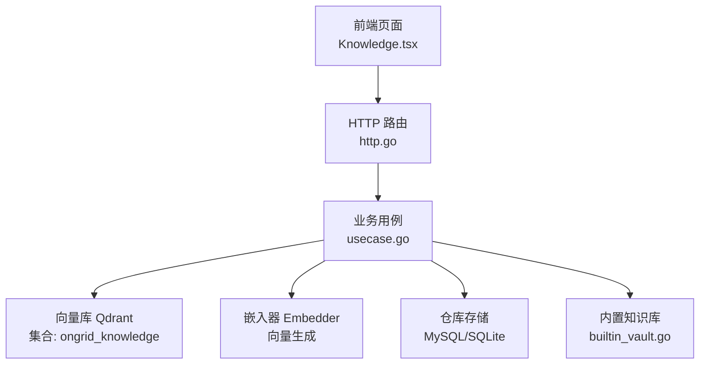
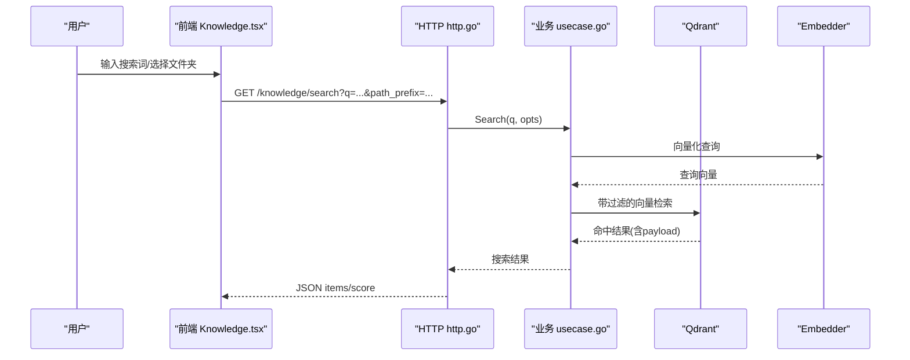
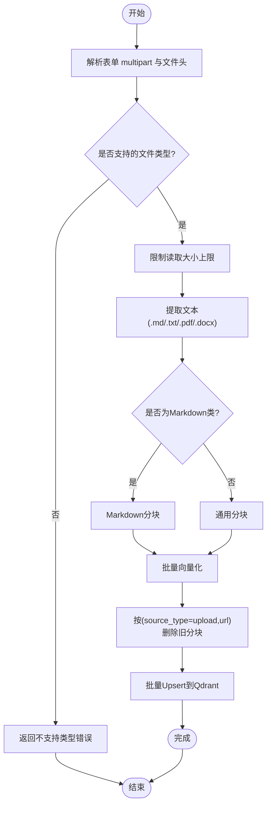
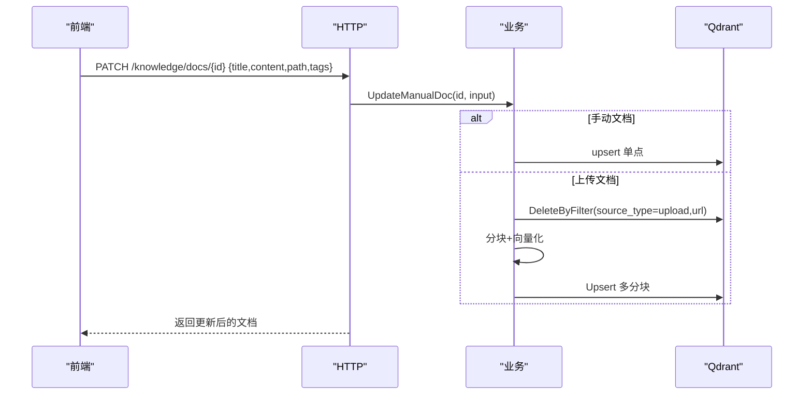
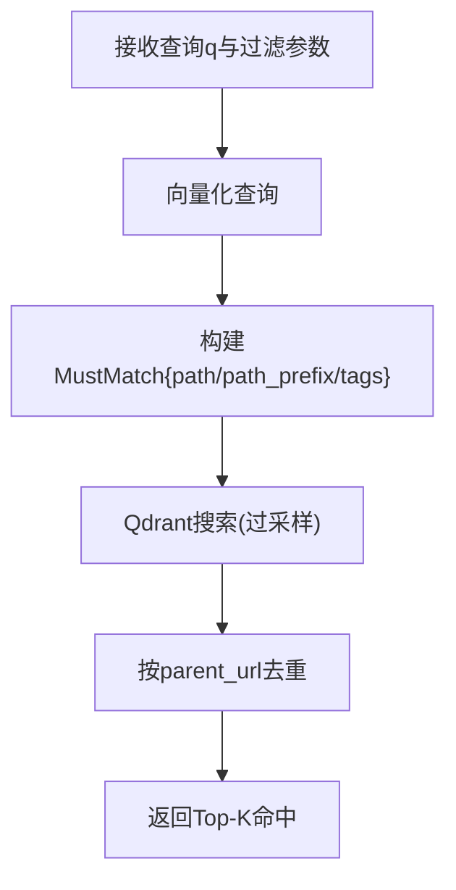
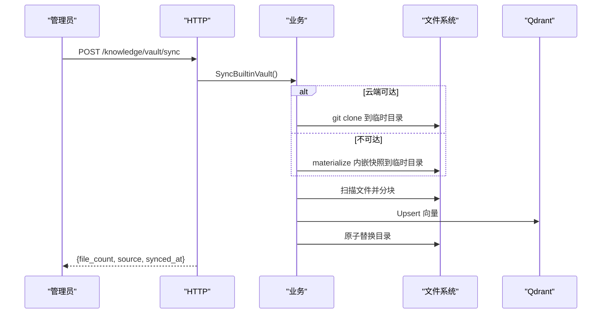
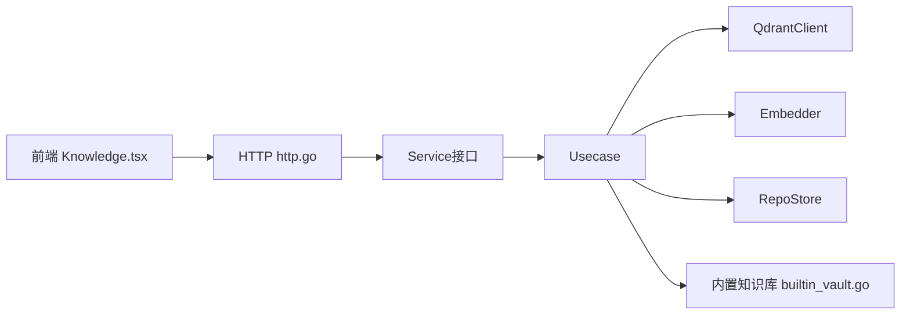

# 知识库页面

<cite>
**本文引用的文件**
- [internal/manager/biz/knowledge/usecase.go](file://internal/manager/biz/knowledge/usecase.go)
- [internal/manager/server/knowledge/http.go](file://internal/manager/server/knowledge/http.go)
- [internal/manager/model/knowledge/model.go](file://internal/manager/model/knowledge/model.go)
- [internal/manager/biz/knowledge/builtin_vault.go](file://internal/manager/biz/knowledge/builtin_vault.go)
- [web/src/pages/Knowledge.tsx](file://web/src/pages/Knowledge.tsx)
- [web/src/api/knowledge.ts](file://web/src/api/knowledge.ts)
</cite>

## 目录
1. [简介](#简介)
2. [项目结构](#项目结构)
3. [核心组件](#核心组件)
4. [架构总览](#架构总览)
5. [详细组件分析](#详细组件分析)
6. [依赖关系分析](#依赖关系分析)
7. [性能与缓存策略](#性能与缓存策略)
8. [故障排查指南](#故障排查指南)
9. [结论](#结论)
10. [附录：开发示例与最佳实践](#附录：开发示例与最佳实践)

## 简介
本技术文档面向“知识库页面”的完整实现，覆盖文档内容管理、版本控制、搜索与权限控制；详细说明上传、编辑、预览与发布流程，以及多格式文档处理；解释知识仓库配置、同步机制与缓存策略；并提供扩展新文档类型与检索优化的实践建议。

## 项目结构
知识库功能由前端页面、后端 HTTP 路由、业务用例（Usecase）、数据模型与内置知识库资源组成：
- 前端页面：展示文件夹树、文档列表、搜索、上传与编辑交互
- HTTP 层：定义 REST API，鉴权与审计
- 业务层：文档 CRUD、分块嵌入、向量检索、仓库同步、内置知识库同步
- 数据模型：仓库注册、SSH 身份、文档实体、过滤与搜索结果
- 内置知识库：以嵌入式文件形式提供平台级知识素材，支持云端优先、离线回退

图表来源
- [web/src/pages/Knowledge.tsx:1-120](file://web/src/pages/Knowledge.tsx#L1-L120)
- [internal/manager/server/knowledge/http.go:110-137](file://internal/manager/server/knowledge/http.go#L110-L137)
- [internal/manager/biz/knowledge/usecase.go:125-171](file://internal/manager/biz/knowledge/usecase.go#L125-L171)
- [internal/manager/biz/knowledge/builtin_vault.go:54-77](file://internal/manager/biz/knowledge/builtin_vault.go#L54-L77)

章节来源
- [web/src/pages/Knowledge.tsx:1-120](file://web/src/pages/Knowledge.tsx#L1-L120)
- [internal/manager/server/knowledge/http.go:110-137](file://internal/manager/server/knowledge/http.go#L110-L137)
- [internal/manager/biz/knowledge/usecase.go:125-171](file://internal/manager/biz/knowledge/usecase.go#L125-L171)
- [internal/manager/biz/knowledge/builtin_vault.go:54-77](file://internal/manager/biz/knowledge/builtin_vault.go#L54-L77)

## 核心组件
- 文档生命周期
  - 创建：手动粘贴 Markdown（source_type=manual）或上传文件（source_type=upload）
  - 更新：修改标题、内容、路径、标签；上传类文档会重新分块并嵌入
  - 移动：拖拽到目标文件夹，仅更新路径；上传类文档需重嵌入
  - 删除：手动文档直接删除点；上传文档按 URL 批量删除其所有分块
- 搜索
  - 语义检索：将查询文本向量化后在 Qdrant 中做余弦相似度 Top-K
  - 过滤：支持 path、path_prefix、tags 等字段在服务端精确匹配
- 仓库同步
  - 注册 Git 仓库，拉取 .md/.txt/.rst/.yaml/.yml/.toml/.json 等文件进行分块与嵌入
  - 内置知识库：优先从云端仓库克隆，不可达时回退到二进制内嵌快照
- 权限与审计
  - 写操作通过中间件校验对象与动作（如 knowledge:doc write/delete）
  - 关键操作记录审计事件（创建/同步/删除仓库等）

章节来源
- [internal/manager/biz/knowledge/usecase.go:187-402](file://internal/manager/biz/knowledge/usecase.go#L187-L402)
- [internal/manager/server/knowledge/http.go:110-137](file://internal/manager/server/knowledge/http.go#L110-L137)
- [internal/manager/server/knowledge/http.go:425-456](file://internal/manager/server/knowledge/http.go#L425-L456)
- [internal/manager/biz/knowledge/builtin_vault.go:54-77](file://internal/manager/biz/knowledge/builtin_vault.go#L54-L77)

## 架构总览
知识库系统采用“前端页面 + HTTP 路由 + 业务用例 + 向量库”的分层架构。文档内容以分块向量存储在 Qdrant，元数据（路径、标签、来源等）作为 payload 索引；仓库同步将远程内容落地为本地文件后再走统一的分块与嵌入流水线；内置知识库通过嵌入式文件原子替换，保证并发安全。

图表来源
- [web/src/pages/Knowledge.tsx:248-265](file://web/src/pages/Knowledge.tsx#L248-L265)
- [web/src/api/knowledge.ts:114-128](file://web/src/api/knowledge.ts#L114-L128)
- [internal/manager/server/knowledge/http.go:425-456](file://internal/manager/server/knowledge/http.go#L425-L456)
- [internal/manager/biz/knowledge/usecase.go:754-800](file://internal/manager/biz/knowledge/usecase.go#L754-L800)

## 详细组件分析

### 文档上传与处理流程（多格式）
- 支持的上传格式：.md/.markdown/.txt/.pdf/.docx
- 解析与提取：使用文档提取器将 PDF/DOCX 转为纯文本，保留标题层级
- 分块与嵌入：Markdown 类使用专用分割器，其他文本按通用规则切分；首块拼接标题提升检索质量
- 幂等写入：先按 (source_type=upload, url) 删除旧分块，再批量 upsert，确保短文件覆盖不留残留

图表来源
- [internal/manager/server/knowledge/http.go:288-354](file://internal/manager/server/knowledge/http.go#L288-L354)
- [internal/manager/biz/knowledge/usecase.go:270-340](file://internal/manager/biz/knowledge/usecase.go#L270-L340)

章节来源
- [internal/manager/server/knowledge/http.go:288-354](file://internal/manager/server/knowledge/http.go#L288-L354)
- [internal/manager/biz/knowledge/usecase.go:270-340](file://internal/manager/biz/knowledge/usecase.go#L270-L340)

### 文档编辑与移动
- 编辑：手动文档直接 upsert；上传文档视为“可编辑文件”，更新后重新分块与嵌入
- 移动：仅变更路径；上传文档因路径存在于每个分块的 payload，需要重嵌入
- 权限：写操作受中间件保护（knowledge:doc write），删除受 delete 动作保护

图表来源
- [internal/manager/server/knowledge/http.go:356-387](file://internal/manager/server/knowledge/http.go#L356-L387)
- [internal/manager/biz/knowledge/usecase.go:353-402](file://internal/manager/biz/knowledge/usecase.go#L353-L402)

章节来源
- [internal/manager/server/knowledge/http.go:356-387](file://internal/manager/server/knowledge/http.go#L356-L387)
- [internal/manager/biz/knowledge/usecase.go:353-402](file://internal/manager/biz/knowledge/usecase.go#L353-L402)

### 搜索与过滤
- 查询向量化后在 Qdrant 执行余弦相似度检索
- 服务端过滤：path（精确）、path_prefix（基于展开的前缀数组）、tags（包含匹配）
- 去重：对同一文档的多分块结果按父级去重，返回最高分片段

图表来源
- [internal/manager/biz/knowledge/usecase.go:754-800](file://internal/manager/biz/knowledge/usecase.go#L754-L800)
- [internal/manager/server/knowledge/http.go:425-456](file://internal/manager/server/knowledge/http.go#L425-L456)

章节来源
- [internal/manager/biz/knowledge/usecase.go:754-800](file://internal/manager/biz/knowledge/usecase.go#L754-L800)
- [internal/manager/server/knowledge/http.go:425-456](file://internal/manager/server/knowledge/http.go#L425-L456)

### 仓库同步与内置知识库
- 仓库同步：git clone/pull → 遍历文件 → 分块 → 嵌入 → 替换集合
- 内置知识库：优先从云端仓库克隆，失败则使用二进制内嵌快照；原子替换避免半写状态
- 审计：同步成功记录审计事件，包含文件数量与来源

图表来源
- [internal/manager/server/knowledge/http.go:545-565](file://internal/manager/server/knowledge/http.go#L545-L565)
- [internal/manager/biz/knowledge/builtin_vault.go:54-77](file://internal/manager/biz/knowledge/builtin_vault.go#L54-L77)
- [internal/manager/biz/knowledge/usecase.go:125-171](file://internal/manager/biz/knowledge/usecase.go#L125-L171)

章节来源
- [internal/manager/server/knowledge/http.go:545-565](file://internal/manager/server/knowledge/http.go#L545-L565)
- [internal/manager/biz/knowledge/builtin_vault.go:54-77](file://internal/manager/biz/knowledge/builtin_vault.go#L54-L77)
- [internal/manager/biz/knowledge/usecase.go:125-171](file://internal/manager/biz/knowledge/usecase.go#L125-L171)

### 权限控制与审计
- 写操作：通过中间件要求 knowledge:doc write 或 knowledge:repo write
- 删除操作：要求 knowledge:doc delete 或 knowledge:repo delete
- 审计：创建/同步/删除仓库等操作记录审计事件，便于追踪

章节来源
- [internal/manager/server/knowledge/http.go:93-105](file://internal/manager/server/knowledge/http.go#L93-L105)
- [internal/manager/server/knowledge/http.go:499-543](file://internal/manager/server/knowledge/http.go#L499-L543)
- [internal/manager/server/knowledge/http.go:567-584](file://internal/manager/server/knowledge/http.go#L567-L584)

## 依赖关系分析
- 前端依赖
  - 调用 /knowledge/* 接口获取文档、路径、搜索与仓库信息
  - 上传使用 FormData 直接请求 /api/v1/knowledge/upload
- 后端依赖
  - HTTP 路由依赖业务 Service 接口
  - 业务用例依赖 QdrantClient、Embedder、RepoStore
  - 内置知识库依赖嵌入式文件系统与原子替换逻辑

图表来源
- [web/src/pages/Knowledge.tsx:130-146](file://web/src/pages/Knowledge.tsx#L130-L146)
- [web/src/api/knowledge.ts:62-157](file://web/src/api/knowledge.ts#L62-L157)
- [internal/manager/server/knowledge/http.go:42-72](file://internal/manager/server/knowledge/http.go#L42-L72)
- [internal/manager/biz/knowledge/usecase.go:96-108](file://internal/manager/biz/knowledge/usecase.go#L96-L108)

章节来源
- [web/src/pages/Knowledge.tsx:130-146](file://web/src/pages/Knowledge.tsx#L130-L146)
- [web/src/api/knowledge.ts:62-157](file://web/src/api/knowledge.ts#L62-L157)
- [internal/manager/server/knowledge/http.go:42-72](file://internal/manager/server/knowledge/http.go#L42-L72)
- [internal/manager/biz/knowledge/usecase.go:96-108](file://internal/manager/biz/knowledge/usecase.go#L96-L108)

## 性能与缓存策略
- 向量检索优化
  - 过采样：搜索时 overFetch = limit*5，上限 200，用于去重后仍能保证 limit 条唯一文档
  - 列表滚动：ListDocs 使用 Scroll，scanLimit = limit*8，上限 10000，避免 chunked 文档导致计数偏差
- 索引优化
  - 对 source_type、repo_id、path、path_prefixes、tags 建立 keyword 索引，避免全表扫描
  - path_prefixes 为展开前缀数组，严格匹配文件夹前缀，避免全文分词误匹配
- 内存与体积控制
  - 上传限制 8 MiB，防止过大文件导致内存与嵌入成本飙升
  - 标题截断至 256 字符，减少 payload 体积
- 缓存策略
  - 当前未引入应用层缓存；列表与搜索直接读 Qdrant
  - 建议：对高频只读路径（如 paths）增加短期缓存；对搜索结果可按 query hash 加短时缓存

章节来源
- [internal/manager/biz/knowledge/usecase.go:151-169](file://internal/manager/biz/knowledge/usecase.go#L151-L169)
- [internal/manager/biz/knowledge/usecase.go:506-523](file://internal/manager/biz/knowledge/usecase.go#L506-L523)
- [internal/manager/biz/knowledge/usecase.go:782-792](file://internal/manager/biz/knowledge/usecase.go#L782-L792)
- [internal/manager/server/knowledge/http.go:288-324](file://internal/manager/server/knowledge/http.go#L288-L324)

## 故障排查指南
- 常见错误
  - 未配置嵌入器：Create/Update/Search 报错“embedder not configured”，需设置 ONGRID_EMBEDDING_API_KEY
  - 不支持的文件类型：上传非 .md/.txt/.pdf/.docx 时报错
  - 文件过大：超过 8 MiB 拒绝上传
  - 找不到文档：Get/Delete 返回 NotFound
- 定位步骤
  - 检查 Qdrant 集合是否存在且维度匹配（启动时 EnsureCollection）
  - 检查 payload 索引是否创建成功（source_type、path、path_prefixes、tags）
  - 查看审计日志确认同步/删除操作是否成功
  - 验证路径规范化与标签归一化是否符合预期

章节来源
- [internal/manager/biz/knowledge/usecase.go:187-199](file://internal/manager/biz/knowledge/usecase.go#L187-L199)
- [internal/manager/server/knowledge/http.go:296-330](file://internal/manager/server/knowledge/http.go#L296-L330)
- [internal/manager/server/knowledge/http.go:603-612](file://internal/manager/server/knowledge/http.go#L603-L612)

## 结论
知识库页面实现了完整的文档生命周期管理与语义检索能力，结合仓库同步与内置知识库保障内容的持续可用性与一致性。通过严格的权限控制与审计，满足企业级场景的安全与合规需求。建议在后续迭代中引入应用层缓存与更细粒度的权限模型，进一步提升性能与可维护性。

## 附录：开发示例与最佳实践

### 添加新的文档类型与处理逻辑
- 目标：新增一种文件格式（例如 .epub）的上传与解析
- 步骤
  - 在 HTTP 层扩展支持的文件类型白名单与解析逻辑
  - 在业务层扩展分块策略（若该格式有结构化内容，可优先按章节分块）
  - 更新前端接受的文件类型提示与上传入口
- 参考位置
  - 上传入口与类型校验：[internal/manager/server/knowledge/http.go:288-330](file://internal/manager/server/knowledge/http.go#L288-L330)
  - 分块与嵌入流程：[internal/manager/biz/knowledge/usecase.go:270-340](file://internal/manager/biz/knowledge/usecase.go#L270-L340)
  - 前端上传与类型限制：[web/src/pages/Knowledge.tsx:296-303](file://web/src/pages/Knowledge.tsx#L296-L303)

章节来源
- [internal/manager/server/knowledge/http.go:288-330](file://internal/manager/server/knowledge/http.go#L288-L330)
- [internal/manager/biz/knowledge/usecase.go:270-340](file://internal/manager/biz/knowledge/usecase.go#L270-L340)
- [web/src/pages/Knowledge.tsx:296-303](file://web/src/pages/Knowledge.tsx#L296-L303)

### 文档检索优化
- 使用 path_prefix 缩小范围：当 LLM 已知领域（如“网络/”）时传入 path_prefix，提高召回精度
- 合理使用 tags：为文档打上主题标签，利用服务端包含匹配过滤
- 控制 limit 与 overFetch：根据实际命中率调整 limit，避免过多无用分块影响排序
- 参考位置
  - 搜索参数传递与服务端过滤：[internal/manager/biz/knowledge/usecase.go:754-800](file://internal/manager/biz/knowledge/usecase.go#L754-L800)
  - 前端搜索调用：[web/src/api/knowledge.ts:114-128](file://web/src/api/knowledge.ts#L114-L128)

章节来源
- [internal/manager/biz/knowledge/usecase.go:754-800](file://internal/manager/biz/knowledge/usecase.go#L754-L800)
- [web/src/api/knowledge.ts:114-128](file://web/src/api/knowledge.ts#L114-L128)

### 用户体验改进
- 文件夹树与高亮：点击文件夹时高亮当前路径，支持祖先节点自动展开
- 国际化：内置知识库标题与路径段支持中英文切换，提升多语言体验
- 反馈与错误提示：上传/同步失败显示明确错误消息，成功同步显示统计信息
- 参考位置
  - 文件夹树渲染与高亮：[web/src/pages/Knowledge.tsx:615-724](file://web/src/pages/Knowledge.tsx#L615-L724)
  - 国际化映射：[web/src/api/knowledge.ts:262-403](file://web/src/api/knowledge.ts#L262-L403)
  - 同步反馈：[web/src/pages/Knowledge.tsx:152-168](file://web/src/pages/Knowledge.tsx#L152-L168)

章节来源
- [web/src/pages/Knowledge.tsx:615-724](file://web/src/pages/Knowledge.tsx#L615-L724)
- [web/src/api/knowledge.ts:262-403](file://web/src/api/knowledge.ts#L262-L403)
- [web/src/pages/Knowledge.tsx:152-168](file://web/src/pages/Knowledge.tsx#L152-L168)