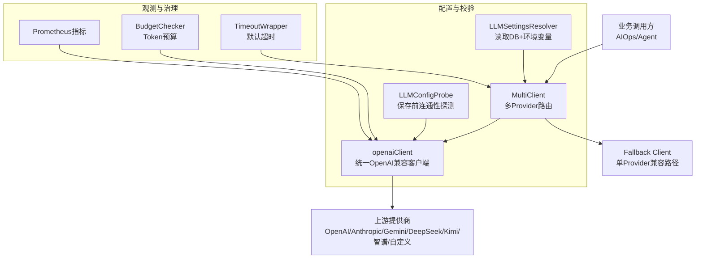
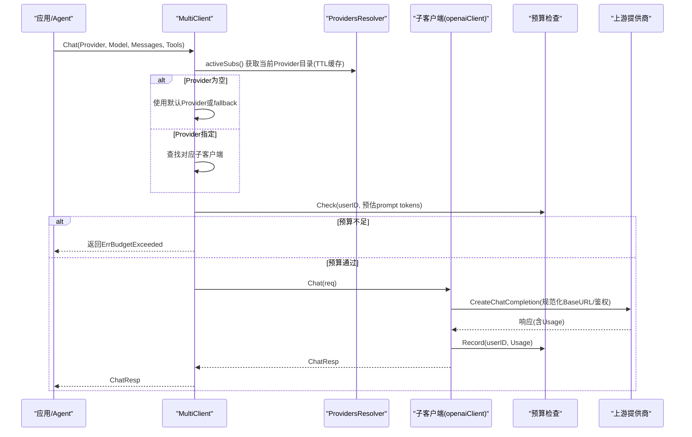
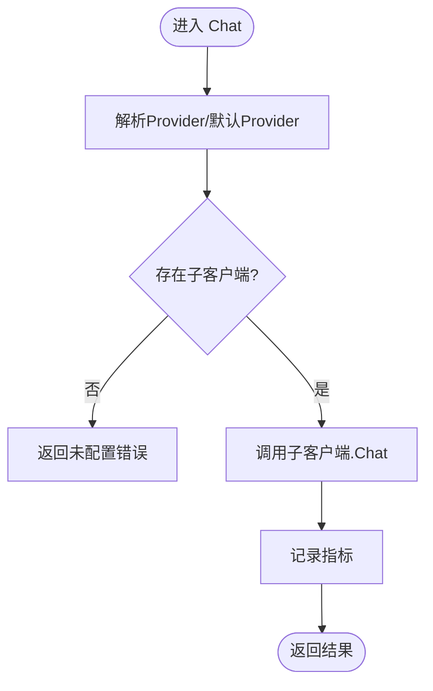
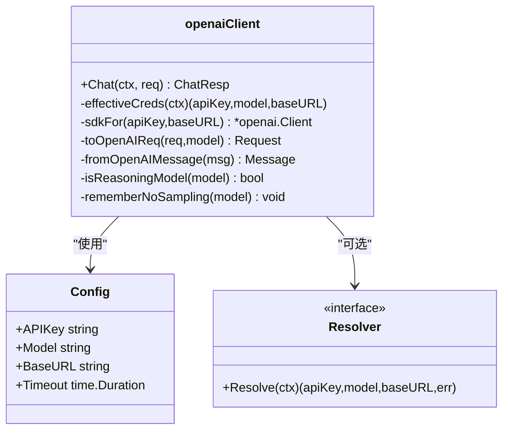
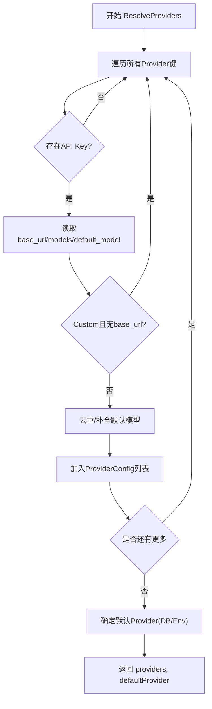
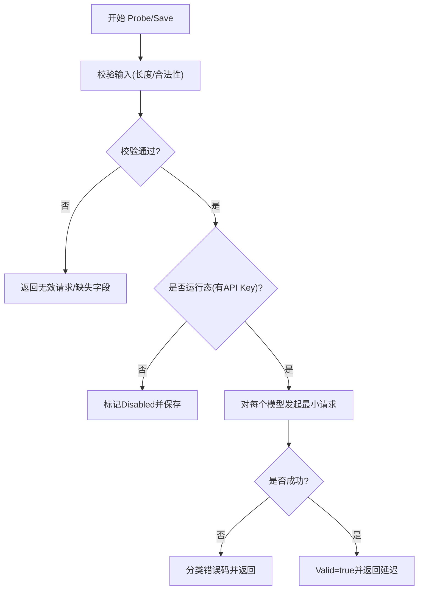
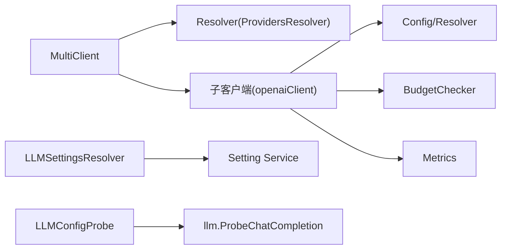

# AI模型设置

<cite>
**本文引用的文件**
- [client.go](file://internal/pkg/llm/client.go)
- [router.go](file://internal/pkg/llm/router.go)
- [budget.go](file://internal/pkg/llm/budget.go)
- [probe.go](file://internal/pkg/llm/probe.go)
- [metrics.go](file://internal/pkg/llm/metrics.go)
- [eino_routing.go](file://internal/pkg/llm/eino_routing.go)
- [llm.go](file://internal/manager/biz/setting/llm.go)
- [llm_probe.go](file://internal/manager/biz/setting/llm_probe.go)
- [model.go](file://internal/manager/model/setting/model.go)
</cite>

## 目录
1. [简介](#简介)
2. [项目结构](#项目结构)
3. [核心组件](#核心组件)
4. [架构总览](#架构总览)
5. [详细组件分析](#详细组件分析)
6. [依赖关系分析](#依赖关系分析)
7. [性能与成本](#性能与成本)
8. [故障排查指南](#故障排查指南)
9. [结论](#结论)
10. [附录：新增提供商接入指南](#附录：新增提供商接入指南)

## 简介
本模块提供统一的AI大语言模型配置与调用能力，支持多提供商（OpenAI、Anthropic、Google Gemini、DeepSeek、Kimi、智谱GLM以及自定义OpenAI兼容端点）的动态配置、选择、负载均衡与故障转移。系统通过“动态解析器 + 多路路由 + 统一客户端”的架构，实现：
- 运行时可编辑的API密钥、BaseURL、默认模型与可用模型列表
- 请求级Provider/Model选择与默认回退
- 预算控制、连接探测、指标监控与错误分类
- 面向Agent框架的适配层（eino）以支撑工具调用与流式扩展

## 项目结构
- 底层客户端与路由
  - internal/pkg/llm：统一LLM客户端、多Provider路由、预算、探针、指标、eino适配
- 管理侧配置与校验
  - internal/manager/biz/setting：从数据库读取并拼装Provider目录、保存与探测配置
  - internal/manager/model/setting：系统设置键名与枚举常量定义

图表来源
- [router.go:61-129](file://internal/pkg/llm/router.go#L61-L129)
- [client.go:176-220](file://internal/pkg/llm/client.go#L176-L220)
- [llm.go:126-224](file://internal/manager/biz/setting/llm.go#L126-L224)
- [llm_probe.go:128-180](file://internal/manager/biz/setting/llm_probe.go#L128-L180)
- [budget.go:9-33](file://internal/pkg/llm/budget.go#L9-L33)
- [metrics.go:10-68](file://internal/pkg/llm/metrics.go#L10-L68)

章节来源
- [router.go:1-129](file://internal/pkg/llm/router.go#L1-L129)
- [client.go:1-220](file://internal/pkg/llm/client.go#L1-L220)
- [llm.go:1-224](file://internal/manager/biz/setting/llm.go#L1-L224)
- [llm_probe.go:1-180](file://internal/manager/biz/setting/llm_probe.go#L1-L180)
- [budget.go:1-73](file://internal/pkg/llm/budget.go#L1-L73)
- [metrics.go:1-89](file://internal/pkg/llm/metrics.go#L1-L89)

## 核心组件
- 多Provider路由 MultiClient
  - 维护静态/动态Provider目录，按ChatReq.Provider分发；空Provider走默认或fallback
  - 支持TTL缓存与失效刷新，保障管理员在线修改即时生效
- 统一客户端 openaiClient
  - 基于go-openai SDK，封装消息/工具/温度等参数转换
  - 自动处理推理模型固定采样参数、Zhipu JWT鉴权、BaseURL规范化
  - 集成预算检查、指标上报、结构化日志
- 配置解析 LLMSettingsResolver
  - 从system_settings.llm.*读取各Provider的API Key、BaseURL、模型列表与默认模型
  - 合并环境变量默认值，去重与顺序保持，输出稳定JSON给前端
- 配置探测 LLMConfigProbe
  - 保存前对每个暴露模型发起最小化聊天请求，分类错误码（认证、配额、限流、TLS、DNS等）
  - 安全限制输入长度、过滤敏感信息
- 预算控制 InMemoryBudget
  - 按UTC日维度统计Token消耗，超过阈值拒绝新请求
- 指标 metrics
  - 记录请求耗时、成功/失败/预算超限计数、Prompt/Completion Token总量
- eino适配 RoutingChatModel / clientChatModel
  - 将现有llm.Client适配为eino ChatModel，支持工具绑定、按Provider选择、默认Provider动态解析

章节来源
- [router.go:61-329](file://internal/pkg/llm/router.go#L61-L329)
- [client.go:46-128](file://internal/pkg/llm/client.go#L46-L128)
- [client.go:387-507](file://internal/pkg/llm/client.go#L387-L507)
- [llm.go:12-53](file://internal/manager/biz/setting/llm.go#L12-L53)
- [llm.go:126-224](file://internal/manager/biz/setting/llm.go#L126-L224)
- [llm_probe.go:56-126](file://internal/manager/biz/setting/llm_probe.go#L56-L126)
- [budget.go:9-73](file://internal/pkg/llm/budget.go#L9-L73)
- [metrics.go:10-89](file://internal/pkg/llm/metrics.go#L10-L89)
- [eino_routing.go:78-142](file://internal/pkg/llm/eino_routing.go#L78-L142)

## 架构总览
下图展示一次带Provider选择的聊天请求在系统中的流转：

图表来源
- [router.go:274-329](file://internal/pkg/llm/router.go#L274-L329)
- [client.go:387-507](file://internal/pkg/llm/client.go#L387-L507)
- [budget.go:35-59](file://internal/pkg/llm/budget.go#L35-L59)

## 详细组件分析

### 多Provider路由（MultiClient）
- 功能要点
  - 静态构建：构造时根据ProviderConfig创建子客户端，跳过无API Key的Provider
  - 动态解析：通过ProvidersResolver定期刷新Provider目录，TTL=60s；支持Invalidate立即刷新
  - 默认Provider：优先DB/环境配置的default_provider，否则取排序首项
  - 路由策略：按ChatReq.Provider精确匹配；为空则走默认或fallback
  - 指标：统一记录provider/model/status/duration/tokens
- 关键流程
  - activeSubs：读锁保护下判断是否命中缓存；未命中则调用resolver并重建子客户端
  - Chat：选择子客户端后调用其Chat，最后记录Prometheus指标

图表来源
- [router.go:155-225](file://internal/pkg/llm/router.go#L155-L225)
- [router.go:274-329](file://internal/pkg/llm/router.go#L274-L329)

章节来源
- [router.go:30-129](file://internal/pkg/llm/router.go#L30-L129)
- [router.go:155-225](file://internal/pkg/llm/router.go#L155-L225)
- [router.go:274-329](file://internal/pkg/llm/router.go#L274-L329)

### 统一客户端（openaiClient）
- 功能要点
  - 凭证解析：支持Resolver动态覆盖API Key/Model/BaseURL，内部TTL缓存
  - BaseURL规范化：自动补齐/v1，避免本地网关404
  - 推理模型兼容：识别o-series/gpt-5/kimi-k*/reasoner家族，自动移除temperature/top_p等固定参数
  - Zhipu鉴权：针对智谱域名与Key格式，注入JWT签名Transport
  - 预算与指标：请求前估算token做预算门控；成功后记录实际usage与耗时
- 关键流程
  - effectiveCreds：合并Resolver与env默认值，带TTL
  - sdkFor：按(apiKey, baseURL)缓存SDK实例
  - Chat：预算检查→构建请求→发送→重试（若因采样参数被拒）→记录指标

图表来源
- [client.go:46-56](file://internal/pkg/llm/client.go#L46-L56)
- [client.go:163-174](file://internal/pkg/llm/client.go#L163-L174)
- [client.go:222-329](file://internal/pkg/llm/client.go#L222-L329)
- [client.go:387-507](file://internal/pkg/llm/client.go#L387-L507)
- [client.go:617-713](file://internal/pkg/llm/client.go#L617-L713)

章节来源
- [client.go:46-128](file://internal/pkg/llm/client.go#L46-L128)
- [client.go:176-220](file://internal/pkg/llm/client.go#L176-L220)
- [client.go:263-329](file://internal/pkg/llm/client.go#L263-L329)
- [client.go:387-507](file://internal/pkg/llm/client.go#L387-L507)
- [client.go:617-713](file://internal/pkg/llm/client.go#L617-L713)

### 配置解析与持久化（LLMSettingsResolver / Service）
- 功能要点
  - 读取system_settings.llm.*中各Provider的api_key、base_url、models(JSON)、default_model
  - 合并环境变量默认值；custom提供商若无base_url则跳过
  - 去重与顺序保持，保证UI下拉框稳定
  - 默认Provider优先级：DB > 环境变量 > 空（由路由选首项）
- 关键流程
  - ResolveProviders：遍历allProviderKeys，组装ProviderConfig列表与默认Provider
  - EncodeModelsList/decodeModelsList：序列化/反序列化模型列表

图表来源
- [llm.go:70-124](file://internal/manager/biz/setting/llm.go#L70-L124)
- [llm.go:126-224](file://internal/manager/biz/setting/llm.go#L126-L224)
- [llm.go:226-297](file://internal/manager/biz/setting/llm.go#L226-L297)

章节来源
- [llm.go:12-53](file://internal/manager/biz/setting/llm.go#L12-L53)
- [llm.go:70-124](file://internal/manager/biz/setting/llm.go#L70-L124)
- [llm.go:126-224](file://internal/manager/biz/setting/llm.go#L126-L224)
- [llm.go:226-297](file://internal/manager/biz/setting/llm.go#L226-L297)
- [model.go:79-149](file://internal/manager/model/setting/model.go#L79-L149)

### 配置探测与错误分类（LLMConfigProbe）
- 功能要点
  - 保存前对每个暴露模型执行最小化聊天请求，验证连通性与权限
  - 严格限制输入长度，屏蔽敏感信息
  - 错误分类：认证失败、配额不足、限流、DNS/TLS/连接失败、端点未找到、上游错误等
- 关键流程
  - Probe：校验输入 → 调用llm.ProbeChatCompletion → 分类错误
  - Save：仅当API Key非空时才进行上游探测；空Key视为禁用并直接保存

图表来源
- [llm_probe.go:128-180](file://internal/manager/biz/setting/llm_probe.go#L128-L180)
- [llm_probe.go:191-331](file://internal/manager/biz/setting/llm_probe.go#L191-L331)
- [llm_probe.go:368-453](file://internal/manager/biz/setting/llm_probe.go#L368-L453)

章节来源
- [llm_probe.go:56-126](file://internal/manager/biz/setting/llm_probe.go#L56-L126)
- [llm_probe.go:191-331](file://internal/manager/biz/setting/llm_probe.go#L191-L331)
- [llm_probe.go:368-453](file://internal/manager/biz/setting/llm_probe.go#L368-L453)

### 预算控制（InMemoryBudget）
- 功能要点
  - 按UTC日维度累计TotalTokens，超过阈值拒绝后续请求
  - Check在请求前估算prompt token；Record在成功后记录真实用量
- 复杂度
  - Check/Record均为O(1)，线程安全

章节来源
- [budget.go:9-73](file://internal/pkg/llm/budget.go#L9-L73)

### 指标与监控（metrics）
- 指标项
  - ongird_llm_tokens_total：按model与kind(prompt/completion)统计
  - ongird_llm_requests_total：按model与result(success/error/budget_exceeded)统计
  - ongird_llm_request_duration_seconds：按model统计耗时直方图
- 标签约束：禁止包含用户/租户/会话等高基数标签

章节来源
- [metrics.go:10-89](file://internal/pkg/llm/metrics.go#L10-L89)

### eino适配（RoutingChatModel / clientChatModel）
- 功能要点
  - 将现有llm.Client适配为eino ChatModel，支持工具绑定与流式包装
  - 支持WithProvider选择具体Provider；支持DefaultResolver动态切换默认Provider
  - 将eino消息/工具转换为llm.Message/ToolSchema，并回填Usage到ResponseMeta

章节来源
- [eino_routing.go:78-142](file://internal/pkg/llm/eino_routing.go#L78-L142)
- [eino_routing.go:186-219](file://internal/pkg/llm/eino_routing.go#L186-L219)
- [eino_routing.go:317-428](file://internal/pkg/llm/eino_routing.go#L317-L428)
- [eino_routing.go:430-543](file://internal/pkg/llm/eino_routing.go#L430-L543)

## 依赖关系分析
- 组件耦合
  - MultiClient依赖ProvidersResolver与子客户端；子客户端依赖Config/Resolver/Budget/Metrics
  - LLMSettingsResolver依赖setting.Service与model常量；LLMConfigProbe依赖llm.ProbeChatCompletion
- 外部依赖
  - go-openai SDK用于HTTP请求与鉴权
  - Prometheus指标库用于观测
  - 智谱鉴权模块用于JWT签名

图表来源
- [router.go:61-129](file://internal/pkg/llm/router.go#L61-L129)
- [client.go:176-220](file://internal/pkg/llm/client.go#L176-L220)
- [llm.go:126-224](file://internal/manager/biz/setting/llm.go#L126-L224)
- [llm_probe.go:128-180](file://internal/manager/biz/setting/llm_probe.go#L128-L180)

章节来源
- [router.go:61-129](file://internal/pkg/llm/router.go#L61-L129)
- [client.go:176-220](file://internal/pkg/llm/client.go#L176-L220)
- [llm.go:126-224](file://internal/manager/biz/setting/llm.go#L126-L224)
- [llm_probe.go:128-180](file://internal/manager/biz/setting/llm_probe.go#L128-L180)

## 性能与成本
- 性能特性
  - 默认超时：客户端默认120s，可通过WithDefaultTimeout覆盖；探针默认20s
  - 缓存：Resolver与SDK实例均缓存，降低热路径开销
  - 推理模型优化：自动识别并移除不支持的采样参数，减少无效往返
- 成本控制
  - 预算门控：按日Token上限拦截，防止超支
  - 指标观测：tokens_total与requests_total便于核算成本与异常
  - 模型选择：通过ProviderConfig的Models列表限制可用模型，避免昂贵模型滥用
- 建议
  - 合理设置每日预算与默认超时
  - 使用低成本模型作为默认，高成本模型按需选择
  - 结合指标与日志定位慢请求与错误热点

[本节为通用指导，不直接分析具体文件]

## 故障排查指南
- 常见问题与定位
  - 未配置API Key：返回ErrNoAPIKey；检查Provider是否启用及API Key是否写入
  - BaseURL错误：404或端点未找到；确认BaseURL是否包含/v1或使用normalize逻辑
  - 认证失败：401/invalid_api_key；检查Key与提供商要求
  - 配额不足/限流：402/429；调整预算或等待限流恢复
  - DNS/TLS/连接失败：网络或证书问题；检查代理与证书链
  - 推理模型参数错误：自动重试移除采样参数；如仍失败，检查模型名称与网关
- 诊断步骤
  - 使用LLMConfigProbe对草稿进行连通性测试，查看Code与Detail
  - 观察Prometheus指标与日志中的model/provider/status/duration
  - 检查预算是否达到上限

章节来源
- [llm_probe.go:368-453](file://internal/manager/biz/setting/llm_probe.go#L368-L453)
- [client.go:387-507](file://internal/pkg/llm/client.go#L387-L507)
- [metrics.go:10-89](file://internal/pkg/llm/metrics.go#L10-L89)

## 结论
本模块通过“动态配置 + 多路路由 + 统一客户端”的设计，实现了多AI提供商的统一接入与治理能力。配合预算控制、连接探测与指标监控，既保证了可用性，也兼顾了成本与安全。未来可在该基础上扩展更多提供商与高级路由策略（如按负载/延迟/成本的智能调度）。

[本节为总结，不直接分析具体文件]

## 附录：新增提供商接入指南
目标：在不改动核心调用路径的前提下，新增一个OpenAI兼容的提供商（例如某私有网关），包括认证、请求封装与错误处理。

步骤概览
- 定义Provider常量与键名
  - 在setting model中添加新的Provider ID与对应的api_key/base_url/models/default_model键名
- 注册到配置解析器
  - 在allProviderKeys中加入新Provider键映射，确保ResolveProviders能读取并输出
- 配置默认BaseURL与模型列表
  - 通过环境变量或system_settings提供默认值；custom类需强制base_url
- 验证与探测
  - 使用LLMConfigProbe对草稿进行连通性测试，确保错误分类正确
- 路由与客户端
  - 由于采用OpenAI兼容接口，无需额外客户端实现；只需确保BaseURL与API Key正确
- 指标与预算
  - 新Provider的请求会自然纳入现有指标；如需按Provider维度区分，可在上层聚合
- 安全最佳实践
  - API Key必须标记为敏感字段，禁止明文返回
  - BaseURL仅允许http/https，禁止userinfo/query/fragment
  - 限制输入长度，脱敏错误详情中的敏感信息
- 成本控制策略
  - 限制Models列表，默认选择低成本模型
  - 设置合理的预算与超时，结合指标监控异常与高消费场景

章节来源
- [model.go:79-149](file://internal/manager/model/setting/model.go#L79-L149)
- [llm.go:70-124](file://internal/manager/biz/setting/llm.go#L70-L124)
- [llm.go:126-224](file://internal/manager/biz/setting/llm.go#L126-L224)
- [llm_probe.go:205-295](file://internal/manager/biz/setting/llm_probe.go#L205-L295)
- [client.go:331-364](file://internal/pkg/llm/client.go#L331-L364)
- [metrics.go:10-89](file://internal/pkg/llm/metrics.go#L10-L89)