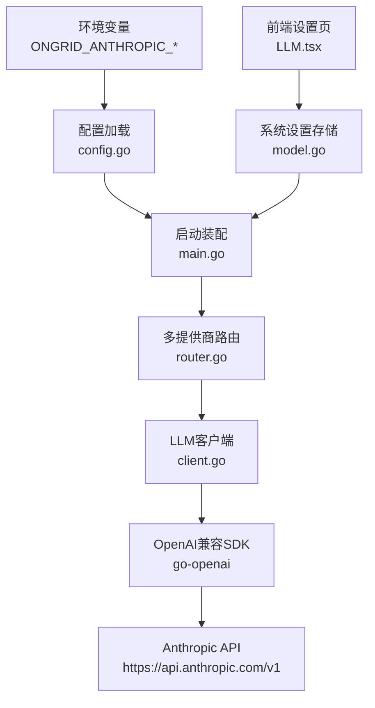
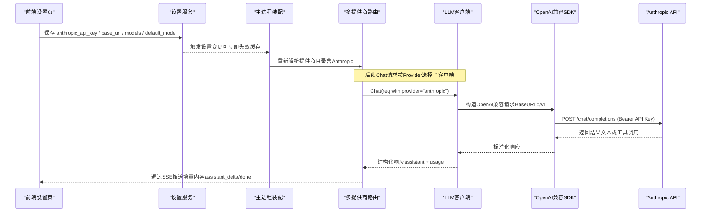
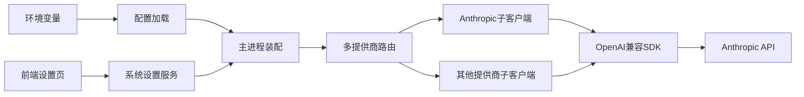

# Anthropic Claude配置

<cite>
**本文引用的文件**
- [internal/pkg/config/config.go](file://internal/pkg/config/config.go)
- [cmd/ongrid/main.go](file://cmd/ongrid/main.go)
- [internal/pkg/llm/client.go](file://internal/pkg/llm/client.go)
- [internal/pkg/llm/router.go](file://internal/pkg/llm/router.go)
- [web/src/pages/settings/LLM.tsx](file://web/src/pages/settings/LLM.tsx)
- [internal/manager/model/setting/model.go](file://internal/manager/model/setting/model.go)
- [internal/manager/biz/aiops/graph/callbacks/sse.go](file://internal/manager/biz/aiops/graph/callbacks/sse.go)
- [web/src/api/chat.ts](file://web/src/api/chat.ts)
</cite>

## 目录
1. [简介](#简介)
2. [项目结构](#项目结构)
3. [核心组件](#核心组件)
4. [架构总览](#架构总览)
5. [详细组件分析](#详细组件分析)
6. [依赖关系分析](#依赖关系分析)
7. [性能与优化建议](#性能与优化建议)
8. [故障排查指南](#故障排查指南)
9. [结论](#结论)
10. [附录：配置清单与示例路径](#附录配置清单与示例路径)

## 简介
本技术文档聚焦于在本仓库中集成并配置Anthropic Claude模型（尤其是claude-sonnet-4-6等最新模型）的完整方案。内容涵盖：
- 从console.anthropic.com获取API密钥、设置Base URL与选择模型
- 多提供商路由与动态配置刷新
- 认证机制、消息格式与流式响应处理
- 具体配置步骤与最佳实践（上下文长度、提示词优化、超时与预算控制）

## 项目结构
本项目通过“多提供商路由 + OpenAI兼容客户端”的方式统一接入不同大模型服务，包括Anthropic。关键位置如下：
- 环境变量与默认值：在配置加载阶段读取并初始化各提供商参数
- 启动时构建多提供商路由表，并将Anthropic作为可选提供商注入
- LLM客户端将请求转换为OpenAI兼容格式，通过SDK调用上游
- 前端设置页提供Anthropic的配置入口（API Key、Base URL、模型列表、默认模型）
- 流式响应通过SSE事件向前端推送增量内容

图表来源
- [internal/pkg/config/config.go:457-482](file://internal/pkg/config/config.go#L457-L482)
- [cmd/ongrid/main.go:602-647](file://cmd/ongrid/main.go#L602-L647)
- [internal/pkg/llm/router.go:30-49](file://internal/pkg/llm/router.go#L30-L49)
- [internal/pkg/llm/client.go:46-56](file://internal/pkg/llm/client.go#L46-L56)
- [web/src/pages/settings/LLM.tsx:72-84](file://web/src/pages/settings/LLM.tsx#L72-L84)
- [internal/manager/model/setting/model.go:92-108](file://internal/manager/model/setting/model.go#L92-L108)

章节来源
- [internal/pkg/config/config.go:457-482](file://internal/pkg/config/config.go#L457-L482)
- [cmd/ongrid/main.go:602-647](file://cmd/ongrid/main.go#L602-L647)
- [internal/pkg/llm/router.go:30-49](file://internal/pkg/llm/router.go#L30-L49)
- [internal/pkg/llm/client.go:46-56](file://internal/pkg/llm/client.go#L46-L56)
- [web/src/pages/settings/LLM.tsx:72-84](file://web/src/pages/settings/LLM.tsx#L72-L84)
- [internal/manager/model/setting/model.go:92-108](file://internal/manager/model/setting/model.go#L92-L108)

## 核心组件
- 配置加载与环境变量映射：负责读取Anthropic相关的环境变量并填充到内存配置
- 启动装配与路由注册：将Anthropic作为可用提供商加入多提供商路由表
- 多提供商路由：根据请求中的Provider字段或默认值选择具体子客户端
- LLM客户端：将内部消息格式转换为OpenAI兼容请求，处理超时、预算、采样参数自适应
- 前端设置界面：提供Anthropic的API Key、Base URL、模型列表与默认模型的编辑能力
- 系统设置持久化：以键值形式保存各提供商配置，支持运行时热更新

章节来源
- [internal/pkg/config/config.go:457-482](file://internal/pkg/config/config.go#L457-L482)
- [cmd/ongrid/main.go:602-647](file://cmd/ongrid/main.go#L602-L647)
- [internal/pkg/llm/router.go:61-87](file://internal/pkg/llm/router.go#L61-L87)
- [internal/pkg/llm/client.go:97-128](file://internal/pkg/llm/client.go#L97-L128)
- [web/src/pages/settings/LLM.tsx:72-84](file://web/src/pages/settings/LLM.tsx#L72-L84)
- [internal/manager/model/setting/model.go:92-108](file://internal/manager/model/setting/model.go#L92-L108)

## 架构总览
下图展示了从前端设置到后端路由再到上游Anthropic API的端到端流程。

图表来源
- [web/src/pages/settings/LLM.tsx:72-84](file://web/src/pages/settings/LLM.tsx#L72-L84)
- [internal/manager/model/setting/model.go:92-108](file://internal/manager/model/setting/model.go#L92-L108)
- [cmd/ongrid/main.go:602-647](file://cmd/ongrid/main.go#L602-L647)
- [internal/pkg/llm/router.go:274-329](file://internal/pkg/llm/router.go#L274-L329)
- [internal/pkg/llm/client.go:387-507](file://internal/pkg/llm/client.go#L387-L507)
- [internal/manager/biz/aiops/graph/callbacks/sse.go:22-49](file://internal/manager/biz/aiops/graph/callbacks/sse.go#L22-L49)

## 详细组件分析

### 配置与环境变量（Anthropic）
- 环境变量键名与默认值：
  - ONGRID_ANTHROPIC_API_KEY：Anthropic API密钥（为空则不暴露该提供商）
  - ONGRID_ANTHROPIC_MODEL：默认模型（默认值为claude-sonnet-4-6）
  - ONGRID_ANTHROPIC_BASE_URL：Base URL（为空时使用默认值）
  - ONGRID_ANTHROPIC_MODELS：可用模型列表（逗号分隔）
- 这些变量在配置加载时被读取并写入内存配置，供启动装配使用。

章节来源
- [internal/pkg/config/config.go:457-482](file://internal/pkg/config/config.go#L457-L482)

### 启动装配与路由注册
- 当Anthropic的API Key非空时，系统会将其作为可用提供商加入路由表
- 默认Base URL为https://api.anthropic.com/v1；若未显式设置，将使用该默认值
- 默认模型为claude-sonnet-4-6；可通过环境变量覆盖
- 同时会将环境变量初始值写入系统设置表，供前端展示和修改

章节来源
- [cmd/ongrid/main.go:602-647](file://cmd/ongrid/main.go#L602-L647)
- [cmd/ongrid/main.go:659-712](file://cmd/ongrid/main.go#L659-L712)

### 多提供商路由
- 路由表由静态配置与动态解析器共同维护
- 动态解析器支持管理员通过设置页面修改提供商配置，并在约60秒内生效
- 请求时可指定provider字段（如"anthropic"），否则使用默认提供商

章节来源
- [internal/pkg/llm/router.go:61-87](file://internal/pkg/llm/router.go#L61-L87)
- [internal/pkg/llm/router.go:155-225](file://internal/pkg/llm/router.go#L155-L225)
- [internal/pkg/llm/router.go:274-329](file://internal/pkg/llm/router.go#L274-L329)

### LLM客户端与消息格式
- 客户端将内部Message结构（role/content/tool_calls）转换为OpenAI兼容请求
- Base URL规范化：若用户提供的Base URL无路径段，自动追加/v1以匹配OpenAI兼容端点
- 超时控制：默认120秒，可由上层设置覆盖
- 预算控制：可在请求前估算token数并限制每日用量
- 采样参数自适应：对推理类模型自动移除temperature/top_p等不支持的参数

章节来源
- [internal/pkg/llm/client.go:46-56](file://internal/pkg/llm/client.go#L46-L56)
- [internal/pkg/llm/client.go:331-364](file://internal/pkg/llm/client.go#L331-L364)
- [internal/pkg/llm/client.go:387-507](file://internal/pkg/llm/client.go#L387-L507)
- [internal/pkg/llm/client.go:509-568](file://internal/pkg/llm/client.go#L509-L568)
- [internal/pkg/llm/client.go:617-713](file://internal/pkg/llm/client.go#L617-L713)

### 认证机制
- 通过OpenAI兼容SDK发送请求，Authorization头由SDK基于API Key生成
- 对于Anthropic，API Key需从console.anthropic.com获取，并通过环境变量或设置页面注入
- 系统不会在前端或日志中输出敏感信息

章节来源
- [internal/pkg/llm/client.go:306-329](file://internal/pkg/llm/client.go#L306-L329)
- [web/src/pages/settings/LLM.tsx:72-84](file://web/src/pages/settings/LLM.tsx#L72-L84)

### 流式响应处理
- 服务端通过SSE事件向前端推送增量内容：assistant_start、assistant_delta、assistant_end、done、error等
- 前端通过EventSource接收事件并渲染对话气泡
- SSE事件包含迭代次数、增量内容、工具调用状态等信息

章节来源
- [internal/manager/biz/aiops/graph/callbacks/sse.go:22-49](file://internal/manager/biz/aiops/graph/callbacks/sse.go#L22-L49)
- [internal/manager/biz/aiops/graph/callbacks/sse.go:397-440](file://internal/manager/biz/aiops/graph/callbacks/sse.go#L397-L440)
- [web/src/api/chat.ts:247-280](file://web/src/api/chat.ts#L247-L280)

### 前端设置与持久化
- 前端提供Anthropic的API Key、Base URL、模型列表与默认模型输入框
- 配置保存后写入系统设置表，键名遵循<provider>_<field>模式
- 支持敏感字段标记（如API Key）

章节来源
- [web/src/pages/settings/LLM.tsx:72-84](file://web/src/pages/settings/LLM.tsx#L72-L84)
- [internal/manager/model/setting/model.go:92-108](file://internal/manager/model/setting/model.go#L92-L108)

## 依赖关系分析
- 配置层依赖环境变量，启动装配依赖配置层
- 路由层依赖多个子客户端实例，每个实例对应一个提供商
- 客户端层依赖OpenAI兼容SDK，屏蔽底层差异
- 前端设置层依赖系统设置服务，实现配置持久化与热更新

图表来源
- [internal/pkg/config/config.go:457-482](file://internal/pkg/config/config.go#L457-L482)
- [cmd/ongrid/main.go:602-647](file://cmd/ongrid/main.go#L602-L647)
- [internal/pkg/llm/router.go:61-87](file://internal/pkg/llm/router.go#L61-L87)
- [internal/pkg/llm/client.go:306-329](file://internal/pkg/llm/client.go#L306-L329)
- [web/src/pages/settings/LLM.tsx:72-84](file://web/src/pages/settings/LLM.tsx#L72-L84)

章节来源
- [internal/pkg/config/config.go:457-482](file://internal/pkg/config/config.go#L457-L482)
- [cmd/ongrid/main.go:602-647](file://cmd/ongrid/main.go#L602-L647)
- [internal/pkg/llm/router.go:61-87](file://internal/pkg/llm/router.go#L61-L87)
- [internal/pkg/llm/client.go:306-329](file://internal/pkg/llm/client.go#L306-L329)
- [web/src/pages/settings/LLM.tsx:72-84](file://web/src/pages/settings/LLM.tsx#L72-L84)

## 性能与优化建议
- 选择合适的模型版本：
  - claude-sonnet-4-6适合大多数场景，平衡性能与成本
  - 复杂推理任务可考虑更强大的模型（如opus系列）
- 控制上下文长度：
  - 合理拆分长对话，避免超出模型上下文限制
  - 使用摘要或关键信息提取减少prompt长度
- 优化提示词：
  - 明确角色与任务描述，减少歧义
  - 使用结构化指令（如JSON Schema）提高工具调用准确性
- 超时与重试：
  - 默认120秒超时适用于多数场景，可根据业务调整
  - 对网络波动场景增加重试逻辑
- 预算控制：
  - 启用每日token限额，防止意外消耗
  - 监控实际usage，调整提示词与模型选择

[本节为通用指导，无需特定文件引用]

## 故障排查指南
- 无法连接Anthropic API：
  - 检查API Key是否正确设置
  - 确认Base URL指向正确的OpenAI兼容端点（通常为/v1）
  - 验证网络连通性与防火墙策略
- 请求被拒绝：
  - 检查模型是否支持Chat Completions
  - 确认Base URL与提供商匹配
- 流式响应异常：
  - 检查SSE事件是否正确推送
  - 验证前端EventSource连接状态
- 预算超限：
  - 调整每日token限额
  - 优化提示词以减少token消耗

章节来源
- [internal/pkg/llm/client.go:387-507](file://internal/pkg/llm/client.go#L387-L507)
- [internal/manager/biz/aiops/graph/callbacks/sse.go:22-49](file://internal/manager/biz/aiops/graph/callbacks/sse.go#L22-L49)
- [web/src/api/chat.ts:247-280](file://web/src/api/chat.ts#L247-L280)

## 结论
本仓库通过多提供商路由与OpenAI兼容客户端实现了灵活的Anthropic Claude集成。配置简单、扩展性强，支持动态更新与流式响应。通过合理选择模型、优化提示词与控制上下文长度，可获得良好的性能与用户体验。

[本节为总结性内容，无需特定文件引用]

## 附录：配置清单与示例路径
- 环境变量配置：
  - ONGRID_ANTHROPIC_API_KEY：从console.anthropic.com获取
  - ONGRID_ANTHROPIC_MODEL：默认模型（claude-sonnet-4-6）
  - ONGRID_ANTHROPIC_BASE_URL：Base URL（默认https://api.anthropic.com/v1）
  - ONGRID_ANTHROPIC_MODELS：可用模型列表
- 前端设置路径：
  - 设置 → 集成 → LLM模型 → Anthropic
- 系统设置键名：
  - anthropic_api_key：敏感字段
  - anthropic_base_url：Base URL
  - anthropic_models：模型列表（JSON数组）
  - anthropic_default_model：默认模型

章节来源
- [internal/pkg/config/config.go:457-482](file://internal/pkg/config/config.go#L457-L482)
- [web/src/pages/settings/LLM.tsx:72-84](file://web/src/pages/settings/LLM.tsx#L72-L84)
- [internal/manager/model/setting/model.go:92-108](file://internal/manager/model/setting/model.go#L92-L108)