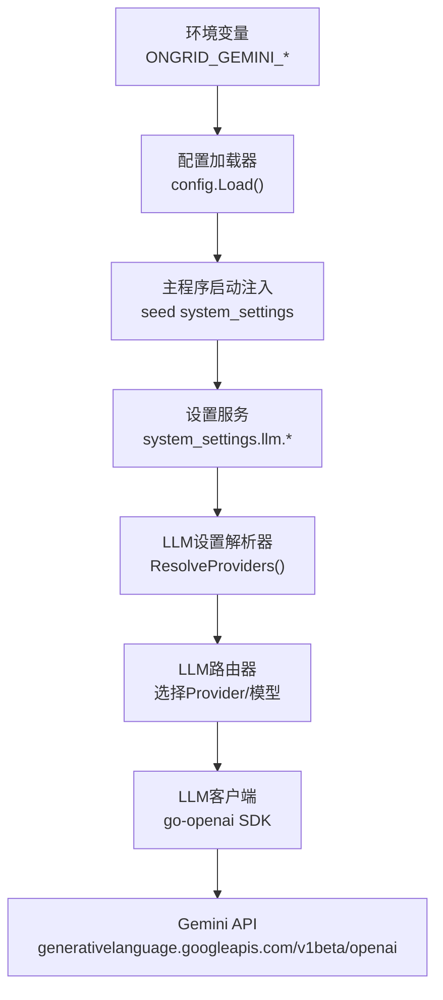
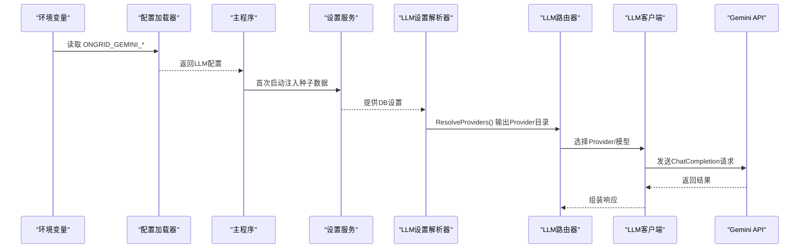
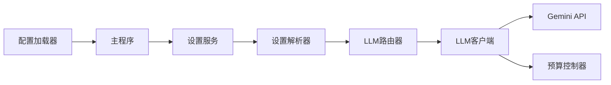

# Google Gemini配置

<cite>
**本文引用的文件**
- [internal/pkg/config/config.go](file://internal/pkg/config/config.go)
- [cmd/ongrid/main.go](file://cmd/ongrid/main.go)
- [internal/manager/model/setting/model.go](file://internal/manager/model/setting/model.go)
- [internal/manager/biz/setting/llm.go](file://internal/manager/biz/setting/llm.go)
- [internal/pkg/llm/client.go](file://internal/pkg/llm/client.go)
- [internal/pkg/llm/budget.go](file://internal/pkg/llm/budget.go)
- [web/src/pages/settings/LLM.tsx](file://web/src/pages/settings/LLM.tsx)
</cite>

## 目录
1. [简介](#简介)
2. [项目结构](#项目结构)
3. [核心组件](#核心组件)
4. [架构总览](#架构总览)
5. [详细组件分析](#详细组件分析)
6. [依赖关系分析](#依赖关系分析)
7. [性能与成本优化](#性能与成本优化)
8. [故障排查指南](#故障排查指南)
9. [结论](#结论)
10. [附录：配置清单与示例路径](#附录配置清单与示例路径)

## 简介
本技术文档聚焦于在本项目中启用并配置Google Gemini模型（如gemini-2.5-pro）的完整流程，涵盖API密钥获取、Base URL设置、模型选择、运行时路由、预算控制与多模态能力的使用方式。本项目通过OpenAI兼容接口对接Gemini（Base URL指向generativelanguage.googleapis.com/v1beta/openai），在系统设置中提供按Provider维度的动态配置能力，支持热更新且无需重启服务。

## 项目结构
围绕Gemini的配置涉及以下关键位置：
- 环境变量与默认值：由配置加载器统一读取，包含Gemini的API Key、默认模型、Base URL及可用模型列表。
- 启动时注入：主程序将环境中的Gemini配置注入到系统设置的种子数据，供前端展示和编辑。
- 运行时解析：设置服务从数据库读取每Provider的设置，结合环境变量默认值，形成最终可用的Provider目录。
- LLM客户端：基于OpenAI SDK实现，通过Base URL与API Key访问任意OpenAI兼容端点（包括Gemini）。
- 预算控制：内置内存级每日Token配额限制，防止超支。
- 前端界面：设置页提供Gemini Provider的表单字段与占位提示，便于管理员在线配置。

图表来源
- [internal/pkg/config/config.go:469-472](file://internal/pkg/config/config.go#L469-L472)
- [cmd/ongrid/main.go:667-670](file://cmd/ongrid/main.go#L667-L670)
- [cmd/ongrid/main.go:740-745](file://cmd/ongrid/main.go#L740-L745)
- [internal/manager/biz/setting/llm.go:94-100](file://internal/manager/biz/setting/llm.go#L94-L100)
- [internal/pkg/llm/client.go:317-327](file://internal/pkg/llm/client.go#L317-L327)

章节来源
- [internal/pkg/config/config.go:469-472](file://internal/pkg/config/config.go#L469-L472)
- [cmd/ongrid/main.go:667-670](file://cmd/ongrid/main.go#L667-L670)
- [cmd/ongrid/main.go:740-745](file://cmd/ongrid/main.go#L740-L745)
- [internal/manager/biz/setting/llm.go:94-100](file://internal/manager/biz/setting/llm.go#L94-L100)
- [internal/pkg/llm/client.go:317-327](file://internal/pkg/llm/client.go#L317-L327)

## 核心组件
- 配置加载器：负责读取环境变量并填充LLM各Provider的配置项，包括Gemini的API Key、默认模型、Base URL与模型列表。
- 设置模型与键：定义system_settings表中用于存储各Provider配置的键名（如gemini_api_key、gemini_base_url等）。
- 设置解析器：将DB中的设置与环境变量默认值合并，生成最终的Provider目录，供路由器使用。
- LLM客户端：封装OpenAI SDK调用，支持自定义Base URL与API Key；对Zhipu等特殊Provider有额外鉴权处理，对Gemini则走标准OpenAI兼容路径。
- 预算控制器：提供全局每日Token上限，避免超额调用。

章节来源
- [internal/pkg/config/config.go:328-367](file://internal/pkg/config/config.go#L328-L367)
- [internal/manager/model/setting/model.go:110-113](file://internal/manager/model/setting/model.go#L110-L113)
- [internal/manager/biz/setting/llm.go:126-224](file://internal/manager/biz/setting/llm.go#L126-L224)
- [internal/pkg/llm/client.go:46-56](file://internal/pkg/llm/client.go#L46-L56)
- [internal/pkg/llm/budget.go:9-23](file://internal/pkg/llm/budget.go#L9-L23)

## 架构总览
下图展示了从环境变量到实际HTTP请求的端到端链路，以及设置变更如何影响运行时行为。

图表来源
- [internal/pkg/config/config.go:469-472](file://internal/pkg/config/config.go#L469-L472)
- [cmd/ongrid/main.go:667-670](file://cmd/ongrid/main.go#L667-L670)
- [cmd/ongrid/main.go:740-745](file://cmd/ongrid/main.go#L740-L745)
- [internal/manager/biz/setting/llm.go:126-224](file://internal/manager/biz/setting/llm.go#L126-L224)
- [internal/pkg/llm/client.go:387-507](file://internal/pkg/llm/client.go#L387-L507)

## 详细组件分析

### 环境变量与默认值（Gemini）
- 环境变量键：
  - ONGRID_GEMINI_API_KEY：Gemini API密钥
  - ONGRID_GEMINI_MODEL：默认模型（如gemini-2.5-pro）
  - ONGRID_GEMINI_BASE_URL：可选覆盖Base URL（默认指向generativelanguage.googleapis.com/v1beta/openai）
  - ONGRID_GEMINI_MODELS：逗号分隔的可用模型列表（如gemini-3.5-flash,gemini-2.5-pro,gemini-2.5-flash）
- 这些值在配置加载时被读取并作为Provider默认值，若未设置则保持空或采用默认值。

章节来源
- [internal/pkg/config/config.go:469-472](file://internal/pkg/config/config.go#L469-L472)

### 启动时种子数据与默认Base URL
- 主程序在首次启动时将环境变量中的Gemini配置写入系统设置表，确保前端“设置→集成→LLM模型”页面能显示并允许编辑。
- 当Base URL为空时，默认使用https://generativelanguage.googleapis.com/v1beta/openai。
- 默认模型为gemini-2.5-pro（若未显式设置）。

章节来源
- [cmd/ongrid/main.go:667-670](file://cmd/ongrid/main.go#L667-L670)
- [cmd/ongrid/main.go:740-745](file://cmd/ongrid/main.go#L740-L745)

### 设置模型与键（system_settings.llm.*）
- 键名约定：
  - gemini_api_key（敏感）
  - gemini_base_url
  - gemini_models（JSON数组）
  - gemini_default_model
- 这些键由设置服务持久化，并通过解析器在运行时生效。

章节来源
- [internal/manager/model/setting/model.go:110-113](file://internal/manager/model/setting/model.go#L110-L113)

### LLM设置解析器（ResolveProviders）
- 解析顺序：DB设置 > 环境变量默认值 > 首项模型兜底。
- 若某Provider无API Key，则被跳过；Custom Provider若无Base URL也会被跳过，防止误发至OpenAI。
- 模型列表去重并保持顺序，默认模型优先出现在列表中以便前端高亮。

章节来源
- [internal/manager/biz/setting/llm.go:126-224](file://internal/manager/biz/setting/llm.go#L126-L224)

### LLM客户端与Base URL规范化
- 客户端基于go-openai SDK，支持自定义Base URL与API Key。
- Base URL规范化逻辑：若用户提供的Base URL不含路径段，自动追加/v1；已含版本路径（如/v1、/openai）则原样保留。
- 对于Zhipu等需要JWT签名的Provider，会安装自定义Transport重写Authorization头；Gemini走标准OpenAI兼容路径。

章节来源
- [internal/pkg/llm/client.go:317-327](file://internal/pkg/llm/client.go#L317-L327)
- [internal/pkg/llm/client.go:331-364](file://internal/pkg/llm/client.go#L331-L364)

### 预算控制（每日Token限额）
- 通过环境变量ONGRID_LLM_DAILY_TOKEN_LIMIT启用全局每日Token上限。
- 预算检查在每次Chat前进行，估算提示词Token数；成功后记录实际用量。
- 超限返回ErrBudgetExceeded，不会重试，避免重复计费。

章节来源
- [internal/pkg/config/config.go:360-366](file://internal/pkg/config/config.go#L360-L366)
- [internal/pkg/llm/budget.go:9-23](file://internal/pkg/llm/budget.go#L9-L23)
- [internal/pkg/llm/client.go:402-413](file://internal/pkg/llm/client.go#L402-L413)
- [internal/pkg/llm/client.go:484-493](file://internal/pkg/llm/client.go#L484-L493)

### 前端设置页（Gemini表单）
- 提供API Key、Base URL、模型列表、默认模型的输入框。
- 占位符提示Base URL为https://generativelanguage.googleapis.com/v1beta/openai，默认模型为gemini-2.5-pro。
- 保存后通过设置服务生效，并在短时间内刷新缓存以应用新配置。

章节来源
- [web/src/pages/settings/LLM.tsx:23-30](file://web/src/pages/settings/LLM.tsx#L23-L30)
- [web/src/pages/settings/LLM.tsx:90-97](file://web/src/pages/settings/LLM.tsx#L90-L97)

## 依赖关系分析
- 配置层：config.Load()读取环境变量，构建LLMProviderConfig。
- 启动层：main.go将环境变量注入system_settings，并提供默认Base URL与模型。
- 设置层：biz/setting/llm.go将DB设置与环境默认值合并，生成Provider目录。
- 路由层：根据Provider ID选择对应配置（API Key、Base URL、模型）。
- 客户端层：使用go-openai SDK向Base URL发起ChatCompletion请求。
- 预算层：InMemoryBudget按UTC日统计Token用量，超限拒绝请求。

图表来源
- [internal/pkg/config/config.go:469-472](file://internal/pkg/config/config.go#L469-L472)
- [cmd/ongrid/main.go:667-670](file://cmd/ongrid/main.go#L667-L670)
- [internal/manager/biz/setting/llm.go:126-224](file://internal/manager/biz/setting/llm.go#L126-L224)
- [internal/pkg/llm/client.go:387-507](file://internal/pkg/llm/client.go#L387-L507)
- [internal/pkg/llm/budget.go:35-59](file://internal/pkg/llm/budget.go#L35-L59)

## 性能与成本优化
- 合理使用免费额度：
  - 通过设置合适的DailyTokenLimit限制每日用量，避免意外超支。
  - 在预算检查阶段估算提示词Token，提前拦截可能超额的请求。
- 批量处理：
  - 将多个短查询合并为一次长上下文请求，减少往返次数与开销。
  - 利用工具调用（Tool Calls）集中执行任务，降低多次对话轮次。
- 缓存常见查询：
  - 对高频问题与固定模板的结果进行本地缓存，减少重复调用。
  - 结合系统设置与服务层缓存策略，缩短响应时间。
- 模型选择：
  - 简单任务使用轻量模型（如gemini-2.5-flash），复杂推理使用更强模型（如gemini-2.5-pro）。
  - 通过Provider模型列表管理不同场景的模型优先级。

[本节为通用指导，不直接分析具体文件]

## 故障排查指南
- 无法连接Gemini：
  - 检查Base URL是否正确（generativelanguage.googleapis.com/v1beta/openai）。
  - 确认API Key有效且未被禁用。
- 401认证失败：
  - 确认API Key格式正确；对于Zhipu需JWT签名，但Gemini走标准Bearer。
- 400参数错误：
  - 某些模型固定采样参数（temperature/top_p等），客户端会自动检测并移除不支持的参数。
- 预算超限：
  - 查看DailyTokenLimit设置；必要时提高限额或优化请求大小。
- 前端未显示Gemini选项：
  - 确认环境变量或系统设置中已提供API Key；空Key会被跳过。

章节来源
- [internal/pkg/llm/client.go:441-447](file://internal/pkg/llm/client.go#L441-L447)
- [internal/pkg/llm/budget.go:35-59](file://internal/pkg/llm/budget.go#L35-L59)
- [internal/manager/biz/setting/llm.go:140-157](file://internal/manager/biz/setting/llm.go#L140-L157)

## 结论
本项目通过统一的配置加载、设置持久化与运行时解析机制，实现了对Google Gemini模型的灵活接入与管理。借助OpenAI兼容接口，可在不修改核心逻辑的前提下切换不同Provider。配合预算控制与前端设置界面，既能保障成本控制，又能提升运维效率。建议在生产环境中合理设置DailyTokenLimit，并根据任务复杂度选择合适的模型，以实现性能与成本的最佳平衡。

## 附录：配置清单与示例路径
- 环境变量
  - ONGRID_GEMINI_API_KEY：设置Gemini API密钥
  - ONGRID_GEMINI_MODEL：设置默认模型（如gemini-2.5-pro）
  - ONGRID_GEMINI_BASE_URL：可选覆盖Base URL（默认generativelanguage.googleapis.com/v1beta/openai）
  - ONGRID_GEMINI_MODELS：逗号分隔的可用模型列表
  - ONGRID_LLM_DAILY_TOKEN_LIMIT：设置每日Token上限
- 系统设置键（system_settings.llm.*）
  - gemini_api_key（敏感）
  - gemini_base_url
  - gemini_models（JSON数组）
  - gemini_default_model
- 前端设置页
  - 路径：/settings/llm
  - 字段：API Key、Base URL、模型列表、默认模型
  - 占位符：Base URL为generativelanguage.googleapis.com/v1beta/openai，默认模型为gemini-2.5-pro

章节来源
- [internal/pkg/config/config.go:469-472](file://internal/pkg/config/config.go#L469-L472)
- [internal/manager/model/setting/model.go:110-113](file://internal/manager/model/setting/model.go#L110-L113)
- [web/src/pages/settings/LLM.tsx:90-97](file://web/src/pages/settings/LLM.tsx#L90-L97)