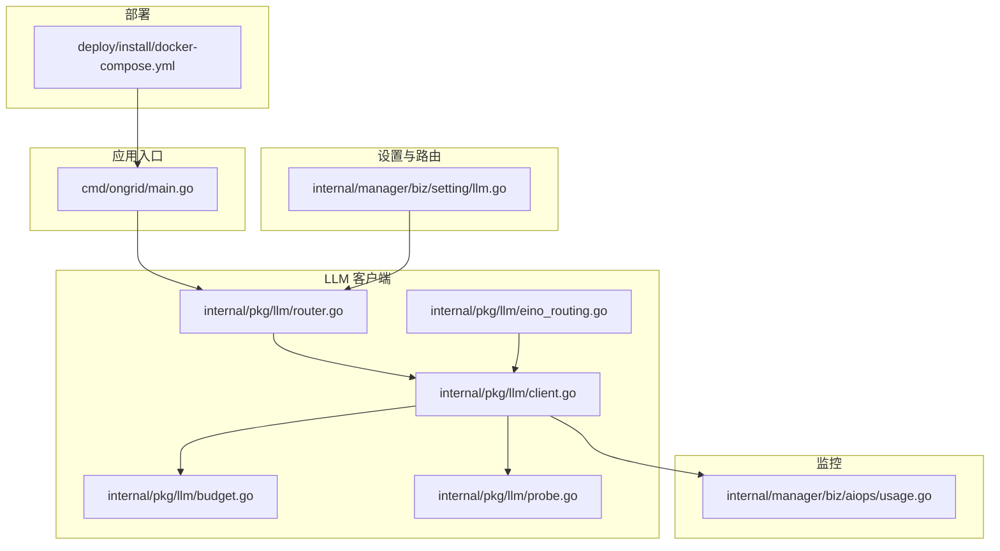
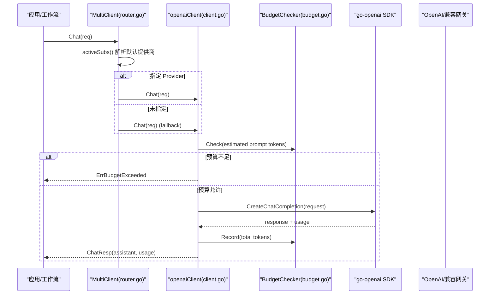
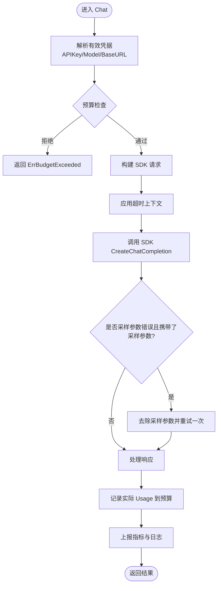
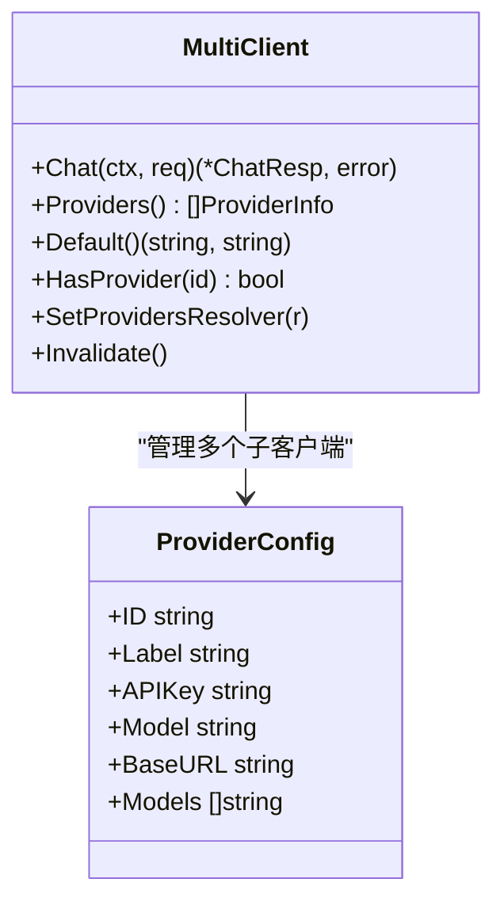
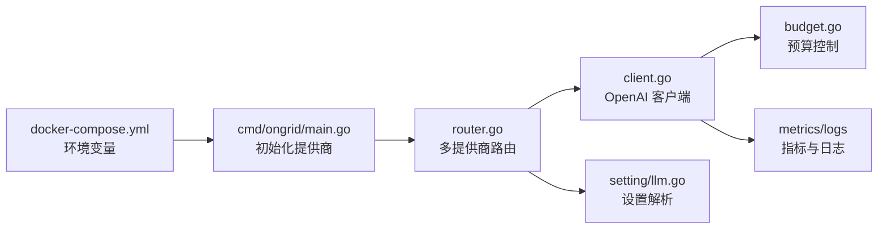

# OpenAI 模型配置

<cite>
**本文引用的文件**
- [internal/pkg/llm/client.go](file://internal/pkg/llm/client.go)
- [internal/pkg/llm/router.go](file://internal/pkg/llm/router.go)
- [internal/pkg/llm/budget.go](file://internal/pkg/llm/budget.go)
- [internal/pkg/llm/probe.go](file://internal/pkg/llm/probe.go)
- [internal/pkg/llm/eino_routing.go](file://internal/pkg/llm/eino_routing.go)
- [internal/manager/biz/setting/llm.go](file://internal/manager/biz/setting/llm.go)
- [cmd/ongrid/main.go](file://cmd/ongrid/main.go)
- [deploy/install/docker-compose.yml](file://deploy/install/docker-compose.yml)
- [internal/manager/biz/aiops/usage.go](file://internal/manager/biz/aiops/usage.go)
</cite>

## 目录
1. [简介](#简介)
2. [项目结构](#项目结构)
3. [核心组件](#核心组件)
4. [架构总览](#架构总览)
5. [详细组件分析](#详细组件分析)
6. [依赖关系分析](#依赖关系分析)
7. [性能与成本优化](#性能与成本优化)
8. [故障排查指南](#故障排查指南)
9. [结论](#结论)
10. [附录：配置示例与环境变量](#附录配置示例与环境变量)

## 简介
本技术文档聚焦于本项目中 OpenAI 模型的配置与使用，覆盖以下主题：
- API 密钥获取、Base URL 设置与模型选择
- gpt-5.x 等推理型模型的特殊参数处理（如 temperature/top_p/n 固定）
- 认证流程、请求格式与错误处理机制
- 多模型与默认模型配置方法
- 成本控制策略：预算限制、Token 用量监控、缓存与重试建议

## 项目结构
与 OpenAI LLM 能力相关的代码主要位于 internal/pkg/llm 包，配合 manager 层的设置解析与路由，以及部署层的环境变量注入。关键文件职责如下：
- client.go：OpenAI 兼容的聊天客户端实现，封装请求构建、超时、预算检查、指标记录、推理模型自适应等
- router.go：多提供商路由（OpenAI/Anthropic/Zhipu/Gemini/DeepSeek/Kimi/Custom），提供默认提供商与模型选择
- budget.go：内存级每日 Token 预算控制
- probe.go：连通性探测（最小化请求验证 BaseURL/Key/Model）
- eino_routing.go：适配 eino 框架的模型路由与工具调用桥接
- setting/llm.go：从系统设置与环境变量解析各提供商配置（含 OpenAI）
- cmd/ongrid/main.go：启动时初始化 OpenAI 提供商及默认模型
- deploy/install/docker-compose.yml：环境变量映射（OPENAI_API_KEY、OPENAI_BASE_URL、OPENAI_MODEL 等）
- aiops/usage.go：按日聚合 Token 用量，用于仪表盘展示

图表来源
- [cmd/ongrid/main.go:585-614](file://cmd/ongrid/main.go#L585-L614)
- [internal/pkg/llm/router.go:1-129](file://internal/pkg/llm/router.go#L1-L129)
- [internal/pkg/llm/client.go:176-220](file://internal/pkg/llm/client.go#L176-L220)
- [internal/manager/biz/setting/llm.go:126-224](file://internal/manager/biz/setting/llm.go#L126-L224)
- [deploy/install/docker-compose.yml:76-99](file://deploy/install/docker-compose.yml#L76-L99)

章节来源
- [cmd/ongrid/main.go:585-614](file://cmd/ongrid/main.go#L585-L614)
- [internal/pkg/llm/router.go:1-129](file://internal/pkg/llm/router.go#L1-L129)
- [internal/pkg/llm/client.go:176-220](file://internal/pkg/llm/client.go#L176-L220)
- [internal/manager/biz/setting/llm.go:126-224](file://internal/manager/biz/setting/llm.go#L126-L224)
- [deploy/install/docker-compose.yml:76-99](file://deploy/install/docker-compose.yml#L76-L99)

## 核心组件
- OpenAI 客户端（client.go）
  - 负责将内部 ChatReq 转换为 SDK 请求，处理超时、预算检查、指标记录、推理模型参数自适应、Zhipu JWT 重写等
  - 支持通过 Resolver 动态获取 API Key、默认模型、Base URL，并带 TTL 缓存
- 多提供商路由（router.go）
  - 根据 ChatReq.Provider 分发到具体子客户端；空 Provider 时使用默认提供商或回退客户端
  - 暴露 Providers/Default/HasProvider 等查询接口，供 UI 与后台消费
- 预算控制（budget.go）
  - 基于 UTC 日的全局 Token 上限，Check 在发送前估算 Prompt Tokens，Record 在成功后累计 TotalTokens
- 探针（probe.go）
  - 使用相同 URL 规范化与鉴权路径发送最小请求，用于配置校验与连通性测试
- eino 适配（eino_routing.go）
  - 将现有 llm.Client 适配为 eino 的 ChatModel，支持 WithProvider 选择提供商、WithTools 绑定工具等

章节来源
- [internal/pkg/llm/client.go:46-128](file://internal/pkg/llm/client.go#L46-L128)
- [internal/pkg/llm/router.go:30-129](file://internal/pkg/llm/router.go#L30-L129)
- [internal/pkg/llm/budget.go:9-73](file://internal/pkg/llm/budget.go#L9-L73)
- [internal/pkg/llm/probe.go:15-72](file://internal/pkg/llm/probe.go#L15-L72)
- [internal/pkg/llm/eino_routing.go:78-142](file://internal/pkg/llm/eino_routing.go#L78-L142)

## 架构总览
下图展示了从应用入口到 OpenAI 兼容端点的完整调用链，包括多提供商路由、动态配置解析、预算检查、指标与日志记录。

图表来源
- [internal/pkg/llm/router.go:274-329](file://internal/pkg/llm/router.go#L274-L329)
- [internal/pkg/llm/client.go:387-507](file://internal/pkg/llm/client.go#L387-L507)
- [internal/pkg/llm/budget.go:35-60](file://internal/pkg/llm/budget.go#L35-L60)

## 详细组件分析

### OpenAI 客户端（client.go）
- 配置项
  - APIKey、Model、BaseURL、Timeout
  - BaseURL 为空时自动追加 /v1 以适配 OpenAI 兼容网关
- 认证与连接
  - 通过 go-openai SDK 创建客户端；对 Zhipu 使用自定义 HTTP 传输重写 Authorization 为 JWT
- 请求构建
  - 将 Message/ToolSchema 转为 SDK 请求；对推理模型（gpt-5.x、o-series、kimi-k2/k3、包含 reasoner/reasoning 的模型）自动移除温度等采样参数
- 超时与重试
  - 若调用方未设置 deadline，则使用默认超时（120s）；遇到“采样参数被拒绝”的错误会尝试一次去参重试
- 预算与指标
  - 发送前估算 Prompt Tokens 进行预算检查；成功后记录 TotalTokens 并上报 Prometheus 指标
- 错误处理
  - 统一包装错误；空 choices 视为错误；不记录用户内容，仅记录结构化字段

图表来源
- [internal/pkg/llm/client.go:387-507](file://internal/pkg/llm/client.go#L387-L507)
- [internal/pkg/llm/client.go:509-568](file://internal/pkg/llm/client.go#L509-L568)
- [internal/pkg/llm/client.go:617-713](file://internal/pkg/llm/client.go#L617-L713)

章节来源
- [internal/pkg/llm/client.go:46-128](file://internal/pkg/llm/client.go#L46-L128)
- [internal/pkg/llm/client.go:306-364](file://internal/pkg/llm/client.go#L306-L364)
- [internal/pkg/llm/client.go:387-507](file://internal/pkg/llm/client.go#L387-L507)
- [internal/pkg/llm/client.go:509-568](file://internal/pkg/llm/client.go#L509-L568)
- [internal/pkg/llm/client.go:617-713](file://internal/pkg/llm/client.go#L617-L713)

### 多提供商路由（router.go）
- 支持提供商：openai、anthropic、zhipu、gemini、deepseek、kimi、custom
- 默认提供商与模型
  - 优先使用显式 defaultProvider；否则取排序后的第一个可用提供商
  - 每个提供商可配置 Models 列表与默认 Model
- 动态解析
  - 通过 ProvidersResolver 定期刷新提供商目录（TTL=60s），失败时软降级到构造期配置
- 路由逻辑
  - 若 req.Provider 为空，使用默认提供商；不存在则回退到构造时传入的 fallback 客户端

图表来源
- [internal/pkg/llm/router.go:30-129](file://internal/pkg/llm/router.go#L30-L129)
- [internal/pkg/llm/router.go:240-329](file://internal/pkg/llm/router.go#L240-L329)

章节来源
- [internal/pkg/llm/router.go:30-129](file://internal/pkg/llm/router.go#L30-L129)
- [internal/pkg/llm/router.go:240-329](file://internal/pkg/llm/router.go#L240-L329)

### 预算控制（budget.go）
- InMemoryBudget 提供按 UTC 日的 Token 总量上限
- Check 在发送前估算 Prompt Tokens，防止超支
- Record 在成功后累计 TotalTokens
- 适用于单租户 MVP；未来可扩展至 per-user/per-org 计费

章节来源
- [internal/pkg/llm/budget.go:9-73](file://internal/pkg/llm/budget.go#L9-L73)

### 探针（probe.go）
- 使用与生产相同的 URL 规范化与鉴权路径发送最小请求
- 用于验证 APIKey、BaseURL、Model 的有效性
- 跳过指标、日志、重试与预算，避免污染运行时遥测

章节来源
- [internal/pkg/llm/probe.go:15-72](file://internal/pkg/llm/probe.go#L15-L72)

### eino 适配（eino_routing.go）
- RoutingChatModel 将多个 provider 的 ChatModel 统一管理，支持 WithProvider 选择
- NewClientChatModel 将现有 llm.Client 适配为 eino 的 ChatModel
- 支持 WithTools 绑定工具，兼容 eino ReAct 图构建

章节来源
- [internal/pkg/llm/eino_routing.go:78-142](file://internal/pkg/llm/eino_routing.go#L78-L142)
- [internal/pkg/llm/eino_routing.go:317-353](file://internal/pkg/llm/eino_routing.go#L317-L353)

## 依赖关系分析
- 启动阶段（cmd/ongrid/main.go）
  - 初始化 OpenAI 提供商，设置默认模型（例如 gpt-5.4）与模型列表
- 运行阶段
  - router.go 根据配置与 Resolver 动态加载提供商
  - client.go 负责具体请求执行、预算检查、指标上报
  - setting/llm.go 从系统设置与环境变量解析提供商配置
  - docker-compose.yml 将环境变量注入服务

图表来源
- [deploy/install/docker-compose.yml:76-99](file://deploy/install/docker-compose.yml#L76-L99)
- [cmd/ongrid/main.go:585-614](file://cmd/ongrid/main.go#L585-L614)
- [internal/pkg/llm/router.go:274-329](file://internal/pkg/llm/router.go#L274-L329)
- [internal/manager/biz/setting/llm.go:126-224](file://internal/manager/biz/setting/llm.go#L126-L224)

章节来源
- [deploy/install/docker-compose.yml:76-99](file://deploy/install/docker-compose.yml#L76-L99)
- [cmd/ongrid/main.go:585-614](file://cmd/ongrid/main.go#L585-L614)
- [internal/pkg/llm/router.go:274-329](file://internal/pkg/llm/router.go#L274-L329)
- [internal/manager/biz/setting/llm.go:126-224](file://internal/manager/biz/setting/llm.go#L126-L224)

## 性能与成本优化
- 预算限制
  - 使用 InMemoryBudget 设置每日 Token 上限，避免意外高消费
  - 结合 aiops/usage.go 的 Today 聚合查看当日使用情况
- 缓存与复用
  - SDK 客户端按 (apiKey, baseURL) 缓存，减少重复创建开销
  - Resolver 与 MultiClient 均带 TTL 缓存，降低 DB 读取频率
- 超时与重试
  - 默认超时 120s，避免长时间阻塞；对采样参数错误进行一次去参重试
  - 注意：工具调用非幂等，错误路径不进行重试
- 指标与监控
  - 记录请求耗时、成功/失败/超时/限流状态、Prompt/Completion/Total Tokens
  - 通过 Prometheus 指标与结构化日志观察模型使用与异常
- 成本控制最佳实践
  - 合理设置每日预算与超时时间
  - 使用探针提前验证配置，避免无效请求
  - 对高频场景启用缓存（如消息摘要、工具结果缓存）以减少重复请求
  - 监控 Token 使用趋势，及时调整模型与参数

章节来源
- [internal/pkg/llm/client.go:387-507](file://internal/pkg/llm/client.go#L387-L507)
- [internal/pkg/llm/budget.go:9-73](file://internal/pkg/llm/budget.go#L9-L73)
- [internal/manager/biz/aiops/usage.go:17-52](file://internal/manager/biz/aiops/usage.go#L17-L52)

## 故障排查指南
- 无 API Key
  - 现象：返回 ErrNoAPIKey
  - 排查：确认环境变量已设置，或通过设置服务注入
- Base URL 不正确
  - 现象：404 或流错误
  - 排查：确保 Base URL 包含 /v1；客户端会自动补全空路径的 Base URL
- 推理模型参数错误
  - 现象：400 提示 temperature/top_p 固定
  - 排查：客户端会自动识别推理模型并移除采样参数；若仍失败，检查模型名称是否命中推理家族
- 预算超限
  - 现象：返回 ErrBudgetExceeded
  - 排查：调整每日预算或清理历史用量；查看 Today 聚合
- 提供商未配置
  - 现象：返回 “no providers configured” 或 “provider not configured”
  - 排查：确认至少一个提供商有 APIKey；或通过设置服务启用

章节来源
- [internal/pkg/llm/client.go:387-507](file://internal/pkg/llm/client.go#L387-L507)
- [internal/pkg/llm/router.go:274-329](file://internal/pkg/llm/router.go#L274-L329)
- [internal/pkg/llm/probe.go:23-72](file://internal/pkg/llm/probe.go#L23-L72)

## 结论
本项目提供了完整的 OpenAI 模型配置与使用能力，涵盖多提供商路由、动态配置、预算控制、指标监控与错误处理。通过环境变量与设置服务的分层解析，既保证了启动时的可用性，也支持运行时的灵活调整。对于 gpt-5.x 等推理模型，系统自动处理采样参数限制，提升兼容性。结合预算与监控，可有效控制成本并保障稳定性。

## 附录：配置示例与环境变量
- 环境变量（docker-compose.yml）
  - OPENAI_API_KEY → ONGRID_OPENAI_API_KEY
  - OPENAI_MODEL → ONGRID_OPENAI_MODEL
  - OPENAI_BASE_URL → ONGRID_OPENAI_BASE_URL
- 启动时默认模型与模型列表（main.go）
  - 默认模型：gpt-5.4
  - 模型列表：gpt-5.5、gpt-5.4、gpt-5.4-mini
- 设置服务（setting/llm.go）
  - 支持从系统设置表读取每提供商的 APIKey、BaseURL、Models、DefaultModel
  - 支持 legacy openai_model 键向后兼容
- 多模型与默认模型
  - 可通过设置服务为 OpenAI 配置多个模型，并指定默认模型
  - 路由层会根据默认提供商与默认模型选择目标模型
- 成本控制
  - 设置每日 Token 预算（budget.go）
  - 使用探针验证配置（probe.go）
  - 监控指标与日志（client.go）
  - 查看当日用量（aiops/usage.go）

章节来源
- [deploy/install/docker-compose.yml:76-99](file://deploy/install/docker-compose.yml#L76-L99)
- [cmd/ongrid/main.go:585-614](file://cmd/ongrid/main.go#L585-L614)
- [internal/manager/biz/setting/llm.go:126-224](file://internal/manager/biz/setting/llm.go#L126-L224)
- [internal/pkg/llm/budget.go:9-73](file://internal/pkg/llm/budget.go#L9-L73)
- [internal/pkg/llm/probe.go:23-72](file://internal/pkg/llm/probe.go#L23-L72)
- [internal/manager/biz/aiops/usage.go:17-52](file://internal/manager/biz/aiops/usage.go#L17-L52)