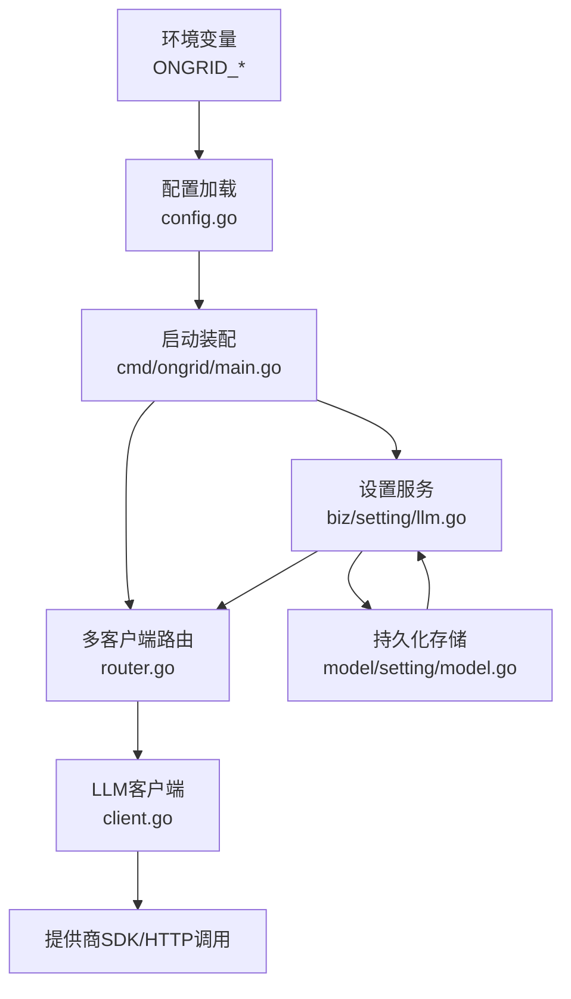
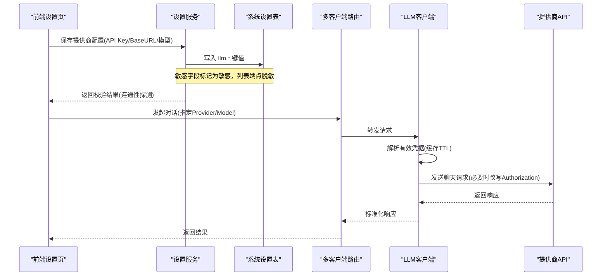
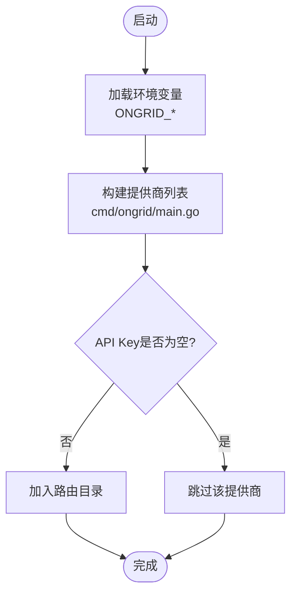
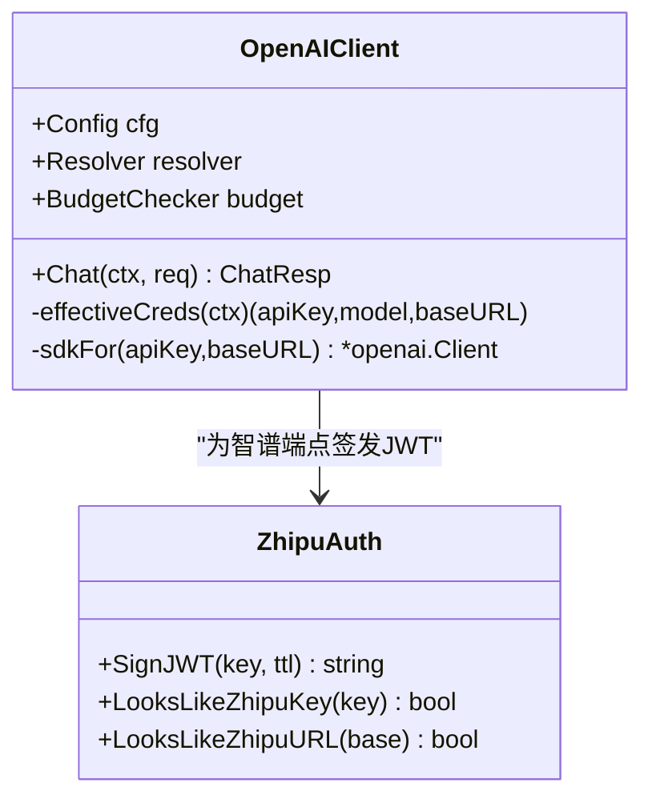
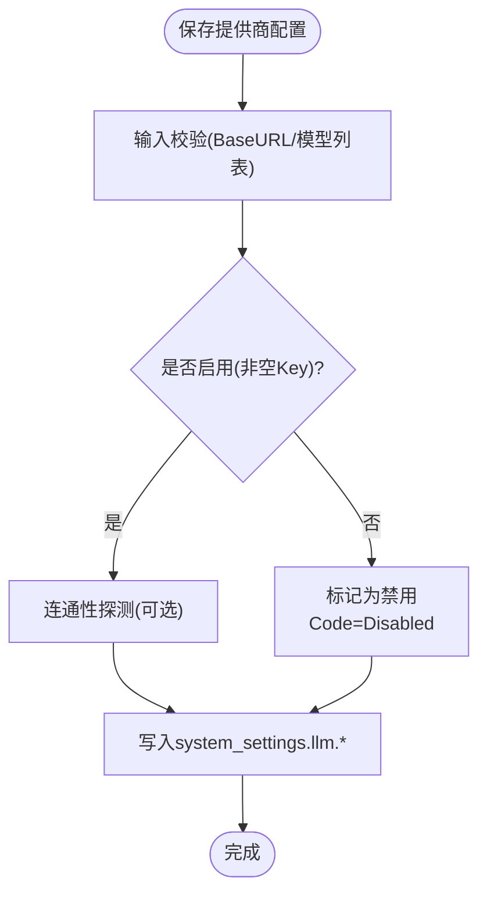
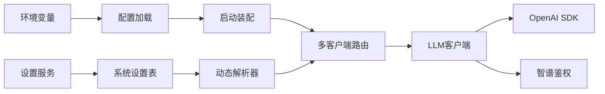

# 国内模型提供商配置

<cite>
**本文引用的文件**
- [internal/pkg/llm/client.go](file://internal/pkg/llm/client.go)
- [internal/pkg/llm/router.go](file://internal/pkg/llm/router.go)
- [internal/pkg/zhipuauth/zhipuauth.go](file://internal/pkg/zhipuauth/zhipuauth.go)
- [internal/pkg/config/config.go](file://internal/pkg/config/config.go)
- [cmd/ongrid/main.go](file://cmd/ongrid/main.go)
- [internal/manager/biz/setting/llm.go](file://internal/manager/biz/setting/llm.go)
- [internal/manager/biz/setting/llm_probe.go](file://internal/manager/biz/setting/llm_probe.go)
- [internal/manager/model/setting/model.go](file://internal/manager/model/setting/model.go)
- [web/src/pages/settings/LLM.tsx](file://web/src/pages/settings/LLM.tsx)
</cite>

## 目录
1. [简介](#简介)
2. [项目结构](#项目结构)
3. [核心组件](#核心组件)
4. [架构总览](#架构总览)
5. [详细组件分析](#详细组件分析)
6. [依赖关系分析](#依赖关系分析)
7. [性能与网络优化](#性能与网络优化)
8. [故障排查指南](#故障排查指南)
9. [结论](#结论)
10. [附录：各提供商配置要点](#附录各提供商配置要点)

## 简介
本技术文档聚焦于在系统中配置国内AI模型提供商（智谱GLM、DeepSeek、Kimi/Moonshot）的完整流程，包括API密钥获取平台、Base URL设置、模型选择、认证流程、网络要求与合规性考虑。同时给出不同业务场景下的模型选型建议与网络优化实践（如使用国内CDN、代理服务器、延迟处理等），帮助快速落地并稳定运行。

## 项目结构
系统对多模型提供商的统一接入通过“多客户端路由 + 动态配置解析”实现：
- 启动时从环境变量注入各提供商的默认值（API Key、Model、BaseURL、Models）。
- 运行时可通过管理后台持久化配置（system_settings.llm.*），无需重启即可生效。
- LLM客户端统一遵循OpenAI兼容接口，内部对特定提供商做适配（如智谱JWT鉴权）。

图表来源
- [internal/pkg/config/config.go:450-482](file://internal/pkg/config/config.go#L450-L482)
- [cmd/ongrid/main.go:585-647](file://cmd/ongrid/main.go#L585-L647)
- [internal/pkg/llm/router.go:18-59](file://internal/pkg/llm/router.go#L18-L59)
- [internal/pkg/llm/client.go:163-220](file://internal/pkg/llm/client.go#L163-L220)
- [internal/manager/biz/setting/llm.go:12-53](file://internal/manager/biz/setting/llm.go#L12-L53)
- [internal/manager/model/setting/model.go:79-149](file://internal/manager/model/setting/model.go#L79-L149)

章节来源
- [internal/pkg/config/config.go:450-482](file://internal/pkg/config/config.go#L450-L482)
- [cmd/ongrid/main.go:585-647](file://cmd/ongrid/main.go#L585-L647)
- [internal/pkg/llm/router.go:18-59](file://internal/pkg/llm/router.go#L18-L59)
- [internal/pkg/llm/client.go:163-220](file://internal/pkg/llm/client.go#L163-L220)
- [internal/manager/biz/setting/llm.go:12-53](file://internal/manager/biz/setting/llm.go#L12-L53)
- [internal/manager/model/setting/model.go:79-149](file://internal/manager/model/setting/model.go#L79-L149)

## 核心组件
- 多客户端路由：根据请求中的Provider字段将对话路由到对应提供商；支持默认提供商与动态解析器。
- LLM客户端：统一OpenAI兼容接口，内置预算控制、超时保护、指标上报、推理模型参数自适应。
- 设置解析器：从DB读取每提供商的配置（API Key、BaseURL、默认模型、可用模型列表），支持空Key禁用某提供商。
- 智谱鉴权：自动识别智谱端点与密钥格式，为每次请求生成JWT签名，避免401错误。

章节来源
- [internal/pkg/llm/router.go:18-59](file://internal/pkg/llm/router.go#L18-L59)
- [internal/pkg/llm/client.go:125-220](file://internal/pkg/llm/client.go#L125-L220)
- [internal/manager/biz/setting/llm.go:12-53](file://internal/manager/biz/setting/llm.go#L12-L53)
- [internal/pkg/zhipuauth/zhipuauth.go:1-91](file://internal/pkg/zhipuauth/zhipuauth.go#L1-L91)

## 架构总览
下图展示了从用户界面到后端路由再到具体提供商调用的端到端流程，以及配置如何从环境变量和数据库注入。

图表来源
- [internal/manager/biz/setting/llm_probe.go:120-189](file://internal/manager/biz/setting/llm_probe.go#L120-L189)
- [internal/manager/model/setting/model.go:79-149](file://internal/manager/model/setting/model.go#L79-L149)
- [internal/pkg/llm/client.go:263-329](file://internal/pkg/llm/client.go#L263-L329)
- [internal/pkg/llm/client.go:366-385](file://internal/pkg/llm/client.go#L366-L385)
- [internal/pkg/llm/router.go:18-59](file://internal/pkg/llm/router.go#L18-L59)

## 详细组件分析

### 多客户端路由与提供商装配
- 启动时按环境变量组装各提供商配置（ID、Label、APIKey、Model、BaseURL、Models）。
- 若某提供商API Key为空，则不会加入路由目录，前端也不会显示该选项。
- 支持通过设置服务动态覆盖，无需重启。

图表来源
- [cmd/ongrid/main.go:585-647](file://cmd/ongrid/main.go#L585-L647)
- [internal/pkg/config/config.go:450-482](file://internal/pkg/config/config.go#L450-L482)

章节来源
- [cmd/ongrid/main.go:585-647](file://cmd/ongrid/main.go#L585-L647)
- [internal/pkg/config/config.go:450-482](file://internal/pkg/config/config.go#L450-L482)

### LLM客户端与认证适配
- 统一接口：ChatReq/ChatResp，支持工具调用、温度等参数。
- 凭据解析：优先使用Resolver（DB设置），否则回退到环境变量；带TTL缓存减少DB访问。
- 智谱适配：当BaseURL包含“bigmodel”且密钥形如“id.secret”，自动替换Authorization为JWT签名，避免401。
- 推理模型自适应：检测并移除不支持的温度/top_p等采样参数，避免400错误。

图表来源
- [internal/pkg/llm/client.go:163-329](file://internal/pkg/llm/client.go#L163-L329)
- [internal/pkg/zhipuauth/zhipuauth.go:1-91](file://internal/pkg/zhipuauth/zhipuauth.go#L1-L91)

章节来源
- [internal/pkg/llm/client.go:163-329](file://internal/pkg/llm/client.go#L163-L329)
- [internal/pkg/zhipuauth/zhipuauth.go:1-91](file://internal/pkg/zhipuauth/zhipuauth.go#L1-L91)

### 设置服务与配置持久化
- 支持按提供商维度保存：API Key、BaseURL、默认模型、可用模型列表（JSON数组）。
- 保存前进行连通性探测（可选），失败不持久化，防止脏配置。
- 空API Key表示显式禁用该提供商，即使环境变量存在也会被覆盖。

图表来源
- [internal/manager/biz/setting/llm_probe.go:120-189](file://internal/manager/biz/setting/llm_probe.go#L120-L189)
- [internal/manager/model/setting/model.go:79-149](file://internal/manager/model/setting/model.go#L79-L149)

章节来源
- [internal/manager/biz/setting/llm_probe.go:120-189](file://internal/manager/biz/setting/llm_probe.go#L120-L189)
- [internal/manager/model/setting/model.go:79-149](file://internal/manager/model/setting/model.go#L79-L149)

### 前端设置界面
- 提供各提供商的提示文案、占位符（BaseURL、默认模型）、键名映射。
- 自定义提供商需要填写BaseURL；已配置的提供商会显示“已配置”。

章节来源
- [web/src/pages/settings/LLM.tsx:90-125](file://web/src/pages/settings/LLM.tsx#L90-L125)
- [web/src/pages/settings/LLM.tsx:421-432](file://web/src/pages/settings/LLM.tsx#L421-L432)

## 依赖关系分析
- 配置层：环境变量 → 启动装配 → 设置服务 → 数据库。
- 路由层：多客户端路由 → 动态解析器（DB）→ 具体客户端。
- 客户端层：OpenAI兼容SDK → 提供商API（必要时改写鉴权头）。

图表来源
- [internal/pkg/config/config.go:450-482](file://internal/pkg/config/config.go#L450-L482)
- [cmd/ongrid/main.go:585-647](file://cmd/ongrid/main.go#L585-L647)
- [internal/manager/biz/setting/llm.go:12-53](file://internal/manager/biz/setting/llm.go#L12-L53)
- [internal/pkg/llm/client.go:163-329](file://internal/pkg/llm/client.go#L163-L329)
- [internal/pkg/zhipuauth/zhipuauth.go:1-91](file://internal/pkg/zhipuauth/zhipuauth.go#L1-L91)

章节来源
- [internal/pkg/config/config.go:450-482](file://internal/pkg/config/config.go#L450-L482)
- [cmd/ongrid/main.go:585-647](file://cmd/ongrid/main.go#L585-L647)
- [internal/manager/biz/setting/llm.go:12-53](file://internal/manager/biz/setting/llm.go#L12-L53)
- [internal/pkg/llm/client.go:163-329](file://internal/pkg/llm/client.go#L163-L329)
- [internal/pkg/zhipuauth/zhipuauth.go:1-91](file://internal/pkg/zhipuauth/zhipuauth.go#L1-L91)

## 性能与网络优化
- 超时与重试
  - 默认请求超时120秒，适用于复杂推理任务；可在调用方上下文设置更短或更长超时。
  - 对推理模型自动移除不支持的采样参数，避免400导致的无效往返。
- 连接与鉴权
  - 智谱端点自动签发JWT，避免401；密钥与端点匹配规则内建。
  - BaseURL规范化：无路径时自动追加/v1，适配本地Ollama/LM Studio等网关。
- 缓存与解析
  - 凭据解析带TTL缓存，降低DB查询频率；SDK客户端按(apiKey, baseURL)缓存。
- 网络建议（通用）
  - 使用国内CDN或就近节点加速访问提供商API。
  - 配置企业代理（HTTP/HTTPS）以应对出口限制。
  - 合理设置超时与重试策略，结合监控观察P95/P99延迟。
  - 对高并发场景，复用HTTP连接池，避免频繁握手。

章节来源
- [internal/pkg/llm/client.go:37-44](file://internal/pkg/llm/client.go#L37-L44)
- [internal/pkg/llm/client.go:331-364](file://internal/pkg/llm/client.go#L331-L364)
- [internal/pkg/llm/client.go:263-329](file://internal/pkg/llm/client.go#L263-L329)
- [internal/pkg/zhipuauth/zhipuauth.go:1-91](file://internal/pkg/zhipuauth/zhipuauth.go#L1-L91)

## 故障排查指南
- 无法选择提供商
  - 检查环境变量中对应提供商的API Key是否为空；为空则不会出现在前端下拉框。
- 401未授权（智谱）
  - 确认BaseURL指向智谱v4端点，且密钥为“id.secret”格式；系统将自动签发JWT。
- 400参数错误（推理模型）
  - 系统会自动检测并移除temperature/top_p等参数；若仍失败，检查是否使用了不支持的模型别名。
- BaseURL错误
  - 保存时会校验BaseURL格式；确保包含正确的版本段（如/v1）。
- 配置未生效
  - 设置服务有缓存TTL；等待约60秒或刷新页面；确认DB中对应键值已更新。

章节来源
- [internal/manager/biz/setting/llm_probe.go:279-305](file://internal/manager/biz/setting/llm_probe.go#L279-L305)
- [internal/pkg/llm/client.go:366-385](file://internal/pkg/llm/client.go#L366-L385)
- [internal/pkg/llm/client.go:617-713](file://internal/pkg/llm/client.go#L617-L713)
- [internal/manager/model/setting/model.go:79-149](file://internal/manager/model/setting/model.go#L79-L149)

## 结论
本系统通过统一的多客户端路由与动态配置解析，实现了对国内主流AI模型提供商（智谱GLM、DeepSeek、Kimi/Moonshot）的无缝接入。借助环境变量与数据库双通道配置、自动鉴权适配与推理模型参数自适应，既保证了易用性，又提升了稳定性与可维护性。配合合理的网络优化策略，可在国内环境中获得低延迟、高可用的AI能力支撑。

## 附录：各提供商配置要点

### 智谱 GLM
- API密钥获取平台：open.bigmodel.cn
- Base URL：https://open.bigmodel.cn/api/paas/v4
- 默认模型：glm-4.7（可从环境变量覆盖）
- 认证流程：自动识别智谱端点与密钥格式，为每次请求签发JWT并替换Authorization头。
- 适用场景：中文理解能力强、本地化服务完善，适合客服、知识问答、运维辅助等。

章节来源
- [web/src/pages/settings/LLM.tsx:90-125](file://web/src/pages/settings/LLM.tsx#L90-L125)
- [internal/pkg/config/config.go:465-468](file://internal/pkg/config/config.go#L465-L468)
- [cmd/ongrid/main.go:612-618](file://cmd/ongrid/main.go#L612-L618)
- [internal/pkg/zhipuauth/zhipuauth.go:1-91](file://internal/pkg/zhipuauth/zhipuauth.go#L1-L91)

### DeepSeek
- API密钥获取平台：platform.deepseek.com
- Base URL：https://api.deepseek.com/v1
- 默认模型：deepseek-v4-flash（可从环境变量覆盖）
- 认证流程：标准Bearer Token；系统按OpenAI兼容接口调用。
- 适用场景：推理与代码生成能力强，适合研发辅助、自动化脚本生成、复杂问题拆解。

章节来源
- [web/src/pages/settings/LLM.tsx:113-124](file://web/src/pages/settings/LLM.tsx#L113-L124)
- [internal/pkg/config/config.go:473-476](file://internal/pkg/config/config.go#L473-L476)
- [cmd/ongrid/main.go:629-636](file://cmd/ongrid/main.go#L629-L636)

### Kimi / Moonshot
- API密钥获取平台：moonshot.cn（Kimi平台）
- Base URL：https://api.moonshot.cn/v1
- 默认模型：kimi-k2.6（可从环境变量覆盖）
- 认证流程：标准Bearer Token；系统按OpenAI兼容接口调用。
- 适用场景：长文本理解与总结能力强，适合报告生成、知识库摘要、会议记录整理。

章节来源
- [web/src/pages/settings/LLM.tsx:125-140](file://web/src/pages/settings/LLM.tsx#L125-L140)
- [internal/pkg/config/config.go:477-480](file://internal/pkg/config/config.go#L477-L480)
- [cmd/ongrid/main.go:638-645](file://cmd/ongrid/main.go#L638-L645)

### 配置示例（环境变量）
- 智谱 GLM
  - ONGRID_ZHIPU_API_KEY
  - ONGRID_ZHIPU_MODEL
  - ONGRID_ZHIPU_BASE_URL
  - ONGRID_ZHIPU_MODELS
- DeepSeek
  - ONGRID_DEEPSEEK_API_KEY
  - ONGRID_DEEPSEEK_MODEL
  - ONGRID_DEEPSEEK_BASE_URL
  - ONGRID_DEEPSEEK_MODELS
- Kimi / Moonshot
  - ONGRID_KIMI_API_KEY
  - ONGRID_KIMI_MODEL
  - ONGRID_KIMI_BASE_URL
  - ONGRID_KIMI_MODELS

章节来源
- [internal/pkg/config/config.go:465-480](file://internal/pkg/config/config.go#L465-L480)

### 业务场景与模型选择建议
- 客服与知识问答：优先智谱GLM（中文理解强、本地化好）。
- 研发辅助与代码生成：优先DeepSeek（推理与代码能力强）。
- 长文本总结与报告生成：优先Kimi/Moonshot（长上下文优势）。
- 多模型混合：通过路由按场景切换，或在前端为用户暴露模型选择。

[本节为概念性内容，不直接分析具体文件]