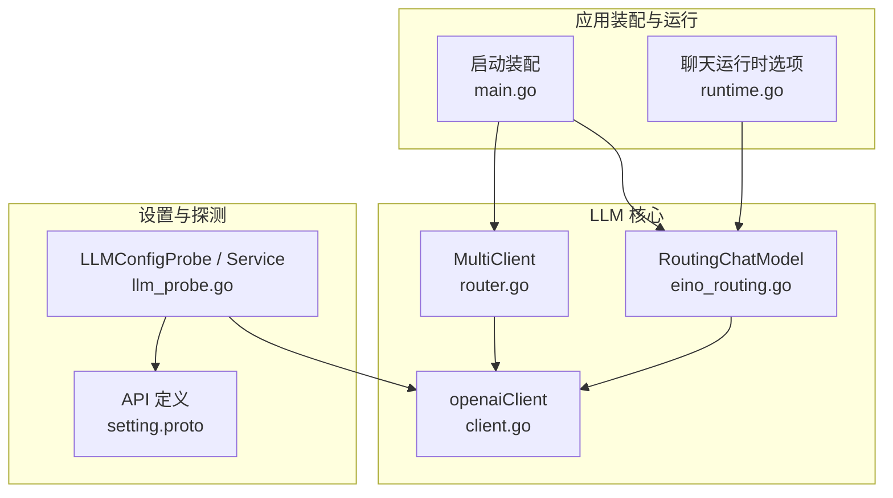
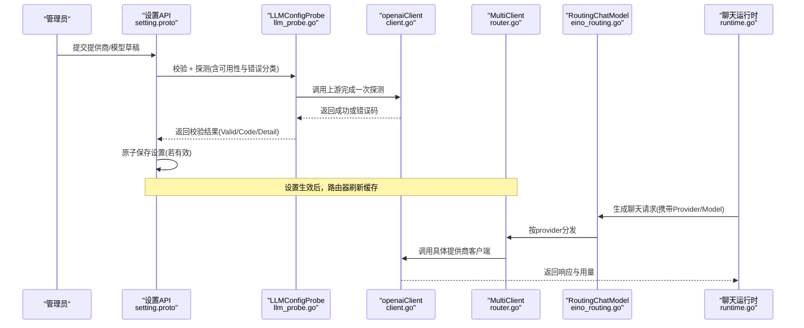
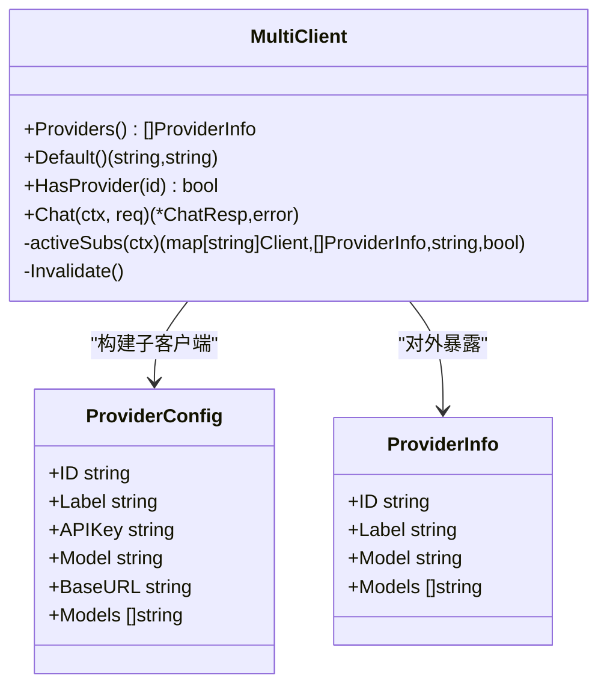
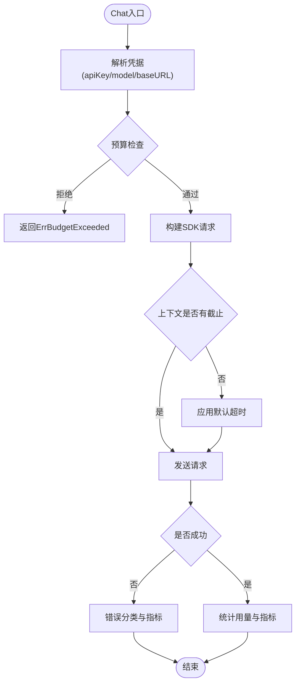
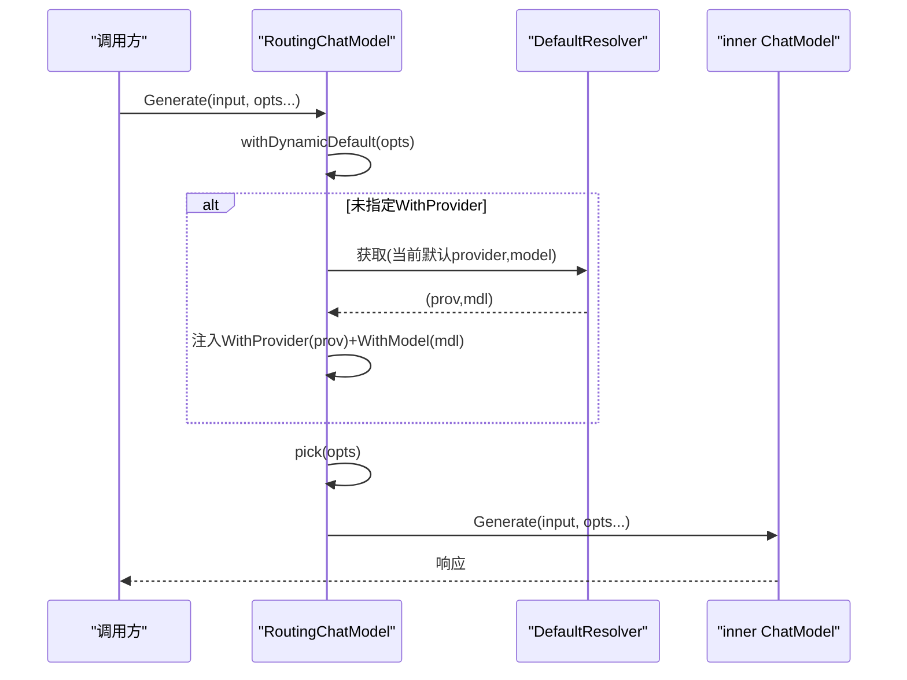
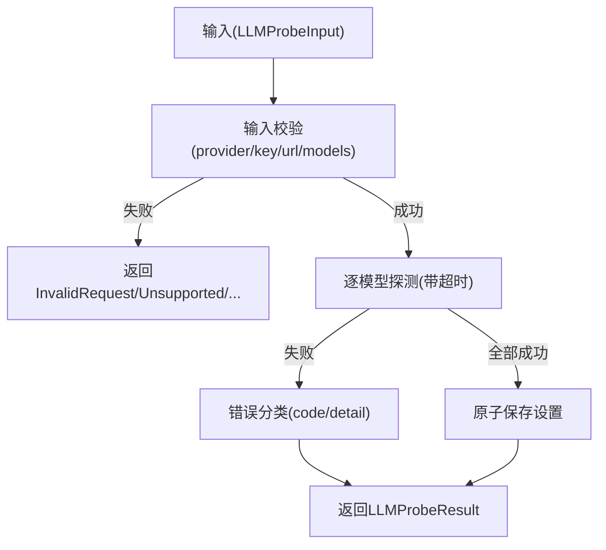
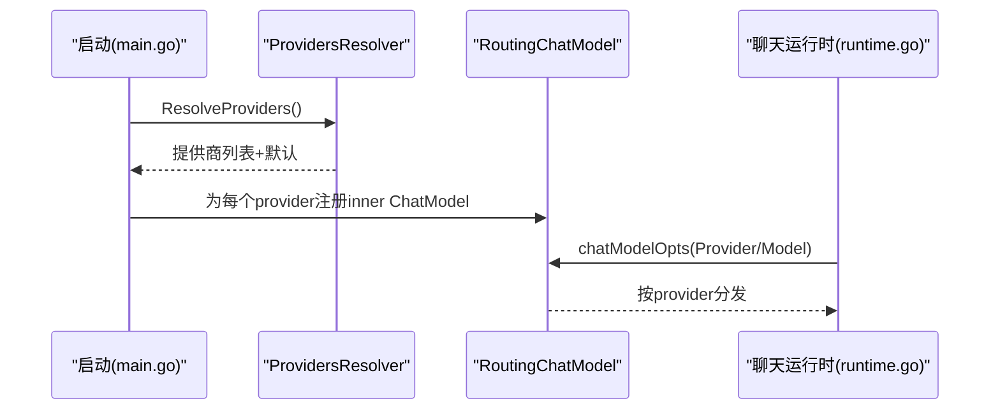
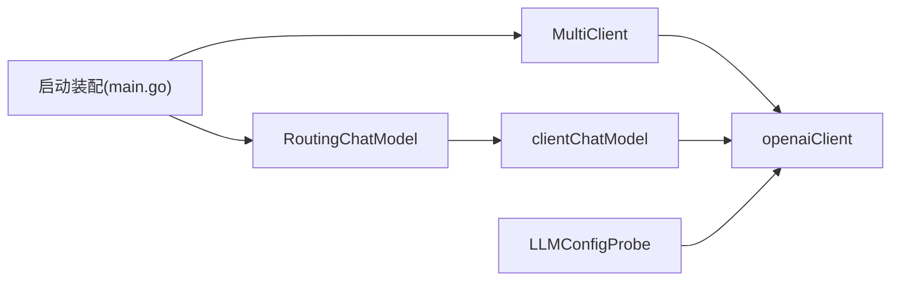

# 模型管理与选择

<cite>
**本文引用的文件**
- [router.go](file://internal/pkg/llm/router.go)
- [client.go](file://internal/pkg/llm/client.go)
- [eino_routing.go](file://internal/pkg/llm/eino_routing.go)
- [llm_probe.go](file://internal/manager/biz/setting/llm_probe.go)
- [main.go](file://cmd/ongrid/main.go)
- [runtime.go](file://internal/manager/biz/aiops/chatruntime/runtime.go)
- [setting.proto](file://api/manager/setting/v1/setting.proto)
</cite>

## 目录
1. [简介](#简介)
2. [项目结构](#项目结构)
3. [核心组件](#核心组件)
4. [架构总览](#架构总览)
5. [详细组件分析](#详细组件分析)
6. [依赖关系分析](#依赖关系分析)
7. [性能与可用性](#性能与可用性)
8. [故障排查指南](#故障排查指南)
9. [结论](#结论)
10. [附录：配置示例与策略](#附录配置示例与策略)

## 简介
本技术文档聚焦于“模型管理与选择”能力，覆盖以下目标：
- 在每个提供商下添加、删除和管理多个模型实例
- 默认模型设置机制、模型优先级排序与动态切换
- 模型列表的验证过程、可用性检查与性能测试
- 基于业务需求的模型组合配置实践
- 高级策略：按任务类型分配模型、成本效益分析与故障转移

该能力由多提供商路由、运行时动态解析、配置校验与探测、以及前端/后端交互共同构成。

## 项目结构
围绕模型管理的代码主要分布在如下位置：
- LLM 多提供商路由与客户端：internal/pkg/llm/*
- 设置与服务层（配置保存、探测）：internal/manager/biz/setting/*
- 启动时装配与运行时选择：cmd/ongrid/main.go、internal/manager/biz/aiops/chatruntime/runtime.go
- API 定义：api/manager/setting/v1/setting.proto

图表来源
- [router.go:1-129](file://internal/pkg/llm/router.go#L1-L129)
- [client.go:187-220](file://internal/pkg/llm/client.go#L187-L220)
- [eino_routing.go:117-142](file://internal/pkg/llm/eino_routing.go#L117-L142)
- [llm_probe.go:120-180](file://internal/manager/biz/setting/llm_probe.go#L120-L180)
- [main.go:3881-3946](file://cmd/ongrid/main.go#L3881-L3946)
- [runtime.go:1313-1330](file://internal/manager/biz/aiops/chatruntime/runtime.go#L1313-L1330)
- [setting.proto:19-42](file://api/manager/setting/v1/setting.proto#L19-L42)

章节来源
- [router.go:1-129](file://internal/pkg/llm/router.go#L1-L129)
- [client.go:187-220](file://internal/pkg/llm/client.go#L187-L220)
- [eino_routing.go:117-142](file://internal/pkg/llm/eino_routing.go#L117-L142)
- [llm_probe.go:120-180](file://internal/manager/biz/setting/llm_probe.go#L120-L180)
- [main.go:3881-3946](file://cmd/ongrid/main.go#L3881-L3946)
- [runtime.go:1313-1330](file://internal/manager/biz/aiops/chatruntime/runtime.go#L1313-L1330)
- [setting.proto:19-42](file://api/manager/setting/v1/setting.proto#L19-L42)

## 核心组件
- MultiClient（多提供商路由器）：根据请求中的 provider/model 将 Chat 请求分发到具体子客户端；支持静态构建与动态解析（TTL 缓存），并提供 Providers/Default 查询。
- openaiClient（统一客户端）：封装 OpenAI SDK，提供预算控制、超时保护、鉴权与错误分类；支持 Resolver 动态注入凭据与模型。
- RoutingChatModel（EINO 适配路由）：为 eino 框架提供按 provider 分发的 ChatModel；支持动态默认 provider 解析，避免重启生效。
- LLMConfigProbe/Service（配置校验与保存）：对草稿进行输入校验、URL/Key/模型合法性检查，并调用上游进行可用性探测；成功后原子保存设置。
- 启动装配与运行时选择：在启动时注册所有已知 provider 的 inner ChatModel，并在运行时将 SPA 的选择转换为 eino 选项，实现无感切换。

章节来源
- [router.go:30-129](file://internal/pkg/llm/router.go#L30-L129)
- [client.go:46-128](file://internal/pkg/llm/client.go#L46-L128)
- [eino_routing.go:38-142](file://internal/pkg/llm/eino_routing.go#L38-L142)
- [llm_probe.go:56-180](file://internal/manager/biz/setting/llm_probe.go#L56-L180)
- [main.go:3881-3946](file://cmd/ongrid/main.go#L3881-L3946)
- [runtime.go:1313-1330](file://internal/manager/biz/aiops/chatruntime/runtime.go#L1313-L1330)

## 架构总览
下图展示了从管理员配置到运行时调用的完整链路：管理员通过设置页面提交草稿，系统执行校验与探测，成功后持久化；运行时通过路由器和 eino 路由将请求分发到对应提供商与模型。

图表来源
- [setting.proto:19-42](file://api/manager/setting/v1/setting.proto#L19-L42)
- [llm_probe.go:191-331](file://internal/manager/biz/setting/llm_probe.go#L191-L331)
- [client.go:387-507](file://internal/pkg/llm/client.go#L387-L507)
- [router.go:274-329](file://internal/pkg/llm/router.go#L274-L329)
- [eino_routing.go:186-207](file://internal/pkg/llm/eino_routing.go#L186-L207)
- [runtime.go:1313-1330](file://internal/manager/biz/aiops/chatruntime/runtime.go#L1313-L1330)

## 详细组件分析

### 多提供商路由器（MultiClient）
- 职责：维护提供商目录（静态/动态），提供 Providers/Default/HasProvider/Chat 等能力；支持 TTL 缓存与失效刷新。
- 关键行为：
  - 构造时过滤空 APIKey 的提供商，仅暴露可用项。
  - 默认提供商优先使用显式 defaultProvider，否则取排序后的第一个。
  - 动态解析失败时软降级到静态集，避免频繁 DB 查询阻塞热路径。
  - Chat 路径记录指标，区分 timeout/rate_limited/error。

图表来源
- [router.go:30-129](file://internal/pkg/llm/router.go#L30-L129)
- [router.go:155-238](file://internal/pkg/llm/router.go#L155-L238)
- [router.go:240-329](file://internal/pkg/llm/router.go#L240-L329)

章节来源
- [router.go:30-129](file://internal/pkg/llm/router.go#L30-L129)
- [router.go:155-238](file://internal/pkg/llm/router.go#L155-L238)
- [router.go:240-329](file://internal/pkg/llm/router.go#L240-L329)

### 统一客户端（openaiClient）
- 职责：封装 OpenAI SDK，处理鉴权、超时、预算、采样参数、错误分类与指标上报。
- 关键行为：
  - 支持 Resolver 动态注入 apiKey/model/baseURL，带 TTL 缓存。
  - 自动识别推理模型并移除不支持的采样参数，必要时重试。
  - 对 Zhipu 等特殊提供商安装自定义传输以重写鉴权头。
  - 预算检查在发送前进行，实际用量在成功后记录。

图表来源
- [client.go:187-220](file://internal/pkg/llm/client.go#L187-L220)
- [client.go:263-294](file://internal/pkg/llm/client.go#L263-L294)
- [client.go:387-507](file://internal/pkg/llm/client.go#L387-L507)

章节来源
- [client.go:46-128](file://internal/pkg/llm/client.go#L46-L128)
- [client.go:187-220](file://internal/pkg/llm/client.go#L187-L220)
- [client.go:263-294](file://internal/pkg/llm/client.go#L263-L294)
- [client.go:387-507](file://internal/pkg/llm/client.go#L387-L507)

### EINO 路由（RoutingChatModel）
- 职责：为 eino 框架提供按 provider 分发的 ChatModel；支持动态默认 provider 解析，使运行时修改立即生效。
- 关键行为：
  - 构造时校验 Inner 非空且包含 DefaultProvider。
  - withDynamicDefault 在无显式 WithProvider 时注入当前配置的 provider 与 model。
  - pick 解析最终 inner ChatModel，未知 provider 返回明确错误。

图表来源
- [eino_routing.go:117-142](file://internal/pkg/llm/eino_routing.go#L117-L142)
- [eino_routing.go:144-184](file://internal/pkg/llm/eino_routing.go#L144-L184)
- [eino_routing.go:186-207](file://internal/pkg/llm/eino_routing.go#L186-L207)

章节来源
- [eino_routing.go:38-142](file://internal/pkg/llm/eino_routing.go#L38-L142)
- [eino_routing.go:144-184](file://internal/pkg/llm/eino_routing.go#L144-L184)
- [eino_routing.go:186-207](file://internal/pkg/llm/eino_routing.go#L186-L207)

### 配置校验与探测（LLMConfigProbe/Service）
- 职责：对管理员提交的提供商/模型草稿进行严格校验与可用性探测，成功后原子保存。
- 关键行为：
  - 输入校验：provider 白名单、APIKey 长度、BaseURL 格式、模型数量与长度限制、默认模型必须在 models 中。
  - 可用性探测：对每个暴露模型发起一次探测调用，捕获网络/DNS/TLS/HTTP 错误并分类为稳定 code。
  - 保存：若有效则原子写入设置；空 APIKey 表示禁用覆盖，跳过上游调用。

图表来源
- [llm_probe.go:205-295](file://internal/manager/biz/setting/llm_probe.go#L205-L295)
- [llm_probe.go:297-331](file://internal/manager/biz/setting/llm_probe.go#L297-L331)
- [llm_probe.go:368-453](file://internal/manager/biz/setting/llm_probe.go#L368-L453)

章节来源
- [llm_probe.go:56-180](file://internal/manager/biz/setting/llm_probe.go#L56-L180)
- [llm_probe.go:191-331](file://internal/manager/biz/setting/llm_probe.go#L191-L331)
- [llm_probe.go:368-453](file://internal/manager/biz/setting/llm_probe.go#L368-L453)

### 启动装配与运行时选择
- 启动时：
  - 从解析器获取已配置的提供商集合，为每个 provider 注册 inner ChatModel；若解析器为空则回退到环境变量提供的提供商。
  - 确定默认 provider（来自设置或回退）。
- 运行时：
  - 将 SPA 选择的 provider/model 转换为 eino 选项，注入到聊天图节点，实现无感知切换。

图表来源
- [main.go:3881-3946](file://cmd/ongrid/main.go#L3881-L3946)
- [runtime.go:1313-1330](file://internal/manager/biz/aiops/chatruntime/runtime.go#L1313-L1330)

章节来源
- [main.go:3881-3946](file://cmd/ongrid/main.go#L3881-L3946)
- [runtime.go:1313-1330](file://internal/manager/biz/aiops/chatruntime/runtime.go#L1313-L1330)

## 依赖关系分析
- MultiClient 依赖 openaiClient 作为具体实现；通过 ProviderConfig 构建子客户端。
- RoutingChatModel 依赖 llm.Client 适配器（clientChatModel）以实现 eino 接口。
- LLMConfigProbe 依赖 openaiClient 的探测能力，并将错误分类为稳定的 code。
- 启动装配依赖 ProvidersResolver 获取运行时配置，确保 UI 与内核一致。

图表来源
- [router.go:18-28](file://internal/pkg/llm/router.go#L18-L28)
- [client.go:22-27](file://internal/pkg/llm/client.go#L22-L27)
- [eino_routing.go:303-353](file://internal/pkg/llm/eino_routing.go#L303-L353)
- [llm_probe.go:16-20](file://internal/manager/biz/setting/llm_probe.go#L16-L20)
- [main.go:3881-3946](file://cmd/ongrid/main.go#L3881-L3946)

章节来源
- [router.go:18-28](file://internal/pkg/llm/router.go#L18-L28)
- [client.go:22-27](file://internal/pkg/llm/client.go#L22-L27)
- [eino_routing.go:303-353](file://internal/pkg/llm/eino_routing.go#L303-L353)
- [llm_probe.go:16-20](file://internal/manager/biz/setting/llm_probe.go#L16-L20)
- [main.go:3881-3946](file://cmd/ongrid/main.go#L3881-L3946)

## 性能与可用性
- 路由缓存：MultiClient 对动态解析结果采用 TTL 缓存（默认 60s），减少 DB 压力；支持 Invalidate 强制刷新。
- 客户端缓存：openaiClient 对 SDK 客户端按 (apiKey, baseURL) 缓存；Resolver 结果也带 TTL 缓存。
- 超时与预算：默认 120s 超时；预算检查在发送前进行，避免无效调用；记录实际用量用于计费与限流。
- 探测性能：LLMConfigProbe 对每个模型单次探测，带超时与错误分类，避免长时间阻塞。
- 指标与可观测性：路由与客户端均记录请求耗时、token 用量与状态标签，便于监控与告警。

[本节为通用性能讨论，不直接分析具体文件]

## 故障排查指南
- 常见错误码与含义（来自探测分类）：
  - authentication-failed：API Key 无效或认证失败
  - model-not-found：模型不存在或不可用
  - quota-exceeded：配额不足或付费问题
  - rate-limited：触发速率限制
  - timeout/canceled：超时或被取消
  - dns-failed/tls-failed/connection-failed：网络层问题
  - endpoint-not-found：端点未暴露 Chat Completions
  - invalid-request/invalid-response：请求或响应格式问题
  - upstream-error/provider-unavailable：上游错误或不可用
- 定位步骤：
  - 查看 LLMProbeResult.code 与 detail，确认是否为配置问题或上游问题。
  - 检查 MultiClient.Default/Providers 输出，确认当前默认与可用提供商。
  - 观察路由与客户端指标，区分 timeout/rate_limited/error。
  - 若启用动态解析，检查 ProvidersResolver 是否返回有效结果，必要时调用 Invalidate 刷新。

章节来源
- [llm_probe.go:23-45](file://internal/manager/biz/setting/llm_probe.go#L23-L45)
- [llm_probe.go:368-453](file://internal/manager/biz/setting/llm_probe.go#L368-L453)
- [router.go:331-346](file://internal/pkg/llm/router.go#L331-L346)

## 结论
本项目提供了完善的模型管理与选择能力：
- 多提供商支持与动态解析，无需重启即可生效
- 严格的配置校验与可用性探测，保障上线质量
- 灵活的运行时选择，支持按会话/任务切换提供商与模型
- 完善的指标与错误分类，便于监控与排障

建议在生产环境中结合业务需求制定模型组合策略，并持续优化成本与性能。

[本节为总结，不直接分析具体文件]

## 附录：配置示例与策略

### 在每个提供商下管理多个模型实例
- 添加模型：在设置页面为某提供商配置 models 列表与 default_model；保存前会逐一探测可用性。
- 删除模型：从 models 列表中移除目标模型；若 default_model 被移除，需重新指定。
- 禁用提供商：将 APIKey 清空，保存后标记为 disabled，不会调用上游。

章节来源
- [llm_probe.go:205-295](file://internal/manager/biz/setting/llm_probe.go#L205-L295)
- [llm_probe.go:136-180](file://internal/manager/biz/setting/llm_probe.go#L136-L180)

### 默认模型设置机制与优先级
- 启动默认：若无显式 default_provider，取排序后的第一个可用提供商。
- 运行时默认：RoutingChatModel.withDynamicDefault 在无 WithProvider 时注入当前配置的 provider 与 model。
- 显式覆盖：SPA 选择或调用方传入 Provider/Model 将覆盖默认。

章节来源
- [router.go:119-128](file://internal/pkg/llm/router.go#L119-L128)
- [eino_routing.go:144-184](file://internal/pkg/llm/eino_routing.go#L144-L184)
- [main.go:3881-3946](file://cmd/ongrid/main.go#L3881-L3946)

### 模型列表验证与可用性检查
- 输入校验：provider 白名单、APIKey/BaseURL/模型长度与数量限制、默认模型必须在 models 中。
- 可用性探测：对每个暴露模型发起一次探测，捕获网络/DNS/TLS/HTTP 错误并分类。
- 保存策略：仅当全部探测通过才原子保存；空 APIKey 表示禁用覆盖。

章节来源
- [llm_probe.go:205-295](file://internal/manager/biz/setting/llm_probe.go#L205-L295)
- [llm_probe.go:297-331](file://internal/manager/biz/setting/llm_probe.go#L297-L331)
- [llm_probe.go:368-453](file://internal/manager/biz/setting/llm_probe.go#L368-L453)

### 动态切换与运行时选择
- SPA 选择：将 Provider/Model 转换为 eino 选项注入聊天图节点。
- 无感切换：RoutingChatModel.withDynamicDefault 使运行时修改立即生效，无需重启。
- 回退机制：未知 provider 或解析失败时回退到 boot 默认或静态集。

章节来源
- [runtime.go:1313-1330](file://internal/manager/biz/aiops/chatruntime/runtime.go#L1313-L1330)
- [eino_routing.go:144-184](file://internal/pkg/llm/eino_routing.go#L144-L184)
- [router.go:155-238](file://internal/pkg/llm/router.go#L155-L238)

### 高级策略：按任务类型、成本效益与故障转移
- 按任务类型分配模型：
  - 简单问答/快速回复：选择低成本、低延迟模型（如轻量级开源或经济型云模型）。
  - 复杂推理/工具调用：选择强推理模型（如 o-series/gpt-5/kimi-k2/k3 等），注意其固定采样参数。
  - 长文本/知识库检索：选择上下文窗口大、稳定性高的模型。
- 成本效益分析：
  - 通过预算检查与用量记录控制成本；结合指标观察各模型的 token 消耗与成功率。
  - 对高频任务使用更经济的模型，对关键任务保留高质量模型。
- 故障转移机制：
  - 路由层对 timeout/rate_limited/error 进行分类，可在上层实现重试或切换到备用提供商。
  - 动态解析失败时软降级到静态集，保证服务连续性。
  - 探测阶段提前发现不可用模型，避免线上故障。

[本节为策略指导，不直接分析具体文件]