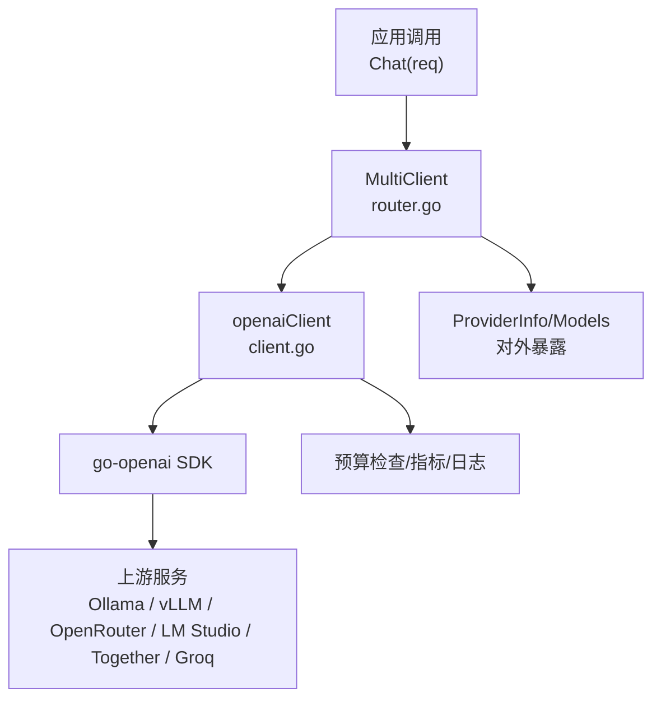
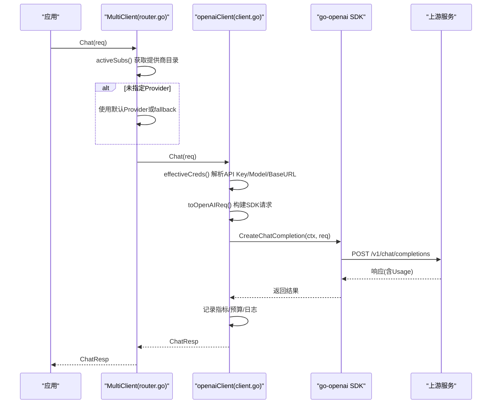
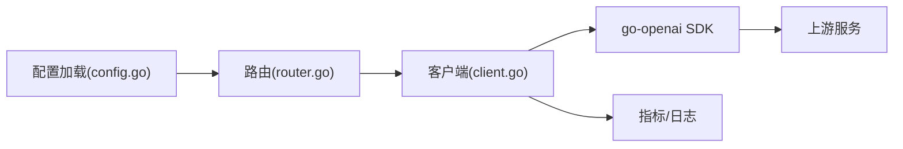

# 自定义OpenAI兼容服务配置

<cite>
**本文引用的文件**
- [internal/pkg/llm/client.go](file://internal/pkg/llm/client.go)
- [internal/pkg/llm/router.go](file://internal/pkg/llm/router.go)
- [internal/pkg/config/config.go](file://internal/pkg/config/config.go)
- [deploy/docker-compose.yml](file://deploy/docker-compose.yml)
- [internal/pkg/llm/probe.go](file://internal/pkg/llm/probe.go)
</cite>

## 目录
1. [简介](#简介)
2. [项目结构](#项目结构)
3. [核心组件](#核心组件)
4. [架构总览](#架构总览)
5. [详细组件分析](#详细组件分析)
6. [依赖关系分析](#依赖关系分析)
7. [性能考虑](#性能考虑)
8. [故障排查指南](#故障排查指南)
9. [结论](#结论)
10. [附录：各服务商配置示例](#附录：各服务商配置示例)

## 简介
本技术文档面向需要在系统中接入任意“OpenAI 兼容”大模型服务的运维与开发者，覆盖如何配置 Ollama、vLLM、OpenRouter、LM Studio、Together、Groq 等后端。重点说明：
- Base URL 的必填要求与自动补全规则
- API Key 的注入与缓存策略
- 模型名称的指定方式与默认回退
- OpenAI 兼容接口的标准请求/响应结构与错误处理
- 本地部署与配置示例（以 docker-compose 为例）
- 安全最佳实践（网络隔离、访问控制、数据隐私）

## 项目结构
系统通过统一的 LLM 客户端抽象对接多种上游提供商，所有实现均遵循 OpenAI 的 Chat Completions 接口形状。关键路径如下：
- 配置加载：从环境变量读取 OpenAI 及多提供商配置
- 路由分发：按 Provider 将请求路由到对应子客户端
- 客户端实现：基于 go-openai SDK 发送请求，统一处理超时、预算、指标与重试自愈
- 探测能力：提供轻量连通性探测，复用相同的鉴权与 Base URL 归一化逻辑

图表来源
- [internal/pkg/llm/router.go:61-129](file://internal/pkg/llm/router.go#L61-L129)
- [internal/pkg/llm/client.go:176-220](file://internal/pkg/llm/client.go#L176-L220)
- [internal/pkg/llm/client.go:387-507](file://internal/pkg/llm/client.go#L387-L507)

章节来源
- [internal/pkg/config/config.go:328-367](file://internal/pkg/config/config.go#L328-L367)
- [internal/pkg/llm/router.go:30-49](file://internal/pkg/llm/router.go#L30-L49)
- [internal/pkg/llm/client.go:46-56](file://internal/pkg/llm/client.go#L46-L56)

## 核心组件
- 配置层
  - OpenAIConfig：承载 APIKey、Model、BaseURL
  - LLMConfig：聚合多个提供商的配置（Anthropic、Zhipu、Gemini、DeepSeek、Kimi），并支持默认提供商与每日令牌限额
- 路由层
  - MultiClient：根据 ChatReq.Provider 选择子客户端；支持动态解析器刷新提供商目录
- 客户端层
  - openaiClient：封装 go-openai SDK，负责请求构建、超时、预算、指标、错误处理与推理模型参数自愈
- 探测层
  - ProbeChatCompletion：使用相同鉴权与 Base URL 归一化流程进行最小请求验证

章节来源
- [internal/pkg/config/config.go:328-367](file://internal/pkg/config/config.go#L328-L367)
- [internal/pkg/llm/router.go:61-129](file://internal/pkg/llm/router.go#L61-L129)
- [internal/pkg/llm/client.go:176-220](file://internal/pkg/llm/client.go#L176-L220)
- [internal/pkg/llm/probe.go:15-71](file://internal/pkg/llm/probe.go#L15-L71)

## 架构总览
下图展示了从应用侧发起聊天请求到最终到达上游 OpenAI 兼容服务的完整链路，包括配置解析、路由、客户端实现与指标记录。

图表来源
- [internal/pkg/llm/router.go:155-225](file://internal/pkg/llm/router.go#L155-L225)
- [internal/pkg/llm/router.go:274-329](file://internal/pkg/llm/router.go#L274-L329)
- [internal/pkg/llm/client.go:263-329](file://internal/pkg/llm/client.go#L263-L329)
- [internal/pkg/llm/client.go:387-507](file://internal/pkg/llm/client.go#L387-L507)

## 详细组件分析

### 配置加载与环境变量
- OpenAI 基础配置
  - ONGRID_OPENAI_API_KEY：API Key
  - ONGRID_OPENAI_MODEL：默认模型
  - ONGRID_OPENAI_BASE_URL：可选 Base URL（留空则使用 SDK 默认）
- 多提供商配置（任一 Provider 若 API Key 为空则不暴露给 UI）
  - Anthropic：ONGRID_ANTHROPIC_API_KEY/MODEL/BASE_URL/MODELS
  - Zhipu：ONGRID_ZHIPU_API_KEY/MODEL/BASE_URL/MODELS
  - Gemini：ONGRID_GEMINI_API_KEY/MODEL/BASE_URL/MODELS
  - DeepSeek：ONGRID_DEEPSEEK_API_KEY/MODEL/BASE_URL/MODELS
  - Kimi：ONGRID_KIMI_API_KEY/MODEL/BASE_URL/MODELS
- 全局设置
  - ONGRID_LLM_DEFAULT_PROVIDER：默认提供商
  - ONGRID_LLM_DAILY_TOKEN_LIMIT：每日令牌上限（<=0 表示不限）

章节来源
- [internal/pkg/config/config.go:453-482](file://internal/pkg/config/config.go#L453-L482)
- [internal/pkg/config/config.go:328-367](file://internal/pkg/config/config.go#L328-L367)

### Base URL 规范与自动补全
- 规范要求
  - 当 Base URL 不包含任何路径时，系统会自动追加 “/v1”，以满足 OpenAI 兼容端点格式（例如 Ollama/LM Studio/vLLM 通常暴露 /v1/chat/completions）
  - 若 Base URL 已包含路径（如 /v1 或网关前缀），则保持原样
- 行为动机
  - go-openai SDK 会拼接 BaseURL + “/chat/completions”，因此需要确保 Base URL 携带版本段（通常为 /v1）
- 影响范围
  - 生产客户端与探测函数共用同一归一化逻辑，保证一致性

章节来源
- [internal/pkg/llm/client.go:331-364](file://internal/pkg/llm/client.go#L331-L364)
- [internal/pkg/llm/probe.go:42-51](file://internal/pkg/llm/probe.go#L42-L51)

### API Key 的处理与缓存
- 优先级
  - 运行时 Resolver（可来自数据库设置）优先于启动时配置；空字段回退到启动配置
- 缓存策略
  - 凭据解析结果带 TTL（默认 60 秒），避免高频 DB 查询
  - SDK 客户端按 (apiKey, baseURL) 键值对缓存，减少重复创建开销
- 特殊适配
  - 针对特定提供商（如 Zhipu）会在请求时重写 Authorization 头为 JWT，绕过原始 apiKey 校验限制

章节来源
- [internal/pkg/llm/client.go:163-174](file://internal/pkg/llm/client.go#L163-L174)
- [internal/pkg/llm/client.go:222-261](file://internal/pkg/llm/client.go#L222-L261)
- [internal/pkg/llm/client.go:296-329](file://internal/pkg/llm/client.go#L296-L329)
- [internal/pkg/llm/client.go:366-385](file://internal/pkg/llm/client.go#L366-L385)

### 模型名称指定与默认回退
- 请求级 Model 优先；若为空则使用有效凭据中的默认模型
- 推理模型（如 o-series、gpt-5.x、kimi-k2/k3 等）固定采样参数，系统会主动跳过 temperature/top_p/n 等参数以避免 400 错误
- 若遇到上游拒绝采样参数的错误，系统会记忆该模型并在后续请求中自动剔除相关参数（一次重试）

章节来源
- [internal/pkg/llm/client.go:387-407](file://internal/pkg/llm/client.go#L387-L407)
- [internal/pkg/llm/client.go:509-568](file://internal/pkg/llm/client.go#L509-L568)
- [internal/pkg/llm/client.go:617-713](file://internal/pkg/llm/client.go#L617-L713)

### OpenAI 兼容接口标准与请求/响应
- 请求
  - 使用 Chat Completions 接口，消息体包含 role/content/tool_calls 等字段
  - 工具定义采用 JSON Schema 描述，参数透传
- 响应
  - 返回 assistant 消息与 Usage（prompt_tokens、completion_tokens、total_tokens）
- 兼容性
  - 所有上游需遵循 OpenAI 的 chat completions 协议；Base URL 需包含 /v1（由系统自动补齐）

章节来源
- [internal/pkg/llm/client.go:57-95](file://internal/pkg/llm/client.go#L57-L95)
- [internal/pkg/llm/client.go:509-615](file://internal/pkg/llm/client.go#L509-L615)

### 错误处理机制
- 常见错误分类
  - 无 API Key：返回明确哨兵错误
  - 空响应：choices 为空视为错误
  - 超时/取消：标记为 timeout
  - 速率限制：识别 429 或 rate limit 文本
  - 其他：error
- 自愈策略
  - 推理模型参数冲突：检测错误信息并移除采样参数后重试一次
- 指标与日志
  - 指标标签不含用户敏感信息；日志仅记录 token 用量、工具调用次数、耗时等

章节来源
- [internal/pkg/llm/client.go:29-35](file://internal/pkg/llm/client.go#L29-L35)
- [internal/pkg/llm/client.go:434-461](file://internal/pkg/llm/client.go#L434-L461)
- [internal/pkg/llm/router.go:331-346](file://internal/pkg/llm/router.go#L331-L346)

### 预算与配额控制
- 在发起网络请求前估算 prompt tokens 并进行预算检查
- 成功后记录实际 usage，失败不记录
- 支持全局每日令牌上限（<=0 表示不限）

章节来源
- [internal/pkg/llm/client.go:117-123](file://internal/pkg/llm/client.go#L117-L123)
- [internal/pkg/llm/client.go:402-413](file://internal/pkg/llm/client.go#L402-L413)
- [internal/pkg/llm/client.go:484-493](file://internal/pkg/llm/client.go#L484-L493)
- [internal/pkg/config/config.go:360-367](file://internal/pkg/config/config.go#L360-L367)

### 探针与连通性验证
- 使用最小请求（固定提示词）验证上游可达性与鉴权有效性
- 复用 Base URL 归一化与鉴权路径，但不记录指标与日志，避免污染运行态遥测

章节来源
- [internal/pkg/llm/probe.go:15-71](file://internal/pkg/llm/probe.go#L15-L71)

## 依赖关系分析
- 配置依赖
  - 环境变量驱动 OpenAI 与多提供商配置
- 运行时依赖
  - go-openai SDK 用于构造与发送请求
  - Prometheus 指标与 slog 日志
- 外部依赖
  - 上游 OpenAI 兼容服务（Ollama、vLLM、OpenRouter、LM Studio、Together、Groq 等）

图表来源
- [internal/pkg/config/config.go:453-482](file://internal/pkg/config/config.go#L453-L482)
- [internal/pkg/llm/router.go:61-129](file://internal/pkg/llm/router.go#L61-L129)
- [internal/pkg/llm/client.go:176-220](file://internal/pkg/llm/client.go#L176-L220)

章节来源
- [internal/pkg/config/config.go:453-482](file://internal/pkg/config/config.go#L453-L482)
- [internal/pkg/llm/router.go:61-129](file://internal/pkg/llm/router.go#L61-L129)
- [internal/pkg/llm/client.go:176-220](file://internal/pkg/llm/client.go#L176-L220)

## 性能考虑
- 默认超时
  - 未显式设置超时时使用统一默认值（约 120 秒），避免长耗时请求阻塞
- 客户端缓存
  - 按 (apiKey, baseURL) 缓存 SDK 实例，降低频繁创建开销
- 参数自愈
  - 对推理模型自动剔除不支持的采样参数，减少无效往返
- 预算估算
  - 预估算 prompt tokens，快速拦截超限请求

章节来源
- [internal/pkg/llm/client.go:37-44](file://internal/pkg/llm/client.go#L37-L44)
- [internal/pkg/llm/client.go:229-261](file://internal/pkg/llm/client.go#L229-L261)
- [internal/pkg/llm/client.go:434-447](file://internal/pkg/llm/client.go#L434-L447)
- [internal/pkg/llm/client.go:715-731](file://internal/pkg/llm/client.go#L715-L731)

## 故障排查指南
- 常见问题定位
  - 无 API Key：确认环境变量或 Resolver 是否生效
  - Base URL 错误：确认是否包含 /v1（系统会自动补齐无路径的 Base URL）
  - 模型名不匹配：确认上游支持的模型名称
  - 400 错误（采样参数）：系统会自动剔除并重试；若仍失败，检查上游是否强制固定参数
  - 超时/限流：观察指标与日志中的状态标签（timeout/rate_limited/error）
- 诊断步骤
  - 使用探针函数进行最小请求测试，验证鉴权与连通性
  - 查看指标与日志，关注 model、provider、status、duration、token 用量
  - 核对 docker-compose 环境变量是否正确注入

章节来源
- [internal/pkg/llm/probe.go:23-71](file://internal/pkg/llm/probe.go#L23-L71)
- [internal/pkg/llm/router.go:331-346](file://internal/pkg/llm/router.go#L331-L346)
- [internal/pkg/llm/client.go:434-461](file://internal/pkg/llm/client.go#L434-L461)

## 结论
本系统通过统一的 OpenAI 兼容接口抽象，屏蔽了不同上游的差异，提供了稳定的配置、路由、客户端与探测能力。借助 Base URL 自动补齐、凭据缓存、推理模型参数自愈与预算控制，能够在多种本地与云端环境中稳定运行。建议在生产环境结合网络隔离、访问控制与数据隐私保护的最佳实践，确保安全与合规。

## 附录：各服务商配置示例
以下示例展示如何在 docker-compose 中为不同上游设置环境变量。请根据实际部署调整 Base URL、API Key 与模型名称。

- Ollama（本地）
  - 环境变量
    - ONGRID_OPENAI_BASE_URL=http://host.docker.internal:11434/v1
    - ONGRID_OPENAI_API_KEY=任意字符串（部分实现忽略）
    - ONGRID_OPENAI_MODEL=llama3.1:latest
  - 说明
    - Base URL 指向本机 Ollama 的 OpenAI 兼容端点；系统会自动补齐 /v1（若未提供路径）

- vLLM（本地）
  - 环境变量
    - ONGRID_OPENAI_BASE_URL=http://192.168.8.5:8000/v1
    - ONGRID_OPENAI_API_KEY=vllm-api-key
    - ONGRID_OPENAI_MODEL=gpt-3.5-turbo
  - 说明
    - vLLM 暴露 OpenAI 兼容接口；确保 Base URL 包含 /v1

- OpenRouter（云端）
  - 环境变量
    - ONGRID_OPENAI_BASE_URL=https://openrouter.ai/api/v1
    - ONGRID_OPENAI_API_KEY=sk-or-xxxxx
    - ONGRID_OPENAI_MODEL=mistral-7b-instruct
  - 说明
    - 使用 OpenRouter 提供的网关地址与密钥

- LM Studio（本地）
  - 环境变量
    - ONGRID_OPENAI_BASE_URL=http://localhost:1234/v1
    - ONGRID_OPENAI_API_KEY=lms-studio-key
    - ONGRID_OPENAI_MODEL=mixtral-8x7b
  - 说明
    - LM Studio 的 OpenAI 兼容服务器默认监听本地端口

- Together（云端）
  - 环境变量
    - ONGRID_OPENAI_BASE_URL=https://api.together.xyz/v1
    - ONGRID_OPENAI_API_KEY=together-key
    - ONGRID_OPENAI_MODEL=meta-llama/Llama-3-8b-chat-hf
  - 说明
    - 使用 Together 的 OpenAI 兼容端点

- Groq（云端）
  - 环境变量
    - ONGRID_OPENAI_BASE_URL=https://api.groq.com/openai/v1
    - ONGRID_OPENAI_API_KEY=groq-key
    - ONGRID_OPENAI_MODEL=gemma-7b-it
  - 说明
    - 使用 Groq 的 OpenAI 兼容端点

- docker-compose 片段参考
  - 在 ongrid 服务的环境块中设置上述变量，确保容器能访问上游服务（本地服务可通过 host.docker.internal 或宿主机 IP）

章节来源
- [deploy/docker-compose.yml:55-73](file://deploy/docker-compose.yml#L55-L73)
- [internal/pkg/config/config.go:453-482](file://internal/pkg/config/config.go#L453-L482)