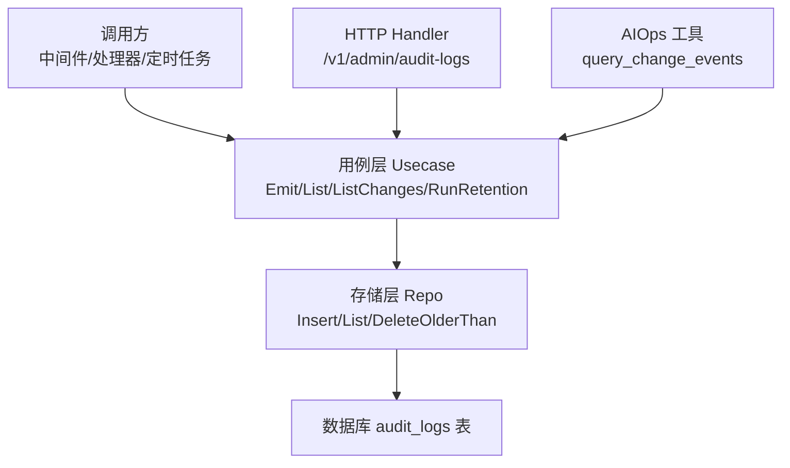
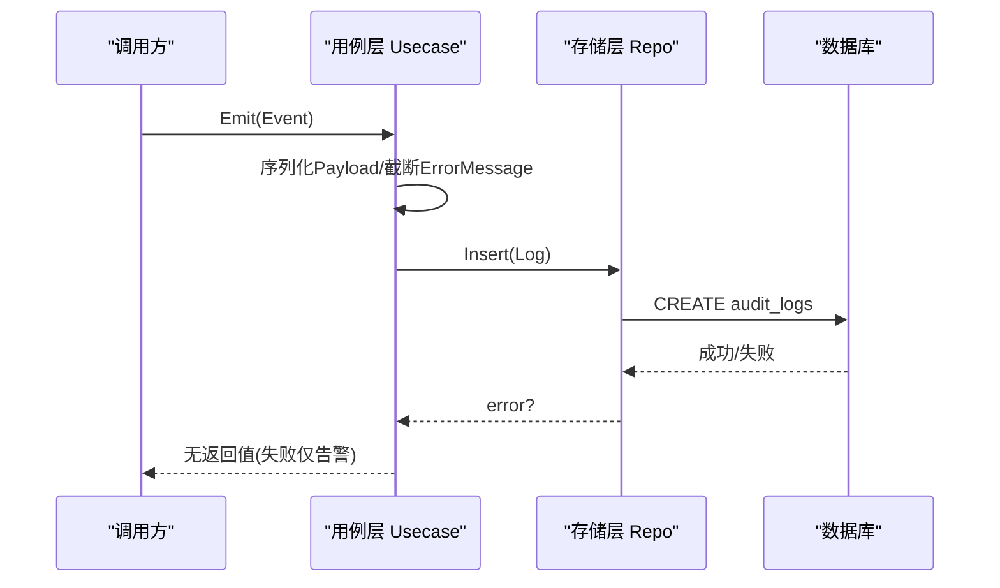
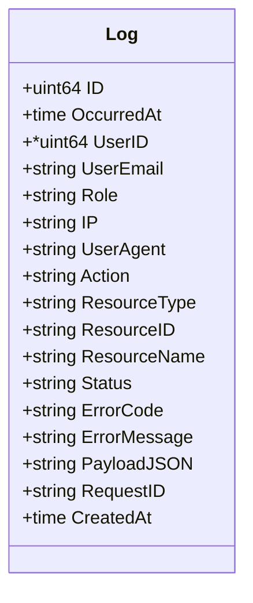
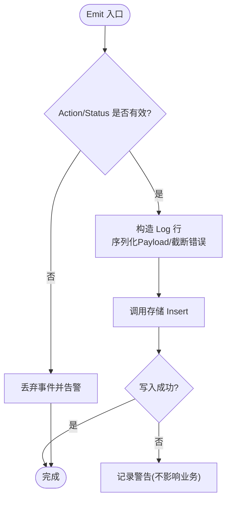
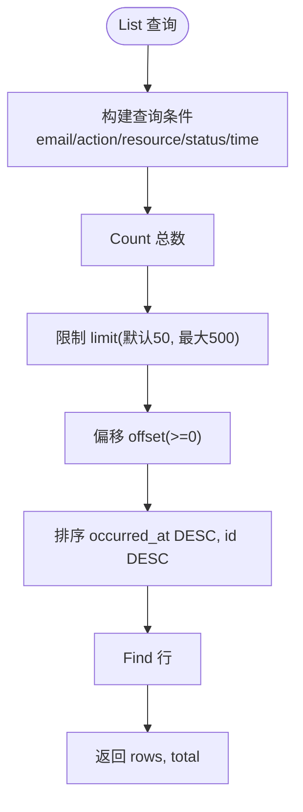
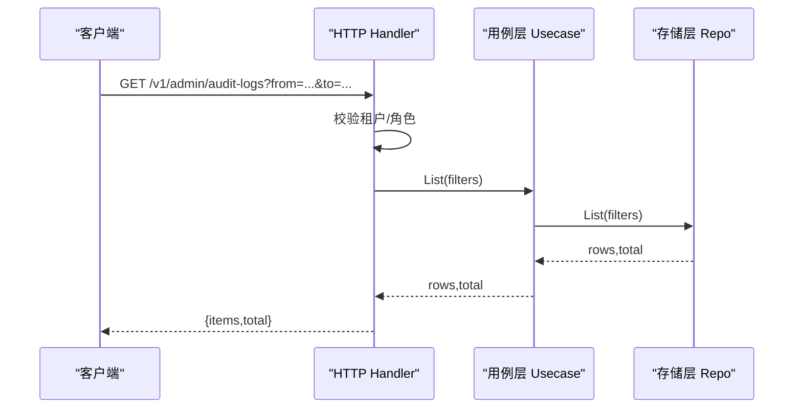
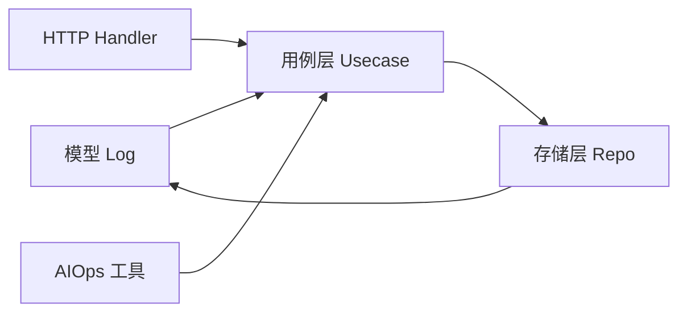

# 审计日志

<cite>
**本文引用的文件**
- [internal/manager/model/audit/log.go](file://internal/manager/model/audit/log.go)
- [internal/manager/biz/audit/usecase.go](file://internal/manager/biz/audit/usecase.go)
- [internal/manager/data/audit/store/repo.go](file://internal/manager/data/audit/store/repo.go)
- [internal/manager/server/audit/http.go](file://internal/manager/server/audit/http.go)
- [internal/pkg/logquery/search.go](file://internal/pkg/logquery/search.go)
- [internal/pkg/k8sredact/redact.go](file://internal/pkg/k8sredact/redact.go)
- [internal/edgeagent/plugins/logs/render.go](file://internal/edgeagent/plugins/logs/render.go)
- [internal/manager/biz/aiops/tools/query_change_events_basetool.go](file://internal/manager/biz/aiops/tools/query_change_events_basetool.go)
</cite>

## 目录
1. [简介](#简介)
2. [项目结构](#项目结构)
3. [核心组件](#核心组件)
4. [架构总览](#架构总览)
5. [详细组件分析](#详细组件分析)
6. [依赖关系分析](#依赖关系分析)
7. [性能与存储策略](#性能与存储策略)
8. [故障排查指南](#故障排查指南)
9. [结论](#结论)
10. [附录：开发示例与最佳实践](#附录开发示例与最佳实践)

## 简介
本模块提供“操作审计日志”的完整能力：事件捕获、结构化记录、查询过滤、导出（分页列表）、保留清理，以及与 AIOps 变更回溯工具集成。其设计原则是“只追加、可审计、不阻塞业务”，确保审计写入失败不会中断主业务流程；同时通过严格的字段约束、动作枚举和资源类型分类，保证审计数据的一致性与可检索性。

## 项目结构
审计日志由四层组成：
- 模型层：定义审计日志实体、状态与动作常量、资源类型。
- 用例层：统一入口 Emit/List/ListChanges/RunRetention，封装序列化、截断、错误处理与保留清理调度。
- 存储层：基于 GORM 的插入、分页查询、删除旧数据。
- HTTP 层：管理员接口 /v1/admin/audit-logs，仅允许 admin/superuser 访问，支持多维过滤与分页。

**图表来源**
- [internal/manager/biz/audit/usecase.go:1-191](file://internal/manager/biz/audit/usecase.go#L1-L191)
- [internal/manager/data/audit/store/repo.go:1-102](file://internal/manager/data/audit/store/repo.go#L1-L102)
- [internal/manager/server/audit/http.go:1-172](file://internal/manager/server/audit/http.go#L1-L172)
- [internal/manager/biz/aiops/tools/query_change_events_basetool.go:1-35](file://internal/manager/biz/aiops/tools/query_change_events_basetool.go#L1-L35)

**章节来源**
- [internal/manager/model/audit/log.go:1-136](file://internal/manager/model/audit/log.go#L1-L136)
- [internal/manager/biz/audit/usecase.go:1-191](file://internal/manager/biz/audit/usecase.go#L1-L191)
- [internal/manager/data/audit/store/repo.go:1-102](file://internal/manager/data/audit/store/repo.go#L1-L102)
- [internal/manager/server/audit/http.go:1-172](file://internal/manager/server/audit/http.go#L1-L172)

## 核心组件
- 模型 Log：包含发生时间、主体信息（用户ID/邮箱/角色/IP/UA）、动作、资源标识、结果状态、错误信息、结构化负载 JSON、请求追踪 ID、创建时间等。所有文本列非空，避免默认值导致的兼容问题。
- 状态枚举：success/failure/denied，用于区分成功、失败与被拒绝的操作。
- 动作常量：采用动词_资源的蛇形命名，保持精简；具体差异通过 PayloadJSON 表达。
- 资源类型：user/device/incident/setting/rule/channel/repo/skill/llm/git_ssh_key/grafana/rag/audit/auth 等。
- 用例 Usecase：Emit 负责构造行、序列化负载、截断错误消息并写入；List 提供分页查询；ListChanges 面向 RCA 的时间窗口变更查询；RunRetention 每日凌晨三点执行保留清理。
- 存储 Repo：Insert 追加写入；List 支持按用户、动作、资源类型、状态、时间范围过滤，限制最大返回条数；DeleteOlderThan 删除过期数据。
- HTTP Handler：管理员接口，校验租户上下文与权限，解析查询参数，返回 items 与 total。

**章节来源**
- [internal/manager/model/audit/log.go:10-136](file://internal/manager/model/audit/log.go#L10-L136)
- [internal/manager/biz/audit/usecase.go:29-147](file://internal/manager/biz/audit/usecase.go#L29-L147)
- [internal/manager/data/audit/store/repo.go:14-102](file://internal/manager/data/audit/store/repo.go#L14-L102)
- [internal/manager/server/audit/http.go:22-110](file://internal/manager/server/audit/http.go#L22-L110)

## 架构总览
审计日志的写入路径遵循“最小侵入、最弱耦合”的原则：
- 调用方（中间件或处理器）构造 Event，填充主体、动作、资源、结果与负载。
- 用例层对负载进行 JSON 序列化，截断错误消息长度，写入存储。
- 存储层使用 GORM 追加一行，失败时用例层仅告警，不向上抛出错误。
- 管理员通过 HTTP 接口查询，支持多维度过滤与分页。
- AIOps 工具通过 ListChanges 获取指定时间窗内的变更事件，辅助根因分析。

**图表来源**
- [internal/manager/biz/audit/usecase.go:72-116](file://internal/manager/biz/audit/usecase.go#L72-L116)
- [internal/manager/data/audit/store/repo.go:26-33](file://internal/manager/data/audit/store/repo.go#L26-L33)

**章节来源**
- [internal/manager/biz/audit/usecase.go:72-116](file://internal/manager/biz/audit/usecase.go#L72-L116)
- [internal/manager/data/audit/store/repo.go:26-33](file://internal/manager/data/audit/store/repo.go#L26-L33)

## 详细组件分析

### 模型与常量（Log、状态、动作、资源类型）
- Log 字段设计强调不可伪造与可追溯：OccurredAt、UserID、UserEmail、Role、IP、UserAgent 记录主体与环境；Action、ResourceType、ResourceID、ResourceName 描述对象与行为；Status、ErrorCode、ErrorMessage 记录结果；PayloadJSON 承载结构化细节；RequestID 关联请求链路；CreatedAt 由框架自动维护。
- 状态与动作采用受控集合，UI 侧以短下拉展示，具体差异在负载中体现，避免动作枚举膨胀。
- 资源类型扁平化，便于 UI 分组与筛选。

**图表来源**
- [internal/manager/model/audit/log.go:10-47](file://internal/manager/model/audit/log.go#L10-L47)

**章节来源**
- [internal/manager/model/audit/log.go:10-136](file://internal/manager/model/audit/log.go#L10-L136)

### 用例层（Usecase：Emit/List/ListChanges/RunRetention）
- Emit：校验必填字段，构造行，序列化负载，截断错误消息，写入存储；失败仅记录警告，不阻断业务。
- List：透传存储层分页查询，供管理界面使用。
- ListChanges：面向 RCA 的便捷方法，限定时间范围与可选资源/动作，限制默认上限，便于“最近变更”回溯。
- RunRetention：每日凌晨三点触发，计算 cutoff = now - retentionDays，调用 DeleteOlderThan 清理；配置 <=0 则禁用。

**图表来源**
- [internal/manager/biz/audit/usecase.go:72-116](file://internal/manager/biz/audit/usecase.go#L72-L116)

**章节来源**
- [internal/manager/biz/audit/usecase.go:72-147](file://internal/manager/biz/audit/usecase.go#L72-L147)
- [internal/manager/biz/audit/usecase.go:149-183](file://internal/manager/biz/audit/usecase.go#L149-L183)

### 存储层（Repo：Insert/List/DeleteOlderThan）
- Insert：追加写入一行，OccuredAt 由用例层设置，CreatedAt 由框架自动设置。
- List：支持 user_email、action、resource_type、status、from/to 过滤；limit 默认 50，最大 500；offset >=0；按 occurred_at DESC, id DESC 排序；先 Count 再 Find，返回 rows 与 total。
- DeleteOlderThan：删除 occurred_at < cutoff 的记录，返回影响行数。

**图表来源**
- [internal/manager/data/audit/store/repo.go:52-94](file://internal/manager/data/audit/store/repo.go#L52-L94)

**章节来源**
- [internal/manager/data/audit/store/repo.go:26-102](file://internal/manager/data/audit/store/repo.go#L26-L102)

### HTTP 层（Handler：/v1/admin/audit-logs）
- 权限控制：从租户上下文提取角色，仅 admin 或 superuser 可访问；否则返回 403。
- 参数解析：user_email、action、resource_type、status、from/to（RFC3339）、limit、offset。
- 响应：items 数组与 total 计数；读取操作不产生审计行，避免“读多写少”噪音。

**图表来源**
- [internal/manager/server/audit/http.go:60-110](file://internal/manager/server/audit/http.go#L60-L110)
- [internal/manager/data/audit/store/repo.go:52-94](file://internal/manager/data/audit/store/repo.go#L52-L94)

**章节来源**
- [internal/manager/server/audit/http.go:22-110](file://internal/manager/server/audit/http.go#L22-L110)

### AIOps 变更回溯（query_change_events）
- 通过 ListChanges 获取指定时间范围内的变更事件，支持 resourceType 与 action 过滤，默认 limit 50。
- 包含失败与被拒绝的事件，因为“尝试变更但失败”本身可能是根因线索。
- 工具描述明确边界：仅覆盖通过 ongrid 产生的变更，外部变更需边缘侧变更流补充。

**章节来源**
- [internal/manager/biz/audit/usecase.go:126-147](file://internal/manager/biz/audit/usecase.go#L126-L147)
- [internal/manager/biz/aiops/tools/query_change_events_basetool.go:15-35](file://internal/manager/biz/aiops/tools/query_change_events_basetool.go#L15-L35)

## 依赖关系分析
- 用例层依赖存储层接口，屏蔽实现细节；HTTP 层仅依赖用例层，不直接访问存储。
- 模型层被用例层与存储层共同引用，保证数据结构一致。
- AIOps 工具通过窄接口 AuditLister 依赖用例层，避免引入存储层。

**图表来源**
- [internal/manager/model/audit/log.go:10-47](file://internal/manager/model/audit/log.go#L10-L47)
- [internal/manager/biz/audit/usecase.go:17-23](file://internal/manager/biz/audit/usecase.go#L17-L23)
- [internal/manager/data/audit/store/repo.go:14-23](file://internal/manager/data/audit/store/repo.go#L14-L23)
- [internal/manager/server/audit/http.go:22-34](file://internal/manager/server/audit/http.go#L22-L34)
- [internal/manager/biz/aiops/tools/query_change_events_basetool.go:27-32](file://internal/manager/biz/aiops/tools/query_change_events_basetool.go#L27-L32)

**章节来源**
- [internal/manager/biz/audit/usecase.go:17-23](file://internal/manager/biz/audit/usecase.go#L17-L23)
- [internal/manager/data/audit/store/repo.go:14-23](file://internal/manager/data/audit/store/repo.go#L14-L23)
- [internal/manager/server/audit/http.go:22-34](file://internal/manager/server/audit/http.go#L22-L34)
- [internal/manager/biz/aiops/tools/query_change_events_basetool.go:27-32](file://internal/manager/biz/aiops/tools/query_change_events_basetool.go#L27-L32)

## 性能与存储策略
- 写入优化：Emit 将错误消息截断至固定长度，避免超长字段；负载序列化失败仅告警，不抛错。
- 查询优化：List 强制 limit 上限（500），默认 50；offset 非负；按 occurred_at DESC, id DESC 排序，利于最新优先浏览。
- 保留策略：RunRetention 每日凌晨三点执行，cutoff = now - retentionDays；retentionDays <=0 禁用清理，交由外部归档管理。
- 索引建议：occurred_at、action、resource_type、status、user_email 建立索引以提升过滤与排序性能（已在模型中声明索引）。

[本节为通用指导，无需特定文件来源]

## 故障排查指南
- 写入失败：用例层会记录警告日志，包含 action、resource_type、resource_id 与错误详情；检查数据库连接与磁盘空间。
- 查询为空：确认过滤条件是否正确，尤其是 from/to 时间格式与范围；注意 limit/offset 限制。
- 权限不足：HTTP 层要求 admin/superuser；检查租户上下文与角色。
- 负载未持久化：Payload 序列化失败会被记录并忽略；检查负载结构是否可序列化。

**章节来源**
- [internal/manager/biz/audit/usecase.go:78-115](file://internal/manager/biz/audit/usecase.go#L78-L115)
- [internal/manager/server/audit/http.go:60-73](file://internal/manager/server/audit/http.go#L60-L73)

## 结论
审计日志模块以“只追加、可审计、不阻塞业务”为核心目标，通过清晰的模型、用例、存储与 HTTP 分层，提供了稳定的事件捕获、查询过滤与保留清理能力。结合 AIOps 变更回溯工具，可在故障定位中快速锁定“谁在何时改变了什么”。敏感信息与合规性通过上游脱敏与受限字段约束得到保障。

[本节为总结，无需特定文件来源]

## 附录：开发示例与最佳实践

### 添加新的审计事件类型
- 选择动作：在模型层使用现有动作常量；若确需新增，请遵循 verb_resource 命名并保持枚举精简，具体差异放入 PayloadJSON。
- 构造事件：在调用处构造 Event，填写主体（UserID/UserEmail/Role/IP/UserAgent/RequestID）、动作、资源（Type/ID/Name）、结果（Status/ErrorCode/ErrorMessage）与负载（Payload）。
- 写入审计：调用 Usecase.Emit；失败不会影响业务。
- 查询验证：通过 HTTP 接口或 List 方法，使用 action、resource_type、status、from/to 过滤验证新事件。

参考路径
- [internal/manager/model/audit/log.go:60-116](file://internal/manager/model/audit/log.go#L60-L116)
- [internal/manager/biz/audit/usecase.go:29-116](file://internal/manager/biz/audit/usecase.go#L29-L116)
- [internal/manager/server/audit/http.go:75-95](file://internal/manager/server/audit/http.go#L75-L95)

**章节来源**
- [internal/manager/model/audit/log.go:60-116](file://internal/manager/model/audit/log.go#L60-L116)
- [internal/manager/biz/audit/usecase.go:29-116](file://internal/manager/biz/audit/usecase.go#L29-L116)
- [internal/manager/server/audit/http.go:75-95](file://internal/manager/server/audit/http.go#L75-L95)

### 日志级别分类与检测
- 系统级日志级别归一化：支持 JSON level/severity、klog 前缀、文本关键词等多种来源，统一映射到 trace/debug/info/warn/error/critical/fatal/unknown。
- 边缘采集渲染：在日志渲染阶段设置 severity_text，并对不同来源进行标准化，便于后续聚合与过滤。

参考路径
- [internal/pkg/logquery/level.go:9-86](file://internal/pkg/logquery/level.go#L9-L86)
- [internal/edgeagent/plugins/logs/render.go:266-284](file://internal/edgeagent/plugins/logs/render.go#L266-L284)

**章节来源**
- [internal/pkg/logquery/level.go:9-86](file://internal/pkg/logquery/level.go#L9-L86)
- [internal/edgeagent/plugins/logs/render.go:266-284](file://internal/edgeagent/plugins/logs/render.go#L266-L284)

### 敏感信息脱敏与存储安全
- 文本脱敏：识别常见凭据模式（如 authorization/token/password/api-key 等）并替换为占位符；URL 中的用户名密码也会被脱敏。
- 键名脱敏：对 Kubernetes 标签/注解等键名进行敏感匹配，命中则直接置为占位符。
- 边缘日志渲染：在渲染阶段移除敏感属性键，限制属性数量与长度，确保进入后端的日志不包含明文密钥。

参考路径
- [internal/pkg/k8sredact/redact.go:8-42](file://internal/pkg/k8sredact/redact.go#L8-L42)
- [internal/edgeagent/plugins/logs/render.go:147-165](file://internal/edgeagent/plugins/logs/render.go#L147-L165)

**章节来源**
- [internal/pkg/k8sredact/redact.go:8-42](file://internal/pkg/k8sredact/redact.go#L8-L42)
- [internal/edgeagent/plugins/logs/render.go:147-165](file://internal/edgeagent/plugins/logs/render.go#L147-L165)

### 日志检索语法与时间范围筛选
- 审计日志检索：通过 HTTP 查询参数 user_email、action、resource_type、status、from/to、limit、offset 进行过滤与分页。
- 通用日志检索：SearchRequest 支持 Scope（设备/集群/命名空间/工作负载/Pod/容器/节点/服务/来源/级别/文件/单元）、Keywords（包含/排除/匹配模式）、Filters（字段过滤）、Limit/Cursor/Direction；提供 Count、Fields、FieldValues、Histogram 等能力。
- 时间窗口：SearchRequest 限制最大窗口（30天），防止过大查询；审计日志 List 支持任意 RFC3339 时间范围。

参考路径
- [internal/manager/server/audit/http.go:75-95](file://internal/manager/server/audit/http.go#L75-L95)
- [internal/pkg/logquery/search.go:78-152](file://internal/pkg/logquery/search.go#L78-L152)
- [internal/pkg/logquery/search.go:257-338](file://internal/pkg/logquery/search.go#L257-L338)

**章节来源**
- [internal/manager/server/audit/http.go:75-95](file://internal/manager/server/audit/http.go#L75-L95)
- [internal/pkg/logquery/search.go:78-152](file://internal/pkg/logquery/search.go#L78-L152)
- [internal/pkg/logquery/search.go:257-338](file://internal/pkg/logquery/search.go#L257-L338)

### 用户行为分析与 RCA 集成
- 行为分析：通过 action、resource_type、status、user_email 组合，统计高频操作、失败率与拒绝率，识别异常模式。
- RCA 集成：使用 ListChanges 获取 incident 前后时间窗内的变更事件，结合失败与被拒绝事件，辅助定位根因。

参考路径
- [internal/manager/biz/audit/usecase.go:126-147](file://internal/manager/biz/audit/usecase.go#L126-L147)
- [internal/manager/biz/aiops/tools/query_change_events_basetool.go:15-35](file://internal/manager/biz/aiops/tools/query_change_events_basetool.go#L15-L35)

**章节来源**
- [internal/manager/biz/audit/usecase.go:126-147](file://internal/manager/biz/audit/usecase.go#L126-L147)
- [internal/manager/biz/aiops/tools/query_change_events_basetool.go:15-35](file://internal/manager/biz/aiops/tools/query_change_events_basetool.go#L15-L35)

### 存储优化与合规性最佳实践
- 存储优化：
  - 使用索引字段过滤与排序（occurred_at、action、resource_type、status、user_email）。
  - 限制查询 limit，避免大结果集。
  - 定期运行保留清理，控制数据规模。
- 合规性：
  - 负载中不得包含明文密钥；如需记录提示，仅保留片段或哈希。
  - 读取操作不产生审计行，减少噪音与隐私暴露面。
  - 严格权限控制，仅管理员可访问审计接口。

[本节为通用指导，无需特定文件来源]