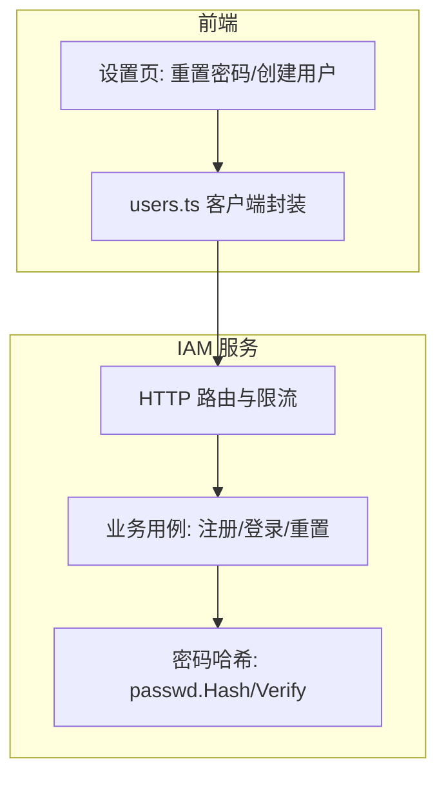
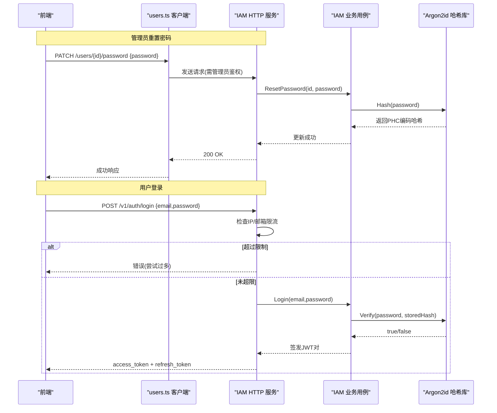
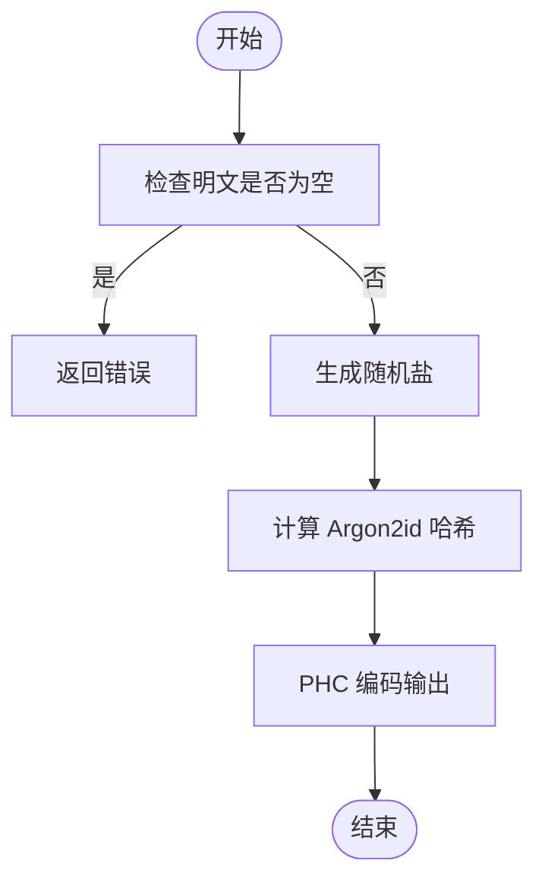
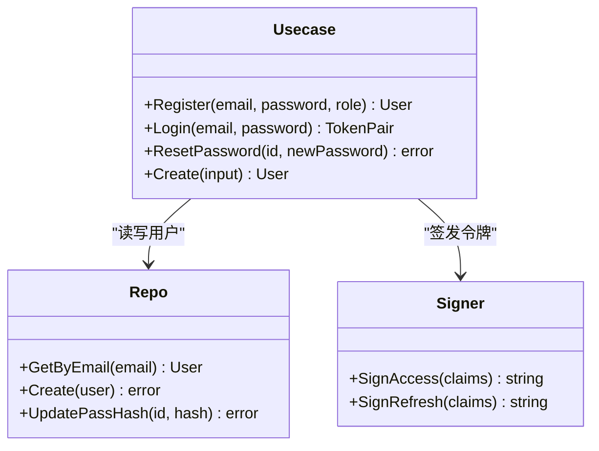
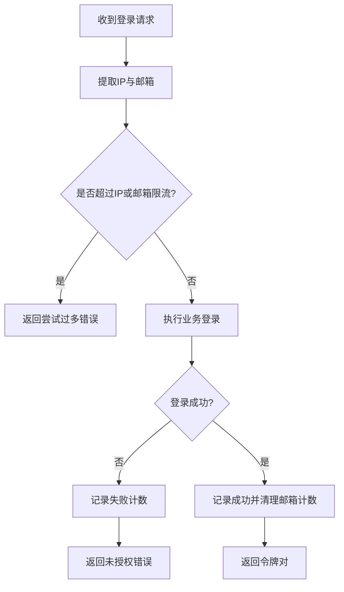
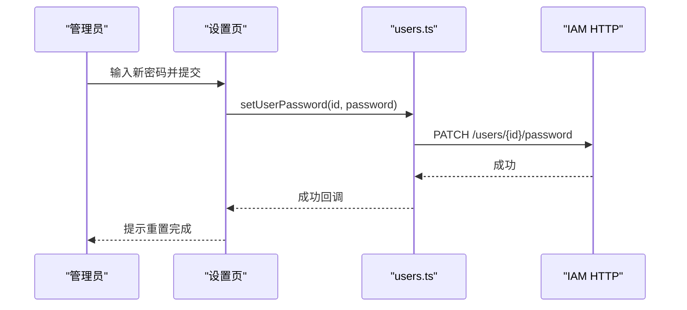
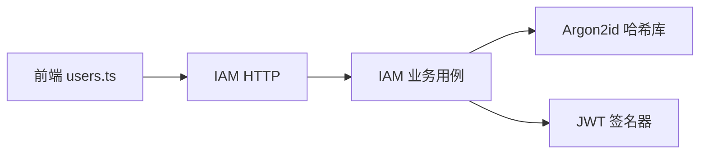

# 密码管理

<cite>
**本文引用的文件**
- [internal/pkg/passwd/argon2.go](file://internal/pkg/passwd/argon2.go)
- [internal/pkg/passwd/doc.go](file://internal/pkg/passwd/doc.go)
- [internal/iam/biz/user/hash.go](file://internal/iam/biz/user/hash.go)
- [internal/iam/biz/user/usecase.go](file://internal/iam/biz/user/usecase.go)
- [internal/iam/server/http.go](file://internal/iam/server/http.go)
- [web/src/api/users.ts](file://web/src/api/users.ts)
- [web/src/pages/settings/Users.tsx](file://web/src/pages/settings/Users.tsx)
</cite>

## 目录
1. [简介](#简介)
2. [项目结构](#项目结构)
3. [核心组件](#核心组件)
4. [架构总览](#架构总览)
5. [详细组件分析](#详细组件分析)
6. [依赖关系分析](#依赖关系分析)
7. [性能与安全考量](#性能与安全考量)
8. [故障排查指南](#故障排查指南)
9. [结论](#结论)
10. [附录：端到端流程与代码路径](#附录端到端流程与代码路径)

## 简介
本技术文档聚焦于系统内的密码管理能力，覆盖以下主题：
- 密码安全策略与加密算法实现（Argon2id）
- 管理员重置用户密码的流程
- 用户初始密码设置与一次性密码显示的安全考虑
- 暴力破解防护机制
- 密码泄露检测与最佳实践建议
- 完整流程的代码级引用路径（不直接粘贴源码）

## 项目结构
密码相关能力分布在如下层次：
- 共享密码哈希库：提供 Argon2id 的 Hash/Verify
- IAM 业务层：封装注册、登录、重置密码等用例
- IAM HTTP 层：暴露认证与管理接口，并实现登录限流
- Web 前端：提供管理员重置密码、创建用户时展示一次性初始密码的界面

图表来源
- [internal/iam/server/http.go:151-183](file://internal/iam/server/http.go#L151-L183)
- [internal/iam/biz/user/usecase.go:43-100](file://internal/iam/biz/user/usecase.go#L43-L100)
- [internal/pkg/passwd/argon2.go:26-78](file://internal/pkg/passwd/argon2.go#L26-L78)
- [web/src/api/users.ts:75-96](file://web/src/api/users.ts#L75-L96)
- [web/src/pages/settings/Users.tsx:735-817](file://web/src/pages/settings/Users.tsx#L735-L817)

章节来源
- [internal/iam/server/http.go:151-183](file://internal/iam/server/http.go#L151-L183)
- [internal/iam/biz/user/usecase.go:43-100](file://internal/iam/biz/user/usecase.go#L43-L100)
- [internal/pkg/passwd/argon2.go:26-78](file://internal/pkg/passwd/argon2.go#L26-L78)
- [web/src/api/users.ts:75-96](file://web/src/api/users.ts#L75-L96)
- [web/src/pages/settings/Users.tsx:735-817](file://web/src/pages/settings/Users.tsx#L735-L817)

## 核心组件
- Argon2id 密码哈希库
  - 提供 PHC 编码格式的哈希生成与验证，使用随机盐与常量时间比较，避免时序侧信道。
  - 参数包含时间、内存、并行度与密钥长度，兼顾安全性与性能。
- IAM 业务用例
  - 注册：校验邮箱唯一性，哈希密码后持久化。
  - 登录：校验状态与密码，签发访问令牌与刷新令牌。
  - 重置密码：仅管理员可调用，校验新密码非空后更新哈希。
- IAM HTTP 层
  - 登录限流：基于 IP 与邮箱双维度滑动窗口计数，防止暴力破解与密码喷洒。
  - 权限控制：重置密码等写操作要求管理员角色。
- 前端交互
  - 管理员重置密码：通过 PATCH /users/{id}/password 提交新密码。
  - 创建用户一次性密码：在创建成功后弹窗展示明文初始密码，提示通过安全渠道传递。

章节来源
- [internal/pkg/passwd/argon2.go:26-78](file://internal/pkg/passwd/argon2.go#L26-L78)
- [internal/iam/biz/user/usecase.go:43-100](file://internal/iam/biz/user/usecase.go#L43-L100)
- [internal/iam/biz/user/usecase.go:239-249](file://internal/iam/biz/user/usecase.go#L239-L249)
- [internal/iam/server/http.go:221-269](file://internal/iam/server/http.go#L221-L269)
- [web/src/api/users.ts:94-96](file://web/src/api/users.ts#L94-L96)
- [web/src/pages/settings/Users.tsx:735-817](file://web/src/pages/settings/Users.tsx#L735-L817)

## 架构总览
下图展示了从前端到后端再到密码哈希库的完整调用链，以及登录时的限流保护。

图表来源
- [internal/iam/server/http.go:221-269](file://internal/iam/server/http.go#L221-L269)
- [internal/iam/biz/user/usecase.go:80-100](file://internal/iam/biz/user/usecase.go#L80-L100)
- [internal/pkg/passwd/argon2.go:47-78](file://internal/pkg/passwd/argon2.go#L47-L78)
- [web/src/api/users.ts:94-96](file://web/src/api/users.ts#L94-L96)

## 详细组件分析

### Argon2id 密码哈希库
- 设计要点
  - 使用 argon2id 模式，结合时间与内存成本，抵御 GPU/ASIC 加速攻击。
  - 每次哈希使用随机盐，确保相同口令产生不同密文。
  - 验证时使用常量时间比较，避免侧信道信息泄露。
  - PHC 编码格式携带版本与参数，便于未来升级而不破坏历史数据。
- 复杂度与性能
  - 单次哈希约数十毫秒（参考注释中的基准），适合在线验证场景。
  - 内存占用较高，但可提升抗暴力破解能力。
- 错误处理
  - 空明文拒绝；随机数读取失败、解码失败均返回错误或不匹配。

图表来源
- [internal/pkg/passwd/argon2.go:26-45](file://internal/pkg/passwd/argon2.go#L26-L45)

章节来源
- [internal/pkg/passwd/argon2.go:14-78](file://internal/pkg/passwd/argon2.go#L14-L78)
- [internal/pkg/passwd/doc.go:1-12](file://internal/pkg/passwd/doc.go#L1-L12)

### IAM 业务用例（注册、登录、重置）
- 注册
  - 规范化邮箱并去重，哈希密码后写入数据库，不返回哈希值。
- 登录
  - 校验用户状态与密码，成功后签发 JWT 访问令牌与刷新令牌。
- 重置密码
  - 仅管理员可用；校验新密码非空，哈希后更新存储。

图表来源
- [internal/iam/biz/user/usecase.go:43-100](file://internal/iam/biz/user/usecase.go#L43-L100)
- [internal/iam/biz/user/usecase.go:239-249](file://internal/iam/biz/user/usecase.go#L239-L249)
- [internal/iam/biz/user/usecase.go:362-387](file://internal/iam/biz/user/usecase.go#L362-L387)

章节来源
- [internal/iam/biz/user/usecase.go:43-100](file://internal/iam/biz/user/usecase.go#L43-L100)
- [internal/iam/biz/user/usecase.go:239-249](file://internal/iam/biz/user/usecase.go#L239-L249)
- [internal/iam/biz/user/usecase.go:362-387](file://internal/iam/biz/user/usecase.go#L362-L387)

### IAM HTTP 层与暴力破解防护
- 登录限流
  - 双维度滑动窗口：按 IP 与邮箱分别计数，超过阈值则拒绝。
  - 成功登录后清除邮箱维度的计数，避免误伤正常用户。
- 权限控制
  - 重置密码等写操作需要管理员角色，否则返回禁止访问。
- 审计记录
  - 登录失败事件记录审计日志，便于检测异常行为。

图表来源
- [internal/iam/server/http.go:38-114](file://internal/iam/server/http.go#L38-L114)
- [internal/iam/server/http.go:221-269](file://internal/iam/server/http.go#L221-L269)

章节来源
- [internal/iam/server/http.go:38-114](file://internal/iam/server/http.go#L38-L114)
- [internal/iam/server/http.go:221-269](file://internal/iam/server/http.go#L221-L269)

### 前端交互：管理员重置与一次性密码
- 管理员重置密码
  - 调用 PATCH /users/{id}/password，传入新密码。
  - 成功后提示重置完成。
- 创建用户一次性密码
  - 创建成功后弹窗展示明文初始密码，提示通过安全渠道告知用户，并建议首次登录后修改。

图表来源
- [web/src/pages/settings/Users.tsx:735-781](file://web/src/pages/settings/Users.tsx#L735-L781)
- [web/src/api/users.ts:94-96](file://web/src/api/users.ts#L94-L96)

章节来源
- [web/src/pages/settings/Users.tsx:735-817](file://web/src/pages/settings/Users.tsx#L735-L817)
- [web/src/api/users.ts:75-96](file://web/src/api/users.ts#L75-L96)

## 依赖关系分析
- 模块耦合
  - IAM HTTP 层依赖业务用例进行认证与管理操作。
  - 业务用例依赖密码哈希库进行安全的密码处理。
  - 前端通过 TypeScript 客户端封装调用后端 REST API。
- 外部依赖
  - Argon2id 来自标准库外的密码学包，用于高安全级别的密码哈希。
  - JWT 用于会话令牌签发与验证。

图表来源
- [web/src/api/users.ts:75-96](file://web/src/api/users.ts#L75-L96)
- [internal/iam/server/http.go:151-183](file://internal/iam/server/http.go#L151-L183)
- [internal/iam/biz/user/usecase.go:43-100](file://internal/iam/biz/user/usecase.go#L43-L100)
- [internal/pkg/passwd/argon2.go:26-78](file://internal/pkg/passwd/argon2.go#L26-L78)

章节来源
- [web/src/api/users.ts:75-96](file://web/src/api/users.ts#L75-L96)
- [internal/iam/server/http.go:151-183](file://internal/iam/server/http.go#L151-L183)
- [internal/iam/biz/user/usecase.go:43-100](file://internal/iam/biz/user/usecase.go#L43-L100)
- [internal/pkg/passwd/argon2.go:26-78](file://internal/pkg/passwd/argon2.go#L26-L78)

## 性能与安全考量
- 性能
  - Argon2id 参数已调优至“合理笔记本”环境下的单哈希耗时，适合在线验证。
  - 登录限流为内存中滑动窗口计数，MVP 阶段无需分布式锁，重启即清零，符合当前部署规模。
- 安全
  - 密码哈希采用 Argon2id，具备抗 GPU/ASIC 攻击能力。
  - 验证使用常量时间比较，避免时序侧信道。
  - 登录限流同时保护 IP 与邮箱，降低暴力破解与密码喷洒风险。
  - 管理员重置密码需鉴权，且仅更新哈希，不暴露明文。
  - 一次性密码仅在创建成功后前端弹窗展示，并通过提示引导安全传递。
- 配置建议
  - 可根据服务器性能调整 Argon2id 的时间与内存参数，以平衡安全与延迟。
  - 在生产环境中，建议将限流计数器迁移至 Redis 以实现多实例一致性与持久化。
  - 建议在前端增加密码强度校验（如最小长度、字符集要求），并在后端统一执行策略校验。
  - 建议接入密码泄露检测服务（如 HaveIBeenPwned API），在注册与重置时检查密码是否已知泄露。

[本节为通用指导，不直接分析具体文件]

## 故障排查指南
- 登录失败被限流
  - 现象：短时间内多次失败后返回“尝试过多”。
  - 排查：检查同一 IP 或邮箱是否在窗口内超过阈值；确认是否存在自动化脚本或代理导致频繁重试。
  - 参考路径：[internal/iam/server/http.go:38-114](file://internal/iam/server/http.go#L38-L114)
- 重置密码失败
  - 现象：返回无效参数或未授权。
  - 排查：确认请求体包含密码字段；确认调用方具有管理员角色。
  - 参考路径：[internal/iam/biz/user/usecase.go:239-249](file://internal/iam/biz/user/usecase.go#L239-L249), [internal/iam/server/http.go:397-408](file://internal/iam/server/http.go#L397-L408)
- 哈希验证异常
  - 现象：验证返回 false。
  - 排查：确认存储的哈希格式正确；检查版本与参数解析；确认明文不为空。
  - 参考路径：[internal/pkg/passwd/argon2.go:47-78](file://internal/pkg/passwd/argon2.go#L47-L78)

章节来源
- [internal/iam/server/http.go:38-114](file://internal/iam/server/http.go#L38-L114)
- [internal/iam/biz/user/usecase.go:239-249](file://internal/iam/biz/user/usecase.go#L239-L249)
- [internal/pkg/passwd/argon2.go:47-78](file://internal/pkg/passwd/argon2.go#L47-L78)

## 结论
本系统在密码管理方面实现了高安全级别的 Argon2id 哈希存储与验证，配合登录限流与管理员鉴权，有效抵御暴力破解与密码喷洒。前端提供了管理员重置密码与一次性密码展示的能力，满足实际运维需求。建议在后续迭代中增强密码强度策略、接入泄露检测服务，并将限流机制扩展为分布式方案以提升稳定性与一致性。

[本节为总结性内容，不直接分析具体文件]

## 附录：端到端流程与代码路径
- 管理员重置用户密码
  - 前端入口：[web/src/pages/settings/Users.tsx:735-781](file://web/src/pages/settings/Users.tsx#L735-L781)
  - 客户端封装：[web/src/api/users.ts:94-96](file://web/src/api/users.ts#L94-L96)
  - 后端路由：[internal/iam/server/http.go:160-171](file://internal/iam/server/http.go#L160-L171)
  - 业务逻辑：[internal/iam/biz/user/usecase.go:239-249](file://internal/iam/biz/user/usecase.go#L239-L249)
  - 密码哈希：[internal/pkg/passwd/argon2.go:26-45](file://internal/pkg/passwd/argon2.go#L26-L45)
- 用户登录与令牌签发
  - 后端路由：[internal/iam/server/http.go:151-155](file://internal/iam/server/http.go#L151-L155)
  - 登录处理与限流：[internal/iam/server/http.go:221-269](file://internal/iam/server/http.go#L221-L269)
  - 业务登录：[internal/iam/biz/user/usecase.go:80-100](file://internal/iam/biz/user/usecase.go#L80-L100)
  - 密码验证：[internal/pkg/passwd/argon2.go:47-78](file://internal/pkg/passwd/argon2.go#L47-L78)
  - 令牌签发：[internal/iam/biz/user/usecase.go:362-387](file://internal/iam/biz/user/usecase.go#L362-L387)
- 创建用户与一次性密码展示
  - 前端弹窗：[web/src/pages/settings/Users.tsx:783-817](file://web/src/pages/settings/Users.tsx#L783-L817)
  - 客户端创建：[web/src/api/users.ts:75-77](file://web/src/api/users.ts#L75-L77)
  - 业务创建：[internal/iam/biz/user/usecase.go:262-316](file://internal/iam/biz/user/usecase.go#L262-L316)
  - 密码哈希：[internal/pkg/passwd/argon2.go:26-45](file://internal/pkg/passwd/argon2.go#L26-L45)