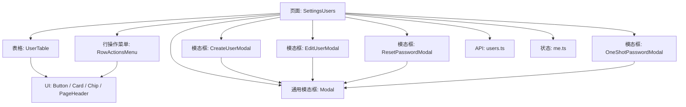
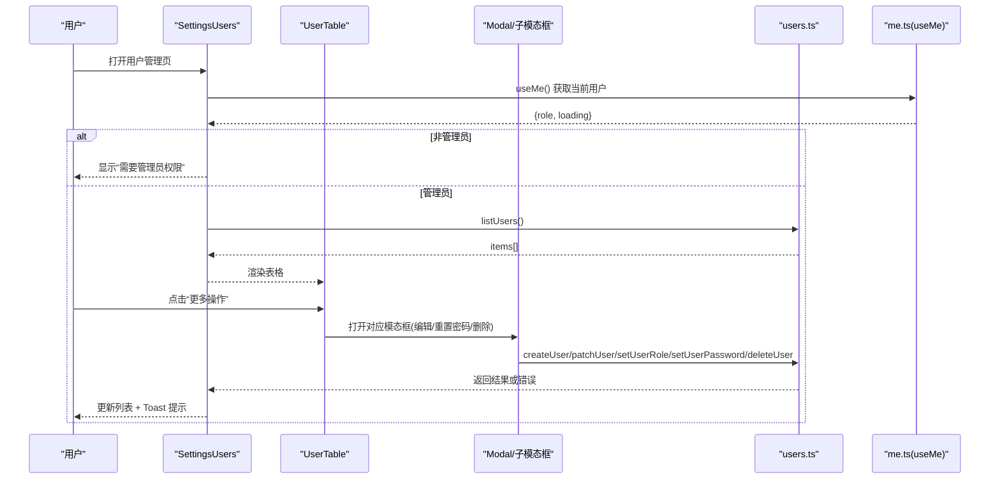
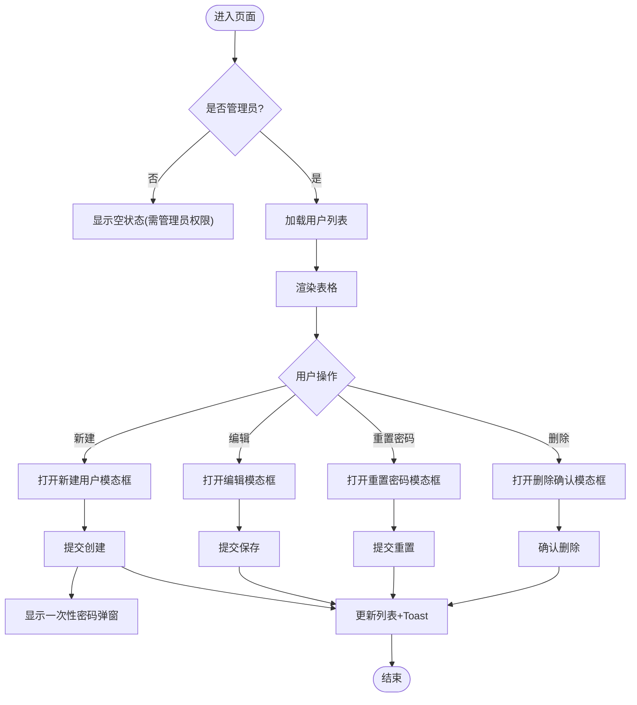
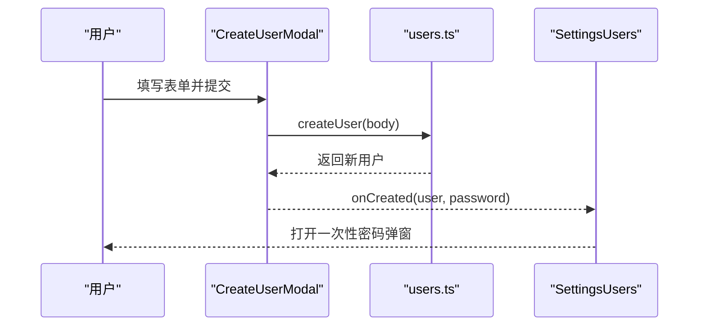
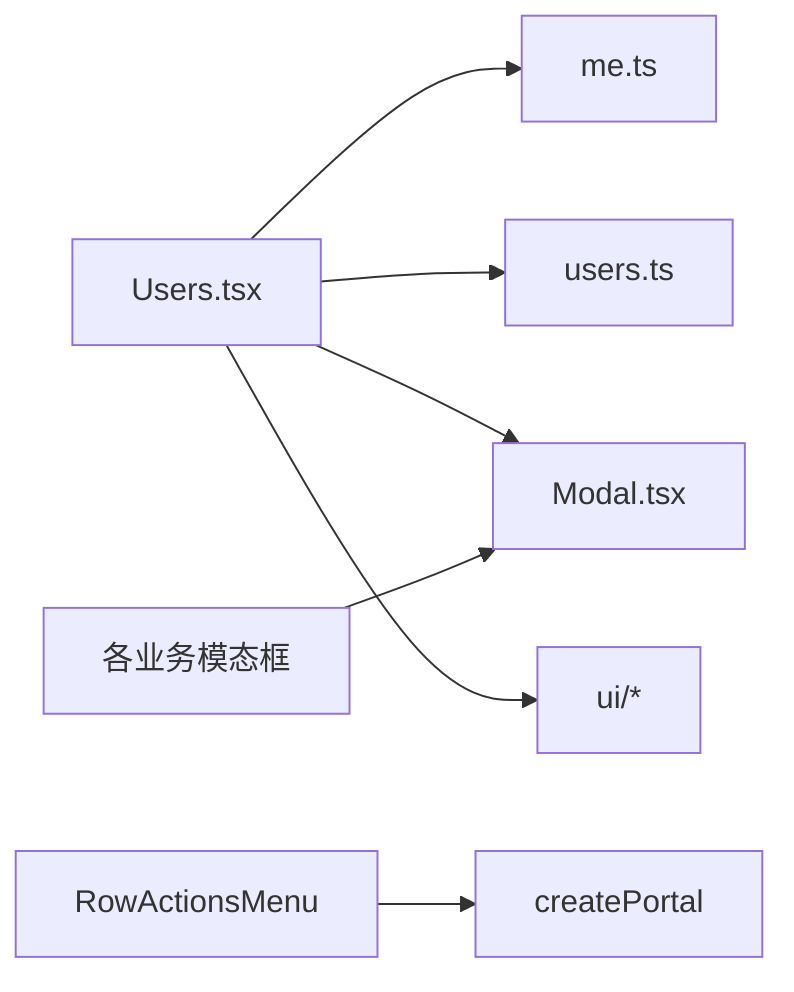

# 用户界面组件

<cite>
**本文引用的文件**
- [web/src/pages/settings/Users.tsx](file://web/src/pages/settings/Users.tsx)
- [web/src/api/users.ts](file://web/src/api/users.ts)
- [web/src/components/Modal.tsx](file://web/src/components/Modal.tsx)
- [web/src/store/me.ts](file://web/src/store/me.ts)
- [web/src/components/ui/Button.tsx](file://web/src/components/ui/Button.tsx)
- [web/src/components/ui/Card.tsx](file://web/src/components/ui/Card.tsx)
- [web/src/components/ui/Chip.tsx](file://web/src/components/ui/Chip.tsx)
- [web/src/components/ui/PageHeader.tsx](file://web/src/components/ui/PageHeader.tsx)
</cite>

## 目录
1. [简介](#简介)
2. [项目结构](#项目结构)
3. [核心组件](#核心组件)
4. [架构总览](#架构总览)
5. [详细组件分析](#详细组件分析)
6. [依赖关系分析](#依赖关系分析)
7. [性能考虑](#性能考虑)
8. [故障排查指南](#故障排查指南)
9. [结论](#结论)
10. [附录](#附录)

## 简介
本技术文档聚焦于“用户管理”界面的前端实现，围绕 React 组件架构、数据流与交互设计展开。内容涵盖：
- 用户列表表格、行操作菜单（更多操作）的实现与可访问性
- 模态框模式：新建用户、编辑信息、重置密码、删除确认、创建后一次性显示初始密码
- 状态管理与事件处理：本地状态、副作用、异步请求与错误反馈
- 响应式设计与无障碍访问：键盘交互、ARIA 属性、滚动与视口适配
- 可扩展点：搜索过滤与分页的 UI 集成位置与最佳实践建议

## 项目结构
用户管理页面位于设置页下，采用“页面级容器 + 子组件 + 通用 UI 组件 + API 封装 + 全局状态”的分层组织方式：
- 页面容器：SettingsUsers（负责权限判断、数据加载、弹窗控制、Toast 提示）
- 表格与菜单：UserTable、RowActionsMenu、MenuItem
- 模态框：CreateUserModal、EditUserModal、ResetPasswordModal、OneShotPasswordModal、通用 Modal
- API 封装：users.ts（类型定义与 HTTP 调用）
- 状态：me.ts（当前用户信息与权限）
- UI 基础组件：Button、Card、Chip、PageHeader



图表来源
- [web/src/pages/settings/Users.tsx:44-276](file://web/src/pages/settings/Users.tsx#L44-L276)
- [web/src/components/Modal.tsx:27-133](file://web/src/components/Modal.tsx#L27-L133)
- [web/src/api/users.ts:59-100](file://web/src/api/users.ts#L59-L100)
- [web/src/store/me.ts:68-92](file://web/src/store/me.ts#L68-L92)

章节来源
- [web/src/pages/settings/Users.tsx:44-276](file://web/src/pages/settings/Users.tsx#L44-L276)
- [web/src/components/Modal.tsx:27-133](file://web/src/components/Modal.tsx#L27-L133)
- [web/src/api/users.ts:59-100](file://web/src/api/users.ts#L59-L100)
- [web/src/store/me.ts:68-92](file://web/src/store/me.ts#L68-L92)

## 核心组件
- SettingsUsers（页面容器）
  - 职责：权限校验（仅 admin）、加载用户列表、打开/关闭各类模态框、执行增删改查并更新本地列表、展示 Toast
  - 关键状态：items、loading、error、toast、createOpen、editTarget、pwTarget、delTarget、oneShotPw
  - 关键副作用：useEffect 自动刷新；toast 自动消失计时器
- UserTable（用户表格）
  - 职责：渲染用户行、显示角色/状态标签、提供“编辑”按钮与“更多操作”菜单入口
- RowActionsMenu（行操作菜单）
  - 职责：通过 createPortal 将菜单渲染到 body，避免被父级 overflow 裁剪；计算相对触发按钮的定位；提供重置密码、切换角色、启用/停用、删除等选项；对“自己”的操作进行禁用保护
- 模态框家族
  - CreateUserModal：新建用户表单，提交后回调 onCreated，并弹出一次性密码提示
  - EditUserModal：编辑显示名与手机
  - ResetPasswordModal：重置密码
  - OneShotPasswordModal：创建成功后一次性展示初始密码
  - Modal：通用对话框，支持 ESC 关闭、遮罩点击关闭、可拖拽调整宽度、固定最大高度与滚动区域
- API 封装（users.ts）
  - 类型：SystemRole、UserStatus、Me、User、OrgMembership 等
  - 方法：getMe、listUsers、createUser、patchUser、setUserRole、setUserPassword、deleteUser
- 状态（me.ts）
  - useMe：获取当前用户信息、加载中、错误、刷新；单飞请求去抖；token 变化时清空缓存
  - usePermissions：派生权限标志（isAdmin/isUser/isViewer/canMutate）

章节来源
- [web/src/pages/settings/Users.tsx:44-276](file://web/src/pages/settings/Users.tsx#L44-L276)
- [web/src/pages/settings/Users.tsx:280-362](file://web/src/pages/settings/Users.tsx#L280-L362)
- [web/src/pages/settings/Users.tsx:371-485](file://web/src/pages/settings/Users.tsx#L371-L485)
- [web/src/pages/settings/Users.tsx:526-815](file://web/src/pages/settings/Users.tsx#L526-L815)
- [web/src/components/Modal.tsx:27-133](file://web/src/components/Modal.tsx#L27-L133)
- [web/src/api/users.ts:17-100](file://web/src/api/users.ts#L17-L100)
- [web/src/store/me.ts:1-114](file://web/src/store/me.ts#L1-L114)

## 架构总览
下图展示了从页面到 API 的完整调用链与数据流向，包括权限检查、列表加载、操作回调与错误处理。



图表来源
- [web/src/pages/settings/Users.tsx:44-276](file://web/src/pages/settings/Users.tsx#L44-L276)
- [web/src/api/users.ts:59-100](file://web/src/api/users.ts#L59-L100)
- [web/src/store/me.ts:68-92](file://web/src/store/me.ts#L68-L92)

## 详细组件分析

### 页面容器：SettingsUsers
- 权限控制：基于 useMe 的 role 判断是否为 admin，否则展示 EmptyState
- 数据加载：useEffect 调用 refresh -> listUsers，失败时记录 error
- 列表更新：replaceRow 原地替换新增/修改的行，删除则 filter 移除
- 操作回调：changeRole、toggleStatus、doDelete 分别调用对应 API 并反馈 Toast
- 模态框编排：createOpen、editTarget、pwTarget、delTarget、oneShotPw 控制各模态框显隐
- 错误与提示：统一 errMsg 提取 ApiError.message；toast 4 秒自动消失



图表来源
- [web/src/pages/settings/Users.tsx:44-276](file://web/src/pages/settings/Users.tsx#L44-L276)
- [web/src/pages/settings/Users.tsx:526-815](file://web/src/pages/settings/Users.tsx#L526-L815)

章节来源
- [web/src/pages/settings/Users.tsx:44-276](file://web/src/pages/settings/Users.tsx#L44-L276)

### 表格与行操作菜单：UserTable 与 RowActionsMenu
- UserTable
  - 列：姓名、邮箱、手机、系统角色、状态、操作
  - 行内“编辑”按钮直接触发编辑模态框
  - “更多操作”下拉菜单通过 RowActionsMenu 提供
- RowActionsMenu
  - 使用 createPortal 将菜单挂载到 document.body，避免被父级 overflow-x-auto 裁剪
  - 动态计算定位：监听 resize/scroll 同步 top/right
  - 菜单项：重置密码、设为 admin/user/viewer、启用/停用账号、删除用户
  - 防误操作：对“自己”的角色变更、停用、删除进行 disabled 限制，并提供 title 提示
  - 可访问性：role="menu"、aria-hidden 遮罩、每个菜单项 role="menuitem"

```mermaid
classDiagram
class UserTable {
+items : User[]
+meId : number
+onEdit(u)
+onPassword(u)
+onChangeRole(u, next)
+onToggleStatus(u)
+onDelete(u)
}
class RowActionsMenu {
+user : User
+isSelf : boolean
+open : boolean
+position : {top,right}
+syncPosition()
+run(fn)
}
UserTable --> RowActionsMenu : "传递用户与回调"
```

图表来源
- [web/src/pages/settings/Users.tsx:280-362](file://web/src/pages/settings/Users.tsx#L280-L362)
- [web/src/pages/settings/Users.tsx:371-485](file://web/src/pages/settings/Users.tsx#L371-L485)

章节来源
- [web/src/pages/settings/Users.tsx:280-362](file://web/src/pages/settings/Users.tsx#L280-L362)
- [web/src/pages/settings/Users.tsx:371-485](file://web/src/pages/settings/Users.tsx#L371-L485)

### 模态框家族：Modal 与各业务模态框
- Modal（通用）
  - 功能：ESC 关闭、遮罩点击关闭、锁定 body 滚动、最大高度 90vh 内部滚动、可选 resizable 拖拽调宽
  - 可访问性：role="dialog"、aria-modal="true"、aria-label
- CreateUserModal
  - 字段：邮箱、初始密码、显示名、手机、系统角色
  - 行为：提交后调用 createUser，成功回调 onCreated(user, password)
- EditUserModal
  - 字段：显示名、手机
  - 行为：提交后调用 patchUser，成功回调 onSaved(updatedUser)
- ResetPasswordModal
  - 字段：新密码
  - 行为：提交后调用 setUserPassword，成功回调 onDone
- OneShotPasswordModal
  - 行为：创建成功后一次性展示初始密码，便于复制并通过安全渠道交付



图表来源
- [web/src/pages/settings/Users.tsx:526-649](file://web/src/pages/settings/Users.tsx#L526-L649)
- [web/src/components/Modal.tsx:27-133](file://web/src/components/Modal.tsx#L27-L133)
- [web/src/api/users.ts:67-77](file://web/src/api/users.ts#L67-L77)

章节来源
- [web/src/pages/settings/Users.tsx:526-815](file://web/src/pages/settings/Users.tsx#L526-L815)
- [web/src/components/Modal.tsx:27-133](file://web/src/components/Modal.tsx#L27-L133)

### 状态管理：useMe 与权限派生
- useMe
  - 单飞请求：多个组件同时挂载只发一次 getMe
  - 生命周期：token 存在时自动拉取；token 失效时清空缓存
  - 返回值：{ me, loading, error, refresh }
- usePermissions
  - 派生 isAdmin/isUser/isViewer/canMutate，首屏优先使用 JWT 中的 role，避免闪烁

章节来源
- [web/src/store/me.ts:1-114](file://web/src/store/me.ts#L1-L114)

### 数据模型与 API 契约
- 类型
  - SystemRole: 'admin' | 'user' | 'viewer'
  - UserStatus: 'active' | 'disabled'
  - Me: 当前用户信息（含 memberships）
  - User: 用户列表项
  - OrgMembership: 组织成员角色
- API 方法
  - GET /api/v1/me
  - GET /api/v1/users
  - POST /api/v1/users
  - PATCH /api/v1/users/{id}
  - PATCH /api/v1/users/{id}/role
  - PATCH /api/v1/users/{id}/password
  - DELETE /api/v1/users/{id}

章节来源
- [web/src/api/users.ts:17-100](file://web/src/api/users.ts#L17-L100)

## 依赖关系分析
- 页面容器依赖：
  - store/me.ts：获取当前用户与权限
  - api/users.ts：所有用户相关 HTTP 调用
  - components/Modal.tsx：通用弹窗
  - components/ui/*：按钮、卡片、标签、页面头部
- 表格与菜单依赖：
  - RowActionsMenu 依赖 createPortal 与窗口事件（resize/scroll）
  - 所有模态框依赖 Modal 的可访问性与尺寸控制
- 外部库：
  - lucide-react：图标
  - zustand：store 状态（在 me.ts 中）



图表来源
- [web/src/pages/settings/Users.tsx:44-276](file://web/src/pages/settings/Users.tsx#L44-L276)
- [web/src/components/Modal.tsx:27-133](file://web/src/components/Modal.tsx#L27-L133)
- [web/src/store/me.ts:68-92](file://web/src/store/me.ts#L68-L92)
- [web/src/api/users.ts:59-100](file://web/src/api/users.ts#L59-L100)

章节来源
- [web/src/pages/settings/Users.tsx:44-276](file://web/src/pages/settings/Users.tsx#L44-L276)
- [web/src/components/Modal.tsx:27-133](file://web/src/components/Modal.tsx#L27-L133)
- [web/src/store/me.ts:68-92](file://web/src/store/me.ts#L68-L92)
- [web/src/api/users.ts:59-100](file://web/src/api/users.ts#L59-L100)

## 性能考虑
- 列表渲染
  - 当前为全量渲染，适合中小规模用户数；若数据量大，建议在 UserTable 中引入虚拟滚动或分页
- 网络请求
  - useMe 已实现单飞请求，避免重复拉取；listUsers 可在必要时加入防抖或增量更新策略
- 模态框定位
  - RowActionsMenu 使用 createPortal 并监听 resize/scroll，注意在大量行时减少重排开销
- 样式与主题
  - 使用 Tailwind 原子类，保持轻量；避免过度嵌套导致重绘

[本节为通用指导，不直接分析具体文件]

## 故障排查指南
- 无法看到用户管理入口
  - 检查 useMe 返回的 role 是否为 admin；token 失效会导致缓存清空
- 列表为空或报错
  - 查看 error 状态与 toast；确认后端 /api/v1/users 可达
- 操作无响应
  - 检查按钮 disabled 条件（如“自己”不可改角色/停用/删除）
  - 检查表单必填字段是否满足（新建用户需邮箱、密码、显示名）
- 模态框被遮挡或溢出
  - RowActionsMenu 已通过 createPortal 解决；若自定义内容过长，确保 Modal 内部滚动生效
- 国际化文案异常
  - 确认 tr/trInline 使用正确，必要时检查 i18n 资源

章节来源
- [web/src/pages/settings/Users.tsx:44-276](file://web/src/pages/settings/Users.tsx#L44-L276)
- [web/src/pages/settings/Users.tsx:526-815](file://web/src/pages/settings/Users.tsx#L526-L815)
- [web/src/store/me.ts:68-92](file://web/src/store/me.ts#L68-L92)

## 结论
该用户管理界面以清晰的组件分层与明确的状态流转实现了完整的用户 CRUD 流程，并通过通用 Modal 与 UI 组件保证了良好的可维护性与一致性。行操作菜单采用 Portal 定位与可访问性标记，提升了复杂表格下的交互体验。后续可按需扩展搜索过滤与分页能力，进一步提升大数据量场景下的性能与易用性。

[本节为总结，不直接分析具体文件]

## 附录

### 搜索与分页的 UI 集成建议
- 搜索过滤
  - 在 PageHeader.extra 插槽中插入搜索输入框，结合本地 items 过滤或后端查询参数
  - 防抖输入，避免频繁请求
- 分页
  - 在表格下方添加 PaginationFooter（可复用现有分页组件），根据后端 total 与 page/page_size 控制
  - 将分页状态与 URL 参数同步，便于分享与回退

[本节为概念性建议，不直接分析具体文件]