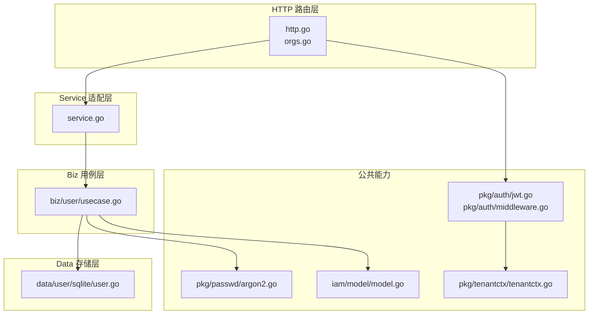
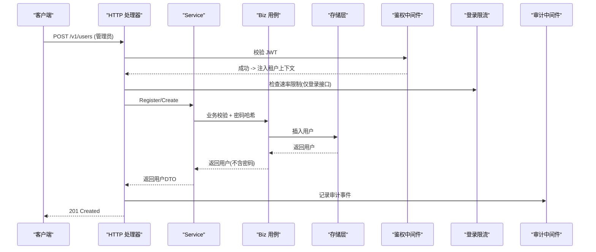
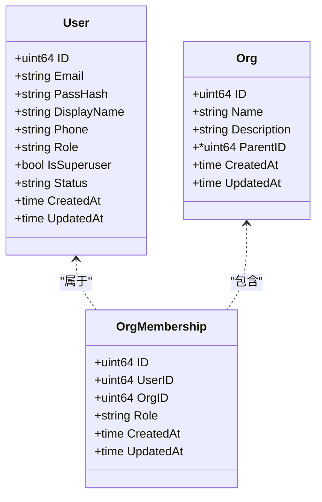
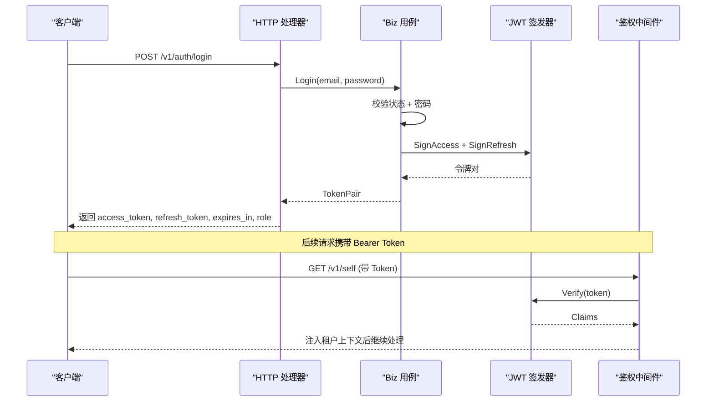
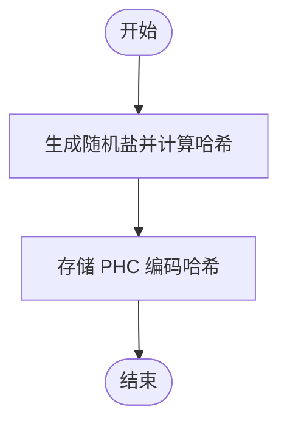
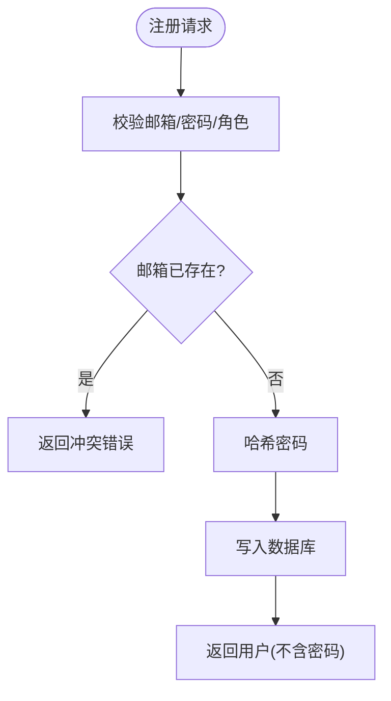
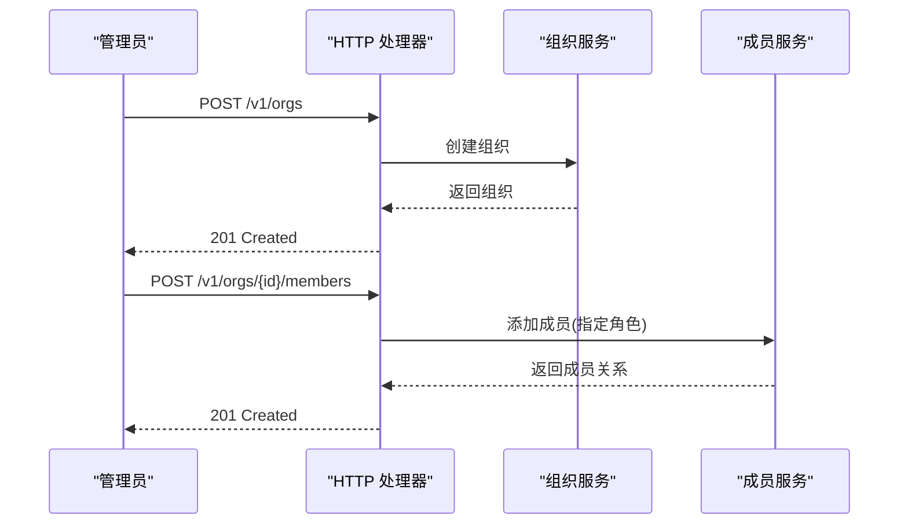
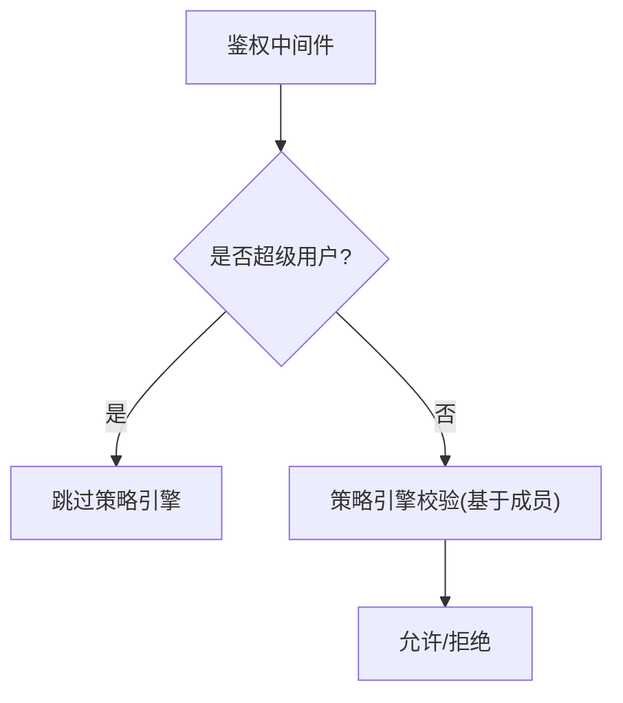
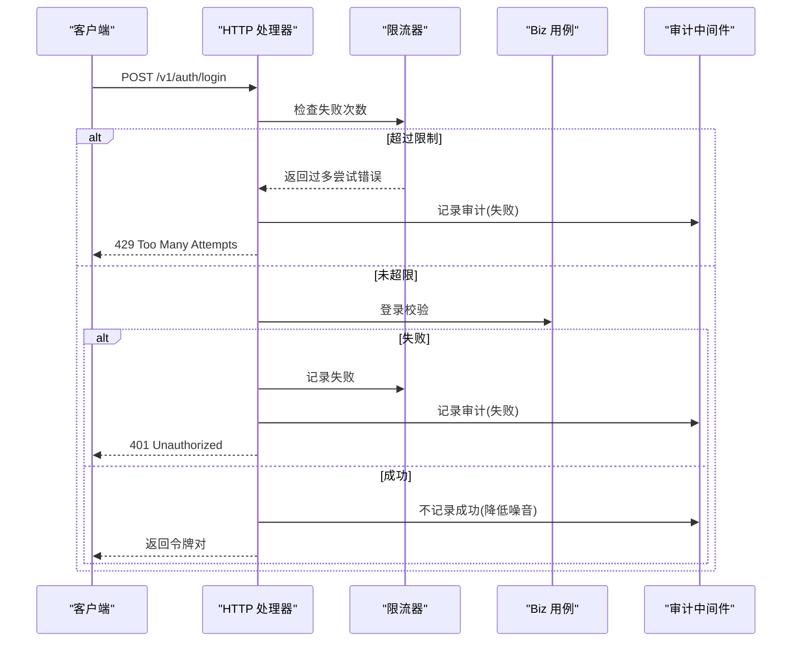
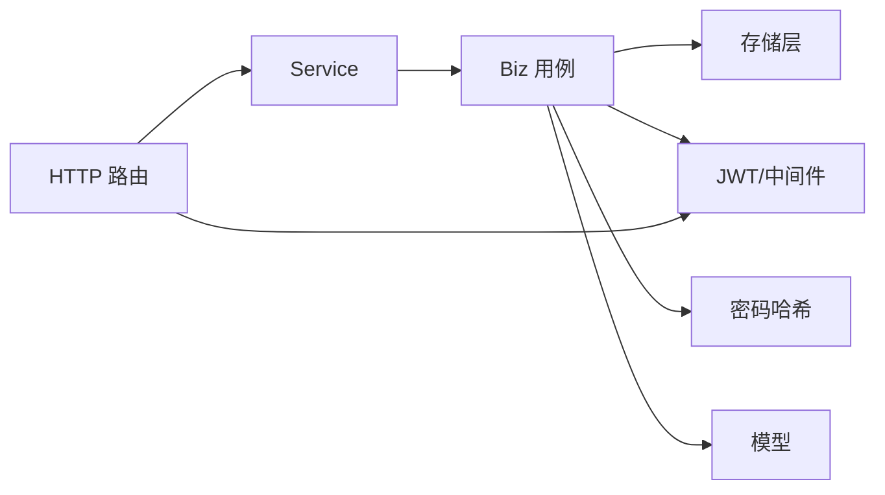

# 用户管理

<cite>
**本文引用的文件**
- [internal/iam/model/model.go](file://internal/iam/model/model.go)
- [internal/iam/service/service.go](file://internal/iam/service/service.go)
- [internal/iam/server/http.go](file://internal/iam/server/http.go)
- [internal/iam/server/orgs.go](file://internal/iam/server/orgs.go)
- [internal/iam/biz/user/usecase.go](file://internal/iam/biz/user/usecase.go)
- [internal/iam/biz/user/repo.go](file://internal/iam/biz/user/repo.go)
- [internal/iam/biz/user/hash.go](file://internal/iam/biz/user/hash.go)
- [internal/iam/data/user/sqlite/user.go](file://internal/iam/data/user/sqlite/user.go)
- [internal/pkg/auth/jwt.go](file://internal/pkg/auth/jwt.go)
- [internal/pkg/auth/middleware.go](file://internal/pkg/auth/middleware.go)
- [internal/pkg/passwd/argon2.go](file://internal/pkg/passwd/argon2.go)
- [internal/pkg/tenantctx/tenantctx.go](file://internal/pkg/tenantctx/tenantctx.go)
</cite>

## 目录
1. [简介](#简介)
2. [项目结构](#项目结构)
3. [核心组件](#核心组件)
4. [架构总览](#架构总览)
5. [详细组件分析](#详细组件分析)
6. [依赖关系分析](#依赖关系分析)
7. [性能与安全考量](#性能与安全考量)
8. [故障排查指南](#故障排查指南)
9. [结论](#结论)
10. [附录：API与数据模型速查](#附录api与数据模型速查)

## 简介
本技术文档聚焦于用户管理模块，覆盖用户账户的增删改查、角色权限分配、组织成员管理、认证流程、密码策略与安全设置、多租户隔离与数据权限控制，以及审计日志与会话管理。文档同时提供开发示例路径，帮助快速定位实现代码，并总结数据安全与隐私保护的最佳实践。

## 项目结构
用户管理采用分层架构：HTTP 路由层 → Service 适配层 → Biz 用例层 → Data 存储层；鉴权与租户上下文通过中间件注入；密码哈希使用 Argon2id；JWT 用于会话管理；组织与成员作为 RBAC 域（Casbin）的基础事实来源。

图表来源
- [internal/iam/server/http.go:151-183](file://internal/iam/server/http.go#L151-L183)
- [internal/iam/service/service.go:18-57](file://internal/iam/service/service.go#L18-L57)
- [internal/iam/biz/user/usecase.go:18-38](file://internal/iam/biz/user/usecase.go#L18-L38)
- [internal/iam/data/user/sqlite/user.go:15-24](file://internal/iam/data/user/sqlite/user.go#L15-L24)
- [internal/pkg/auth/jwt.go:1-30](file://internal/pkg/auth/jwt.go#L1-L30)
- [internal/pkg/auth/middleware.go:10-21](file://internal/pkg/auth/middleware.go#L10-L21)
- [internal/pkg/passwd/argon2.go:14-24](file://internal/pkg/passwd/argon2.go#L14-L24)
- [internal/pkg/tenantctx/tenantctx.go:1-26](file://internal/pkg/tenantctx/tenantctx.go#L1-L26)
- [internal/iam/model/model.go:23-140](file://internal/iam/model/model.go#L23-L140)

章节来源
- [internal/iam/server/http.go:151-183](file://internal/iam/server/http.go#L151-L183)
- [internal/iam/service/service.go:18-57](file://internal/iam/service/service.go#L18-L57)
- [internal/iam/biz/user/usecase.go:18-38](file://internal/iam/biz/user/usecase.go#L18-L38)
- [internal/iam/data/user/sqlite/user.go:15-24](file://internal/iam/data/user/sqlite/user.go#L15-L24)
- [internal/pkg/auth/jwt.go:1-30](file://internal/pkg/auth/jwt.go#L1-L30)
- [internal/pkg/auth/middleware.go:10-21](file://internal/pkg/auth/middleware.go#L10-L21)
- [internal/pkg/passwd/argon2.go:14-24](file://internal/pkg/passwd/argon2.go#L14-L24)
- [internal/pkg/tenantctx/tenantctx.go:1-26](file://internal/pkg/tenantctx/tenantctx.go#L1-L26)
- [internal/iam/model/model.go:23-140](file://internal/iam/model/model.go#L23-L140)

## 核心组件
- 模型与常量：用户、组织、成员关系及系统角色常量，定义权限边界与状态。
- HTTP 路由与处理器：注册公开与受保护接口，包含登录、刷新、用户与组织 CRUD、成员管理。
- Service 适配层：统一封装业务服务，暴露给 HTTP 层调用。
- Biz 用例层：实现用户注册、登录、令牌签发、资料更新、角色与状态管理、管理员引导等。
- 存储层：基于 GORM 的用户持久化操作。
- 鉴权与会话：JWT 签发与校验、请求级租户上下文注入。
- 密码安全：Argon2id 哈希与验证。
- 审计与限流：登录失败限流、审计事件记录。

章节来源
- [internal/iam/model/model.go:23-140](file://internal/iam/model/model.go#L23-L140)
- [internal/iam/server/http.go:151-183](file://internal/iam/server/http.go#L151-L183)
- [internal/iam/service/service.go:18-57](file://internal/iam/service/service.go#L18-L57)
- [internal/iam/biz/user/usecase.go:40-123](file://internal/iam/biz/user/usecase.go#L40-L123)
- [internal/iam/data/user/sqlite/user.go:26-150](file://internal/iam/data/user/sqlite/user.go#L26-L150)
- [internal/pkg/auth/jwt.go:32-99](file://internal/pkg/auth/jwt.go#L32-L99)
- [internal/pkg/auth/middleware.go:10-68](file://internal/pkg/auth/middleware.go#L10-L68)
- [internal/pkg/passwd/argon2.go:14-79](file://internal/pkg/passwd/argon2.go#L14-L79)

## 架构总览
下图展示一次“管理员创建用户”的端到端调用链，包括鉴权、限流、业务校验、存储写入与审计记录。

图表来源
- [internal/iam/server/http.go:290-313](file://internal/iam/server/http.go#L290-L313)
- [internal/iam/service/service.go:59-67](file://internal/iam/service/service.go#L59-L67)
- [internal/iam/biz/user/usecase.go:40-78](file://internal/iam/biz/user/usecase.go#L40-L78)
- [internal/iam/data/user/sqlite/user.go:26-32](file://internal/iam/data/user/sqlite/user.go#L26-L32)
- [internal/pkg/auth/middleware.go:21-52](file://internal/pkg/auth/middleware.go#L21-L52)
- [internal/iam/server/http.go:221-269](file://internal/iam/server/http.go#L221-L269)

## 详细组件分析

### 用户模型与角色体系
- 用户实体包含邮箱、显示名、电话、角色、超级用户标志、状态与时间戳。
- 系统角色：admin、user、viewer；其中 viewer 不可写资源。
- 组织成员角色：org_admin、member、viewer，映射到策略引擎主体。
- 超级用户独立于成员关系，可绕过策略引擎进行系统管理。

图表来源
- [internal/iam/model/model.go:80-140](file://internal/iam/model/model.go#L80-L140)

章节来源
- [internal/iam/model/model.go:23-140](file://internal/iam/model/model.go#L23-L140)

### 认证与会话管理
- 登录流程：校验邮箱与密码，检查状态，签发访问令牌与刷新令牌。
- 刷新流程：校验刷新令牌，重新签发新令牌对。
- 中间件：从 Authorization 或查询参数提取 Bearer Token，校验签名与过期，将租户上下文写入请求上下文。
- 令牌载荷：包含用户ID、邮箱、角色、是否超级用户、标准声明。

图表来源
- [internal/iam/biz/user/usecase.go:80-123](file://internal/iam/biz/user/usecase.go#L80-L123)
- [internal/pkg/auth/jwt.go:56-99](file://internal/pkg/auth/jwt.go#L56-L99)
- [internal/pkg/auth/middleware.go:21-68](file://internal/pkg/auth/middleware.go#L21-L68)
- [internal/iam/server/http.go:221-288](file://internal/iam/server/http.go#L221-L288)

章节来源
- [internal/iam/biz/user/usecase.go:80-123](file://internal/iam/biz/user/usecase.go#L80-L123)
- [internal/pkg/auth/jwt.go:56-99](file://internal/pkg/auth/jwt.go#L56-L99)
- [internal/pkg/auth/middleware.go:21-68](file://internal/pkg/auth/middleware.go#L21-L68)
- [internal/iam/server/http.go:221-288](file://internal/iam/server/http.go#L221-L288)

### 密码策略与安全设置
- 密码哈希：使用 Argon2id，参数在库中固定，支持不同参数的历史哈希兼容。
- 验证：恒定时间比较，避免时序侧信道泄露。
- 重置：管理员可重置用户密码；用户注册时自动哈希存储。

图表来源
- [internal/pkg/passwd/argon2.go:14-45](file://internal/pkg/passwd/argon2.go#L14-L45)
- [internal/iam/biz/user/hash.go:5-16](file://internal/iam/biz/user/hash.go#L5-L16)
- [internal/iam/biz/user/usecase.go:40-78](file://internal/iam/biz/user/usecase.go#L40-L78)

章节来源
- [internal/pkg/passwd/argon2.go:14-79](file://internal/pkg/passwd/argon2.go#L14-L79)
- [internal/iam/biz/user/hash.go:5-16](file://internal/iam/biz/user/hash.go#L5-L16)
- [internal/iam/biz/user/usecase.go:40-78](file://internal/iam/biz/user/usecase.go#L40-L78)

### 用户注册与资料管理
- 注册：校验邮箱唯一性、角色合法性，哈希密码，写入用户，默认状态为活跃。
- 资料更新：支持显示名、电话更新；长度限制与空值处理。
- 列表与详情：返回用户信息时清除敏感字段（密码）。

图表来源
- [internal/iam/biz/user/usecase.go:40-78](file://internal/iam/biz/user/usecase.go#L40-L78)
- [internal/iam/data/user/sqlite/user.go:26-32](file://internal/iam/data/user/sqlite/user.go#L26-L32)

章节来源
- [internal/iam/biz/user/usecase.go:40-78](file://internal/iam/biz/user/usecase.go#L40-L78)
- [internal/iam/data/user/sqlite/user.go:26-32](file://internal/iam/data/user/sqlite/user.go#L26-L32)

### 角色权限与组织成员管理
- 角色：系统级 admin/user/viewer；成员级 org_admin/member/viewer。
- 成员关系：用户可在多个组织拥有不同角色；变更会同步到策略引擎主体。
- 组织 CRUD：管理员可创建、更新、删除组织；成员列表与增删改由管理员执行。
- 默认组织：新用户可自动加入“默认组织”为 member，便于立即访问资源。

图表来源
- [internal/iam/server/orgs.go:231-250](file://internal/iam/server/orgs.go#L231-L250)
- [internal/iam/server/orgs.go:337-370](file://internal/iam/server/orgs.go#L337-L370)

章节来源
- [internal/iam/model/model.go:61-78](file://internal/iam/model/model.go#L61-L78)
- [internal/iam/server/orgs.go:231-427](file://internal/iam/server/orgs.go#L231-L427)

### 多租户隔离与数据权限控制
- 租户上下文：鉴权中间件将用户身份与角色注入请求上下文，供下游读取。
- 超级用户短路：当 claims 或角色指示超级用户时，可绕过策略引擎。
- 成员即主体：成员关系作为策略主体，结合策略矩阵实现按组织的数据权限控制。
- 当前 MVP 为单租户命名空间，但通过成员与策略引擎预留多租户扩展点。

图表来源
- [internal/pkg/auth/middleware.go:34-52](file://internal/pkg/auth/middleware.go#L34-L52)
- [internal/iam/model/model.go:10-18](file://internal/iam/model/model.go#L10-L18)

章节来源
- [internal/pkg/auth/middleware.go:34-52](file://internal/pkg/auth/middleware.go#L34-L52)
- [internal/iam/model/model.go:10-18](file://internal/iam/model/model.go#L10-L18)

### 审计日志与会话管理
- 登录失败限流：按 IP 与邮箱窗口计数，防止暴力破解与密码喷洒。
- 审计事件：登录失败、用户创建、删除、角色更新等操作均记录审计事件。
- 会话管理：访问令牌短生命周期，刷新令牌长生命周期；刷新时重新签发。

图表来源
- [internal/iam/server/http.go:221-269](file://internal/iam/server/http.go#L221-L269)
- [internal/iam/biz/user/usecase.go:80-123](file://internal/iam/biz/user/usecase.go#L80-L123)

章节来源
- [internal/iam/server/http.go:221-269](file://internal/iam/server/http.go#L221-L269)
- [internal/iam/biz/user/usecase.go:80-123](file://internal/iam/biz/user/usecase.go#L80-L123)

## 依赖关系分析
- HTTP 层依赖 Service 层，Service 层依赖 Biz 层，Biz 层依赖 Data 层与公共能力（JWT、密码、租户上下文）。
- 模型定义位于 iam/model，被 Service/Biz/Data 共同引用。
- 鉴权中间件在 HTTP 入口处生效，影响所有受保护路由。

图表来源
- [internal/iam/server/http.go:151-183](file://internal/iam/server/http.go#L151-L183)
- [internal/iam/service/service.go:18-57](file://internal/iam/service/service.go#L18-L57)
- [internal/iam/biz/user/usecase.go:18-38](file://internal/iam/biz/user/usecase.go#L18-L38)
- [internal/iam/data/user/sqlite/user.go:15-24](file://internal/iam/data/user/sqlite/user.go#L15-L24)
- [internal/pkg/auth/jwt.go:32-99](file://internal/pkg/auth/jwt.go#L32-L99)
- [internal/pkg/passwd/argon2.go:14-79](file://internal/pkg/passwd/argon2.go#L14-L79)
- [internal/iam/model/model.go:23-140](file://internal/iam/model/model.go#L23-L140)

章节来源
- [internal/iam/server/http.go:151-183](file://internal/iam/server/http.go#L151-L183)
- [internal/iam/service/service.go:18-57](file://internal/iam/service/service.go#L18-L57)
- [internal/iam/biz/user/usecase.go:18-38](file://internal/iam/biz/user/usecase.go#L18-L38)
- [internal/iam/data/user/sqlite/user.go:15-24](file://internal/iam/data/user/sqlite/user.go#L15-L24)
- [internal/pkg/auth/jwt.go:32-99](file://internal/pkg/auth/jwt.go#L32-L99)
- [internal/pkg/passwd/argon2.go:14-79](file://internal/pkg/passwd/argon2.go#L14-L79)
- [internal/iam/model/model.go:23-140](file://internal/iam/model/model.go#L23-L140)

## 性能与安全考量
- 登录限流：按 IP 与邮箱双维度滑动窗口计数，有效抑制暴力破解与密码喷洒。
- 密码强度：Argon2id 参数兼顾安全性与性能，适合本地与服务器环境。
- 令牌策略：访问令牌短生命周期，刷新令牌长生命周期，减少频繁重认证。
- 数据最小化：返回用户信息时移除敏感字段（如密码），降低泄露风险。
- 审计降噪：成功登录不记录审计事件，降低日志噪声，保留失败审计用于安全分析。
- 多租户扩展：成员关系与策略引擎为未来多租户与细粒度权限预留扩展点。

[本节为通用指导，无需特定文件来源]

## 故障排查指南
- 登录失败：检查邮箱与密码是否正确、用户状态是否为活跃、是否触发限流。
- 令牌无效：确认 Bearer Token 格式正确、未过期、签名密钥一致。
- 权限不足：确认用户角色与组织成员关系是否配置正确，策略引擎主体是否同步。
- 用户不存在：检查 ID 或邮箱是否存在，存储层是否返回未找到错误。
- 审计缺失：确认审计中间件已安装，且关键操作已设置审计事件。

章节来源
- [internal/iam/server/http.go:221-269](file://internal/iam/server/http.go#L221-L269)
- [internal/iam/biz/user/usecase.go:80-123](file://internal/iam/biz/user/usecase.go#L80-L123)
- [internal/iam/data/user/sqlite/user.go:34-56](file://internal/iam/data/user/sqlite/user.go#L34-L56)

## 结论
用户管理模块以清晰的层次结构与明确的职责划分实现了安全的认证、授权与用户生命周期管理。通过 Argon2id 密码哈希、JWT 会话管理、登录限流与审计日志，系统在安全性与可用性之间取得平衡。组织与成员关系为多租户与细粒度权限控制奠定基础，便于后续扩展。建议在生产环境中持续监控登录失败率与审计事件，定期评估密码策略与令牌生命周期，确保系统安全合规。

[本节为总结，无需特定文件来源]

## 附录：API与数据模型速查
- 公开接口
  - POST /v1/auth/login：登录，返回令牌对
  - POST /v1/auth/refresh：刷新令牌
- 受保护接口
  - POST /v1/auth/register：管理员注册新用户
  - GET /v1/self：获取当前用户基本信息
  - GET /v1/me：获取当前用户详细信息（含成员关系）
  - GET /v1/users：列出所有用户（管理员）
  - POST /v1/users：创建用户（管理员）
  - PATCH /v1/users/{id}：更新用户资料（管理员）
  - PATCH /v1/users/{id}/role：修改用户角色（管理员）
  - PATCH /v1/users/{id}/password：重置用户密码（管理员）
  - DELETE /v1/users/{id}：删除用户（管理员）
  - 组织与成员：/v1/orgs、/v1/orgs/{id}/members 等（管理员）

- 数据模型
  - 用户：ID、邮箱、显示名、电话、角色、超级用户标志、状态、时间戳
  - 组织：ID、名称、描述、父组织、时间戳
  - 成员关系：ID、用户ID、组织ID、角色、时间戳

章节来源
- [internal/iam/server/http.go:151-183](file://internal/iam/server/http.go#L151-L183)
- [internal/iam/server/orgs.go:231-427](file://internal/iam/server/orgs.go#L231-L427)
- [internal/iam/model/model.go:80-140](file://internal/iam/model/model.go#L80-L140)