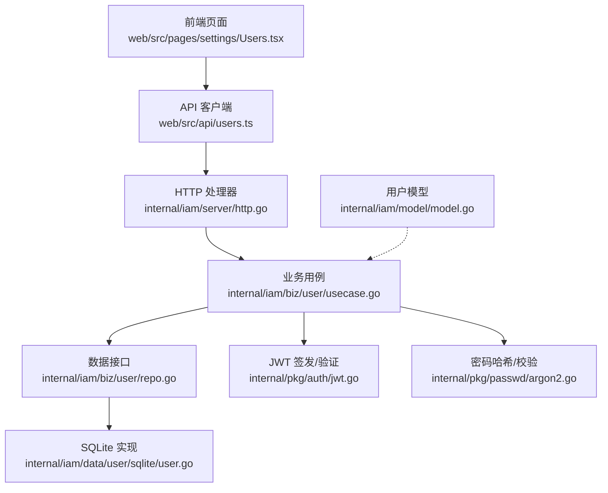
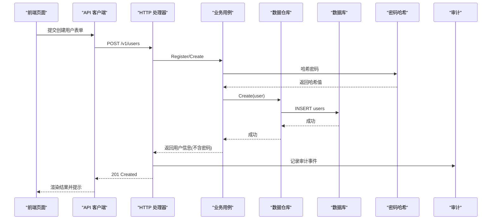
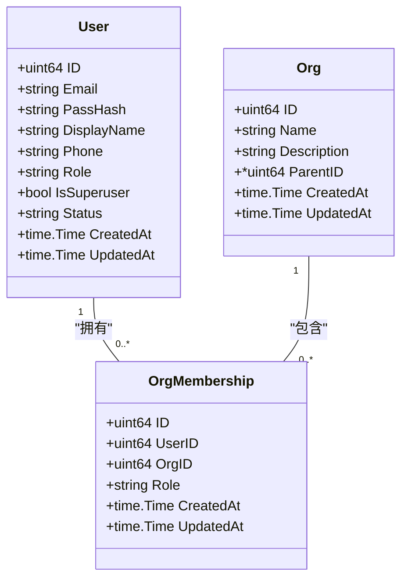
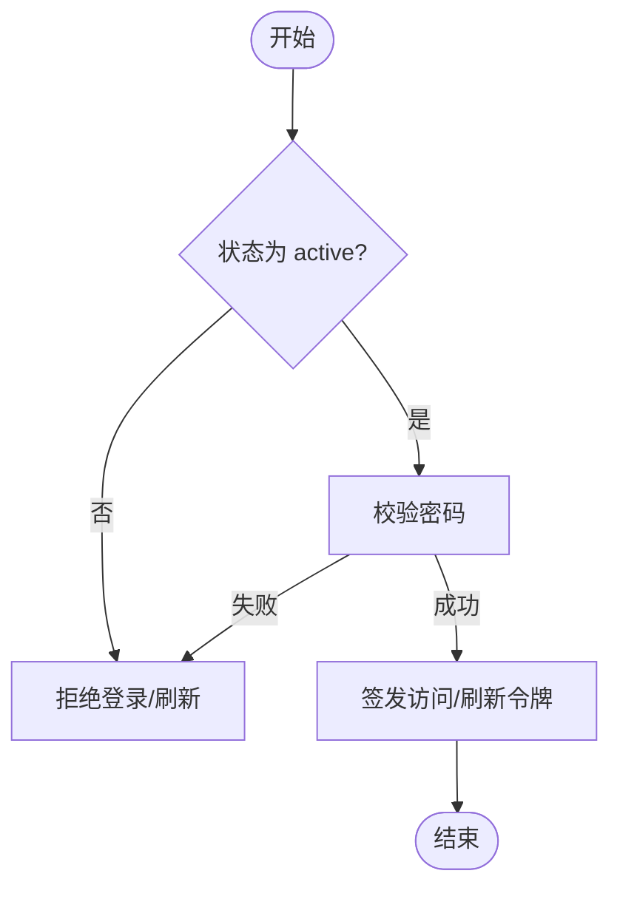
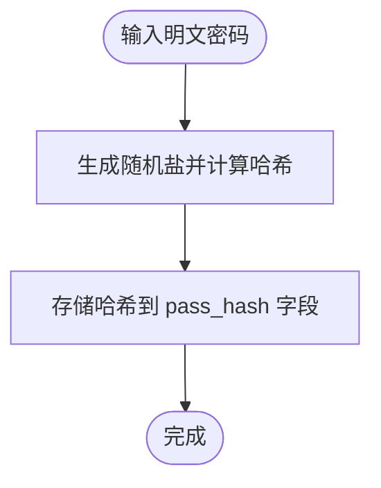
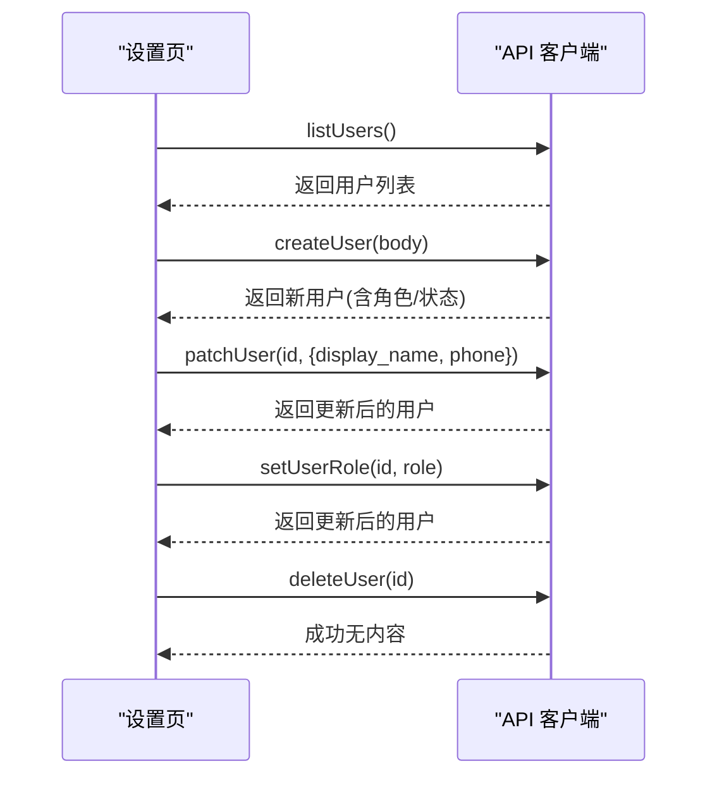
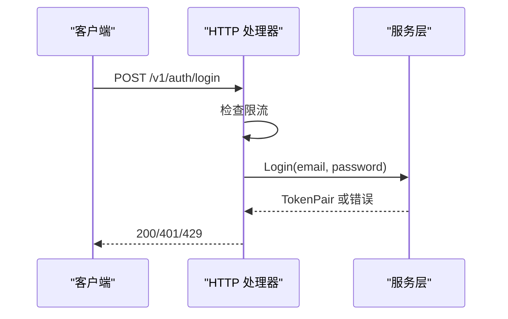
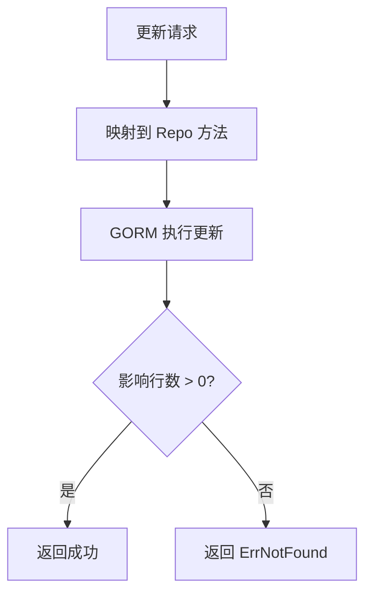
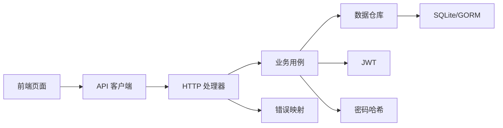

# 用户账户管理

<cite>
**本文引用的文件**
- [internal/iam/model/model.go](file://internal/iam/model/model.go)
- [internal/iam/biz/user/usecase.go](file://internal/iam/biz/user/usecase.go)
- [internal/iam/biz/user/repo.go](file://internal/iam/biz/user/repo.go)
- [internal/iam/data/user/sqlite/user.go](file://internal/iam/data/user/sqlite/user.go)
- [internal/pkg/passwd/argon2.go](file://internal/pkg/passwd/argon2.go)
- [internal/iam/server/http.go](file://internal/iam/server/http.go)
- [web/src/api/users.ts](file://web/src/api/users.ts)
- [web/src/pages/settings/Users.tsx](file://web/src/pages/settings/Users.tsx)
- [internal/pkg/auth/jwt.go](file://internal/pkg/auth/jwt.go)
- [internal/pkg/errs/errs.go](file://internal/pkg/errs/errs.go)
</cite>

## 目录
1. [简介](#简介)
2. [项目结构](#项目结构)
3. [核心组件](#核心组件)
4. [架构总览](#架构总览)
5. [详细组件分析](#详细组件分析)
6. [依赖关系分析](#依赖关系分析)
7. [性能考虑](#性能考虑)
8. [故障排查指南](#故障排查指南)
9. [结论](#结论)
10. [附录](#附录)

## 简介
本技术文档聚焦于用户账户管理的完整实现，覆盖用户创建、编辑、删除与查询的端到端流程；阐述用户数据模型设计（邮箱、显示名称、手机号等字段）；解释用户状态管理机制（active/disabled）与生命周期管理；提供从前端表单到后端 API、错误处理与用户反馈的完整流程示例；并总结密码安全存储与最佳实践。

## 项目结构
用户账户管理采用分层架构：
- 表现层（HTTP）：路由注册、请求解析、鉴权与审计、限流防护。
- 业务层（Usecase）：领域规则校验、令牌签发、状态与角色一致性维护。
- 数据访问层（Repo + SQLite）：GORM 持久化、错误映射、软删除式状态切换。
- 模型层（Model）：用户、组织、成员关系实体定义与约束。
- 安全与认证：Argon2id 密码哈希、JWT 签发与验证。
- 前端：类型化 API 封装与设置页用户管理界面。

**图表来源**
- [internal/iam/server/http.go:151-183](file://internal/iam/server/http.go#L151-L183)
- [internal/iam/biz/user/usecase.go:40-123](file://internal/iam/biz/user/usecase.go#L40-L123)
- [internal/iam/biz/user/repo.go:11-29](file://internal/iam/biz/user/repo.go#L11-L29)
- [internal/iam/data/user/sqlite/user.go:27-150](file://internal/iam/data/user/sqlite/user.go#L27-L150)
- [internal/pkg/auth/jwt.go:16-99](file://internal/pkg/auth/jwt.go#L16-L99)
- [internal/pkg/passwd/argon2.go:26-78](file://internal/pkg/passwd/argon2.go#L26-L78)
- [internal/iam/model/model.go:80-101](file://internal/iam/model/model.go#L80-L101)

**章节来源**
- [internal/iam/server/http.go:151-183](file://internal/iam/server/http.go#L151-L183)
- [internal/iam/biz/user/usecase.go:40-123](file://internal/iam/biz/user/usecase.go#L40-L123)
- [internal/iam/biz/user/repo.go:11-29](file://internal/iam/biz/user/repo.go#L11-L29)
- [internal/iam/data/user/sqlite/user.go:27-150](file://internal/iam/data/user/sqlite/user.go#L27-L150)
- [internal/pkg/auth/jwt.go:16-99](file://internal/pkg/auth/jwt.go#L16-L99)
- [internal/pkg/passwd/argon2.go:26-78](file://internal/pkg/passwd/argon2.go#L26-L78)
- [internal/iam/model/model.go:80-101](file://internal/iam/model/model.go#L80-L101)

## 核心组件
- 用户模型与角色/状态常量：定义用户实体、系统角色（admin/user/viewer）、状态（active/disabled）以及成员角色（org_admin/member/viewer）。
- 业务用例（Usecase）：负责注册、登录、刷新令牌、管理员创建/更新/删除用户、重置密码、设置角色与状态、超级用户迁移与显示名回填。
- 数据仓库（Repo）：定义 CRUD 与状态/角色/密码更新接口；SQLite 实现使用 GORM 进行持久化，并将缺失记录映射为统一错误。
- 密码安全：基于 Argon2id 的哈希与校验，参数调优兼顾安全性与性能。
- HTTP 层：公开与受保护路由、登录限流、审计事件注入、统一错误响应。
- 前端：类型化 API 封装与管理页面，包含创建、编辑、角色切换、状态切换、删除与密码重置交互。

**章节来源**
- [internal/iam/model/model.go:23-67](file://internal/iam/model/model.go#L23-L67)
- [internal/iam/model/model.go:80-101](file://internal/iam/model/model.go#L80-L101)
- [internal/iam/biz/user/usecase.go:40-388](file://internal/iam/biz/user/usecase.go#L40-L388)
- [internal/iam/biz/user/repo.go:11-29](file://internal/iam/biz/user/repo.go#L11-L29)
- [internal/iam/data/user/sqlite/user.go:27-150](file://internal/iam/data/user/sqlite/user.go#L27-L150)
- [internal/pkg/passwd/argon2.go:26-78](file://internal/pkg/passwd/argon2.go#L26-L78)
- [internal/iam/server/http.go:151-438](file://internal/iam/server/http.go#L151-L438)
- [web/src/api/users.ts:17-101](file://web/src/api/users.ts#L17-L101)
- [web/src/pages/settings/Users.tsx:44-800](file://web/src/pages/settings/Users.tsx#L44-L800)

## 架构总览
下图展示一次“管理员创建用户”的完整调用链：前端表单提交 → API 客户端 → HTTP 处理器 → 业务用例 → 数据仓库 → 数据库；同时涉及密码哈希与审计日志。

**图表来源**
- [web/src/pages/settings/Users.tsx:526-649](file://web/src/pages/settings/Users.tsx#L526-L649)
- [web/src/api/users.ts:67-77](file://web/src/api/users.ts#L67-L77)
- [internal/iam/server/http.go:290-313](file://internal/iam/server/http.go#L290-L313)
- [internal/iam/biz/user/usecase.go:251-316](file://internal/iam/biz/user/usecase.go#L251-L316)
- [internal/iam/data/user/sqlite/user.go:27-32](file://internal/iam/data/user/sqlite/user.go#L27-L32)
- [internal/pkg/passwd/argon2.go:26-45](file://internal/pkg/passwd/argon2.go#L26-L45)

## 详细组件分析

### 数据模型与字段管理
- 用户实体包含：ID、邮箱（唯一索引）、密码哈希、显示名称、手机号、系统角色、超级用户标志、状态、创建/更新时间。
- 角色常量：admin、user、viewer；成员角色：org_admin、member、viewer。
- 状态常量：active、disabled；用于软删除式停用账号。
- 显示名称与手机长度限制在业务层校验，避免超长写入。

**图表来源**
- [internal/iam/model/model.go:80-139](file://internal/iam/model/model.go#L80-L139)

**章节来源**
- [internal/iam/model/model.go:23-67](file://internal/iam/model/model.go#L23-L67)
- [internal/iam/model/model.go:80-101](file://internal/iam/model/model.go#L80-L101)
- [internal/iam/biz/user/usecase.go:210-221](file://internal/iam/biz/user/usecase.go#L210-L221)

### 用户生命周期与状态管理
- 创建：支持管理员创建与引导创建超级管理员；默认状态 active；显示名可自动回退至邮箱前缀。
- 登录/刷新：校验邮箱与密码、检查状态是否为 active；签发 JWT 访问令牌与刷新令牌。
- 编辑：支持修改显示名称与手机号；长度校验失败返回无效参数错误。
- 删除：物理删除用户，关联组织成员关系一并清除。
- 状态切换：active ↔ disabled；禁用后无法登录；禁止禁用最后一个管理员（由上层策略控制）。
- 角色调整：仅管理员可操作；同步 is_superuser 以维持兼容性与权限短路逻辑。

**图表来源**
- [internal/iam/biz/user/usecase.go:80-123](file://internal/iam/biz/user/usecase.go#L80-L123)
- [internal/iam/biz/user/usecase.go:223-232](file://internal/iam/biz/user/usecase.go#L223-L232)

**章节来源**
- [internal/iam/biz/user/usecase.go:40-123](file://internal/iam/biz/user/usecase.go#L40-L123)
- [internal/iam/biz/user/usecase.go:188-232](file://internal/iam/biz/user/usecase.go#L188-L232)
- [internal/iam/biz/user/usecase.go:239-249](file://internal/iam/biz/user/usecase.go#L239-L249)

### 密码安全与存储
- 使用 Argon2id 算法生成 PHC 编码的哈希；参数配置兼顾安全与性能。
- 校验时采用恒定时间比较，避免时序侧信道泄露。
- 业务层统一通过包装函数进行哈希与校验，确保跨模块复用一致方案。

**图表来源**
- [internal/pkg/passwd/argon2.go:26-45](file://internal/pkg/passwd/argon2.go#L26-L45)
- [internal/pkg/passwd/argon2.go:47-78](file://internal/pkg/passwd/argon2.go#L47-L78)
- [internal/iam/biz/user/hash.go:5-16](file://internal/iam/biz/user/hash.go#L5-L16)

**章节来源**
- [internal/pkg/passwd/argon2.go:26-78](file://internal/pkg/passwd/argon2.go#L26-L78)
- [internal/iam/biz/user/hash.go:5-16](file://internal/iam/biz/user/hash.go#L5-L16)

### 前端交互与表单验证
- 列表加载：仅管理员可见；非管理员显示空状态提示。
- 创建用户：必填项包括邮箱、初始密码、显示名称；可选手机号与系统角色；成功后弹窗显示一次性密码便于复制。
- 编辑用户：仅更新显示名称与手机号；错误信息就地展示。
- 角色切换与状态切换：行内快捷操作；禁止对自身执行危险操作（前端禁用按钮）。
- 删除用户：二次确认；成功后移除行并提示。
- 重置密码：输入新密码并通过安全渠道告知用户。

**图表来源**
- [web/src/pages/settings/Users.tsx:61-77](file://web/src/pages/settings/Users.tsx#L61-L77)
- [web/src/pages/settings/Users.tsx:526-649](file://web/src/pages/settings/Users.tsx#L526-L649)
- [web/src/pages/settings/Users.tsx:651-719](file://web/src/pages/settings/Users.tsx#L651-L719)
- [web/src/pages/settings/Users.tsx:721-780](file://web/src/pages/settings/Users.tsx#L721-L780)
- [web/src/api/users.ts:59-101](file://web/src/api/users.ts#L59-L101)

**章节来源**
- [web/src/pages/settings/Users.tsx:44-800](file://web/src/pages/settings/Users.tsx#L44-L800)
- [web/src/api/users.ts:17-101](file://web/src/api/users.ts#L17-L101)

### HTTP 接口与鉴权
- 公开接口：登录、刷新令牌；带登录限流（IP 与邮箱双维度窗口计数），失败次数超限返回过多尝试错误。
- 受保护接口：注册、列出用户、创建/更新/删除用户、设置角色、重置密码；需有效 JWT 且管理员权限。
- 审计：关键操作（登录失败、用户创建/删除/角色变更）记录审计事件，便于追踪。
- 错误映射：统一将领域错误映射为 HTTP 状态码（未找到、未授权、禁止、冲突、无效参数、过多尝试等）。

**图表来源**
- [internal/iam/server/http.go:221-269](file://internal/iam/server/http.go#L221-L269)
- [internal/iam/server/http.go:271-288](file://internal/iam/server/http.go#L271-L288)
- [internal/pkg/errs/errs.go:28-53](file://internal/pkg/errs/errs.go#L28-L53)

**章节来源**
- [internal/iam/server/http.go:151-438](file://internal/iam/server/http.go#L151-L438)
- [internal/pkg/errs/errs.go:28-53](file://internal/pkg/errs/errs.go#L28-L53)

### 数据持久化与错误处理
- Repo 接口抽象了用户数据的增删改查与属性更新；SQLite 实现使用 GORM 进行 ORM 操作。
- 缺失记录统一映射为 ErrNotFound；影响行数判断保证一致性。
- 状态切换、角色更新、密码哈希更新均通过独立方法，职责清晰。

**图表来源**
- [internal/iam/data/user/sqlite/user.go:88-150](file://internal/iam/data/user/sqlite/user.go#L88-L150)

**章节来源**
- [internal/iam/biz/user/repo.go:11-29](file://internal/iam/biz/user/repo.go#L11-L29)
- [internal/iam/data/user/sqlite/user.go:27-150](file://internal/iam/data/user/sqlite/user.go#L27-L150)

## 依赖关系分析
- HTTP 层依赖业务层与服务层；业务层依赖数据仓库与密码/认证工具；数据仓库依赖 GORM 与模型。
- 前端依赖类型化 API 客户端；页面组件通过回调驱动状态变化。
- 错误包提供统一错误语义与 HTTP 状态映射，贯穿各层。

**图表来源**
- [web/src/pages/settings/Users.tsx:44-800](file://web/src/pages/settings/Users.tsx#L44-L800)
- [web/src/api/users.ts:17-101](file://web/src/api/users.ts#L17-L101)
- [internal/iam/server/http.go:151-438](file://internal/iam/server/http.go#L151-L438)
- [internal/iam/biz/user/usecase.go:40-388](file://internal/iam/biz/user/usecase.go#L40-L388)
- [internal/iam/data/user/sqlite/user.go:27-150](file://internal/iam/data/user/sqlite/user.go#L27-L150)
- [internal/pkg/auth/jwt.go:16-99](file://internal/pkg/auth/jwt.go#L16-L99)
- [internal/pkg/passwd/argon2.go:26-78](file://internal/pkg/passwd/argon2.go#L26-L78)
- [internal/pkg/errs/errs.go:28-53](file://internal/pkg/errs/errs.go#L28-L53)

**章节来源**
- [internal/iam/server/http.go:151-438](file://internal/iam/server/http.go#L151-L438)
- [internal/iam/biz/user/usecase.go:40-388](file://internal/iam/biz/user/usecase.go#L40-L388)
- [internal/iam/data/user/sqlite/user.go:27-150](file://internal/iam/data/user/sqlite/user.go#L27-L150)
- [internal/pkg/auth/jwt.go:16-99](file://internal/pkg/auth/jwt.go#L16-L99)
- [internal/pkg/passwd/argon2.go:26-78](file://internal/pkg/passwd/argon2.go#L26-L78)
- [internal/pkg/errs/errs.go:28-53](file://internal/pkg/errs/errs.go#L28-L53)

## 性能考虑
- 登录限流：按 IP 与邮箱双维度滑动窗口计数，防止暴力破解与密码喷洒攻击。
- 密码哈希：Argon2id 参数调优，单次哈希约数十毫秒，平衡安全与吞吐。
- 列表查询：按主键排序，避免复杂过滤；分页可在上层扩展。
- 审计日志：仅对关键操作记录，降低写入开销。

[本节为通用指导，不直接分析具体文件]

## 故障排查指南
- 登录失败：检查邮箱与密码是否正确、用户状态是否为 active；查看是否触发限流（429）。
- 权限不足：确认当前用户角色为 admin；检查 JWT 中 role 与 is_superuser 字段。
- 更新失败：检查显示名称与手机号长度限制；若影响行数为 0，可能目标不存在。
- 删除失败：确认目标存在；注意删除不可逆，组织成员关系会一并清除。
- 错误码映射：参考统一错误映射，定位 HTTP 状态码对应的领域错误。

**章节来源**
- [internal/iam/server/http.go:221-269](file://internal/iam/server/http.go#L221-L269)
- [internal/iam/server/http.go:397-408](file://internal/iam/server/http.go#L397-L408)
- [internal/iam/data/user/sqlite/user.go:76-150](file://internal/iam/data/user/sqlite/user.go#L76-L150)
- [internal/pkg/errs/errs.go:28-53](file://internal/pkg/errs/errs.go#L28-L53)

## 结论
本系统实现了完整的用户账户管理能力，涵盖从前端表单到后端持久化的全链路流程；通过严格的字段校验、状态管理与角色控制，保障账户生命周期的一致性；采用 Argon2id 与 JWT 提升安全性；结合限流与审计增强防护能力。建议在后续迭代中引入分页、更细粒度的权限策略与多租户隔离，进一步提升可扩展性与可观测性。

[本节为总结性内容，不直接分析具体文件]

## 附录
- 典型操作流程（代码片段路径）：
  - 创建用户：[web/src/pages/settings/Users.tsx:526-649](file://web/src/pages/settings/Users.tsx#L526-L649) → [web/src/api/users.ts:67-77](file://web/src/api/users.ts#L67-L77) → [internal/iam/server/http.go:290-313](file://internal/iam/server/http.go#L290-L313) → [internal/iam/biz/user/usecase.go:251-316](file://internal/iam/biz/user/usecase.go#L251-L316)
  - 编辑用户：[web/src/pages/settings/Users.tsx:651-719](file://web/src/pages/settings/Users.tsx#L651-L719) → [web/src/api/users.ts:79-88](file://web/src/api/users.ts#L79-L88) → [internal/iam/server/http.go:159-183](file://internal/iam/server/http.go#L159-L183) → [internal/iam/biz/user/usecase.go:210-221](file://internal/iam/biz/user/usecase.go#L210-L221)
  - 删除用户：[web/src/pages/settings/Users.tsx:125-134](file://web/src/pages/settings/Users.tsx#L125-L134) → [web/src/api/users.ts:98-101](file://web/src/api/users.ts#L98-L101) → [internal/iam/server/http.go:345-365](file://internal/iam/server/http.go#L345-L365) → [internal/iam/biz/user/usecase.go:188-191](file://internal/iam/biz/user/usecase.go#L188-L191)
  - 查询用户：[web/src/pages/settings/Users.tsx:61-77](file://web/src/pages/settings/Users.tsx#L61-L77) → [web/src/api/users.ts:63-65](file://web/src/api/users.ts#L63-L65) → [internal/iam/server/http.go:329-343](file://internal/iam/server/http.go#L329-L343) → [internal/iam/biz/user/usecase.go:176-186](file://internal/iam/biz/user/usecase.go#L176-L186)
  - 重置密码：[web/src/pages/settings/Users.tsx:721-780](file://web/src/pages/settings/Users.tsx#L721-L780) → [web/src/api/users.ts:94-97](file://web/src/api/users.ts#L94-L97) → [internal/iam/server/http.go:159-183](file://internal/iam/server/http.go#L159-L183) → [internal/iam/biz/user/usecase.go:239-249](file://internal/iam/biz/user/usecase.go#L239-L249)

[本节为指引性内容，不直接分析具体文件]