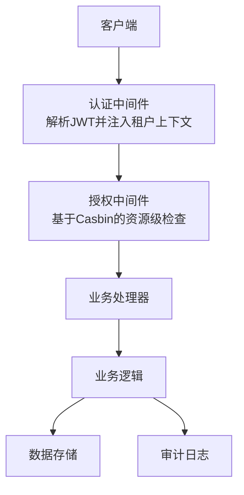
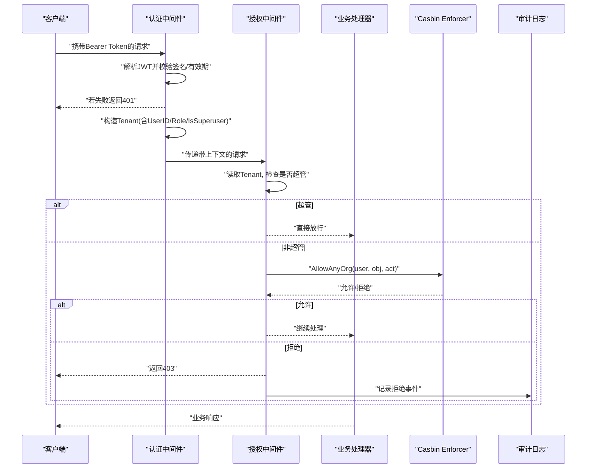
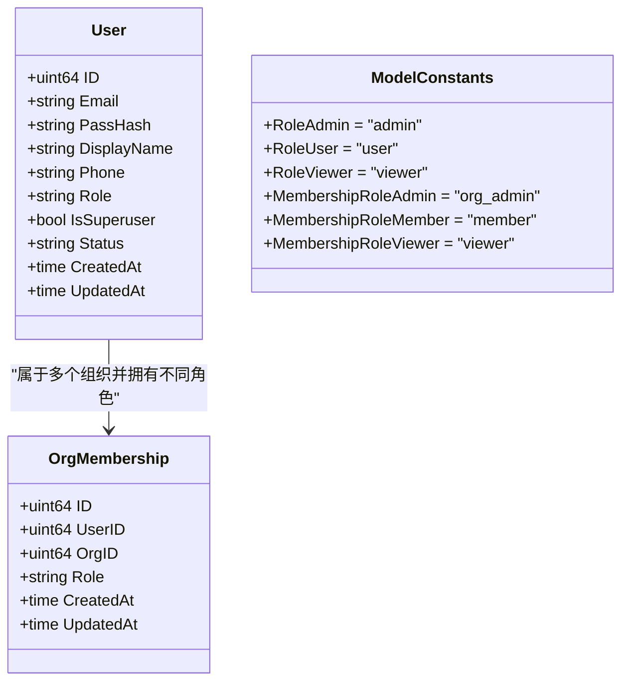
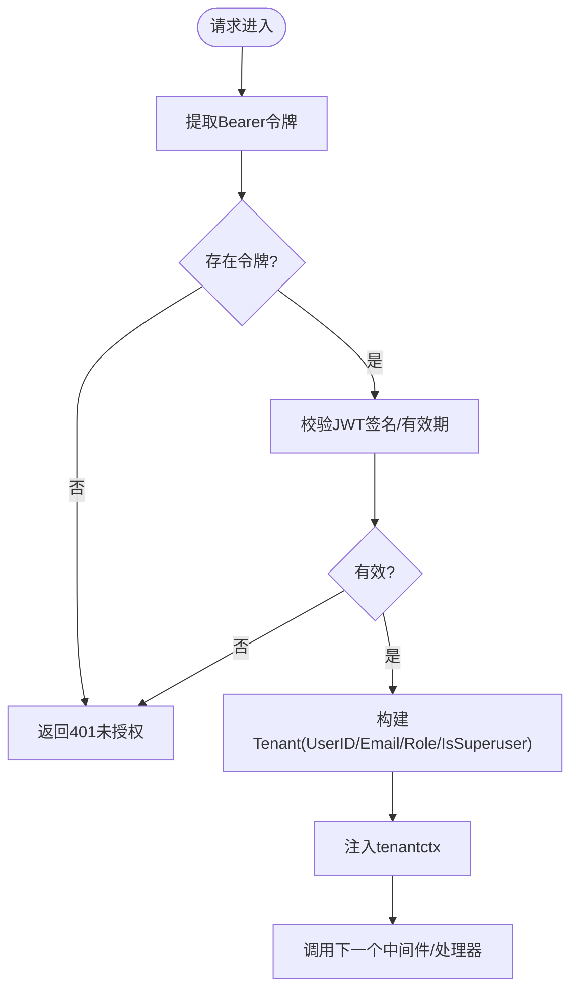
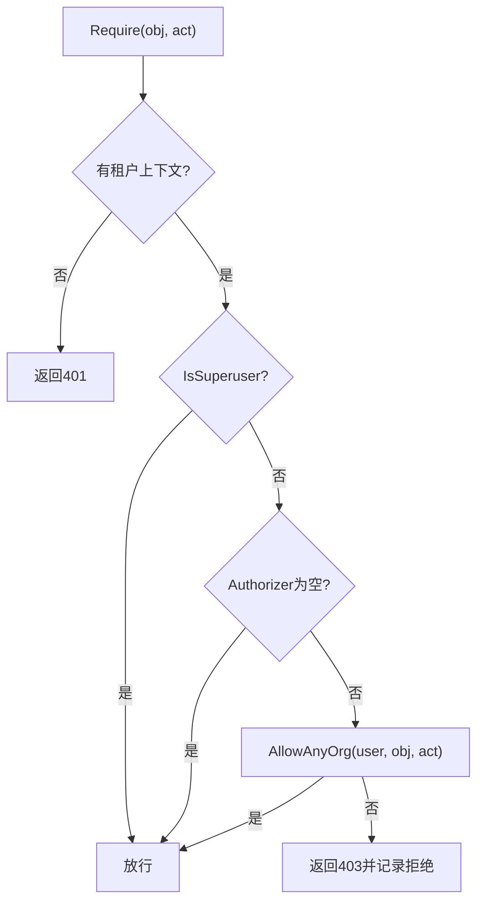
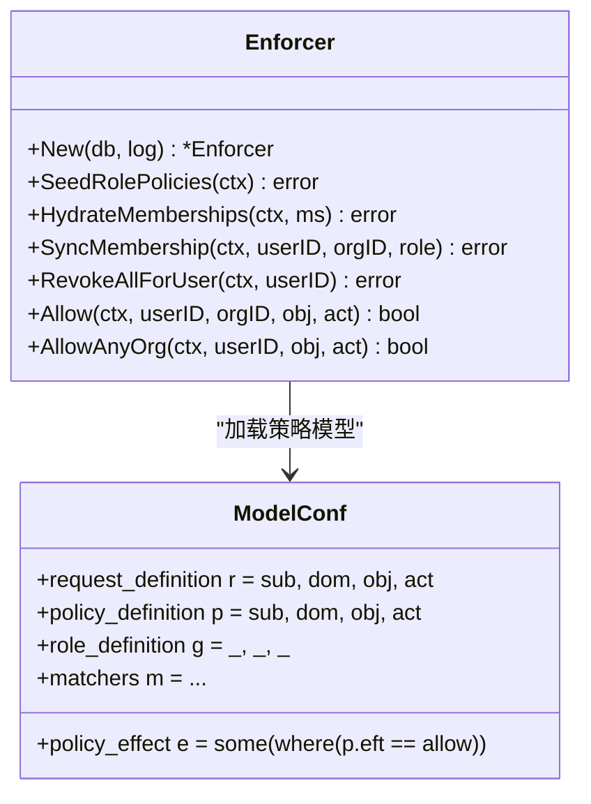
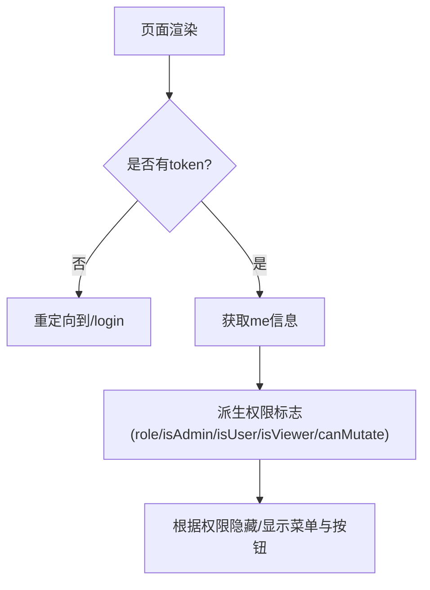
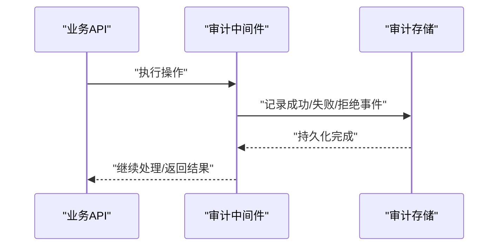
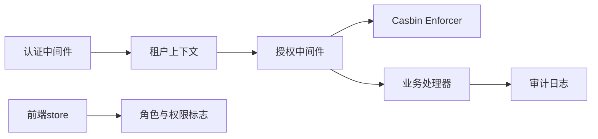

# 角色权限控制

<cite>
**本文引用的文件**
- [internal/iam/model/model.go](file://internal/iam/model/model.go)
- [internal/pkg/auth/middleware.go](file://internal/pkg/auth/middleware.go)
- [internal/pkg/auth/jwt.go](file://internal/pkg/auth/jwt.go)
- [internal/pkg/authzmw/middleware.go](file://internal/pkg/authzmw/middleware.go)
- [internal/iam/biz/authz/authz.go](file://internal/iam/biz/authz/authz.go)
- [internal/iam/biz/authz/model.conf](file://internal/iam/biz/authz/model.conf)
- [internal/manager/server/knowledge/http.go](file://internal/manager/server/knowledge/http.go)
- [web/src/store/me.ts](file://web/src/store/me.ts)
- [web/src/App.tsx](file://web/src/App.tsx)
- [internal/manager/model/audit/log.go](file://internal/manager/model/audit/log.go)
- [internal/manager/biz/audit/usecase.go](file://internal/manager/biz/audit/usecase.go)
- [cmd/ongrid/main.go](file://cmd/ongrid/main.go)
</cite>

## 目录
1. [简介](#简介)
2. [项目结构](#项目结构)
3. [核心组件](#核心组件)
4. [架构总览](#架构总览)
5. [详细组件分析](#详细组件分析)
6. [依赖关系分析](#依赖关系分析)
7. [性能考量](#性能考量)
8. [故障排查指南](#故障排查指南)
9. [结论](#结论)
10. [附录](#附录)

## 简介
本技术文档聚焦于系统的角色与权限控制实现，覆盖以下要点：
- 系统角色模型（admin、user、viewer）的设计与数据定义
- 基于角色的访问控制（RBAC）机制：JWT 鉴权、Casbin 授权、中间件链
- 不同角色的功能权限差异与资源级控制
- 前端路由保护与权限展示
- 权限继承、资源级权限控制与审计日志记录的最佳实践

## 项目结构
权限相关代码主要分布在以下层次：
- 身份与认证层：JWT 签发与校验、请求上下文注入
- 授权层：Casbin 策略引擎、组织成员映射同步
- 服务层：各业务模块通过中间件进行资源级权限拦截
- 前端层：基于用户角色的路由保护与 UI 能力开关
- 审计层：关键操作与失败/拒绝事件记录

**图表来源**
- [internal/pkg/auth/middleware.go:10-53](file://internal/pkg/auth/middleware.go#L10-L53)
- [internal/pkg/authzmw/middleware.go:57-97](file://internal/pkg/authzmw/middleware.go#L57-L97)
- [internal/iam/biz/authz/authz.go:233-271](file://internal/iam/biz/authz/authz.go#L233-L271)

**章节来源**
- [internal/pkg/auth/middleware.go:10-53](file://internal/pkg/auth/middleware.go#L10-L53)
- [internal/pkg/authzmw/middleware.go:57-97](file://internal/pkg/authzmw/middleware.go#L57-L97)
- [internal/iam/biz/authz/authz.go:233-271](file://internal/iam/biz/authz/authz.go#L233-L271)

## 核心组件
- 系统角色模型：定义 admin、user、viewer 三种系统角色及成员角色（org_admin、member、viewer），并提供合法性校验与可写能力判断。
- JWT 鉴权：从请求头或查询参数提取令牌，验证签名与有效期，将用户标识、角色、是否超级管理员写入请求上下文。
- 授权中间件：在资源级对“对象+动作”进行授权判定；支持超管短路放行与多组织域匹配。
- Casbin 策略引擎：加载模型与规则，维护组成员关系，提供 Allow/AllowAnyOrg 等接口。
- 前端权限：根据当前用户角色派生 isUser/isViewer/isAdmin/canMutate 等标志，用于路由保护与界面能力展示。
- 审计日志：记录成功、失败、被拒绝的操作，便于安全审计与根因分析。

**章节来源**
- [internal/iam/model/model.go:23-53](file://internal/iam/model/model.go#L23-L53)
- [internal/pkg/auth/middleware.go:10-53](file://internal/pkg/auth/middleware.go#L10-L53)
- [internal/pkg/authzmw/middleware.go:57-97](file://internal/pkg/authzmw/middleware.go#L57-L97)
- [internal/iam/biz/authz/authz.go:233-271](file://internal/iam/biz/authz/authz.go#L233-L271)
- [web/src/store/me.ts:94-113](file://web/src/store/me.ts#L94-L113)
- [internal/manager/model/audit/log.go:49-76](file://internal/manager/model/audit/log.go#L49-L76)

## 架构总览
下图展示了从请求进入、认证、授权到业务处理的完整链路，以及前后端如何协同实现角色与权限控制。

**图表来源**
- [internal/pkg/auth/middleware.go:21-53](file://internal/pkg/auth/middleware.go#L21-L53)
- [internal/pkg/authzmw/middleware.go:70-97](file://internal/pkg/authzmw/middleware.go#L70-L97)
- [internal/iam/biz/authz/authz.go:249-271](file://internal/iam/biz/authz/authz.go#L249-L271)
- [internal/manager/model/audit/log.go:49-76](file://internal/manager/model/audit/log.go#L49-L76)

## 详细组件分析

### 系统角色模型与成员角色
- 系统角色常量：admin、user、viewer，分别对应平台管理、完整功能使用、只读受限。
- 成员角色常量：org_admin、member、viewer，用于组织内资源访问控制。
- 角色合法性校验与可写能力判断：避免非法角色值，统一控制 viewer 的只读限制。
- 用户模型包含 Role 与 IsSuperuser：前者用于兼容旧令牌，后者为权威的系统管理员标志。

**图表来源**
- [internal/iam/model/model.go:23-67](file://internal/iam/model/model.go#L23-L67)
- [internal/iam/model/model.go:80-101](file://internal/iam/model/model.go#L80-L101)
- [internal/iam/model/model.go:126-139](file://internal/iam/model/model.go#L126-L139)

**章节来源**
- [internal/iam/model/model.go:23-67](file://internal/iam/model/model.go#L23-L67)
- [internal/iam/model/model.go:80-101](file://internal/iam/model/model.go#L80-L101)
- [internal/iam/model/model.go:126-139](file://internal/iam/model/model.go#L126-L139)

### JWT 鉴权与上下文注入
- 令牌来源：Authorization: Bearer <token> 或 ?token=<jwt>（WebSocket 场景）。
- 校验流程：签名方法校验、过期时间校验、无效令牌返回 401。
- 上下文注入：将 UserID、Email、Role、IsSuperuser 写入 tenantctx，供后续中间件与业务使用。
- 超管兼容：旧令牌无 IsSuperuser 字段时，回退到 Role=="admin" 以维持升级后权限。

**图表来源**
- [internal/pkg/auth/middleware.go:21-53](file://internal/pkg/auth/middleware.go#L21-L53)
- [internal/pkg/auth/jwt.go:16-30](file://internal/pkg/auth/jwt.go#L16-L30)
- [internal/pkg/auth/jwt.go:81-99](file://internal/pkg/auth/jwt.go#L81-L99)

**章节来源**
- [internal/pkg/auth/middleware.go:21-53](file://internal/pkg/auth/middleware.go#L21-L53)
- [internal/pkg/auth/jwt.go:16-30](file://internal/pkg/auth/jwt.go#L16-L30)
- [internal/pkg/auth/jwt.go:81-99](file://internal/pkg/auth/jwt.go#L81-L99)

### 授权中间件与资源级权限控制
- 资源命名约定：如 edge:*、knowledge:doc、alert:rule、agent:custom、monitor:panel、org:*、user:*。
- 动作词汇：read / write / delete / manage。
- 决策流程：
  - 无租户上下文 → 401
  - 超管 → 直接放行
  - 未配置 Authorizer（兼容/测试）→ 放行
  - AllowAnyOrg 任一组织允许 → 放行
  - 否则 → 403 并记录拒绝日志
- 业务侧通过 Require(obj, act) 包装处理器，实现细粒度资源级保护。

**图表来源**
- [internal/pkg/authzmw/middleware.go:57-97](file://internal/pkg/authzmw/middleware.go#L57-L97)

**章节来源**
- [internal/pkg/authzmw/middleware.go:57-97](file://internal/pkg/authzmw/middleware.go#L57-L97)
- [internal/manager/server/knowledge/http.go:90-107](file://internal/manager/server/knowledge/http.go#L90-L107)

### Casbin 策略引擎与成员映射
- 模型定义：r = sub, dom, obj, act；p = sub, dom, obj, act；g = _, _, _。
- 匹配器：支持主体-组织域匹配、对象通配、动作匹配。
- 启动顺序：迁移数据库 → 创建策略表 → 注入角色策略 → 同步成员关系。
- 成员同步：增删改成员时，镜像到 casbin g 规则；删除用户时清理所有 g 规则。
- 授权接口：Allow(org)、AllowAnyOrg(遍历用户所属组织)。

**图表来源**
- [internal/iam/biz/authz/authz.go:46-83](file://internal/iam/biz/authz/authz.go#L46-L83)
- [internal/iam/biz/authz/authz.go:112-143](file://internal/iam/biz/authz/authz.go#L112-L143)
- [internal/iam/biz/authz/authz.go:145-168](file://internal/iam/biz/authz/authz.go#L145-L168)
- [internal/iam/biz/authz/authz.go:212-231](file://internal/iam/biz/authz/authz.go#L212-L231)
- [internal/iam/biz/authz/authz.go:233-271](file://internal/iam/biz/authz/authz.go#L233-L271)
- [internal/iam/biz/authz/model.conf:1-15](file://internal/iam/biz/authz/model.conf#L1-L15)

**章节来源**
- [internal/iam/biz/authz/authz.go:46-83](file://internal/iam/biz/authz/authz.go#L46-L83)
- [internal/iam/biz/authz/authz.go:112-143](file://internal/iam/biz/authz/authz.go#L112-L143)
- [internal/iam/biz/authz/authz.go:145-168](file://internal/iam/biz/authz/authz.go#L145-L168)
- [internal/iam/biz/authz/authz.go:212-231](file://internal/iam/biz/authz/authz.go#L212-L231)
- [internal/iam/biz/authz/authz.go:233-271](file://internal/iam/biz/authz/authz.go#L233-L271)
- [internal/iam/biz/authz/model.conf:1-15](file://internal/iam/biz/authz/model.conf#L1-L15)

### 前端路由保护与权限展示
- 路由保护：未登录重定向至登录页；已登录访问公共页面时重定向首页。
- 权限派生：usePermissions 根据 me.role 派生 isAdmin、isUser、isViewer、canMutate，用于菜单显示与按钮禁用。
- 首次渲染优化：优先使用本地存储的 role，避免等待 /v1/me 导致的闪烁。

**图表来源**
- [web/src/App.tsx:71-84](file://web/src/App.tsx#L71-L84)
- [web/src/store/me.ts:94-113](file://web/src/store/me.ts#L94-L113)

**章节来源**
- [web/src/App.tsx:71-84](file://web/src/App.tsx#L71-L84)
- [web/src/store/me.ts:94-113](file://web/src/store/me.ts#L94-L113)

### 审计日志记录最佳实践
- 记录范围：成功、失败、被拒绝三类状态；保留用户邮箱、IP、UA、资源类型、动作、错误码与消息。
- 登录失败：记录 auth_login_failed，便于检测暴力破解模式。
- 变更回溯：提供 ListChanges 接口，按时间窗口与资源/动作过滤，辅助 RCA 工具定位变更事件。
- 前端可见性：审计日志列表仅管理员可访问，API 强制 403 非管理员。

**图表来源**
- [internal/manager/model/audit/log.go:49-76](file://internal/manager/model/audit/log.go#L49-L76)
- [internal/manager/biz/audit/usecase.go:118-147](file://internal/manager/biz/audit/usecase.go#L118-L147)

**章节来源**
- [internal/manager/model/audit/log.go:49-76](file://internal/manager/model/audit/log.go#L49-L76)
- [internal/manager/biz/audit/usecase.go:118-147](file://internal/manager/biz/audit/usecase.go#L118-L147)

## 依赖关系分析
- 认证中间件依赖 JWT 校验器，并将 Tenant 注入上下文。
- 授权中间件依赖 Casbin Enforcer，读取上下文中的用户与组织信息，进行资源级授权。
- 业务处理器通过 Require(obj, act) 组合中间件，实现细粒度保护。
- 前端 store 依赖后端返回的 role，派生权限标志，驱动路由与 UI。
- 审计模块依赖业务层的事件触发，记录操作结果。

**图表来源**
- [internal/pkg/auth/middleware.go:21-53](file://internal/pkg/auth/middleware.go#L21-L53)
- [internal/pkg/authzmw/middleware.go:57-97](file://internal/pkg/authzmw/middleware.go#L57-L97)
- [internal/iam/biz/authz/authz.go:233-271](file://internal/iam/biz/authz/authz.go#L233-L271)
- [web/src/store/me.ts:94-113](file://web/src/store/me.ts#L94-L113)

**章节来源**
- [internal/pkg/auth/middleware.go:21-53](file://internal/pkg/auth/middleware.go#L21-L53)
- [internal/pkg/authzmw/middleware.go:57-97](file://internal/pkg/authzmw/middleware.go#L57-L97)
- [internal/iam/biz/authz/authz.go:233-271](file://internal/iam/biz/authz/authz.go#L233-L271)
- [web/src/store/me.ts:94-113](file://web/src/store/me.ts#L94-L113)

## 性能考量
- 授权中间件对超管进行短路放行，避免不必要的策略查询。
- AllowAnyOrg 遍历用户所属组织，但组织数量通常较小，开销可控。
- Casbin 策略表采用 GORM 适配器，批量同步成员关系时重复插入代价低，适合中小规模部署。
- 前端权限派生在内存中计算，减少网络往返与渲染抖动。

[本节为通用性能讨论，不直接分析具体文件]

## 故障排查指南
- 401 未授权：检查 Authorization 头或查询参数是否携带有效 JWT；确认签名方法与密钥一致；确认令牌未过期。
- 403 禁止访问：确认用户是否具备所需资源的 read/write/delete/manage 权限；检查组织成员映射是否正确同步；查看授权中间件拒绝日志。
- 前端菜单不显示：确认 usePermissions 派生的角色标志是否正确；检查登录响应中的 role 是否已正确存储。
- 审计日志缺失：确认业务层是否触发审计事件；检查审计中间件是否安装；确认存储层是否正常写入。

**章节来源**
- [internal/pkg/auth/middleware.go:21-53](file://internal/pkg/auth/middleware.go#L21-L53)
- [internal/pkg/authzmw/middleware.go:70-97](file://internal/pkg/authzmw/middleware.go#L70-L97)
- [web/src/store/me.ts:94-113](file://web/src/store/me.ts#L94-L113)
- [internal/manager/model/audit/log.go:49-76](file://internal/manager/model/audit/log.go#L49-L76)

## 结论
本系统通过 JWT 鉴权与 Casbin 授权中间件实现了严格的 RBAC 控制，结合前端路由保护与审计日志，形成了端到端的权限治理体系。角色模型清晰、资源级控制灵活、超管短路保障系统可运维性。建议在生产环境中：
- 严格管理组织成员映射，确保策略与真实权限一致
- 定期审查审计日志，关注失败与被拒绝事件
- 在前端增加更细粒度的能力开关，配合后端授权形成双重防护

[本节为总结性内容，不直接分析具体文件]

## 附录

### 角色与权限矩阵（概念说明）
- admin：平台管理与用户/组织管理；可绕过授权中间件（超管短路）
- user：可使用全部功能（包括聊天工具集与 ClassMutating 技能），不可修改平台配置与管理用户
- viewer：只读权限，聊天工具集过滤为 ClassSafe，无法执行写操作

[本节为概念性说明，不直接分析具体文件]

### 路由注册与中间件装配
- 主入口将各业务处理器注册到受保护的路由器，统一应用认证与授权中间件链。

**章节来源**
- [cmd/ongrid/main.go:2612-2646](file://cmd/ongrid/main.go#L2612-L2646)