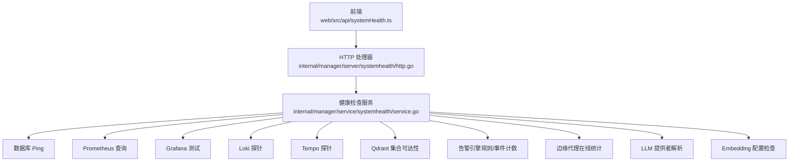
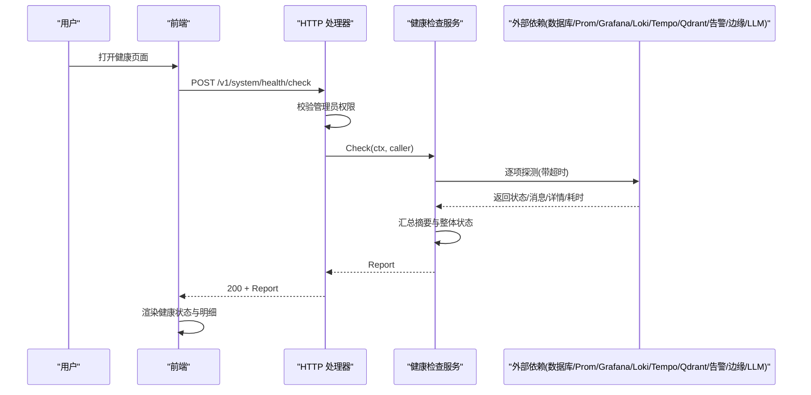
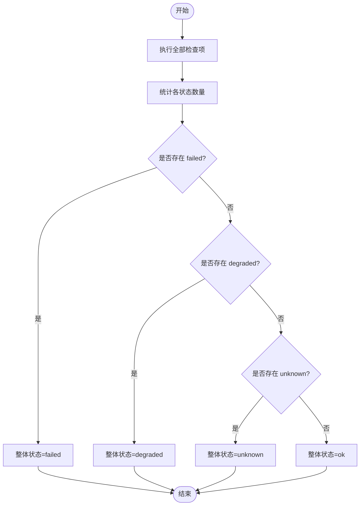
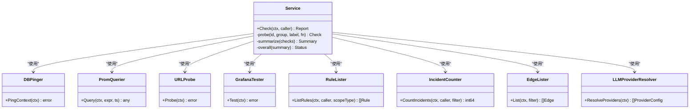
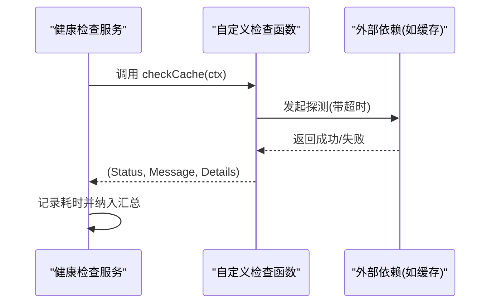

# 系统健康检查

<cite>
**本文引用的文件**
- [service.go](file://internal/manager/service/systemhealth/service.go)
- [http.go](file://internal/manager/server/systemhealth/http.go)
- [systemHealth.ts](file://web/src/api/systemHealth.ts)
- [config.go](file://internal/pkg/config/config.go)
- [service.go](file://internal/manager/biz/grafana/service.go)
</cite>

## 目录
1. [简介](#简介)
2. [项目结构](#项目结构)
3. [核心组件](#核心组件)
4. [架构总览](#架构总览)
5. [详细组件分析](#详细组件分析)
6. [依赖关系分析](#依赖关系分析)
7. [性能与可观测性](#性能与可观测性)
8. [故障排查指南](#故障排查指南)
9. [结论](#结论)
10. [附录：扩展新检查项的开发示例](#附录：扩展新检查项的开发示例)

## 简介
本模块提供平台级“系统健康检查”能力，面向管理端 UI 暴露统一的健康报告接口。其职责包括：
- 对核心组件（数据库、Prometheus、Grafana、Loki、Tempo、Qdrant、Frontier、告警引擎、边缘代理、LLM/Embedding）进行连接性与可用性探测。
- 将各检查项的状态聚合为整体健康状态，并附带耗时、分组、标签与详细信息。
- 通过 HTTP API 暴露查询与触发入口，前端轮询或按需调用以展示实时健康视图。
- 结合配置开关控制可选能力的探测范围，避免未启用功能造成误报。

该模块不直接采集业务指标，而是聚焦“服务连通性/就绪性”的自检，配合监控面板与告警体系形成完整的可观测闭环。

## 项目结构
健康检查由三层构成：
- HTTP 层：注册路由，鉴权后委托服务层执行检查。
- 服务层：编排各项检查，汇总结果并生成报告。
- 前端层：定义类型并调用后端接口，渲染健康状态。

图表来源
- [http.go:30-33](file://internal/manager/server/systemhealth/http.go#L30-L33)
- [service.go:132-154](file://internal/manager/service/systemhealth/service.go#L132-L154)
- [systemHealth.ts:29-31](file://web/src/api/systemHealth.ts#L29-L31)

章节来源
- [http.go:30-33](file://internal/manager/server/systemhealth/http.go#L30-L33)
- [service.go:132-154](file://internal/manager/service/systemhealth/service.go#L132-L154)
- [systemHealth.ts:29-31](file://web/src/api/systemHealth.ts#L29-L31)

## 核心组件
- 健康检查服务（Service）
  - 负责组装所有检查项，统一超时控制、耗时统计、状态聚合与总体健康判定。
  - 支持按配置开关跳过未启用的子系统（如 Prometheus/Loki/Tempo）。
- HTTP 处理器（Handler）
  - 暴露 GET/POST 两个路径用于健康检查；强制管理员权限；错误映射为标准错误体。
- 前端 API 客户端
  - 定义健康报告的数据模型，封装 POST /system/health/check 调用。

关键数据结构
- Check：单个检查项（id、group、label、status、message、details、duration_ms）。
- Summary：按状态计数（ok/degraded/failed/unknown）。
- Report：整体健康状态、检查时间、摘要与明细列表。

章节来源
- [service.go:28-50](file://internal/manager/service/systemhealth/service.go#L28-L50)
- [http.go:18-33](file://internal/manager/server/systemhealth/http.go#L18-L33)
- [systemHealth.ts:3-31](file://web/src/api/systemHealth.ts#L3-L31)

## 架构总览
健康检查请求从前端发起，经 HTTP 层鉴权后进入服务层，服务层并行/顺序执行多项子检查，最终汇总为报告返回。

图表来源
- [http.go:35-50](file://internal/manager/server/systemhealth/http.go#L35-L50)
- [service.go:132-154](file://internal/manager/service/systemhealth/service.go#L132-L154)
- [service.go:388-412](file://internal/manager/service/systemhealth/service.go#L388-L412)

## 详细组件分析

### HTTP 处理器
- 路由注册：GET/POST 均指向同一处理函数，便于浏览器直访与脚本触发。
- 鉴权：从上下文提取租户信息，仅允许 admin 角色访问。
- 错误处理：将内部错误映射为标准化 JSON 响应（含 code 与 error 字段），区分未授权、禁止、无效、未找到、上游错误等。

章节来源
- [http.go:30-33](file://internal/manager/server/systemhealth/http.go#L30-L33)
- [http.go:52-63](file://internal/manager/server/systemhealth/http.go#L52-L63)
- [http.go:79-95](file://internal/manager/server/systemhealth/http.go#L79-L95)

### 健康检查服务
- 检查清单
  - Manager API：自身可达性。
  - Database：Ping 数据库连接池。
  - Prometheus：查询 up 指标，若未启用或未接线则降级为 degraded。
  - Grafana：调用 Test，区分“未配置”和“失败”。
  - Loki/Tempo：根据配置开关探测就绪性。
  - Qdrant：构造集合 URL 并发起 HTTP 探测，记录集合名。
  - Frontier：仅标记是否启用，边缘在线状态单独评估。
  - 告警引擎：读取规则数、开启数、开放事件数，并结合评估间隔与冷却期输出详情。
  - 边缘代理：采样最多 1000 条，统计在线/离线数量，全离线为 failed。
  - LLM/Embedding：检查提供者解析与配置是否就绪。
- 通用探针 probe
  - 统一注入 context 超时，捕获超时并将 OK 降级为 failed。
  - 记录每项耗时（毫秒）、分组、标签、消息与详情。
- 汇总与总体状态
  - 统计各状态数量，按优先级判定整体状态：failed > degraded > unknown > ok。

图表来源
- [service.go:414-442](file://internal/manager/service/systemhealth/service.go#L414-L442)

章节来源
- [service.go:132-154](file://internal/manager/service/systemhealth/service.go#L132-L154)
- [service.go:156-386](file://internal/manager/service/systemhealth/service.go#L156-L386)
- [service.go:388-412](file://internal/manager/service/systemhealth/service.go#L388-L412)
- [service.go:414-442](file://internal/manager/service/systemhealth/service.go#L414-L442)

### 前端 API 与数据模型
- 类型定义：HealthStatus、HealthCheck、HealthSummary、HealthReport。
- 调用方式：POST /system/health/check，返回完整报告供 UI 渲染。

章节来源
- [systemHealth.ts:3-31](file://web/src/api/systemHealth.ts#L3-L31)

### 配置与开关
- 探针超时：默认 3 秒，可通过配置覆盖。
- 功能开关：Prometheus/Loki/Tempo/Alert/Frontier/LLM/Embedding 等均可通过配置启用或禁用，未启用时对应检查返回 degraded 而非 failed，避免误报。
- 相关全局配置（如日志/追踪 URL、通知冷却、评估间隔等）在运行时加载，影响健康检查行为与告警联动。

章节来源
- [service.go:97-130](file://internal/manager/service/systemhealth/service.go#L97-L130)
- [config.go:214-252](file://internal/pkg/config/config.go#L214-L252)
- [config.go:417-549](file://internal/pkg/config/config.go#L417-L549)

## 依赖关系分析
健康检查服务通过接口抽象依赖外部子系统，降低耦合度：
- DBPinger：数据库 Ping。
- PromQuerier：Prometheus 查询。
- URLProbe：通用 HTTP 探针（Loki/Tempo）。
- GrafanaTester：Grafana 集成测试。
- RuleLister/IncidentCounter：告警规则与事件计数。
- EdgeLister：边缘代理列表。
- LLMProviderResolver：LLM 提供者解析。
- http.Client：Qdrant 集合可达性探测。

图表来源
- [service.go:52-95](file://internal/manager/service/systemhealth/service.go#L52-L95)

章节来源
- [service.go:52-95](file://internal/manager/service/systemhealth/service.go#L52-L95)

## 性能与可观测性
- 探针超时：每个检查项受统一超时保护，避免阻塞整体健康报告。
- 耗时统计：每项检查记录 duration_ms，便于定位慢依赖。
- 降级策略：未启用或未接线的依赖返回 degraded，减少误报。
- 告警联动：告警引擎检查包含评估间隔与冷却期，避免频繁告警风暴。
- 可视化：Grafana 集成用于仪表盘同步与展示；Prometheus 作为指标源；Loki/Tempo 用于日志/链路追踪。

章节来源
- [service.go:388-412](file://internal/manager/service/systemhealth/service.go#L388-L412)
- [service.go:275-313](file://internal/manager/service/systemhealth/service.go#L275-L313)
- [service.go:178-235](file://internal/manager/service/systemhealth/service.go#L178-L235)
- [service.go:190-212](file://internal/manager/service/systemhealth/service.go#L190-L212)

## 故障排查指南
- 无法访问健康接口
  - 确认已使用管理员身份登录；检查鉴权逻辑与租户上下文。
  - 参考错误码：unauthorized/forbidden/upstream 等。
- 某依赖显示 degraded
  - 检查对应功能开关是否启用（Prom/Loki/Tempo/Alert/Frontier/LLM/Embedding）。
  - 核对配置项（URL、Token、TLS 设置等）。
- 某依赖显示 failed
  - 查看 message 与 details 中的具体错误信息。
  - 针对数据库/Prometheus/Grafana/Loki/Tempo/Qdrant 分别验证连通性与认证。
- 边缘代理全部离线
  - 检查边缘代理上报与心跳；确认 edge 列表拉取成功。
- 告警引擎异常
  - 检查规则是否加载、是否有开放事件；关注评估间隔与冷却期配置。

章节来源
- [http.go:52-63](file://internal/manager/server/systemhealth/http.go#L52-L63)
- [http.go:79-95](file://internal/manager/server/systemhealth/http.go#L79-L95)
- [service.go:166-386](file://internal/manager/service/systemhealth/service.go#L166-L386)

## 结论
系统健康检查模块以统一的探针框架聚合多类依赖的健康状态，通过配置化开关与降级策略确保报告准确可靠，并通过 HTTP API 向管理端提供实时健康视图。结合 Prometheus/Grafana/Loki/Tempo 等可观测性组件，形成从“连通性自检”到“指标/日志/链路追踪”的完整闭环。

## 附录：扩展新检查项的开发示例
目标：新增一项自定义健康检查（例如：缓存服务可达性），并在报告中体现。

步骤概览
- 在服务中实现新的 checkXxx 方法，遵循现有模式：
  - 使用 probe 包装，传入 id/group/label 与一个返回 (Status, Message, Details) 的函数。
  - 在函数内完成实际探测（如 HTTP 请求、RPC 调用、资源查询）。
  - 根据结果返回 ok/degraded/failed，并附带 details。
- 在 Check 方法中将新检查加入 checks 列表，参与汇总与总体状态判定。
- 如需配置开关，读取 Config 中相应字段，未启用时返回 degraded。
- 前端无需改动即可自动展示新检查项（基于统一 Report 结构）。

图表来源
- [service.go:388-412](file://internal/manager/service/systemhealth/service.go#L388-L412)
- [service.go:132-154](file://internal/manager/service/systemhealth/service.go#L132-L154)

最佳实践
- 保持检查幂等且快速，避免长耗时影响整体健康报告。
- 合理设置超时与重试策略，避免雪崩。
- 对未启用或未接线的依赖返回 degraded，避免误报。
- 在 details 中保留关键上下文（如 URL、集合名、计数等），便于诊断。
- 与告警系统联动时，注意评估间隔与冷却期，防止告警风暴。

章节来源
- [service.go:132-154](file://internal/manager/service/systemhealth/service.go#L132-L154)
- [service.go:388-412](file://internal/manager/service/systemhealth/service.go#L388-L412)
- [service.go:275-313](file://internal/manager/service/systemhealth/service.go#L275-L313)