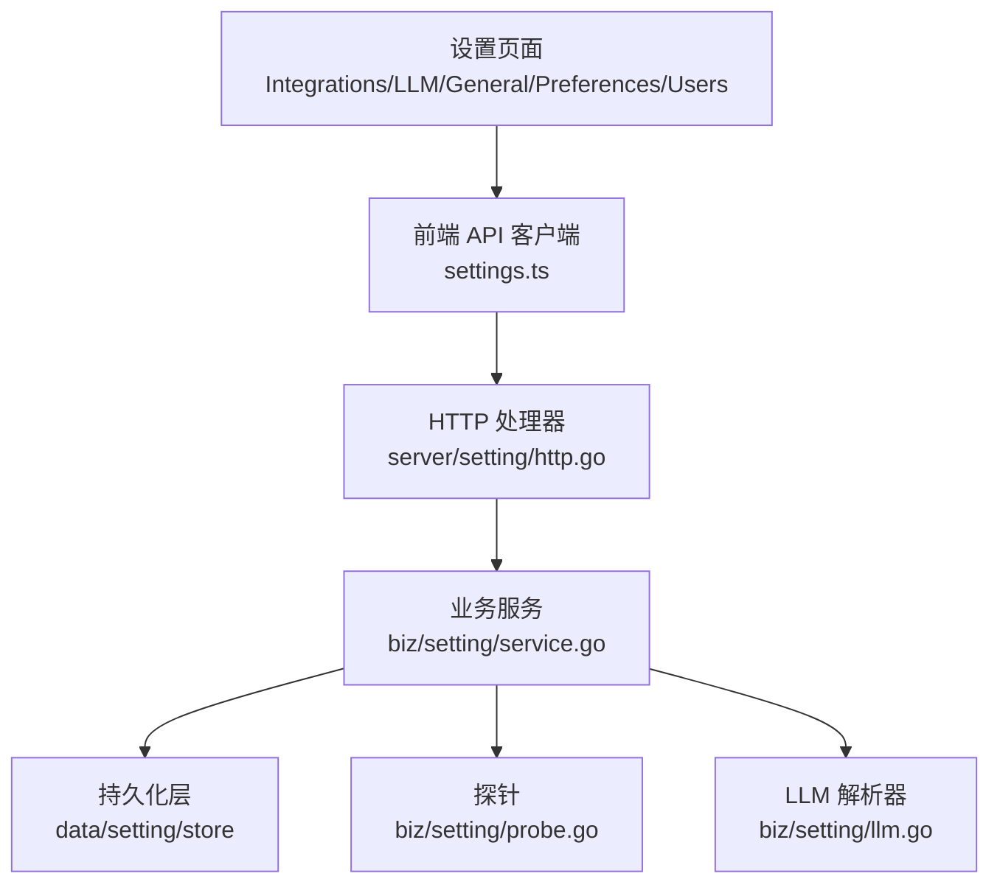
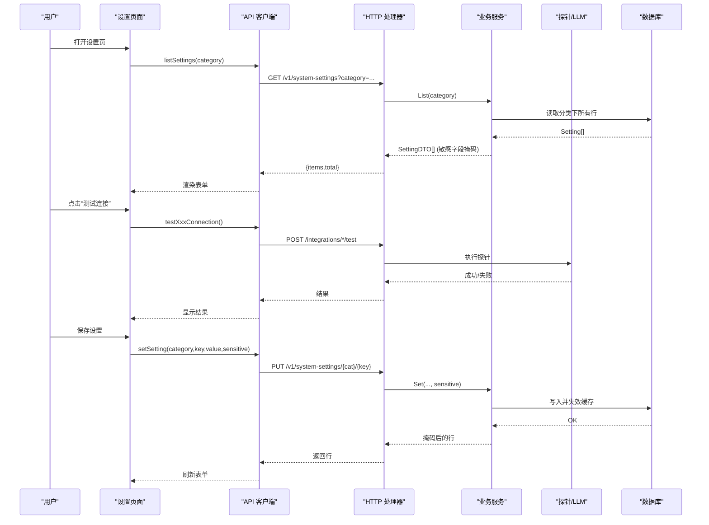
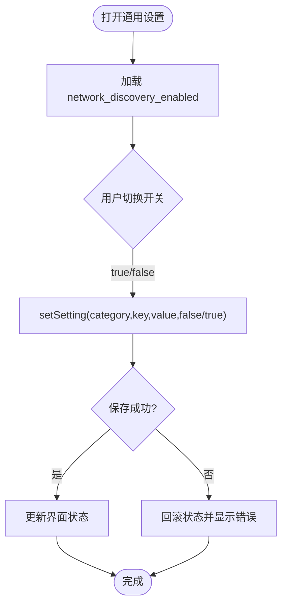
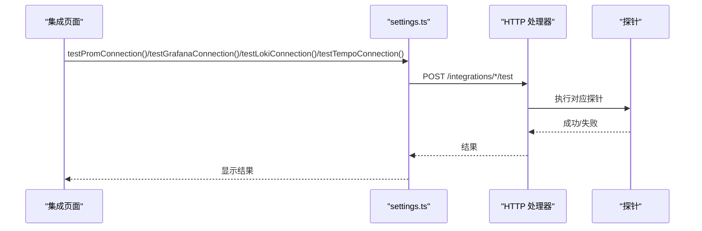
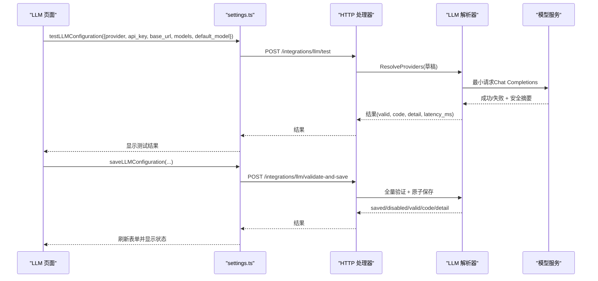
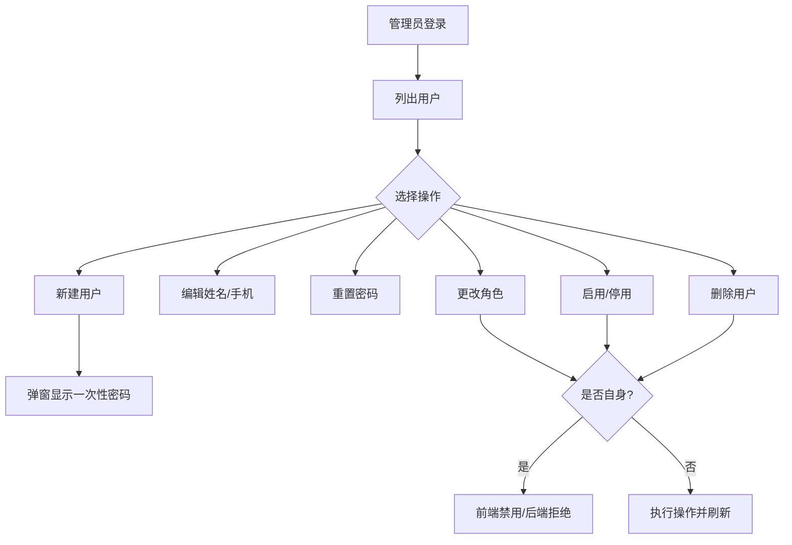
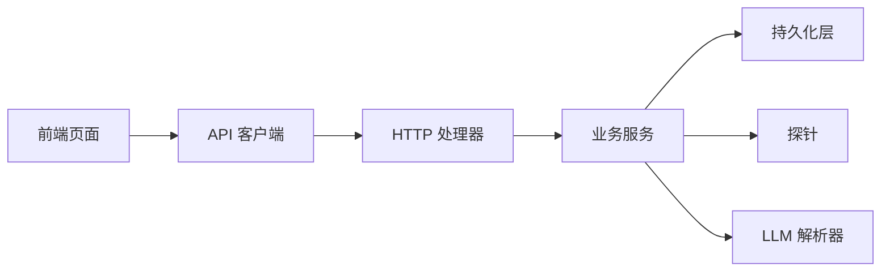

# 设置页面

<cite>
**本文引用的文件**
- [setting.proto](file://api/manager/setting/v1/setting.proto)
- [service.go](file://internal/manager/biz/setting/service.go)
- [llm.go](file://internal/manager/biz/setting/llm.go)
- [probe.go](file://internal/manager/biz/setting/probe.go)
- [http.go](file://internal/manager/server/setting/http.go)
- [settings.ts](file://web/src/api/settings.ts)
- [Integrations.tsx](file://web/src/pages/settings/Integrations.tsx)
- [LLM.tsx](file://web/src/pages/settings/LLM.tsx)
- [General.tsx](file://web/src/pages/settings/General.tsx)
- [Preferences.tsx](file://web/src/pages/settings/Preferences.tsx)
- [Users.tsx](file://web/src/pages/settings/Users.tsx)
</cite>

## 目录
1. [简介](#简介)
2. [项目结构](#项目结构)
3. [核心组件](#核心组件)
4. [架构总览](#架构总览)
5. [详细组件分析](#详细组件分析)
6. [依赖关系分析](#依赖关系分析)
7. [性能考虑](#性能考虑)
8. [故障排查指南](#故障排查指南)
9. [结论](#结论)
10. [附录：开发示例与最佳实践](#附录：开发示例与最佳实践)

## 简介
本技术文档围绕“设置页面”展开，系统性说明系统配置管理的前后端实现、验证机制、热更新支持、备份恢复策略、权限控制以及用户体验优化。覆盖通用设置、第三方集成（Prometheus/Grafana/Loki/Tempo/WebSearch）、AI 模型（多提供商 LLM）和用户权限管理。同时提供添加新设置项和校验逻辑的开发指引与安全、体验最佳实践。

## 项目结构
设置能力由前端页面、API 客户端、后端 HTTP 处理器、业务服务与探针组成，形成清晰的分层：
- 前端页面：通用设置、集成、LLM、偏好、用户管理等页面，负责表单、校验、测试连接与保存。
- API 客户端：封装 /v1/system-settings 及集成探测接口，统一错误处理与类型定义。
- 后端 HTTP：暴露系统设置 CRUD 与 reveal 接口，鉴权与审计。
- 业务服务：内存缓存、敏感字段掩码、批量写入、默认值注入等。
- 探针：对 Loki/Tempo/WebSearch 进行可达性探测；LLM 通过专用协议进行最小请求验证。

**图表来源**
- [http.go:45-50](file://internal/manager/server/setting/http.go#L45-L50)
- [service.go:49-70](file://internal/manager/biz/setting/service.go#L49-L70)
- [probe.go:17-35](file://internal/manager/biz/setting/probe.go#L17-L35)
- [llm.go:12-23](file://internal/manager/biz/setting/llm.go#L12-L23)

**章节来源**
- [http.go:45-50](file://internal/manager/server/setting/http.go#L45-L50)
- [service.go:49-70](file://internal/manager/biz/setting/service.go#L49-L70)

## 核心组件
- 系统设置服务（Setting Service）
  - 提供 Get/Set/List/Delete/SetBatch/SetIfAbsent 等方法，维护进程内缓存，敏感字段列表返回时自动掩码。
  - 支持按分类（category/key）读取与写入，支持原子批量写入（如 LLM 多键组合）。
- HTTP 处理器（System Settings Handler）
  - 暴露 GET/PUT/DELETE /v1/system-settings/{category}/{key} 与 /reveal。
  - 写操作要求 admin 角色，读操作允许已认证用户；敏感字段列表返回时掩码，仅 reveal 可获取明文。
- LLM 设置解析器（LLM Settings Resolver）
  - 将 system_settings.llm.* 映射为多提供商路由配置，支持环境变量默认值、DB 覆盖、空 key 显式禁用。
  - 维护模型列表去重、默认模型优先级、兼容旧单模型键。
- 探针（Probe）
  - Loki/Tempo/WebSearch 的连通性探测，使用短超时与最小请求，便于“测试连接”快速反馈。
- 前端设置页面
  - Integrations：Prometheus/Grafana/Loki/Tempo/WebSearch 配置、测试连接、同步数据源。
  - LLM：多提供商配置、模型列表、默认模型、在线测试与保存。
  - General：平台级开关（如网络发现）。
  - Preferences：语言、主题、强调色等本地偏好。
  - Users：管理员用户管理（创建、编辑、重置密码、角色、状态、删除）。

**章节来源**
- [service.go:108-165](file://internal/manager/biz/setting/service.go#L108-L165)
- [http.go:81-137](file://internal/manager/server/setting/http.go#L81-L137)
- [llm.go:126-224](file://internal/manager/biz/setting/llm.go#L126-L224)
- [probe.go:17-35](file://internal/manager/biz/setting/probe.go#L17-L35)
- [Integrations.tsx:129-323](file://web/src/pages/settings/Integrations.tsx#L129-L323)
- [LLM.tsx:189-218](file://web/src/pages/settings/LLM.tsx#L189-L218)
- [General.tsx:16-53](file://web/src/pages/settings/General.tsx#L16-L53)
- [Preferences.tsx:13-17](file://web/src/pages/settings/Preferences.tsx#L13-L17)
- [Users.tsx:44-77](file://web/src/pages/settings/Users.tsx#L44-L77)

## 架构总览
设置页面的端到端流程包括：
- 读取设置：前端调用 listSettings，后端 List 返回掩码后的 DTO，敏感字段需通过 reveal 获取明文。
- 写入设置：前端 setSetting 提交 value 与 sensitive 标记，后端 Set 更新并失效缓存，审计记录包含值提示。
- 测试连接：前端触发测试，后端执行对应探针（PromQL up、Grafana test、Loki/Tempo ready、WebSearch 查询），返回结果。
- LLM 配置：前端 test/save 调用专用接口，后端对草稿进行最小请求验证，全部通过后原子保存，空 key 表示禁用。

**图表来源**
- [settings.ts:19-54](file://web/src/api/settings.ts#L19-L54)
- [http.go:67-137](file://internal/manager/server/setting/http.go#L67-L137)
- [service.go:108-165](file://internal/manager/biz/setting/service.go#L108-L165)
- [probe.go:37-81](file://internal/manager/biz/setting/probe.go#L37-L81)

**章节来源**
- [settings.ts:19-54](file://web/src/api/settings.ts#L19-L54)
- [http.go:67-137](file://internal/manager/server/setting/http.go#L67-L137)
- [service.go:108-165](file://internal/manager/biz/setting/service.go#L108-L165)
- [probe.go:37-81](file://internal/manager/biz/setting/probe.go#L37-L81)

## 详细组件分析

### 通用设置（General）
- 功能：平台级开关，例如“网络发现”。默认开启，显式 false 才关闭，保证采集不静默失败。
- 交互：加载当前值，切换开关即时尝试保存，失败回滚并展示错误。
- 影响范围：影响 Edge 上报的网络发现数据处理。

**图表来源**
- [General.tsx:23-53](file://web/src/pages/settings/General.tsx#L23-L53)
- [service.go:184-203](file://internal/manager/biz/setting/service.go#L184-L203)

**章节来源**
- [General.tsx:23-53](file://web/src/pages/settings/General.tsx#L23-L53)
- [service.go:184-203](file://internal/manager/biz/setting/service.go#L184-L203)

### 第三方集成（Integrations）
- Prometheus：配置 Query/Remote Write URL、Bearer/Basic 鉴权；支持“测试连接”（PromQL up 探针）。
- Grafana：配置 root_url、sa_token/api_key、org_id；支持“测试连接”、“同步数据源与仪表盘”、“跳转测试”。
- Loki/Tempo：配置 URL 与鉴权；支持“测试连接”（ready 或 OTLP 路径探测）。
- WebSearch：选择后端（Searxng/Tavily/Brave），支持“测试连接”返回样本标题。

**图表来源**
- [settings.ts:66-111](file://web/src/api/settings.ts#L66-L111)
- [probe.go:37-81](file://internal/manager/biz/setting/probe.go#L37-L81)

**章节来源**
- [Integrations.tsx:129-323](file://web/src/pages/settings/Integrations.tsx#L129-L323)
- [settings.ts:66-111](file://web/src/api/settings.ts#L66-L111)
- [probe.go:37-81](file://internal/manager/biz/setting/probe.go#L37-L81)

### AI 模型设置（LLM）
- 多提供商：OpenAI、Anthropic、Gemini、智谱 GLM、DeepSeek、Kimi、自定义（OpenAI 兼容）。
- 配置项：API Key、Base URL、模型列表、默认模型；空 API Key 表示显式禁用该提供商。
- 验证：testLLMConfiguration 对草稿中的每个模型发起最小请求，返回稳定错误码与详情；saveLLMConfiguration 在全部通过后原子保存。
- 生效：保存后使 Manager 缓存失效，通常 1 秒内生效；未保存则等待 TTL（约 60 秒）。

**图表来源**
- [LLM.tsx:335-419](file://web/src/pages/settings/LLM.tsx#L335-L419)
- [settings.ts:141-156](file://web/src/api/settings.ts#L141-L156)
- [llm.go:126-224](file://internal/manager/biz/setting/llm.go#L126-L224)
- [setting.proto:7-17](file://api/manager/setting/v1/setting.proto#L7-L17)

**章节来源**
- [LLM.tsx:335-419](file://web/src/pages/settings/LLM.tsx#L335-L419)
- [settings.ts:141-156](file://web/src/api/settings.ts#L141-L156)
- [llm.go:126-224](file://internal/manager/biz/setting/llm.go#L126-L224)
- [setting.proto:7-17](file://api/manager/setting/v1/setting.proto#L7-L17)

### 用户权限管理（Users）
- 功能：管理员可见的用户管理，包括创建、编辑、重置密码、角色变更、启用/停用、删除。
- 安全：禁止对自身执行危险操作（改角色、停用、删除），前后端双重保护。
- 交互：创建成功后弹窗显示一次性密码，便于安全渠道转交。

**图表来源**
- [Users.tsx:100-134](file://web/src/pages/settings/Users.tsx#L100-L134)
- [Users.tsx:526-649](file://web/src/pages/settings/Users.tsx#L526-L649)

**章节来源**
- [Users.tsx:100-134](file://web/src/pages/settings/Users.tsx#L100-L134)
- [Users.tsx:526-649](file://web/src/pages/settings/Users.tsx#L526-L649)

### 偏好设置（Preferences）
- 功能：语言切换、主题模式（跟随系统/浅色/深色）、强调色选择。
- 存储：本地偏好，不影响服务端设置；用于提升用户体验。

**章节来源**
- [Preferences.tsx:13-17](file://web/src/pages/settings/Preferences.tsx#L13-L17)

## 依赖关系分析
- 前端依赖：
  - settings.ts 调用 /system-settings 与 /integrations/* 接口。
  - 页面组件依赖 i18n、store、ui 组件库。
- 后端依赖：
  - HTTP 处理器依赖鉴权中间件与租户上下文。
  - 业务服务依赖 Repo 接口（SQLite/MySQL 等 GORM 实现）。
  - 探针依赖外部服务（Loki/Tempo/WebSearch）与网络栈。
  - LLM 解析器依赖 setting.Service 与 llm 路由。

**图表来源**
- [settings.ts:19-54](file://web/src/api/settings.ts#L19-L54)
- [http.go:45-50](file://internal/manager/server/setting/http.go#L45-L50)
- [service.go:49-70](file://internal/manager/biz/setting/service.go#L49-L70)
- [probe.go:17-35](file://internal/manager/biz/setting/probe.go#L17-L35)
- [llm.go:12-23](file://internal/manager/biz/setting/llm.go#L12-L23)

**章节来源**
- [settings.ts:19-54](file://web/src/api/settings.ts#L19-L54)
- [http.go:45-50](file://internal/manager/server/setting/http.go#L45-L50)
- [service.go:49-70](file://internal/manager/biz/setting/service.go#L49-L70)
- [probe.go:17-35](file://internal/manager/biz/setting/probe.go#L17-L35)
- [llm.go:12-23](file://internal/manager/biz/setting/llm.go#L12-L23)

## 性能考虑
- 进程内缓存：Setting Service 使用 map + RWMutex 缓存设置，减少 DB 往返；Set/Delete/SetBatch 后失效相应条目。
- 敏感字段掩码：List 返回时掩码，避免传输完整密钥；仅在 reveal 时返回明文，降低泄露风险。
- 探针超时：Loki/Tempo/WebSearch 探针使用短超时（5-8s），快速失败，避免阻塞 UI。
- LLM 缓存：LLM 解析器与路由层均有 TTL（约 60s），保存时主动失效，缩短生效时间。
- 批量写入：SetBatch 原子保存一组相关设置，避免部分写入导致的不一致。

[本节为通用性能建议，无需特定文件引用]

## 故障排查指南
- 敏感字段不可见：确认是否通过 reveal 接口获取明文；列表返回始终掩码。
- 测试连接失败：检查 URL、鉴权、TLS、防火墙；查看探针返回的错误信息（限制响应体长度，避免泄露）。
- LLM 配置无效：根据稳定错误码定位问题（缺少 API Key、模型不存在、限流、DNS 失败、TLS 失败等）；确保 Base URL 指向 OpenAI 兼容根路径。
- 设置未生效：确认是否保存成功；检查缓存失效；必要时调用 invalidate 或等待 TTL 过期。
- 权限不足：写操作需要 admin 角色；非 admin 无法修改设置或执行危险用户操作。

**章节来源**
- [http.go:139-167](file://internal/manager/server/setting/http.go#L139-L167)
- [probe.go:292-349](file://internal/manager/biz/setting/probe.go#L292-L349)
- [LLM.tsx:612-637](file://web/src/pages/settings/LLM.tsx#L612-L637)

## 结论
设置页面提供了完善的系统配置管理能力，涵盖通用设置、第三方集成、AI 模型与用户权限。通过敏感字段掩码、管理员鉴权、探针验证、原子保存与缓存失效机制，实现了安全、可靠且高效的配置体验。建议遵循本文的最佳实践，确保新增设置项具备清晰的验证、安全的存储与良好的用户体验。

[本节为总结，无需特定文件引用]

## 附录：开发示例与最佳实践

### 添加新的设置项
- 定义 category/key：在前端页面中确定分类与键名（如 prom/grafana/llm/platform）。
- 前端表单：
  - 使用 listSettings 加载当前值，区分敏感与非敏感字段。
  - 使用 setSetting 提交 value 与 sensitive 标记。
  - 如需明文预览，调用 revealSetting。
- 后端校验：
  - 在 service.Set/SetBatch 中添加针对新 key 的校验逻辑（如格式、范围）。
  - 若为新分类，确保 HTTP 处理器能正确路由。
- 测试：
  - 编写单元测试覆盖校验与掩码逻辑。
  - 使用 e2e 测试验证 mask/reveal 对称性与权限控制。

**章节来源**
- [settings.ts:19-54](file://web/src/api/settings.ts#L19-L54)
- [service.go:108-165](file://internal/manager/biz/setting/service.go#L108-L165)
- [http.go:81-137](file://internal/manager/server/setting/http.go#L81-L137)

### 添加配置验证逻辑
- 前端验证：
  - 必填字段、格式校验（URL、邮箱、端口等）。
  - 对于 LLM，确保 default_model 在 models 列表中。
- 后端验证：
  - 在 service 层增加结构化校验，返回稳定错误码。
  - 对敏感字段进行掩码与审计记录（值提示）。
- 探针验证：
  - 对第三方集成实现探针，快速反馈连通性与鉴权状态。
  - 对 LLM 实现最小请求验证，返回机器可读的错误码与详情。

**章节来源**
- [LLM.tsx:335-419](file://web/src/pages/settings/LLM.tsx#L335-L419)
- [probe.go:37-81](file://internal/manager/biz/setting/probe.go#L37-L81)
- [service.go:108-165](file://internal/manager/biz/setting/service.go#L108-L165)

### 配置安全性最佳实践
- 敏感字段：
  - 列表返回掩码，仅 reveal 返回明文；写操作记录值提示。
  - 命名约定：*_api_key、*_secret、*_token、*_password 自动标记为敏感。
- 权限控制：
  - 写操作要求 admin 角色；非 admin 无法修改设置或执行危险用户操作。
- 审计日志：
  - 记录设置更新/删除操作，包含资源 ID 与值提示。
- 最小权限：
  - 探针仅发送最小必要请求，限制响应体大小，避免泄露敏感信息。

**章节来源**
- [http.go:81-137](file://internal/manager/server/setting/http.go#L81-L137)
- [http.go:192-202](file://internal/manager/server/setting/http.go#L192-L202)
- [service.go:244-258](file://internal/manager/biz/setting/service.go#L244-L258)

### 用户体验优化最佳实践
- 即时反馈：
  - 保存前检测脏状态，保存后显示“已保存”；测试连接显示成功/失败与详情。
- 渐进披露：
  - 高级选项折叠（如 LLM 的 Base URL），降低首次使用复杂度。
- 本地偏好：
  - 语言、主题、强调色等本地设置，提升个性化体验。
- 错误提示：
  - 使用稳定错误码与本地化文案，提供可操作的修复建议。

**章节来源**
- [Integrations.tsx:129-323](file://web/src/pages/settings/Integrations.tsx#L129-L323)
- [LLM.tsx:466-484](file://web/src/pages/settings/LLM.tsx#L466-L484)
- [Preferences.tsx:13-17](file://web/src/pages/settings/Preferences.tsx#L13-L17)

### 热更新支持与配置备份恢复
- 热更新：
  - 设置变更后立即失效缓存，LLM 保存时主动失效路由缓存，缩短生效时间。
  - 第三方集成（如 Prometheus）在下次请求时生效（~5s）。
- 备份恢复：
  - 通过导出 system_settings 表进行备份；恢复时导入并刷新缓存。
  - 建议使用版本化迁移脚本管理设置项变更。

**章节来源**
- [service.go:108-165](file://internal/manager/biz/setting/service.go#L108-L165)
- [llm.go:126-224](file://internal/manager/biz/setting/llm.go#L126-L224)