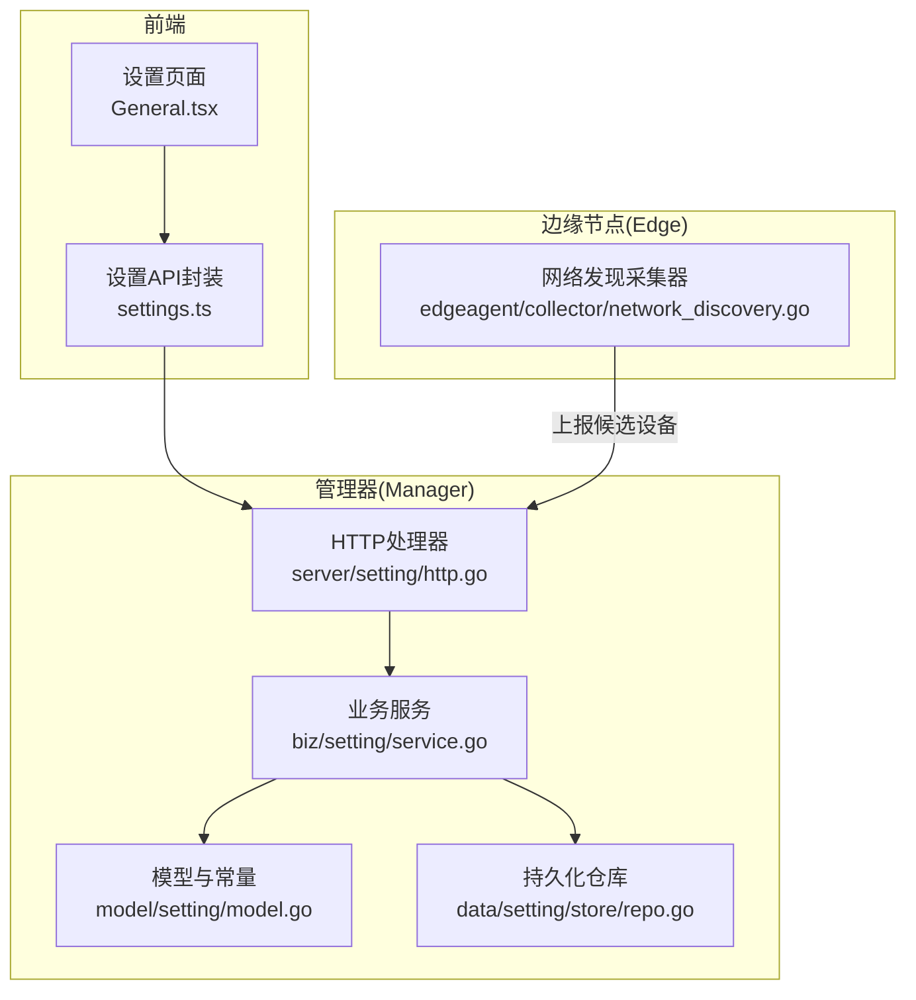
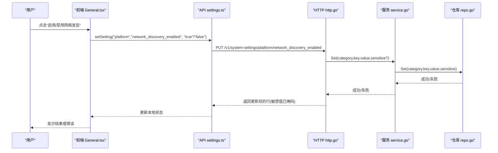
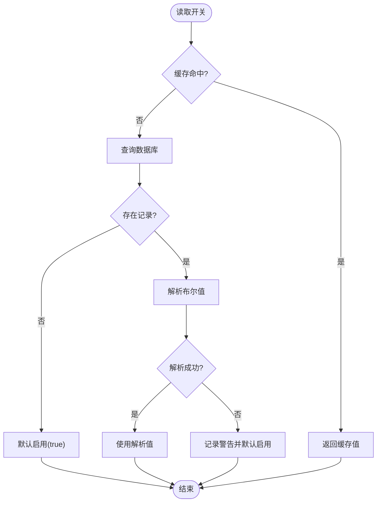
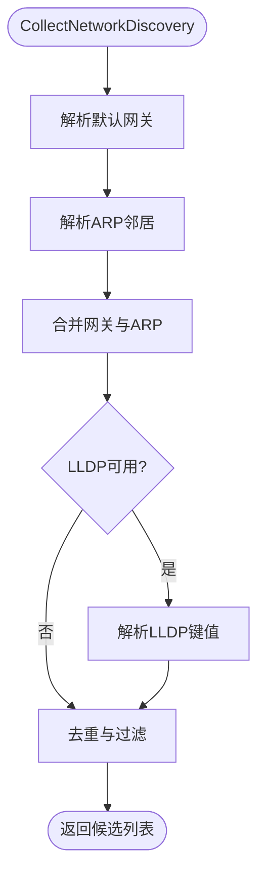
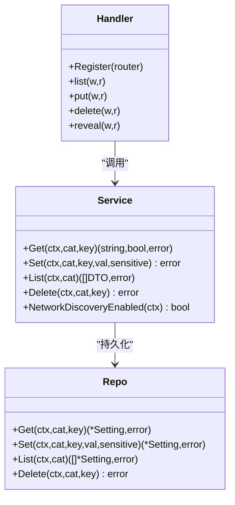
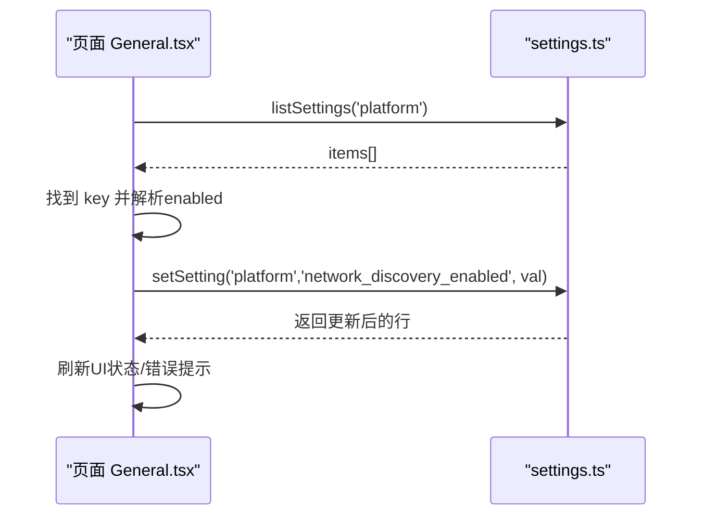
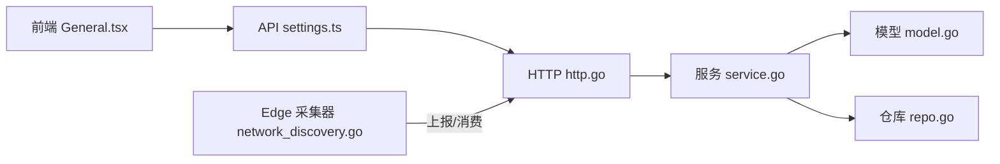

# 通用设置

<cite>
**本文引用的文件**
- [setting.proto](file://api/manager/setting/v1/setting.proto)
- [service.go](file://internal/manager/biz/setting/service.go)
- [model.go](file://internal/manager/model/setting/model.go)
- [http.go](file://internal/manager/server/setting/http.go)
- [repo.go](file://internal/manager/data/setting/store/repo.go)
- [network_discovery.go](file://internal/edgeagent/collector/network_discovery.go)
- [settings.ts](file://web/src/api/settings.ts)
- [General.tsx](file://web/src/pages/settings/General.tsx)
</cite>

## 目录
1. [简介](#简介)
2. [项目结构](#项目结构)
3. [核心组件](#核心组件)
4. [架构总览](#架构总览)
5. [详细组件分析](#详细组件分析)
6. [依赖关系分析](#依赖关系分析)
7. [性能考量](#性能考量)
8. [故障排查指南](#故障排查指南)
9. [结论](#结论)
10. [附录：新增系统级配置项的完整示例](#附录新增系统级配置项的完整示例)

## 简介
本技术文档聚焦“通用设置”模块，围绕网络发现功能的配置管理展开，包括启用/禁用开关、配置的存储与同步、错误处理与用户反馈。同时梳理网络发现控制的核心能力：默认网关上报、ARP邻居发现、LLDP邻居收集。文末提供添加新系统级配置项的前后端完整路径（前端状态、API调用、UI交互），并给出安全性与性能优化建议。

## 项目结构
通用设置由“前端 UI → HTTP API → 业务服务 → 数据仓库”四层构成；网络发现采集位于 Edge Agent 侧，通过平台开关控制是否接受上报。

图表来源
- [General.tsx:1-116](file://web/src/pages/settings/General.tsx#L1-L116)
- [settings.ts:1-157](file://web/src/api/settings.ts#L1-L157)
- [http.go:1-281](file://internal/manager/server/setting/http.go#L1-L281)
- [service.go:1-259](file://internal/manager/biz/setting/service.go#L1-L259)
- [model.go:1-246](file://internal/manager/model/setting/model.go#L1-L246)
- [repo.go:1-41](file://internal/manager/data/setting/store/repo.go#L1-L41)
- [network_discovery.go:1-282](file://internal/edgeagent/collector/network_discovery.go#L1-L282)

章节来源
- [General.tsx:1-116](file://web/src/pages/settings/General.tsx#L1-L116)
- [settings.ts:1-157](file://web/src/api/settings.ts#L1-L157)
- [http.go:1-281](file://internal/manager/server/setting/http.go#L1-L281)
- [service.go:1-259](file://internal/manager/biz/setting/service.go#L1-L259)
- [model.go:1-246](file://internal/manager/model/setting/model.go#L1-L246)
- [repo.go:1-41](file://internal/manager/data/setting/store/repo.go#L1-L41)
- [network_discovery.go:1-282](file://internal/edgeagent/collector/network_discovery.go#L1-L282)

## 核心组件
- 前端设置页：负责加载/切换“网络发现”开关，调用统一设置 API，展示加载与错误状态。
- 设置 API：统一的 key/value 配置接口，支持列表、写入、删除、敏感值揭示。
- 业务服务：带内存缓存的读写服务，提供网络发现开关读取、批量写入、敏感值掩码等。
- 数据仓库：基于 GORM 的 system_settings 表存取，区分“不存在”和“空值”。
- 模型与常量：定义分类、键名、默认值策略等，如 platform.network_discovery_enabled。
- 网络发现采集器：Edge 侧被动采集默认网关、ARP、LLDP，生成候选设备报告。

章节来源
- [General.tsx:1-116](file://web/src/pages/settings/General.tsx#L1-L116)
- [settings.ts:1-157](file://web/src/api/settings.ts#L1-L157)
- [service.go:1-259](file://internal/manager/biz/setting/service.go#L1-L259)
- [model.go:1-246](file://internal/manager/model/setting/model.go#L1-L246)
- [repo.go:1-41](file://internal/manager/data/setting/store/repo.go#L1-L41)
- [network_discovery.go:1-282](file://internal/edgeagent/collector/network_discovery.go#L1-L282)

## 架构总览
下图展示了从前端到后端的完整请求链路，以及网络发现开关如何影响平台对 Edge 上报的处理。

图表来源
- [General.tsx:23-53](file://web/src/pages/settings/General.tsx#L23-L53)
- [settings.ts:24-37](file://web/src/api/settings.ts#L24-L37)
- [http.go:81-137](file://internal/manager/server/setting/http.go#L81-L137)
- [service.go:110-131](file://internal/manager/biz/setting/service.go#L110-L131)
- [repo.go:24-41](file://internal/manager/data/setting/store/repo.go#L24-L41)

## 详细组件分析

### 网络发现开关：配置读取与默认行为
- 开关键：category=platform，key=network_discovery_enabled。
- 默认策略：缺失或非法值时视为“启用”，保证新安装即能发现网络。
- 读取流程：服务层 Get → 命中缓存则直接返回；未命中则查库并回填缓存；解析布尔值失败时记录告警并回退为启用。
- 写保护：仅管理员可修改；写入后失效对应缓存条目，确保后续读取生效。

图表来源
- [service.go:184-203](file://internal/manager/biz/setting/service.go#L184-L203)
- [model.go:48-54](file://internal/manager/model/setting/model.go#L48-L54)

章节来源
- [service.go:184-203](file://internal/manager/biz/setting/service.go#L184-L203)
- [model.go:48-54](file://internal/manager/model/setting/model.go#L48-L54)

### 网络发现采集器：默认网关、ARP、LLDP
- 默认网关上报：Linux 下解析 /proc/net/route，提取默认路由及对应网卡，过滤虚拟网口。
- ARP 邻居发现：解析 /proc/net/arp，筛选与默认网关同网卡的邻居，合并 MAC/IP/Interface。
- LLDP 邻居收集：在 Linux 上执行 lldpctl -f keyvalue，按稳定键值格式聚合 chassis/port/management IP，优先选择 IPv4 管理地址。
- 去重与过滤：以 IP+MAC+Interface 为键去重；非 LLDP 来源且来自虚拟网口的候选将被丢弃。
- 容错：缺少 /proc 文件或 lldpctl 不存在时，不报错，仅返回可用部分。

图表来源
- [network_discovery.go:43-113](file://internal/edgeagent/collector/network_discovery.go#L43-L113)
- [network_discovery.go:115-142](file://internal/edgeagent/collector/network_discovery.go#L115-L142)
- [network_discovery.go:149-203](file://internal/edgeagent/collector/network_discovery.go#L149-L203)
- [network_discovery.go:205-275](file://internal/edgeagent/collector/network_discovery.go#L205-L275)

章节来源
- [network_discovery.go:43-113](file://internal/edgeagent/collector/network_discovery.go#L43-L113)
- [network_discovery.go:115-142](file://internal/edgeagent/collector/network_discovery.go#L115-L142)
- [network_discovery.go:149-203](file://internal/edgeagent/collector/network_discovery.go#L149-L203)
- [network_discovery.go:205-275](file://internal/edgeagent/collector/network_discovery.go#L205-L275)

### 设置 API 与权限、审计、敏感值处理
- 读接口：任何已认证用户可读，敏感字段在服务层自动掩码。
- 写接口：仅管理员可写；写入时若 key 匹配 *_api_key/_secret/_token/_password 后缀，自动标记为敏感。
- 审计：写操作记录审计事件，包含资源 ID、敏感标志与值提示（前缀截断）。
- 敏感值揭示：提供 reveal 端点供管理员获取明文，用于 UI 的“眼睛”按钮。

图表来源
- [http.go:27-50](file://internal/manager/server/setting/http.go#L27-L50)
- [http.go:67-190](file://internal/manager/server/setting/http.go#L67-L190)
- [service.go:29-58](file://internal/manager/biz/setting/service.go#L29-L58)
- [service.go:81-131](file://internal/manager/biz/setting/service.go#L81-L131)
- [repo.go:15-41](file://internal/manager/data/setting/store/repo.go#L15-L41)

章节来源
- [http.go:67-190](file://internal/manager/server/setting/http.go#L67-L190)
- [service.go:81-131](file://internal/manager/biz/setting/service.go#L81-L131)
- [repo.go:15-41](file://internal/manager/data/setting/store/repo.go#L15-L41)

### 前端状态管理与 UI 交互
- 加载：进入页面时调用 listSettings('platform')，定位 network_discovery_enabled 行，缺失行按“启用”显示。
- 切换：点击开关立即乐观更新本地状态，调用 setSetting 写入；失败则回滚并显示错误。
- 文案：根据当前 enabled 状态显示不同说明；底部提示单主机关闭方式（环境变量）。

图表来源
- [General.tsx:23-53](file://web/src/pages/settings/General.tsx#L23-L53)
- [settings.ts:19-37](file://web/src/api/settings.ts#L19-L37)

章节来源
- [General.tsx:23-53](file://web/src/pages/settings/General.tsx#L23-L53)
- [settings.ts:19-37](file://web/src/api/settings.ts#L19-L37)

### LLM 配置校验与保存（扩展）
- 协议：ValidateLLMConfiguration 与 ValidateAndSaveLLMConfiguration 提供草稿探测与原子落库。
- 安全：api_key 仅用于本次探测，不落库、不日志；保存时为空表示显式禁用某提供商。
- 前端：通过 settings.ts 暴露 test/save 方法，配合 UI 表单完成校验与保存。

章节来源
- [setting.proto:7-71](file://api/manager/setting/v1/setting.proto#L7-L71)
- [settings.ts:122-157](file://web/src/api/settings.ts#L122-L157)

## 依赖关系分析
- 前端依赖设置 API 封装；API 封装依赖统一请求客户端。
- HTTP 处理器依赖业务服务；服务依赖仓库与模型常量。
- 仓库依赖 GORM 会话；服务内部使用 RWMutex 维护内存缓存。
- Edge 采集器独立于 Manager，但受平台开关影响（由上层消费方依据开关决定是否接受上报）。

图表来源
- [General.tsx:1-116](file://web/src/pages/settings/General.tsx#L1-L116)
- [settings.ts:1-157](file://web/src/api/settings.ts#L1-L157)
- [http.go:1-281](file://internal/manager/server/setting/http.go#L1-L281)
- [service.go:1-259](file://internal/manager/biz/setting/service.go#L1-L259)
- [model.go:1-246](file://internal/manager/model/setting/model.go#L1-L246)
- [repo.go:1-41](file://internal/manager/data/setting/store/repo.go#L1-L41)
- [network_discovery.go:1-282](file://internal/edgeagent/collector/network_discovery.go#L1-L282)

章节来源
- [http.go:1-281](file://internal/manager/server/setting/http.go#L1-L281)
- [service.go:1-259](file://internal/manager/biz/setting/service.go#L1-L259)
- [model.go:1-246](file://internal/manager/model/setting/model.go#L1-L246)
- [repo.go:1-41](file://internal/manager/data/setting/store/repo.go#L1-L41)
- [network_discovery.go:1-282](file://internal/edgeagent/collector/network_discovery.go#L1-L282)

## 性能考量
- 内存缓存：服务层对 setting 使用 map + RWMutex 缓存，显著降低热路径 DB 访问。
- 批量写入：SetBatch 原子提交并一次性失效多个缓存项，避免中间态。
- 敏感值掩码：仅在 List 响应中掩码，避免额外计算开销。
- 采集器容错：缺失 /proc 或 lldpctl 不阻塞整体流程，减少不必要错误。
- 前端并发：在集成页中对敏感字段并行 reveal，提升加载体验（参考 Integrations.tsx 模式）。

[本节为通用指导，无需特定文件引用]

## 故障排查指南
- 无法读取开关：检查是否存在 platform.network_discovery_enabled 行；若值为非法字符串，服务将记录警告并默认启用。
- 写入失败：确认当前用户为管理员；检查 category/key 是否为空；查看服务端错误码与消息。
- 敏感值不可见：列表接口始终掩码；如需明文，使用 reveal 端点并由管理员调用。
- 采集器无数据：确认运行环境为 Linux；检查 /proc/net/route 与 /proc/net/arp 可读；确认 lldpctl 已安装（可选）。
- 前端状态不一致：若写入失败，页面会回滚本地状态并显示错误；可刷新页面重新拉取。

章节来源
- [service.go:184-203](file://internal/manager/biz/setting/service.go#L184-L203)
- [http.go:81-190](file://internal/manager/server/setting/http.go#L81-L190)
- [network_discovery.go:43-113](file://internal/edgeagent/collector/network_discovery.go#L43-L113)
- [General.tsx:23-53](file://web/src/pages/settings/General.tsx#L23-L53)

## 结论
通用设置模块通过清晰的层次划分与严格的权限控制，提供了稳定的运行时配置管理能力。网络发现开关采用“缺省启用”的安全策略，结合 Edge 侧被动采集，既保证了开箱即用，又允许精细控制。前端与后端协同实现了良好的用户体验与可观测性。

[本节为总结，无需特定文件引用]

## 附录：新增系统级配置项的完整示例
以下以新增一个系统级开关为例，展示前后端联动路径。

- 后端
  - 在模型常量中新增分类与键名（例如 CategoryPlatform 下的 KeyXxxEnabled）。
  - 在服务层实现读取逻辑：Get 命中缓存或查库，解析布尔值，非法时记录警告并回退默认值。
  - 在 HTTP 处理器中注册 PUT/GET/DELETE 路由；写入时自动识别敏感键并记录审计。
  - 在仓库层确保 Get/Set/List/Delete 正确映射到 system_settings 表。

- 前端
  - 在 settings.ts 中复用 listSettings/setSetting/deleteSetting 等通用函数。
  - 在设置页 General.tsx 中新增区块：加载时读取 category=key 的行，缺失按默认值显示；切换时乐观更新并调用 setSetting，失败回滚并提示错误。
  - 如需明文输入框，可在需要时使用 revealSetting 获取明文（管理员权限）。

- 验证与测试
  - 单元测试覆盖：读取默认值、非法值回退、写入后缓存失效、敏感值掩码。
  - 集成测试覆盖：HTTP 接口鉴权、审计事件、错误码映射。

章节来源
- [model.go:35-54](file://internal/manager/model/setting/model.go#L35-L54)
- [service.go:81-131](file://internal/manager/biz/setting/service.go#L81-L131)
- [http.go:81-190](file://internal/manager/server/setting/http.go#L81-L190)
- [repo.go:24-41](file://internal/manager/data/setting/store/repo.go#L24-L41)
- [settings.ts:19-54](file://web/src/api/settings.ts#L19-L54)
- [General.tsx:23-53](file://web/src/pages/settings/General.tsx#L23-L53)