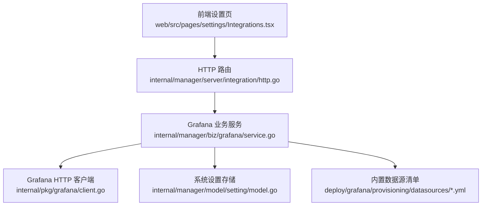
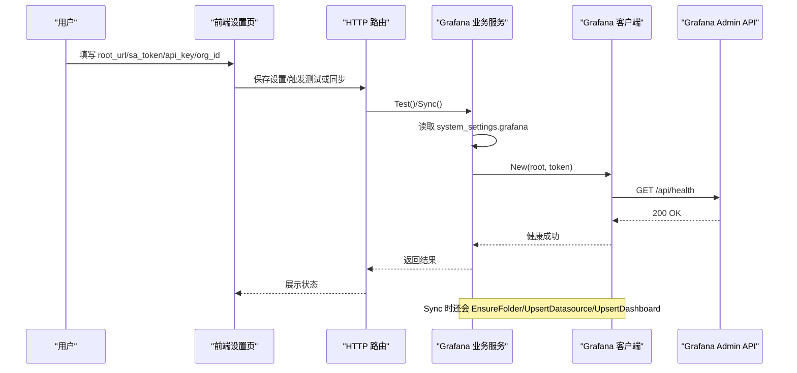
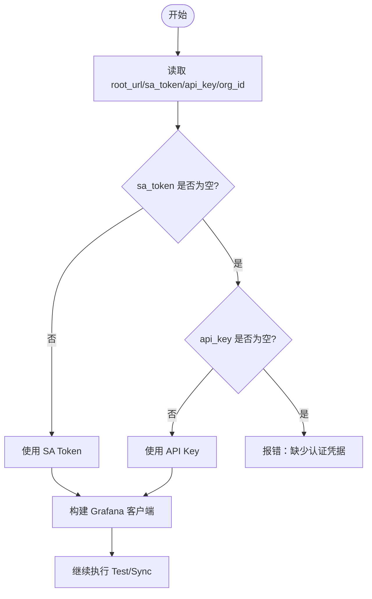
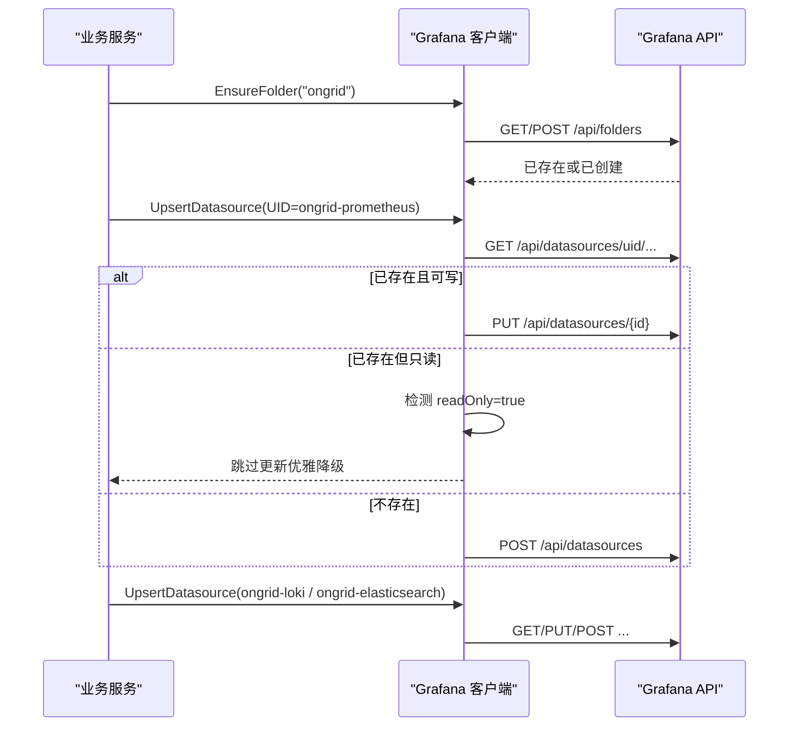
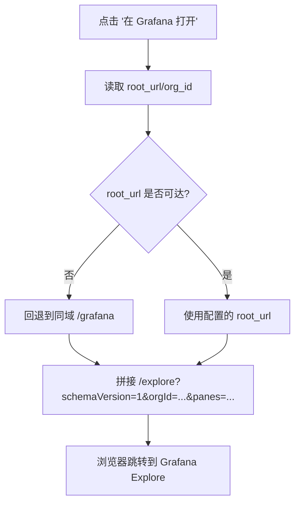
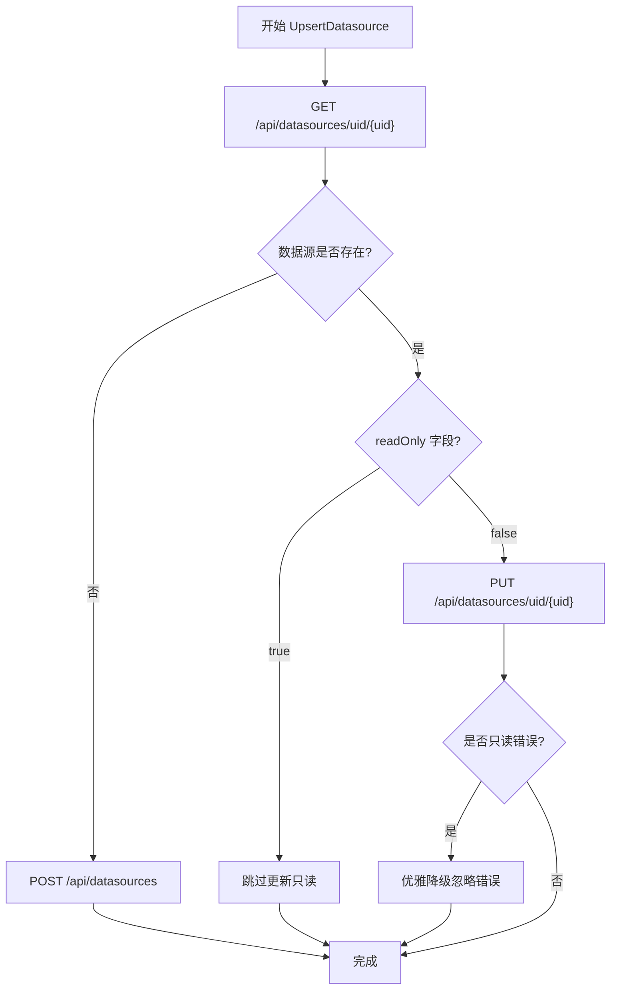
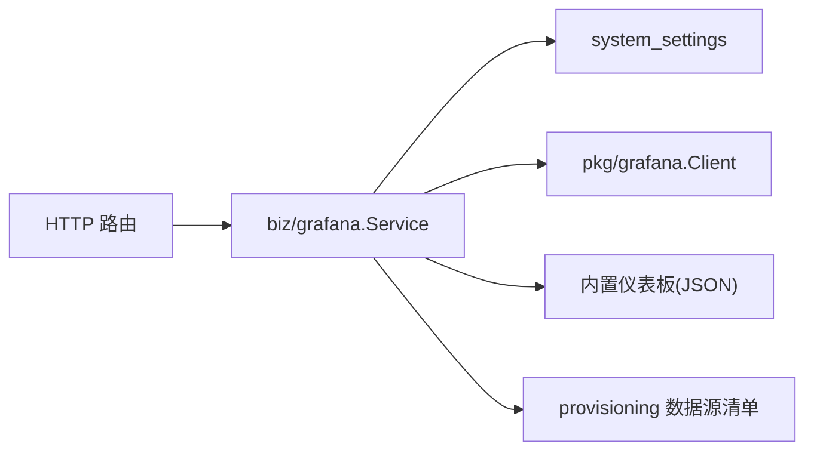

# Grafana 集成

<cite>
**本文引用的文件**
- [internal/pkg/grafana/client.go](file://internal/pkg/grafana/client.go)
- [internal/manager/biz/grafana/service.go](file://internal/manager/biz/grafana/service.go)
- [internal/manager/model/setting/model.go](file://internal/manager/model/setting/model.go)
- [internal/pkg/config/config.go](file://internal/pkg/config/config.go)
- [deploy/grafana/provisioning/datasources/prometheus.yml](file://deploy/grafana/provisioning/datasources/prometheus.yml)
- [deploy/grafana/provisioning/datasources/loki.yml](file://deploy/grafana/provisioning/datasources/loki.yml)
- [web/src/pages/settings/Integrations.tsx](file://web/src/pages/settings/Integrations.tsx)
- [web/src/lib/drilldown.ts](file://web/src/lib/drilldown.ts)
- [internal/manager/server/integration/http.go](file://internal/manager/server/integration/http.go)
- [internal/pkg/grafana/client_test.go](file://internal/pkg/grafana/client_test.go)
</cite>

## 更新摘要
**所做更改**
- 增强了 Grafana 客户端的错误处理机制，特别是针对只读数据源的处理
- 添加了自动只读状态检测和优雅降级行为
- 完善了测试覆盖范围，新增 248 行测试代码
- 更新了数据源同步流程以支持文件基础配置的只读数据源

## 目录
1. [简介](#简介)
2. [项目结构](#项目结构)
3. [核心组件](#核心组件)
4. [架构总览](#架构总览)
5. [详细组件分析](#详细组件分析)
6. [依赖关系分析](#依赖关系分析)
7. [性能与可靠性](#性能与可靠性)
8. [故障排查指南](#故障排查指南)
9. [结论](#结论)
10. [附录：开发与配置示例](#附录开发与配置示例)

## 简介
本技术文档面向 Ongrid 平台中"Grafana 集成"的实现与使用，覆盖以下主题：
- 根地址、Service Account Token、API Key、Org ID 的配置与优先级
- 连接测试、数据源同步、仪表板同步的工作原理
- Service Account 与 API Key 两种认证方式的区别与适用场景
- 如何添加新的数据源到 Grafana，以及如何配置深链接参数
- 多组织环境下的配置要点与常见问题排查
- **新增**：增强了对只读数据源的错误处理和优雅降级机制

## 项目结构
Ongrid 的 Grafana 集成由三层组成：
- HTTP 层（thin handler）：负责鉴权、错误映射与调用业务层
- 业务层（biz）：读取系统设置、编排对 Grafana 的操作（健康检查、数据源/仪表板同步）
- 客户端层（pkg/grafana）：封装 Grafana Admin API 的 HTTP 调用（Bearer/Basic Auth）

**图表来源**
- [internal/manager/server/integration/http.go:1-40](file://internal/manager/server/integration/http.go#L1-L40)
- [internal/manager/biz/grafana/service.go:1-16](file://internal/manager/biz/grafana/service.go#L1-L16)
- [internal/pkg/grafana/client.go:1-12](file://internal/pkg/grafana/client.go#L1-L12)
- [internal/manager/model/setting/model.go:164-182](file://internal/manager/model/setting/model.go#L164-L182)
- [deploy/grafana/provisioning/datasources/prometheus.yml:1-11](file://deploy/grafana/provisioning/datasources/prometheus.yml#L1-L11)
- [deploy/grafana/provisioning/datasources/loki.yml:1-20](file://deploy/grafana/provisioning/datasources/loki.yml#L1-L20)

**章节来源**
- [internal/manager/server/integration/http.go:1-40](file://internal/manager/server/integration/http.go#L1-L40)
- [internal/manager/biz/grafana/service.go:1-16](file://internal/manager/biz/grafana/service.go#L1-L16)
- [internal/pkg/grafana/client.go:1-12](file://internal/pkg/grafana/client.go#L1-L12)
- [internal/manager/model/setting/model.go:164-182](file://internal/manager/model/setting/model.go#L164-L182)
- [deploy/grafana/provisioning/datasources/prometheus.yml:1-11](file://deploy/grafana/provisioning/datasources/prometheus.yml#L1-L11)
- [deploy/grafana/provisioning/datasources/loki.yml:1-20](file://deploy/grafana/provisioning/datasources/loki.yml#L1-L20)

## 核心组件
- Grafana HTTP 客户端（pkg/grafana.Client）
  - 支持 Bearer（Service Account Token / API Key）与 Basic Auth 两种认证
  - 提供 Health、UpsertDatasource、EnsureFolder、UpsertDashboard、FetchDashboard、ServiceAccount 创建与令牌签发等能力
  - **新增**：增强的只读数据源检测和优雅降级处理
- Grafana 业务服务（biz/grafana.Service）
  - 从系统设置读取 root_url、sa_token/api_key、org_id 等
  - 实现 Test/Sync/SyncLoki/SyncLogsDatasource/SyncElasticsearch/FetchDashboardJSON 等操作
  - 管理固定 UID 的数据源与仪表板文件夹（ongrid），并推送内置仪表板
- 系统设置键（model/setting）
  - CategoryGrafana 下 key：root_url、sa_token、api_key、org_id
- 预置数据源清单（provisioning）
  - Prometheus/Loki/Tempo 通过 provisioning 文件声明，便于内嵌部署时快速可用

**章节来源**
- [internal/pkg/grafana/client.go:26-63](file://internal/pkg/grafana/client.go#L26-L63)
- [internal/pkg/grafana/client.go:65-84](file://internal/pkg/grafana/client.go#L65-L84)
- [internal/pkg/grafana/client.go:115-159](file://internal/pkg/grafana/client.go#L115-L159)
- [internal/pkg/grafana/client.go:173-189](file://internal/pkg/grafana/client.go#L173-L189)
- [internal/pkg/grafana/client.go:261-315](file://internal/pkg/grafana/client.go#L261-L315)
- [internal/manager/biz/grafana/service.go:59-85](file://internal/manager/biz/grafana/service.go#L59-L85)
- [internal/manager/biz/grafana/service.go:125-190](file://internal/manager/biz/grafana/service.go#L125-L190)
- [internal/manager/biz/grafana/service.go:201-299](file://internal/manager/biz/grafana/service.go#L201-L299)
- [internal/manager/model/setting/model.go:164-182](file://internal/manager/model/setting/model.go#L164-L182)
- [deploy/grafana/provisioning/datasources/prometheus.yml:1-11](file://deploy/grafana/provisioning/datasources/prometheus.yml#L1-L11)
- [deploy/grafana/provisioning/datasources/loki.yml:1-20](file://deploy/grafana/provisioning/datasources/loki.yml#L1-L20)

## 架构总览
下图展示了从前端设置页到 Grafana 的完整链路，包括配置读取、认证选择、数据源/仪表板同步流程。

**图表来源**
- [web/src/pages/settings/Integrations.tsx:545-590](file://web/src/pages/settings/Integrations.tsx#L545-L590)
- [internal/manager/server/integration/http.go:27-34](file://internal/manager/server/integration/http.go#L27-L34)
- [internal/manager/biz/grafana/service.go:201-299](file://internal/manager/biz/grafana/service.go#L201-L299)
- [internal/pkg/grafana/client.go:65-84](file://internal/pkg/grafana/client.go#L65-L84)
- [internal/pkg/grafana/client.go:115-159](file://internal/pkg/grafana/client.go#L115-L159)
- [internal/pkg/grafana/client.go:261-315](file://internal/pkg/grafana/client.go#L261-L315)

## 详细组件分析

### 认证与配置管理（根地址、SA Token、API Key、Org ID）
- 配置来源
  - root_url：Grafana 根地址（不含路径）
  - sa_token：Service Account Token（优先）
  - api_key：API Key（外部 Grafana 备用）
  - org_id：多组织环境下的目标组织 ID（单组织默认 1）
- 认证优先级
  - 先读 sa_token；为空则回退到 api_key；两者都为空时报错
  - 两者最终都作为 Authorization: Bearer 头发送，Grafana 不区分来源
- 首次启动引导
  - 若为内嵌 Grafana 且提供了 admin 账号密码，会尝试自动创建 Service Account 并签发 token，写入系统设置
- 前端界面
  - 设置页提供 root_url、sa_token、api_key、org_id 字段，敏感字段支持"显示/隐藏"

**图表来源**
- [internal/manager/biz/grafana/service.go:433-460](file://internal/manager/biz/grafana/service.go#L433-L460)
- [internal/manager/model/setting/model.go:164-182](file://internal/manager/model/setting/model.go#L164-L182)
- [internal/manager/biz/grafana/service.go:125-190](file://internal/manager/biz/grafana/service.go#L125-L190)
- [web/src/pages/settings/Integrations.tsx:545-590](file://web/src/pages/settings/Integrations.tsx#L545-L590)

**章节来源**
- [internal/manager/biz/grafana/service.go:433-460](file://internal/manager/biz/grafana/service.go#L433-L460)
- [internal/manager/model/setting/model.go:164-182](file://internal/manager/model/setting/model.go#L164-L182)
- [internal/manager/biz/grafana/service.go:125-190](file://internal/manager/biz/grafana/service.go#L125-L190)
- [web/src/pages/settings/Integrations.tsx:545-590](file://web/src/pages/settings/Integrations.tsx#L545-L590)

### 连接测试（Health）
- 通过 /api/health 验证连通性与数据库状态
- 失败原因可能包含：网络不可达、认证失败、数据库异常、根地址错误等

**章节来源**
- [internal/pkg/grafana/client.go:65-84](file://internal/pkg/grafana/client.go#L65-L84)
- [internal/manager/biz/grafana/service.go:201-210](file://internal/manager/biz/grafana/service.go#L201-L210)

### 数据源同步（Prometheus/Loki/Elasticsearch）

**已更新** 增强了只读数据源的处理机制

- 固定 UID 的数据源
  - Prometheus：ongrid-prometheus（editable: false，通过文件配置）
  - Loki：ongrid-loki（editable: true，支持运行时更新）
  - Elasticsearch：ongrid-elasticsearch
- 同步逻辑
  - 确保文件夹 ongrid 存在
  - 根据系统设置生成对应数据源的 JSONData/SecureJSONData（含鉴权信息）
  - 使用 UpsertDatasource 进行幂等更新（按 UID）
  - **新增**：对只读 provisioned 的数据源做兼容处理，避免覆盖失败
  - **新增**：自动检测 readOnly 字段，优雅跳过只读数据源的更新
- 日志后端切换
  - 支持仅同步当前活跃的日志后端（Loki 或 Elasticsearch）

**图表来源**
- [internal/pkg/grafana/client.go:115-159](file://internal/pkg/grafana/client.go#L115-L159)
- [internal/pkg/grafana/client.go:173-189](file://internal/pkg/grafana/client.go#L173-L189)
- [internal/manager/biz/grafana/service.go:212-299](file://internal/manager/biz/grafana/service.go#L212-L299)
- [internal/manager/biz/grafana/service.go:395-431](file://internal/manager/biz/grafana/service.go#L395-L431)
- [internal/manager/biz/grafana/service.go:346-393](file://internal/manager/biz/grafana/service.go#L346-L393)

**章节来源**
- [internal/pkg/grafana/client.go:115-159](file://internal/pkg/grafana/client.go#L115-L159)
- [internal/manager/biz/grafana/service.go:212-299](file://internal/manager/biz/grafana/service.go#L212-L299)
- [internal/manager/biz/grafana/service.go:346-431](file://internal/manager/biz/grafana/service.go#L346-L431)

### 仪表板同步与获取
- 内置仪表板
  - 随二进制嵌入，按文件名顺序推送至 ongrid 文件夹，overwrite=true 保证幂等
- 监控面板镜像
  - 将前端 Monitor 页面的面板列表镜像为一个受管仪表板（uid 固定），用于"在 Grafana 中打开"
- 远程仪表板获取
  - 通过 FetchDashboard(uid) 获取原始 JSON，供前端渲染 PromQL 面板时使用

**章节来源**
- [internal/manager/biz/grafana/service.go:487-528](file://internal/manager/biz/grafana/service.go#L487-L528)
- [internal/manager/biz/grafana/service.go:530-571](file://internal/manager/biz/grafana/service.go#L530-L571)
- [internal/pkg/grafana/client.go:261-315](file://internal/pkg/grafana/client.go#L261-L315)

### 深链接参数（Explore 跳转）
- 前端根据系统设置的 root_url 构建 Grafana Explore 深链
- Grafana 11 要求使用 schemaVersion=1 与 panes 对象形式指定数据源与查询
- 支持传入 orgId，适配多组织环境

**图表来源**
- [web/src/lib/drilldown.ts:190-222](file://web/src/lib/drilldown.ts#L190-L222)
- [web/src/pages/settings/Integrations.tsx:747-780](file://web/src/pages/settings/Integrations.tsx#L747-780)

**章节来源**
- [web/src/lib/drilldown.ts:190-222](file://web/src/lib/drilldown.ts#L190-L222)
- [web/src/pages/settings/Integrations.tsx:747-780](file://web/src/pages/settings/Integrations.tsx#L747-780)

### Service Account 与 API Key 的区别与使用场景
- Service Account Token
  - 推荐首选，尤其内嵌 Grafana 首次启动可自动创建并签发
  - 适合管理员可控的环境，权限更细粒度
- API Key
  - 适用于客户自有 Grafana 且无法创建 Service Account 的场景
  - 与 SA Token 在认证上等价（均作为 Bearer），但生命周期与权限策略不同
- 优先级
  - 同时存在时，sa_token 优先于 api_key

**章节来源**
- [internal/manager/biz/grafana/service.go:125-190](file://internal/manager/biz/grafana/service.go#L125-L190)
- [internal/manager/biz/grafana/service.go:433-460](file://internal/manager/biz/grafana/service.go#L433-L460)
- [internal/manager/model/setting/model.go:164-182](file://internal/manager/model/setting/model.go#L164-L182)

### 增强的错误处理机制

**新增** 专门针对只读数据源的处理

- 自动只读状态检测
  - 在 UpsertDatasource 方法中，首先通过 GET 请求获取数据源信息
  - 检测响应中的 `readOnly` 字段，如果为 true 则跳过后续更新操作
  - 避免因文件基础配置创建的只读数据源导致的更新失败
- 优雅降级行为
  - 当检测到只读数据源时，直接返回 nil（成功），而不是抛出错误
  - 保持系统的稳定性，允许其他数据源的正常同步
- 向后兼容性
  - 即使未来版本的 Grafana 移除了 readOnly 字段，也会通过错误消息匹配进行兜底处理
  - 支持多种错误消息格式："read-only data source" 和 "Cannot update read-only"

**图表来源**
- [internal/pkg/grafana/client.go:115-159](file://internal/pkg/grafana/client.go#L115-L159)
- [internal/pkg/grafana/client.go:162-172](file://internal/pkg/grafana/client.go#L162-L172)

**章节来源**
- [internal/pkg/grafana/client.go:115-159](file://internal/pkg/grafana/client.go#L115-L159)
- [internal/pkg/grafana/client.go:162-172](file://internal/pkg/grafana/client.go#L162-L172)

## 依赖关系分析
- HTTP 路由依赖 biz/grafana.Service 接口，仅暴露 Test/Sync/SyncLoki/FetchDashboardJSON
- biz/grafana.Service 依赖：
  - 系统设置（system_settings.category=grafana/prom/loki）
  - pkg/grafana.Client（HTTP 调用）
  - 内置仪表板资源（go:embed）
  - 预置数据源清单（provisioning）
- pkg/grafana.Client 依赖标准库 http 与 json 编解码

**图表来源**
- [internal/manager/server/integration/http.go:27-34](file://internal/manager/server/integration/http.go#L27-L34)
- [internal/manager/biz/grafana/service.go:1-36](file://internal/manager/biz/grafana/service.go#L1-L36)
- [internal/pkg/grafana/client.go:14-24](file://internal/pkg/grafana/client.go#L14-L24)

**章节来源**
- [internal/manager/server/integration/http.go:27-34](file://internal/manager/server/integration/http.go#L27-L34)
- [internal/manager/biz/grafana/service.go:1-36](file://internal/manager/biz/grafana/service.go#L1-L36)
- [internal/pkg/grafana/client.go:14-24](file://internal/pkg/grafana/client.go#L14-L24)

## 性能与可靠性
- 超时与重试
  - 默认 HTTP 客户端超时 15s；可通过 TLSInsecure 控制证书校验
- 幂等性
  - 数据源与仪表板按 UID 操作，避免重复创建
  - **新增**：对只读 provisioned 数据源做兼容，避免覆盖失败
- 健壮性
  - Health 检查失败不会阻塞启动；Bootstrap 失败仅记录告警
  - 错误信息对用户友好，便于定位配置问题
  - **新增**：优雅降级机制确保部分数据源同步失败不影响整体流程

## 故障排查指南
- 连接失败
  - 检查 root_url 是否正确（不含路径）、网络可达、防火墙策略
  - 确认 sa_token 或 api_key 已正确配置
- 认证失败
  - 确认 Service Account 具有所需权限（如读写数据源、仪表板）
  - 对外部 Grafana，确认 API Key 未过期且具备相应权限
- 数据源无法更新
  - **新增**：若数据源由 provisioning 以 editable:false 创建，API 将无法修改；这是预期行为，系统会自动跳过
  - 如需修改，需调整 provision 文件或改为可编辑模式
- 仪表板未同步
  - 检查 ongrid 文件夹是否存在；查看日志中仪表板标题列表
- 深链接无效
  - 确认 root_url 可从浏览器访问；否则将回退到同域 /grafana
  - 多组织环境请设置正确的 org_id

**章节来源**
- [internal/pkg/grafana/client.go:65-84](file://internal/pkg/grafana/client.go#L65-L84)
- [internal/pkg/grafana/client.go:115-159](file://internal/pkg/grafana/client.go#L115-L159)
- [internal/manager/biz/grafana/service.go:212-299](file://internal/manager/biz/grafana/service.go#L212-L299)
- [web/src/pages/settings/Integrations.tsx:747-780](file://web/src/pages/settings/Integrations.tsx#L747-780)

## 结论
Ongrid 的 Grafana 集成通过清晰的三层架构实现了安全的连接测试、数据源与仪表板的自动化同步，并提供灵活的认证方式与深链接能力。通过固定 UID 与幂等设计，保证了在多环境、多组织下的稳定运行。**最新的增强功能进一步提升了系统的健壮性，特别是对只读数据源的优雅处理，确保了在各种部署场景下的可靠运行。** 建议在生产环境中优先使用 Service Account Token，并在必要时结合 API Key 作为回退方案。

## 附录：开发与配置示例

### 添加新的数据源到 Grafana
步骤概览：
- 在 biz/grafana.service 中定义新数据源的 UID、名称、类型与必要配置
- 在 Sync 流程中增加对该数据源的 UpsertDatasource 调用
- 如需安全字段（如密码、密钥），放入 SecureJSONData；普通配置放入 JSONData
- 通过前端设置页或系统设置更新 root_url 与认证信息后，执行同步
- **新增**：如果需要支持只读模式，确保在 provisioning 文件中设置 appropriate 的 editable 标志

参考位置：
- 数据源结构与 upsert 逻辑：[internal/pkg/grafana/client.go:86-159](file://internal/pkg/grafana/client.go#L86-L159)
- Prometheus/Loki/Elasticsearch 数据源构造：[internal/manager/biz/grafana/service.go:241-260](file://internal/manager/biz/grafana/service.go#L241-L260)、[internal/manager/biz/grafana/service.go:395-431](file://internal/manager/biz/grafana/service.go#L395-L431)、[internal/manager/biz/grafana/service.go:346-393](file://internal/manager/biz/grafana/service.go#L346-L393)

**章节来源**
- [internal/pkg/grafana/client.go:86-159](file://internal/pkg/grafana/client.go#L86-L159)
- [internal/manager/biz/grafana/service.go:241-260](file://internal/manager/biz/grafana/service.go#L241-L260)
- [internal/manager/biz/grafana/service.go:346-431](file://internal/manager/biz/grafana/service.go#L346-L431)

### 配置深链接参数（Explore 跳转）
- 在前端设置页中配置 root_url 与 org_id
- 点击"在 Grafana 打开"时，前端会基于 drilldown.ts 的规则拼装 Explore URL
- 若 root_url 不可达，将回退到同域 /grafana

参考位置：
- 深链接构建规则：[web/src/lib/drilldown.ts:190-222](file://web/src/lib/drilldown.ts#L190-L222)
- 设置页中的高级选项：[web/src/pages/settings/Integrations.tsx:658-780](file://web/src/pages/settings/Integrations.tsx#L658-L780)

**章节来源**
- [web/src/lib/drilldown.ts:190-222](file://web/src/lib/drilldown.ts#L190-L222)
- [web/src/pages/settings/Integrations.tsx:658-780](file://web/src/pages/settings/Integrations.tsx#L658-L780)

### 多组织环境配置
- 在设置页中填写 org_id（单组织默认为 1）
- 深链接与仪表板获取时会使用该 org_id，确保在正确的组织上下文中工作

参考位置：
- 设置键定义：[internal/manager/model/setting/model.go:164-182](file://internal/manager/model/setting/model.go#L164-L182)
- 设置页 UI：[web/src/pages/settings/Integrations.tsx:582-590](file://web/src/pages/settings/Integrations.tsx#L582-L590)

**章节来源**
- [internal/manager/model/setting/model.go:164-182](file://internal/manager/model/setting/model.go#L164-L182)
- [web/src/pages/settings/Integrations.tsx:582-590](file://web/src/pages/settings/Integrations.tsx#L582-L590)

### 预置数据源与仪表板
- 预置数据源
  - Prometheus：默认指向内嵌 prometheus 服务，editable=false（只读模式）
  - Loki：默认指向 loki 服务，editable=true，可由运行时更新
- 仪表板
  - 内置仪表板随二进制嵌入，同步时推送到 ongrid 文件夹

参考位置：
- Prometheus 预置：[deploy/grafana/provisioning/datasources/prometheus.yml:1-11](file://deploy/grafana/provisioning/datasources/prometheus.yml#L1-L11)
- Loki 预置：[deploy/grafana/provisioning/datasources/loki.yml:1-20](file://deploy/grafana/provisioning/datasources/loki.yml#L1-L20)
- 仪表板推送：[internal/manager/biz/grafana/service.go:487-528](file://internal/manager/biz/grafana/service.go#L487-L528)

**章节来源**
- [deploy/grafana/provisioning/datasources/prometheus.yml:1-11](file://deploy/grafana/provisioning/datasources/prometheus.yml#L1-L11)
- [deploy/grafana/provisioning/datasources/loki.yml:1-20](file://deploy/grafana/provisioning/datasources/loki.yml#L1-L20)
- [internal/manager/biz/grafana/service.go:487-528](file://internal/manager/biz/grafana/service.go#L487-L528)

### 测试覆盖与质量保证

**新增** 全面的测试覆盖

- 单元测试覆盖
  - Health 检查测试：验证认证头和响应解析
  - 数据源同步测试：涵盖创建、更新、只读跳过等场景
  - 仪表板操作测试：验证包装负载和错误处理
  - 错误处理测试：确保非 2xx 响应被正确处理
- 端到端测试
  - 验证 provisioning 文件的 editable 标志配置
  - 确保数据源同步的正确性和完整性

参考位置：
- 客户端测试：[internal/pkg/grafana/client_test.go:1-249](file://internal/pkg/grafana/client_test.go#L1-L249)
- 端到端测试：[tests/e2e/grafana_loki_datasource_test.go:31-70](file://tests/e2e/grafana_loki_datasource_test.go#L31-L70)

**章节来源**
- [internal/pkg/grafana/client_test.go:1-249](file://internal/pkg/grafana/client_test.go#L1-L249)
- [tests/e2e/grafana_loki_datasource_test.go:31-70](file://tests/e2e/grafana_loki_datasource_test.go#L31-L70)