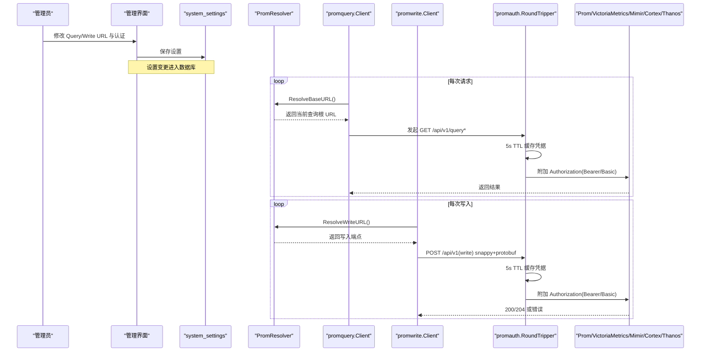
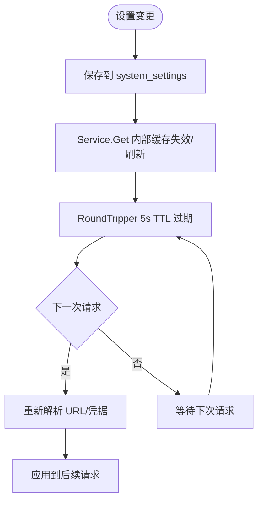
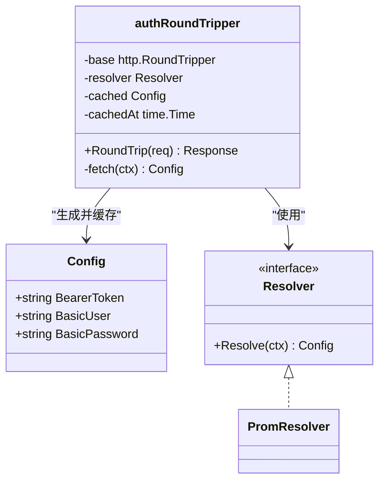
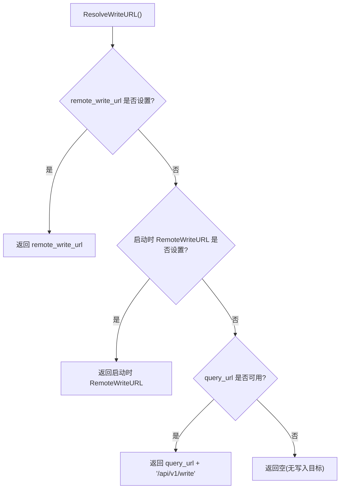
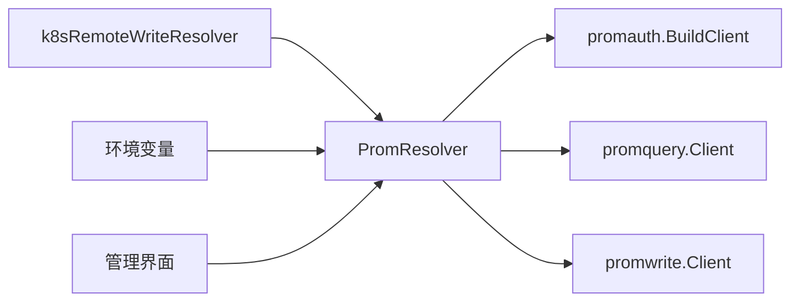

# Prometheus 集成

<cite>
**本文引用的文件**
- [internal/pkg/promauth/client.go](file://internal/pkg/promauth/client.go)
- [internal/pkg/promquery/client.go](file://internal/pkg/promquery/client.go)
- [internal/pkg/promwrite/client.go](file://internal/pkg/promwrite/client.go)
- [internal/manager/biz/setting/promauth.go](file://internal/manager/biz/setting/promauth.go)
- [internal/manager/model/setting/model.go](file://internal/manager/model/setting/model.go)
- [cmd/ongrid/main.go](file://cmd/ongrid/main.go)
- [internal/pkg/config/config.go](file://internal/pkg/config/config.go)
- [web/src/pages/settings/Integrations.tsx](file://web/src/pages/settings/Integrations.tsx)
- [deploy/install/prometheus.yml](file://deploy/install/prometheus.yml)
</cite>

## 目录
1. [简介](#简介)
2. [项目结构](#项目结构)
3. [核心组件](#核心组件)
4. [架构总览](#架构总览)
5. [详细组件分析](#详细组件分析)
6. [依赖关系分析](#依赖关系分析)
7. [性能考量](#性能考量)
8. [故障排查指南](#故障排查指南)
9. [结论](#结论)
10. [附录：配置示例与默认值](#附录：配置示例与默认值)

## 简介
本技术文档聚焦于系统对 Prometheus 指标数据源的集成能力，覆盖以下主题：
- 查询 URL、远程写入 URL、认证方式（Bearer Token、Basic Auth）的配置管理与热更新机制
- 连接测试与错误诊断方法
- 与 VictoriaMetrics、Mimir、Cortex、Thanos receive 等兼容的 TSDB 对接
- 内建 Prometheus 的默认配置与外部带认证 TSDB 的对接示例
- 性能优化建议与常见问题排查

## 项目结构
Prometheus 集成由“配置层 + 解析器 + HTTP 客户端”三层组成：
- 配置层：通过环境变量与 UI 设置项（system_settings）维护查询/写入 URL 与认证信息
- 解析器：将配置转换为运行时可消费的 URL 与凭据
- HTTP 客户端：封装 PromQL 查询与 remote_write 写入，统一处理 TLS、超时、压缩与错误

```mermaid
graph TB
subgraph "配置层"
ENV["环境变量<br/>ONGRID_PROM_*"]
UI["管理界面设置<br/>Query/Remote Write/认证"]
DB["system_settings 表"]
end
subgraph "解析器"
PR["PromResolver<br/>URL 与凭据解析"]
end
subgraph "HTTP 客户端"
PQ["promquery.Client<br/>PromQL 查询"]
PW["promwrite.Client<br/>remote_write 写入"]
PA["promauth.BuildClient<br/>TLS + Bearer/Basic"]
end
ENV --> PR
UI --> DB --> PR
PR --> PQ
PR --> PW
PR --> PA
PQ --> |"GET /api/v1/query*"<br/>TSDB
PW --> |"POST /api/v1/write"<br/>snappy+protobuf"<br/>TSDB
```

图示来源
- [internal/manager/biz/setting/promauth.go:11-30](file://internal/manager/biz/setting/promauth.go#L11-L30)
- [internal/pkg/promquery/client.go:27-33](file://internal/pkg/promquery/client.go#L27-L33)
- [internal/pkg/promwrite/client.go:33-40](file://internal/pkg/promwrite/client.go#L33-L40)
- [internal/pkg/promauth/client.go:76-103](file://internal/pkg/promauth/client.go#L76-L103)

章节来源
- [internal/manager/biz/setting/promauth.go:11-30](file://internal/manager/biz/setting/promauth.go#L11-L30)
- [internal/pkg/config/config.go:498-503](file://internal/pkg/config/config.go#L498-L503)
- [internal/manager/model/setting/model.go:151-162](file://internal/manager/model/setting/model.go#L151-L162)

## 核心组件
- promauth：构建 http.Client，集中处理 TLS（跳过校验、自定义 CA）与每请求的认证头注入（Bearer > Basic），并提供 5s TTL 缓存以支持热更新
- promquery：封装 PromQL 即时与范围查询，支持动态 BaseURL 解析与响应体限流
- promwrite：封装 remote_write 协议（snappy 压缩、protobuf），支持静态或动态 Endpoint 解析
- PromResolver：从 system_settings 读取并解析查询/写入 URL 与认证；当未设置时回退到环境变量启动时的默认值
- 管理端配置与前端：提供 Query URL、Remote Write URL、Bearer/Basic 的设置入口与提示说明

章节来源
- [internal/pkg/promauth/client.go:29-59](file://internal/pkg/promauth/client.go#L29-L59)
- [internal/pkg/promquery/client.go:35-82](file://internal/pkg/promquery/client.go#L35-L82)
- [internal/pkg/promwrite/client.go:42-117](file://internal/pkg/promwrite/client.go#L42-L117)
- [internal/manager/biz/setting/promauth.go:11-90](file://internal/manager/biz/setting/promauth.go#L11-L90)
- [web/src/pages/settings/Integrations.tsx:229-280](file://web/src/pages/settings/Integrations.tsx#L229-L280)

## 架构总览
下图展示了从管理界面到 TSDB 的完整调用链，包括热更新传播路径与认证注入点。



图示来源
- [internal/manager/biz/setting/promauth.go:63-90](file://internal/manager/biz/setting/promauth.go#L63-L90)
- [internal/pkg/promquery/client.go:120-167](file://internal/pkg/promquery/client.go#L120-L167)
- [internal/pkg/promwrite/client.go:126-176](file://internal/pkg/promwrite/client.go#L126-L176)
- [internal/pkg/promauth/client.go:105-149](file://internal/pkg/promauth/client.go#L105-L149)

## 详细组件分析

### 配置与热更新机制
- 配置来源优先级
  - 运行时：system_settings 中的 query_url、remote_write_url、bearer_token、basic_user、basic_password
  - 启动时：环境变量 ONGRID_PROM_URL、ONGRID_PROM_REMOTE_WRITE_URL、ONGRID_PROM_QUERY_URL、TLS 相关变量作为回退值
- 热更新原理
  - PromResolver 每次解析 URL/凭据时读取 system_settings，Service.Get 自带内部缓存
  - promauth 的 RoundTripper 对凭据进行 5s TTL 缓存，避免频繁读库
  - 管理界面保存后，约 5 秒内新请求即可生效，无需重启服务



图示来源
- [internal/manager/biz/setting/promauth.go:11-25](file://internal/manager/biz/setting/promauth.go#L11-L25)
- [internal/pkg/promauth/client.go:70-74](file://internal/pkg/promauth/client.go#L70-L74)
- [internal/pkg/promauth/client.go:136-149](file://internal/pkg/promauth/client.go#L136-L149)

章节来源
- [internal/manager/model/setting/model.go:151-162](file://internal/manager/model/setting/model.go#L151-L162)
- [internal/pkg/config/config.go:498-503](file://internal/pkg/config/config.go#L498-L503)
- [internal/manager/biz/setting/promauth.go:42-90](file://internal/manager/biz/setting/promauth.go#L42-L90)
- [internal/pkg/promauth/client.go:70-74](file://internal/pkg/promauth/client.go#L70-L74)

### 认证方式与优先级
- 支持的认证
  - Bearer Token：Authorization: Bearer ...
  - Basic Auth：Authorization: Basic ...
- 优先级
  - 若同时存在 Bearer 与 Basic，仅发送 Bearer（与 curl 行为一致）
- 注入时机
  - 每个 HTTP 请求在 RoundTripper 中根据 Resolver 返回的 Config 注入
  - 凭据缓存 5s，减少数据库压力



图示来源
- [internal/pkg/promauth/client.go:29-59](file://internal/pkg/promauth/client.go#L29-L59)
- [internal/pkg/promauth/client.go:105-149](file://internal/pkg/promauth/client.go#L105-L149)
- [internal/manager/biz/setting/promauth.go:53-61](file://internal/manager/biz/setting/promauth.go#L53-L61)

章节来源
- [internal/pkg/promauth/client.go:29-59](file://internal/pkg/promauth/client.go#L29-L59)
- [internal/pkg/promauth/client.go:116-134](file://internal/pkg/promauth/client.go#L116-L134)
- [internal/manager/biz/setting/promauth.go:53-61](file://internal/manager/biz/setting/promauth.go#L53-L61)

### 查询 URL 与远程写入 URL 解析
- 查询 URL
  - 优先读取 system_settings.query_url，否则回退到启动时的环境变量 URL
  - 用于 /api/v1/query 与 /api/v1/query_range
- 远程写入 URL
  - 优先读取 system_settings.remote_write_url
  - 若为空，则使用启动时的 RemoteWriteURL
  - 若仍为空，则基于 query_url + "/api/v1/write" 组合
- 内嵌 Prometheus 特殊处理
  - 当检测到写入目标为内嵌 Prometheus 时，自动替换为对外暴露的 publicURL + /prometheus/api/v1/write，并使用内置遥测凭证



图示来源
- [internal/manager/biz/setting/promauth.go:72-90](file://internal/manager/biz/setting/promauth.go#L72-L90)
- [cmd/ongrid/main.go:3144-3188](file://cmd/ongrid/main.go#L3144-L3188)

章节来源
- [internal/manager/biz/setting/promauth.go:63-90](file://internal/manager/biz/setting/promauth.go#L63-L90)
- [cmd/ongrid/main.go:3144-3188](file://cmd/ongrid/main.go#L3144-L3188)

### 连接测试机制
- 前端页面提供连接检查能力（例如日志后端轮询检查），Prometheus 集成同样遵循“保存后 ~5 秒对新请求生效”的原则
- 实际连接验证可通过以下方式完成：
  - 执行一次 PromQL 查询（如 up 或 node_up），观察是否返回成功
  - 尝试一次 remote_write 写入（小批量样本），观察 200/204 响应
- 若启用 TLS 且证书不可信，需配置跳过校验或提供自定义 CA

章节来源
- [web/src/pages/settings/Integrations.tsx:229-280](file://web/src/pages/settings/Integrations.tsx#L229-L280)
- [internal/pkg/promauth/client.go:76-103](file://internal/pkg/promauth/client.go#L76-L103)

### 与 VictoriaMetrics、Mimir、Cortex、Thanos receive 的兼容性
- 查询接口兼容：PromQL 标准 API（/api/v1/query、/api/v1/query_range）
- 写入接口兼容：remote_write 协议（snappy 压缩、protobuf 编码）
- 认证兼容：Bearer Token 与 Basic Auth
- 前端说明明确支持上述 TSDB 类型，切换数据源后旧数据保留在原 TSDB

章节来源
- [web/src/pages/settings/Integrations.tsx:229-252](file://web/src/pages/settings/Integrations.tsx#L229-L252)
- [internal/pkg/promwrite/client.go:126-176](file://internal/pkg/promwrite/client.go#L126-L176)

### 内建 Prometheus 的默认配置
- 默认启用开关：默认关闭
- 默认查询地址：http://prometheus:9090
- 默认远程写入地址：空（由解析器组合 query_url + /api/v1/write）
- 部署配置：安装脚本中包含 prometheus.yml，用于内嵌 Prometheus 的基本配置

章节来源
- [internal/pkg/config/config.go:498-503](file://internal/pkg/config/config.go#L498-L503)
- [deploy/install/prometheus.yml](file://deploy/install/prometheus.yml)

## 依赖关系分析
- 模块耦合
  - promauth 被 promquery 与 promwrite 共用，负责 TLS 与认证注入
  - PromResolver 统一对接 system_settings，解耦具体存储实现
  - cmd/ongrid 中的 k8sRemoteWriteResolver 将 PromResolver 与运行环境（publicURL、TLS）结合，适配内嵌 Prometheus
- 外部依赖
  - 依赖 Prometheus 兼容的 TSDB（VictoriaMetrics、Mimir、Cortex、Thanos receive）
  - 依赖 Go 标准库 crypto/tls、net/http 与 snappy 压缩



图示来源
- [internal/manager/biz/setting/promauth.go:11-30](file://internal/manager/biz/setting/promauth.go#L11-L30)
- [cmd/ongrid/main.go:3144-3188](file://cmd/ongrid/main.go#L3144-L3188)
- [internal/pkg/promauth/client.go:76-103](file://internal/pkg/promauth/client.go#L76-L103)

章节来源
- [internal/manager/biz/setting/promauth.go:11-30](file://internal/manager/biz/setting/promauth.go#L11-L30)
- [cmd/ongrid/main.go:3144-3188](file://cmd/ongrid/main.go#L3144-L3188)

## 性能考量
- 查询超时
  - 默认 30s，适合范围查询；可根据业务调整
- 写入超时
  - 默认 10s，适用于小批量样本写入；批量场景可适当提高
- 认证缓存
  - 5s TTL 降低数据库读取频率，平衡热更新时效与性能
- 响应体限制
  - 查询响应体限制 8MiB，防止大结果集导致内存压力
- 压缩
  - remote_write 使用 snappy 压缩，减少网络带宽占用

章节来源
- [internal/pkg/promquery/client.go:43-45](file://internal/pkg/promquery/client.go#L43-L45)
- [internal/pkg/promquery/client.go:139-142](file://internal/pkg/promquery/client.go#L139-L142)
- [internal/pkg/promwrite/client.go:50-54](file://internal/pkg/promwrite/client.go#L50-L54)
- [internal/pkg/promauth/client.go:70-74](file://internal/pkg/promauth/client.go#L70-L74)

## 故障排查指南
- 常见错误定位
  - 非 2xx 响应：记录状态码与响应体片段，便于判断服务端错误
  - 认证失败：确认 Bearer/Basic 是否正确设置，注意 Bearer 优先
  - TLS 错误：检查证书可信性，必要时启用跳过校验或提供自定义 CA
- 诊断步骤
  - 先验证查询 URL 可达性与鉴权（执行简单 PromQL）
  - 再验证写入 URL 与认证（发送少量样本）
  - 查看日志中的非 2xx 警告与错误信息
- 热更新问题
  - 确认设置已保存至 system_settings
  - 等待至少一个 5s TTL 周期后重试
  - 若仍无效，检查 Service.Get 缓存与 RoundTripper 缓存

章节来源
- [internal/pkg/promquery/client.go:143-167](file://internal/pkg/promquery/client.go#L143-L167)
- [internal/pkg/promwrite/client.go:164-176](file://internal/pkg/promwrite/client.go#L164-L176)
- [internal/pkg/promauth/client.go:116-149](file://internal/pkg/promauth/client.go#L116-L149)

## 结论
本集成通过统一的解析器与客户端封装，实现了：
- 灵活的 URL 与认证配置管理
- 低侵入的热更新机制（~5s 生效）
- 对主流 Prometheus 兼容 TSDB 的良好支持
- 完善的错误处理与性能保护
在实际部署中，建议优先使用 system_settings 管理配置，并结合环境变量作为回退；对于外部带认证的 TSDB，务必正确配置 Bearer/Basic 与 TLS；对于内嵌 Prometheus，保持默认配置即可。

## 附录：配置示例与默认值
- 环境变量默认值
  - 启用开关：默认关闭
  - 查询地址：http://prometheus:9090
  - 远程写入地址：空
  - TLS 相关：按需配置
- 管理界面字段
  - Query URL：PromQL 查询根
  - Remote Write URL：留空则取 Query URL + /api/v1/write
  - Bearer Token：优先于 Basic
  - Basic User/Password：备用认证
- 内嵌 Prometheus 配置
  - 安装脚本包含 prometheus.yml，用于内嵌实例的基础配置

章节来源
- [internal/pkg/config/config.go:498-503](file://internal/pkg/config/config.go#L498-L503)
- [web/src/pages/settings/Integrations.tsx:254-280](file://web/src/pages/settings/Integrations.tsx#L254-L280)
- [deploy/install/prometheus.yml](file://deploy/install/prometheus.yml)