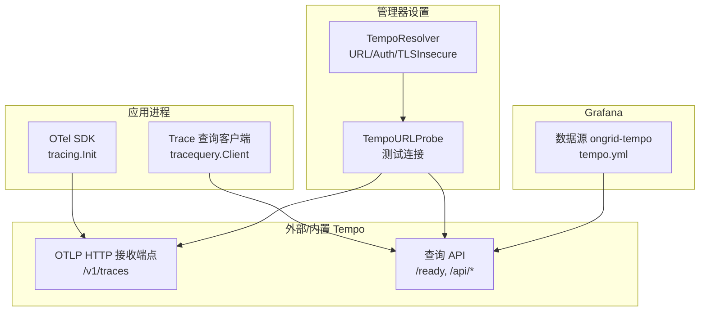
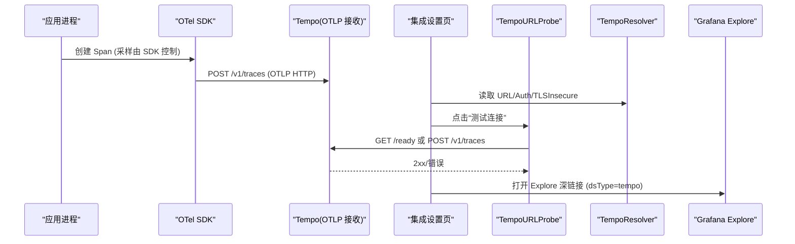
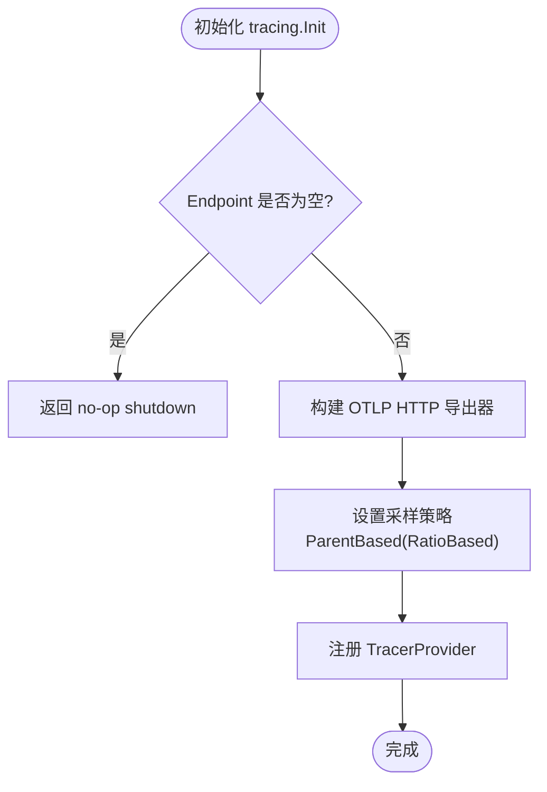
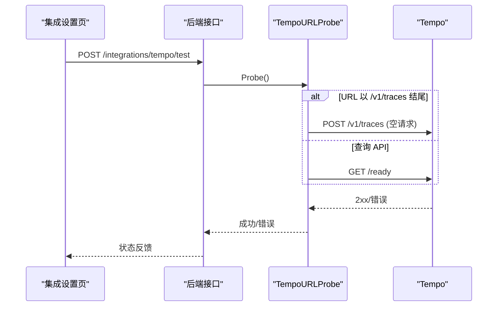
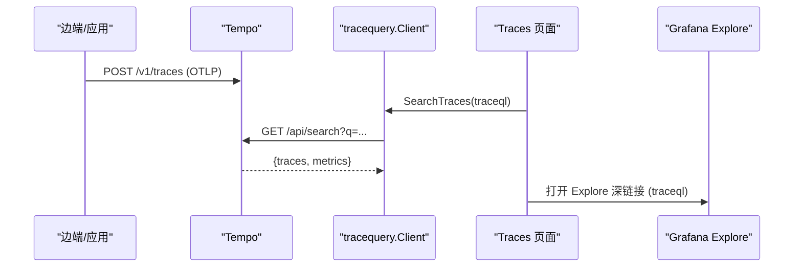
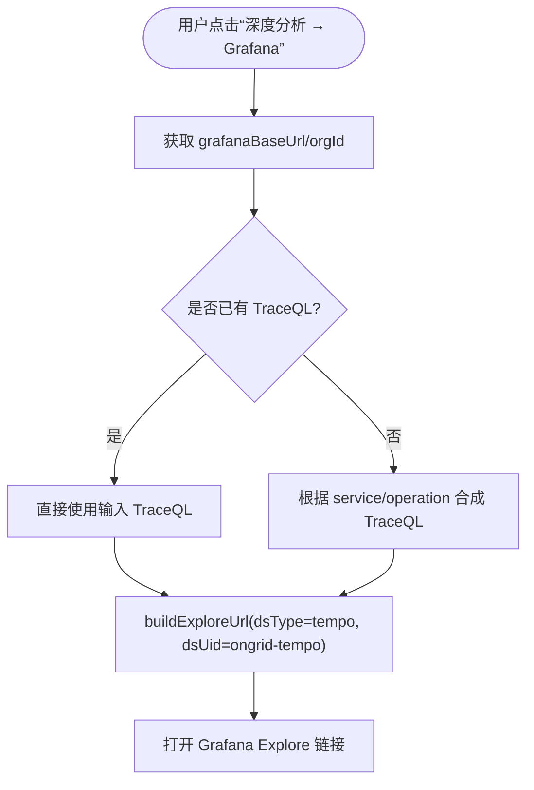
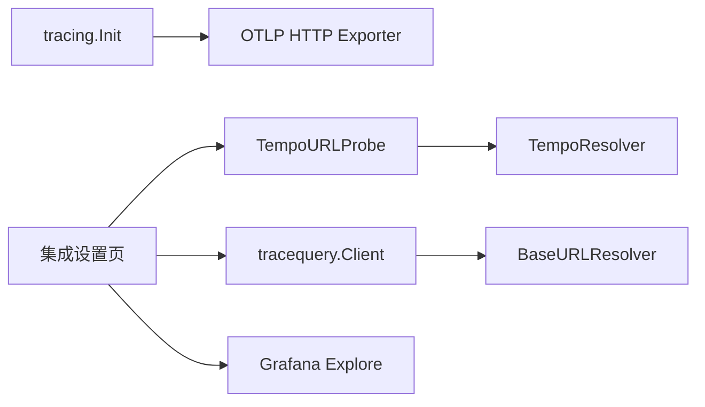

# Tempo 链路追踪集成

<cite>
**本文引用的文件**
- [internal/pkg/tracing/tracing.go](file://internal/pkg/tracing/tracing.go)
- [internal/pkg/tracequery/client.go](file://internal/pkg/tracequery/client.go)
- [internal/manager/biz/setting/telemetry.go](file://internal/manager/biz/setting/telemetry.go)
- [internal/manager/biz/setting/probe.go](file://internal/manager/biz/setting/probe.go)
- [deploy/grafana/provisioning/datasources/tempo.yml](file://deploy/grafana/provisioning/datasources/tempo.yml)
- [web/src/pages/settings/Integrations.tsx](file://web/src/pages/settings/Integrations.tsx)
- [web/src/pages/Traces.tsx](file://web/src/pages/Traces.tsx)
- [web/src/pages/IncidentDetail.tsx](file://web/src/pages/IncidentDetail.tsx)
- [web/src/lib/drilldown.ts](file://web/src/lib/drilldown.ts)
- [web/src/api/settings.ts](file://web/src/api/settings.ts)
- [internal/edgeagent/plugins/traces/render.go](file://internal/edgeagent/plugins/traces/render.go)
</cite>

## 目录
1. [简介](#简介)
2. [项目结构](#项目结构)
3. [核心组件](#核心组件)
4. [架构总览](#架构总览)
5. [详细组件分析](#详细组件分析)
6. [依赖关系分析](#依赖关系分析)
7. [性能考虑](#性能考虑)
8. [故障排查指南](#故障排查指南)
9. [结论](#结论)
10. [附录：配置示例与最佳实践](#附录配置示例与最佳实践)

## 简介
本文件面向在 OnGrid 中集成外部或内置 Tempo 分布式追踪系统的工程与运维人员，系统性说明以下主题：
- 配置管理：查询 URL、认证信息（Basic Auth）、TLS 跳过验证开关、采样策略。
- 连接测试机制：对 OTLP HTTP 接收端点与查询 API 的连通性探测。
- TraceQL 查询与数据接收流程：从边端到管理器再到 Tempo 的数据路径。
- 与 Grafana Explore 的集成与深链接生成：如何构造并打开 Explore 页面。
- 对接外部 Tempo 服务的配置方法与自定义采样规则。
- 性能调优建议与常见问题排查。

## 项目结构
与 Tempo 集成相关的代码分布在后端 Go 模块、前端 React 页面以及部署配置中：
- 后端
  - 追踪导出：OpenTelemetry SDK 初始化与采样策略。
  - 查询客户端：封装 Tempo /api/search 与 /api/traces/<id>。
  - 设置解析器：从系统设置读取 Tempo URL、Basic Auth、TLS 跳过验证。
  - 连接探针：对 OTLP 接收端点或查询 API 进行健康检查。
- 前端
  - 集成设置页：编辑 Tempo URL、认证、TLS 选项，并提供“测试连接”。
  - 追踪页面：构建 TraceQL 并跳转到 Grafana Explore。
  - 事件详情：基于告警标签生成 TraceQL 并跳转 Explore。
  - 通用工具：统一构建 Grafana Explore 深链接。
- 部署
  - Grafana 数据源预置：定义 ongrid-tempo 数据源及 tracesToLogs/tracesToMetrics 等能力。

**图表来源**
- [internal/pkg/tracing/tracing.go:35-106](file://internal/pkg/tracing/tracing.go#L35-L106)
- [internal/pkg/tracequery/client.go:39-87](file://internal/pkg/tracequery/client.go#L39-L87)
- [internal/manager/biz/setting/telemetry.go:72-122](file://internal/manager/biz/setting/telemetry.go#L72-L122)
- [internal/manager/biz/setting/probe.go:51-106](file://internal/manager/biz/setting/probe.go#L51-L106)
- [deploy/grafana/provisioning/datasources/tempo.yml:1-51](file://deploy/grafana/provisioning/datasources/tempo.yml#L1-L51)

**章节来源**
- [internal/pkg/tracing/tracing.go:35-106](file://internal/pkg/tracing/tracing.go#L35-L106)
- [internal/pkg/tracequery/client.go:39-87](file://internal/pkg/tracequery/client.go#L39-L87)
- [internal/manager/biz/setting/telemetry.go:72-122](file://internal/manager/biz/setting/telemetry.go#L72-L122)
- [internal/manager/biz/setting/probe.go:51-106](file://internal/manager/biz/setting/probe.go#L51-L106)
- [deploy/grafana/provisioning/datasources/tempo.yml:1-51](file://deploy/grafana/provisioning/datasources/tempo.yml#L1-L51)

## 核心组件
- OTel 追踪导出器与采样
  - 通过 tracing.Init 注册全局 TracerProvider，使用 OTLP HTTP 导出器将 Span 发送至 Tempo 接收端点。
  - 支持 Insecure 模式（HTTP）与 SamplingRatio（根 Span 采样比例）。
- 设置解析器（TempoResolver）
  - 从系统设置读取 tempo.url、basic_user、basic_password、tls_insecure。
  - 提供 URL、Auth、TLSInsecure 方法供探针与插件使用。
- 连接探针（TempoURLProbe/TempoReadinessProbe）
  - 若 URL 以 /v1/traces 结尾，则向该 OTLP 接收端点发送空请求进行探测。
  - 否则视为查询 API，访问 <url>/ready 进行健康检查。
- 查询客户端（tracequery.Client）
  - 封装 /api/search（支持 TraceQL 与 tags）、/api/traces/<id> 查询。
  - 默认超时 30s，限制响应体大小，兼容不同版本返回格式。
- Grafana 数据源与深链接
  - tempo.yml 预置 ongrid-tempo 数据源，启用 tracesToLogs、tracesToMetrics、serviceMap 等。
  - 前端统一通过 drilldown.buildExploreUrl 构造 Explore 深链接，指定 dsType=tempo、dsUid=ongrid-tempo。

**章节来源**
- [internal/pkg/tracing/tracing.go:35-106](file://internal/pkg/tracing/tracing.go#L35-L106)
- [internal/manager/biz/setting/telemetry.go:72-122](file://internal/manager/biz/setting/telemetry.go#L72-L122)
- [internal/manager/biz/setting/probe.go:51-106](file://internal/manager/biz/setting/probe.go#L51-L106)
- [internal/pkg/tracequery/client.go:39-87](file://internal/pkg/tracequery/client.go#L39-L87)
- [deploy/grafana/provisioning/datasources/tempo.yml:1-51](file://deploy/grafana/provisioning/datasources/tempo.yml#L1-L51)
- [web/src/lib/drilldown.ts:190-222](file://web/src/lib/drilldown.ts#L190-L222)

## 架构总览
下图展示了从应用侧采集、到管理器设置与探针、再到 Grafana Explore 的完整链路。

**图表来源**
- [internal/pkg/tracing/tracing.go:60-106](file://internal/pkg/tracing/tracing.go#L60-L106)
- [internal/manager/biz/setting/probe.go:64-81](file://internal/manager/biz/setting/probe.go#L64-L81)
- [internal/manager/biz/setting/telemetry.go:96-122](file://internal/manager/biz/setting/telemetry.go#L96-L122)
- [web/src/pages/settings/Integrations.tsx:1665-1672](file://web/src/pages/settings/Integrations.tsx#L1665-L1672)
- [web/src/lib/drilldown.ts:190-222](file://web/src/lib/drilldown.ts#L190-L222)

## 详细组件分析

### 追踪导出与采样（OTel SDK）
- 功能要点
  - 初始化时根据 Endpoint 决定导出目标；为空则禁用导出。
  - 支持 Insecure 模式用于 Docker 内网 HTTP。
  - 采样策略：ParentBased + TraceIDRatioBased，SamplingRatio 范围 0..1，默认 1.0。
  - 批量导出：Batcher 超时 2 秒，减少延迟。
- 关键路径
  - tracing.Init -> otlptracehttp.New -> TracerProvider 注册 -> 全局 Tracer。
- 复杂度与性能
  - 采样降低上报量；批量缩短端到端延迟。
  - 资源仅包含 service.name，避免额外开销。

**图表来源**
- [internal/pkg/tracing/tracing.go:60-106](file://internal/pkg/tracing/tracing.go#L60-L106)

**章节来源**
- [internal/pkg/tracing/tracing.go:35-106](file://internal/pkg/tracing/tracing.go#L35-L106)

### 设置解析器（TempoResolver）
- 功能要点
  - 从系统设置读取 tempo.url、basic_user、basic_password、tls_insecure。
  - URL 去除尾部斜杠；Auth 为空表示无 Basic 认证；TLSInsecure 仅在值为 "true" 时生效。
  - 未配置时回退到环境变量预设值。
- 使用场景
  - 探针：判断 OTLP 接收端点或查询 API 是否可达。
  - 插件：为边端 traces 插件生成 OTLP 导出目标。

**章节来源**
- [internal/manager/biz/setting/telemetry.go:72-122](file://internal/manager/biz/setting/telemetry.go#L72-L122)

### 连接测试机制（TempoURLProbe/TempoReadinessProbe）
- 行为逻辑
  - 若 URL 以 /v1/traces 结尾：向该端点发送空请求（application/x-protobuf），验证传输与路径。
  - 否则：访问 <url>/ready 进行健康检查。
  - 支持 Basic Auth 与 TLS 跳过验证。
- 前端入口
  - 集成设置页调用 testTempoConnection，后端执行探针并返回结果。

**图表来源**
- [internal/manager/biz/setting/probe.go:51-81](file://internal/manager/biz/setting/probe.go#L51-L81)
- [internal/manager/biz/setting/probe.go:292-348](file://internal/manager/biz/setting/probe.go#L292-L348)
- [web/src/api/settings.ts:93-95](file://web/src/api/settings.ts#L93-L95)
- [web/src/pages/settings/Integrations.tsx:1665-1672](file://web/src/pages/settings/Integrations.tsx#L1665-L1672)

**章节来源**
- [internal/manager/biz/setting/probe.go:51-106](file://internal/manager/biz/setting/probe.go#L51-L106)
- [web/src/pages/settings/Integrations.tsx:1665-1672](file://web/src/pages/settings/Integrations.tsx#L1665-L1672)
- [web/src/api/settings.ts:93-95](file://web/src/api/settings.ts#L93-L95)

### TraceQL 查询与链路数据接收流程
- 数据接收
  - 应用通过 OTel SDK 将 Span 以 OTLP HTTP 形式发送到 Tempo 接收端点。
  - 管理器可配置边端 traces 插件的导出目标（URL、认证、TLS）。
- 查询流程
  - tracequery.Client 调用 /api/search（支持 TraceQL）与 /api/traces/<id>。
  - 默认超时 30s，限制响应体大小，兼容多版本返回格式。
- 前端展示
  - Traces 页面根据服务/操作过滤条件合成 TraceQL，并通过 Grafana Explore 深链接打开。

**图表来源**
- [internal/pkg/tracequery/client.go:111-157](file://internal/pkg/tracequery/client.go#L111-L157)
- [internal/pkg/tracequery/client.go:187-201](file://internal/pkg/tracequery/client.go#L187-L201)
- [web/src/pages/Traces.tsx:303-331](file://web/src/pages/Traces.tsx#L303-L331)
- [web/src/lib/drilldown.ts:190-222](file://web/src/lib/drilldown.ts#L190-L222)

**章节来源**
- [internal/pkg/tracequery/client.go:111-157](file://internal/pkg/tracequery/client.go#L111-L157)
- [web/src/pages/Traces.tsx:303-331](file://web/src/pages/Traces.tsx#L303-L331)
- [web/src/lib/drilldown.ts:190-222](file://web/src/lib/drilldown.ts#L190-L222)

### 与 Grafana Explore 的集成与深链接生成
- 数据源预置
  - tempo.yml 定义 ongrid-tempo 数据源，启用 tracesToLogs、tracesToMetrics、serviceMap、nodeGraph 等。
- 深链接构造
  - 统一通过 buildExploreUrl 构造 Grafana 11 的 panes 参数，指定 dsType=tempo、dsUid=ongrid-tempo。
  - IncidentDetail 与 Traces 页面均使用该工具生成 Explore 链接。
- 时间窗口
  - 事件详情默认围绕 fired_at 前后 30 分钟；Traces 页面按所选范围计算 from/to。

**图表来源**
- [deploy/grafana/provisioning/datasources/tempo.yml:1-51](file://deploy/grafana/provisioning/datasources/tempo.yml#L1-L51)
- [web/src/lib/drilldown.ts:190-222](file://web/src/lib/drilldown.ts#L190-L222)
- [web/src/pages/Traces.tsx:303-331](file://web/src/pages/Traces.tsx#L303-L331)
- [web/src/pages/IncidentDetail.tsx:1202-1292](file://web/src/pages/IncidentDetail.tsx#L1202-L1292)

**章节来源**
- [deploy/grafana/provisioning/datasources/tempo.yml:1-51](file://deploy/grafana/provisioning/datasources/tempo.yml#L1-L51)
- [web/src/lib/drilldown.ts:190-222](file://web/src/lib/drilldown.ts#L190-L222)
- [web/src/pages/Traces.tsx:303-331](file://web/src/pages/Traces.tsx#L303-L331)
- [web/src/pages/IncidentDetail.tsx:1202-1292](file://web/src/pages/IncidentDetail.tsx#L1202-L1292)

## 依赖关系分析
- 组件耦合
  - tracing 模块依赖 OTel SDK 与 exporter；不直接依赖 Tempo 实现细节。
  - tracequery 模块通过 BaseURLResolver 解耦具体 URL 来源，便于动态更新。
  - setting 模块中的 TempoResolver 被 probe 与插件复用，保证一致性。
- 外部依赖
  - Tempo OTLP HTTP 接收端点与查询 API。
  - Grafana 数据源与 Explore 页面。

**图表来源**
- [internal/pkg/tracing/tracing.go:60-106](file://internal/pkg/tracing/tracing.go#L60-L106)
- [internal/pkg/tracequery/client.go:39-87](file://internal/pkg/tracequery/client.go#L39-L87)
- [internal/manager/biz/setting/telemetry.go:72-122](file://internal/manager/biz/setting/telemetry.go#L72-L122)
- [internal/manager/biz/setting/probe.go:51-81](file://internal/manager/biz/setting/probe.go#L51-L81)
- [web/src/pages/settings/Integrations.tsx:1665-1672](file://web/src/pages/settings/Integrations.tsx#L1665-L1672)

**章节来源**
- [internal/pkg/tracing/tracing.go:60-106](file://internal/pkg/tracing/tracing.go#L60-L106)
- [internal/pkg/tracequery/client.go:39-87](file://internal/pkg/tracequery/client.go#L39-L87)
- [internal/manager/biz/setting/telemetry.go:72-122](file://internal/manager/biz/setting/telemetry.go#L72-L122)
- [internal/manager/biz/setting/probe.go:51-81](file://internal/manager/biz/setting/probe.go#L51-L81)
- [web/src/pages/settings/Integrations.tsx:1665-1672](file://web/src/pages/settings/Integrations.tsx#L1665-L1672)

## 性能考虑
- 采样策略
  - 根 Span 采样比例（SamplingRatio）：在高吞吐场景下调低以降低存储与网络压力。
  - 边端 head sampling 概率可通过 traces 插件配置；管理器侧 tail sampler 可按 status_code/duration/error 进一步过滤。
- 批量导出
  - OTel BatchTimeout 设置为较短间隔，减少端到端延迟。
- 查询性能
  - 查询客户端默认 30s 超时，限制响应体大小，避免慢查询拖垮界面。
- 资源与内存
  - 边端 traces 插件支持 bounded pipelines 与队列大小限制，需合理配置 batch_send_size、batch_max_size、queue_size。

[本节为通用性能指导，不直接分析具体文件]

## 故障排查指南
- 无法连接 Tempo
  - 检查 tempo.url 是否正确（OTLP 接收端点或查询 API）。
  - 若为 OTLP 接收端点，确认 Content-Type 与 Basic Auth。
  - 若为查询 API，确认 /ready 可达。
- 认证失败
  - 核对 basic_user/basic_password 是否与 Tempo 一致。
  - 如使用自签名证书，确认 tls_insecure 已开启。
- 查询无结果
  - 确认 TraceQL 表达式与时间范围。
  - 检查应用是否已正确导出 Span（Endpoint 非空且采样比例 > 0）。
- 深链接无效
  - 确认 Grafana root_url 可浏览器访问。
  - 确认 dsType=tempo、dsUid=ongrid-tempo 与数据源配置一致。

**章节来源**
- [internal/manager/biz/setting/probe.go:292-348](file://internal/manager/biz/setting/probe.go#L292-L348)
- [internal/pkg/tracequery/client.go:203-243](file://internal/pkg/tracequery/client.go#L203-L243)
- [web/src/pages/settings/Integrations.tsx:1665-1672](file://web/src/pages/settings/Integrations.tsx#L1665-L1672)
- [web/src/lib/drilldown.ts:190-222](file://web/src/lib/drilldown.ts#L190-L222)

## 结论
OnGrid 对 Tempo 的集成覆盖了从数据采集、设置管理、连接测试、查询到可视化深链接的全链路。通过可配置的采样策略、健壮的连接探针与统一的 Explore 深链接生成，既保证了高吞吐下的可扩展性，也提供了便捷的排障体验。结合 tracesToLogs/tracesToMetrics 能力，可在 Grafana 中实现跨信号关联分析，提升故障定位效率。

[本节为总结性内容，不直接分析具体文件]

## 附录：配置示例与最佳实践
- 对接外部 Tempo 服务
  - 在集成设置页填写：
    - Tempo URL：外部 OTLP 接收端点（例如 https://tempo.customer.com/v1/traces）或查询 API（例如 http://tempo:3200）。
    - Basic User/Password：按需填写。
    - TLS 跳过验证：仅在必要时开启。
  - 点击“测试连接”验证连通性。
- 自定义采样规则
  - 应用侧：调整 tracing.Config.SamplingRatio 或边端 traces 插件的 sampling_rate。
  - 管理器侧：配合 tail sampler（在 OTel Collector 层）按 status_code/duration/error 过滤。
- 与 Grafana 集成
  - 确保 tempo.yml 中 ongrid-tempo 数据源指向正确的查询 API。
  - 使用 Traces 页面或事件详情页的“深度分析 → Grafana”按钮打开 Explore。

**章节来源**
- [web/src/pages/settings/Integrations.tsx:1665-1672](file://web/src/pages/settings/Integrations.tsx#L1665-L1672)
- [internal/pkg/tracing/tracing.go:48-51](file://internal/pkg/tracing/tracing.go#L48-L51)
- [internal/edgeagent/plugins/traces/render.go:321-334](file://internal/edgeagent/plugins/traces/render.go#L321-L334)
- [deploy/grafana/provisioning/datasources/tempo.yml:1-51](file://deploy/grafana/provisioning/datasources/tempo.yml#L1-L51)
- [web/src/pages/Traces.tsx:303-331](file://web/src/pages/Traces.tsx#L303-L331)
- [web/src/pages/IncidentDetail.tsx:1202-1292](file://web/src/pages/IncidentDetail.tsx#L1202-L1292)