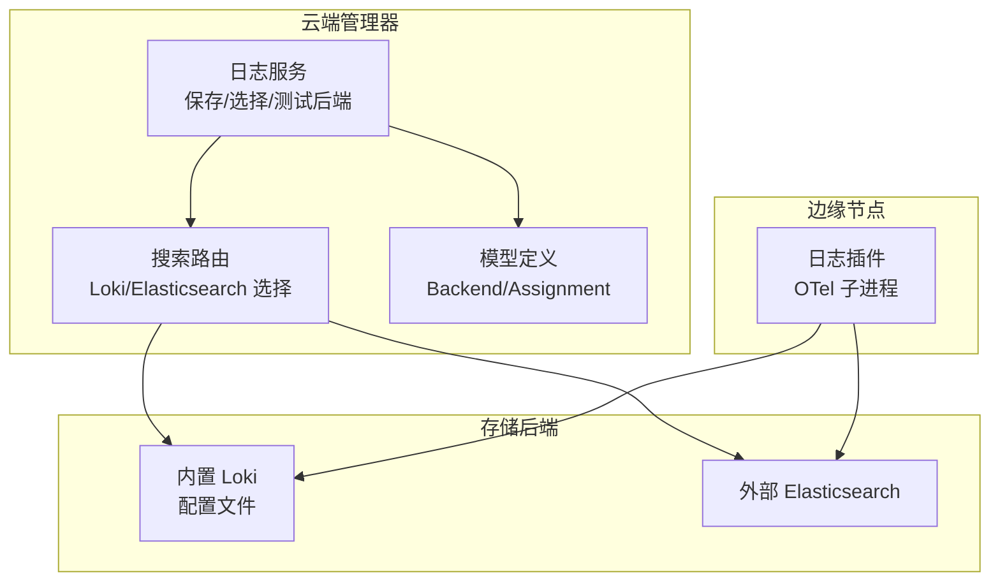
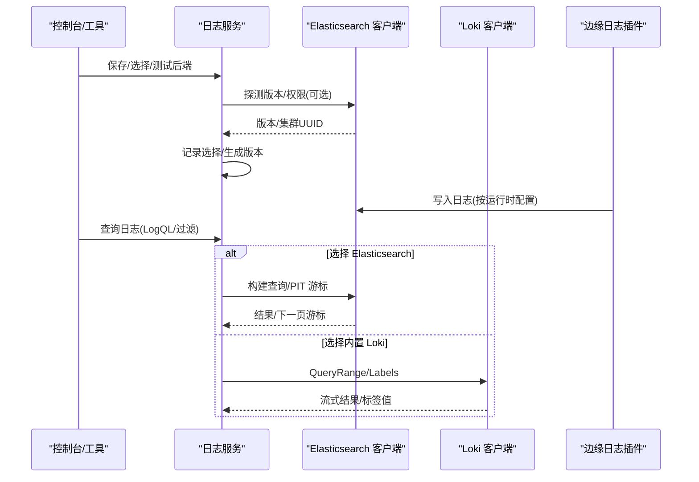
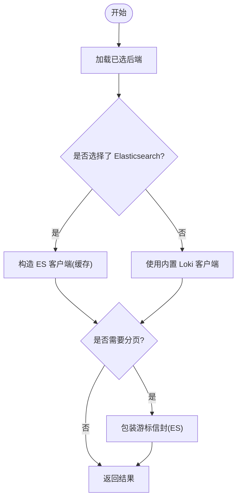
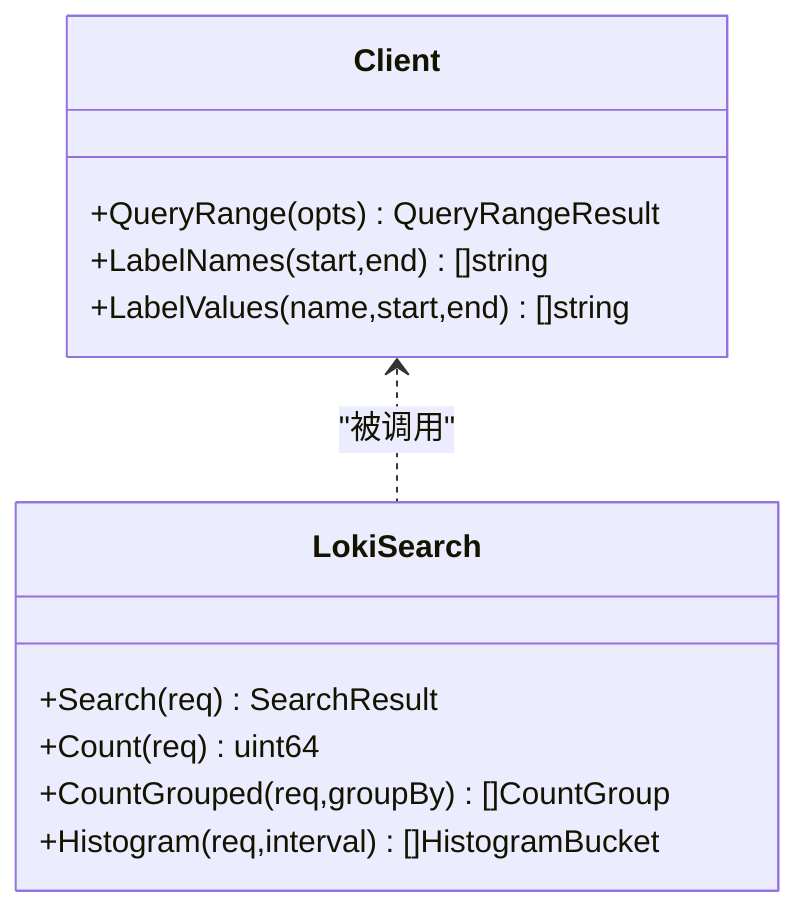
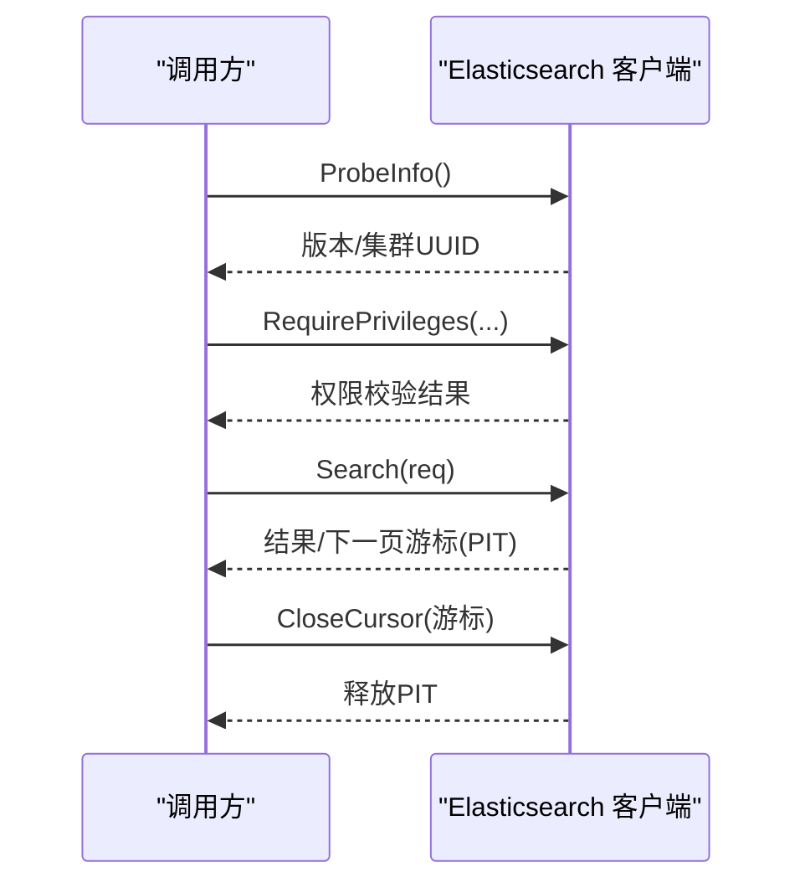
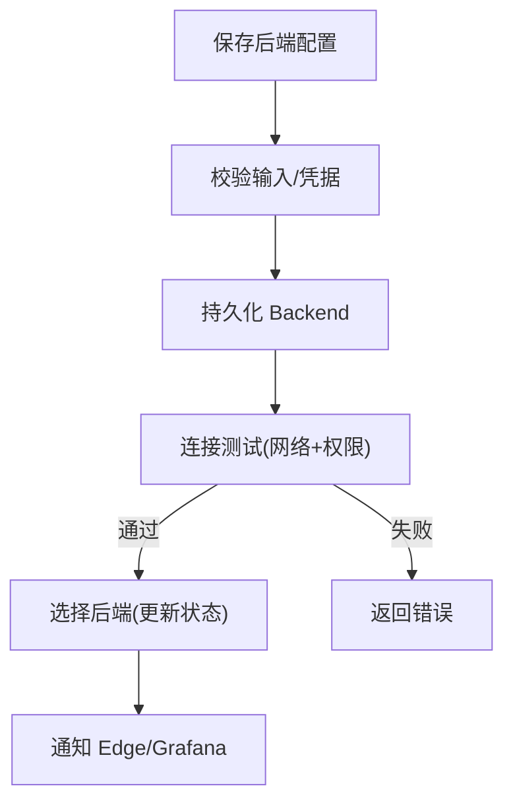
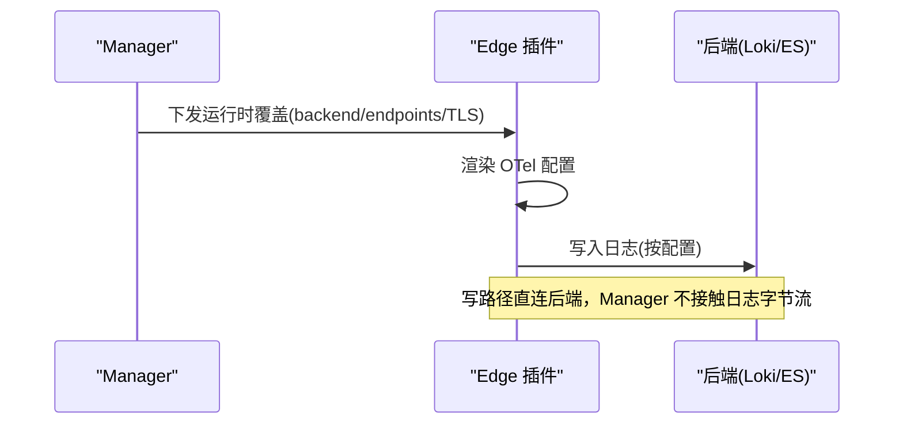
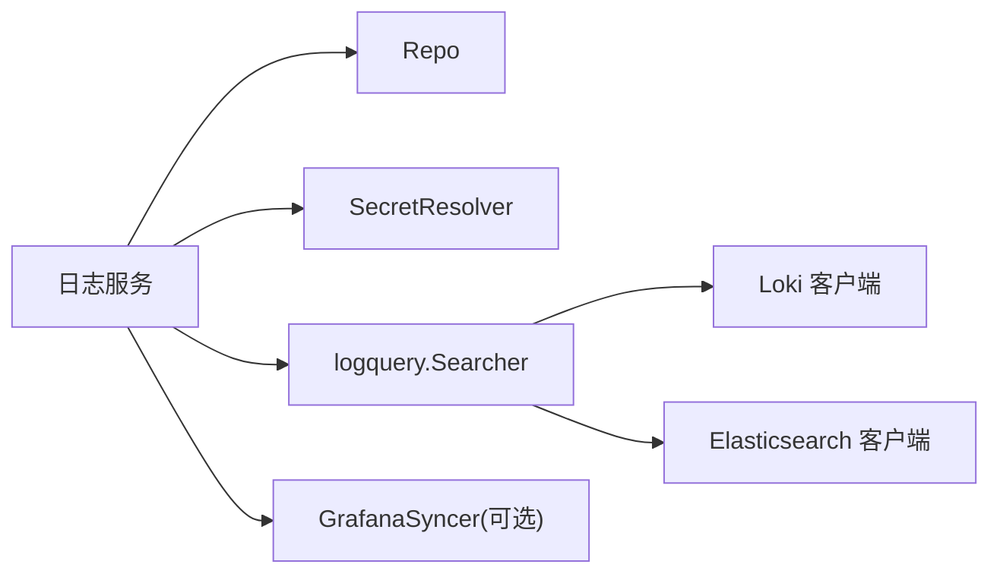

# 日志系统集成

<cite>
**本文引用的文件**
- [internal/pkg/logquery/client.go](file://internal/pkg/logquery/client.go)
- [internal/pkg/logquery/loki_search.go](file://internal/pkg/logquery/loki_search.go)
- [internal/pkg/logquery/elasticsearch.go](file://internal/pkg/logquery/elasticsearch.go)
- [internal/manager/biz/logs/service.go](file://internal/manager/biz/logs/service.go)
- [internal/manager/biz/logs/search.go](file://internal/manager/biz/logs/search.go)
- [internal/manager/model/logs/model.go](file://internal/manager/model/logs/model.go)
- [internal/edgeagent/plugins/logs/plugin.go](file://internal/edgeagent/plugins/logs/plugin.go)
- [deploy/install/loki-config.yaml](file://deploy/install/loki-config.yaml)
- [internal/manager/server/logs/http.go](file://internal/manager/server/logs/http.go)
</cite>

## 目录
1. [简介](#简介)
2. [项目结构](#项目结构)
3. [核心组件](#核心组件)
4. [架构总览](#架构总览)
5. [详细组件分析](#详细组件分析)
6. [依赖关系分析](#依赖关系分析)
7. [性能考虑](#性能考虑)
8. [故障诊断指南](#故障诊断指南)
9. [结论](#结论)
10. [附录：配置示例与查询方法](#附录配置示例与查询方法)

## 简介
本技术文档围绕日志系统集成的后端管理、连接测试、配置验证、边缘节点日志推送与云端聚合机制展开，重点说明 Loki 与 Elasticsearch 两种日志后端的接入方式、认证与查询端点配置、后端选择路由、分页游标与资源释放、以及 Grafana/Loki/Elasticsearch 的集成要点。同时提供 LogQL 查询在系统中的实现路径与使用建议，并给出性能优化与故障排查指引。

## 项目结构
日志系统由“云端管理器（Manager）”和“边缘节点（Edge）”两部分组成：
- Manager 负责日志后端配置管理、选择路由、查询转发、连接测试与状态汇总。
- Edge 通过 OTel Collector 子进程采集日志，按 Manager 下发的运行时配置写入内置 Loki 或外部 Elasticsearch。
- 存储层包括内置 Loki（单节点文件系统）与外部 Elasticsearch（索引模式受控）。

图表来源
- [internal/manager/biz/logs/service.go:303-507](file://internal/manager/biz/logs/service.go#L303-L507)
- [internal/manager/biz/logs/search.go:27-74](file://internal/manager/biz/logs/search.go#L27-L74)
- [internal/manager/model/logs/model.go:27-49](file://internal/manager/model/logs/model.go#L27-L49)
- [internal/edgeagent/plugins/logs/plugin.go:20-41](file://internal/edgeagent/plugins/logs/plugin.go#L20-L41)
- [deploy/install/loki-config.yaml:1-76](file://deploy/install/loki-config.yaml#L1-L76)

章节来源
- [internal/manager/biz/logs/service.go:303-507](file://internal/manager/biz/logs/service.go#L303-L507)
- [internal/manager/biz/logs/search.go:27-74](file://internal/manager/biz/logs/search.go#L27-L74)
- [internal/manager/model/logs/model.go:27-49](file://internal/manager/model/logs/model.go#L27-L49)
- [internal/edgeagent/plugins/logs/plugin.go:20-41](file://internal/edgeagent/plugins/logs/plugin.go#L20-L41)
- [deploy/install/loki-config.yaml:1-76](file://deploy/install/loki-config.yaml#L1-L76)

## 核心组件
- 日志查询客户端（Loki）：封装 /query_range、/labels、/label/*/values，统一超时与限流，支持单租户 X-Scope-OrgID。
- Loki 搜索适配：将产品级 SearchRequest 编译为 LogQL，处理分页游标、直方图、计数与分组。
- Elasticsearch 客户端：固定索引模式、API Key 鉴权、PIT 游标、权限校验、版本探测、直方图与分组聚合。
- 管理服务：后端保存、选择、测试、连接检查、Grafana 同步、运行时覆盖下发。
- 边缘日志插件：以 OTel Collector 子进程运行，读取渲染后的配置，直接写入后端。

章节来源
- [internal/pkg/logquery/client.go:46-171](file://internal/pkg/logquery/client.go#L46-L171)
- [internal/pkg/logquery/loki_search.go:31-118](file://internal/pkg/logquery/loki_search.go#L31-L118)
- [internal/pkg/logquery/elasticsearch.go:33-86](file://internal/pkg/logquery/elasticsearch.go#L33-L86)
- [internal/manager/biz/logs/service.go:303-507](file://internal/manager/biz/logs/service.go#L303-L507)
- [internal/edgeagent/plugins/logs/plugin.go:20-41](file://internal/edgeagent/plugins/logs/plugin.go#L20-L41)

## 架构总览
日志系统在 Manager 侧抽象出统一的 Searcher 接口，根据当前选择的后端动态路由到 Loki 或 Elasticsearch。Edge 侧通过插件子进程按运行时配置写入数据。Manager 还提供连接测试与设备连通性检查能力，确保写路径可达。

图表来源
- [internal/manager/biz/logs/service.go:450-507](file://internal/manager/biz/logs/service.go#L450-L507)
- [internal/pkg/logquery/elasticsearch.go:437-468](file://internal/pkg/logquery/elasticsearch.go#L437-L468)
- [internal/pkg/logquery/client.go:124-171](file://internal/pkg/logquery/client.go#L124-L171)
- [internal/edgeagent/plugins/logs/plugin.go:20-41](file://internal/edgeagent/plugins/logs/plugin.go#L20-L41)

## 详细组件分析

### 后端选择与查询路由
- 选择逻辑：Manager 保存后端配置后，可通过 API 选择；选择前会执行探针（版本/权限），成功后持久化并通知相关组件。
- 查询路由：Search 时若存在选定的 Elasticsearch 后端则使用该客户端；否则回退到内置 Loki。对 Elasticsearch 的分页游标进行信封包装，防止跨后端误用。
- 游标关闭：当调用方放弃分页时，显式关闭后端游标，避免资源泄漏。

图表来源
- [internal/manager/biz/logs/search.go:27-74](file://internal/manager/biz/logs/search.go#L27-L74)
- [internal/manager/biz/logs/search.go:233-268](file://internal/manager/biz/logs/search.go#L233-L268)

章节来源
- [internal/manager/biz/logs/search.go:27-74](file://internal/manager/biz/logs/search.go#L27-L74)
- [internal/manager/biz/logs/search.go:233-268](file://internal/manager/biz/logs/search.go#L233-L268)

### Loki 查询客户端与 LogQL 编译
- 基础能力：QueryRange、LabelNames、LabelValues，统一超时与响应体限制，设置单租户头。
- LogQL 编译：将产品级 Scope、关键词、过滤器转换为 LogQL 匹配器与行过滤器；未命中索引字段转为行过滤；默认强制 device_id 非空匹配器以保证可见性。
- 分页与排序：基于时间戳游标，向后/向前排序，重复时间戳去重与跳过。
- 统计与直方图：count_over_time 与 sum by 分组；直方图对齐 epoch 步长并修正偏移。

图表来源
- [internal/pkg/logquery/client.go:46-171](file://internal/pkg/logquery/client.go#L46-L171)
- [internal/pkg/logquery/loki_search.go:31-118](file://internal/pkg/logquery/loki_search.go#L31-L118)
- [internal/pkg/logquery/loki_search.go:390-526](file://internal/pkg/logquery/loki_search.go#L390-L526)

章节来源
- [internal/pkg/logquery/client.go:46-171](file://internal/pkg/logquery/client.go#L46-L171)
- [internal/pkg/logquery/loki_search.go:31-118](file://internal/pkg/logquery/loki_search.go#L31-L118)
- [internal/pkg/logquery/loki_search.go:390-526](file://internal/pkg/logquery/loki_search.go#L390-L526)

### Elasticsearch 客户端与权限校验
- 配置约束：固定索引模式，禁止传入任意 DSL；必须提供 API Key；支持 TLS 不安全选项。
- 连接测试：ProbeInfo 获取版本与集群 UUID；RequirePrivileges 校验 API Key 对索引模式的权限。
- 查询与分页：使用 PIT 保持上下文稳定；search_after 游标；限制响应大小；错误时主动关闭 PIT。
- 统计与直方图：count API；composite aggregation 分组；date_histogram 直方图，边界严格限定。

图表来源
- [internal/pkg/logquery/elasticsearch.go:437-520](file://internal/pkg/logquery/elasticsearch.go#L437-L520)
- [internal/pkg/logquery/elasticsearch.go:88-175](file://internal/pkg/logquery/elasticsearch.go#L88-L175)

章节来源
- [internal/pkg/logquery/elasticsearch.go:33-86](file://internal/pkg/logquery/elasticsearch.go#L33-L86)
- [internal/pkg/logquery/elasticsearch.go:437-520](file://internal/pkg/logquery/elasticsearch.go#L437-L520)
- [internal/pkg/logquery/elasticsearch.go:88-175](file://internal/pkg/logquery/elasticsearch.go#L88-L175)

### 后端配置管理与连接测试
- 保存后端：校验输入、创建/保留凭据引用、限制端点数、生成索引模式、持久化。
- 选择后端：先 Test 再 Select；Test 仅验证网络与权限；Select 更新状态并迁移告警规则。
- 连接检查：为每个 Edge 下发探针，跟踪在线/待处理/已验证/失败状态，汇总报告。
- 内置 Loki 切换：SelectLoki 切换至内置 Loki 查询路径，并通知 Edge。

图表来源
- [internal/manager/biz/logs/service.go:303-440](file://internal/manager/biz/logs/service.go#L303-L440)
- [internal/manager/biz/logs/service.go:450-507](file://internal/manager/biz/logs/service.go#L450-L507)
- [internal/manager/biz/logs/service.go:509-636](file://internal/manager/biz/logs/service.go#L509-L636)
- [internal/manager/biz/logs/service.go:705-739](file://internal/manager/biz/logs/service.go#L705-L739)

章节来源
- [internal/manager/biz/logs/service.go:303-440](file://internal/manager/biz/logs/service.go#L303-L440)
- [internal/manager/biz/logs/service.go:450-507](file://internal/manager/biz/logs/service.go#L450-L507)
- [internal/manager/biz/logs/service.go:509-636](file://internal/manager/biz/logs/service.go#L509-L636)
- [internal/manager/biz/logs/service.go:705-739](file://internal/manager/biz/logs/service.go#L705-L739)

### 边缘节点日志推送流程
- 插件启动：以 OTel Collector 子进程运行，工作目录包含渲染后的配置文件。
- 配置渲染：Manager 下发运行时覆盖（backend、endpoint、dataset、namespace、TLS 等），Edge 侧解析并生成 Collector 配置。
- 写入路径：Edge 将日志直接推送到后端（内置 Loki 或外部 Elasticsearch），不经过 Manager 中转。

图表来源
- [internal/edgeagent/plugins/logs/plugin.go:20-41](file://internal/edgeagent/plugins/logs/plugin.go#L20-L41)
- [internal/manager/biz/logs/service.go:783-800](file://internal/manager/biz/logs/service.go#L783-L800)

章节来源
- [internal/edgeagent/plugins/logs/plugin.go:20-41](file://internal/edgeagent/plugins/logs/plugin.go#L20-L41)
- [internal/manager/biz/logs/service.go:783-800](file://internal/manager/biz/logs/service.go#L783-L800)

### 内置 Loki 配置要点
- 单节点部署：HTTP/GRPC 端口、路径前缀、存储目录、索引 schema。
- 限制与保留：结构化元数据允许、OTLP 资源属性索引、保留期、速率限制、最大查询系列与回溯窗口。
- 压缩与规则：compactor 启用、本地规则目录、ruler 配置。

章节来源
- [deploy/install/loki-config.yaml:1-76](file://deploy/install/loki-config.yaml#L1-L76)

## 依赖关系分析
- Manager 日志服务依赖：
  - Repo：后端与分配状态持久化。
  - SecretResolver：只读解析凭据引用。
  - logquery.Searcher：Loki 或 Elasticsearch 的统一查询接口。
  - GrafanaSyncer：可选同步数据源。
  - HostDeviceResolver/ConnectionEdgeInventory：用于连接检查的设备清单。
- 查询客户端依赖：
  - Loki：HTTP GET 到 /loki/api/v1/*。
  - Elasticsearch：HTTP POST/GET 到 REST API，使用 API Key 鉴权。

图表来源
- [internal/manager/biz/logs/service.go:230-265](file://internal/manager/biz/logs/service.go#L230-L265)
- [internal/pkg/logquery/client.go:46-100](file://internal/pkg/logquery/client.go#L46-L100)
- [internal/pkg/logquery/elasticsearch.go:33-86](file://internal/pkg/logquery/elasticsearch.go#L33-L86)

章节来源
- [internal/manager/biz/logs/service.go:230-265](file://internal/manager/biz/logs/service.go#L230-L265)
- [internal/pkg/logquery/client.go:46-100](file://internal/pkg/logquery/client.go#L46-L100)
- [internal/pkg/logquery/elasticsearch.go:33-86](file://internal/pkg/logquery/elasticsearch.go#L33-L86)

## 性能考虑
- 查询限制：
  - Loki：默认 limit=1000，响应体限制 8 MiB；直方图与计数需合理窗口与步长。
  - Elasticsearch：响应体限制 16 MiB（搜索 32 MiB），游标分页避免全量拉取。
- 游标与资源：
  - Elasticsearch 使用 PIT 保持扫描一致性，务必在放弃分页时关闭游标。
  - Loki 游标无服务端状态，但仍需遵循时间边界与排序一致性。
- 索引与标签：
  - Loki 将部分字段作为索引标签，其余走行过滤；尽量使用索引字段提升性能。
  - Elasticsearch 使用 terms/terms_set/date_histogram 等聚合，控制 cardinality 与 size。
- 速率与保留：
  - Loki 限制 ingestion_rate、max_query_series、retention_period，避免过载与 OOM。
  - 合理设置保留期与压缩策略，平衡查询成本与存储占用。

章节来源
- [internal/pkg/logquery/client.go:61-100](file://internal/pkg/logquery/client.go#L61-L100)
- [internal/pkg/logquery/client.go:257-271](file://internal/pkg/logquery/client.go#L257-L271)
- [internal/pkg/logquery/loki_search.go:318-388](file://internal/pkg/logquery/loki_search.go#L318-L388)
- [internal/pkg/logquery/elasticsearch.go:23-31](file://internal/pkg/logquery/elasticsearch.go#L23-L31)
- [deploy/install/loki-config.yaml:31-60](file://deploy/install/loki-config.yaml#L31-L60)

## 故障诊断指南
- 连接测试失败：
  - 检查后端地址、TLS 设置、API Key 权限；使用 Test 接口验证网络与权限。
  - Elasticsearch 版本要求 8.16+；低版本会拒绝。
- 查询无结果：
  - 确认时间窗口与方向；Loki 默认 backward；Elasticsearch 使用 @timestamp 范围过滤。
  - 检查字段映射与索引情况；未索引字段会降级为行过滤。
- 游标异常：
  - 游标信封需与所选后端一致；后端版本变化会导致游标失效。
  - 放弃分页时调用 CloseCursor 释放资源。
- 权限不足：
  - Elasticsearch API Key 需具备所需 cluster/index 权限；缺少权限会明确列出缺失项。
- 内置 Loki 不可用：
  - 选择内置 Loki 时需确保查询路径已配置；否则返回冲突错误。

章节来源
- [internal/manager/biz/logs/service.go:450-507](file://internal/manager/biz/logs/service.go#L450-L507)
- [internal/pkg/logquery/elasticsearch.go:437-520](file://internal/pkg/logquery/elasticsearch.go#L437-L520)
- [internal/manager/biz/logs/search.go:76-105](file://internal/manager/biz/logs/search.go#L76-L105)
- [internal/manager/biz/logs/service.go:705-739](file://internal/manager/biz/logs/service.go#L705-L739)

## 结论
本日志系统集成通过统一的查询抽象与严格的配置校验，实现了 Loki 与 Elasticsearch 双后端无缝切换。Manager 提供完整的后端生命周期管理、连接测试与设备连通性检查；Edge 通过 OTel 插件直连后端写入，保证高吞吐与低延迟。结合合理的查询限制、游标管理与权限校验，可在大规模环境下稳定运行。建议在生产中优先使用 Elasticsearch 进行复杂分析与聚合，使用内置 Loki 进行快速检索与可视化。

## 附录：配置示例与查询方法
- 后端配置关键字段（Elasticsearch）：
  - write_endpoints：写入端点列表。
  - query_endpoint：查询端点。
  - dataset/namespace：数据集与命名空间，用于索引模式生成。
  - write_credential_ref/query_credential_ref：读写凭据引用（分离原则）。
  - ca_pem/tls_insecure：自定义 CA 与 TLS 校验开关。
  - kibana_url：Kibana 访问地址（可选）。
- 内置 Loki 配置：
  - 参考 loki-config.yaml 中的 server、common、schema_config、limits_config、compactor、ruler 等段落。
- LogQL 查询：
  - 使用产品级 SearchRequest 进行过滤与关键词匹配；系统自动编译为 LogQL。
  - 支持 direction、limit、start/end 时间窗口；默认 backward。
  - 直方图与计数：通过 Count/Histogram 接口获取聚合结果。

章节来源
- [internal/manager/model/logs/model.go:27-49](file://internal/manager/model/logs/model.go#L27-L49)
- [internal/pkg/logquery/client.go:102-171](file://internal/pkg/logquery/client.go#L102-L171)
- [internal/pkg/logquery/loki_search.go:390-526](file://internal/pkg/logquery/loki_search.go#L390-L526)
- [deploy/install/loki-config.yaml:1-76](file://deploy/install/loki-config.yaml#L1-L76)