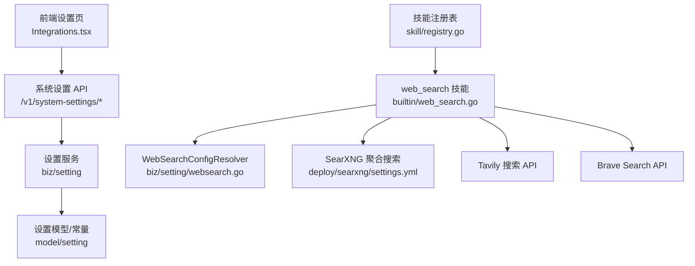
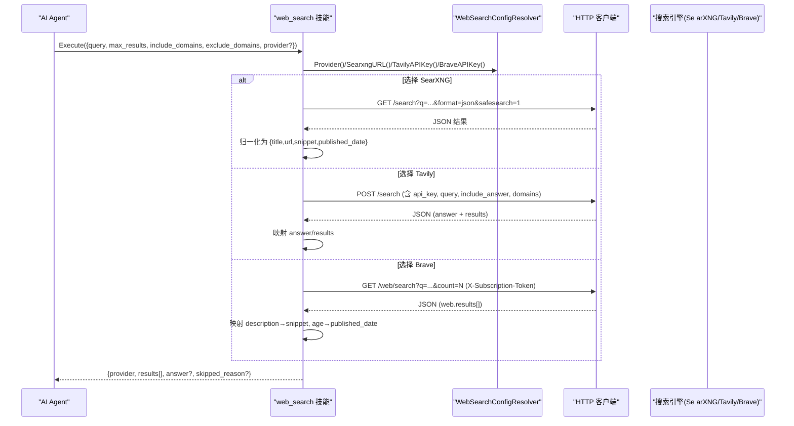
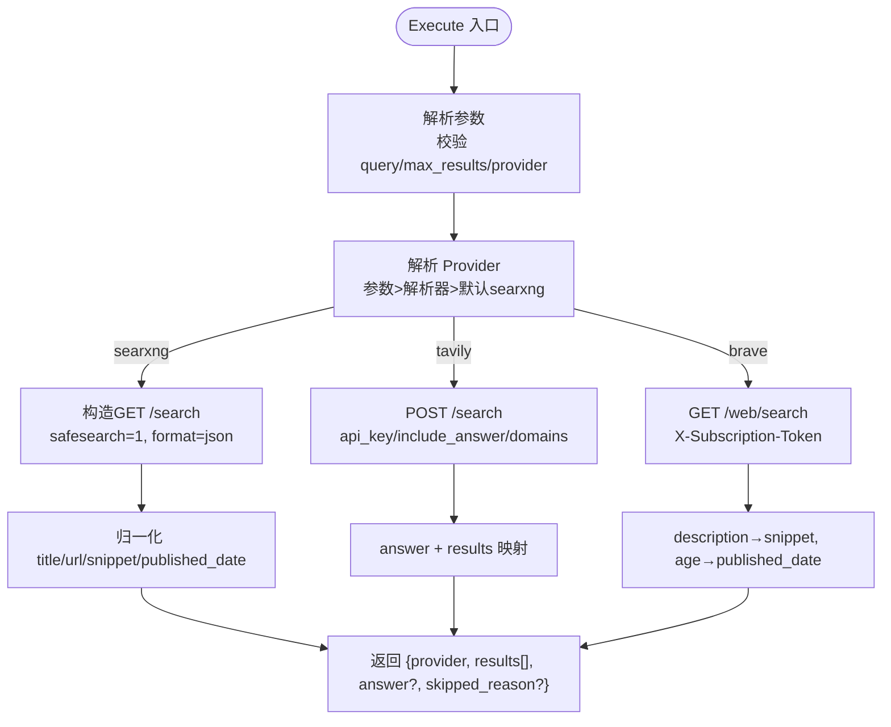
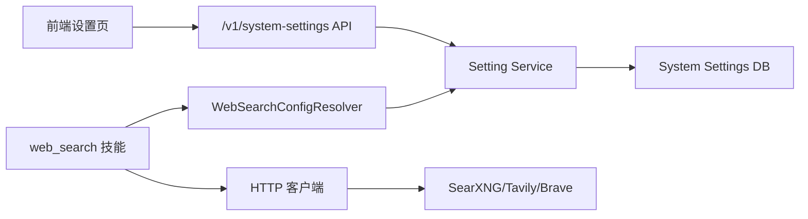

# 网络搜索集成

<cite>
**本文引用的文件**
- [web_search.go](file://internal/skill/builtin/web_search.go)
- [web_search_test.go](file://internal/skill/builtin/web_search_test.go)
- [websearch.go](file://internal/manager/biz/setting/websearch.go)
- [model.go](file://internal/manager/model/setting/model.go)
- [settings.yml](file://deploy/searxng/settings.yml)
- [Integrations.tsx](file://web/src/pages/settings/Integrations.tsx)
- [settings.ts](file://web/src/api/settings.ts)
- [http.go](file://internal/manager/server/setting/http.go)
- [registry.go](file://internal/skill/registry.go)
</cite>

## 目录
1. [简介](#简介)
2. [项目结构](#项目结构)
3. [核心组件](#核心组件)
4. [架构总览](#架构总览)
5. [详细组件分析](#详细组件分析)
6. [依赖关系分析](#依赖关系分析)
7. [性能与优化](#性能与优化)
8. [故障排查指南](#故障排查指南)
9. [结论](#结论)
10. [附录：配置示例与最佳实践](#附录配置示例与最佳实践)

## 简介
本技术文档围绕“联网搜索（web_search）”技能展开，系统性说明其配置管理、搜索引擎对接、连接测试、请求转发与结果格式化、与 AI Agent 的知识增强集成方式、相关性排序策略，以及性能与安全注意事项。该技能默认使用自托管的 SearXNG 聚合搜索（零密钥、零配额），同时支持 Tavily 与 Brave Search 作为可选商业后端；所有后端的调用形态统一，仅响应字段略有差异。

## 项目结构
- 技能实现与调度：internal/skill/builtin/web_search.go
- 设置解析器（Provider、SearXNG URL、API Key）：internal/manager/biz/setting/websearch.go
- 设置常量与默认值：internal/manager/model/setting/model.go
- SearXNG 内置配置：deploy/searxng/settings.yml
- 前端集成设置页与连接测试：web/src/pages/settings/Integrations.tsx
- 设置 API 客户端与路由：web/src/api/settings.ts、internal/manager/server/setting/http.go
- 技能注册中心：internal/skill/registry.go

**图表来源**
- [web_search.go:150-283](file://internal/skill/builtin/web_search.go#L150-L283)
- [websearch.go:1-94](file://internal/manager/biz/setting/websearch.go#L1-L94)
- [model.go:206-245](file://internal/manager/model/setting/model.go#L206-L245)
- [settings.yml:1-82](file://deploy/searxng/settings.yml#L1-L82)
- [Integrations.tsx:1837-1962](file://web/src/pages/settings/Integrations.tsx#L1837-L1962)
- [http.go:36-79](file://internal/manager/server/setting/http.go#L36-L79)
- [registry.go:10-47](file://internal/skill/registry.go#L10-L47)

**章节来源**
- [web_search.go:150-283](file://internal/skill/builtin/web_search.go#L150-L283)
- [websearch.go:1-94](file://internal/manager/biz/setting/websearch.go#L1-L94)
- [model.go:206-245](file://internal/manager/model/setting/model.go#L206-L245)
- [settings.yml:1-82](file://deploy/searxng/settings.yml#L1-L82)
- [Integrations.tsx:1837-1962](file://web/src/pages/settings/Integrations.tsx#L1837-L1962)
- [http.go:36-79](file://internal/manager/server/setting/http.go#L36-L79)
- [registry.go:10-47](file://internal/skill/registry.go#L10-L47)

## 核心组件
- web_search 技能：提供统一的搜索入口，支持多 Provider 分发、参数校验、结果归一化。
- WebSearchConfigResolver：从系统设置中读取 provider、SearXNG URL、Tavily/Brave API Key。
- 设置持久化与暴露：通过 /v1/system-settings 系列接口进行增删改查，敏感字段支持掩码与揭示。
- SearXNG 内置配置：启用 JSON 输出、安全搜索、引擎选择与出站超时等。
- 前端集成设置页：加载/保存设置、在线探测连通性并展示提供者与样例。

**章节来源**
- [web_search.go:161-283](file://internal/skill/builtin/web_search.go#L161-L283)
- [websearch.go:29-94](file://internal/manager/biz/setting/websearch.go#L29-L94)
- [http.go:36-79](file://internal/manager/server/setting/http.go#L36-L79)
- [settings.yml:50-82](file://deploy/searxng/settings.yml#L50-L82)
- [Integrations.tsx:1837-1962](file://web/src/pages/settings/Integrations.tsx#L1837-L1962)

## 架构总览
下图展示了从 AI Agent 调用 web_search 技能到最终返回结果的完整链路，包括配置解析、请求转发与结果归一化。

**图表来源**
- [web_search.go:225-283](file://internal/skill/builtin/web_search.go#L225-L283)
- [web_search.go:285-374](file://internal/skill/builtin/web_search.go#L285-L374)
- [web_search.go:389-455](file://internal/skill/builtin/web_search.go#L389-L455)
- [web_search.go:480-543](file://internal/skill/builtin/web_search.go#L480-L543)
- [websearch.go:40-94](file://internal/manager/biz/setting/websearch.go#L40-L94)

## 详细组件分析

### web_search 技能（统一入口与分发）
- 元数据与参数：
  - query（必填）、max_results（1~10，默认 5）、include_domains/exclude_domains（逗号分隔，仅 Tavily 生效）、provider（枚举：空/ searxng/tavily/brave）。
- 执行流程：
  - 解析参数并做边界限制（如 max_results 上限 10）。
  - Provider 优先级：显式参数 > 解析器默认 > 回退为 searxng。
  - 根据 provider 分派至对应子函数，统一封装为 {provider, results[], answer?, skipped_reason?}。
- 错误处理：
  - SearXNG 不可达或返回非 2xx：以 skipped_reason 软失败，便于 LLM 提示操作者修复。
  - Tavily/Brave 未配置 key：返回 skipped_reason，引导用户前往设置页面补齐。
  - 其他异常（如 429 限流）：直接返回 Go error。

**图表来源**
- [web_search.go:225-283](file://internal/skill/builtin/web_search.go#L225-L283)
- [web_search.go:285-374](file://internal/skill/builtin/web_search.go#L285-L374)
- [web_search.go:389-455](file://internal/skill/builtin/web_search.go#L389-L455)
- [web_search.go:480-543](file://internal/skill/builtin/web_search.go#L480-L543)

**章节来源**
- [web_search.go:161-283](file://internal/skill/builtin/web_search.go#L161-L283)
- [web_search.go:285-543](file://internal/skill/builtin/web_search.go#L285-L543)

### 设置解析器（Provider、SearXNG URL、API Key）
- Provider 选择规则（按优先级）：
  1) 显式 websearch.provider → 校验已知集合；未知则进入下一步。
  2) 若仅配置了 Tavily key → tavily（兼容历史安装）。
  3) 若仅配置了 Brave key → brave。
  4) 否则默认 searxng（零配置基线）。
- SearXNG URL：优先取设置项，缺失时回退到 docker 内部地址。
- API Key：Tavily/Brave 的 key 由设置服务读取，为空时触发 skipped_reason。

**章节来源**
- [websearch.go:29-94](file://internal/manager/biz/setting/websearch.go#L29-L94)
- [model.go:206-245](file://internal/manager/model/setting/model.go#L206-L245)

### SearXNG 内置配置
- 启用 JSON 输出格式，禁用 limiter 与 image proxy，设置安全搜索等级。
- 引擎选择：默认启用 bing、duckduckgo、brave；可开启中文友好引擎（baidu/sogou）。
- 出站超时：request_timeout 与 max_request_timeout 短于技能 30s 超时，避免悬挂请求。

**章节来源**
- [settings.yml:12-82](file://deploy/searxng/settings.yml#L12-L82)

### 前端集成设置页与连接测试
- 加载设置：按 category=websearch 拉取列表，敏感字段通过 reveal 接口获取明文。
- 保存设置：逐键写入，标记 sensitive=true 的字段走加密存储。
- 连接测试：调用 testWebSearchConnection 接口，返回当前 provider 与样例片段，用于验证连通性与配置有效性。

**章节来源**
- [Integrations.tsx:1837-1962](file://web/src/pages/settings/Integrations.tsx#L1837-L1962)
- [settings.ts:1-44](file://web/src/api/settings.ts#L1-L44)
- [http.go:36-79](file://internal/manager/server/setting/http.go#L36-L79)

### 与 AI Agent 的知识增强集成
- 技能注册：web_search 在 init 中注册到全局技能注册表，供 Manager 侧暴露为 LLM 工具。
- 调用契约：Agent 通过统一参数调用 web_search，得到标准化的结果结构，便于后续知识增强与回答生成。
- 结果字段稳定：title/url/snippet/published_date 保持 snake_case 稳定，便于提示词模板复用。

**章节来源**
- [registry.go:10-47](file://internal/skill/registry.go#L10-L47)
- [web_search.go:161-195](file://internal/skill/builtin/web_search.go#L161-L195)

## 依赖关系分析
- 技能层（builtin/web_search.go）依赖设置解析器（biz/setting/websearch.go）与 HTTP 客户端。
- 设置解析器依赖设置服务（biz/setting.Service）与模型常量（model/setting）。
- 前端通过 REST API 读写系统设置，敏感字段采用掩码+揭示机制。
- SearXNG 作为内嵌服务，通过 settings.yml 控制行为。

**图表来源**
- [web_search.go:150-283](file://internal/skill/builtin/web_search.go#L150-L283)
- [websearch.go:1-94](file://internal/manager/biz/setting/websearch.go#L1-L94)
- [http.go:36-79](file://internal/manager/server/setting/http.go#L36-L79)

**章节来源**
- [web_search.go:150-283](file://internal/skill/builtin/web_search.go#L150-L283)
- [websearch.go:1-94](file://internal/manager/biz/setting/websearch.go#L1-L94)
- [http.go:36-79](file://internal/manager/server/setting/http.go#L36-L79)

## 性能与优化
- 超时与预算：
  - 技能默认 HTTP 超时 30s；SearXNG 出站 request_timeout 5s、max_request_timeout 10s，确保快速失败与资源释放。
- 结果裁剪：
  - max_results 上限 10，减少下游处理与 LLM 上下文压力。
- 连接与重试：
  - SearXNG 不可达时以 skipped_reason 软失败，避免阻塞 Agent 主循环；商业 API 错误直接上抛，便于上层重试或降级。
- 并发与池化：
  - SearXNG 出站连接池 pool_connections/pool_maxsize 设置为 50，提升高并发下的吞吐能力。
- 缓存建议：
  - 对相同查询可在业务层引入短期缓存（如 5-10 分钟），降低重复请求成本。

[本节为通用指导，不直接分析具体文件]

## 故障排查指南
- SearXNG 不可达：
  - 现象：返回 skipped_reason，提示检查 docker-compose 是否启动 searxng 服务。
  - 处理：确认容器运行、网络可达；必要时切换 provider 为 Tavily/Brave。
- 商业 API 未配置 key：
  - 现象：返回 skipped_reason，提示前往设置页面补齐 key。
  - 处理：在“设置 → 集成 → 联网搜索”中填写对应 provider 的 API key。
- 搜索结果过少或为空：
  - 调整 query 关键词；适当增大 max_results；使用 include_domains/exclude_domains（Tavily）聚焦范围。
- 连接测试失败：
  - 在前端设置页点击“连接测试”，查看返回的 provider 与 sample；若报错，检查网络、代理与凭据。

**章节来源**
- [web_search.go:285-374](file://internal/skill/builtin/web_search.go#L285-L374)
- [web_search.go:389-455](file://internal/skill/builtin/web_search.go#L389-L455)
- [web_search.go:480-543](file://internal/skill/builtin/web_search.go#L480-L543)
- [Integrations.tsx:1837-1962](file://web/src/pages/settings/Integrations.tsx#L1837-L1962)

## 结论
web_search 技能提供了统一、可扩展的网络搜索能力，默认基于自托管 SearXNG，零配置即可工作；同时支持 Tavily 与 Brave Search 以满足更高要求场景。通过设置解析器与前端集成页，管理员可灵活选择 provider、配置域名过滤与关键凭据，并通过连接测试保障可用性。结合合理的超时、结果裁剪与缓存策略，可在保证安全的前提下获得良好的搜索性能与稳定性。

[本节为总结性内容，不直接分析具体文件]

## 附录：配置示例与最佳实践

### 配置项清单（category=websearch）
- provider：选择 searxng | tavily | brave（留空默认 searxng）
- searxng_url：SearXNG 实例地址（默认 http://searxng:8080）
- tavily_api_key：Tavily 搜索 API key（敏感）
- brave_api_key：Brave Search API key（敏感）

**章节来源**
- [model.go:206-245](file://internal/manager/model/setting/model.go#L206-L245)

### 不同搜索引擎对接示例
- SearXNG（零密钥）：
  - 无需额外配置，默认启用；如需自定义实例，设置 searxng_url。
  - 参考：[settings.yml:50-82](file://deploy/searxng/settings.yml#L50-L82)
- Tavily（商业）：
  - 设置 tavily_api_key；可通过 include_domains/exclude_domains 限定范围。
  - 参考：[web_search.go:389-455](file://internal/skill/builtin/web_search.go#L389-L455)
- Brave（商业）：
  - 设置 brave_api_key；通过 X-Subscription-Token 鉴权。
  - 参考：[web_search.go:480-543](file://internal/skill/builtin/web_search.go#L480-L543)

### 自定义搜索规则与过滤条件
- 参数级过滤：
  - include_domains/exclude_domains（逗号分隔，仅 Tavily 支持）。
  - max_results 限制返回数量（1~10）。
- Provider 级过滤：
  - SearXNG：通过 engines 配置启用/禁用上游引擎（如 baidu/sogou）。
  - 参考：[settings.yml:60-74](file://deploy/searxng/settings.yml#L60-L74)

**章节来源**
- [web_search.go:170-195](file://internal/skill/builtin/web_search.go#L170-L195)
- [settings.yml:60-74](file://deploy/searxng/settings.yml#L60-L74)

### 安全性考虑
- 敏感字段保护：
  - API key 等敏感设置通过 sensitive=true 存储，列表返回时掩码，需 reveal 才能查看明文。
  - 参考：[settings.ts:1-44](file://web/src/api/settings.ts#L1-L44)、[http.go:36-79](file://internal/manager/server/setting/http.go#L36-L79)
- 最小权限与访问控制：
  - 设置 API 受认证中间件保护，仅授权用户可修改。
- 出站安全：
  - SearXNG 禁用 limiter/image proxy，仅内网可达；设置安全头部（如 Referrer-Policy、X-Robots-Tag）。
  - 参考：[settings.yml:23-37](file://deploy/searxng/settings.yml#L23-L37)

**章节来源**
- [settings.ts:1-44](file://web/src/api/settings.ts#L1-L44)
- [http.go:36-79](file://internal/manager/server/setting/http.go#L36-L79)
- [settings.yml:23-37](file://deploy/searxng/settings.yml#L23-L37)