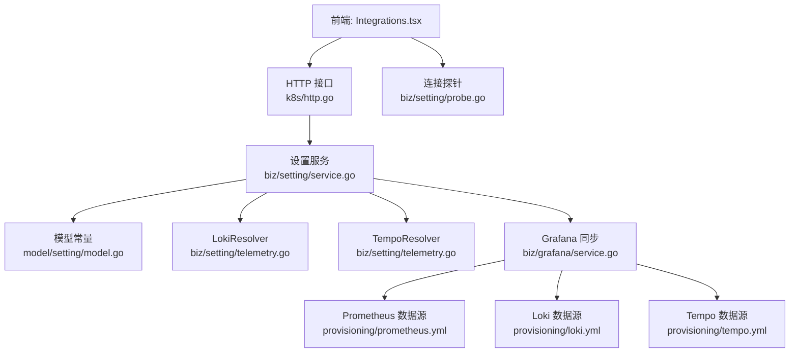
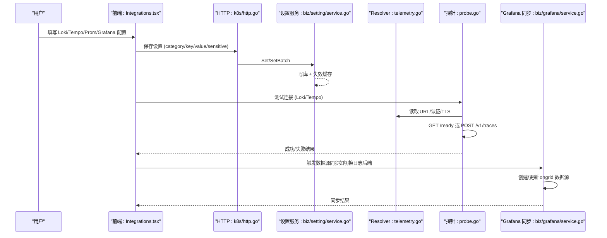
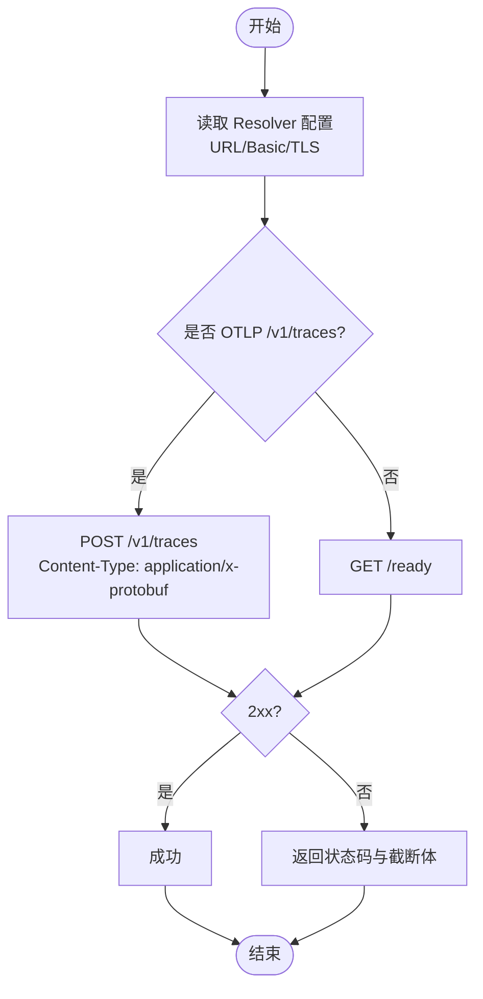
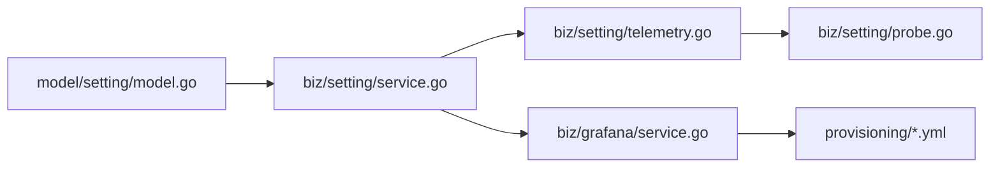

# 集成配置

<cite>
**本文引用的文件**
- [internal/manager/biz/setting/service.go](file://internal/manager/biz/setting/service.go)
- [internal/manager/biz/setting/telemetry.go](file://internal/manager/biz/setting/telemetry.go)
- [internal/manager/biz/setting/probe.go](file://internal/manager/biz/setting/probe.go)
- [internal/manager/model/setting/model.go](file://internal/manager/model/setting/model.go)
- [internal/manager/server/k8s/http.go](file://internal/manager/server/k8s/http.go)
- [internal/manager/biz/grafana/service.go](file://internal/manager/biz/grafana/service.go)
- [deploy/grafana/provisioning/datasources/prometheus.yml](file://deploy/grafana/provisioning/datasources/prometheus.yml)
- [deploy/grafana/provisioning/datasources/loki.yml](file://deploy/grafana/provisioning/datasources/loki.yml)
- [deploy/grafana/provisioning/datasources/tempo.yml](file://deploy/grafana/provisioning/datasources/tempo.yml)
- [web/src/pages/settings/Integrations.tsx](file://web/src/pages/settings/Integrations.tsx)
- [web/src/api/integrations.ts](file://web/src/api/integrations.ts)
- [tests/e2e/grafana_loki_datasource_test.go](file://tests/e2e/grafana_loki_datasource_test.go)
</cite>

## 目录
1. [简介](#简介)
2. [项目结构](#项目结构)
3. [核心组件](#核心组件)
4. [架构总览](#架构总览)
5. [详细组件分析](#详细组件分析)
6. [依赖关系分析](#依赖关系分析)
7. [性能考虑](#性能考虑)
8. [故障排查指南](#故障排查指南)
9. [结论](#结论)
10. [附录](#附录)

## 简介
本模块负责管理第三方可观测性集成的运行时配置，包括监控系统（Prometheus、Grafana）、日志系统（Loki）、追踪系统（Tempo）等。它提供：
- 统一的配置存储与解析（system_settings 键值表 + Resolver）
- 连接测试探针（/ready、OTLP HTTP 探测）
- 配置校验与持久化（含敏感字段掩码与批量原子写入）
- Grafana 数据源自动同步（Prometheus/Loki/Tempo）
- 前端集成配置表单、连接测试与可视化反馈
- 安全策略（TLS 跳过选项、Basic/Bearer 认证、敏感字段处理）

## 项目结构
后端以“设置服务 + 领域 Resolver + 探针”分层组织；前端通过设置页卡片统一编辑并触发后端测试与保存；部署侧通过 Grafana Provisioning 预置数据源，并由业务层在运行时同步更新。

图表来源
- [internal/manager/biz/setting/service.go:1-165](file://internal/manager/biz/setting/service.go#L1-L165)
- [internal/manager/biz/setting/telemetry.go:10-123](file://internal/manager/biz/setting/telemetry.go#L10-L123)
- [internal/manager/biz/setting/probe.go:17-106](file://internal/manager/biz/setting/probe.go#L17-L106)
- [internal/manager/biz/grafana/service.go:1-123](file://internal/manager/biz/grafana/service.go#L1-L123)
- [deploy/grafana/provisioning/datasources/prometheus.yml:1-11](file://deploy/grafana/provisioning/datasources/prometheus.yml#L1-L11)
- [deploy/grafana/provisioning/datasources/loki.yml:1-20](file://deploy/grafana/provisioning/datasources/loki.yml#L1-L20)
- [deploy/grafana/provisioning/datasources/tempo.yml:1-51](file://deploy/grafana/provisioning/datasources/tempo.yml#L1-L51)

章节来源
- [internal/manager/biz/setting/service.go:1-165](file://internal/manager/biz/setting/service.go#L1-L165)
- [internal/manager/model/setting/model.go:35-46](file://internal/manager/model/setting/model.go#L35-L46)

## 核心组件
- 设置服务（Setting Service）
  - 提供 Get/Set/SetBatch/List/Delete 能力，内置进程内缓存与敏感字段掩码。
  - 支持启动时 SetIfAbsent 注入环境变量默认值，避免覆盖人工编辑。
- 领域 Resolver（Loki/Tempo）
  - 从 system_settings 读取 URL、Basic 认证、TLS 跳过标志，并提供空值回退到环境默认。
- 连接探针（Probe）
  - LokiURLProbe：GET /ready，验证可达性与 Basic 认证。
  - TempoURLProbe：若 URL 以 /v1/traces 结尾则发送空 OTLP HTTP 请求；否则 GET /ready。
  - TempoReadinessProbe：针对查询端口的 /ready 探测。
  - WebSearchProbe：对 searxng/tavily/brave 发起最小查询，返回样本标题用于确认。
- Grafana 同步服务
  - 自动创建 ongrid 文件夹与 Prometheus/Loki/Tempo 数据源，并将 Prom 认证透传到 secureJsonData。
  - 支持 BootstrapEmbedded 为内置 Grafana 自动创建 SA 与 Token。
- 前端集成卡片
  - 提供表单、敏感字段揭示、保存、测试连接、查看 Grafana Explore 链接等功能。

章节来源
- [internal/manager/biz/setting/service.go:39-165](file://internal/manager/biz/setting/service.go#L39-L165)
- [internal/manager/biz/setting/telemetry.go:10-123](file://internal/manager/biz/setting/telemetry.go#L10-L123)
- [internal/manager/biz/setting/probe.go:17-106](file://internal/manager/biz/setting/probe.go#L17-L106)
- [internal/manager/biz/grafana/service.go:59-123](file://internal/manager/biz/grafana/service.go#L59-L123)
- [web/src/pages/settings/Integrations.tsx:1571-1700](file://web/src/pages/settings/Integrations.tsx#L1571-L1700)

## 架构总览
下图展示了从前端到后端的完整链路：用户在前端填写集成配置，调用后端保存；随后通过探针进行连通性测试；Grafana 数据源根据当前日志后端与监控配置自动同步。

图表来源
- [internal/manager/server/k8s/http.go:809-830](file://internal/manager/server/k8s/http.go#L809-L830)
- [internal/manager/biz/setting/service.go:108-165](file://internal/manager/biz/setting/service.go#L108-L165)
- [internal/manager/biz/setting/telemetry.go:42-123](file://internal/manager/biz/setting/telemetry.go#L42-L123)
- [internal/manager/biz/setting/probe.go:37-106](file://internal/manager/biz/setting/probe.go#L37-L106)
- [internal/manager/biz/grafana/service.go:229-262](file://internal/manager/biz/grafana/service.go#L229-L262)

## 详细组件分析

### 设置服务（Setting Service）
- 职责
  - 提供线程安全的 Get/Set/SetBatch/List/Delete 操作。
  - 列表响应中自动掩码敏感字段（保留首尾各4字符）。
  - 支持批量原子写入，避免部分持久化导致的脏状态。
  - 启动时 SetIfAbsent 注入环境变量默认值，不覆盖已有配置。
- 关键行为
  - 缓存键为 category|key，写操作后删除对应缓存项。
  - 对 CategoryAgent 的 key/value 进行额外校验。
- 复杂度
  - 读路径 O(1) 缓存命中；写路径 O(n) 批量处理。
- 优化点
  - 小表场景 map+RWMutex 优于 sync.Map。
  - 可通过 InvalidateAll 在极端情况下强制刷新缓存。

章节来源
- [internal/manager/biz/setting/service.go:49-165](file://internal/manager/biz/setting/service.go#L49-L165)
- [internal/manager/biz/setting/service.go:205-259](file://internal/manager/biz/setting/service.go#L205-L259)

### 领域 Resolver（Loki/Tempo）
- 职责
  - 从 system_settings 读取 URL、basic_user、basic_password、tls_insecure。
  - 当 DB 为空时回退到环境变量默认值（例如内置 Loki/Tempo）。
- 使用场景
  - Edge 插件推送目标选择（Loki 直推 vs manager nginx 转发）。
  - 前端“测试连接”按钮的连通性检查。
- 安全
  - basic_password 标记为敏感，列表响应会被掩码。
  - tls_insecure 仅在明确设置为 "true" 时生效。

章节来源
- [internal/manager/biz/setting/telemetry.go:10-123](file://internal/manager/biz/setting/telemetry.go#L10-L123)
- [internal/manager/model/setting/model.go:184-204](file://internal/manager/model/setting/model.go#L184-L204)

### 连接探针（Probe）
- LokiURLProbe
  - 行为：GET <url>/ready，携带 Basic 认证（可选），超时 5s。
  - 错误：网络不可达、认证失败、非 2xx。
- TempoURLProbe
  - 行为：若 URL 以 /v1/traces 结尾，发送空 OTLP HTTP 请求；否则 GET /ready。
  - 错误：同上，且包含 OTLP 路径校验。
- TempoReadinessProbe
  - 行为：针对查询端口 GET /ready（独立于 OTLP 接收器）。
- WebSearchProbe
  - 行为：按当前 provider 执行一次最小查询，返回 provider 名称与样本标题。
  - 支持 searxng/tavily/brave，分别构造不同请求。

图表来源
- [internal/manager/biz/setting/probe.go:51-106](file://internal/manager/biz/setting/probe.go#L51-L106)
- [internal/manager/biz/setting/probe.go:292-349](file://internal/manager/biz/setting/probe.go#L292-L349)

章节来源
- [internal/manager/biz/setting/probe.go:17-106](file://internal/manager/biz/setting/probe.go#L17-L106)
- [internal/manager/biz/setting/probe.go:281-349](file://internal/manager/biz/setting/probe.go#L281-L349)

### Grafana 数据源同步
- 自动创建 ongrid 文件夹与数据源（Prometheus/Loki/Tempo）。
- 将 Prometheus 认证（Bearer/Basic）透传到 secureJsonData，确保外部 Grafana 能访问同一 TSDB。
- 支持 BootstrapEmbedded：为内置 Grafana 自动创建 SA 与 Token，并持久化到 system_settings。
- 数据源定义由 provisioning YAML 预置，运行时由业务层 Upsert。

章节来源
- [internal/manager/biz/grafana/service.go:59-123](file://internal/manager/biz/grafana/service.go#L59-L123)
- [internal/manager/biz/grafana/service.go:229-262](file://internal/manager/biz/grafana/service.go#L229-L262)
- [deploy/grafana/provisioning/datasources/prometheus.yml:1-11](file://deploy/grafana/provisioning/datasources/prometheus.yml#L1-L11)
- [deploy/grafana/provisioning/datasources/loki.yml:1-20](file://deploy/grafana/provisioning/datasources/loki.yml#L1-L20)
- [deploy/grafana/provisioning/datasources/tempo.yml:1-51](file://deploy/grafana/provisioning/datasources/tempo.yml#L1-L51)

### 前端集成配置表单与交互
- 表单字段
  - Loki：url、basic_user、basic_password、tls_insecure。
  - Tempo：url、basic_user、basic_password、tls_insecure。
- 交互流程
  - 加载：拉取 category 下所有 key，敏感字段通过 reveal 接口获取明文。
  - 保存：逐个 key 调用 setSetting，标记 sensitive。
  - 测试连接：调用 testTempoConnection/testLokiConnection，展示成功/失败。
  - 跳转 Grafana：生成 Explore 链接（基于当前 orgId 与数据源 UID）。

章节来源
- [web/src/pages/settings/Integrations.tsx:1500-1700](file://web/src/pages/settings/Integrations.tsx#L1500-L1700)
- [web/src/api/integrations.ts:1-97](file://web/src/api/integrations.ts#L1-L97)

## 依赖关系分析
- 耦合与内聚
  - Setting Service 与 model 解耦，仅依赖 Repo 接口；Resolver 依赖 Service 读取配置。
  - Probe 依赖 Resolver 获取运行时配置，保持单一职责。
  - Grafana Service 依赖 Setting Service 读取 Prom/Loki 配置，并通过 pkg/grafana 客户端操作远端。
- 外部依赖
  - Grafana Provisioning YAML 提供初始数据源模板。
  - 外部服务（Loki/Tempo/Prometheus）通过 HTTP/OTLP 暴露健康或接收端点。
- 循环依赖
  - 未发现直接循环依赖；各层通过接口与常量解耦。

图表来源
- [internal/manager/model/setting/model.go:35-46](file://internal/manager/model/setting/model.go#L35-L46)
- [internal/manager/biz/setting/service.go:1-165](file://internal/manager/biz/setting/service.go#L1-L165)
- [internal/manager/biz/setting/telemetry.go:10-123](file://internal/manager/biz/setting/telemetry.go#L10-L123)
- [internal/manager/biz/setting/probe.go:17-106](file://internal/manager/biz/setting/probe.go#L17-L106)
- [internal/manager/biz/grafana/service.go:59-123](file://internal/manager/biz/grafana/service.go#L59-L123)
- [deploy/grafana/provisioning/datasources/prometheus.yml:1-11](file://deploy/grafana/provisioning/datasources/prometheus.yml#L1-L11)

章节来源
- [internal/manager/model/setting/model.go:35-46](file://internal/manager/model/setting/model.go#L35-L46)
- [internal/manager/biz/setting/service.go:1-165](file://internal/manager/biz/setting/service.go#L1-L165)
- [internal/manager/biz/grafana/service.go:59-123](file://internal/manager/biz/grafana/service.go#L59-L123)

## 性能考虑
- 设置服务
  - 进程内缓存减少 DB 往返；批量写入降低锁竞争。
  - 列表响应掩码开销低（字符串处理）。
- 探针
  - 短超时（5-8s）避免阻塞 UI；限制响应体大小防止大报文影响。
- Grafana 同步
  - 按需 Upsert 数据源，避免全量重建；HTTP 客户端复用与超时控制。

[本节为通用指导，不直接分析具体文件]

## 故障排查指南
- 连接测试失败
  - 检查 URL 是否正确（Loki 使用 /ready；Tempo 使用 /v1/traces 或 /ready）。
  - 检查 Basic 认证是否匹配；必要时启用 tls_insecure 以适配自签证书。
  - 观察探针返回的状态码与截断响应体，定位 401/403/5xx。
- Grafana 数据源未生效
  - 确认 provisioning YAML 中的 UID 与名称一致（如 ongrid-loki）。
  - 检查 Grafana 是否可访问；BootstrapEmbedded 是否已创建 SA/Token。
  - 确认 Prom 认证已正确透传到 secureJsonData。
- 配置未实时生效
  - 设置服务有缓存，修改后需等待下次读取或手动失效缓存。
  - Edge 插件通过轮询或推送机制重新加载配置。

章节来源
- [internal/manager/biz/setting/probe.go:292-349](file://internal/manager/biz/setting/probe.go#L292-L349)
- [tests/e2e/grafana_loki_datasource_test.go:31-150](file://tests/e2e/grafana_loki_datasource_test.go#L31-L150)
- [internal/manager/biz/grafana/service.go:139-190](file://internal/manager/biz/grafana/service.go#L139-L190)

## 结论
本模块通过统一的设置服务与领域 Resolver，结合轻量级探针与 Grafana 自动化同步，提供了开箱即用且可扩展的第三方集成配置能力。其设计强调安全性（敏感字段掩码、TLS 控制）、可靠性（超时与重试预算、原子写入）与可维护性（清晰的层次与常量命名）。新增集成只需扩展 Resolver、探针与前端卡片，即可快速接入。

[本节为总结，不直接分析具体文件]

## 附录

### 配置模板与参数说明
- Loki
  - url：Loki 基础地址（默认内置 loki:3100）
  - basic_user/basic_password：Basic 认证
  - tls_insecure：是否跳过 TLS 校验
- Tempo
  - url：OTLP HTTP 推送端点（如 /v1/traces）或查询端点
  - basic_user/basic_password：Basic 认证
  - tls_insecure：是否跳过 TLS 校验
- Prometheus
  - query_url/remote_write_url：查询与写入地址
  - bearer_token/basic_user/basic_password：认证
  - tls_insecure/tls_ca_pem：TLS 配置
- Grafana
  - root_url：根地址
  - sa_token/api_key：服务账户令牌或 API Key
  - org_id：组织 ID

章节来源
- [internal/manager/model/setting/model.go:151-204](file://internal/manager/model/setting/model.go#L151-L204)
- [deploy/grafana/provisioning/datasources/loki.yml:1-20](file://deploy/grafana/provisioning/datasources/loki.yml#L1-L20)
- [deploy/grafana/provisioning/datasources/tempo.yml:1-51](file://deploy/grafana/provisioning/datasources/tempo.yml#L1-L51)

### 添加新第三方集成的开发示例
- 步骤
  1. 在 model/setting/model.go 中定义新的 Category 与 Key 常量。
  2. 在 biz/setting/telemetry.go 中实现新的 Resolver（URL/Auth/TLSInsecure）。
  3. 在 biz/setting/probe.go 中实现对应的 Probe（/ready 或协议特定探测）。
  4. 在 web/src/pages/settings/Integrations.tsx 中添加卡片、表单字段、保存与测试逻辑。
  5. 如需 Grafana 集成，在 biz/grafana/service.go 中增加数据源同步逻辑，并在 provisioning YAML 中预置。
- 注意事项
  - 敏感字段需在保存时标记 sensitive，并在列表响应中掩码。
  - 探针应设置合理超时与响应体限制，避免阻塞与内存压力。
  - 前端文案与提示需国际化，错误信息应简洁可操作。

章节来源
- [internal/manager/model/setting/model.go:35-46](file://internal/manager/model/setting/model.go#L35-L46)
- [internal/manager/biz/setting/telemetry.go:10-123](file://internal/manager/biz/setting/telemetry.go#L10-L123)
- [internal/manager/biz/setting/probe.go:17-106](file://internal/manager/biz/setting/probe.go#L17-L106)
- [web/src/pages/settings/Integrations.tsx:1571-1700](file://web/src/pages/settings/Integrations.tsx#L1571-L1700)
- [internal/manager/biz/grafana/service.go:229-262](file://internal/manager/biz/grafana/service.go#L229-L262)