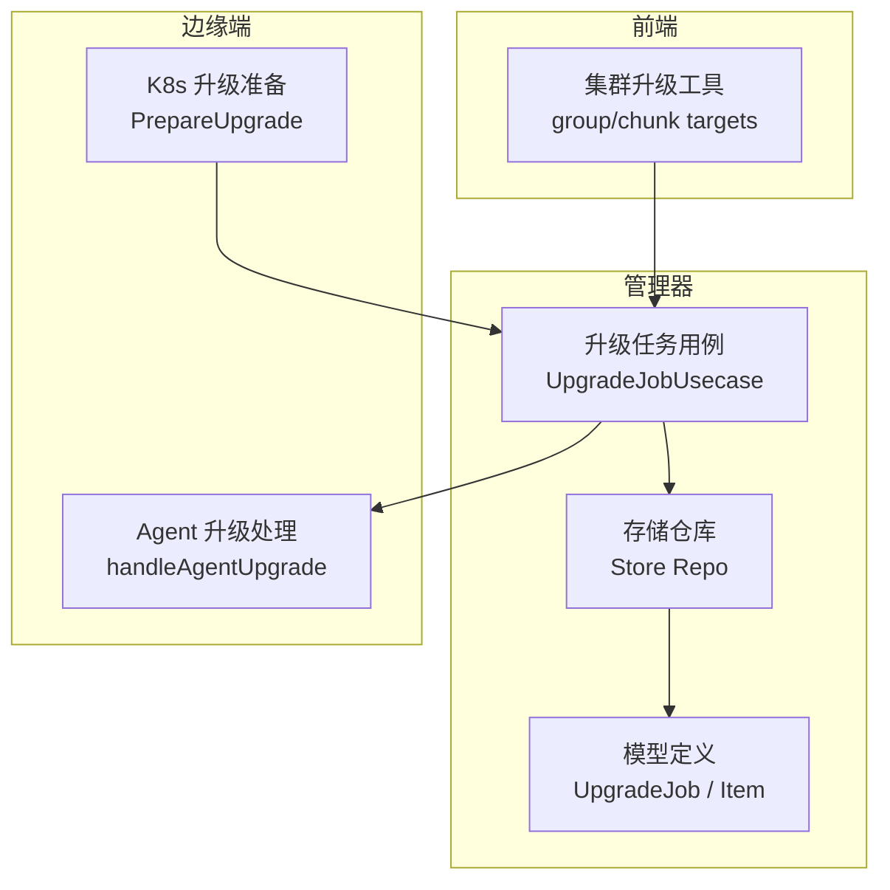
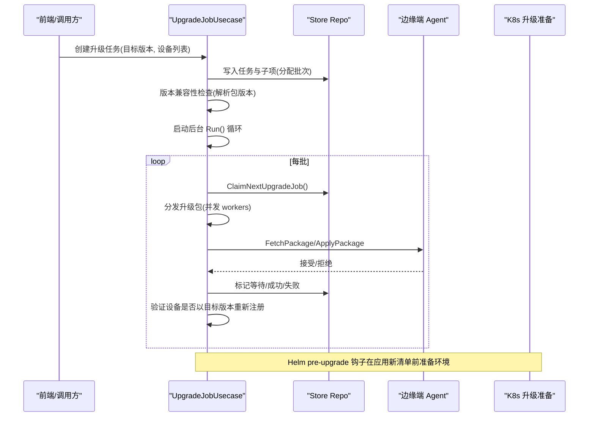
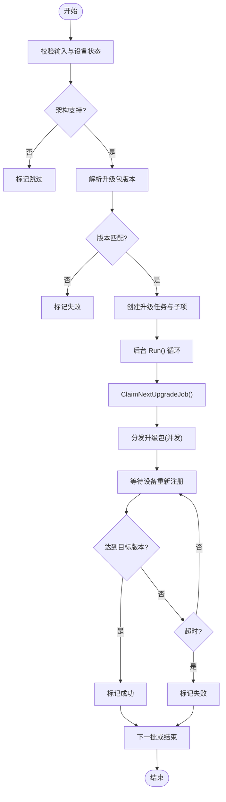
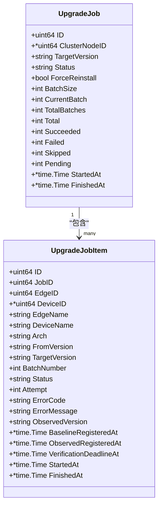
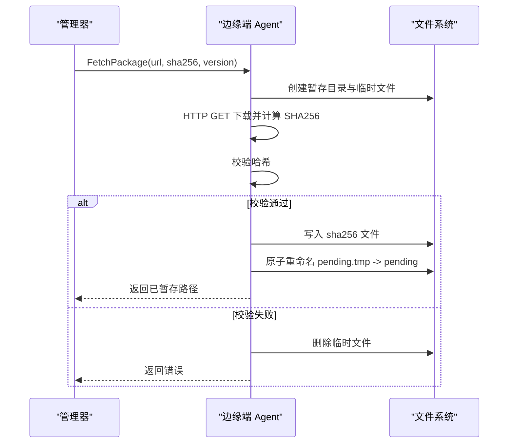
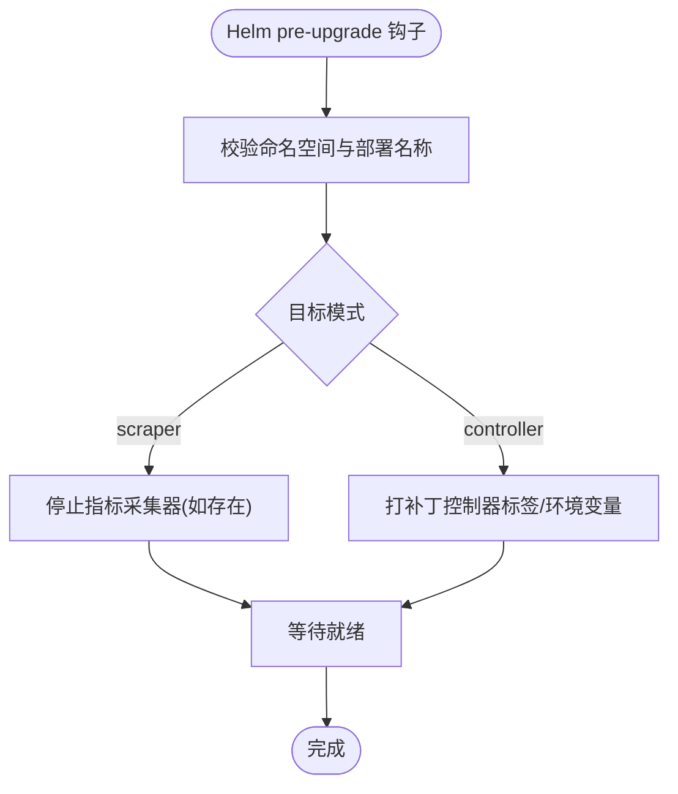
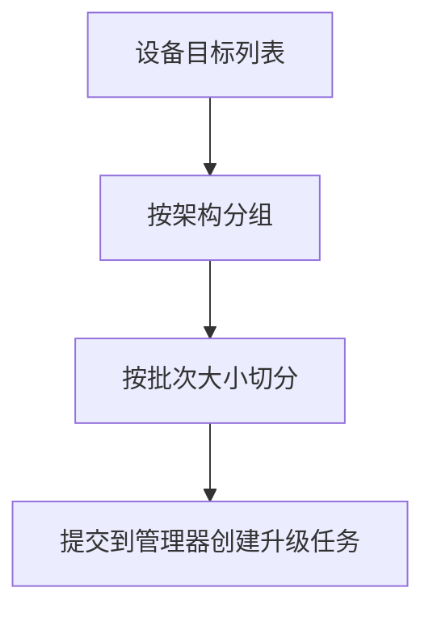
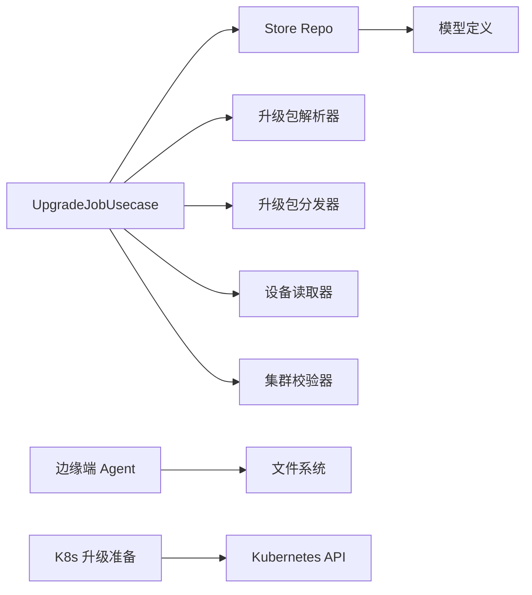

# 升级管理

<cite>
**本文引用的文件**
- [internal/manager/biz/edge/upgrade_job.go](file://internal/manager/biz/edge/upgrade_job.go)
- [internal/manager/model/edge/upgrade_job.go](file://internal/manager/model/edge/upgrade_job.go)
- [internal/manager/data/edge/store/upgrade_job.go](file://internal/manager/data/edge/store/upgrade_job.go)
- [internal/manager/biz/edge/upgrade_job_repo.go](file://internal/manager/biz/edge/upgrade_job_repo.go)
- [internal/edgeagent/biz/upgrade.go](file://internal/edgeagent/biz/upgrade.go)
- [cmd/ongrid-edge/k8s_upgrade.go](file://cmd/ongrid-edge/k8s_upgrade.go)
- [internal/edgeagent/k8s/upgrade_prepare.go](file://internal/edgeagent/k8s/upgrade_prepare.go)
- [web/src/pages/clusters/upgrade.ts](file://web/src/pages/clusters/upgrade.ts)
</cite>

## 目录
1. [简介](#简介)
2. [项目结构](#项目结构)
3. [核心组件](#核心组件)
4. [架构总览](#架构总览)
5. [详细组件分析](#详细组件分析)
6. [依赖关系分析](#依赖关系分析)
7. [性能考虑](#性能考虑)
8. [故障排查指南](#故障排查指南)
9. [结论](#结论)
10. [附录：扩展与开发示例](#附录：扩展与开发示例)

## 简介
本技术文档聚焦于集群升级管理子系统，覆盖以下关键主题：
- 升级计划构建、版本兼容性检查与升级包选择
- 批量升级流程、设备分组策略与升级进度跟踪
- 升级历史记录、回滚机制与失败处理
- 安全考量、性能优化与故障恢复策略
- 如何添加新的升级策略与扩展现有功能

该子系统以“任务（Job）+ 子项（Item）”的持久化状态机为核心，结合边缘端 Agent 的下载与切换逻辑，以及 Kubernetes 侧的 Helm 预升级准备，实现可观测、可重试、可回放的滚动升级。

## 项目结构
升级相关代码分布在管理器（Manager）、边缘端（EdgeAgent）、Kubernetes 侧准备脚本与前端编排工具中：
- 管理器业务层：负责创建升级任务、校验目标版本、分发升级包、验证升级结果、维护批次与进度
- 数据访问层：使用 GORM 持久化升级任务与子项，提供原子性状态迁移与并发控制
- 边缘端 Agent：负责下载升级包、校验 SHA256、原子替换并触发重启
- Kubernetes 侧：Helm pre-upgrade hook 在应用新清单前对控制器与指标采集器进行安全过渡
- 前端：按架构分组与分片目标设备，辅助批量升级操作

图表来源
- [internal/manager/biz/edge/upgrade_job.go:55-103](file://internal/manager/biz/edge/upgrade_job.go#L55-L103)
- [internal/manager/data/edge/store/upgrade_job.go:19-41](file://internal/manager/data/edge/store/upgrade_job.go#L19-L41)
- [internal/manager/model/edge/upgrade_job.go:23-78](file://internal/manager/model/edge/upgrade_job.go#L23-L78)
- [internal/edgeagent/biz/upgrade.go:19-35](file://internal/edgeagent/biz/upgrade.go#L19-L35)
- [internal/edgeagent/k8s/upgrade_prepare.go:20-41](file://internal/edgeagent/k8s/upgrade_prepare.go#L20-L41)
- [web/src/pages/clusters/upgrade.ts:152-179](file://web/src/pages/clusters/upgrade.ts#L152-L179)

章节来源
- [internal/manager/biz/edge/upgrade_job.go:55-103](file://internal/manager/biz/edge/upgrade_job.go#L55-L103)
- [internal/manager/data/edge/store/upgrade_job.go:19-41](file://internal/manager/data/edge/store/upgrade_job.go#L19-L41)
- [internal/manager/model/edge/upgrade_job.go:23-78](file://internal/manager/model/edge/upgrade_job.go#L23-L78)
- [internal/edgeagent/biz/upgrade.go:19-35](file://internal/edgeagent/biz/upgrade.go#L19-L35)
- [internal/edgeagent/k8s/upgrade_prepare.go:20-41](file://internal/edgeagent/k8s/upgrade_prepare.go#L20-L41)
- [web/src/pages/clusters/upgrade.ts:152-179](file://web/src/pages/clusters/upgrade.ts#L152-L179)

## 核心组件
- 升级任务用例（UpgradeJobUsecase）：编排升级生命周期，包括创建任务、分批调度、分发升级包、等待注册、超时与失败处理、重试与清理
- 存储仓库（Store Repo）：基于 GORM 的事务性状态机，保证 Job 与 Item 的一致性，支持并发抢占、恢复与清理
- 模型（Model）：定义升级任务与子项的状态常量、字段与表名
- 边缘端 Agent：接收升级指令，下载并校验升级包，原子替换并触发重启
- Kubernetes 升级准备：在 Helm 应用新清单前，调整控制器与指标采集器的运行模式，确保平滑过渡
- 前端工具：按架构分组与分片目标设备，便于批量升级

章节来源
- [internal/manager/biz/edge/upgrade_job.go:55-103](file://internal/manager/biz/edge/upgrade_job.go#L55-L103)
- [internal/manager/data/edge/store/upgrade_job.go:19-41](file://internal/manager/data/edge/store/upgrade_job.go#L19-L41)
- [internal/manager/model/edge/upgrade_job.go:5-21](file://internal/manager/model/edge/upgrade_job.go#L5-L21)
- [internal/edgeagent/biz/upgrade.go:19-35](file://internal/edgeagent/biz/upgrade.go#L19-L35)
- [internal/edgeagent/k8s/upgrade_prepare.go:20-41](file://internal/edgeagent/k8s/upgrade_prepare.go#L20-L41)
- [web/src/pages/clusters/upgrade.ts:152-179](file://web/src/pages/clusters/upgrade.ts#L152-L179)

## 架构总览
升级系统采用“管理器驱动 + 边缘端执行 + 数据库持久化”的分层架构：
- 管理器通过 UpgradeJobUsecase 创建升级任务，校验目标版本与集群拓扑，分配批次，并发分发升级包
- 存储层使用事务与行级锁保证并发安全，记录每个设备的升级历史与状态
- 边缘端 Agent 下载并校验升级包，原子替换二进制，触发重启完成升级
- Kubernetes 侧在 Helm 升级前进行环境准备，避免控制器与指标采集器之间的不兼容

图表来源
- [internal/manager/biz/edge/upgrade_job.go:301-338](file://internal/manager/biz/edge/upgrade_job.go#L301-L338)
- [internal/manager/data/edge/store/upgrade_job.go:98-133](file://internal/manager/data/edge/store/upgrade_job.go#L98-L133)
- [internal/edgeagent/biz/upgrade.go:35-154](file://internal/edgeagent/biz/upgrade.go#L35-L154)
- [internal/edgeagent/k8s/upgrade_prepare.go:32-141](file://internal/edgeagent/k8s/upgrade_prepare.go#L32-L141)

## 详细组件分析

### 升级任务用例（UpgradeJobUsecase）
职责与关键点：
- 创建任务：校验输入参数、设备在线状态、架构支持、目标版本一致性；可选集群拓扑校验
- 版本兼容性检查：对每种架构解析升级包，确保解析后的版本与目标一致
- 批量调度：按 BatchSize 将待升级设备划分为批次，逐批分发与验证
- 并发分发：workers 数量受配置限制，保护资源与网络带宽
- 验证与超时：等待设备以目标版本重新注册，超过阈值标记失败
- 重试与恢复：支持失败项重试，恢复中断的任务，清理过期记录

图表来源
- [internal/manager/biz/edge/upgrade_job.go:105-197](file://internal/manager/biz/edge/upgrade_job.go#L105-L197)
- [internal/manager/biz/edge/upgrade_job.go:365-429](file://internal/manager/biz/edge/upgrade_job.go#L365-L429)
- [internal/manager/biz/edge/upgrade_job.go:442-564](file://internal/manager/biz/edge/upgrade_job.go#L442-L564)
- [internal/manager/biz/edge/upgrade_job.go:573-631](file://internal/manager/biz/edge/upgrade_job.go#L573-L631)

章节来源
- [internal/manager/biz/edge/upgrade_job.go:105-197](file://internal/manager/biz/edge/upgrade_job.go#L105-L197)
- [internal/manager/biz/edge/upgrade_job.go:301-338](file://internal/manager/biz/edge/upgrade_job.go#L301-L338)
- [internal/manager/biz/edge/upgrade_job.go:365-429](file://internal/manager/biz/edge/upgrade_job.go#L365-L429)
- [internal/manager/biz/edge/upgrade_job.go:442-564](file://internal/manager/biz/edge/upgrade_job.go#L442-L564)
- [internal/manager/biz/edge/upgrade_job.go:573-631](file://internal/manager/biz/edge/upgrade_job.go#L573-L631)

### 存储仓库（Store Repo）
职责与关键点：
- 任务与子项的持久化：创建时计算总数、成功/失败/跳过/待处理计数，分配批次号
- 并发抢占：使用 UPDATE 锁定与条件更新，防止重复领取任务
- 状态迁移：原子更新子项状态，记录尝试次数、错误码、基线注册时间、观察到的版本与时间
- 恢复与重试：服务重启后恢复中断的任务；支持针对失败项的重试，重置批次与状态
- 清理：定期删除已完成且过期的任务与子项

图表来源
- [internal/manager/model/edge/upgrade_job.go:23-78](file://internal/manager/model/edge/upgrade_job.go#L23-L78)

章节来源
- [internal/manager/data/edge/store/upgrade_job.go:19-41](file://internal/manager/data/edge/store/upgrade_job.go#L19-L41)
- [internal/manager/data/edge/store/upgrade_job.go:98-133](file://internal/manager/data/edge/store/upgrade_job.go#L98-L133)
- [internal/manager/data/edge/store/upgrade_job.go:163-238](file://internal/manager/data/edge/store/upgrade_job.go#L163-L238)
- [internal/manager/data/edge/store/upgrade_job.go:240-314](file://internal/manager/data/edge/store/upgrade_job.go#L240-L314)
- [internal/manager/data/edge/store/upgrade_job.go:316-408](file://internal/manager/data/edge/store/upgrade_job.go#L316-L408)
- [internal/manager/data/edge/store/upgrade_job.go:421-441](file://internal/manager/data/edge/store/upgrade_job.go#L421-L441)

### 边缘端 Agent 升级处理
职责与关键点：
- 下载升级包到暂存目录，边下载边计算 SHA256
- 校验哈希，不一致则丢弃临时文件
- 原子重命名 pending.tmp 为 pending，并写入配套 sha256 文件
- 通知主循环退出，由 systemd 在重启时替换二进制
- 失败保持粘性：任何错误不会留下 pending，确保旧版本继续运行

图表来源
- [internal/edgeagent/biz/upgrade.go:35-154](file://internal/edgeagent/biz/upgrade.go#L35-L154)

章节来源
- [internal/edgeagent/biz/upgrade.go:35-154](file://internal/edgeagent/biz/upgrade.go#L35-L154)

### Kubernetes 升级准备（Helm pre-upgrade）
职责与关键点：
- 在应用新清单前，安全地停止或调整指标采集器与控制器
- 根据目标模式设置标签与环境变量，确保新旧组件共存期间的通信稳定
- 轮询等待 Deployment 就绪，避免部分升级导致的服务中断

图表来源
- [internal/edgeagent/k8s/upgrade_prepare.go:32-141](file://internal/edgeagent/k8s/upgrade_prepare.go#L32-L141)
- [cmd/ongrid-edge/k8s_upgrade.go:14-44](file://cmd/ongrid-edge/k8s_upgrade.go#L14-L44)

章节来源
- [internal/edgeagent/k8s/upgrade_prepare.go:32-141](file://internal/edgeagent/k8s/upgrade_prepare.go#L32-L141)
- [cmd/ongrid-edge/k8s_upgrade.go:14-44](file://cmd/ongrid-edge/k8s_upgrade.go#L14-L44)

### 前端批量升级工具
职责与关键点：
- 按架构分组目标设备，确保同一批次内架构一致
- 将目标设备切分为固定大小的批次，便于后端批量处理
- 选择更优设备（在线优先、最近活跃）作为升级候选

图表来源
- [web/src/pages/clusters/upgrade.ts:135-186](file://web/src/pages/clusters/upgrade.ts#L135-L186)

章节来源
- [web/src/pages/clusters/upgrade.ts:135-186](file://web/src/pages/clusters/upgrade.ts#L135-L186)

## 依赖关系分析
- 管理器业务层依赖存储仓库、设备读取器、集群校验器、升级包分发器与解析器
- 存储仓库依赖 GORM 与模型定义，提供事务性与并发控制
- 边缘端 Agent 依赖文件系统与 HTTP 客户端，负责下载与校验
- Kubernetes 升级准备依赖 Kubernetes API 客户端，进行 Deployment 的补丁与轮询

图表来源
- [internal/manager/biz/edge/upgrade_job.go:21-36](file://internal/manager/biz/edge/upgrade_job.go#L21-L36)
- [internal/manager/biz/edge/upgrade_job_repo.go:22-43](file://internal/manager/biz/edge/upgrade_job_repo.go#L22-L43)
- [internal/manager/model/edge/upgrade_job.go:23-78](file://internal/manager/model/edge/upgrade_job.go#L23-L78)
- [internal/edgeagent/biz/upgrade.go:35-154](file://internal/edgeagent/biz/upgrade.go#L35-L154)
- [internal/edgeagent/k8s/upgrade_prepare.go:32-141](file://internal/edgeagent/k8s/upgrade_prepare.go#L32-L141)

章节来源
- [internal/manager/biz/edge/upgrade_job.go:21-36](file://internal/manager/biz/edge/upgrade_job.go#L21-L36)
- [internal/manager/biz/edge/upgrade_job_repo.go:22-43](file://internal/manager/biz/edge/upgrade_job_repo.go#L22-L43)
- [internal/manager/model/edge/upgrade_job.go:23-78](file://internal/manager/model/edge/upgrade_job.go#L23-L78)
- [internal/edgeagent/biz/upgrade.go:35-154](file://internal/edgeagent/biz/upgrade.go#L35-L154)
- [internal/edgeagent/k8s/upgrade_prepare.go:32-141](file://internal/edgeagent/k8s/upgrade_prepare.go#L32-L141)

## 性能考虑
- 并发控制：workers 数量受配置限制，默认值合理，避免过载
- 批次大小：默认批次大小适中，可按集群规模调整
- 网络与磁盘：边缘端下载使用长超时与流式写入，减少内存占用；SHA256 校验在写入过程中并行计算
- 数据库锁：使用行级锁与条件更新，避免竞态与重复处理
- 清理策略：定期删除已完成且过期的任务，降低存储压力

[本节为通用指导，无需特定文件引用]

## 故障排查指南
常见问题与定位方法：
- 设备离线或架构不支持：创建任务时被标记为跳过，检查设备状态与架构映射
- 版本不匹配：解析升级包后版本与目标不一致，检查包发布与版本对齐
- 分发失败：FetchPackage/ApplyPackage 返回错误，检查网络与边缘端权限
- 验证超时：设备未在截止时间前以目标版本重新注册，检查升级包是否被正确应用与重启
- 任务中断：服务重启后自动恢复，检查是否有处于 dispatching 状态的任务被重置为 queued

章节来源
- [internal/manager/biz/edge/upgrade_job.go:105-197](file://internal/manager/biz/edge/upgrade_job.go#L105-L197)
- [internal/manager/biz/edge/upgrade_job.go:491-564](file://internal/manager/biz/edge/upgrade_job.go#L491-L564)
- [internal/manager/biz/edge/upgrade_job.go:573-631](file://internal/manager/biz/edge/upgrade_job.go#L573-L631)
- [internal/manager/data/edge/store/upgrade_job.go:316-331](file://internal/manager/data/edge/store/upgrade_job.go#L316-L331)

## 结论
升级管理系统通过清晰的状态机、严格的版本校验与安全的边缘端切换机制，实现了可靠、可观测、可重试的集群升级。结合 Kubernetes 侧的预升级准备，确保了控制器与指标采集器的平滑过渡。建议在生产环境中合理配置批次大小与并发度，并建立完善的监控与告警机制，以保障升级过程的安全与稳定。

[本节为总结，无需特定文件引用]

## 附录：扩展与开发示例

### 添加新的升级策略
- 定义新的升级包解析器接口实现，支持新的包格式或来源
- 在 UpgradeJobUsecase 中集成新的解析器，并在创建任务时进行版本兼容性检查
- 扩展分发器接口，支持新的分发方式（如本地缓存、CDN 等）

章节来源
- [internal/manager/biz/edge/upgrade_job.go:21-28](file://internal/manager/biz/edge/upgrade_job.go#L21-L28)
- [internal/manager/biz/edge/upgrade_job.go:175-183](file://internal/manager/biz/edge/upgrade_job.go#L175-L183)

### 扩展现有升级功能
- 增加新的设备分组策略：在前端按更多维度（如地域、机型）分组，提升升级成功率
- 增强失败处理：增加自动回滚策略，当失败率超过阈值时自动回退到上一版本
- 提升可观测性：增加详细的指标与日志，便于问题定位与性能优化

章节来源
- [web/src/pages/clusters/upgrade.ts:152-179](file://web/src/pages/clusters/upgrade.ts#L152-L179)
- [internal/manager/data/edge/store/upgrade_job.go:421-441](file://internal/manager/data/edge/store/upgrade_job.go#L421-L441)

### 升级安全考虑
- 使用 SHA256 校验升级包，防止篡改与损坏
- 原子替换二进制，确保升级过程的幂等性与一致性
- 限制升级包的来源与权限，仅允许可信的 URL 与目录

章节来源
- [internal/edgeagent/biz/upgrade.go:41-53](file://internal/edgeagent/biz/upgrade.go#L41-L53)
- [internal/edgeagent/biz/upgrade.go:119-138](file://internal/edgeagent/biz/upgrade.go#L119-L138)

### 性能优化建议
- 调整批次大小与并发度，平衡升级速度与稳定性
- 使用 CDN 或本地缓存加速升级包下载
- 优化数据库查询与索引，提升任务处理效率

[本节为通用指导，无需特定文件引用]

### 故障恢复策略
- 服务重启后自动恢复中断的任务，确保升级过程不丢失
- 支持失败项重试，保留原始基线信息，避免重复升级
- 定期清理已完成的任务，释放存储空间

章节来源
- [internal/manager/data/edge/store/upgrade_job.go:316-331](file://internal/manager/data/edge/store/upgrade_job.go#L316-L331)
- [internal/manager/data/edge/store/upgrade_job.go:333-408](file://internal/manager/data/edge/store/upgrade_job.go#L333-L408)
- [internal/manager/data/edge/store/upgrade_job.go:421-441](file://internal/manager/data/edge/store/upgrade_job.go#L421-L441)