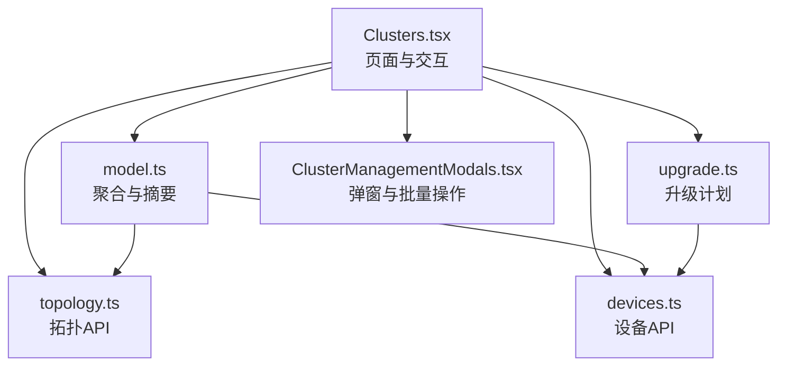
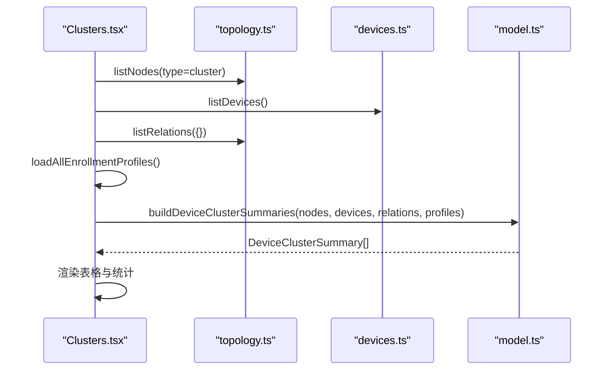
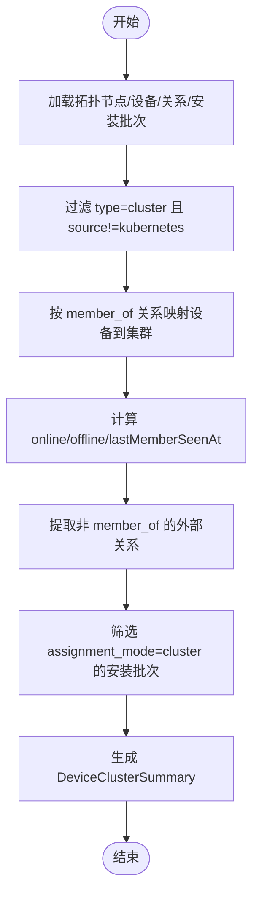
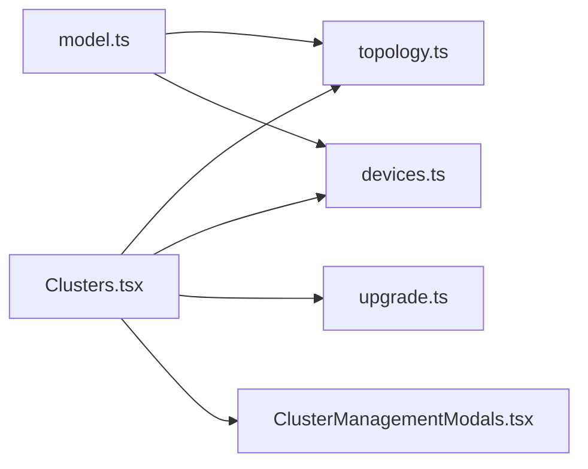

# 集群列表管理

<cite>
**本文引用的文件**
- [Clusters.tsx](file://web/src/pages/Clusters.tsx)
- [model.ts](file://web/src/pages/clusters/model.ts)
- [upgrade.ts](file://web/src/pages/clusters/upgrade.ts)
- [topology.ts](file://web/src/api/topology.ts)
- [devices.ts](file://web/src/api/devices.ts)
- [ClusterManagementModals.tsx](file://web/src/pages/clusters/ClusterManagementModals.tsx)
</cite>

## 目录
1. [简介](#简介)
2. [项目结构](#项目结构)
3. [核心组件](#核心组件)
4. [架构总览](#架构总览)
5. [详细组件分析](#详细组件分析)
6. [依赖关系分析](#依赖关系分析)
7. [性能考虑](#性能考虑)
8. [故障排查指南](#故障排查指南)
9. [结论](#结论)
10. [附录：扩展与示例](#附录：扩展与示例)

## 简介
本技术文档围绕“设备集群”列表页面的功能与实现，系统性说明以下要点：
- 数据加载：拓扑节点、设备清单、拓扑关系、安装批次等数据的并发获取与组装。
- 状态展示：在线/离线统计、最近活动时间、安装批次有效性、拓扑外部连接数。
- 搜索过滤：基于集群名称的本地过滤。
- 批量操作：创建、删除、重命名、添加成员、批量升级等能力。
- 聚合逻辑：设备到集群的归属映射、成员统计计算、健康状态评估。
- 拓扑关系处理：成员关系与外部关系的区分、外部连接的显示机制。
- 开发示例：如何新增筛选条件、扩展现有展示字段。
- 性能优化与用户体验改进建议。

## 项目结构
与集群列表相关的代码主要位于前端页面与模型层：
- 页面入口与交互：web/src/pages/Clusters.tsx
- 数据聚合与模型：web/src/pages/clusters/model.ts
- 升级计划与批处理：web/src/pages/clusters/upgrade.ts
- 拓扑 API：web/src/api/topology.ts
- 设备 API：web/src/api/devices.ts
- 弹窗与批量操作：web/src/pages/clusters/ClusterManagementModals.tsx

图表来源
- [Clusters.tsx:85-116](file://web/src/pages/Clusters.tsx#L85-L116)
- [model.ts:21-77](file://web/src/pages/clusters/model.ts#L21-L77)
- [topology.ts:23-35](file://web/src/api/topology.ts#L23-L35)
- [devices.ts:162-167](file://web/src/api/devices.ts#L162-L167)
- [upgrade.ts:49-98](file://web/src/pages/clusters/upgrade.ts#L49-L98)
- [ClusterManagementModals.tsx:21-63](file://web/src/pages/clusters/ClusterManagementModals.tsx#L21-L63)

章节来源
- [Clusters.tsx:69-128](file://web/src/pages/Clusters.tsx#L69-L128)
- [model.ts:1-111](file://web/src/pages/clusters/model.ts#L1-L111)
- [topology.ts:1-227](file://web/src/api/topology.ts#L1-L227)
- [devices.ts:1-198](file://web/src/api/devices.ts#L1-L198)
- [upgrade.ts:1-220](file://web/src/pages/clusters/upgrade.ts#L1-L220)
- [ClusterManagementModals.tsx:1-200](file://web/src/pages/clusters/ClusterManagementModals.tsx#L1-L200)

## 核心组件
- 页面组件 ClustersPage：负责数据加载、搜索、错误提示、空态展示、列表渲染与批量操作入口。
- 模型模块 model.ts：定义 DeviceClusterSummary，实现 buildDeviceClusterSummaries 聚合函数，完成设备到集群的归属映射、成员统计、外部关系提取、活跃安装批次计数、最近成员活动时间计算。
- 拓扑 API topology.ts：提供节点与关系的增删改查，支持按类型、ID、方向等参数查询。
- 设备 API devices.ts：提供设备清单与详情，包含在线状态、最后在线时间等。
- 升级模块 upgrade.ts：构建集群升级计划，选择主机 Edge、版本比较、包架构归一化、目标分组与分批。
- 弹窗模块 ClusterManagementModals.tsx：提供新建、重命名、删除、添加成员等交互。

章节来源
- [Clusters.tsx:69-128](file://web/src/pages/Clusters.tsx#L69-L128)
- [model.ts:5-111](file://web/src/pages/clusters/model.ts#L5-L111)
- [topology.ts:23-102](file://web/src/api/topology.ts#L23-L102)
- [devices.ts:5-34](file://web/src/api/devices.ts#L5-L34)
- [upgrade.ts:6-26](file://web/src/pages/clusters/upgrade.ts#L6-L26)
- [ClusterManagementModals.tsx:21-63](file://web/src/pages/clusters/ClusterManagementModals.tsx#L21-L63)

## 架构总览
集群列表的数据流遵循“并发拉取 -> 内存聚合 -> 视图渲染”的模式：
- 页面在初始化时并发请求拓扑节点（类型为 cluster）、设备清单、所有拓扑关系、安装批次。
- 使用 model.ts 中的聚合函数将原始数据转换为 DeviceClusterSummary 列表。
- 列表渲染时根据搜索词进行本地过滤，并展示成员数量、在线/离线状态、安装批次有效性、外部拓扑连接数、最近活动时间和更新时间。
- 删除集群前校验是否存在成员关系、外部关系或有效安装批次，避免脏数据。

图表来源
- [Clusters.tsx:85-116](file://web/src/pages/Clusters.tsx#L85-L116)
- [topology.ts:23-35](file://web/src/api/topology.ts#L23-L35)
- [devices.ts:162-167](file://web/src/api/devices.ts#L162-L167)
- [model.ts:21-77](file://web/src/pages/clusters/model.ts#L21-L77)

章节来源
- [Clusters.tsx:85-116](file://web/src/pages/Clusters.tsx#L85-L116)
- [model.ts:21-77](file://web/src/pages/clusters/model.ts#L21-L77)

## 详细组件分析

### 数据加载与状态展示
- 并发加载：通过 Promise.all 同时获取拓扑节点、设备清单、拓扑关系与安装批次，减少首屏等待时间。
- 聚合结果：buildDeviceClusterSummaries 输出每个集群的成员列表、成员关系、外部关系、活跃安装批次数量、在线/离线计数、最近成员活动时间。
- 状态展示：
  - 成员数量：members.length
  - 健康状态：online/offline 计数
  - 安装批次：activeProfiles / profiles.length
  - 拓扑连接：externalRelations.length
  - 最近活动：relativeTime(lastMemberSeenAt)
  - 更新时间：relativeTime(cluster.updated_at)

章节来源
- [Clusters.tsx:85-116](file://web/src/pages/Clusters.tsx#L85-L116)
- [Clusters.tsx:237-279](file://web/src/pages/Clusters.tsx#L237-L279)
- [model.ts:21-77](file://web/src/pages/clusters/model.ts#L21-L77)

### 搜索与过滤
- 搜索逻辑：对 summaries 进行本地过滤，匹配集群名称（不区分大小写）。
- 性能考量：当前为全量内存过滤；若未来数据量增大，可考虑服务端分页与模糊搜索。

章节来源
- [Clusters.tsx:122-128](file://web/src/pages/Clusters.tsx#L122-L128)

### 设备集群的聚合逻辑
- 设备到集群的归属：通过 member_of 关系将设备 node_id 映射到集群 id，再反查设备信息。
- 成员统计：members 长度即为成员数；online 为 members 中 online=true 的数量；offline = members.length - online。
- 健康状态评估：基于设备的 online 字段与 last_seen_at/updated_at 计算最近成员活动时间。
- 外部关系：排除 member_of 类型的关系后，剩余与集群有关联的关系视为外部连接。

图表来源
- [model.ts:21-77](file://web/src/pages/clusters/model.ts#L21-L77)
- [model.ts:79-86](file://web/src/pages/clusters/model.ts#L79-L86)
- [model.ts:88-104](file://web/src/pages/clusters/model.ts#L88-L104)

章节来源
- [model.ts:21-111](file://web/src/pages/clusters/model.ts#L21-L111)

### 拓扑关系数据处理与外部连接显示
- 成员关系：type="member_of"，dst_id 指向集群，src_id 指向设备节点。
- 外部关系：与集群有关联但非 member_of 的关系，用于展示集群与其他拓扑节点的连接数量。
- 显示机制：在列表行中展示 externalRelations.length，并在详情页中列出具体关系。

章节来源
- [model.ts:35-46](file://web/src/pages/clusters/model.ts#L35-L46)
- [Clusters.tsx:384-395](file://web/src/pages/Clusters.tsx#L384-L395)
- [topology.ts:51-85](file://web/src/api/topology.ts#L51-L85)

### 批量操作与弹窗
- 创建集群：CreateDeviceClusterModal 调用 createNode，设置 type=cluster，source=manual，可选 description。
- 重命名集群：RenameDeviceClusterModal 调用 updateNode。
- 删除集群：删除前检查是否仍有成员关系、外部关系或有效安装批次，阻止不安全删除。
- 添加成员：AddClusterMembersModal 通过 createRelation 建立 member_of 关系。
- 批量升级：ClusterBatchUpgradeModal 结合 upgrade.ts 的升级计划与分批策略执行。

章节来源
- [ClusterManagementModals.tsx:21-63](file://web/src/pages/clusters/ClusterManagementModals.tsx#L21-L63)
- [ClusterManagementModals.tsx:121-155](file://web/src/pages/clusters/ClusterManagementModals.tsx#L121-L155)
- [Clusters.tsx:136-157](file://web/src/pages/Clusters.tsx#L136-L157)
- [upgrade.ts:49-98](file://web/src/pages/clusters/upgrade.ts#L49-L98)

### 升级计划与批处理
- 主机 Edge 选择：selectClusterHostEdges 为每个设备选择更优的 Edge（优先在线、心跳更新）。
- 升级目标分类：buildClusterUpgradePlan 将设备分为 targets/upToDate/missingBundle/offline/unlinked/unsupported。
- 版本比较：versionsEqual 规范化版本号并比较。
- 包架构归一化：normalizeUpgradePackageArch 将不同 OS/arch 映射为标准包架构。
- 分批执行：chunkUpgradeTargets 将目标按固定大小分批，便于后端处理与进度跟踪。

章节来源
- [upgrade.ts:38-47](file://web/src/pages/clusters/upgrade.ts#L38-L47)
- [upgrade.ts:49-98](file://web/src/pages/clusters/upgrade.ts#L49-L98)
- [upgrade.ts:118-127](file://web/src/pages/clusters/upgrade.ts#L118-L127)
- [upgrade.ts:129-150](file://web/src/pages/clusters/upgrade.ts#L129-L150)
- [upgrade.ts:167-179](file://web/src/pages/clusters/upgrade.ts#L167-L179)

## 依赖关系分析
- 页面依赖：
  - topology.ts：节点与关系 CRUD，支撑集群与拓扑关系展示。
  - devices.ts：设备清单与在线状态，支撑成员统计与健康评估。
  - upgrade.ts：升级计划与分批，支撑批量升级流程。
  - ClusterManagementModals.tsx：弹窗封装，统一交互与错误处理。
- 模型依赖：
  - model.ts：聚合逻辑强依赖 topology 与 devices 的类型定义，确保数据结构一致。

图表来源
- [Clusters.tsx:17-36](file://web/src/pages/Clusters.tsx#L17-L36)
- [model.ts:1-3](file://web/src/pages/clusters/model.ts#L1-L3)

章节来源
- [Clusters.tsx:17-36](file://web/src/pages/Clusters.tsx#L17-L36)
- [model.ts:1-3](file://web/src/pages/clusters/model.ts#L1-L3)

## 性能考虑
- 并发请求：使用 Promise.all 并行获取拓扑、设备、关系与安装批次，降低首屏延迟。
- 内存聚合：在客户端进行聚合与排序，避免多次往返；注意大数据量时的内存占用。
- 本地搜索：当前为字符串包含匹配，适合中小规模数据；大规模时可引入服务端搜索与分页。
- 升级分批：chunkUpgradeTargets 限制单次批量大小，避免后端压力过大。
- 缓存建议：对静态或低频变化的数据（如 relation-types）做短期缓存，减少重复请求。

[本节为通用性能建议，不直接分析具体文件]

## 故障排查指南
- 加载失败：refresh 捕获异常并设置 error 状态，提供重试按钮。
- 删除阻塞：删除前检查 memberRelations、externalRelations、activeProfiles，给出明确提示信息。
- 无效集群 ID：详情页校验 numericClusterID，非法则返回错误并提示。
- 升级收敛：evaluateUpgradeConvergence 判断是否等待重新注册、版本不匹配或已完成。

章节来源
- [Clusters.tsx:105-113](file://web/src/pages/Clusters.tsx#L105-L113)
- [Clusters.tsx:435-458](file://web/src/pages/Clusters.tsx#L435-L458)
- [Clusters.tsx:501-507](file://web/src/pages/Clusters.tsx#L501-L507)
- [upgrade.ts:100-116](file://web/src/pages/clusters/upgrade.ts#L100-L116)

## 结论
集群列表管理以“并发拉取 + 内存聚合 + 本地过滤”为核心模式，实现了设备集群的可视化与基础管理能力。通过清晰的聚合逻辑与严格的删除保护，保障了数据一致性与操作安全。升级计划与分批策略为大规模设备管理提供了可扩展性。后续可通过服务端搜索、分页与缓存进一步优化性能与体验。

[本节为总结性内容，不直接分析具体文件]

## 附录：扩展与示例

### 新增集群筛选条件
- 目标：在列表页增加新的筛选维度（例如按安装批次状态、外部关系数量范围、最近活动时间区间）。
- 步骤：
  1. 在 Clusters.tsx 中添加新的筛选状态与输入控件。
  2. 在 visible 的计算中加入新条件的过滤逻辑（保持与现有 query 过滤一致的本地过滤风格）。
  3. 如需服务端支持，扩展 topology.ts 或 devices.ts 的请求参数，并在 refresh 中传递。
  4. 更新表头与列展示，必要时调整排序与导出逻辑。
- 参考路径：
  - 搜索过滤实现：[Clusters.tsx:122-128](file://web/src/pages/Clusters.tsx#L122-L128)
  - 数据加载与聚合：[Clusters.tsx:85-116](file://web/src/pages/Clusters.tsx#L85-L116), [model.ts:21-77](file://web/src/pages/clusters/model.ts#L21-L77)

### 扩展现有展示功能
- 目标：在列表中新增列（例如“所属组织”、“标签”、“网络区域”）。
- 步骤：
  1. 确定数据来源（拓扑 props、设备属性或外部系统）。
  2. 在 DeviceClusterSummary 中扩展字段，并在 buildDeviceClusterSummaries 中计算填充。
  3. 在表格头部与行渲染处添加新列展示。
  4. 如需排序或搜索，补充相应逻辑。
- 参考路径：
  - 摘要结构定义：[model.ts:5-15](file://web/src/pages/clusters/model.ts#L5-L15)
  - 聚合填充：[model.ts:21-77](file://web/src/pages/clusters/model.ts#L21-L77)
  - 表格渲染：[Clusters.tsx:237-279](file://web/src/pages/Clusters.tsx#L237-L279)

### 批量操作扩展
- 目标：新增批量操作（例如批量打标签、批量修改描述）。
- 步骤：
  1. 在 ClusterManagementModals.tsx 中新增弹窗组件，封装批量提交逻辑。
  2. 在 Clusters.tsx 中添加触发入口与状态管理。
  3. 调用 topology.ts 或 devices.ts 的批量接口（如存在），或循环调用单条接口并控制并发。
  4. 提供进度反馈与错误汇总。
- 参考路径：
  - 弹窗封装：[ClusterManagementModals.tsx:21-63](file://web/src/pages/clusters/ClusterManagementModals.tsx#L21-L63)
  - 页面入口与状态：[Clusters.tsx:168-184](file://web/src/pages/Clusters.tsx#L168-L184)

### 性能优化建议
- 分页与懒加载：当集群或设备数量增长时，引入分页与虚拟滚动，减少 DOM 渲染压力。
- 增量更新：对频繁变化的数据（如在线状态）采用轮询或 WebSocket 增量推送。
- 缓存策略：对静态配置与枚举数据（relation-types、node-types）进行短期缓存。
- 搜索优化：将本地搜索迁移至服务端，支持模糊匹配与多字段检索。

[本节为通用优化建议，不直接分析具体文件]