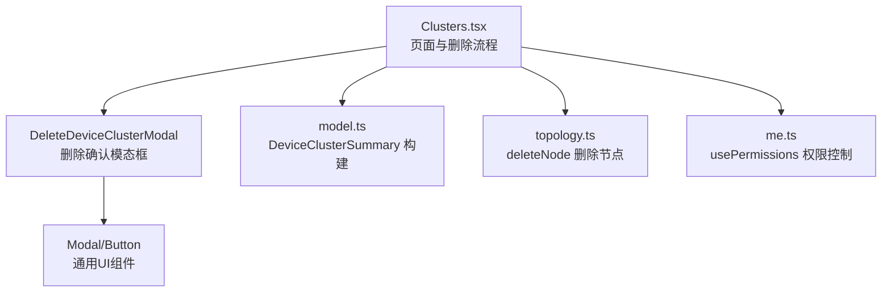
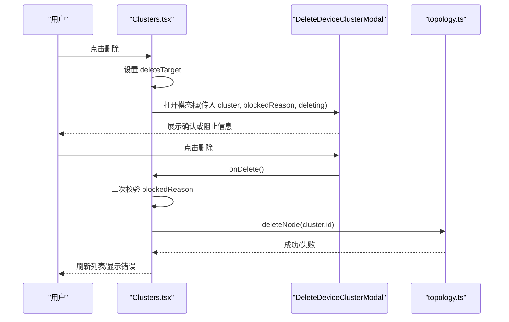
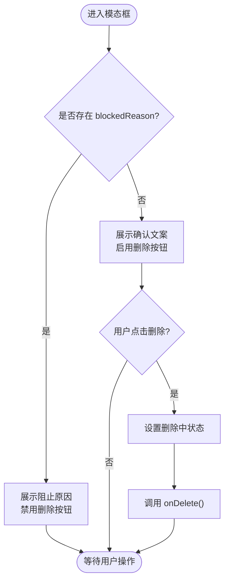
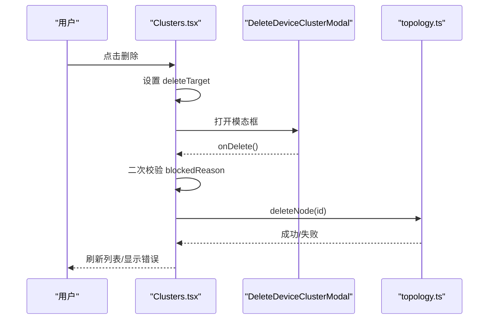
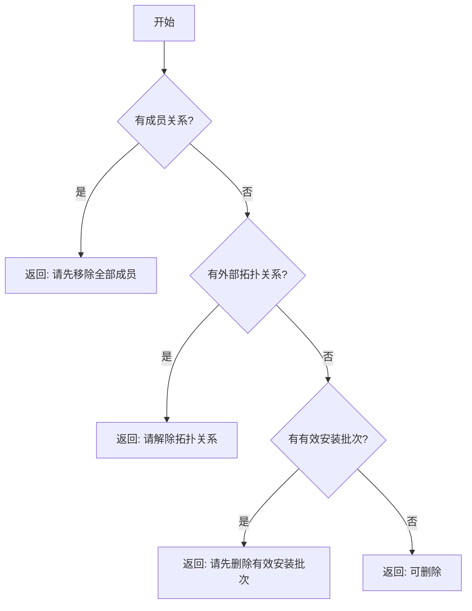
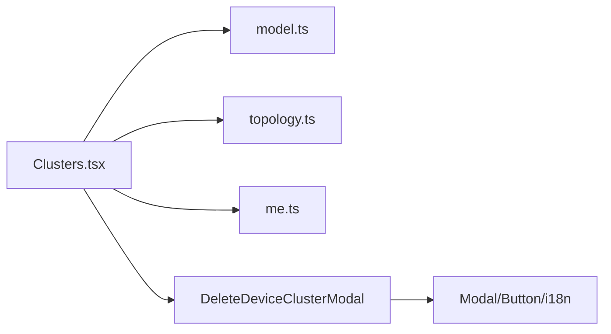

# 删除集群模态框

<cite>
**本文引用的文件**
- [ClusterManagementModals.tsx](file://web/src/pages/clusters/ClusterManagementModals.tsx)
- [Clusters.tsx](file://web/src/pages/Clusters.tsx)
- [model.ts](file://web/src/pages/clusters/model.ts)
- [topology.ts](file://web/src/api/topology.ts)
- [me.ts](file://web/src/store/me.ts)
</cite>

## 目录
1. [简介](#简介)
2. [项目结构](#项目结构)
3. [核心组件](#核心组件)
4. [架构总览](#架构总览)
5. [详细组件分析](#详细组件分析)
6. [依赖关系分析](#依赖关系分析)
7. [性能考虑](#性能考虑)
8. [故障排查指南](#故障排查指南)
9. [结论](#结论)
10. [附录：扩展与级联删除示例](#附录：扩展与级联删除示例)

## 简介
本文聚焦于“删除设备集群”的模态框实现，围绕 DeleteDeviceClusterModal 组件展开，系统说明其确认流程、阻塞原因显示、安全验证机制、用户确认对话框、错误处理策略，以及在不同删除场景下的权限控制。同时提供可扩展的开发示例，帮助在现有删除逻辑基础上添加级联删除能力或增强防误操作体验。

## 项目结构
- 页面层：Clusters.tsx 负责集群列表与详情页的交互编排，包含删除入口、状态管理与调用删除 API。
- 模态框层：ClusterManagementModals.tsx 中的 DeleteDeviceClusterModal 提供统一的删除确认 UI，支持“可删除”和“被阻止”两种展示模式。
- 数据模型层：model.ts 构建 DeviceClusterSummary，聚合成员、外部拓扑关系、安装批次等，供删除阻断判断使用。
- 接口层：topology.ts 封装拓扑节点与关系的 CRUD，其中 deleteNode 用于删除集群节点。
- 权限层：me.ts 暴露 usePermissions，提供 isAdmin 等标志，用于控制删除按钮可见性与可用性。

图表来源
- [Clusters.tsx:136-157](file://web/src/pages/Clusters.tsx#L136-L157)
- [ClusterManagementModals.tsx:380-422](file://web/src/pages/clusters/ClusterManagementModals.tsx#L380-L422)
- [model.ts:21-77](file://web/src/pages/clusters/model.ts#L21-L77)
- [topology.ts:45-47](file://web/src/api/topology.ts#L45-L47)
- [me.ts:100-113](file://web/src/store/me.ts#L100-L113)

章节来源
- [Clusters.tsx:69-157](file://web/src/pages/Clusters.tsx#L69-L157)
- [ClusterManagementModals.tsx:380-422](file://web/src/pages/clusters/ClusterManagementModals.tsx#L380-L422)
- [model.ts:21-77](file://web/src/pages/clusters/model.ts#L21-L77)
- [topology.ts:45-47](file://web/src/api/topology.ts#L45-L47)
- [me.ts:100-113](file://web/src/store/me.ts#L100-L113)

## 核心组件
- DeleteDeviceClusterModal：接收 cluster、blockedReason、deleting、onClose、onDelete 等 props，渲染标题、提示文案与操作按钮。当存在 blockedReason 时，禁用删除按钮并展示黄色警告；否则展示确认文案与危险按钮。
- ClustersPage：维护删除目标 state（deleteTarget）、删除中状态（deletingClusterID），并在 performDelete 中执行前置校验、调用 deleteNode、更新本地列表与错误提示。
- model.ts：通过 buildDeviceClusterSummaries 汇总 memberRelations、externalRelations、activeProfiles 等信息，为删除阻断提供依据。
- topology.ts：提供 deleteNode 删除拓扑节点（集群）。
- me.ts：通过 usePermissions 暴露 isAdmin，控制删除按钮是否可见。

章节来源
- [ClusterManagementModals.tsx:380-422](file://web/src/pages/clusters/ClusterManagementModals.tsx#L380-L422)
- [Clusters.tsx:136-157](file://web/src/pages/Clusters.tsx#L136-L157)
- [model.ts:21-77](file://web/src/pages/clusters/model.ts#L21-L77)
- [topology.ts:45-47](file://web/src/api/topology.ts#L45-L47)
- [me.ts:100-113](file://web/src/store/me.ts#L100-L113)

## 架构总览
删除集群的整体流程如下：
- 用户在集群列表点击“删除”，设置 deleteTarget。
- 打开 DeleteDeviceClusterModal，根据 clusterDeleteBlockedReason 计算 blockedReason。
- 若 blockedReason 为空，用户确认后触发 onDelete -> performDelete。
- performDelete 再次校验 blockedReason，然后调用 deleteNode，成功后从本地 summaries 移除该集群并关闭模态框。
- 若失败，捕获错误并展示错误提示。

图表来源
- [Clusters.tsx:136-157](file://web/src/pages/Clusters.tsx#L136-L157)
- [ClusterManagementModals.tsx:380-422](file://web/src/pages/clusters/ClusterManagementModals.tsx#L380-L422)
- [topology.ts:45-47](file://web/src/api/topology.ts#L45-L47)

## 详细组件分析

### DeleteDeviceClusterModal 组件
- 输入参数
  - cluster：当前要删除的集群节点对象。
  - blockedReason：字符串或 undefined，表示删除被阻止的原因。
  - deleting：布尔值，指示删除进行中。
  - onClose：关闭模态框回调。
  - onDelete：用户确认删除后的回调。
- 行为
  - 当 blockedReason 存在时，禁用删除按钮并展示黄色警告区域，提示用户先满足删除前置条件。
  - 当 blockedReason 不存在时，展示确认文案，允许用户点击删除。
  - 删除过程中按钮显示“删除中…”，防止重复提交。
- 用户体验
  - 明确区分“可删除”和“不可删除”两种状态，避免误删。
  - 使用危险按钮样式强化删除操作的严重性。
  - 文案国际化，支持中英文切换。

图表来源
- [ClusterManagementModals.tsx:380-422](file://web/src/pages/clusters/ClusterManagementModals.tsx#L380-L422)

章节来源
- [ClusterManagementModals.tsx:380-422](file://web/src/pages/clusters/ClusterManagementModals.tsx#L380-L422)

### 删除流程与权限控制（Clusters.tsx）
- 权限控制
  - 仅管理员可见删除按钮：通过 usePermissions().isAdmin 控制。
  - 非管理员无法看到删除入口，降低误操作风险。
- 删除前校验
  - 使用 clusterDeleteBlockedReason 进行前置检查，包括：
    - 是否有成员关系（memberRelations.length > 0）。
    - 是否仍有外部拓扑关系引用（externalRelations.length > 0）。
    - 是否仍存在有效安装批次（activeProfiles > 0）。
- 删除执行
  - 调用 deleteNode 删除拓扑节点。
  - 成功后从本地 summaries 过滤掉已删除集群，并关闭模态框。
  - 失败时捕获错误并展示错误提示。
- 状态管理
  - deletingClusterID 用于标记正在删除的集群，避免并发重复提交。
  - error 用于统一展示错误信息。

图表来源
- [Clusters.tsx:136-157](file://web/src/pages/Clusters.tsx#L136-L157)
- [topology.ts:45-47](file://web/src/api/topology.ts#L45-L47)

章节来源
- [Clusters.tsx:136-157](file://web/src/pages/Clusters.tsx#L136-L157)
- [Clusters.tsx:435-458](file://web/src/pages/Clusters.tsx#L435-L458)
- [Clusters.tsx:709-725](file://web/src/pages/Clusters.tsx#L709-L725)
- [Clusters.tsx:761-776](file://web/src/pages/Clusters.tsx#L761-L776)

### 删除阻断规则（clusterDeleteBlockedReason）
- 规则来源
  - 列表页与详情页均复用同一规则函数，保证一致性。
- 规则内容
  - 如果存在成员关系，提示“请先移除全部成员，再删除集群”。
  - 如果存在外部拓扑关系，提示“集群仍被其他拓扑关系引用，请先在拓扑页解除关系”。
  - 如果存在有效安装批次，提示“请先删除全部有效安装批次，再删除集群”。
- 作用
  - 防止破坏拓扑完整性与业务一致性。
  - 为用户提供明确的修复指引。

图表来源
- [Clusters.tsx:435-458](file://web/src/pages/Clusters.tsx#L435-L458)

章节来源
- [Clusters.tsx:435-458](file://web/src/pages/Clusters.tsx#L435-L458)

### 数据模型与聚合（model.ts）
- DeviceClusterSummary
  - 包含 cluster、members、memberRelations、externalRelations、profiles、online/offline、activeProfiles、lastMemberSeenAt。
- 构建逻辑
  - 通过 relations 筛选 member_of 类型关系得到成员关系。
  - 排除 memberRelationIDs 后得到 externalRelations。
  - 统计在线/离线数量与有效安装批次数量。
- 用途
  - 为删除阻断、列表展示、详情页展示提供数据基础。

章节来源
- [model.ts:5-15](file://web/src/pages/clusters/model.ts#L5-L15)
- [model.ts:21-77](file://web/src/pages/clusters/model.ts#L21-L77)

### 接口层（topology.ts）
- deleteNode
  - 发送 DELETE /topology/nodes/:id 请求，删除拓扑节点。
  - 服务端侧对写操作进行管理员权限校验，前端隐藏入口作为第一道防线。

章节来源
- [topology.ts:45-47](file://web/src/api/topology.ts#L45-L47)

### 权限控制（me.ts）
- usePermissions
  - 基于 me.role 派生 isAdmin、isUser、isViewer、canMutate。
  - 首次渲染时使用 authRole 避免闪烁。
- 作用
  - 控制删除按钮可见性与可用性，确保只有管理员能触发删除流程。

章节来源
- [me.ts:100-113](file://web/src/store/me.ts#L100-L113)

## 依赖关系分析
- 组件耦合
  - DeleteDeviceClusterModal 低耦合，仅依赖通用 UI 组件与 i18n。
  - Clusters.tsx 高内聚，集中管理删除流程、状态与错误。
- 直接依赖
  - Clusters.tsx 依赖 model.ts（构建摘要）、topology.ts（删除节点）、me.ts（权限）。
  - ClusterManagementModals.tsx 依赖 Modal/Button 与 i18n。
- 间接依赖
  - 通过 API client 发起网络请求，受后端 RBAC 保护。
- 循环依赖
  - 无循环依赖，模块职责清晰。

图表来源
- [Clusters.tsx:136-157](file://web/src/pages/Clusters.tsx#L136-L157)
- [ClusterManagementModals.tsx:380-422](file://web/src/pages/clusters/ClusterManagementModals.tsx#L380-L422)
- [model.ts:21-77](file://web/src/pages/clusters/model.ts#L21-L77)
- [topology.ts:45-47](file://web/src/api/topology.ts#L45-L47)
- [me.ts:100-113](file://web/src/store/me.ts#L100-L113)

章节来源
- [Clusters.tsx:136-157](file://web/src/pages/Clusters.tsx#L136-L157)
- [ClusterManagementModals.tsx:380-422](file://web/src/pages/clusters/ClusterManagementModals.tsx#L380-L422)
- [model.ts:21-77](file://web/src/pages/clusters/model.ts#L21-L77)
- [topology.ts:45-47](file://web/src/api/topology.ts#L45-L47)
- [me.ts:100-113](file://web/src/store/me.ts#L100-L113)

## 性能考虑
- 列表加载优化
  - 使用 Promise.all 并行加载节点、设备、关系、安装批次等数据，减少 RTT。
- 删除操作
  - 通过 deletingClusterID 防止重复提交，避免不必要的网络请求。
- 前端缓存
  - 删除成功后立即更新本地 summaries，提升响应速度。
- 建议
  - 对于大规模集群，可在删除前预检依赖关系，提前提示用户需要清理的内容，减少往返次数。

[本节为通用性能讨论，不直接分析具体文件]

## 故障排查指南
- 常见问题
  - 删除按钮不可用：检查 blockedReason 是否为空，查看成员关系、外部拓扑关系、有效安装批次。
  - 删除失败：查看错误提示，确认网络与服务端权限。
  - 权限不足：确认当前用户角色为 admin。
- 定位步骤
  - 打开浏览器开发者工具，观察网络请求与响应。
  - 检查 Clusters.tsx 中的 error 状态与提示信息。
  - 核对 model.ts 构建的 summary 是否正确。
- 常见错误映射
  - 403：权限不足，需管理员角色。
  - 404：集群不存在或已被删除。
  - 422：前置条件未满足，按 blockedReason 提示修复。

章节来源
- [Clusters.tsx:136-157](file://web/src/pages/Clusters.tsx#L136-L157)
- [Clusters.tsx:435-458](file://web/src/pages/Clusters.tsx#L435-L458)
- [topology.ts:45-47](file://web/src/api/topology.ts#L45-L47)

## 结论
DeleteDeviceClusterModal 以简洁的 UI 与清晰的交互流程实现了安全的集群删除确认。结合 clusterDeleteBlockedReason 的前置校验与 usePermissions 的权限控制，系统在用户体验与安全性之间取得良好平衡。通过 model.ts 的数据聚合，删除阻断规则具备高内聚与易扩展性。建议在后续迭代中增加级联删除能力与更丰富的防误操作提示，进一步提升运维效率与安全性。

[本节为总结，不直接分析具体文件]

## 附录：扩展与级联删除示例
- 扩展现有删除逻辑
  - 在 clusterDeleteBlockedReason 中新增自定义规则，例如检查是否有关联的告警规则或报表，阻止删除并给出指引。
  - 在 DeleteDeviceClusterModal 中根据 blockedReason 动态调整提示文案，提供更具体的修复步骤。
- 添加级联删除功能
  - 在 performDelete 中，先批量删除 memberRelations 与 externalRelations，再调用 deleteNode。
  - 增加“级联删除”开关，让用户选择是否自动清理依赖关系。
  - 在模态框中展示将要删除的资源清单，要求用户二次确认。
- 防误操作增强
  - 引入输入确认（如输入集群名称）后再允许删除。
  - 增加冷却时间，限制短时间内的重复删除尝试。
  - 记录审计日志，便于追溯删除操作。

[本节为概念性扩展建议，不直接分析具体文件]