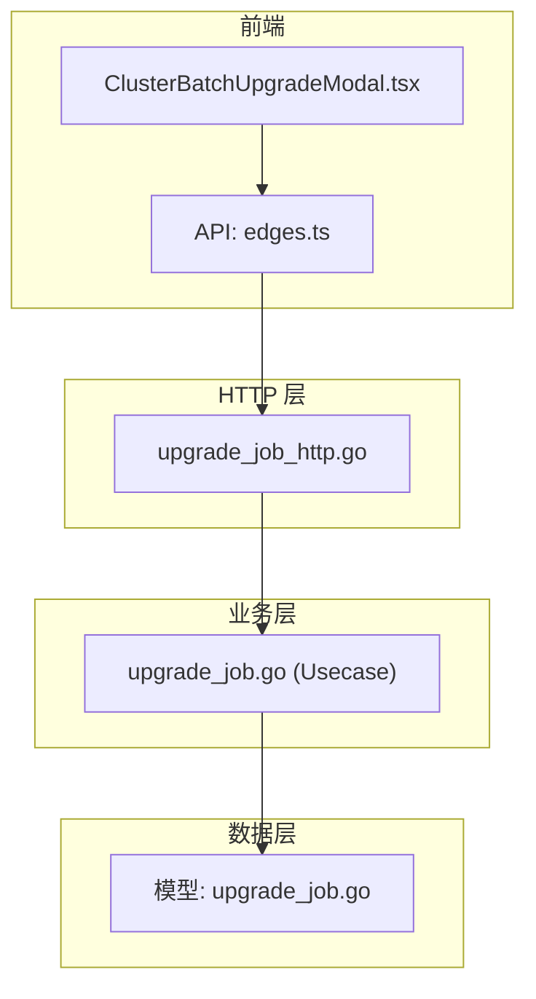
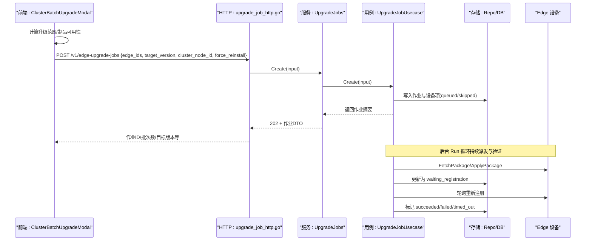
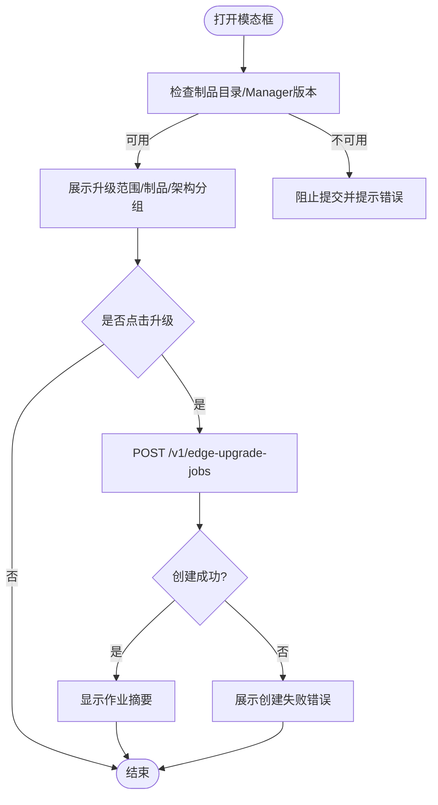
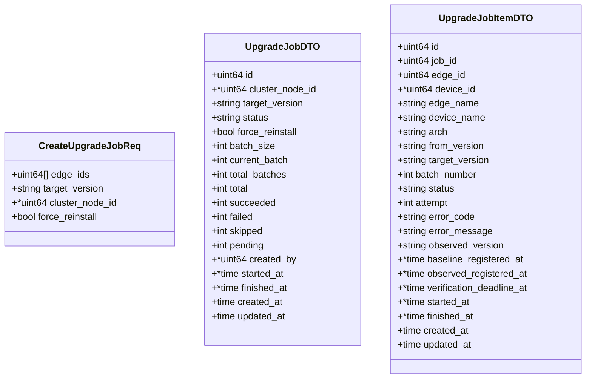
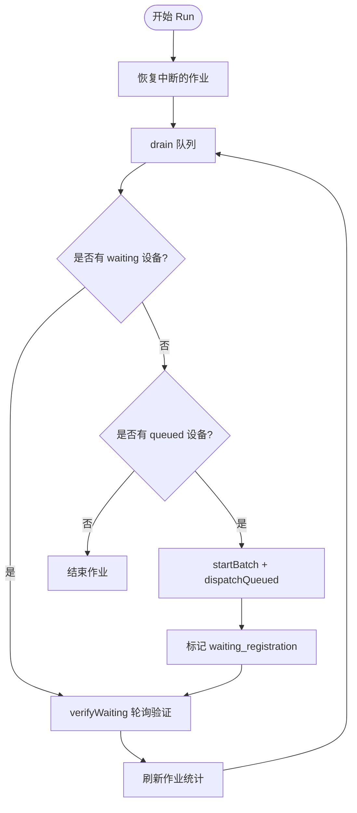
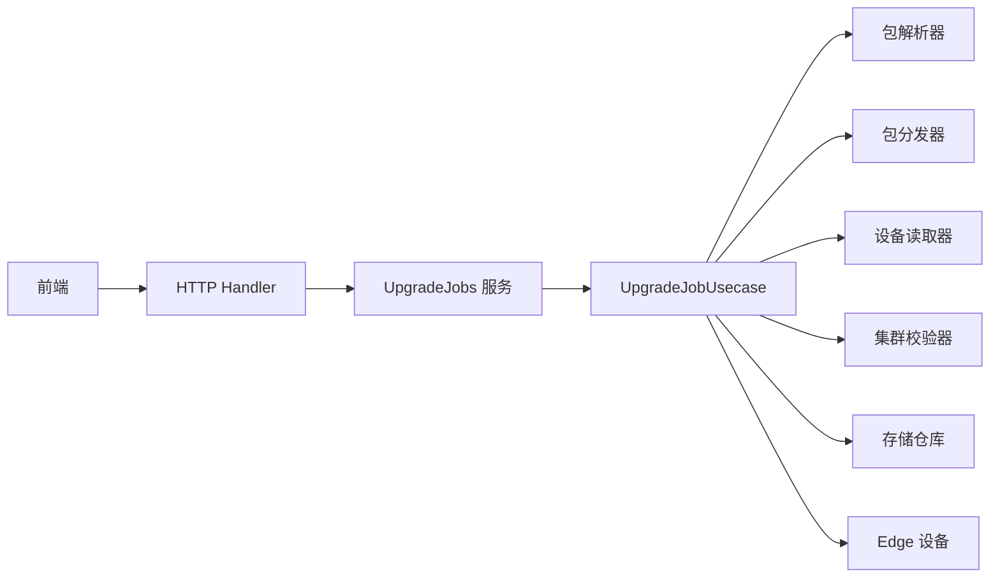

# 批量升级模态框

<cite>
**本文引用的文件**
- [ClusterBatchUpgradeModal.tsx](file://web/src/pages/clusters/ClusterBatchUpgradeModal.tsx)
- [edges.ts](file://web/src/api/edges.ts)
- [upgrade_job.go](file://internal/manager/biz/edge/upgrade_job.go)
- [upgrade_job_http.go](file://internal/manager/server/edge/upgrade_job_http.go)
- [upgrade_job.go（模型）](file://internal/manager/model/edge/upgrade_job.go)
- [http.go（系统升级检查）](file://internal/manager/server/systemupgrade/http.go)
</cite>

## 目录
1. [简介](#简介)
2. [项目结构](#项目结构)
3. [核心组件](#核心组件)
4. [架构总览](#架构总览)
5. [详细组件分析](#详细组件分析)
6. [依赖关系分析](#依赖关系分析)
7. [性能与并发控制](#性能与并发控制)
8. [故障排查指南](#故障排查指南)
9. [结论](#结论)
10. [附录：扩展与自定义步骤示例](#附录：扩展与自定义步骤示例)

## 简介
本技术文档围绕“批量升级模态框”展开，重点解析前端 ClusterBatchUpgradeModal 组件如何完成升级包选择、部署计划制定与执行监控；并深入说明后端升级服务的状态机、进度跟踪、错误恢复机制以及与后端的交互协议和数据格式。同时给出并发控制、资源管理细节以及扩展现有升级策略或添加自定义升级步骤的开发指引。

## 项目结构
该功能横跨前端 UI、HTTP API、业务编排与持久化层：
- 前端：ClusterBatchUpgradeModal 负责用户交互、预检查展示、提交升级任务与结果反馈。
- HTTP 层：暴露创建、查询、重试等接口，封装请求/响应 DTO。
- 业务层：UpgradeJobUsecase 实现升级作业的状态机、批次调度、分发与验证。
- 数据层：持久化作业与设备项状态，支持恢复与清理。

图表来源
- [ClusterBatchUpgradeModal.tsx:1-159](file://web/src/pages/clusters/ClusterBatchUpgradeModal.tsx#L1-L159)
- [edges.ts:163-221](file://web/src/api/edges.ts#L163-L221)
- [upgrade_job_http.go:81-176](file://internal/manager/server/edge/upgrade_job_http.go#L81-L176)
- [upgrade_job.go:105-197](file://internal/manager/biz/edge/upgrade_job.go#L105-L197)
- [upgrade_job.go（模型）:5-21](file://internal/manager/model/edge/upgrade_job.go#L5-L21)

章节来源
- [ClusterBatchUpgradeModal.tsx:1-159](file://web/src/pages/clusters/ClusterBatchUpgradeModal.tsx#L1-L159)
- [edges.ts:163-221](file://web/src/api/edges.ts#L163-L221)
- [upgrade_job_http.go:81-176](file://internal/manager/server/edge/upgrade_job_http.go#L81-L176)
- [upgrade_job.go:105-197](file://internal/manager/biz/edge/upgrade_job.go#L105-L197)
- [upgrade_job.go（模型）:5-21](file://internal/manager/model/edge/upgrade_job.go#L5-L21)

## 核心组件
- 前端模态框：负责升级范围展示、制品可用性校验、强制重装开关、提交任务与结果提示。
- 升级作业服务：提供创建、列表、详情、重试能力，将请求转换为领域输入并委托给 Usecase。
- 升级作业用例：维护持久化的作业状态机，按批次派发升级包，轮询设备重新注册以确认成功，支持超时与失败处理。
- 数据模型：定义作业与设备项的状态常量、默认批次大小等。

章节来源
- [ClusterBatchUpgradeModal.tsx:24-159](file://web/src/pages/clusters/ClusterBatchUpgradeModal.tsx#L24-L159)
- [upgrade_job_http.go:16-80](file://internal/manager/server/edge/upgrade_job_http.go#L16-L80)
- [upgrade_job.go:19-53](file://internal/manager/biz/edge/upgrade_job.go#L19-L53)
- [upgrade_job.go（模型）:5-21](file://internal/manager/model/edge/upgrade_job.go#L5-L21)

## 架构总览
下图展示了从前端到后端的完整调用链与职责划分。

图表来源
- [ClusterBatchUpgradeModal.tsx:76-98](file://web/src/pages/clusters/ClusterBatchUpgradeModal.tsx#L76-L98)
- [upgrade_job_http.go:81-111](file://internal/manager/server/edge/upgrade_job_http.go#L81-L111)
- [upgrade_job.go:301-338](file://internal/manager/biz/edge/upgrade_job.go#L301-L338)
- [upgrade_job.go:442-564](file://internal/manager/biz/edge/upgrade_job.go#L442-L564)

## 详细组件分析

### 前端：ClusterBatchUpgradeModal
- 升级包选择与计划制定
  - 通过传入的 plan/forcePlan 与 bundles 展示可升级设备、制品就绪情况与架构分组。
  - 支持“强制重新安装同版本设备”选项，切换使用 forcePlan。
- 提交与结果反馈
  - 点击升级按钮时调用 createEdgeUpgradeJob，传递 edge_ids、target_version、cluster_node_id、force_reinstall。
  - 成功后显示作业摘要（目标版本、滚动批次、总数、成功/失败/待处理等），并提供关闭并在升级记录中查看的入口。
- 错误与阻断
  - 若制品目录不可用或 Manager 版本未知，则阻止提交并展示错误信息。

图表来源
- [ClusterBatchUpgradeModal.tsx:55-98](file://web/src/pages/clusters/ClusterBatchUpgradeModal.tsx#L55-L98)
- [ClusterBatchUpgradeModal.tsx:100-159](file://web/src/pages/clusters/ClusterBatchUpgradeModal.tsx#L100-L159)
- [edges.ts:214-221](file://web/src/api/edges.ts#L214-L221)

章节来源
- [ClusterBatchUpgradeModal.tsx:24-159](file://web/src/pages/clusters/ClusterBatchUpgradeModal.tsx#L24-L159)
- [edges.ts:163-221](file://web/src/api/edges.ts#L163-L221)

### 后端：HTTP 接口与 DTO
- 创建升级作业
  - 路径：POST /v1/edge-upgrade-jobs
  - 请求体：edge_ids、target_version、cluster_node_id（可选）、force_reinstall（可选）
  - 响应：202 Accepted + 作业 DTO（包含 batch_size、current_batch、total_batches、pending、succeeded、failed、skipped、target_version 等）
- 查询作业与详情
  - GET /v1/edge-upgrade-jobs?page&page_size&cluster_node_id
  - GET /v1/edge-upgrade-jobs/{id}
- 重试失败/超时的设备
  - POST /v1/edge-upgrade-jobs/{id}/retry → 202 Accepted

图表来源
- [upgrade_job_http.go:16-80](file://internal/manager/server/edge/upgrade_job_http.go#L16-L80)
- [upgrade_job_http.go:219-243](file://internal/manager/server/edge/upgrade_job_http.go#L219-L243)

章节来源
- [upgrade_job_http.go:81-176](file://internal/manager/server/edge/upgrade_job_http.go#L81-L176)
- [upgrade_job_http.go:219-243](file://internal/manager/server/edge/upgrade_job_http.go#L219-L243)

### 业务层：升级作业状态机与执行流程
- 创建作业
  - 规范化 Edge ID、校验目标版本、可选集群拓扑校验。
  - 对每个 Edge 判定是否跳过（离线、不支持架构、已是目标版本）。
  - 解析并校验各架构对应的升级包版本一致性。
  - 持久化作业与设备项，进入 queued/skipped 状态。
- 后台运行与批次调度
  - Run 循环恢复中断作业，周期性 drain 队列。
  - processJob 优先处理 waiting_registration 的设备，再派发 queued 的设备。
  - 每批设备并发派发（受 Concurrency 限制），派发后进入 waiting_registration 等待重新注册。
- 验证与收尾
  - verifyWaiting 周期轮询设备重新注册，达到目标版本且在线即标记 succeeded；否则在 deadline 到达后标记 timed_out。
  - 作业完成后刷新统计并结束。

图表来源
- [upgrade_job.go:301-338](file://internal/manager/biz/edge/upgrade_job.go#L301-L338)
- [upgrade_job.go:365-429](file://internal/manager/biz/edge/upgrade_job.go#L365-L429)
- [upgrade_job.go:442-564](file://internal/manager/biz/edge/upgrade_job.go#L442-L564)
- [upgrade_job.go:573-631](file://internal/manager/biz/edge/upgrade_job.go#L573-L631)

章节来源
- [upgrade_job.go:105-197](file://internal/manager/biz/edge/upgrade_job.go#L105-L197)
- [upgrade_job.go:301-338](file://internal/manager/biz/edge/upgrade_job.go#L301-L338)
- [upgrade_job.go:365-429](file://internal/manager/biz/edge/upgrade_job.go#L365-L429)
- [upgrade_job.go:442-564](file://internal/manager/biz/edge/upgrade_job.go#L442-L564)
- [upgrade_job.go:573-631](file://internal/manager/biz/edge/upgrade_job.go#L573-L631)

### 数据模型与状态
- 作业状态：queued、running、succeeded、partial_failed、failed
- 设备项状态：queued、dispatching、waiting_registration、succeeded、failed、timed_out、skipped
- 默认批次大小：10

章节来源
- [upgrade_job.go（模型）:5-21](file://internal/manager/model/edge/upgrade_job.go#L5-L21)

## 依赖关系分析
- 前端依赖 HTTP API 进行任务创建与查询。
- HTTP 层依赖服务门面，服务门面委托业务用例。
- 业务用例依赖：
  - 设备读取器（获取 Edge/Device 信息）
  - 集群校验器（可选，用于集群级约束）
  - 包分发器（FetchPackage/ApplyPackage）
  - 包解析器（ResolveBundle）
  - 存储仓库（持久化作业与设备项）
- 外部依赖：Edge 设备通过隧道下发升级包并重启重新注册。

图表来源
- [upgrade_job_http.go:81-176](file://internal/manager/server/edge/upgrade_job_http.go#L81-L176)
- [upgrade_job.go:19-53](file://internal/manager/biz/edge/upgrade_job.go#L19-L53)
- [upgrade_job.go:442-564](file://internal/manager/biz/edge/upgrade_job.go#L442-L564)

章节来源
- [upgrade_job_http.go:81-176](file://internal/manager/server/edge/upgrade_job_http.go#L81-L176)
- [upgrade_job.go:19-53](file://internal/manager/biz/edge/upgrade_job.go#L19-L53)

## 性能与并发控制
- 批次大小：默认每批最多 10 台设备，确保滚动发布可控。
- 并发度：默认并发 8，限制同一批次内并行派发数量，避免过载。
- 验证间隔与超时：默认 2 秒轮询，90 秒验证超时，保证及时推进与兜底。
- 派发超时：默认 5 分钟，防止长时间阻塞。
- 资源清理：定期清理历史作业，保留期默认 90 天。
- 最大作业规模：单作业最多 500 个 Edge，防止过大任务影响稳定性。

章节来源
- [upgrade_job.go:80-97](file://internal/manager/biz/edge/upgrade_job.go#L80-L97)
- [upgrade_job.go:665-683](file://internal/manager/biz/edge/upgrade_job.go#L665-L683)
- [upgrade_job.go:692-709](file://internal/manager/biz/edge/upgrade_job.go#L692-L709)

## 故障排查指南
- 制品目录不可用或版本不匹配
  - 现象：前端阻止提交或后端创建失败。
  - 定位：检查 ResolveBundle 返回值与目标版本一致性。
- 设备离线或未关联 Host Edge
  - 现象：设备项被标记为 skipped，错误码 edge_offline/unlinked。
  - 处理：确保设备在线并正确关联。
- 架构不支持
  - 现象：仅支持 linux-amd64/linux-arm64，其他架构会被跳过。
- 派发失败或应用被拒绝
  - 现象：设备项标记 failed，错误码 fetch_failed/apply_rejected。
  - 处理：检查 Edge 侧网络、权限与升级包兼容性。
- 验证超时
  - 现象：设备未在截止时间内以目标版本重新注册，标记 timed_out。
  - 处理：检查 Edge 升级流程与回滚逻辑，必要时重试。
- 重试操作
  - 接口：POST /v1/edge-upgrade-jobs/{id}/retry
  - 作用：对失败或超时的设备重新派发。

章节来源
- [upgrade_job.go:121-183](file://internal/manager/biz/edge/upgrade_job.go#L121-L183)
- [upgrade_job.go:491-564](file://internal/manager/biz/edge/upgrade_job.go#L491-L564)
- [upgrade_job.go:573-631](file://internal/manager/biz/edge/upgrade_job.go#L573-L631)
- [upgrade_job_http.go:178-198](file://internal/manager/server/edge/upgrade_job_http.go#L178-L198)

## 结论
批量升级模态框通过清晰的前端交互与稳健的后端状态机，实现了安全的滚动升级。其关键优势包括：
- 明确的升级范围与制品校验，降低误操作风险。
- 基于批次与并发控制的派发策略，保障系统稳定。
- 以设备重新注册为目标的成功判定，确保升级结果可靠。
- 完善的错误分类与重试机制，便于问题定位与恢复。

## 附录：扩展与自定义步骤示例
- 扩展现有升级策略
  - 在业务层增加新的前置校验或后置动作（例如：升级前备份、升级后健康检查）。
  - 参考现有 ResolveBundle/FetchPackage/ApplyPackage 的接口抽象，注入自定义实现。
  - 在状态机中添加新状态或分支，确保幂等与可恢复性。
- 添加自定义升级步骤
  - 新增一个 Hook 点（如：pre-apply/post-apply），在派发前后执行自定义脚本或服务调用。
  - 通过配置项控制是否启用该步骤，保持向后兼容。
  - 在失败时记录错误码与消息，便于前端展示与重试。
- 并发与资源管理
  - 调整 Concurrency/BatchSize 以适应不同环境负载。
  - 合理设置 VerifyInterval/VerifyTimeout/DispatchTimeout，平衡时效性与资源占用。
  - 利用 Retention 控制历史数据保留周期，避免存储膨胀。

章节来源
- [upgrade_job.go:19-53](file://internal/manager/biz/edge/upgrade_job.go#L19-L53)
- [upgrade_job.go:80-97](file://internal/manager/biz/edge/upgrade_job.go#L80-L97)
- [upgrade_job.go:442-564](file://internal/manager/biz/edge/upgrade_job.go#L442-L564)
- [upgrade_job.go:665-683](file://internal/manager/biz/edge/upgrade_job.go#L665-L683)