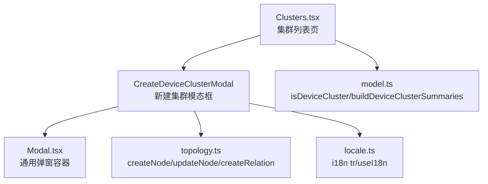
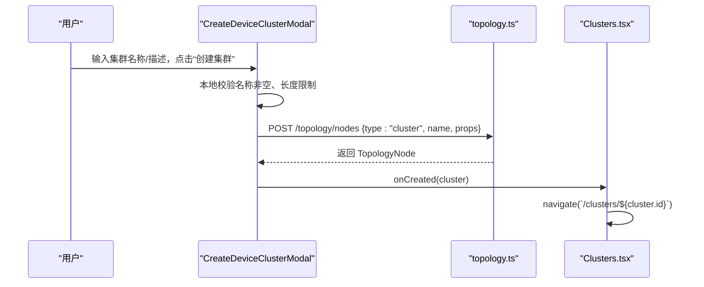
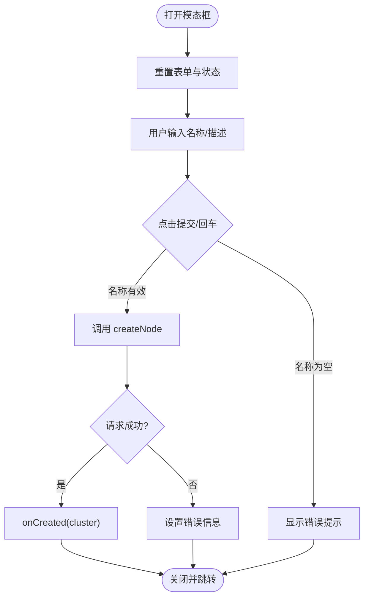
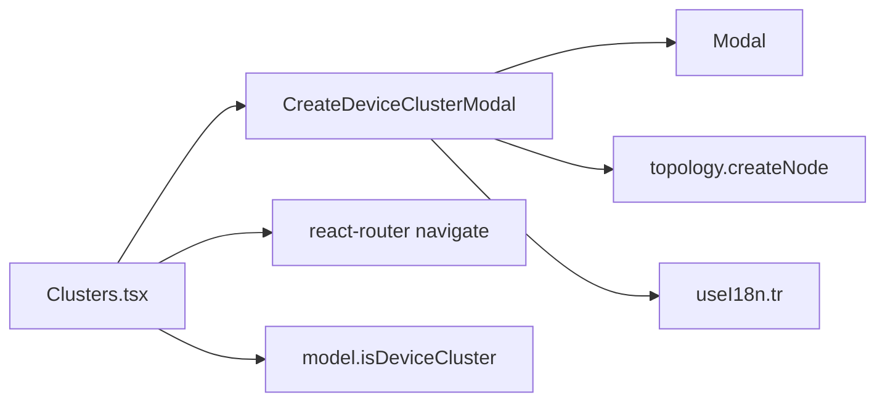

# 新建集群模态框

<cite>
**本文引用的文件**
- [ClusterManagementModals.tsx](file://web/src/pages/clusters/ClusterManagementModals.tsx)
- [Clusters.tsx](file://web/src/pages/Clusters.tsx)
- [topology.ts](file://web/src/api/topology.ts)
- [Modal.tsx](file://web/src/components/Modal.tsx)
- [locale.ts](file://web/src/i18n/locale.ts)
- [model.ts](file://web/src/pages/clusters/model.ts)
</cite>

## 目录
1. [简介](#简介)
2. [项目结构](#项目结构)
3. [核心组件](#核心组件)
4. [架构总览](#架构总览)
5. [详细组件分析](#详细组件分析)
6. [依赖关系分析](#依赖关系分析)
7. [性能与可用性](#性能与可用性)
8. [故障排查指南](#故障排查指南)
9. [结论](#结论)
10. [附录：扩展示例](#附录：扩展示例)

## 简介
本技术文档聚焦于“新建设备集群”的模态框实现，围绕 CreateDeviceClusterModal 组件展开，系统性说明其表单验证、状态管理、API 调用流程、生命周期管理、错误处理与用户反馈机制。同时覆盖国际化支持与响应式设计的实现细节，并提供扩展新属性或自定义校验规则的实践示例。

## 项目结构
该功能位于前端 Web 工程，主要涉及以下模块：
- 页面与模态框：web/src/pages/clusters/ClusterManagementModals.tsx
- 父级页面与路由跳转：web/src/pages/Clusters.tsx
- 拓扑系统 API：web/src/api/topology.ts
- 通用弹窗容器：web/src/components/Modal.tsx
- 国际化：web/src/i18n/locale.ts
- 集群模型与汇总逻辑：web/src/pages/clusters/model.ts

图表来源
- [Clusters.tsx:285-292](file://web/src/pages/Clusters.tsx#L285-L292)
- [ClusterManagementModals.tsx:21-113](file://web/src/pages/clusters/ClusterManagementModals.tsx#L21-L113)
- [topology.ts:37-43](file://web/src/api/topology.ts#L37-L43)
- [Modal.tsx:27-133](file://web/src/components/Modal.tsx#L27-L133)
- [locale.ts:74-101](file://web/src/i18n/locale.ts#L74-L101)
- [model.ts:17-19](file://web/src/pages/clusters/model.ts#L17-L19)

章节来源
- [Clusters.tsx:285-292](file://web/src/pages/Clusters.tsx#L285-L292)
- [ClusterManagementModals.tsx:21-113](file://web/src/pages/clusters/ClusterManagementModals.tsx#L21-L113)
- [topology.ts:37-43](file://web/src/api/topology.ts#L37-L43)
- [Modal.tsx:27-133](file://web/src/components/Modal.tsx#L27-L133)
- [locale.ts:74-101](file://web/src/i18n/locale.ts#L74-L101)
- [model.ts:17-19](file://web/src/pages/clusters/model.ts#L17-L19)

## 核心组件
- CreateDeviceClusterModal：负责新建设备集群的表单交互、本地校验、提交到拓扑系统并回调父组件完成导航。
- Clusters.tsx：提供打开模态框的入口，并在创建成功后跳转到新集群详情页。
- Modal：通用对话框容器，提供键盘关闭、遮罩点击关闭、尺寸控制与可拖拽宽度等能力。
- topology.ts：封装拓扑系统的节点与关系 CRUD 接口，包括 createNode、updateNode、createRelation 等。
- locale.ts：提供 i18n 能力，支持中英文切换与自动检测。
- model.ts：定义设备集群的判断与汇总逻辑，供列表与详情使用。

章节来源
- [ClusterManagementModals.tsx:21-113](file://web/src/pages/clusters/ClusterManagementModals.tsx#L21-L113)
- [Clusters.tsx:285-292](file://web/src/pages/Clusters.tsx#L285-L292)
- [topology.ts:37-43](file://web/src/api/topology.ts#L37-L43)
- [Modal.tsx:27-133](file://web/src/components/Modal.tsx#L27-L133)
- [locale.ts:74-101](file://web/src/i18n/locale.ts#L74-L101)
- [model.ts:17-19](file://web/src/pages/clusters/model.ts#L17-L19)

## 架构总览
下图展示了从用户操作到数据落库的完整链路：用户在模态框中输入名称与描述，触发提交；组件进行本地校验后调用拓扑 API 创建节点；成功后通过回调通知父页面，由父页面执行路由跳转。

图表来源
- [ClusterManagementModals.tsx:40-63](file://web/src/pages/clusters/ClusterManagementModals.tsx#L40-L63)
- [topology.ts:37-39](file://web/src/api/topology.ts#L37-L39)
- [Clusters.tsx:285-292](file://web/src/pages/Clusters.tsx#L285-L292)

## 详细组件分析

### CreateDeviceClusterModal 组件
- 表单字段
  - 集群名称：必填，最大长度 128，回车可提交。
  - 说明（可选）：最大长度 500，为空时不写入 props。
- 状态管理
  - open：控制模态框显隐。
  - name/description：受控输入。
  - pending：提交中禁用按钮，防止重复提交。
  - error：捕获并展示错误信息。
- 生命周期
  - 当 open 变为 true 时重置表单与状态，确保每次打开都是干净状态。
- 提交流程
  - 先做本地校验（名称非空）。
  - 调用 createNode(type="cluster")，将 source 标记为 manual，可选 description 放入 props。
  - 成功时调用 onCreated 回调，失败时设置 error。
  - finally 中清理 pending。
- 用户反馈
  - 按钮文案在“创建中…”与“创建集群”之间切换。
  - 错误以 InlineError 组件提示。
  - 支持 ESC 关闭与遮罩关闭（由 Modal 提供）。

图表来源
- [ClusterManagementModals.tsx:32-63](file://web/src/pages/clusters/ClusterManagementModals.tsx#L32-L63)
- [ClusterManagementModals.tsx:65-113](file://web/src/pages/clusters/ClusterManagementModals.tsx#L65-L113)

章节来源
- [ClusterManagementModals.tsx:21-113](file://web/src/pages/clusters/ClusterManagementModals.tsx#L21-L113)

### 父页面集成与路由跳转
- 打开入口：管理员权限下显示“新建集群”按钮，点击后设置 createOpen=true。
- 创建成功：CreateDeviceClusterModal 通过 onCreated 回调传递新创建的 cluster，父页面关闭模态框并导航至 /clusters/:id。
- 错误处理：父页面统一维护 loading/error 状态，用于全局提示与重试。

章节来源
- [Clusters.tsx:177-182](file://web/src/pages/Clusters.tsx#L177-L182)
- [Clusters.tsx:285-292](file://web/src/pages/Clusters.tsx#L285-L292)

### 拓扑系统 API 调用
- createNode：POST /topology/nodes，参数包含 type、name、props。
- updateNode：PATCH /topology/nodes/:id，用于重命名等。
- createRelation：POST /topology/relations，用于添加成员关系（member_of）。
- 其他：listNodes、getNode、deleteNode、listRelations 等用于列表与详情。

章节来源
- [topology.ts:23-47](file://web/src/api/topology.ts#L23-L47)
- [topology.ts:65-102](file://web/src/api/topology.ts#L65-L102)

### 国际化支持
- 所有用户可见文本均通过 useI18n().tr(zh, en) 包裹，支持中英文切换。
- 自动检测策略基于时区与浏览器语言，默认中文环境优先。
- 切换语言时通过 window 事件触发 re-render，无需额外状态管理。

章节来源
- [locale.ts:1-101](file://web/src/i18n/locale.ts#L1-L101)
- [ClusterManagementModals.tsx:26-113](file://web/src/pages/clusters/ClusterManagementModals.tsx#L26-L113)

### 响应式设计
- Modal 容器提供 sm/md/lg/xl 尺寸预设，并通过 max-h-[90vh] 保证内容滚动。
- 支持 resizable 能力（当前未在新建集群中使用），可通过拖拽边缘调整宽度。
- 表单控件采用全宽布局与紧凑字号，适配移动端阅读与操作。

章节来源
- [Modal.tsx:27-133](file://web/src/components/Modal.tsx#L27-L133)
- [ClusterManagementModals.tsx:65-113](file://web/src/pages/clusters/ClusterManagementModals.tsx#L65-L113)

## 依赖关系分析
- CreateDeviceClusterModal 依赖：
  - Modal：通用弹窗容器。
  - topology.createNode：创建集群节点。
  - i18n：多语言文案。
- Clusters.tsx 依赖：
  - CreateDeviceClusterModal：承载新建表单。
  - router：创建成功后跳转。
  - model.isDeviceCluster：过滤与管理设备集群。

图表来源
- [ClusterManagementModals.tsx:21-113](file://web/src/pages/clusters/ClusterManagementModals.tsx#L21-L113)
- [Clusters.tsx:285-292](file://web/src/pages/Clusters.tsx#L285-L292)
- [topology.ts:37-39](file://web/src/api/topology.ts#L37-L39)
- [model.ts:17-19](file://web/src/pages/clusters/model.ts#L17-L19)

章节来源
- [ClusterManagementModals.tsx:21-113](file://web/src/pages/clusters/ClusterManagementModals.tsx#L21-L113)
- [Clusters.tsx:285-292](file://web/src/pages/Clusters.tsx#L285-L292)
- [topology.ts:37-39](file://web/src/api/topology.ts#L37-L39)
- [model.ts:17-19](file://web/src/pages/clusters/model.ts#L17-L19)

## 性能与可用性
- 防抖与幂等：通过 pending 状态禁用提交按钮，避免重复请求。
- 最小化渲染：仅在 open 变化时重置状态，减少不必要的重渲染。
- 网络错误：统一 catch 并展示友好错误消息，保持 UI 可用。
- 可访问性：Modal 提供 role="dialog"、aria-modal、ESC 关闭、遮罩点击关闭。
- 移动端体验：全宽表单、紧凑字号、滚动区域限制，提升小屏可用性。

[本节为通用指导，不直接分析具体文件]

## 故障排查指南
- 问题：提交后无响应或一直“创建中…”
  - 检查 pending 状态是否正确在 finally 中置回 false。
  - 确认 createNode 是否抛出异常或被拦截。
- 问题：表单提交被阻止
  - 检查名称是否为空或超出长度限制。
  - 查看 InlineError 提示信息。
- 问题：创建成功后未跳转
  - 确认 onCreated 回调是否被正确调用。
  - 检查路由参数与权限。
- 问题：国际化文案未生效
  - 确认 useI18n() 已引入且 tr 调用位置正确。
  - 检查语言切换事件是否触发。

章节来源
- [ClusterManagementModals.tsx:32-63](file://web/src/pages/clusters/ClusterManagementModals.tsx#L32-L63)
- [ClusterManagementModals.tsx:65-113](file://web/src/pages/clusters/ClusterManagementModals.tsx#L65-L113)
- [locale.ts:74-101](file://web/src/i18n/locale.ts#L74-L101)

## 结论
CreateDeviceClusterModal 以简洁的受控表单实现了设备集群的新建流程，结合拓扑系统 API 完成数据持久化，并通过回调驱动父页面路由跳转。组件具备完善的本地校验、错误处理、国际化与响应式支持，满足日常运维场景下的易用性与稳定性要求。

[本节为总结性内容，不直接分析具体文件]

## 附录：扩展示例

### 新增集群属性（例如：标签 tags）
- 目标：在创建集群时允许用户输入一组标签，并提交到拓扑节点的 props.tags。
- 步骤建议：
  - 在表单中添加标签输入控件（如多选或逗号分隔）。
  - 在 submit 中将 trimmed 后的值序列化为数组或字符串，放入 props.tags。
  - 更新后端契约（如需）并确保 createNode 接受新的 props 字段。
  - 在列表或详情中读取并展示 tags。
- 参考路径
  - 表单状态与提交：[ClusterManagementModals.tsx:27-63](file://web/src/pages/clusters/ClusterManagementModals.tsx#L27-L63)
  - 拓扑节点创建：[topology.ts:37-39](file://web/src/api/topology.ts#L37-L39)

章节来源
- [ClusterManagementModals.tsx:27-63](file://web/src/pages/clusters/ClusterManagementModals.tsx#L27-L63)
- [topology.ts:37-39](file://web/src/api/topology.ts#L37-L39)

### 添加自定义验证规则（例如：名称唯一性）
- 目标：在提交前检查集群名称是否已存在。
- 步骤建议：
  - 在 submit 中调用 listNodes({ type: "cluster", q: name }) 进行查重。
  - 若存在则设置 error 并阻止提交。
  - 注意异步校验与 pending 状态的配合。
- 参考路径
  - 列表查询：[topology.ts:23-31](file://web/src/api/topology.ts#L23-L31)
  - 提交流程：[ClusterManagementModals.tsx:40-63](file://web/src/pages/clusters/ClusterManagementModals.tsx#L40-L63)

章节来源
- [topology.ts:23-31](file://web/src/api/topology.ts#L23-L31)
- [ClusterManagementModals.tsx:40-63](file://web/src/pages/clusters/ClusterManagementModals.tsx#L40-L63)

### 扩展成员添加流程（已有）
- 目标：将设备加入集群，建立 member_of 关系。
- 步骤建议：
  - 选择设备后调用 createRelation(src_id=device.node_id, dst_id=cluster.id, type="member_of")。
  - 批量添加时使用 Promise.all 并发提交。
  - 成功后刷新列表或回调父组件。
- 参考路径
  - 添加成员模态框：[ClusterManagementModals.tsx:201-265](file://web/src/pages/clusters/ClusterManagementModals.tsx#L201-L265)
  - 关系创建：[topology.ts:87-94](file://web/src/api/topology.ts#L87-L94)

章节来源
- [ClusterManagementModals.tsx:201-265](file://web/src/pages/clusters/ClusterManagementModals.tsx#L201-L265)
- [topology.ts:87-94](file://web/src/api/topology.ts#L87-L94)